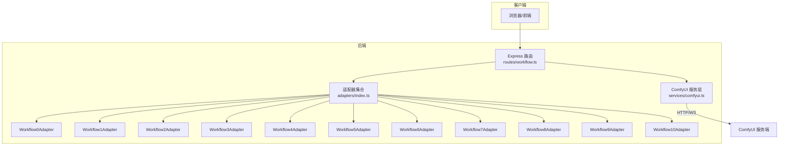
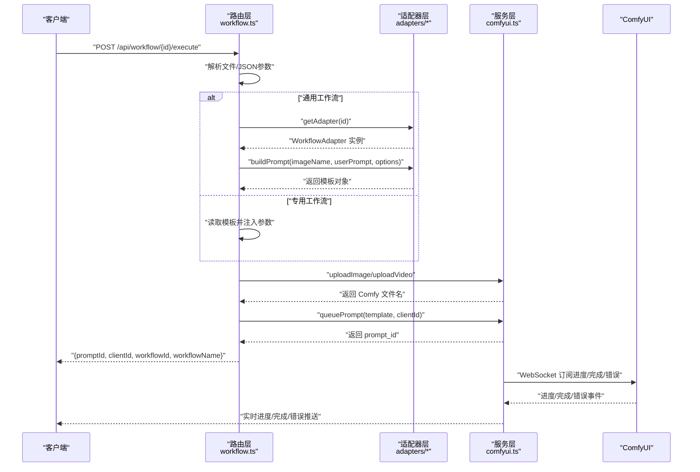
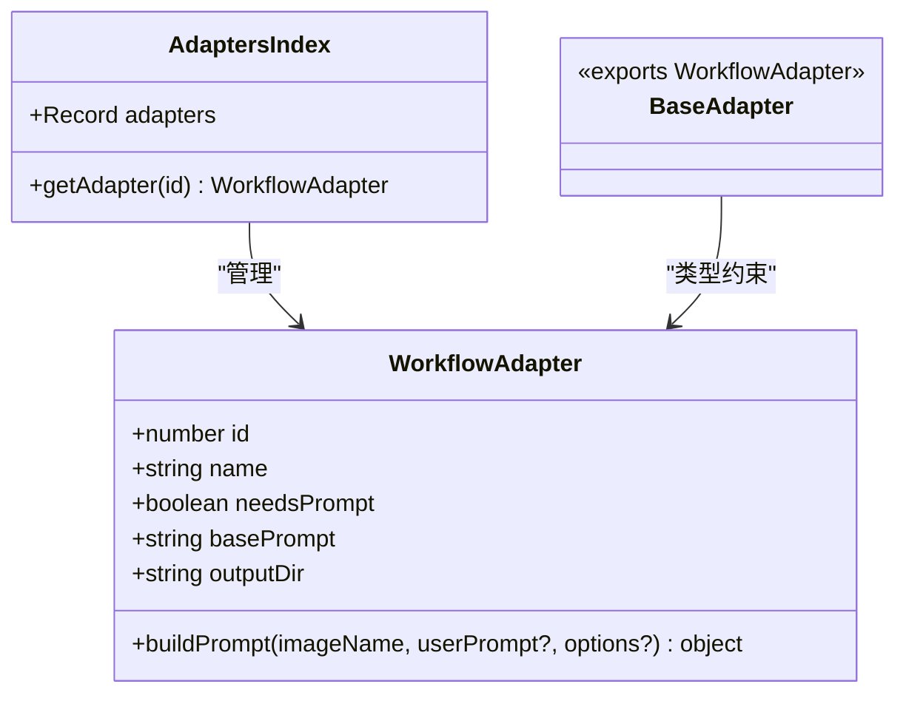
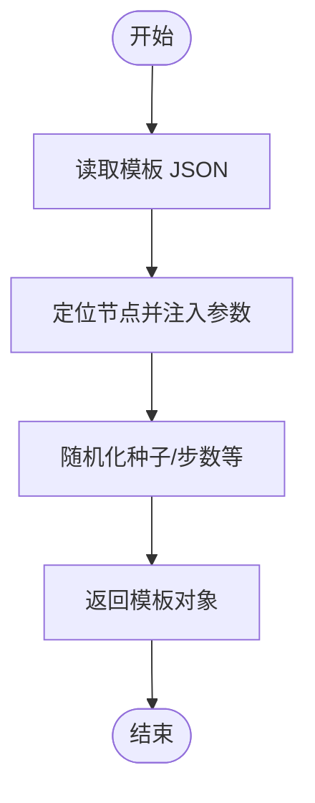
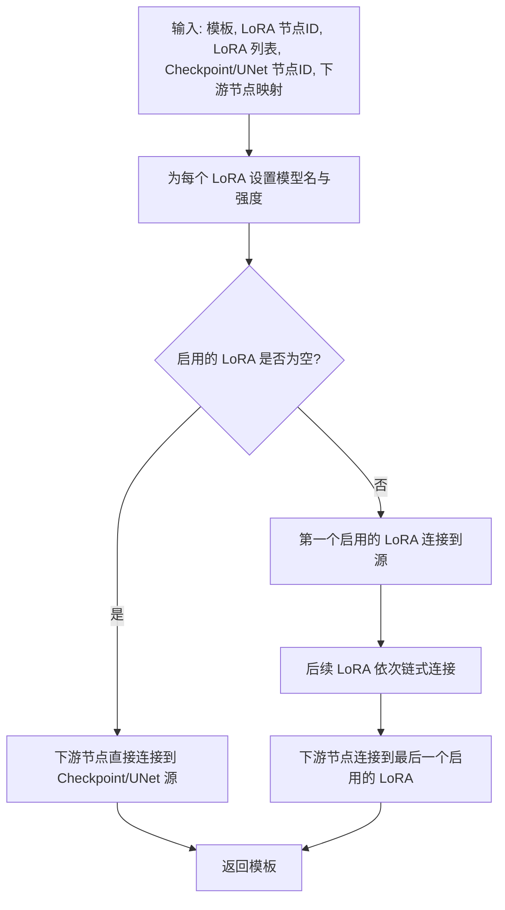
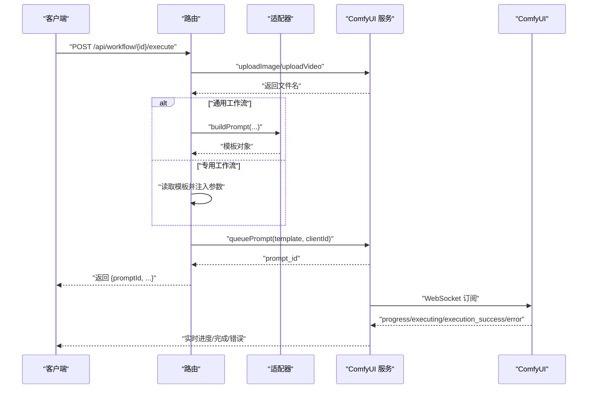
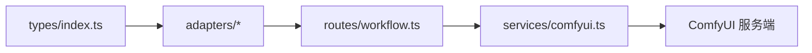

# AI 工作流系统

<cite>
**本文引用的文件**
- [README.md](file://README.md)
- [server/src/types/index.ts](file://server/src/types/index.ts)
- [server/src/adapters/BaseAdapter.ts](file://server/src/adapters/BaseAdapter.ts)
- [server/src/adapters/index.ts](file://server/src/adapters/index.ts)
- [server/src/adapters/Workflow0Adapter.ts](file://server/src/adapters/Workflow0Adapter.ts)
- [server/src/adapters/Workflow1Adapter.ts](file://server/src/adapters/Workflow1Adapter.ts)
- [server/src/adapters/Workflow2Adapter.ts](file://server/src/adapters/Workflow2Adapter.ts)
- [server/src/adapters/Workflow3Adapter.ts](file://server/src/adapters/Workflow3Adapter.ts)
- [server/src/adapters/Workflow4Adapter.ts](file://server/src/adapters/Workflow4Adapter.ts)
- [server/src/adapters/Workflow5Adapter.ts](file://server/src/adapters/Workflow5Adapter.ts)
- [server/src/adapters/Workflow6Adapter.ts](file://server/src/adapters/Workflow6Adapter.ts)
- [server/src/adapters/Workflow7Adapter.ts](file://server/src/adapters/Workflow7Adapter.ts)
- [server/src/adapters/Workflow8Adapter.ts](file://server/src/adapters/Workflow8Adapter.ts)
- [server/src/adapters/Workflow9Adapter.ts](file://server/src/adapters/Workflow9Adapter.ts)
- [server/src/adapters/Workflow10Adapter.ts](file://server/src/adapters/Workflow10Adapter.ts)
- [server/src/routes/workflow.ts](file://server/src/routes/workflow.ts)
- [server/src/services/comfyui.ts](file://server/src/services/comfyui.ts)
</cite>

## 目录
1. [简介](#简介)
2. [项目结构](#项目结构)
3. [核心组件](#核心组件)
4. [架构总览](#架构总览)
5. [详细组件分析](#详细组件分析)
6. [依赖分析](#依赖分析)
7. [性能考量](#性能考量)
8. [故障排查指南](#故障排查指南)
9. [结论](#结论)
10. [附录](#附录)

## 简介
本项目是一个基于本地 ComfyUI 的 Web 图像/视频工作流处理系统，提供多种预设工作流（如“二次元转真人”、“真人精修”、“精修放大”、“图生视频”、“视频补帧”等），并通过适配器模式将“模板加载 + 参数注入 + 节点连接”解耦，使新增工作流与修改现有工作流变得简单可控。系统通过 Express 路由接收用户请求，调用 ComfyUI 服务层完成模板解析、参数注入、任务入队与进度回传，最终将结果返回给前端。

- 项目目标与范围：围绕适配器模式设计、ComfyUI 模板系统、工作流执行流程、定制指南与最佳实践展开。
- 关键技术点：适配器接口抽象、模板 JSON 注入、LoRA 动态链式连接、WebSocket 进度回传、错误映射与恢复。

章节来源
- [README.md:1-79](file://README.md#L1-L79)

## 项目结构
后端采用“适配器 + 路由 + 服务”的分层组织方式：
- 适配器层：每个工作流一个适配器，负责加载对应模板并注入参数。
- 路由层：根据工作流 ID 或专用路径，解析请求体/文件，构建模板并入队。
- 服务层：封装 ComfyUI 的 HTTP/WS 客户端，提供上传、入队、历史查询、进度回传等能力。

图表来源
- [server/src/routes/workflow.ts:152-799](file://server/src/routes/workflow.ts#L152-L799)
- [server/src/adapters/index.ts:14-32](file://server/src/adapters/index.ts#L14-L32)
- [server/src/services/comfyui.ts:168-196](file://server/src/services/comfyui.ts#L168-L196)

章节来源
- [README.md:41-79](file://README.md#L41-L79)
- [server/src/adapters/index.ts:14-32](file://server/src/adapters/index.ts#L14-L32)
- [server/src/routes/workflow.ts:152-799](file://server/src/routes/workflow.ts#L152-L799)

## 核心组件
- 适配器接口：定义工作流标识、名称、是否需要提示词、基础提示词、输出目录以及构建提示 JSON 的方法。
- 适配器集合：集中导出所有适配器并提供按 ID 获取的工具函数。
- 路由处理器：针对通用工作流（0~4）与专用工作流（5/7/8/9/10）分别实现执行逻辑；通用工作流通过适配器构建模板，专用工作流直接读取模板并注入参数。
- ComfyUI 服务层：封装上传、入队、历史查询、系统状态、队列优先级调整、WebSocket 连接与事件回调等。

章节来源
- [server/src/types/index.ts:1-8](file://server/src/types/index.ts#L1-L8)
- [server/src/adapters/index.ts:14-32](file://server/src/adapters/index.ts#L14-L32)
- [server/src/routes/workflow.ts:152-799](file://server/src/routes/workflow.ts#L152-L799)
- [server/src/services/comfyui.ts:168-196](file://server/src/services/comfyui.ts#L168-L196)

## 架构总览
系统以“适配器 + 模板 + 服务层 + 路由”的方式组织，形成清晰的职责边界与扩展点。

图表来源
- [server/src/routes/workflow.ts:750-799](file://server/src/routes/workflow.ts#L750-L799)
- [server/src/services/comfyui.ts:168-196](file://server/src/services/comfyui.ts#L168-L196)

## 详细组件分析

### 适配器模式与 BaseAdapter
- BaseAdapter 类型：通过导出 WorkflowAdapter 接口，约束所有适配器必须实现的属性与方法。
- 适配器集合：集中导出编号到适配器实例的映射，并提供按 ID 获取的工具函数，便于路由层统一调度。
- 设计要点：将“模板加载”和“参数注入”解耦，不同工作流仅需关注自身模板节点与参数映射。

图表来源
- [server/src/types/index.ts:1-8](file://server/src/types/index.ts#L1-L8)
- [server/src/adapters/BaseAdapter.ts:1-4](file://server/src/adapters/BaseAdapter.ts#L1-L4)
- [server/src/adapters/index.ts:14-32](file://server/src/adapters/index.ts#L14-L32)

章节来源
- [server/src/adapters/BaseAdapter.ts:1-4](file://server/src/adapters/BaseAdapter.ts#L1-L4)
- [server/src/adapters/index.ts:14-32](file://server/src/adapters/index.ts#L14-L32)
- [server/src/types/index.ts:1-8](file://server/src/types/index.ts#L1-L8)

### 11 种工作流适配器实现差异
- 通用适配器（0~4）：均通过适配器的 buildPrompt 方法加载模板并注入参数，典型差异在于节点 ID、提示词拼接策略、种子随机化位置与范围。
- 专用适配器（5/7/8/9/10）：不直接暴露 buildPrompt，而是由路由层读取模板并注入参数，或在适配器中抛出错误提示改用专用路由。

图表来源
- [server/src/adapters/Workflow0Adapter.ts:9-34](file://server/src/adapters/Workflow0Adapter.ts#L9-L34)
- [server/src/adapters/Workflow1Adapter.ts:9-35](file://server/src/adapters/Workflow1Adapter.ts#L9-L35)
- [server/src/adapters/Workflow2Adapter.ts:9-27](file://server/src/adapters/Workflow2Adapter.ts#L9-L27)
- [server/src/adapters/Workflow3Adapter.ts:9-40](file://server/src/adapters/Workflow3Adapter.ts#L9-L40)
- [server/src/adapters/Workflow4Adapter.ts:9-27](file://server/src/adapters/Workflow4Adapter.ts#L9-L27)
- [server/src/adapters/Workflow5Adapter.ts:4-14](file://server/src/adapters/Workflow5Adapter.ts#L4-L14)
- [server/src/adapters/Workflow6Adapter.ts:9-35](file://server/src/adapters/Workflow6Adapter.ts#L9-L35)
- [server/src/adapters/Workflow7Adapter.ts:3-13](file://server/src/adapters/Workflow7Adapter.ts#L3-L13)
- [server/src/adapters/Workflow8Adapter.ts:3-13](file://server/src/adapters/Workflow8Adapter.ts#L3-L13)
- [server/src/adapters/Workflow9Adapter.ts:3-13](file://server/src/adapters/Workflow9Adapter.ts#L3-L13)
- [server/src/adapters/Workflow10Adapter.ts:4-14](file://server/src/adapters/Workflow10Adapter.ts#L4-L14)

章节来源
- [server/src/adapters/Workflow0Adapter.ts:9-34](file://server/src/adapters/Workflow0Adapter.ts#L9-L34)
- [server/src/adapters/Workflow1Adapter.ts:9-35](file://server/src/adapters/Workflow1Adapter.ts#L9-L35)
- [server/src/adapters/Workflow2Adapter.ts:9-27](file://server/src/adapters/Workflow2Adapter.ts#L9-L27)
- [server/src/adapters/Workflow3Adapter.ts:9-40](file://server/src/adapters/Workflow3Adapter.ts#L9-L40)
- [server/src/adapters/Workflow4Adapter.ts:9-27](file://server/src/adapters/Workflow4Adapter.ts#L9-L27)
- [server/src/adapters/Workflow5Adapter.ts:4-14](file://server/src/adapters/Workflow5Adapter.ts#L4-L14)
- [server/src/adapters/Workflow6Adapter.ts:9-35](file://server/src/adapters/Workflow6Adapter.ts#L9-L35)
- [server/src/adapters/Workflow7Adapter.ts:3-13](file://server/src/adapters/Workflow7Adapter.ts#L3-L13)
- [server/src/adapters/Workflow8Adapter.ts:3-13](file://server/src/adapters/Workflow8Adapter.ts#L3-L13)
- [server/src/adapters/Workflow9Adapter.ts:3-13](file://server/src/adapters/Workflow9Adapter.ts#L3-L13)
- [server/src/adapters/Workflow10Adapter.ts:4-14](file://server/src/adapters/Workflow10Adapter.ts#L4-L14)

### 模板加载机制与节点参数注入
- 通用工作流：适配器读取固定路径的 JSON 模板，定位特定节点 ID，设置输入参数（如图像名、提示词、种子、尺寸等），然后返回模板对象。
- 专用工作流：路由层直接读取模板并注入参数，部分工作流还涉及 LoRA 动态链式连接与条件分支控制。

图表来源
- [server/src/adapters/Workflow0Adapter.ts:16-33](file://server/src/adapters/Workflow0Adapter.ts#L16-L33)
- [server/src/adapters/Workflow3Adapter.ts:16-39](file://server/src/adapters/Workflow3Adapter.ts#L16-L39)
- [server/src/routes/workflow.ts:644-687](file://server/src/routes/workflow.ts#L644-L687)

章节来源
- [server/src/adapters/Workflow0Adapter.ts:16-33](file://server/src/adapters/Workflow0Adapter.ts#L16-L33)
- [server/src/adapters/Workflow3Adapter.ts:16-39](file://server/src/adapters/Workflow3Adapter.ts#L16-L39)
- [server/src/routes/workflow.ts:644-687](file://server/src/routes/workflow.ts#L644-L687)

### LoRA 动态链式连接与重连逻辑
- 适用场景：多工作流支持多个 LoRA 节点串联，启用/禁用 LoRA 时动态重连上游输出，保证下游节点始终从最后一个启用的 LoRA 接收模型/CLIP 输出。
- 关键步骤：遍历用户选择的 LoRA 列表，设置每个 LoRA 的模型名与强度；根据启用状态构建链表；将下游节点的模型/CLIP 输入重连到最后一个启用的 LoRA。

图表来源
- [server/src/routes/workflow.ts:40-86](file://server/src/routes/workflow.ts#L40-L86)

章节来源
- [server/src/routes/workflow.ts:40-86](file://server/src/routes/workflow.ts#L40-L86)

### ComfyUI 工作流 JSON 模板系统
- 节点连接关系：模板以节点 ID 为键，每个节点包含 class_type、inputs、_meta 等字段；路由层/适配器通过修改 inputs 或重连数组索引建立连接。
- 参数配置：常见参数包括模型名（ckpt_name、unet_name）、采样步数、CFG、采样器与调度器、提示词、尺寸、种子、掩码/参考图等。
- 提示词处理逻辑：多数工作流将用户提示词与基础提示词拼接，或在某些工作流中完全替换默认提示词。

章节来源
- [server/src/adapters/Workflow0Adapter.ts:16-33](file://server/src/adapters/Workflow0Adapter.ts#L16-L33)
- [server/src/adapters/Workflow3Adapter.ts:16-39](file://server/src/adapters/Workflow3Adapter.ts#L16-L39)
- [server/src/routes/workflow.ts:644-687](file://server/src/routes/workflow.ts#L644-L687)

### 工作流执行流程（从请求到结果返回）
- 请求接收：路由根据路径判断工作流类型，解析文件或 JSON 参数。
- 模板构建：通用工作流通过适配器构建模板，专用工作流直接读取模板并注入参数。
- 文件上传：将用户上传的图片/视频上传至 ComfyUI，获得可被模板引用的文件名。
- 任务入队：将模板对象与客户端 ID 发送至 ComfyUI 入队接口，记录 prompt_id。
- 进度回传：通过 WebSocket 订阅进度事件，结合节点权重估算全局进度。
- 结果获取：完成后通过历史接口获取输出文件列表，或直接从 ComfyUI view 接口下载。

图表来源
- [server/src/routes/workflow.ts:750-799](file://server/src/routes/workflow.ts#L750-L799)
- [server/src/services/comfyui.ts:265-375](file://server/src/services/comfyui.ts#L265-L375)

章节来源
- [server/src/routes/workflow.ts:750-799](file://server/src/routes/workflow.ts#L750-L799)
- [server/src/services/comfyui.ts:265-375](file://server/src/services/comfyui.ts#L265-L375)

### 专用工作流路由与模板注入
- 专用路由（5/10）：需要图像与掩码，注入图像名、掩码名、布尔参数与种子。
- 专用路由（7）：快速出图，支持参考图（PRO 分支）与普通分支；支持 LoRA 链式连接；可覆盖尺寸与输出前缀。
- 专用路由（9）：ZIT 快出，支持 UNet 与 LoRA；通过 ifElse 控制是否启用 AuraFlow shift。
- 专用路由（8）：黑兽换脸，需要目标图与人脸图，注入图像名与种子。

章节来源
- [server/src/routes/workflow.ts:163-267](file://server/src/routes/workflow.ts#L163-L267)
- [server/src/routes/workflow.ts:269-405](file://server/src/routes/workflow.ts#L269-L405)
- [server/src/routes/workflow.ts:485-593](file://server/src/routes/workflow.ts#L485-L593)
- [server/src/routes/workflow.ts:595-642](file://server/src/routes/workflow.ts#L595-L642)

## 依赖分析
- 组件内聚与耦合：适配器与模板强相关，但通过接口隔离了路由层；路由层与服务层通过接口解耦。
- 外部依赖：ComfyUI 的 HTTP/WS 接口、文件上传与队列管理；前端通过 WebSocket 接收进度事件。
- 循环依赖：当前结构无循环导入，适配器仅依赖模板路径与基础类型。

图表来源
- [server/src/types/index.ts:1-8](file://server/src/types/index.ts#L1-L8)
- [server/src/adapters/index.ts:14-32](file://server/src/adapters/index.ts#L14-L32)
- [server/src/routes/workflow.ts:152-799](file://server/src/routes/workflow.ts#L152-L799)
- [server/src/services/comfyui.ts:168-196](file://server/src/services/comfyui.ts#L168-L196)

章节来源
- [server/src/types/index.ts:1-8](file://server/src/types/index.ts#L1-L8)
- [server/src/adapters/index.ts:14-32](file://server/src/adapters/index.ts#L14-L32)
- [server/src/routes/workflow.ts:152-799](file://server/src/routes/workflow.ts#L152-L799)
- [server/src/services/comfyui.ts:168-196](file://server/src/services/comfyui.ts#L168-L196)

## 性能考量
- 节点权重估算：系统维护静态节点权重与采样器权重（含 tiled 采样器经验估算），用于计算全局进度；采样器权重可配置。
- WebSocket 信号兼容：同时兼容旧版与新版 ComfyUI 的完成信号，避免“卡在完成但无输出”的问题。
- 队列优先级：支持将目标任务重新入队并置于队首，减少等待时间。
- I/O 优化：上传图片/视频时复用 form-data；输出文件名前缀避免子文件夹冲突导致覆盖。

章节来源
- [server/src/services/comfyui.ts:58-144](file://server/src/services/comfyui.ts#L58-L144)
- [server/src/services/comfyui.ts:265-375](file://server/src/services/comfyui.ts#L265-L375)
- [server/src/services/comfyui.ts:442-471](file://server/src/services/comfyui.ts#L442-L471)

## 故障排查指南
- 常见错误映射：将 ComfyUI 的字段校验错误映射为中文提示，便于用户理解（如 ckpt/lora/unet/vae/control_net 未找到）。
- 通用错误处理：路由层捕获异常并转换为用户可读错误信息；上传/入队失败时给出明确提示。
- WebSocket 异常：连接错误会记录日志；若出现“完成但无输出”，系统通过延迟与优先信号保障最终一致性。

章节来源
- [server/src/routes/workflow.ts:126-150](file://server/src/routes/workflow.ts#L126-L150)
- [server/src/services/comfyui.ts:370-375](file://server/src/services/comfyui.ts#L370-L375)

## 结论
本系统通过适配器模式将“模板加载 + 参数注入 + 节点连接”解耦，配合专用路由与服务层，实现了稳定、可扩展的工作流执行框架。模板系统清晰、参数注入灵活、进度回传实时，适合在本地 ComfyUI 环境下进行批量与交互式图像/视频处理。

## 附录

### 工作流定制指南
- 添加新的工作流适配器
  - 在适配器目录新增适配器文件，实现接口要求的方法与属性。
  - 在适配器索引中注册新适配器并导出。
  - 在路由层增加通用执行路由或专用路由，读取模板并注入参数。
  - 示例参考：[server/src/adapters/Workflow0Adapter.ts:9-34](file://server/src/adapters/Workflow0Adapter.ts#L9-L34)、[server/src/adapters/index.ts:14-32](file://server/src/adapters/index.ts#L14-L32)、[server/src/routes/workflow.ts:750-799](file://server/src/routes/workflow.ts#L750-799)

- 修改现有工作流
  - 通用工作流：调整模板节点 ID 与参数映射，注意提示词拼接策略与种子随机化位置。
  - 专用工作流：在对应路由中读取模板并注入参数，必要时引入 LoRA 链式连接逻辑。
  - 示例参考：[server/src/adapters/Workflow3Adapter.ts:16-39](file://server/src/adapters/Workflow3Adapter.ts#L16-L39)、[server/src/routes/workflow.ts:269-405](file://server/src/routes/workflow.ts#L269-405)

- 优化处理性能
  - 合理设置采样器权重与步数，避免过长的采样时间。
  - 使用队列优先级功能将关键任务前置。
  - 减少不必要的 LoRA 链接数量，降低连接复杂度。
  - 示例参考：[server/src/services/comfyui.ts:58-144](file://server/src/services/comfyui.ts#L58-144)、[server/src/services/comfyui.ts:442-471](file://server/src/services/comfyui.ts#L442-471)

### 配置选项说明（示例）
- 通用工作流（0/1/2/6）
  - 参数：clientId、prompt、options（如秒数、帧率、像素数等）
  - 示例参考：[server/src/routes/workflow.ts:750-799](file://server/src/routes/workflow.ts#L750-799)

- 专用工作流（5/10）
  - 参数：clientId、image、mask、prompt/backPose 等
  - 示例参考：[server/src/routes/workflow.ts:163-267](file://server/src/routes/workflow.ts#L163-267)

- 专用工作流（7）
  - 参数：clientId、model/loras/prompt/negativePrompt/width/height/steps/cfg/sampler/scheduler/name/seed/referenceImage 等
  - 示例参考：[server/src/routes/workflow.ts:269-405](file://server/src/routes/workflow.ts#L269-405)

- 专用工作流（9）
  - 参数：clientId、unetModel/loras/shiftEnabled/shift/prompt/width/height/steps/cfg/sampler/scheduler/name
  - 示例参考：[server/src/routes/workflow.ts:485-593](file://server/src/routes/workflow.ts#L485-593)

- 专用工作流（8）
  - 参数：clientId、targetImage、faceImage
  - 示例参考：[server/src/routes/workflow.ts:595-642](file://server/src/routes/workflow.ts#L595-642)