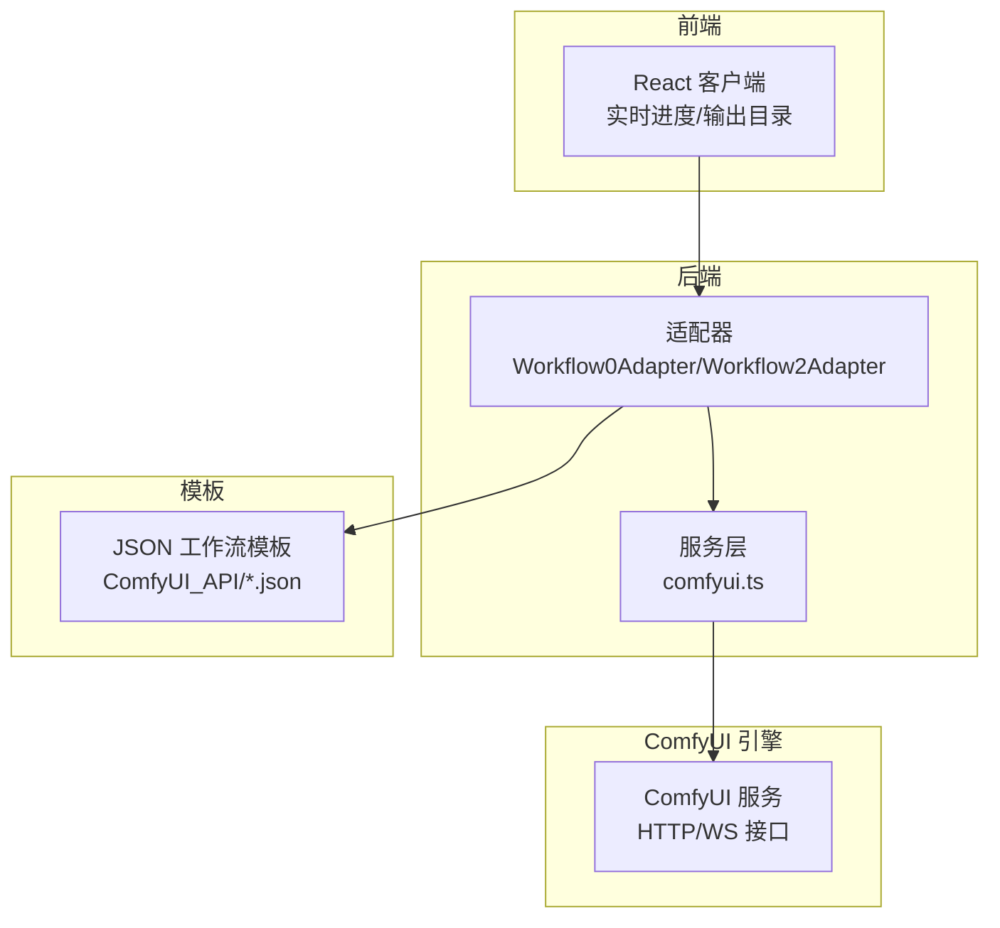
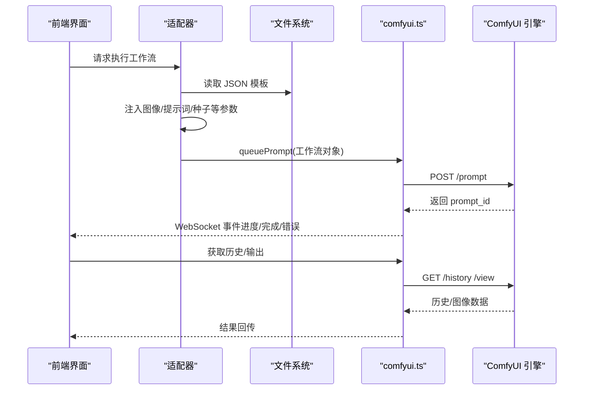
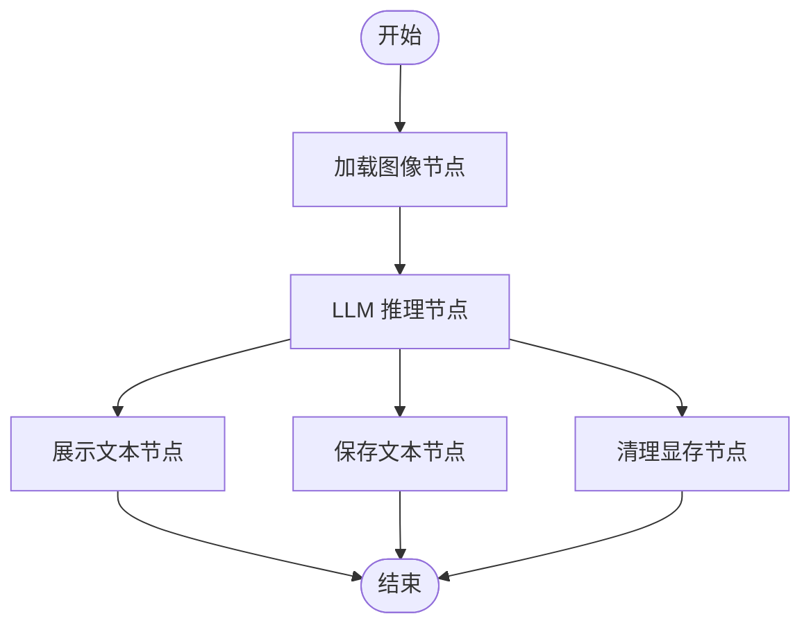
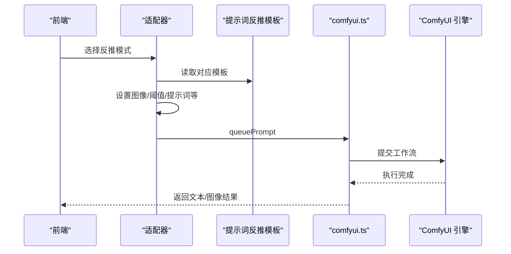
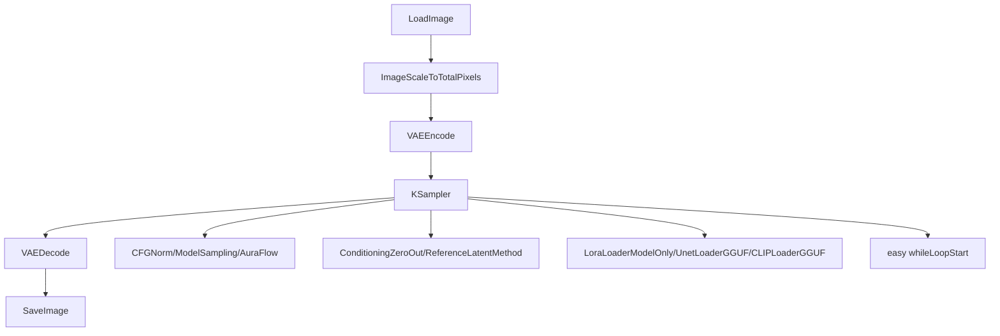
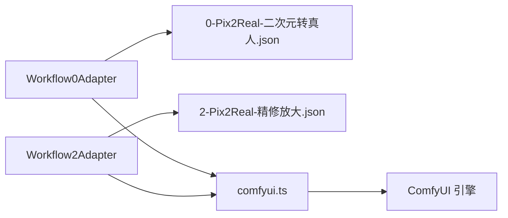

# ComfyUI 模板系统

<cite>
**本文引用的文件**
- [Pix2Real-提示词助手.json](file://ComfyUI_API/Pix2Real-提示词助手.json)
- [Pix2Real-提示词反推Flo.json](file://ComfyUI_API/Pix2Real-提示词反推Flo.json)
- [Pix2Real-提示词反推Q3.json](file://ComfyUI_API/Pix2Real-提示词反推Q3.json)
- [Pix2Real-提示词反推WD14.json](file://ComfyUI_API/Pix2Real-提示词反推WD14.json)
- [0-Pix2Real-二次元转真人.json](file://ComfyUI_API/0-Pix2Real-二次元转真人.json)
- [二次元生成 (PRO).json](file://ComfyUI_API/二次元生成 (PRO).json)
- [👻二次元转真人(NoUnload).json](file://ComfyUI_API/👻二次元转真人(NoUnload).json)
- [Workflow0Adapter.ts](file://server/src/adapters/Workflow0Adapter.ts)
- [Workflow2Adapter.ts](file://server/src/adapters/Workflow2Adapter.ts)
- [comfyui.ts](file://server/src/services/comfyui.ts)
- [index.ts 类型定义](file://server/src/types/index.ts)
- [README.md](file://README.md)
- [SystemPrompt.txt（项目文档）](file://docs/SystemPrompt.txt)
- [SystemPrompt.txt（提示词助理开发需求）](file://docs/提示词助理开发需求/SystemPrompt.txt)
</cite>

## 目录
1. [简介](#简介)
2. [项目结构](#项目结构)
3. [核心组件](#核心组件)
4. [架构总览](#架构总览)
5. [详细组件分析](#详细组件分析)
6. [依赖分析](#依赖分析)
7. [性能考量](#性能考量)
8. [故障排查指南](#故障排查指南)
9. [结论](#结论)
10. [附录](#附录)

## 简介
本文件面向 ComfyUI 工作流模板系统，围绕 JSON 工作流模板的结构与组成进行深入解析，覆盖节点定义、连接关系、参数配置与提示词处理机制；阐明输入/处理/输出节点的配置方法；解释模板参数的动态替换机制（变量占位符、条件分支与循环）、模板定制与优化策略、调试技巧、参数验证与错误处理、版本管理与兼容性建议。

## 项目结构
该仓库采用“前端 + 后端 + 模板”三层组织方式：
- 前端：React/Vite 应用，负责用户交互与实时进度展示
- 后端：Express + TypeScript，负责适配器装配模板、调用 ComfyUI API、WebSocket 进度转发
- 模板：ComfyUI_API 目录下的 JSON 文件，定义具体工作流节点与连接

图表来源
- [README.md: 项目结构与架构说明:41-79](file://README.md#L41-L79)
- [Workflow0Adapter.ts: 适配器加载模板与动态替换:1-35](file://server/src/adapters/Workflow0Adapter.ts#L1-L35)
- [Workflow2Adapter.ts: 适配器加载模板与动态替换:1-28](file://server/src/adapters/Workflow2Adapter.ts#L1-L28)
- [comfyui.ts: HTTP/WS 与引擎通信:1-472](file://server/src/services/comfyui.ts#L1-L472)

章节来源
- [README.md: 项目结构与架构说明:41-79](file://README.md#L41-L79)

## 核心组件
- JSON 工作流模板：以键值映射的方式描述节点集合，每个节点包含 class_type（节点类型）、inputs（输入参数）、_meta（可视化标题）等字段；节点间通过 inputs 中的数组引用建立连接（如 ["节点ID", 输出索引]）。
- 适配器（WorkflowAdapter）：封装模板加载与动态替换逻辑，按需设置输入图像、提示词、随机种子等，返回可提交给 ComfyUI 的完整工作流对象。
- 服务层（comfyui.ts）：提供上传资源、排队工作流、监听 WebSocket 进度、查询历史与系统状态、优先级调整等能力；内置节点权重估算，用于阶段化进度展示。
- 类型定义（index.ts）：统一前后端事件与数据结构契约，保证适配器与服务层的接口一致性。

章节来源
- [index.ts 类型定义: WorkflowAdapter 接口:1-8](file://server/src/types/index.ts#L1-L8)
- [comfyui.ts: 节点权重与进度估算:51-144](file://server/src/services/comfyui.ts#L51-L144)
- [Workflow0Adapter.ts: buildPrompt 动态替换:16-33](file://server/src/adapters/Workflow0Adapter.ts#L16-L33)
- [Workflow2Adapter.ts: buildPrompt 动态替换:16-26](file://server/src/adapters/Workflow2Adapter.ts#L16-L26)

## 架构总览
模板系统遵循“模板即数据”的设计：后端适配器读取 JSON 模板，注入运行期参数，再通过 HTTP/WS 与 ComfyUI 交互，最终产出图像/视频等结果。

图表来源
- [Workflow0Adapter.ts: buildPrompt 与模板读取:16-33](file://server/src/adapters/Workflow0Adapter.ts#L16-L33)
- [Workflow2Adapter.ts: buildPrompt 与模板读取:16-26](file://server/src/adapters/Workflow2Adapter.ts#L16-L26)
- [comfyui.ts: queuePrompt 与 WebSocket:168-196](file://server/src/services/comfyui.ts#L168-L196)
- [comfyui.ts: connectWebSocket 事件处理:265-375](file://server/src/services/comfyui.ts#L265-L375)

## 详细组件分析

### 组件 A：提示词助手工作流（模板与适配）
- 模板结构要点
  - 参数节点：llama_cpp_parameters（采样参数）
  - 模型加载节点：llama_cpp_model_loader（模型路径、投影模型、上下文窗口等）
  - 推理节点：llama_cpp_instruct_adv（结合模型与参数）
  - 文本展示与保存：ShowText|pysssss、easy saveText
  - VRAM 清理：LayerUtility: PurgeVRAM V2
- 节点连接关系
  - LoadImage/图像输入 → 文本推理节点
  - 文本推理节点 → 文本展示节点 → 文本保存节点
  - 文本推理节点 → VRAM 清理节点
- 适配器动态替换
  - 适配器读取模板，设置图像文件名、提示词（可选）、随机种子等，然后提交执行。

图表来源
- [Pix2Real-提示词助手.json: 节点与连接:1-106](file://ComfyUI_API/Pix2Real-提示词助手.json#L1-L106)
- [Workflow0Adapter.ts: buildPrompt 动态替换:16-33](file://server/src/adapters/Workflow0Adapter.ts#L16-L33)

章节来源
- [Pix2Real-提示词助手.json: 节点与连接:1-106](file://ComfyUI_API/Pix2Real-提示词助手.json#L1-L106)
- [Workflow0Adapter.ts: buildPrompt 动态替换:16-33](file://server/src/adapters/Workflow0Adapter.ts#L16-L33)

### 组件 B：提示词反推工作流（模板与适配）
- Florence2 反推模板
  - LoadImage → DownloadAndLoadFlorence2Model → Florence2Run → ShowText|pysssss → easy saveText
- WD14 反推模板
  - LoadImage → WD14Tagger|pysssss → ShowText|pysssss → easy saveText
- Qwen-VL 反推模板
  - LoadImage → llama_cpp_model_loader → llama_cpp_parameters → llama_cpp_instruct_adv → easy saveText
  - 包含 VRAM 清理与文本保存节点

图表来源
- [Pix2Real-提示词反推Flo.json: 节点与连接:1-77](file://ComfyUI_API/Pix2Real-提示词反推Flo.json#L1-L77)
- [Pix2Real-提示词反推WD14.json: 节点与连接:1-58](file://ComfyUI_API/Pix2Real-提示词反推WD14.json#L1-L58)
- [Pix2Real-提示词反推Q3.json: 节点与连接:1-106](file://ComfyUI_API/Pix2Real-提示词反推Q3.json#L1-L106)

章节来源
- [Pix2Real-提示词反推Flo.json: 节点与连接:1-77](file://ComfyUI_API/Pix2Real-提示词反推Flo.json#L1-L77)
- [Pix2Real-提示词反推WD14.json: 节点与连接:1-58](file://ComfyUI_API/Pix2Real-提示词反推WD14.json#L1-L58)
- [Pix2Real-提示词反推Q3.json: 节点与连接:1-106](file://ComfyUI_API/Pix2Real-提示词反推Q3.json#L1-L106)

### 组件 C：二次元转真人工作流（模板与适配）
- 模板构成
  - 图像缩放、VAE 编码/解码、LoRA/UNet/CLIP 加载、KSamplers、条件构造、保存图像等
  - 循环控制：easy whileLoopStart（用于迭代/批量）
- 关键节点作用
  - LoadImage：输入图像
  - TextEncodeQwenImageEditPlus：文本编码（提示词）
  - KSampler：采样器（步数、CFG、采样器名称、调度器、降噪等）
  - VAEEncode/VAEDecode：潜在空间编解码
  - SaveImage：输出图像
- 适配器动态替换
  - 设置输入图像名、拼接提示词、随机种子等

图表来源
- [0-Pix2Real-二次元转真人.json: 节点与连接:1-252](file://ComfyUI_API/0-Pix2Real-二次元转真人.json#L1-L252)
- [二次元生成 (PRO).json: 节点与连接](file://ComfyUI_API/二次元生成 (PRO).json#L1-L422)
- [👻二次元转真人(NoUnload).json: 节点与连接](file://ComfyUI_API/👻二次元转真人(NoUnload).json#L1-L215)
- [Workflow0Adapter.ts: buildPrompt 动态替换:16-33](file://server/src/adapters/Workflow0Adapter.ts#L16-L33)

章节来源
- [0-Pix2Real-二次元转真人.json: 节点与连接:1-252](file://ComfyUI_API/0-Pix2Real-二次元转真人.json#L1-L252)
- [二次元生成 (PRO).json: 节点与连接](file://ComfyUI_API/二次元生成 (PRO).json#L1-L422)
- [👻二次元转真人(NoUnload).json: 节点与连接](file://ComfyUI_API/👻二次元转真人(NoUnload).json#L1-L215)
- [Workflow0Adapter.ts: buildPrompt 动态替换:16-33](file://server/src/adapters/Workflow0Adapter.ts#L16-L33)

### 组件 D：模板参数动态替换机制
- 变量占位符与连接引用
  - 模板中的 inputs 使用数组形式引用上游节点输出，如 ["节点ID", 输出索引]，形成数据流连接
- 适配器替换策略
  - 读取模板 JSON，定位目标节点（如 LoadImage、TextEncodeXxx、KSampler 等），设置 inputs 字段（图像名、提示词、种子等）
  - 对于需要用户输入的流程（如二次元转真人），将用户提示词与基础提示词拼接
- 条件分支与循环
  - 模板内存在 easy whileLoopStart 等节点，支持循环执行；适配器可按需启用/禁用条件分支
- 示例路径
  - [Workflow0Adapter.ts: buildPrompt 动态替换:16-33](file://server/src/adapters/Workflow0Adapter.ts#L16-L33)
  - [Workflow2Adapter.ts: buildPrompt 动态替换:16-26](file://server/src/adapters/Workflow2Adapter.ts#L16-L26)

章节来源
- [Workflow0Adapter.ts: buildPrompt 动态替换:16-33](file://server/src/adapters/Workflow0Adapter.ts#L16-L33)
- [Workflow2Adapter.ts: buildPrompt 动态替换:16-26](file://server/src/adapters/Workflow2Adapter.ts#L16-L26)

### 组件 E：提示词处理与系统提示词
- 系统提示词（SystemPrompt）
  - 提供“自然语言→标签语言”“标签语言→自然语言”“变体生成”“扩写”“后续场景/剧本”等多模式提示词工程规范
  - 严格约束输出格式、视觉化抽象转换、空间结构组织与一致性约束
- 模板中的提示词节点
  - 文本编码节点（如 TextEncodeQwenImageEditPlus、CLIPTextEncode 等）接收来自模板或适配器拼接后的提示词
- 示例路径
  - [SystemPrompt.txt（项目文档）: 多模式提示词规范:1-146](file://docs/SystemPrompt.txt#L1-L146)
  - [SystemPrompt.txt（提示词助理开发需求）: 模式化提示词:1-153](file://docs/提示词助理开发需求/SystemPrompt.txt#L1-L153)

章节来源
- [SystemPrompt.txt（项目文档）: 多模式提示词规范:1-146](file://docs/SystemPrompt.txt#L1-L146)
- [SystemPrompt.txt（提示词助理开发需求）: 模式化提示词:1-153](file://docs/提示词助理开发需求/SystemPrompt.txt#L1-L153)

## 依赖分析
- 适配器与模板
  - 适配器通过文件路径加载对应模板，读取 JSON 后在内存中修改特定节点的 inputs
- 适配器与服务层
  - 适配器构建工作流对象，交由服务层提交队列、订阅 WebSocket、查询历史
- 服务层与 ComfyUI 引擎
  - 服务层封装 HTTP/WS 调用，维护节点权重与进度估算，上报阶段化进度

图表来源
- [Workflow0Adapter.ts: 模板路径与构建:6-7](file://server/src/adapters/Workflow0Adapter.ts#L6-L7)
- [Workflow2Adapter.ts: 模板路径与构建:6-7](file://server/src/adapters/Workflow2Adapter.ts#L6-L7)
- [comfyui.ts: queuePrompt/WS:168-196](file://server/src/services/comfyui.ts#L168-L196)

章节来源
- [Workflow0Adapter.ts: 模板路径与构建:6-7](file://server/src/adapters/Workflow0Adapter.ts#L6-L7)
- [Workflow2Adapter.ts: 模板路径与构建:6-7](file://server/src/adapters/Workflow2Adapter.ts#L6-L7)
- [comfyui.ts: queuePrompt/WS:168-196](file://server/src/services/comfyui.ts#L168-L196)

## 性能考量
- 节点权重估算
  - 服务层内置静态节点权重与采样器步数权重，用于计算阶段化进度；Tiled 采样器采用估算 tile 数乘以采样系数
- 采样器与步数
  - 采样器节点权重与 steps 成正比；合理设置 steps 与 CFG 可平衡质量与速度
- I/O 与显存
  - 模型/VAE/CLIP/ControlNet 等加载节点具有较高权重；建议在流程末尾加入显存清理节点，减少显存碎片
- 并发与优先级
  - 服务层支持查询队列、删除队列项与重新排队，便于优先级调整

章节来源
- [comfyui.ts: 节点权重与采样器权重:51-144](file://server/src/services/comfyui.ts#L51-L144)
- [comfyui.ts: getQueue/prioritizeQueueItem:389-471](file://server/src/services/comfyui.ts#L389-L471)

## 故障排查指南
- 常见问题与处理
  - 上传失败：检查 ComfyUI 服务地址与 /upload/image 接口可用性
  - 队列提交失败：查看返回状态与错误文本，确认模板节点配置正确
  - WebSocket 未收到进度：确认客户端连接与 ComfyUI 版本兼容性（新版本提供 execution_success 信号）
  - 显存不足：在模板末尾增加显存清理节点，或降低分辨率/步数
- 错误事件与恢复
  - 服务层捕获 execution_error，优先上报错误消息；完成后清理状态，避免重复触发
- 参数验证建议
  - 输入图像名必须存在于 ComfyUI 存储；提示词长度与格式需符合模型要求；采样器参数（steps、CFG、调度器）需在有效范围内

章节来源
- [comfyui.ts: uploadImage/queuePrompt/getHistory:9-207](file://server/src/services/comfyui.ts#L9-L207)
- [comfyui.ts: connectWebSocket 错误处理:356-364](file://server/src/services/comfyui.ts#L356-L364)

## 结论
本模板系统以“模板即数据”为核心，通过适配器在运行期注入参数，结合服务层的进度估算与 WebSocket 实时反馈，实现了高效、可控的工作流执行。建议在模板设计中明确输入/输出节点职责、合理设置采样参数与显存清理策略，并利用系统提示词规范提升提示词质量与一致性。

## 附录

### 模板定制指南
- 修改现有模板
  - 定位目标节点（如 LoadImage、TextEncodeXxx、KSampler），调整 inputs 参数
  - 如需新增节点，确保连接关系正确（inputs 中的 ["节点ID", 输出索引]）
- 创建新模板
  - 从同类模板复制，保留必要的输入/输出节点与连接
  - 在适配器中注册新模板路径与动态替换逻辑
- 性能优化
  - 减少不必要的模型加载与显存占用；合并文本拼接节点；合理设置分辨率与步数
  - 在流程末尾加入显存清理节点

### 调试技巧
- 使用 ShowText|pysssss 展示中间结果，辅助定位问题节点
- 逐步注释掉非必要节点，缩小问题范围
- 利用服务层的 getHistory 与 getImageBuffer 获取输出，核对中间产物

### 参数验证与错误处理
- 参数验证
  - 图像名、提示词、采样器参数、模型路径等均需在模板或适配器中校验
- 错误处理
  - 服务层统一捕获 HTTP/WS 错误，优先上报 execution_error；完成后清理状态

### 版本管理与兼容性
- 模板版本
  - 通过文件命名区分（如 “(NoUnload)” 后缀），在适配器中选择对应模板
- 兼容性
  - 不同 ComfyUI 版本可能影响 WebSocket 事件字段；服务层兼容 executing:null 与 execution_success 两种完成信号

章节来源
- [README.md: 工作流与架构说明:64-79](file://README.md#L64-L79)
- [comfyui.ts: WebSocket 事件兼容:350-354](file://server/src/services/comfyui.ts#L350-L354)