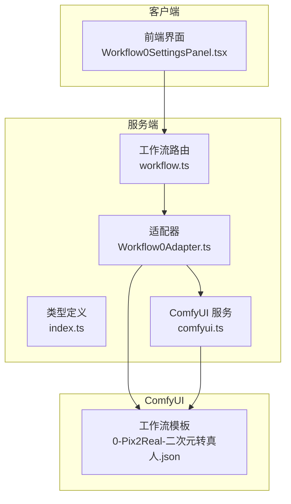
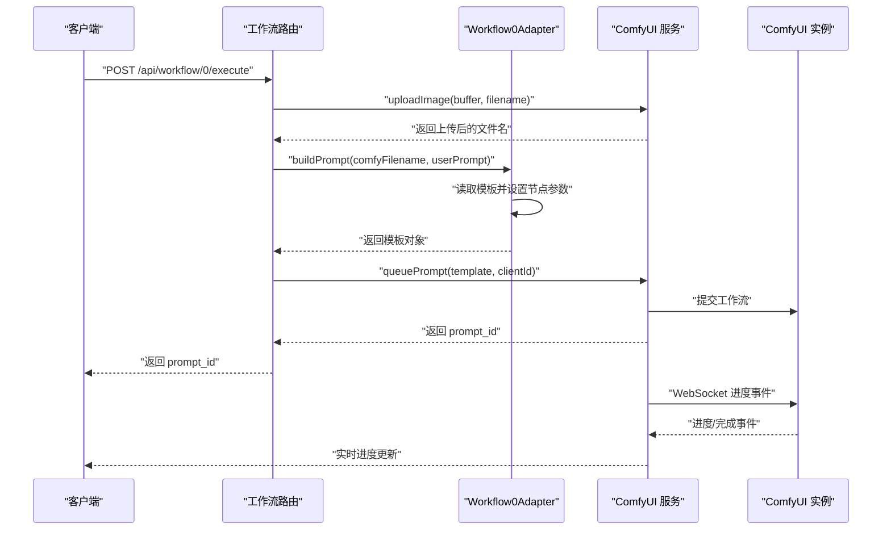
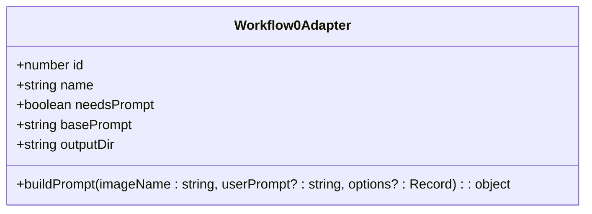
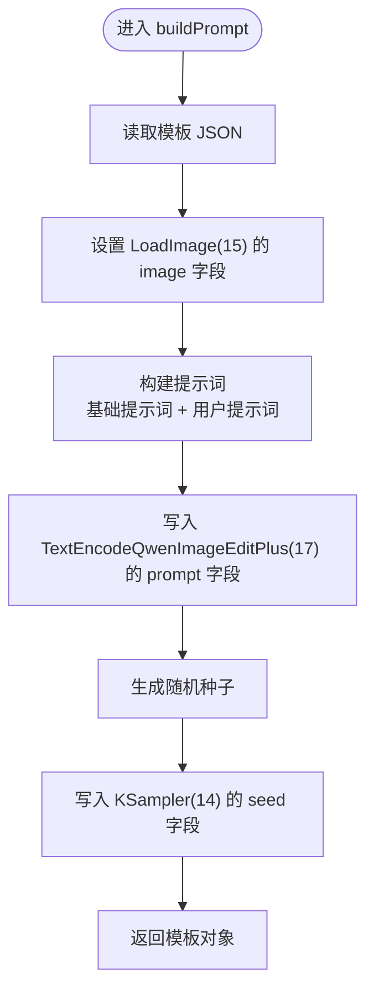
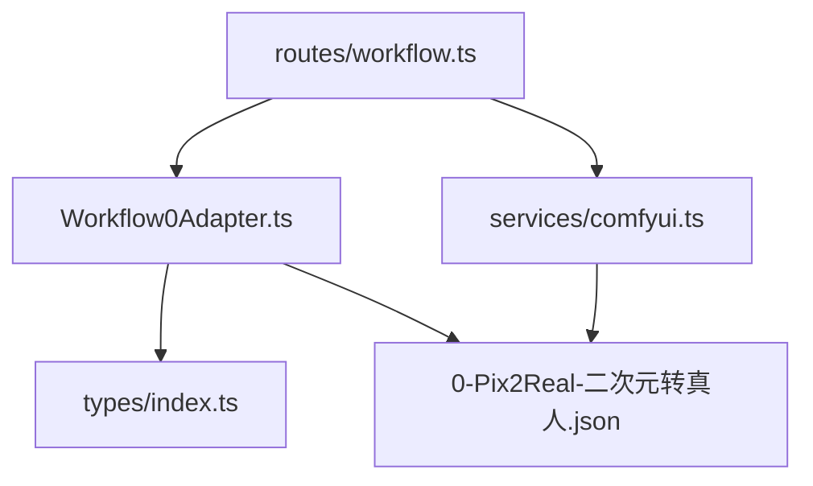

# Workflow0Adapter - 二次元转真人

<cite>
**本文引用的文件**
- [Workflow0Adapter.ts](file://server/src/adapters/Workflow0Adapter.ts)
- [0-Pix2Real-二次元转真人.json](file://ComfyUI_API/0-Pix2Real-二次元转真人.json)
- [BaseAdapter.ts](file://server/src/adapters/BaseAdapter.ts)
- [index.ts（适配器索引）](file://server/src/adapters/index.ts)
- [index.ts（类型定义）](file://server/src/types/index.ts)
- [workflow.ts（工作流路由）](file://server/src/routes/workflow.ts)
- [comfyui.ts（ComfyUI 服务）](file://server/src/services/comfyui.ts)
- [Workflow0SettingsPanel.tsx](file://client/src/components/Workflow0SettingsPanel.tsx)
- [README.md](file://README.md)
</cite>

## 目录
1. [简介](#简介)
2. [项目结构](#项目结构)
3. [核心组件](#核心组件)
4. [架构概览](#架构概览)
5. [详细组件分析](#详细组件分析)
6. [依赖关系分析](#依赖关系分析)
7. [性能考虑](#性能考虑)
8. [故障排查指南](#故障排查指南)
9. [结论](#结论)
10. [附录](#附录)

## 简介
本文件为 Workflow0Adapter（二次元转真人）创建完整技术文档。该适配器基于 ComfyUI 的 JSON 模板，通过动态构建提示词、随机种子、图像加载节点配置以及采样器参数设置，实现从二次元风格图像到真实照片风格的转换。文档将深入解析模板结构、节点连接逻辑、buildPrompt 方法的工作原理，并提供使用示例、性能优化建议与常见问题排查方法。

## 项目结构
该项目采用前后端分离架构：
- 前端（React + TypeScript）位于 client/ 目录，负责用户界面与交互。
- 后端（Express + TypeScript）位于 server/ 目录，负责工作流适配器、路由与 ComfyUI 通信。
- ComfyUI 工作流模板位于 ComfyUI_API/ 目录，以 JSON 形式存储。

图表来源
- [Workflow0Adapter.ts:1-35](file://server/src/adapters/Workflow0Adapter.ts#L1-L35)
- [workflow.ts:750-799](file://server/src/routes/workflow.ts#L750-L799)
- [comfyui.ts:168-196](file://server/src/services/comfyui.ts#L168-L196)
- [0-Pix2Real-二次元转真人.json:1-252](file://ComfyUI_API/0-Pix2Real-二次元转真人.json#L1-L252)

章节来源
- [README.md:41-79](file://README.md#L41-L79)

## 核心组件
- Workflow0Adapter：实现二次元转真人的工作流适配器，负责加载模板、构建提示词、设置随机种子与图像名称。
- ComfyUI 模板：包含完整的节点图谱与连接关系，定义了从图像加载、VAE 编解码、LoRA 模型加载、UNet 加载、文本编码、采样器到输出保存的完整流程。
- 路由层：提供 /api/workflow/:id/execute 接口，接收上传图像、构建模板并提交至 ComfyUI。
- 服务层：封装 ComfyUI 的 HTTP 与 WebSocket 通信，支持进度追踪与历史查询。

章节来源
- [Workflow0Adapter.ts:9-34](file://server/src/adapters/Workflow0Adapter.ts#L9-L34)
- [0-Pix2Real-二次元转真人.json:1-252](file://ComfyUI_API/0-Pix2Real-二次元转真人.json#L1-L252)
- [workflow.ts:750-799](file://server/src/routes/workflow.ts#L750-L799)
- [comfyui.ts:168-196](file://server/src/services/comfyui.ts#L168-L196)

## 架构概览
Workflow0Adapter 的执行流程如下：
1. 客户端上传图像，服务端调用上传接口并将文件名返回。
2. 适配器读取模板 JSON，设置图像名称、提示词与随机种子。
3. 将模板提交至 ComfyUI，建立 WebSocket 连接以实时获取进度。
4. 执行完成后，从历史记录中提取输出文件路径并返回给客户端。

图表来源
- [workflow.ts:750-799](file://server/src/routes/workflow.ts#L750-L799)
- [Workflow0Adapter.ts:16-33](file://server/src/adapters/Workflow0Adapter.ts#L16-L33)
- [comfyui.ts:168-196](file://server/src/services/comfyui.ts#L168-L196)

## 详细组件分析

### Workflow0Adapter 组件
- 职责
  - 加载二次元转真人模板 JSON。
  - 设置图像加载节点的文件名。
  - 动态构建提示词（基础提示词 + 用户自定义提示词）。
  - 为采样器节点设置随机种子。
  - 返回可提交至 ComfyUI 的模板对象。

- 关键实现要点
  - 模板路径：通过相对路径定位模板文件。
  - 图像节点（LoadImage）：将上传后的文件名写入节点输入。
  - 提示词节点（TextEncodeQwenImageEditPlus）：将基础提示词与用户提示词拼接后写入。
  - 采样器节点（KSampler）：生成随机种子并写入。
  - 输出目录：指定输出文件夹名称。

图表来源
- [Workflow0Adapter.ts:9-34](file://server/src/adapters/Workflow0Adapter.ts#L9-L34)
- [index.ts（类型定义）:1-8](file://server/src/types/index.ts#L1-L8)

章节来源
- [Workflow0Adapter.ts:1-35](file://server/src/adapters/Workflow0Adapter.ts#L1-L35)
- [index.ts（类型定义）:1-8](file://server/src/types/index.ts#L1-L8)

### ComfyUI 模板结构与节点连接
模板文件定义了完整的节点图谱与连接关系。以下为关键节点及其职责：
- LoadImage（节点 15）：加载上传的图像文件。
- ImageScaleToTotalPixels（节点 12）：按像素总量缩放图像。
- VAELoader（节点 11）：加载 VAE 模型。
- VAE 编码（节点 1）：将图像编码为潜在空间表示。
- LoRA 加载器（节点 2）：加载 LoRA 模型（anything2real）。
- Unet 加载器（节点 16）：加载 UNet 模型（GGUF）。
- CLIP 加载器（节点 3）：加载 CLIP 模型（GGUF）。
- 文本编码（节点 17）：将提示词与图像编码为条件向量。
- KSampler（节点 14）：进行扩散采样，生成目标图像。
- VAE 解码（节点 5）：将潜在表示解码为像素图像。
- SaveImage（节点 13）：保存输出图像。

图表来源
- [0-Pix2Real-二次元转真人.json:1-252](file://ComfyUI_API/0-Pix2Real-二次元转真人.json#L1-L252)

章节来源
- [0-Pix2Real-二次元转真人.json:1-252](file://ComfyUI_API/0-Pix2Real-二次元转真人.json#L1-L252)

### buildPrompt 方法详解
- 输入参数
  - imageName：上传至 ComfyUI 的图像文件名。
  - userPrompt：用户自定义提示词（可选）。
  - options：扩展选项（当前未使用）。

- 处理逻辑
  1. 读取模板 JSON 并解析为对象。
  2. 设置图像节点（LoadImage）的输入为 imageName。
  3. 构建提示词：
     - 基础提示词：'transform the image to realistic photograph, Asian'
     - 用户提示词：若提供则追加到基础提示词后，中间以逗号分隔。
     - 将最终提示词写入文本编码节点（TextEncodeQwenImageEditPlus）。
  4. 设置采样器节点（KSampler）的随机种子为一个大范围内的随机整数。
  5. 返回模板对象。

图表来源
- [Workflow0Adapter.ts:16-33](file://server/src/adapters/Workflow0Adapter.ts#L16-L33)

章节来源
- [Workflow0Adapter.ts:16-33](file://server/src/adapters/Workflow0Adapter.ts#L16-L33)

### 采样器参数与随机种子
- 采样器节点（KSampler）参数
  - 步数（steps）：4
  - CFG 比例（cfg）：1
  - 采样器名称（sampler_name）：euler_ancestral
  - 调度器（scheduler）：beta
  - 去噪强度（denoise）：1
  - 模型、正向条件、负向条件、潜在图像等连接均已在模板中预设。

- 随机种子
  - 使用 Math.random() 生成 0 到 1125899906842624 之间的随机整数作为种子，确保每次生成的随机性。

章节来源
- [0-Pix2Real-二次元转真人.json:174-198](file://ComfyUI_API/0-Pix2Real-二次元转真人.json#L174-L198)
- [Workflow0Adapter.ts:29-30](file://server/src/adapters/Workflow0Adapter.ts#L29-L30)

### 图像加载节点配置
- LoadImage（节点 15）
  - 输入字段 image：由 buildPrompt 动态设置为上传后的文件名。
  - 该节点负责将二进制图像数据转换为 ComfyUI 可处理的内部格式。

章节来源
- [Workflow0Adapter.ts:19-20](file://server/src/adapters/Workflow0Adapter.ts#L19-L20)
- [0-Pix2Real-二次元转真人.json:204-212](file://ComfyUI_API/0-Pix2Real-二次元转真人.json#L204-L212)

### 提示词构建与合并机制
- 基础提示词
  - 默认值：'transform the image to realistic photograph, Asian'
  - 作用：为生成过程提供风格与人物族裔的约束，确保输出偏向真实照片风格且符合亚洲人特征。

- 用户自定义提示词
  - 若用户提供非空字符串，将与基础提示词通过逗号连接。
  - 合并顺序：基础提示词在前，用户提示词在后，保证基础约束不被覆盖。

- 文本编码节点
  - TextEncodeQwenImageEditPlus（节点 17）接收最终提示词，并将其与图像一起编码为扩散模型的条件输入。

章节来源
- [Workflow0Adapter.ts:22-27](file://server/src/adapters/Workflow0Adapter.ts#L22-L27)
- [0-Pix2Real-二次元转真人.json:222-242](file://ComfyUI_API/0-Pix2Real-二次元转真人.json#L222-L242)

### 路由与执行流程
- 接口
  - POST /api/workflow/0/execute：接收单张图像，调用 Workflow0Adapter 构建模板并提交至 ComfyUI。
- 流程
  1. 上传图像并获取文件名。
  2. 适配器构建模板（设置图像名、提示词、种子）。
  3. 提交工作流并返回 prompt_id。
  4. 建立 WebSocket 连接以获取实时进度。
  5. 执行完成后，从历史记录中提取输出文件。

章节来源
- [workflow.ts:679-687](file://server/src/routes/workflow.ts#L679-L687)
- [comfyui.ts:168-196](file://server/src/services/comfyui.ts#L168-L196)

## 依赖关系分析
- 适配器依赖
  - 模板文件：通过绝对路径读取 JSON 模板。
  - 类型定义：遵循 WorkflowAdapter 接口规范。
- 路由依赖
  - 适配器注册：通过适配器索引集中管理。
  - 上传服务：依赖 ComfyUI 上传接口。
  - WebSocket：依赖服务层的连接与事件处理。
- 服务层依赖
  - ComfyUI API：HTTP 提交工作流、获取历史、查看图像。
  - WebSocket：实时进度与完成事件。

图表来源
- [Workflow0Adapter.ts:1-35](file://server/src/adapters/Workflow0Adapter.ts#L1-L35)
- [index.ts（适配器索引）:1-32](file://server/src/adapters/index.ts#L1-L32)
- [workflow.ts:750-799](file://server/src/routes/workflow.ts#L750-L799)
- [comfyui.ts:168-196](file://server/src/services/comfyui.ts#L168-L196)

章节来源
- [index.ts（适配器索引）:1-32](file://server/src/adapters/index.ts#L1-L32)
- [index.ts（类型定义）:1-8](file://server/src/types/index.ts#L1-L8)

## 性能考虑
- 采样步数
  - 当前模板设置为 4 步，属于较低步数，适合快速生成与草稿级质量。若需更高保真度，可在用户设置面板中增加步数参数（当前设置面板仅支持绘制模型选择）。
- 显存与内存
  - 模板包含内存清理与显存清理节点，有助于减少资源占用。若出现显存不足，可考虑降低图像分辨率或启用内存清理节点。
- 进度追踪
  - 服务层根据节点类型与步骤数估算权重，采样器节点权重较高，因此整体进度主要由采样阶段主导。

章节来源
- [0-Pix2Real-二次元转真人.json:174-198](file://ComfyUI_API/0-Pix2Real-二次元转真人.json#L174-L198)
- [comfyui.ts:58-144](file://server/src/services/comfyui.ts#L58-L144)

## 故障排查指南
- 常见错误与提示
  - 模型文件缺失：当提示词包含 value_not_in_list 且涉及 ckpt_name/lora_name/unet_name/vae_name/control_net_name 时，表示相应模型未安装或路径不正确。
  - 工作流提交失败：当提示包含 Queue prompt failed 时，通常表示 ComfyUI 未运行或网络异常。
- 建议排查步骤
  1. 确认 ComfyUI 在 http://127.0.0.1:8188 正常运行。
  2. 检查模板中引用的模型文件是否存在且路径正确。
  3. 确认上传的图像文件名与模板中的 LoadImage 节点匹配。
  4. 查看 WebSocket 连接状态与进度事件，确认执行阶段与节点权重。
  5. 如遇显存不足，尝试降低分辨率或启用内存清理节点。
- 调试技巧
  - 使用浏览器开发者工具查看网络请求与响应，定位具体错误位置。
  - 在服务端日志中查找 toFriendlyComfyError 的映射信息，快速定位问题类型。
  - 通过 /api/workflow/models/checkpoints、/api/workflow/models/unets、/api/workflow/models/lora 等接口验证模型可用性。

章节来源
- [workflow.ts:128-150](file://server/src/routes/workflow.ts#L128-L150)
- [comfyui.ts:265-375](file://server/src/services/comfyui.ts#L265-L375)

## 结论
Workflow0Adapter 通过简洁而高效的模板与适配器模式，实现了从二次元图像到真实照片风格的自动化转换。其核心在于：
- 精准的节点参数注入（图像名、提示词、随机种子）。
- 可扩展的提示词合并机制，既保证基础风格约束，又允许用户定制。
- 与 ComfyUI 的无缝集成，支持实时进度与历史查询。

未来可扩展方向：
- 在设置面板中增加采样步数、CFG 比例等参数控制。
- 支持多 LoRA 模型组合与条件开关。
- 增强错误恢复与重试机制，提升批量处理稳定性。

## 附录

### 使用示例
- 输入参数
  - 图像：multipart/form-data，字段名为 image。
  - clientId：客户端标识，用于 WebSocket 事件关联。
  - prompt：可选，用户自定义提示词。
  - options：可选，扩展参数（当前未使用）。
- 请求示例
  - POST /api/workflow/0/execute
  - Content-Type: multipart/form-data
  - 表单字段：
    - image: 二进制图像文件
    - clientId: 字符串
    - prompt: 字符串（可选）
    - options: JSON 字符串（可选）
- 输出结果
  - 返回 JSON 对象，包含 prompt_id、clientId、workflowId、workflowName。
  - 通过 WebSocket 获取实时进度，完成后从历史记录中提取输出文件路径。

章节来源
- [workflow.ts:750-799](file://server/src/routes/workflow.ts#L750-L799)

### 客户端设置面板
- 绘制模型选择
  - 支持 Qwen 与 Klein 两种绘制模型的选择，设置保存在本地存储中，便于用户快速切换。
- 交互行为
  - 选择后自动持久化到 localStorage，下次打开时恢复上次选择。

章节来源
- [Workflow0SettingsPanel.tsx:1-58](file://client/src/components/Workflow0SettingsPanel.tsx#L1-L58)