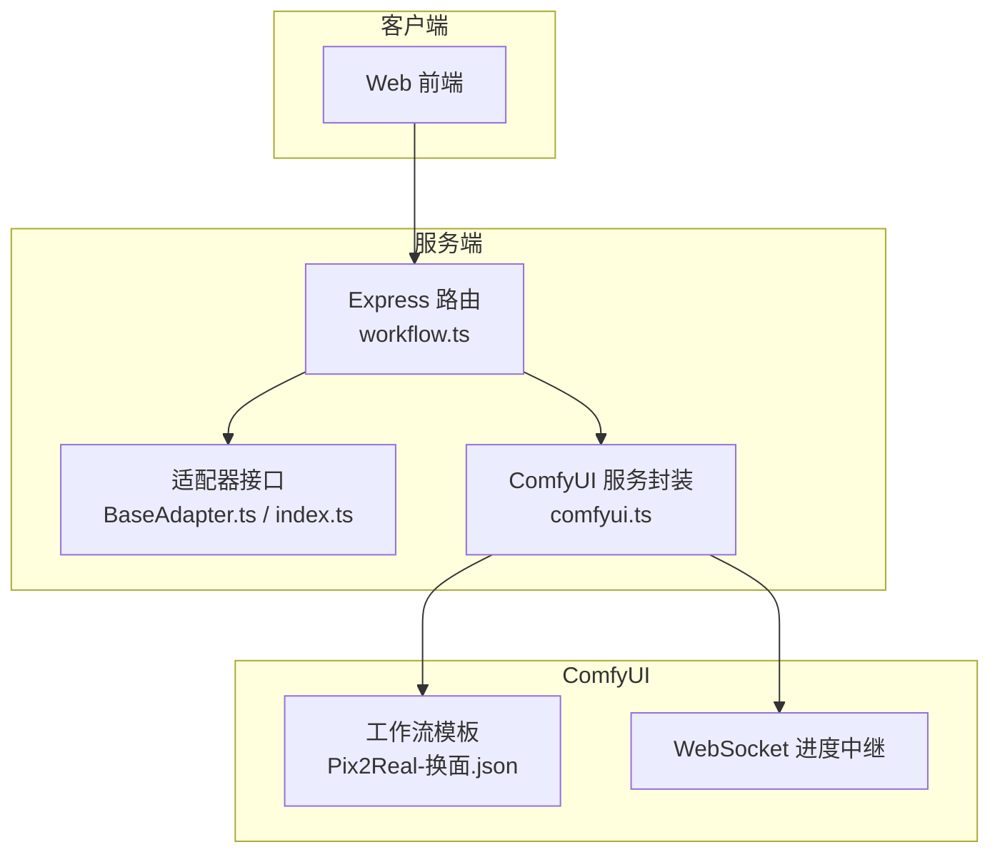
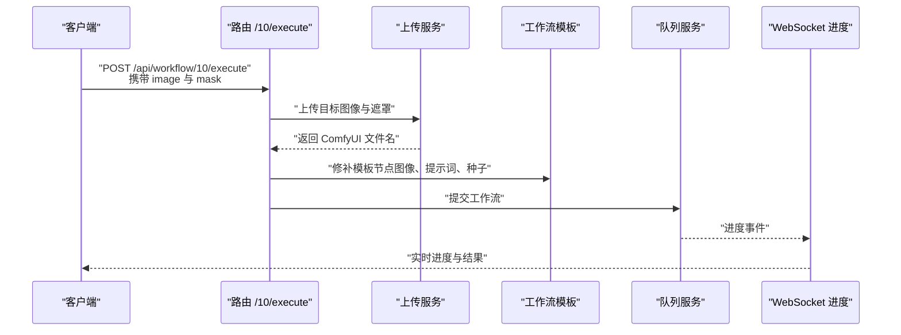
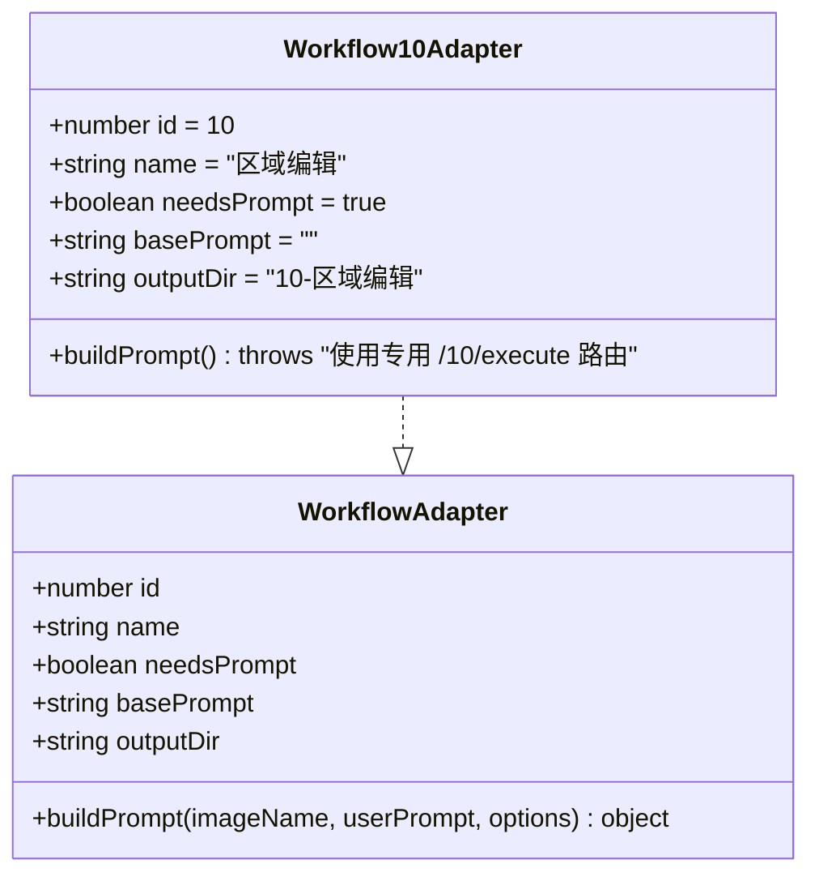
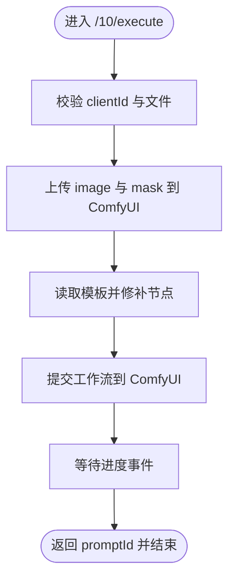
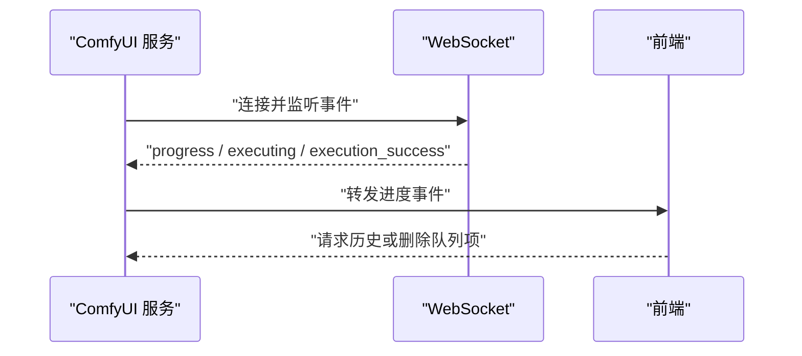
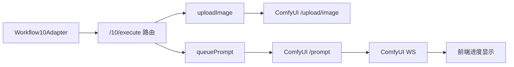

# Workflow10Adapter - 换面

<cite>
**本文引用的文件**
- [Workflow10Adapter.ts](file://server/src/adapters/Workflow10Adapter.ts)
- [BaseAdapter.ts](file://server/src/adapters/BaseAdapter.ts)
- [index.ts](file://server/src/types/index.ts)
- [workflow.ts](file://server/src/routes/workflow.ts)
- [comfyui.ts](file://server/src/services/comfyui.ts)
- [Pix2Real-换面.json](file://ComfyUI_API/Pix2Real-换面.json)
- [README.md](file://README.md)
</cite>

## 目录
1. [简介](#简介)
2. [项目结构](#项目结构)
3. [核心组件](#核心组件)
4. [架构总览](#架构总览)
5. [详细组件分析](#详细组件分析)
6. [依赖关系分析](#依赖关系分析)
7. [性能考量](#性能考量)
8. [故障排查指南](#故障排查指南)
9. [结论](#结论)
10. [附录](#附录)

## 简介
本文件为 Workflow10Adapter 的技术文档，聚焦“换面”工作流的实现与使用。尽管适配器本身仅声明了工作流元数据（ID、名称、是否需要提示词、输出目录等），但“换面”功能的实际执行逻辑由专用路由与 ComfyUI 工作流模板共同完成。本文将从系统架构、组件职责、数据流、处理流程、参数调优与质量控制等方面进行深入解析，并给出隐私保护与安全建议。

## 项目结构
- 服务端采用 Express + TypeScript，通过适配器模式加载 ComfyUI 工作流模板，按需修补节点参数后提交执行。
- “换面”工作流通过专用路由处理，使用 ComfyUI 模板中的节点组合实现图像级的局部替换与融合。

图表来源
- [workflow.ts:1-800](file://server/src/routes/workflow.ts#L1-L800)
- [comfyui.ts:1-472](file://server/src/services/comfyui.ts#L1-L472)
- [Pix2Real-换面.json:1-369](file://ComfyUI_API/Pix2Real-换面.json#L1-L369)

章节来源
- [README.md:41-79](file://README.md#L41-L79)

## 核心组件
- 适配器接口与实现
  - 接口定义位于类型模块，描述工作流的基本元数据与构建提示的方法签名。
  - Workflow10Adapter 作为适配器实例，声明工作流 ID、名称、是否需要提示词、基础提示词与输出目录；同时明确该工作流不使用通用的提示构建方法，而是走专用执行路由。
- 路由与执行
  - 专用路由负责接收目标图像与遮罩，上传至 ComfyUI，修补模板节点（如图像路径、提示词、随机种子等），并将最终工作流提交给 ComfyUI。
- ComfyUI 服务
  - 提供上传、排队、历史查询、进度中继等能力，支撑实时反馈与质量回溯。

章节来源
- [Workflow10Adapter.ts:1-15](file://server/src/adapters/Workflow10Adapter.ts#L1-L15)
- [index.ts:1-52](file://server/src/types/index.ts#L1-L52)
- [workflow.ts:217-267](file://server/src/routes/workflow.ts#L217-L267)
- [comfyui.ts:9-25](file://server/src/services/comfyui.ts#L9-L25)

## 架构总览
“换面”工作流的端到端流程如下：

图表来源
- [workflow.ts:217-267](file://server/src/routes/workflow.ts#L217-L267)
- [comfyui.ts:168-196](file://server/src/services/comfyui.ts#L168-L196)

## 详细组件分析

### 组件一：Workflow10Adapter 适配器
- 职责
  - 定义工作流元数据（ID=10、名称“区域编辑”、需要提示词、输出目录等）。
  - 明确该工作流不使用通用的提示构建方法，而是通过专用执行路由进行处理。
- 设计要点
  - 采用最小实现：仅暴露必要的元数据，避免与具体执行细节耦合。
  - 与路由层配合，确保输入校验与模板修补在服务端完成。

图表来源
- [index.ts:1-8](file://server/src/types/index.ts#L1-L8)
- [Workflow10Adapter.ts:4-14](file://server/src/adapters/Workflow10Adapter.ts#L4-L14)

章节来源
- [Workflow10Adapter.ts:1-15](file://server/src/adapters/Workflow10Adapter.ts#L1-L15)
- [index.ts:1-52](file://server/src/types/index.ts#L1-L52)

### 组件二：专用执行路由（/10/execute）
- 输入
  - 必填：clientId、image（目标图像）、mask（遮罩）。
  - 可选：prompt（用户提示词）、backPose（姿态相关开关）。
- 处理流程
  - 校验参数与文件存在性。
  - 上传图像与遮罩至 ComfyUI。
  - 读取模板并修补关键节点（图像路径、提示词、随机种子等）。
  - 提交工作流并返回 promptId。
- 关键节点（来自模板）
  - LoadImage：加载目标图像与遮罩。
  - ReferenceLatent / VAEEncode / VAEDecode：将像素与潜在空间相互转换，支撑后续采样与重建。
  - Flux2Scheduler / SamplerCustomAdvanced：采样器与调度器，控制生成质量与速度。
  - SaveImage：保存输出图像。

图表来源
- [workflow.ts:217-267](file://server/src/routes/workflow.ts#L217-L267)
- [Pix2Real-换面.json:1-369](file://ComfyUI_API/Pix2Real-换面.json#L1-L369)

章节来源
- [workflow.ts:217-267](file://server/src/routes/workflow.ts#L217-L267)

### 组件三：ComfyUI 服务与进度中继
- 上传与队列
  - 上传图像/视频至 ComfyUI，返回文件名以供模板节点使用。
  - 提交工作流并登记节点权重，用于阶段化进度计算。
- 进度中继
  - 通过 WebSocket 接收 progress、execution_start、executing、execution_success 等事件，向客户端转发。
  - 对于“换面”工作流，进度主要由采样器与潜在空间处理阶段构成。

图表来源
- [comfyui.ts:265-375](file://server/src/services/comfyui.ts#L265-L375)

章节来源
- [comfyui.ts:9-25](file://server/src/services/comfyui.ts#L9-L25)
- [comfyui.ts:168-196](file://server/src/services/comfyui.ts#L168-L196)
- [comfyui.ts:265-375](file://server/src/services/comfyui.ts#L265-L375)

### 组件四：工作流模板（Pix2Real-换面.json）
- 关键节点说明
  - LoadImage：加载目标图像与遮罩。
  - VAEEncode / VAEDecode：在像素域与潜在空间之间转换，便于采样与重建。
  - ReferenceLatent：将条件（如正向提示词）与潜在表示关联，指导采样过程。
  - Flux2Scheduler / SamplerCustomAdvanced：控制采样步数、调度策略与噪声注入。
  - SaveImage：保存最终输出。
- 参数位置
  - 图像路径、提示词、随机种子等在路由层被修补后写入模板对应节点。

章节来源
- [Pix2Real-换面.json:1-369](file://ComfyUI_API/Pix2Real-换面.json#L1-L369)

## 依赖关系分析
- 低耦合设计
  - 适配器仅暴露元数据，不参与具体执行细节，降低与路由层的耦合。
  - 路由层负责输入校验、模板修补与提交，职责清晰。
- 外部依赖
  - ComfyUI API：上传、队列、历史、视图等接口。
  - WebSocket：实时进度中继。
- 潜在风险
  - 模板节点与服务端修补逻辑需保持一致，否则可能导致运行时错误或输出异常。

图表来源
- [workflow.ts:217-267](file://server/src/routes/workflow.ts#L217-L267)
- [comfyui.ts:9-25](file://server/src/services/comfyui.ts#L9-L25)
- [comfyui.ts:168-196](file://server/src/services/comfyui.ts#L168-L196)

章节来源
- [workflow.ts:217-267](file://server/src/routes/workflow.ts#L217-L267)
- [comfyui.ts:9-25](file://server/src/services/comfyui.ts#L9-L25)
- [comfyui.ts:168-196](file://server/src/services/comfyui.ts#L168-L196)

## 性能考量
- 采样阶段权重
  - 采样器节点权重较高，是整体耗时的主要来源。可通过减少 steps 或选择更高效的采样器/调度器来缩短时间。
- 潜在空间处理
  - VAE 编码/解码与 ReferenceLatent 的使用会影响显存占用与速度，建议根据硬件情况调整分辨率与批次大小。
- 进度估算
  - 服务端基于节点权重估算全局进度，有助于用户预估等待时间。

章节来源
- [comfyui.ts:58-144](file://server/src/services/comfyui.ts#L58-L144)

## 故障排查指南
- 常见错误与定位
  - 模型/LoRA/V AE 文件缺失：路由层将 ComfyUI 的报错映射为用户可理解的提示。
  - 工作流提交失败：检查 ComfyUI 是否正常运行以及网络连通性。
  - 无图像/遮罩：确认请求体包含 image 与 mask 字段。
- 建议排查步骤
  - 查看路由层日志与错误映射。
  - 使用历史接口确认工作流状态与输出文件是否存在。
  - 检查模板节点修补是否正确（图像路径、提示词、种子）。

章节来源
- [workflow.ts:126-150](file://server/src/routes/workflow.ts#L126-L150)
- [workflow.ts:217-267](file://server/src/routes/workflow.ts#L217-L267)
- [comfyui.ts:198-207](file://server/src/services/comfyui.ts#L198-L207)

## 结论
Workflow10Adapter 通过最小化适配器实现与专用执行路由协作，将“换面”工作流的复杂度集中在服务端模板修补与 ComfyUI 执行层面。该设计具备良好的可维护性与扩展性，适合在保持界面简洁的同时持续优化生成质量与性能。

## 附录

### 使用示例与最佳实践
- 基本调用
  - 使用 multipart/form-data 提交 image 与 mask，设置 clientId，必要时传入 prompt 与 backPose。
- 参数调优
  - steps：影响生成质量与耗时，建议从较低值起步逐步提升。
  - 采样器与调度器：根据稳定性与速度选择合适组合。
  - 随机种子：若需复现，可在路由层固定 seed。
- 质量控制
  - 通过 WebSocket 实时观察进度，必要时删除队列项并重新提交。
  - 使用历史接口核对输出文件与状态。

章节来源
- [workflow.ts:217-267](file://server/src/routes/workflow.ts#L217-L267)
- [comfyui.ts:168-196](file://server/src/services/comfyui.ts#L168-L196)

### 隐私保护与处理安全建议
- 数据最小化
  - 仅上传必要的图像与遮罩，避免无关文件进入工作流。
- 本地处理优先
  - 在本地 ComfyUI 上运行，避免将敏感图像上传至第三方平台。
- 访问控制
  - 限制对 /10/execute 等路由的访问权限，结合认证与授权机制。
- 输出管理
  - 定期清理输出目录，避免敏感数据长期留存。
- 日志与审计
  - 记录关键操作（如提交、删除队列项），便于问题追溯与安全审计。