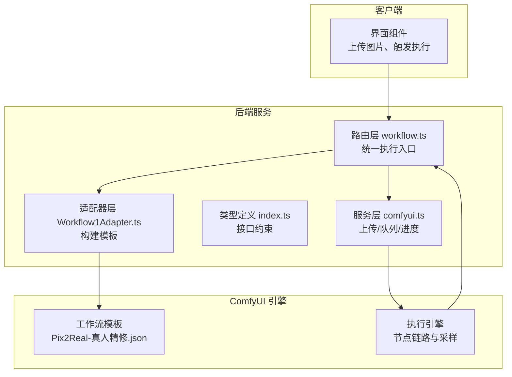
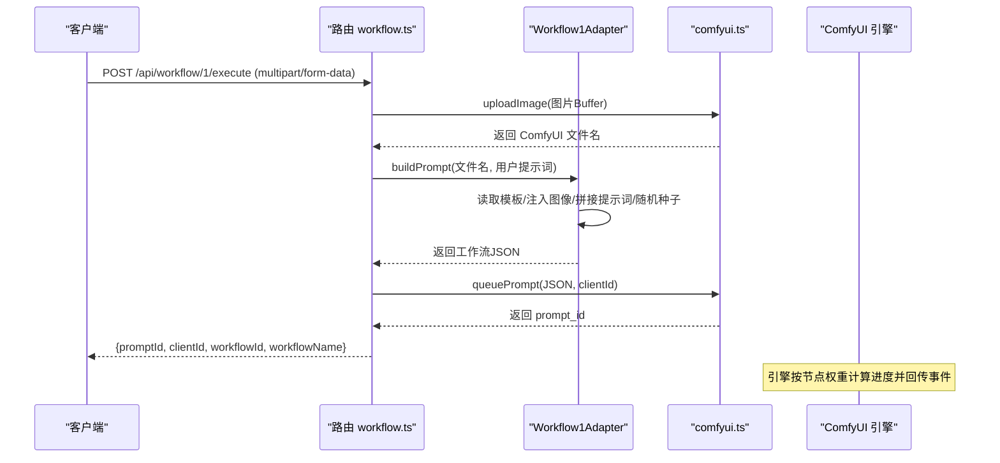
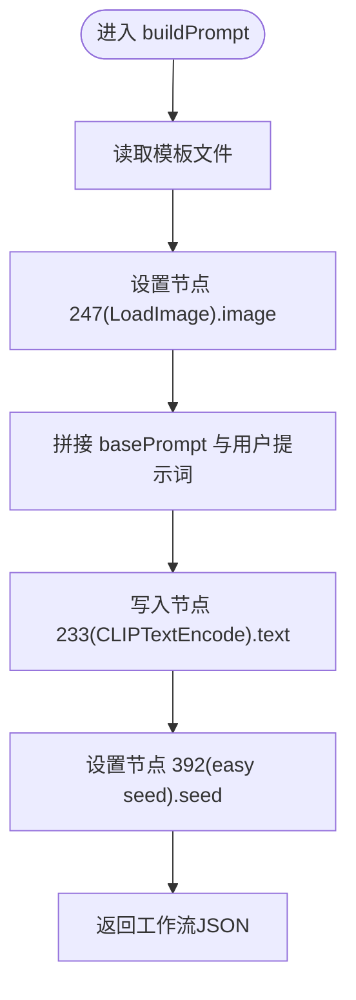
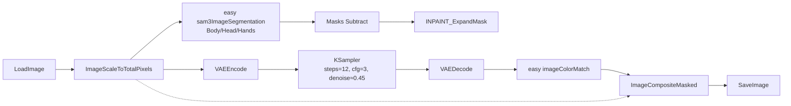
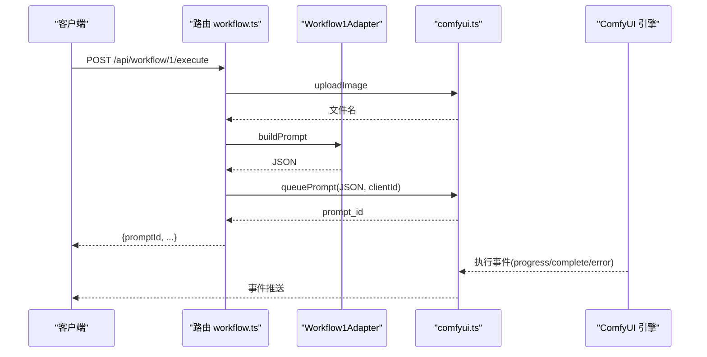
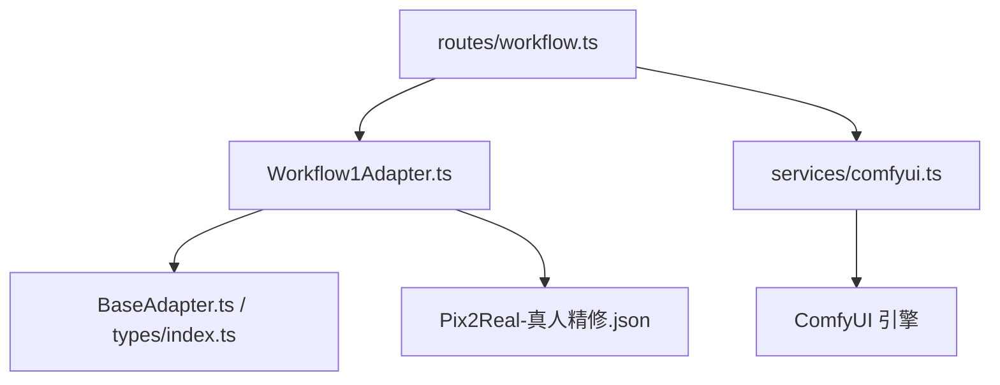

# Workflow1Adapter - 真人精修

<cite>
**本文引用的文件**
- [Workflow1Adapter.ts](file://server/src/adapters/Workflow1Adapter.ts)
- [Pix2Real-真人精修.json](file://ComfyUI_API/Pix2Real-真人精修.json)
- [BaseAdapter.ts](file://server/src/adapters/BaseAdapter.ts)
- [index.ts](file://server/src/adapters/index.ts)
- [workflow.ts](file://server/src/routes/workflow.ts)
- [comfyui.ts](file://server/src/services/comfyui.ts)
- [index.ts](file://server/src/types/index.ts)
</cite>

## 目录
1. [简介](#简介)
2. [项目结构](#项目结构)
3. [核心组件](#核心组件)
4. [架构总览](#架构总览)
5. [详细组件分析](#详细组件分析)
6. [依赖关系分析](#依赖关系分析)
7. [性能考量](#性能考量)
8. [故障排查指南](#故障排查指南)
9. [结论](#结论)
10. [附录](#附录)

## 简介
本技术文档围绕 Workflow1Adapter 的“真人精修”工作流展开，系统性阐述其在 ComfyUI 工作流模板中的实现机制，包括图像修复、细节增强与质量提升的处理逻辑；详细说明 JSON 模板结构、关键节点功能与参数配置；解释输入图像的质量评估与自动优化参数选择策略；并提供使用示例、参数调优建议与输出效果对比思路，以及性能优化与批量处理策略。

## 项目结构
- 后端适配层位于 server/src/adapters，其中 Workflow1Adapter 负责构建“真人精修”工作流的 JSON 模板。
- 工作流模板位于 ComfyUI_API/Pix2Real-真人精修.json，描述完整的节点连接与参数。
- 路由层 server/src/routes/workflow.ts 提供 /api/workflow/:id/execute 统一入口，负责上传文件、构建模板、提交队列与事件回调。
- 服务层 server/src/services/comfyui.ts 提供上传、队列提交、历史查询与进度权重计算等能力。
- 类型定义位于 server/src/types/index.ts，约束适配器接口与事件结构。

图表来源
- [workflow.ts:750-799](file://server/src/routes/workflow.ts#L750-L799)
- [Workflow1Adapter.ts:16-34](file://server/src/adapters/Workflow1Adapter.ts#L16-L34)
- [comfyui.ts:9-25](file://server/src/services/comfyui.ts#L9-L25)

章节来源
- [workflow.ts:750-799](file://server/src/routes/workflow.ts#L750-L799)
- [Workflow1Adapter.ts:1-36](file://server/src/adapters/Workflow1Adapter.ts#L1-L36)
- [index.ts:1-33](file://server/src/adapters/index.ts#L1-L33)

## 核心组件
- Workflow1Adapter：实现 buildPrompt 方法，读取模板、注入输入图像名称、拼接正向提示词、设置随机种子，并返回完整工作流 JSON。
- 工作流模板：包含图像缩放、分割（SAM3）、遮罩扩展、VAE 编码/解码、K 采样器、颜色匹配、保存与对比等节点。
- 路由与服务：统一的 /api/workflow/:id/execute 接口，负责文件上传、模板构建、队列提交与进度事件回传。

章节来源
- [Workflow1Adapter.ts:9-34](file://server/src/adapters/Workflow1Adapter.ts#L9-L34)
- [Pix2Real-真人精修.json:1-369](file://ComfyUI_API/Pix2Real-真人精修.json#L1-L369)
- [workflow.ts:750-799](file://server/src/routes/workflow.ts#L750-L799)

## 架构总览
“真人精修”工作流通过适配器将用户上传的图片与模板进行参数绑定，再交由 ComfyUI 执行。整体流程如下：

图表来源
- [workflow.ts:750-799](file://server/src/routes/workflow.ts#L750-L799)
- [Workflow1Adapter.ts:16-34](file://server/src/adapters/Workflow1Adapter.ts#L16-L34)
- [comfyui.ts:168-196](file://server/src/services/comfyui.ts#L168-L196)

## 详细组件分析

### 适配器：Workflow1Adapter
- 职责
  - 读取“真人精修”模板文件。
  - 注入用户上传的图片名称至 LoadImage 节点。
  - 将 basePrompt 与用户提示词拼接，写入正向 CLIPTextEncode 节点。
  - 设置随机种子至 easy seed 节点。
  - 返回完整工作流 JSON。
- 关键行为
  - 模板路径固定为 Pix2Real-👻真人精修NEW.json。
  - 正向提示词节点为 233（CLIPTextEncode），非 SAM 节点。
  - 种子范围为 0 到 1125899906842624-1。

图表来源
- [Workflow1Adapter.ts:16-34](file://server/src/adapters/Workflow1Adapter.ts#L16-L34)

章节来源
- [Workflow1Adapter.ts:9-34](file://server/src/adapters/Workflow1Adapter.ts#L9-L34)

### 工作流模板：节点功能与参数
- 模型加载与文本编码
  - CheckpointLoaderSimple：加载模型 IL-perfectionRealisticILXL_33.safetensors。
  - CLIPTextEncode（正向/负向）：分别承载正向与负向提示词。
- 图像预处理
  - LoadImage：加载用户上传图像。
  - ImageScaleToTotalPixels：按 megapixels=1.2 进行缩放，控制后续采样的分辨率预算。
- 分割与遮罩
  - easy sam3ImageSegmentation：对 Body、Head/Neck/Face、Hands 等区域进行分割。
  - Masks Subtract：通过相减获得更精细的区域掩码。
  - INPAINT_ExpandMask：对掩码进行扩张与模糊，提升修复边界自然度。
- 采样与重建
  - VAEEncode：将目标图像编码为潜在空间。
  - KSampler：使用 dpmpp_2m_sde 采样器、karras 调度器、steps=12、cfg=3、denoise≈0.45。
  - VAEDecode：将潜在结果解码为图像。
- 后处理与输出
  - easy imageColorMatch：与缩放前图像进行颜色匹配，减少色差。
  - ImageCompositeMasked：将修复区域与原图合成，避免重复修复。
  - SaveImage：保存最终结果。
  - Image Comparer (rgthree)：对比修复前后图像，辅助质量评估。

图表来源
- [Pix2Real-真人精修.json:1-369](file://ComfyUI_API/Pix2Real-真人精修.json#L1-L369)

章节来源
- [Pix2Real-真人精修.json:1-369](file://ComfyUI_API/Pix2Real-真人精修.json#L1-L369)

### 路由与执行：统一入口与事件回传
- 统一执行接口
  - POST /api/workflow/:id/execute：支持单张图片上传，根据 workflowId 获取适配器，构建模板并提交队列。
- 事件与进度
  - 服务层通过 WebSocket 订阅执行事件，计算节点权重与总体进度，完成时回传输出文件列表。
- 错误映射
  - 对 ComfyUI 常见错误（如模型缺失、队列失败）进行中文友好提示。

图表来源
- [workflow.ts:750-799](file://server/src/routes/workflow.ts#L750-L799)
- [comfyui.ts:168-196](file://server/src/services/comfyui.ts#L168-L196)
- [comfyui.ts:318-348](file://server/src/services/comfyui.ts#L318-L348)

章节来源
- [workflow.ts:750-799](file://server/src/routes/workflow.ts#L750-L799)
- [comfyui.ts:168-196](file://server/src/services/comfyui.ts#L168-L196)
- [comfyui.ts:318-348](file://server/src/services/comfyui.ts#L318-L348)

### 输入图像质量评估与自动优化参数选择
- 质量评估维度
  - 分辨率与总像素：通过 ImageScaleToTotalPixels.megapixels 控制，建议根据显存与目标分辨率设定（例如 1.2~2.0）。
  - 采样参数：steps、cfg、denoise、采样器与调度器共同影响细节与稳定性。
  - 遮罩策略：INPAINT_ExpandMask.grow 与 blur 控制修复边缘自然度，需结合对象大小与纹理复杂度调整。
- 自动优化策略
  - 低分辨率或纹理简单：降低 steps、适度提高 denoise，减少噪点残留。
  - 高细节皮肤/发丝：提高 steps、适度降低 cfg，配合更细致的遮罩扩张。
  - 显存受限：降低 megapixels 或 steps，必要时关闭颜色匹配以节省显存。

章节来源
- [Pix2Real-真人精修.json:106-138](file://ComfyUI_API/Pix2Real-真人精修.json#L106-L138)
- [Pix2Real-真人精修.json:218-232](file://ComfyUI_API/Pix2Real-真人精修.json#L218-L232)
- [comfyui.ts:59-128](file://server/src/services/comfyui.ts#L59-L128)

### 使用示例与参数调优
- 适用场景
  - 真人照片的细节增强与瑕疵修复（如毛孔、细纹、衣物纹理）。
  - 保持肤色与光照一致性的同时提升整体清晰度。
- 基本步骤
  - 上传一张高质量原图（建议分辨率≥1080p）。
  - 在提示词中强调“高清、细节、真实感”，避免负面提示词。
  - 根据对象大小与遮罩复杂度微调 INPAINT_ExpandMask 参数。
- 参数调优建议
  - 采样：steps=12、cfg=3、denoise≈0.45；若出现光斑则降低 denoise。
  - 分辨率：megapixels=1.2~2.0；显存不足时下调。
  - 遮罩：hands/body/head 的 grow 与 blur 以修复边缘为准，避免过度扩张导致伪影。
- 输出效果对比
  - 使用 rgthree Image Comparer 对比修复前后，关注细节密度、色彩一致性和边缘自然度。

章节来源
- [Pix2Real-真人精修.json:1-369](file://ComfyUI_API/Pix2Real-真人精修.json#L1-L369)
- [workflow.ts:750-799](file://server/src/routes/workflow.ts#L750-L799)

## 依赖关系分析
- 适配器依赖
  - 依赖模板文件路径与节点 ID 的稳定性。
  - 依赖 BaseAdapter.ts 中的 WorkflowAdapter 接口约定。
- 路由依赖
  - 依赖 adapters/index.ts 中的适配器注册表。
  - 依赖 comfyui.ts 的上传与队列服务。
- 服务层依赖
  - 依赖 ComfyUI 的 REST API 与 WebSocket 事件。
  - 依赖节点权重表与采样器类型集合进行进度估算。

图表来源
- [index.ts:1-33](file://server/src/adapters/index.ts#L1-L33)
- [BaseAdapter.ts:1-4](file://server/src/adapters/BaseAdapter.ts#L1-L4)
- [index.ts:1-8](file://server/src/types/index.ts#L1-L8)

章节来源
- [index.ts:1-33](file://server/src/adapters/index.ts#L1-L33)
- [BaseAdapter.ts:1-4](file://server/src/adapters/BaseAdapter.ts#L1-L4)
- [index.ts:1-8](file://server/src/types/index.ts#L1-L8)

## 性能考量
- 采样阶段权重最大，建议优先优化采样参数与显存占用。
- megapixels 与 steps 成正比影响显存与时间，建议在 1.2~2.0 范围内平衡质量与速度。
- 遮罩扩张与颜色匹配会增加额外计算，可根据显存情况选择性关闭。
- 批量处理建议
  - 采用队列排队与优先级调整，避免长时间阻塞。
  - 对于大批量任务，建议分批执行并定期释放内存（/api/workflow/release-memory）。

章节来源
- [comfyui.ts:59-128](file://server/src/services/comfyui.ts#L59-L128)
- [comfyui.ts:168-196](file://server/src/services/comfyui.ts#L168-L196)
- [workflow.ts:887-901](file://server/src/routes/workflow.ts#L887-L901)

## 故障排查指南
- 常见错误与定位
  - 模型/LoRA/UNet/VAE/ControlNet 未找到：检查对应文件是否存在，或查看友好错误映射。
  - 队列提交失败：确认 ComfyUI 服务可用且端口开放。
  - 无输出或空结果：等待执行完成后通过历史接口获取输出文件列表。
- 定位方法
  - 查看路由层错误映射函数 toFriendlyComfyError。
  - 通过 /api/workflow/system-stats 监控显存与内存使用。
  - 使用 /api/workflow/release-memory 释放资源后重试。

章节来源
- [workflow.ts:126-150](file://server/src/routes/workflow.ts#L126-L150)
- [workflow.ts:877-885](file://server/src/routes/workflow.ts#L877-L885)
- [workflow.ts:887-901](file://server/src/routes/workflow.ts#L887-L901)

## 结论
Workflow1Adapter 将“真人精修”工作流模板与用户输入无缝衔接，通过合理的节点编排与参数配置，在保证细节增强与质量提升的同时兼顾了执行效率与稳定性。结合质量评估与自动优化策略，可在不同场景下取得稳定、可复现的高质量输出。

## 附录

### JSON 模板关键节点一览
- 模型与提示词
  - CheckpointLoaderSimple：模型文件名。
  - CLIPTextEncode（正向/负向）：提示词文本。
- 图像处理
  - LoadImage：输入图像。
  - ImageScaleToTotalPixels：缩放与分辨率预算。
- 分割与遮罩
  - easy sam3ImageSegmentation：区域分割。
  - Masks Subtract：遮罩相减。
  - INPAINT_ExpandMask：遮罩扩张与模糊。
- 采样与重建
  - VAEEncode/VAEDecode：VAE 编码/解码。
  - KSampler：采样器、调度器、步数、CFG、去噪强度。
- 后处理与输出
  - easy imageColorMatch：颜色匹配。
  - ImageCompositeMasked：合成修复区域。
  - SaveImage：保存结果。
  - Image Comparer (rgthree)：前后对比。

章节来源
- [Pix2Real-真人精修.json:1-369](file://ComfyUI_API/Pix2Real-真人精修.json#L1-L369)