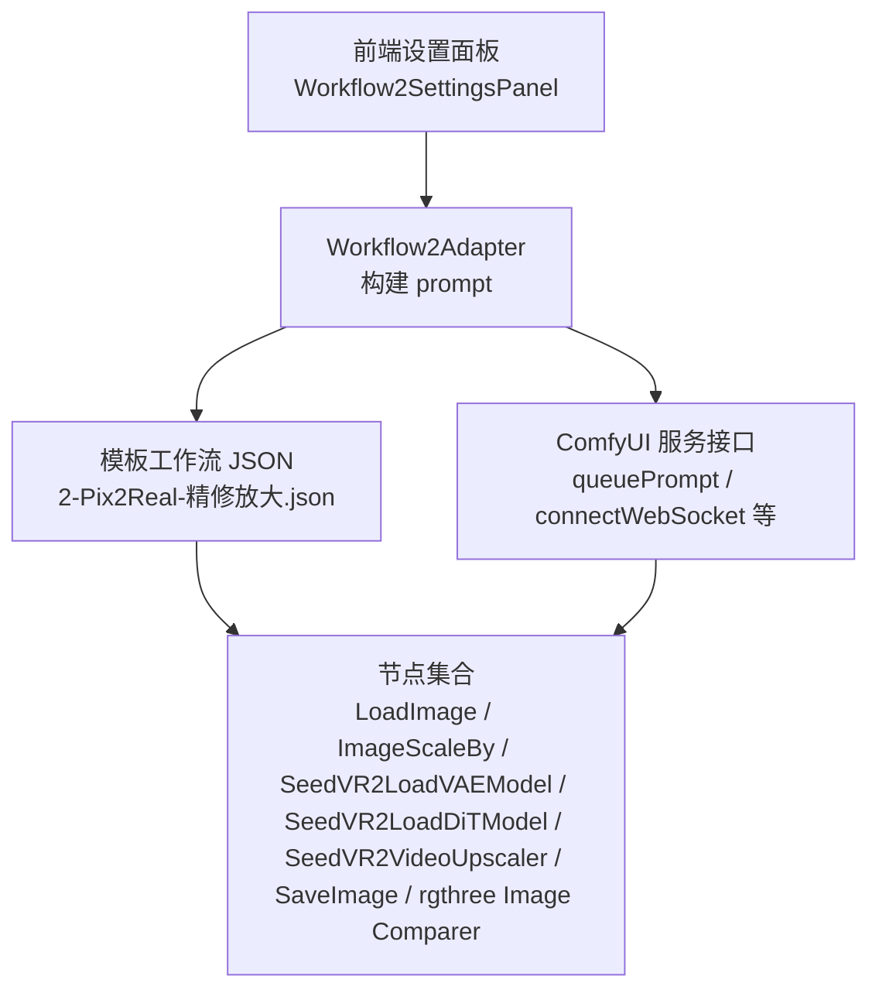
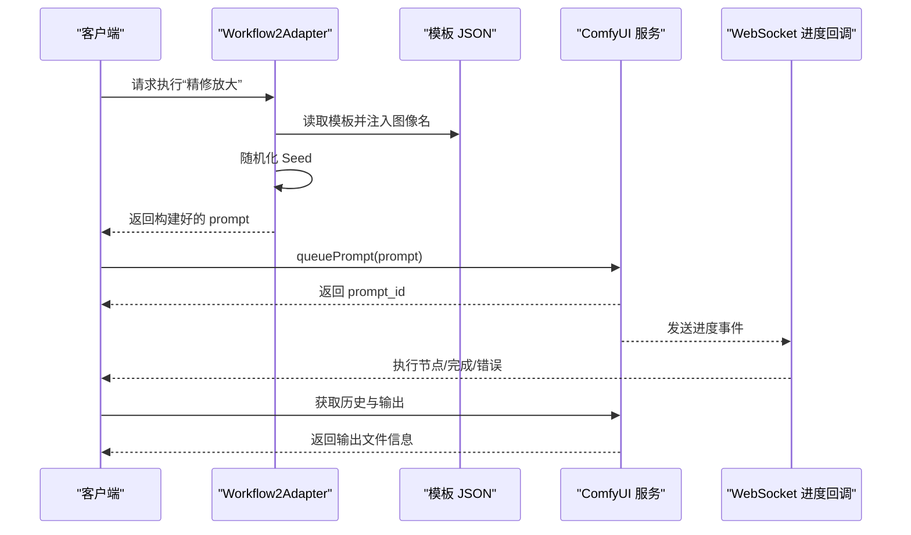
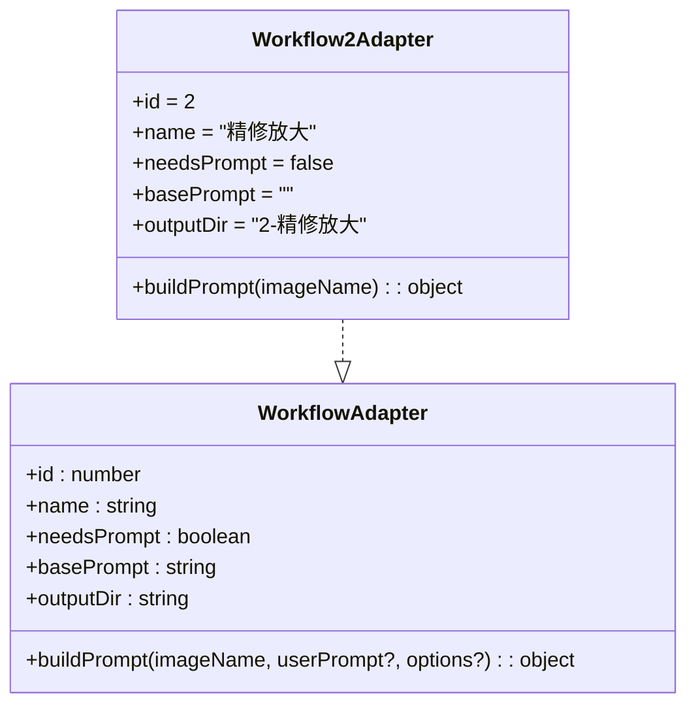
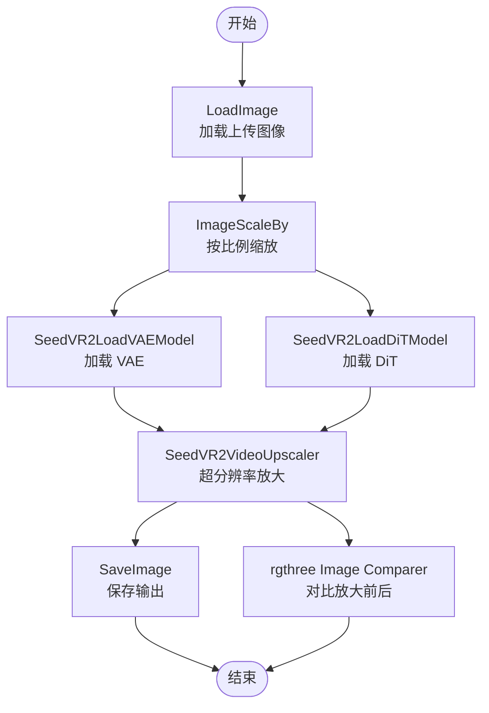
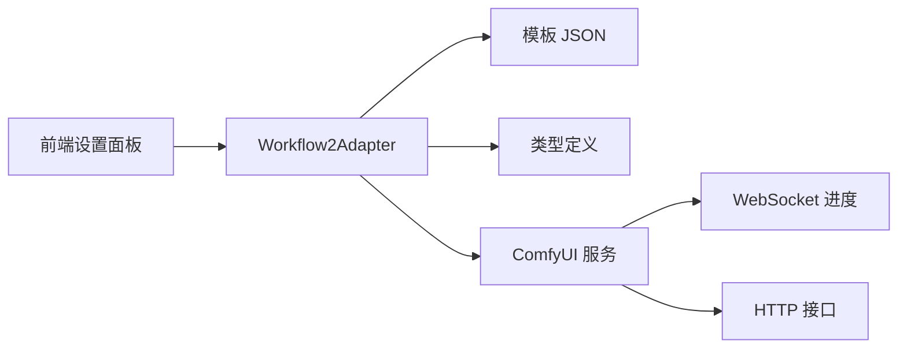

# Workflow2Adapter - 精修放大

<cite>
**本文引用的文件**
- [Workflow2Adapter.ts](file://server/src/adapters/Workflow2Adapter.ts)
- [2-Pix2Real-精修放大.json](file://ComfyUI_API/2-Pix2Real-精修放大.json)
- [Workflow2SettingsPanel.tsx](file://client/src/components/Workflow2SettingsPanel.tsx)
- [comfyui.ts](file://server/src/services/comfyui.ts)
- [index.ts](file://server/src/types/index.ts)
- [Workflow0Adapter.ts](file://server/src/adapters/Workflow0Adapter.ts)
- [Workflow1Adapter.ts](file://server/src/adapters/Workflow1Adapter.ts)
</cite>

## 目录
1. [简介](#简介)
2. [项目结构](#项目结构)
3. [核心组件](#核心组件)
4. [架构总览](#架构总览)
5. [详细组件分析](#详细组件分析)
6. [依赖关系分析](#依赖关系分析)
7. [性能考量](#性能考量)
8. [故障排查指南](#故障排查指南)
9. [结论](#结论)
10. [附录](#附录)

## 简介
本技术文档围绕 Workflow2Adapter 的“精修放大”工作流展开，系统性解析其在 ComfyUI 中的实现方式、节点作用与参数配置，并结合前端设置面板说明如何在不输入文本提示的前提下完成高质量图像的超分辨率放大。文档重点覆盖以下方面：
- 工作流数据流与节点职责
- 放大倍数设置、保真度参数与噪声抑制机制
- 上采样算法与后处理优化策略
- 使用示例与效果对比
- 性能优化与内存管理建议

## 项目结构
“精修放大”工作流由三部分组成：
- 适配器层：负责读取模板工作流、注入输入图像与随机种子，输出可提交给 ComfyUI 的 prompt 对象
- 模板工作流：以 JSON 形式描述节点连接与参数，包含图像加载、缩放、VAE/DiT 模型加载以及超分放大节点
- 前端设置面板：提供放大模型选择（SeedVR2/Klein/KleinPro/4xUltraSharp/Remacri）

图表来源
- [Workflow2Adapter.ts:1-27](file://server/src/adapters/Workflow2Adapter.ts#L1-L27)
- [2-Pix2Real-精修放大.json:1-146](file://ComfyUI_API/2-Pix2Real-精修放大.json#L1-L146)
- [Workflow2SettingsPanel.tsx:1-60](file://client/src/components/Workflow2SettingsPanel.tsx#L1-L60)
- [comfyui.ts:168-196](file://server/src/services/comfyui.ts#L168-L196)

章节来源
- [Workflow2Adapter.ts:1-27](file://server/src/adapters/Workflow2Adapter.ts#L1-L27)
- [2-Pix2Real-精修放大.json:1-146](file://ComfyUI_API/2-Pix2Real-精修放大.json#L1-L146)
- [Workflow2SettingsPanel.tsx:1-60](file://client/src/components/Workflow2SettingsPanel.tsx#L1-L60)

## 核心组件
- 适配器接口与实现
  - 接口定义包含工作流标识、名称、是否需要提示词、基础提示词、输出目录以及构建 prompt 的方法
  - Workflow2Adapter 实现了该接口，读取模板 JSON 并注入上传图像名与随机种子
- 模板工作流
  - 包含 LoadImage、ImageScaleBy、VAE/DiT 模型加载、SeedVR2VideoUpscaler、保存与对比节点
  - 放大前通过 ImageScaleBy 将图像按比例缩小，作为“精修放大”的前置步骤
- 前端设置面板
  - 提供放大模型选择，便于用户在多种上采样模型间切换

章节来源
- [index.ts:1-8](file://server/src/types/index.ts#L1-L8)
- [Workflow2Adapter.ts:9-26](file://server/src/adapters/Workflow2Adapter.ts#L9-L26)
- [2-Pix2Real-精修放大.json:57-145](file://ComfyUI_API/2-Pix2Real-精修放大.json#L57-L145)
- [Workflow2SettingsPanel.tsx:9-59](file://client/src/components/Workflow2SettingsPanel.tsx#L9-L59)

## 架构总览
下图展示了从客户端到 ComfyUI 的完整调用链路，以及工作流在服务端的构建过程：

图表来源
- [Workflow2Adapter.ts:16-25](file://server/src/adapters/Workflow2Adapter.ts#L16-L25)
- [comfyui.ts:168-196](file://server/src/services/comfyui.ts#L168-L196)
- [comfyui.ts:304-375](file://server/src/services/comfyui.ts#L304-L375)

## 详细组件分析

### 组件一：Workflow2Adapter（适配器）
- 职责
  - 读取模板 JSON 文件
  - 注入上传图像名至 LoadImage 节点
  - 随机化 SeedVR2VideoUpscaler 的种子值
  - 返回可提交的 prompt 对象
- 关键行为
  - 构建 prompt 时对模板进行深拷贝，避免污染原始模板
  - 通过 Math.random 生成 32 位种子，提升结果多样性
- 与其他组件的关系
  - 依赖模板 JSON 的节点 ID 与输入键名
  - 与 ComfyUI 服务交互，提交 prompt 并接收进度事件

图表来源
- [index.ts:1-8](file://server/src/types/index.ts#L1-L8)
- [Workflow2Adapter.ts:9-26](file://server/src/adapters/Workflow2Adapter.ts#L9-L26)

章节来源
- [Workflow2Adapter.ts:1-27](file://server/src/adapters/Workflow2Adapter.ts#L1-L27)
- [index.ts:1-8](file://server/src/types/index.ts#L1-L8)

### 组件二：模板工作流（2-Pix2Real-精修放大.json）
- 节点概览与作用
  - LoadImage：加载上传图像
  - ImageScaleBy：按比例缩放图像（此处为缩小，作为“精修放大”的前置处理）
  - SeedVR2LoadVAEModel：加载 VAE 模型，支持分块编码/解码与设备卸载
  - SeedVR2LoadDiTModel：加载 DiT 模型，支持块交换与注意力模式
  - SeedVR2VideoUpscaler：核心放大节点，包含分辨率、批次、颜色校正、噪声抑制等参数
  - SaveImage：保存输出图像
  - rgthree Image Comparer：对比放大前后图像
- 参数要点
  - 放大方法与比例：ImageScaleBy 的 upscale_method 与 scale_by
  - 放大核心参数：SeedVR2VideoUpscaler 的 resolution、batch_size、color_correction、input_noise_scale、latent_noise_scale 等
  - VAE/DiT 模型参数：encode_tiled/decode_tiled、device/offload_device、attention_mode/cache_model 等
- 数据流
  - 输入图像经 LoadImage → ImageScaleBy（缩小）→ SeedVR2VideoUpscaler（放大）
  - 输出经 SaveImage 保存，同时通过 rgthree Image Comparer 进行对比

图表来源
- [2-Pix2Real-精修放大.json:57-145](file://ComfyUI_API/2-Pix2Real-精修放大.json#L57-L145)

章节来源
- [2-Pix2Real-精修放大.json:57-145](file://ComfyUI_API/2-Pix2Real-精修放大.json#L57-L145)

### 组件三：前端设置面板（Workflow2SettingsPanel）
- 功能
  - 提供放大模型选择：SeedVR2、Klein、KleinPro、4xUltraSharp、Remacri
  - 使用 localStorage 持久化用户选择
- 与工作流的关系
  - 当前模板 JSON 中未直接体现“放大模型”参数；若需切换模型，可在模板中替换对应模型加载节点或通过外部脚本/工具更新 JSON
  - 若后续扩展，可在适配器层根据设置动态修改模板中的模型路径或节点参数

章节来源
- [Workflow2SettingsPanel.tsx:9-59](file://client/src/components/Workflow2SettingsPanel.tsx#L9-L59)

### 组件四：ComfyUI 服务接口（进度与历史）
- 关键能力
  - 提交 prompt、查询历史、获取图像缓冲、建立 WebSocket 监听进度
  - 计算节点权重，用于阶段化进度展示
- 与工作流的交互
  - 适配器构建 prompt 后提交至 queuePrompt
  - 通过 connectWebSocket 接收进度事件，驱动前端 UI 更新
  - 完成后通过 getHistory 获取输出文件列表

章节来源
- [comfyui.ts:168-196](file://server/src/services/comfyui.ts#L168-L196)
- [comfyui.ts:221-263](file://server/src/services/comfyui.ts#L221-L263)
- [comfyui.ts:304-375](file://server/src/services/comfyui.ts#L304-L375)

### 组件五：对比参考（其他工作流适配器）
- Workflow0Adapter 与 Workflow1Adapter 展示了不同工作流的 prompt 构建方式与参数注入策略，可作为“精修放大”适配器的参考实现模式

章节来源
- [Workflow0Adapter.ts:16-34](file://server/src/adapters/Workflow0Adapter.ts#L16-L34)
- [Workflow1Adapter.ts:16-34](file://server/src/adapters/Workflow1Adapter.ts#L16-L34)

## 依赖关系分析
- 适配器对模板 JSON 的强依赖：必须与节点 ID、输入键名保持一致
- 服务层对 ComfyUI 的依赖：HTTP 接口与 WebSocket
- 前端对适配器与服务层的依赖：构建 prompt、提交任务、监听进度

图表来源
- [Workflow2Adapter.ts:1-27](file://server/src/adapters/Workflow2Adapter.ts#L1-L27)
- [index.ts:1-8](file://server/src/types/index.ts#L1-L8)
- [comfyui.ts:168-196](file://server/src/services/comfyui.ts#L168-L196)

章节来源
- [Workflow2Adapter.ts:1-27](file://server/src/adapters/Workflow2Adapter.ts#L1-L27)
- [index.ts:1-8](file://server/src/types/index.ts#L1-L8)
- [comfyui.ts:168-196](file://server/src/services/comfyui.ts#L168-L196)

## 性能考量
- 放大倍数与分辨率
  - SeedVR2VideoUpscaler 的 resolution 控制目标分辨率；resolution 越高，显存占用与耗时显著上升
  - 建议根据显存上限与输出需求合理设置 resolution
- 批次与噪声抑制
  - batch_size 影响吞吐与稳定性；增大批次可能提升效率但需注意显存压力
  - input_noise_scale 与 latent_noise_scale 用于噪声抑制，适度开启可改善细节但会增加计算量
- VAE/DiT 模型的分块与卸载
  - VAE 的 encode_tiled/decode_tiled 与 tile_size/overlap 参数影响显存占用与速度
  - offload_device 设置为 CPU 可缓解显存压力，但会增加 CPU-GPU 传输开销
- 上采样算法
  - ImageScaleBy 的 upscale_method 影响缩放质量与速度；lanczos 在质量与性能之间较为均衡
- 进度权重与估算
  - 采样器节点权重与“分块采样”估算值用于阶段化进度展示，有助于用户感知耗时分布

章节来源
- [2-Pix2Real-精修放大.json:66-145](file://ComfyUI_API/2-Pix2Real-精修放大.json#L66-L145)
- [comfyui.ts:118-144](file://server/src/services/comfyui.ts#L118-L144)

## 故障排查指南
- 上传图像未生效
  - 检查 LoadImage 节点的 image 字段是否被正确注入
  - 确认模板 JSON 中节点 ID 与适配器注入逻辑一致
- 放大失败或报错
  - 检查 SeedVR2VideoUpscaler 的分辨率、批次与噪声参数是否合理
  - 确认 VAE/DiT 模型路径与可用性
- 显存不足
  - 降低 resolution 或 batch_size
  - 调整 VAE 的 tile_size/overlap，或启用 offload_device
- 进度异常
  - 确认 WebSocket 连接正常，检查 onProgress/onComplete 回调是否被触发
  - 如遇“空结果”，可等待执行成功信号后再拉取历史

章节来源
- [Workflow2Adapter.ts:16-25](file://server/src/adapters/Workflow2Adapter.ts#L16-L25)
- [2-Pix2Real-精修放大.json:99-125](file://ComfyUI_API/2-Pix2Real-精修放大.json#L99-L125)
- [comfyui.ts:304-375](file://server/src/services/comfyui.ts#L304-L375)

## 结论
Workflow2Adapter 将“精修放大”工作流封装为可复用的适配器，通过模板 JSON 描述节点与参数，结合前端设置面板实现灵活的模型选择与参数调整。其核心在于：
- 在放大前进行合理的图像缩放与预处理
- 通过 VAE/DiT 模型与 SeedVR2VideoUpscaler 实现高质量超分辨率
- 利用分块与卸载策略平衡显存与性能
- 通过进度权重与 WebSocket 实时反馈执行状态

## 附录

### 使用示例与效果对比
- 不同放大倍数的效果对比
  - 低倍率：细节保留较好，噪声明显降低，适合局部增强
  - 高倍率：细节更丰富，但可能出现伪影或过度锐化，需配合噪声抑制参数
- 适用图像类型
  - 人像、纹理清晰的静物与建筑摄影更适合精修放大
  - 过于模糊或严重压缩的图像可能难以恢复细节
- 质量评估标准
  - PSNR/SSIM：客观指标，适合批量评估
  - 主观评分：对比 rgthree Image Comparer 的 A/B 图，评估细节与自然度

### 参数配置清单（关键项）
- 放大前处理
  - ImageScaleBy：upscale_method、scale_by
- 放大核心
  - SeedVR2VideoUpscaler：resolution、batch_size、color_correction、input_noise_scale、latent_noise_scale
- 模型加载
  - SeedVR2LoadVAEModel：encode_tiled、decode_tiled、tile_size、tile_overlap、offload_device
  - SeedVR2LoadDiTModel：blocks_to_swap、swap_io_components、attention_mode、cache_model、offload_device

章节来源
- [2-Pix2Real-精修放大.json:85-145](file://ComfyUI_API/2-Pix2Real-精修放大.json#L85-L145)