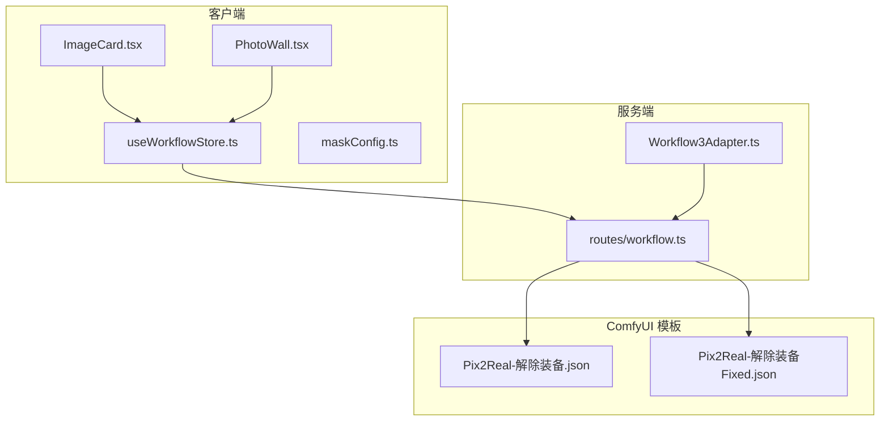
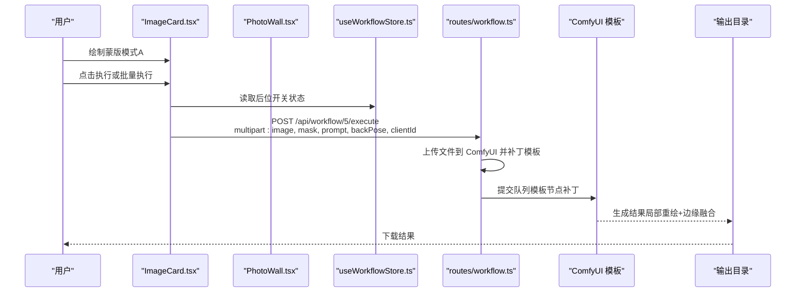
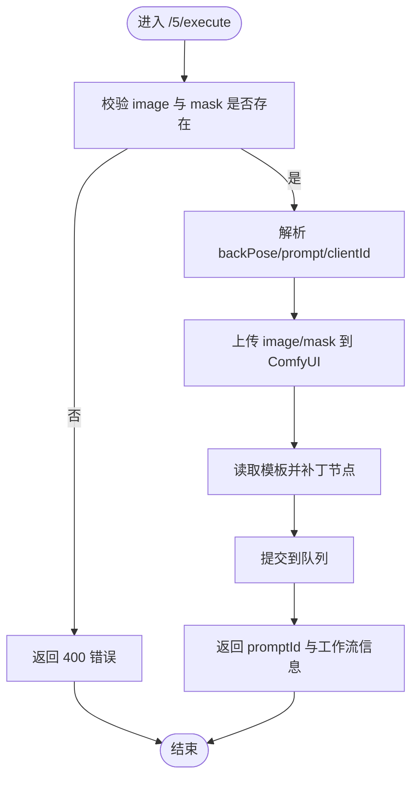
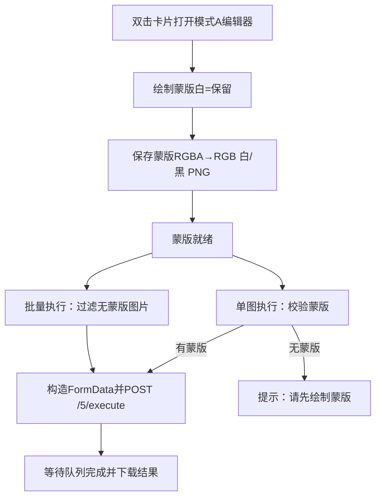
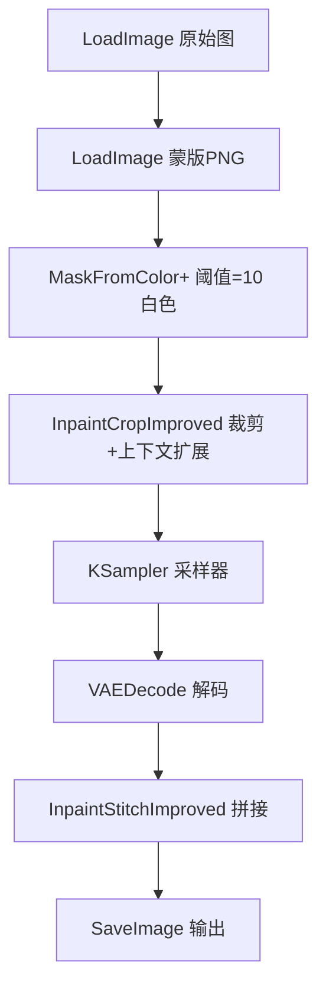
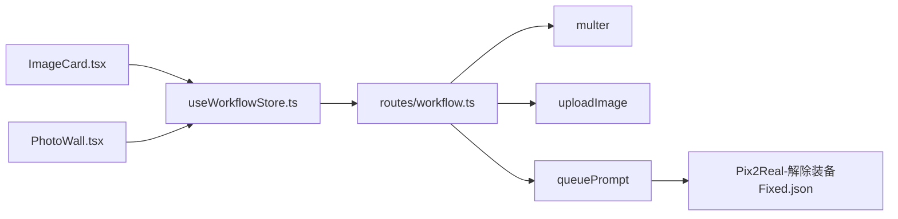

# Workflow3Adapter - 解除装备

<cite>
**本文引用的文件**
- [Workflow3Adapter.ts](file://server/src/adapters/Workflow3Adapter.ts)
- [Pix2Real-解除装备.json](file://ComfyUI_API/Pix2Real-解除装备.json)
- [Pix2Real-解除装备Fixed.json](file://ComfyUI_API/Pix2Real-解除装备Fixed.json)
- [2026-02-25-jiechuazhuangbei-workflow-design.md](file://docs/plans/2026-02-25-jiechuazhuangbei-workflow-design.md)
- [2026-02-25-jiechuazhuangbei-impl.md](file://docs/plans/2026-02-25-jiechuazhuangbei-impl.md)
- [workflow.ts](file://server/src/routes/workflow.ts)
- [ImageCard.tsx](file://client/src/components/ImageCard.tsx)
- [PhotoWall.tsx](file://client/src/components/PhotoWall.tsx)
- [useWorkflowStore.ts](file://client/src/hooks/useWorkflowStore.ts)
- [maskConfig.ts](file://client/src/config/maskConfig.ts)
- [2026-02-24-mask-editor.md](file://docs/plans/2026-02-24-mask-editor.md)
</cite>

## 目录
1. [简介](#简介)
2. [项目结构](#项目结构)
3. [核心组件](#核心组件)
4. [架构总览](#架构总览)
5. [详细组件分析](#详细组件分析)
6. [依赖关系分析](#依赖关系分析)
7. [性能考量](#性能考量)
8. [故障排查指南](#故障排查指南)
9. [结论](#结论)
10. [附录](#附录)

## 简介
本文件面向 Workflow3Adapter 的“解除装备”工作流，系统性阐述其在服务端与客户端的实现机制，重点解释以下方面：
- 智能分割：通过用户绘制的白色蒙版（白=保留，黑=移除）驱动局部重绘
- 装备检测：以颜色阈值法从纯RGB PNG中提取装备区域
- 背景重建：基于改进的局部重绘裁剪与拼接节点，结合LoRA后位模式，实现边缘自然融合
- 参数与流程：模板补丁、提示词策略、批处理与无掩码保护、LoRA开关等

注意：当前仓库中存在两个解除装备工作流模板文件，其中“Fixed”版本去除了中间转换节点，直接读取用户上传的白色蒙版PNG；本说明将围绕“Fixed”模板展开，并对两者差异进行对比。

## 项目结构
与“解除装备”工作流相关的文件分布如下：
- 服务端适配器与路由：Workflow3Adapter.ts、routes/workflow.ts
- 客户端交互与状态：ImageCard.tsx、PhotoWall.tsx、useWorkflowStore.ts、maskConfig.ts
- ComfyUI 工作流模板：Pix2Real-解除装备.json、Pix2Real-解除装备Fixed.json
- 设计与实现文档：2026-02-25-jiechuazhuangbei-workflow-design.md、2026-02-25-jiechuazhuangbei-impl.md、2026-02-24-mask-editor.md

图表来源
- [Workflow3Adapter.ts:1-41](file://server/src/adapters/Workflow3Adapter.ts#L1-L41)
- [workflow.ts:163-215](file://server/src/routes/workflow.ts#L163-L215)
- [Pix2Real-解除装备.json:1-372](file://ComfyUI_API/Pix2Real-解除装备.json#L1-L372)
- [Pix2Real-解除装备Fixed.json:1-360](file://ComfyUI_API/Pix2Real-解除装备Fixed.json#L1-L360)

章节来源
- [Workflow3Adapter.ts:1-41](file://server/src/adapters/Workflow3Adapter.ts#L1-L41)
- [workflow.ts:163-215](file://server/src/routes/workflow.ts#L163-L215)

## 核心组件
- 服务端适配器（Workflow3Adapter.ts）
  - 用于图生视频工作流的适配器，提供基础元数据与构建模板的方法骨架
  - 在“解除装备”场景中，实际由专用路由处理，适配器在此作为占位或通用能力
- 专用路由（routes/workflow.ts）
  - 注册 /api/workflow/5/execute，接收原始图像与白色蒙版PNG，以及可选提示词与后位LoRA开关
  - 将上传文件名注入模板对应节点，随机种子注入，按需替换提示词，提交至 ComfyUI 队列
- 客户端组件
  - ImageCard.tsx：在“解除装备”标签下显示后位切换按钮，执行前校验是否存在蒙版
  - PhotoWall.tsx：批量执行时跳过无蒙版的图片，构造FormData并发起请求
  - useWorkflowStore.ts：维护每个图片的后位开关状态，清理时同步清理
  - maskConfig.ts：将“解除装备”标签绑定至模式A（用户绘制蒙版）

章节来源
- [Workflow3Adapter.ts:9-40](file://server/src/adapters/Workflow3Adapter.ts#L9-L40)
- [workflow.ts:163-215](file://server/src/routes/workflow.ts#L163-L215)
- [ImageCard.tsx:944-965](file://client/src/components/ImageCard.tsx#L944-L965)
- [PhotoWall.tsx:585-646](file://client/src/components/PhotoWall.tsx#L585-L646)
- [useWorkflowStore.ts:212-287](file://client/src/hooks/useWorkflowStore.ts#L212-L287)
- [maskConfig.ts:356-363](file://client/src/config/maskConfig.ts#L356-L363)

## 架构总览
“解除装备”工作流采用“客户端绘制蒙版 + 服务端模板补丁 + ComfyUI 局部重绘”的端到端链路。

图表来源
- [workflow.ts:163-215](file://server/src/routes/workflow.ts#L163-L215)
- [ImageCard.tsx:430-481](file://client/src/components/ImageCard.tsx#L430-L481)
- [PhotoWall.tsx:585-646](file://client/src/components/PhotoWall.tsx#L585-L646)
- [useWorkflowStore.ts:272-287](file://client/src/hooks/useWorkflowStore.ts#L272-L287)

## 详细组件分析

### 服务端：专用路由与模板补丁
- 路由注册顺序
  - 先注册 /api/workflow/5/execute，确保优先匹配专用工作流
- 请求体解析
  - 使用多字段上传中间件接收 image 与 mask
  - 读取 backPose（字符串）与 prompt（可空）
- 模板补丁
  - 加载固定模板（Fixed版本）
  - 替换节点：原始图、蒙版图、后位开关、随机种子、提示词
- 错误处理
  - 对缺失参数与队列错误进行友好提示

图表来源
- [workflow.ts:163-215](file://server/src/routes/workflow.ts#L163-L215)

章节来源
- [workflow.ts:163-215](file://server/src/routes/workflow.ts#L163-L215)

### 客户端：蒙版绘制与执行门控
- 模式A编辑器
  - 双击卡片打开编辑器，仅显示原图，支持多种子模式叠加预览
  - 历史记录、撤销/重做、擦除、缩放/平移等
- 执行门控
  - 单图执行：若无蒙版则提示“请先在蒙版编辑器中绘制蒙版”
  - 批量执行：仅对有蒙版的图片发起请求
- 后位切换
  - 底部左下角“后位”按钮，点击切换蓝色高亮状态
  - 将 backPose 作为布尔值传给服务端

图表来源
- [2026-02-24-mask-editor.md:620-1203](file://docs/plans/2026-02-24-mask-editor.md#L620-L1203)
- [ImageCard.tsx:430-481](file://client/src/components/ImageCard.tsx#L430-L481)
- [PhotoWall.tsx:585-646](file://client/src/components/PhotoWall.tsx#L585-L646)

章节来源
- [2026-02-24-mask-editor.md:620-1203](file://docs/plans/2026-02-24-mask-editor.md#L620-L1203)
- [ImageCard.tsx:430-481](file://client/src/components/ImageCard.tsx#L430-L481)
- [PhotoWall.tsx:585-646](file://client/src/components/PhotoWall.tsx#L585-L646)

### ComfyUI 模板：智能分割与边缘融合
- 蒙版生成与颜色阈值
  - 从用户上传的白色蒙版PNG中提取二值蒙版（阈值=10，白像素≈255）
  - 固定模板中直接读取蒙版图，无需中间转换节点
- 局部重绘与拼接
  - InpaintCropImproved：根据蒙版扩展上下文、裁剪目标区域、设置输出尺寸与padding
  - InpaintStitchImproved：将重绘后的区域与原图无缝拼接
- LoRA 后位模式
  - 通过 ifElse 节点选择是否启用后位LoRA，影响模型权重
- 提示词策略
  - “解除装备”工作流中，用户提示词会完全替换模板默认提示词（留空则保持默认）

图表来源
- [Pix2Real-解除装备Fixed.json:119-186](file://ComfyUI_API/Pix2Real-解除装备Fixed.json#L119-L186)
- [2026-02-25-jiechuazhuangbei-workflow-design.md:28-34](file://docs/plans/2026-02-25-jiechuazhuangbei-workflow-design.md#L28-L34)

章节来源
- [Pix2Real-解除装备Fixed.json:119-186](file://ComfyUI_API/Pix2Real-解除装备Fixed.json#L119-L186)
- [2026-02-25-jiechuazhuangbei-workflow-design.md:28-34](file://docs/plans/2026-02-25-jiechuazhuangbei-workflow-design.md#L28-L34)

### 适配器与工作流ID映射
- Workflow3Adapter.ts 提供了工作流元数据（名称、输出目录等），但“解除装备”使用专用路由
- 设计文档明确“解除装备”工作流ID为5，对应专用路由与客户端状态管理

章节来源
- [Workflow3Adapter.ts:9-40](file://server/src/adapters/Workflow3Adapter.ts#L9-L40)
- [2026-02-25-jiechuazhuangbei-workflow-design.md:1-34](file://docs/plans/2026-02-25-jiechuazhuangbei-workflow-design.md#L1-L34)

## 依赖关系分析
- 客户端依赖
  - useWorkflowStore：维护后位开关与任务状态
  - maskConfig：将标签与模式A绑定
  - ImageCard/PhotoWall：构造FormData并发起请求
- 服务端依赖
  - multer：多字段上传
  - uploadImage：将Buffer上传至 ComfyUI
  - queuePrompt：提交模板到队列
- ComfyUI 模板依赖
  - 模板节点间连接与参数（裁剪、拼接、LoRA开关、提示词）

图表来源
- [ImageCard.tsx:430-481](file://client/src/components/ImageCard.tsx#L430-L481)
- [PhotoWall.tsx:585-646](file://client/src/components/PhotoWall.tsx#L585-L646)
- [useWorkflowStore.ts:272-287](file://client/src/hooks/useWorkflowStore.ts#L272-L287)
- [workflow.ts:163-215](file://server/src/routes/workflow.ts#L163-L215)

章节来源
- [ImageCard.tsx:430-481](file://client/src/components/ImageCard.tsx#L430-L481)
- [PhotoWall.tsx:585-646](file://client/src/components/PhotoWall.tsx#L585-L646)
- [useWorkflowStore.ts:272-287](file://client/src/hooks/useWorkflowStore.ts#L272-L287)
- [workflow.ts:163-215](file://server/src/routes/workflow.ts#L163-L215)

## 性能考量
- 蒙版生成
  - 使用纯RGB PNG（无透明通道），确保ComfyUI正确读取RGB值
  - 阈值=10，白像素≈255，适合大多数手绘蒙版
- 局部重绘
  - InpaintCropImproved 支持上下文扩展与padding，减少边缘可见性
  - 拼接阶段避免过度混合导致的伪影
- LoRA 后位模式
  - 后位LoRA可提升人体姿态一致性，但可能增加采样步数与显存占用
- 批处理
  - 客户端在批量执行前过滤无蒙版图片，减少无效请求

[本节为通用指导，不直接分析具体文件]

## 故障排查指南
- 无蒙版执行
  - 现象：单图执行提示“请先在蒙版编辑器中绘制蒙版”
  - 处理：先在模式A编辑器绘制蒙版，再执行
- 上传文件缺失
  - 现象：服务端返回400，提示缺少 image 或 mask
  - 处理：确认客户端已将 image 与 mask 一起上传
- 提示词为空
  - 现象：使用模板默认提示词
  - 处理：在提示词框中填写自定义提示词，将完全替换默认提示词
- 后位LoRA无效
  - 现象：切换后位开关无变化
  - 处理：确认 backPose 字符串为 'true'/'false'，且 ComfyUI 中LoRA文件存在
- 输出质量不佳
  - 现象：边缘出现明显接缝或伪影
  - 处理：调整 InpaintCropImproved 的上下文扩展与padding；适当提高采样步数；检查蒙版边缘是否过于锐利

章节来源
- [ImageCard.tsx:430-481](file://client/src/components/ImageCard.tsx#L430-L481)
- [workflow.ts:163-215](file://server/src/routes/workflow.ts#L163-L215)
- [2026-02-25-jiechuazhuangbei-workflow-design.md:104-114](file://docs/plans/2026-02-25-jiechuazhuangbei-workflow-design.md#L104-L114)

## 结论
“解除装备”工作流通过“模式A蒙版 + 专用路由 + ComfyUI 局部重绘”实现了高效的装备智能移除。其关键优势在于：
- 易用性：模式A编辑器直观绘制，客户端自动校验与批处理
- 稳定性：模板补丁清晰，参数可控，LoRA后位模式可选
- 可扩展性：提示词完全可定制，便于针对不同场景优化

建议在实际使用中：
- 保持蒙版纯RGB、白=保留、黑=移除
- 合理设置上下文扩展与padding，避免边缘可见
- 根据图像复杂度调整采样步数与LoRA开关

[本节为总结性内容，不直接分析具体文件]

## 附录

### 使用示例与参数说明
- 输入
  - 原始图像：任意分辨率，将被裁剪与重绘
  - 白色蒙版PNG：白=保留区域，黑=移除区域
  - 提示词：完全替换模板默认提示词（留空则使用默认）
  - 后位开关：'true'/'false' 控制是否启用后位LoRA
- 输出
  - 局部重绘结果，边缘自然融合
- 关键参数
  - InpaintCropImproved：上下文扩展、padding、输出尺寸
  - KSampler：采样步数、CFG、采样器与调度器
  - LoRA：后位模式开关

章节来源
- [2026-02-25-jiechuazhuangbei-workflow-design.md:18-34](file://docs/plans/2026-02-25-jiechuazhuangbei-workflow-design.md#L18-L34)
- [Pix2Real-解除装备Fixed.json:119-186](file://ComfyUI_API/Pix2Real-解除装备Fixed.json#L119-L186)

### 常见问题与参数调优
- 蒙版边缘锯齿
  - 建议：在模式A中使用较软笔刷，适当扩大mask_expand_pixels与mask_blend_pixels
- 边缘融合不自然
  - 建议：增大 output_padding，适度提高采样步数
- 人物姿态不一致
  - 建议：开启后位LoRA，或调整提示词强调姿态一致性
- 性能瓶颈
  - 建议：降低分辨率或采样步数；确保显存充足

章节来源
- [2026-02-25-jiechuazhuangbei-workflow-design.md:119-126](file://docs/plans/2026-02-25-jiechuazhuangbei-workflow-design.md#L119-L126)
- [workflow.ts:163-215](file://server/src/routes/workflow.ts#L163-L215)