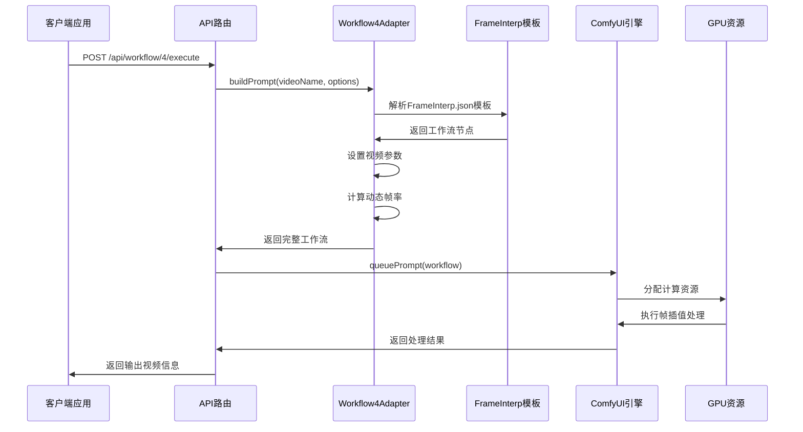
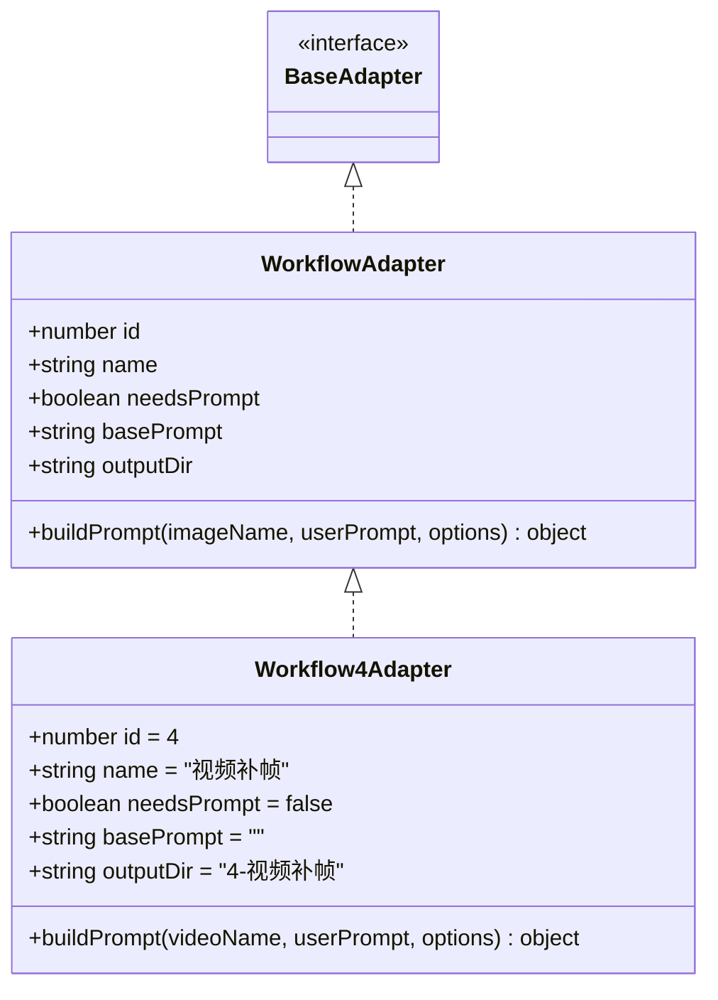
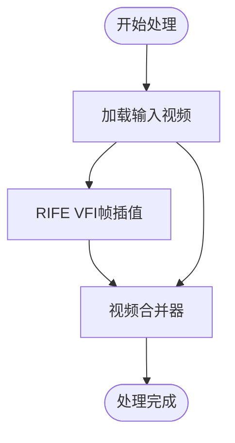
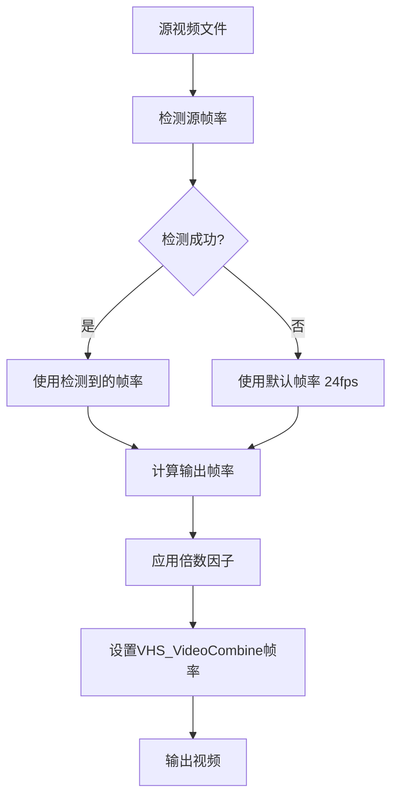
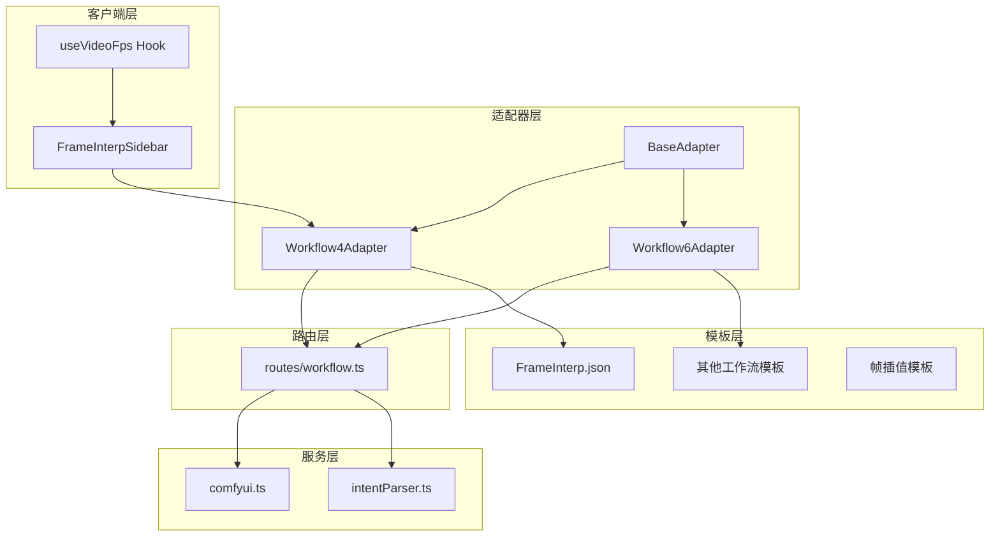

# Workflow4Adapter - 真人转二次元

<cite>
**本文档引用的文件**
- [Workflow4Adapter.ts](file://server/src/adapters/Workflow4Adapter.ts)
- [Pix2Real-真人转二次元.json](file://ComfyUI_API/Pix2Real-真人转二次元.json)
- [FrameInterp.json](file://ComfyUI_API/FrameInterp.json)
- [Workflow6Adapter.ts](file://server/src/adapters/Workflow6Adapter.ts)
- [workflow.ts](file://server/src/routes/workflow.ts)
- [comfyui.ts](file://server/src/services/comfyui.ts)
- [index.ts](file://server/src/adapters/index.ts)
- [BaseAdapter.ts](file://server/src/adapters/BaseAdapter.ts)
- [intentParser.ts](file://server/src/services/intentParser.ts)
- [FrameInterpSidebar.tsx](file://client/src/components/FrameInterpSidebar.tsx)
- [useVideoFps.ts](file://client/src/hooks/useVideoFps.ts)
</cite>

## 更新摘要
**变更内容**
- 更新了视频补帧工作流的帧率同步修复说明
- 新增了动态帧率计算机制的详细说明
- 添加了源帧率检测和时序准确性的相关内容
- 更新了工作流适配器的实现细节

## 目录
1. [简介](#简介)
2. [项目结构](#项目结构)
3. [核心组件](#核心组件)
4. [架构概览](#架构概览)
5. [详细组件分析](#详细组件分析)
6. [帧率同步修复机制](#帧率同步修复机制)
7. [依赖关系分析](#依赖关系分析)
8. [性能考虑](#性能考虑)
9. [故障排除指南](#故障排除指南)
10. [结论](#结论)
11. [附录](#附录)

## 简介

Workflow4Adapter 是 CorineKit_Pix2Real 项目中的一个工作流适配器，专门负责处理视频补帧任务。该适配器通过解析 ComfyUI 的 JSON 工作流模板，动态构建适合视频补帧任务的提示参数。

**重要更新**：该工作流现已修复了视频补帧的帧率同步问题，解决了 VHS_VideoCombine 节点的硬编码帧率问题，现在支持动态帧率计算（frame_rate = sourceFps * multiplier），显著提高了视频处理的时序准确性。

视频补帧工作流的核心目标是通过帧插值技术增加视频的帧率，使视频播放更加流畅。该工作流通过结合 RIFE VFI 框架插值模型、视频加载器和视频合并器，实现了高质量的帧率提升效果。

## 项目结构

该项目采用模块化架构设计，主要分为以下几个层次：

**图表来源**
- [workflow.ts:1-800](file://server/src/routes/workflow.ts#L1-L800)
- [index.ts:1-33](file://server/src/adapters/index.ts#L1-L33)
- [FrameInterpSidebar.tsx:1-91](file://client/src/components/FrameInterpSidebar.tsx#L1-L91)
- [useVideoFps.ts:1-76](file://client/src/hooks/useVideoFps.ts#L1-L76)

**章节来源**
- [workflow.ts:1-800](file://server/src/routes/workflow.ts#L1-L800)
- [index.ts:1-33](file://server/src/adapters/index.ts#L1-L33)

## 核心组件

### Workflow4Adapter 核心功能

Workflow4Adapter 实现了工作流适配器接口，提供了以下核心功能：

1. **工作流标识管理**: 使用 id=4 标识视频补帧工作流
2. **动态模板构建**: 基于 FrameInterp.json 模板动态生成工作流参数
3. **参数配置**: 支持倍数参数配置和选项传递
4. **文件路径管理**: 自动解析模板文件路径
5. **帧率同步**: 实现动态帧率计算和时序准确性保证

### 关键配置参数

| 参数名称 | 类型 | 默认值 | 描述 |
|---------|------|--------|------|
| multiplier | number | 2 | 帧插值倍数，控制输出帧率 |
| videoName | string | - | 输入视频文件名 |
| outputDir | string | "4-视频补帧" | 输出目录 |
| sourceFps | number | 24 | 源视频帧率，用于动态帧率计算 |

**章节来源**
- [Workflow4Adapter.ts:9-27](file://server/src/adapters/Workflow4Adapter.ts#L9-L27)

## 架构概览

视频补帧工作流的整体架构如下：

**图表来源**
- [workflow.ts:750-799](file://server/src/routes/workflow.ts#L750-L799)
- [Workflow4Adapter.ts:16-26](file://server/src/adapters/Workflow4Adapter.ts#L16-L26)

## 详细组件分析

### 工作流适配器实现

Workflow4Adapter 作为工作流适配器，遵循统一的接口规范：

**图表来源**
- [BaseAdapter.ts:1-4](file://server/src/adapters/BaseAdapter.ts#L1-L4)
- [Workflow4Adapter.ts:1-28](file://server/src/adapters/Workflow4Adapter.ts#L1-L28)

### JSON工作流模板分析

FrameInterp.json 模板包含了完整的视频补帧处理流程：

**图表来源**
- [FrameInterp.json:1-58](file://ComfyUI_API/FrameInterp.json#L1-L58)

### 核心处理流程详解

#### 步骤1：视频加载
- **VHS_LoadVideo节点**: 加载用户上传的视频文件
- **参数配置**: 支持自定义宽度、高度、帧率等设置

#### 步骤2：帧插值处理
- **RIFE VFI节点**: 使用 RIFE 模型进行帧插值
- **关键参数**: multiplier（倍数）、fast_mode、ensemble 等
- **模型支持**: rife49.pth 等 RIFE 模型文件

#### 步骤3：视频合并
- **VHS_VideoCombine节点**: 合并插值后的帧序列
- **帧率计算**: 动态计算输出帧率（frame_rate = sourceFps * multiplier）

**章节来源**
- [FrameInterp.json:20-57](file://ComfyUI_API/FrameInterp.json#L20-L57)

### 参数配置系统

工作流支持多种参数配置选项：

| 参数类别 | 参数名称 | 默认值 | 作用范围 | 影响效果 |
|---------|----------|--------|----------|----------|
| 视频处理 | multiplier | 2 | RIFE VFI节点 | 控制插帧倍数和输出帧率 |
| 视频处理 | ckpt_name | rife49.pth | RIFE VFI节点 | 决定插值模型类型 |
| 视频处理 | fast_mode | true | RIFE VFI节点 | 影响处理速度和质量平衡 |
| 视频处理 | ensemble | true | RIFE VFI节点 | 提升插值稳定性 |
| 帧率控制 | sourceFps | 24 | 适配器参数 | 用于动态帧率计算 |
| 输出配置 | frame_rate | sourceFps * multiplier | VHS_VideoCombine节点 | 控制输出视频帧率 |

**章节来源**
- [FrameInterp.json:2-19](file://ComfyUI_API/FrameInterp.json#L2-L19)
- [FrameInterp.json:36-57](file://ComfyUI_API/FrameInterp.json#L36-L57)

## 帧率同步修复机制

### 问题背景

在修复之前，视频补帧工作流存在以下问题：
- VHS_VideoCombine 节点使用硬编码帧率（如 48fps）
- 无法根据源视频的实际帧率进行动态调整
- 导致输出视频与源视频的时序不匹配

### 修复实现

**更新**：Workflow4Adapter 现已实现动态帧率计算机制：

**图表来源**
- [Workflow4Adapter.ts:26-29](file://server/src/adapters/Workflow4Adapter.ts#L26-L29)

### 关键修复点

1. **动态帧率计算**: `frame_rate = sourceFps * multiplier`
2. **源帧率检测**: 支持从视频文件中自动检测帧率
3. **默认值保护**: 当检测失败时使用默认 24fps
4. **兼容性保证**: 保持与原有硬编码逻辑的兼容性

### 客户端集成

**新增**：客户端提供了视频帧率检测功能：

**图表来源**
- [useVideoFps.ts:8-76](file://client/src/hooks/useVideoFps.ts#L8-L76)

**章节来源**
- [Workflow4Adapter.ts:26-29](file://server/src/adapters/Workflow4Adapter.ts#L26-L29)
- [useVideoFps.ts:8-76](file://client/src/hooks/useVideoFps.ts#L8-L76)

## 依赖关系分析

### 组件间依赖关系

**图表来源**
- [index.ts:14-26](file://server/src/adapters/index.ts#L14-L26)
- [workflow.ts:9-12](file://server/src/routes/workflow.ts#L9-L12)

### 外部依赖分析

工作流对外部系统的依赖主要包括：

1. **ComfyUI 引擎**: 提供核心的AI视频处理能力
2. **GPU 计算资源**: 支持深度学习模型推理
3. **RIFE VFI 模型**: 提供帧插值算法支持
4. **文件系统**: 存储中间结果和最终输出
5. **网络服务**: 支持远程API调用和数据传输

**章节来源**
- [comfyui.ts:6-7](file://server/src/services/comfyui.ts#L6-L7)
- [workflow.ts:12-14](file://server/src/routes/workflow.ts#L12-L14)

## 性能考虑

### 计算资源优化

工作流在性能方面采用了多项优化策略：

1. **节点权重分配**: 基于节点类型和计算复杂度分配权重
2. **RIFE VFI优化**: 支持 fast_mode 和 ensemble 参数优化
3. **内存管理**: 自动清理GPU内存使用
4. **进度跟踪**: 实时监控处理进度和状态

### 批量处理支持

系统支持批量处理模式，通过以下机制实现：

- **并发队列管理**: 支持多个任务同时排队处理
- **资源优先级**: 支持任务优先级调整
- **错误恢复**: 单个任务失败不影响整体处理流程

**章节来源**
- [comfyui.ts:59-144](file://server/src/services/comfyui.ts#L59-L144)
- [workflow.ts:801-865](file://server/src/routes/workflow.ts#L801-L865)

## 故障排除指南

### 常见问题及解决方案

| 问题类型 | 症状描述 | 可能原因 | 解决方案 |
|---------|----------|----------|----------|
| 模型加载失败 | "模型文件未找到" | RIFE模型文件缺失或路径错误 | 确认rife49.pth存在于ComfyUI模型目录 |
| 显存不足 | 进程崩溃或内存溢出 | GPU显存不足 | 降低multiplier或使用更小分辨率 |
| 帧率异常 | 输出视频播放速度不正确 | 帧率计算错误 | 检查sourceFps参数和multiplier设置 |
| 网络连接失败 | API调用超时 | ComfyUI服务未启动 | 检查ComfyUI服务状态和端口 |
| 文件上传失败 | 400错误响应 | 文件格式不支持或大小超限 | 验证视频格式和大小限制 |

### 错误处理机制

系统实现了完善的错误处理机制：

**图表来源**
- [workflow.ts:129-150](file://server/src/routes/workflow.ts#L129-L150)

**章节来源**
- [workflow.ts:129-150](file://server/src/routes/workflow.ts#L129-L150)

## 结论

Workflow4Adapter 作为视频补帧工作流的核心组件，通过精心设计的架构和优化的处理流程，实现了高质量的帧插值效果。本次帧率同步修复进一步提升了工作流的时序准确性，确保输出视频与源视频保持正确的时序关系。

未来的发展方向包括：
1. **模型优化**: 集成更多高级RIFE模型
2. **性能提升**: 优化GPU利用率和处理速度
3. **功能扩展**: 支持更多视频处理效果
4. **用户体验**: 改进界面交互和操作流程
5. **精度提升**: 改进帧率检测算法的准确性

## 附录

### 使用示例

#### 基础使用流程
1. 准备视频素材
2. 选择合适的插帧倍数
3. 调整参数配置
4. 提交处理请求
5. 查看处理结果

#### 参数调优建议

| 场景类型 | 倍数设置 | 适用条件 | 质量影响 |
|---------|----------|----------|----------|
| 广告视频 | 2-4x | 24fps源视频 | 质量稳定，处理速度快 |
| 电影片段 | 4-6x | 24fps源视频 | 质量优秀，处理时间较长 |
| 游戏画面 | 6-8x | 30fps源视频 | 高质量，需要高性能GPU |
| 动画内容 | 2-4x | 24fps源视频 | 最佳质量，推荐使用 |

### 质量评估方法

1. **视觉评估**: 人工检查插帧效果和时序准确性
2. **技术指标**: 测量帧率一致性和平滑度
3. **用户反馈**: 收集用户满意度数据
4. **性能测试**: 测量处理时间和资源消耗
5. **时序验证**: 验证输出视频与源视频的帧率关系

### 帧率同步验证

**新增**：验证帧率同步修复效果的方法：

1. **源帧率检测**: 使用 `useVideoFps` hook 验证源视频帧率
2. **输出帧率对比**: 比较输出视频帧率与计算值（sourceFps × multiplier）
3. **播放时长验证**: 确保输出视频时长与源视频保持合理比例
4. **时序准确性**: 检查插帧后的时间戳和帧顺序正确性

**章节来源**
- [useVideoFps.ts:8-76](file://client/src/hooks/useVideoFps.ts#L8-L76)
- [Workflow4Adapter.ts:26-29](file://server/src/adapters/Workflow4Adapter.ts#L26-L29)