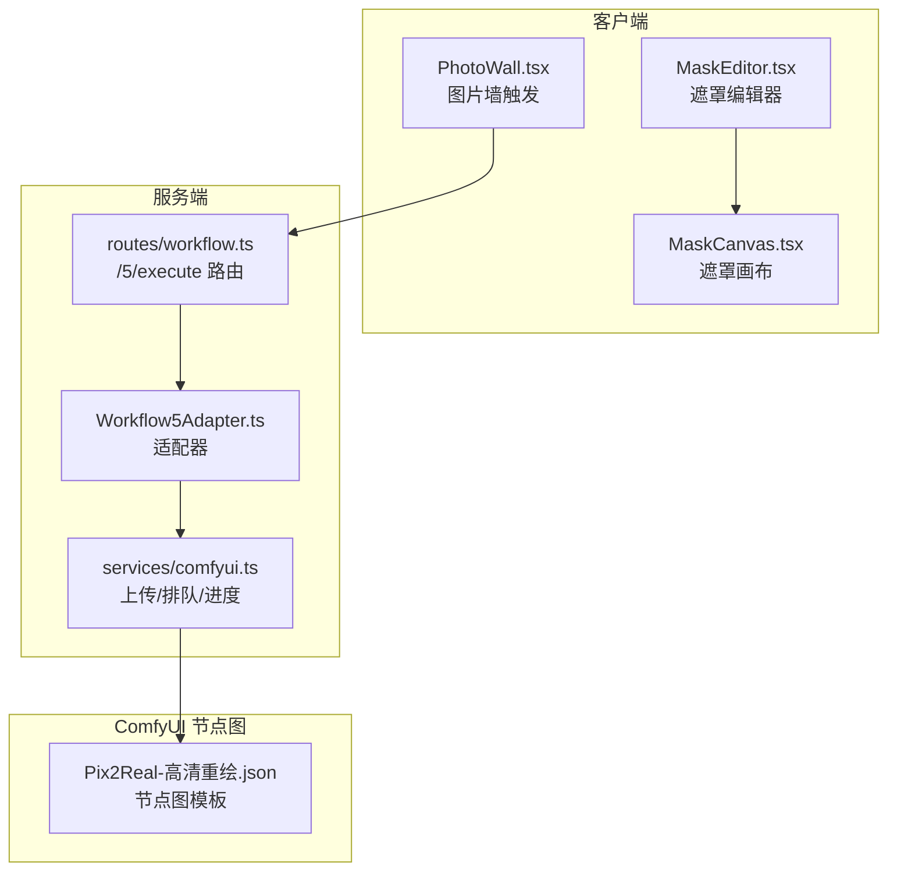
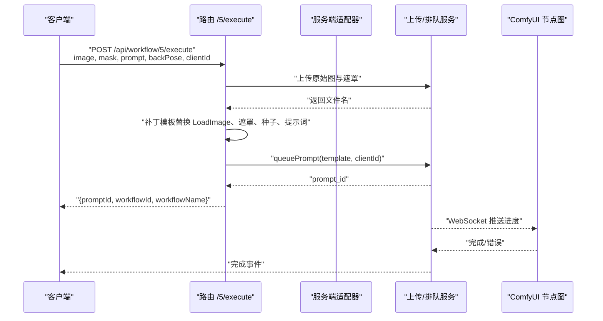
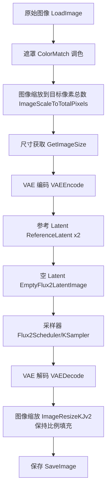
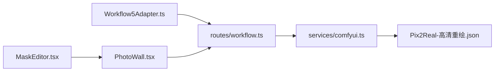

# Workflow5Adapter - 高清重绘

<cite>
**本文引用的文件**
- [Workflow5Adapter.ts](file://server/src/adapters/Workflow5Adapter.ts)
- [Pix2Real-高清重绘.json](file://ComfyUI_API/Pix2Real-高清重绘.json)
- [Pix2Real-解除装备.json](file://ComfyUI_API/Pix2Real-解除装备.json)
- [workflow.ts](file://server/src/routes/workflow.ts)
- [MaskEditor.tsx](file://client/src/components/MaskEditor.tsx)
- [MaskCanvas.tsx](file://client/src/components/MaskCanvas.tsx)
- [PhotoWall.tsx](file://client/src/components/PhotoWall.tsx)
- [comfyui.ts](file://server/src/services/comfyui.ts)
- [Pix2Real-释放内存.json](file://ComfyUI_API/Pix2Real-释放内存.json)
</cite>

## 目录
1. [简介](#简介)
2. [项目结构](#项目结构)
3. [核心组件](#核心组件)
4. [架构概览](#架构概览)
5. [详细组件分析](#详细组件分析)
6. [依赖关系分析](#依赖关系分析)
7. [性能考虑](#性能考虑)
8. [故障排查指南](#故障排查指南)
9. [结论](#结论)
10. [附录](#附录)

## 简介
本文件为 Workflow5Adapter 的技术文档，聚焦“高清重绘”工作流的实现机制与使用方法。该工作流通过 ComfyUI 的节点图实现“局部重绘 + 细节增强 + 整体协调”的一体化流程，能够在保持图像整体一致性的前提下进行局部修改。文档将从系统架构、数据流、处理逻辑、参数配置、性能优化与内存管理等方面进行深入解析，并提供使用示例与对比建议。

## 项目结构
Workflow5Adapter 所属的工作流位于服务端适配器层与 ComfyUI 节点图层之间，客户端负责遮罩绘制与参数传递，服务端负责模板补丁与任务提交，ComfyUI 负责执行具体节点图。

图表来源
- [Workflow5Adapter.ts:1-15](file://server/src/adapters/Workflow5Adapter.ts#L1-L15)
- [workflow.ts:163-215](file://server/src/routes/workflow.ts#L163-L215)
- [Pix2Real-高清重绘.json:1-446](file://ComfyUI_API/Pix2Real-高清重绘.json#L1-L446)

章节来源
- [Workflow5Adapter.ts:1-15](file://server/src/adapters/Workflow5Adapter.ts#L1-L15)
- [workflow.ts:163-215](file://server/src/routes/workflow.ts#L163-L215)

## 核心组件
- 适配器层：Workflow5Adapter 定义工作流标识、名称、是否需要提示词以及输出目录等元信息。
- 路由层：/5/execute 接收原始图像与遮罩，校验参数，上传文件，补丁模板并提交至 ComfyUI。
- 节点图层：Pix2Real-高清重绘.json 描述了完整的高清重绘管线，包括图像缩放、VAE 编码、条件构建、采样器、VAE 解码、颜色匹配与输出保存。
- 客户端层：MaskEditor/MaskCanvas 提供遮罩绘制与交互；PhotoWall 触发工作流执行。

章节来源
- [Workflow5Adapter.ts:4-14](file://server/src/adapters/Workflow5Adapter.ts#L4-L14)
- [workflow.ts:163-215](file://server/src/routes/workflow.ts#L163-L215)
- [Pix2Real-高清重绘.json:1-446](file://ComfyUI_API/Pix2Real-高清重绘.json#L1-L446)

## 架构概览
工作流的端到端执行序列如下：

图表来源
- [workflow.ts:163-215](file://server/src/routes/workflow.ts#L163-L215)
- [comfyui.ts:168-196](file://server/src/services/comfyui.ts#L168-L196)

## 详细组件分析

### 适配器与路由
- 适配器定义：Workflow5Adapter 指定工作流 ID 为 5，名称为“解除装备”，需要提示词，输出目录为“5-解除装备”。同时明确该工作流使用专用的 /5/execute 路由。
- 路由处理：
  - 校验必填参数：image、mask、clientId。
  - 上传两张图像到 ComfyUI 并获得文件名。
  - 读取模板并补丁：替换 LoadImage 节点的图像名、遮罩节点的图像名、布尔开关 backPose、随机种子、提示词。
  - 提交任务并返回 prompt_id。

章节来源
- [Workflow5Adapter.ts:4-14](file://server/src/adapters/Workflow5Adapter.ts#L4-L14)
- [workflow.ts:163-215](file://server/src/routes/workflow.ts#L163-L215)

### 节点图与处理逻辑
节点图以“高清重绘”为核心，关键节点链路如下：

图表来源
- [Pix2Real-高清重绘.json:1-446](file://ComfyUI_API/Pix2Real-高清重绘.json#L1-L446)

#### 局部重绘与细节增强
- 遮罩与裁剪：节点图中包含“图像调色 ColorMatch”用于色彩一致性，随后通过“缩放图像（像素）ImageScaleToTotalPixels”将图像缩放到指定像素总量，再进行尺寸获取与 VAE 编码，为后续采样与解码做准备。
- 采样与解码：使用 Flux2 调度器与 K 采样器，结合正负条件（Positive/Negative）与空 Latent，生成目标尺寸的图像，再经 VAE 解码得到最终结果。
- 输出与保存：通过“图像缩放KJ v2 ImageResizeKJv2”保持比例填充，最后保存图像。

章节来源
- [Pix2Real-高清重绘.json:1-446](file://ComfyUI_API/Pix2Real-高清重绘.json#L1-L446)

#### 整体协调与一致性
- 条件零化与参考：节点图中存在“条件零化 ConditioningZeroOut”与“参考 Latent ReferenceLatent”，用于在保持整体风格一致的前提下，对特定区域进行增强或修改。
- 色彩匹配：节点图中的“图像调色 ColorMatch”确保重绘后的区域与原图色调一致，减少色差带来的违和感。

章节来源
- [Pix2Real-高清重绘.json:1-446](file://ComfyUI_API/Pix2Real-高清重绘.json#L1-L446)

### 遮罩编辑与参数配置
- 遮罩绘制：客户端通过 MaskEditor/MaskCanvas 提供画笔大小、硬度、透明度等参数，支持多种子模式（暗色叠加、高亮显示、红色叠加）与历史操作（撤销/重做）。
- 参数传递：PhotoWall 在点击执行时，将 image、mask、clientId、prompt、backPose 等参数通过 FormData 发送到 /5/execute。
- 节点图补丁：服务端根据请求参数替换模板中的节点输入，如 LoadImage 的图像名、遮罩图像名、布尔开关 backPose、随机种子与提示词。

章节来源
- [MaskEditor.tsx:1-200](file://client/src/components/MaskEditor.tsx#L1-L200)
- [MaskCanvas.tsx:326-367](file://client/src/components/MaskCanvas.tsx#L326-L367)
- [PhotoWall.tsx:218-244](file://client/src/components/PhotoWall.tsx#L218-L244)
- [workflow.ts:193-201](file://server/src/routes/workflow.ts#L193-L201)

### 使用示例与效果对比
- 重绘区域选择
  - 在遮罩编辑器中绘制目标区域，支持不同子模式预览效果。
  - 通过画笔参数调节遮罩边界与强度，确保边缘自然过渡。
- 参数配置
  - prompt：用于描述需要修改的目标区域与风格要求。
  - backPose：布尔开关，控制是否启用特定 LoRA 模型。
  - clientId：用于 WebSocket 进度推送与任务关联。
- 效果对比
  - 建议对比“原始图 + 遮罩 + 调色 + 缩放 + 采样 + 解码 + 保存”的完整流程，观察局部重绘与整体一致性的平衡。
  - 可通过调整“图像缩放（像素）”与“图像缩放KJ v2”的参数，测试不同分辨率下的细节表现。

章节来源
- [MaskEditor.tsx:141-200](file://client/src/components/MaskEditor.tsx#L141-L200)
- [PhotoWall.tsx:218-244](file://client/src/components/PhotoWall.tsx#L218-L244)
- [workflow.ts:193-201](file://server/src/routes/workflow.ts#L193-L201)

## 依赖关系分析
- 适配器依赖路由：Workflow5Adapter 仅定义元信息，实际执行由 /5/execute 路由完成。
- 路由依赖服务：/5/execute 依赖上传与排队服务，负责将模板补丁后提交至 ComfyUI。
- 节点图依赖模型：节点图中包含 UNET、VAE、CLIP 等模型加载节点，需确保模型文件可用。
- 客户端依赖存储：遮罩编辑状态通过 useMaskStore 与 useWorkflowStore 管理，执行时将遮罩与图像打包发送。

图表来源
- [Workflow5Adapter.ts:1-15](file://server/src/adapters/Workflow5Adapter.ts#L1-L15)
- [workflow.ts:163-215](file://server/src/routes/workflow.ts#L163-L215)
- [comfyui.ts:168-196](file://server/src/services/comfyui.ts#L168-L196)
- [Pix2Real-高清重绘.json:1-446](file://ComfyUI_API/Pix2Real-高清重绘.json#L1-L446)

## 性能考虑
- 采样器权重与进度估算
  - 采样器节点权重由步骤数动态决定，其他节点按静态权重估算，整体进度采用加权百分比，封顶 99%，完成事件单独通知。
  - 对于 tiled 采样器，按估计的 tile 数乘以采样系数估算耗时。
- 时间优化建议
  - 控制图像像素总量：通过“缩放图像（像素）”节点限制总像素，降低显存占用与推理时间。
  - 减少采样步数：在保证质量的前提下适当降低 steps，缩短采样时间。
  - 合理设置提示词：简洁明确的提示词有助于更快收敛。
- 内存使用建议
  - 释放显存：节点图中包含“图层工具：清除VRAM V2”节点，可在任务完成后清理缓存与模型。
  - 释放内存：提供“释放内存/显存”工作流，用于清理文件缓存、进程与显存。
  - 上传策略：服务端上传图像时使用覆盖选项，避免重复文件占用空间。

章节来源
- [comfyui.ts:58-144](file://server/src/services/comfyui.ts#L58-L144)
- [comfyui.ts:168-196](file://server/src/services/comfyui.ts#L168-L196)
- [Pix2Real-高清重绘.json:221-232](file://ComfyUI_API/Pix2Real-高清重绘.json#L221-L232)
- [Pix2Real-释放内存.json:1-39](file://ComfyUI_API/Pix2Real-释放内存.json#L1-L39)

## 故障排查指南
- 常见错误与友好提示
  - 模型文件缺失：当节点报错包含特定键名不在列表时，提示检查模型安装。
  - 队列提交失败：提示检查 ComfyUI 是否正常运行。
- 具体排查步骤
  - 确认 /5/execute 请求包含 image、mask、clientId。
  - 检查模板补丁是否成功替换 LoadImage、遮罩、backPose、seed、提示词。
  - 查看 WebSocket 进度与完成事件，定位卡顿或错误节点。
  - 如出现显存不足，尝试降低图像像素总量或启用“清除VRAM V2”。

章节来源
- [workflow.ts:130-150](file://server/src/routes/workflow.ts#L130-L150)
- [workflow.ts:211-214](file://server/src/routes/workflow.ts#L211-L214)

## 结论
Workflow5Adapter 通过“高清重绘”工作流实现了局部重绘与整体协调的统一：客户端负责精细的遮罩绘制与参数配置，服务端负责模板补丁与任务提交，ComfyUI 负责节点级的图像处理与输出。借助色彩匹配、条件零化与参考 Latent 等机制，能够在保持图像整体一致性的前提下进行局部增强。配合合理的参数配置与内存管理策略，可有效提升处理效率与稳定性。

## 附录
- 相关文件路径
  - 适配器：server/src/adapters/Workflow5Adapter.ts
  - 节点图：ComfyUI_API/Pix2Real-高清重绘.json
  - 路由：server/src/routes/workflow.ts
  - 客户端遮罩编辑：client/src/components/MaskEditor.tsx、client/src/components/MaskCanvas.tsx
  - 执行入口：client/src/components/PhotoWall.tsx
  - 服务端上传与排队：server/src/services/comfyui.ts
  - 内存释放：ComfyUI_API/Pix2Real-释放内存.json