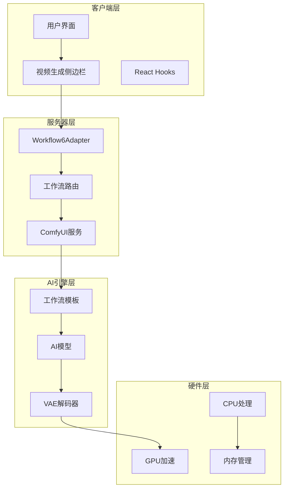
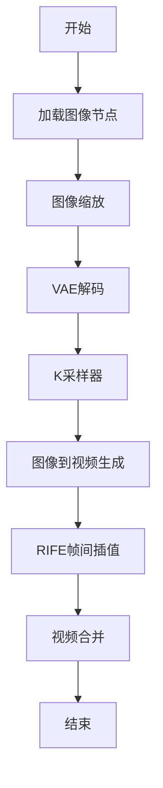
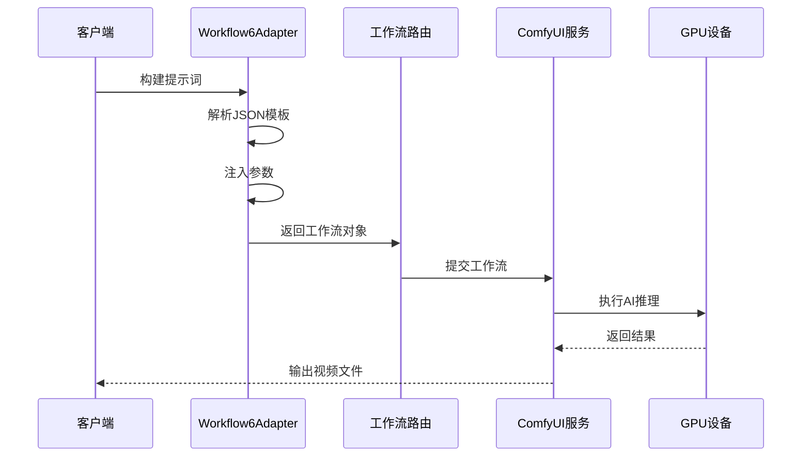
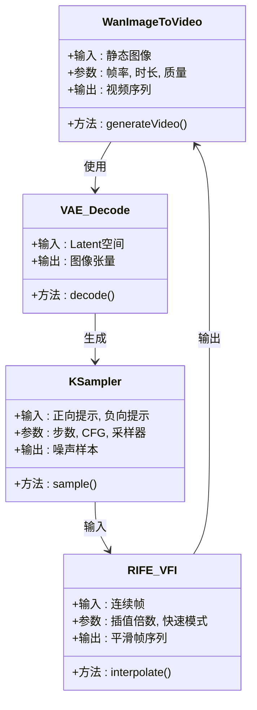
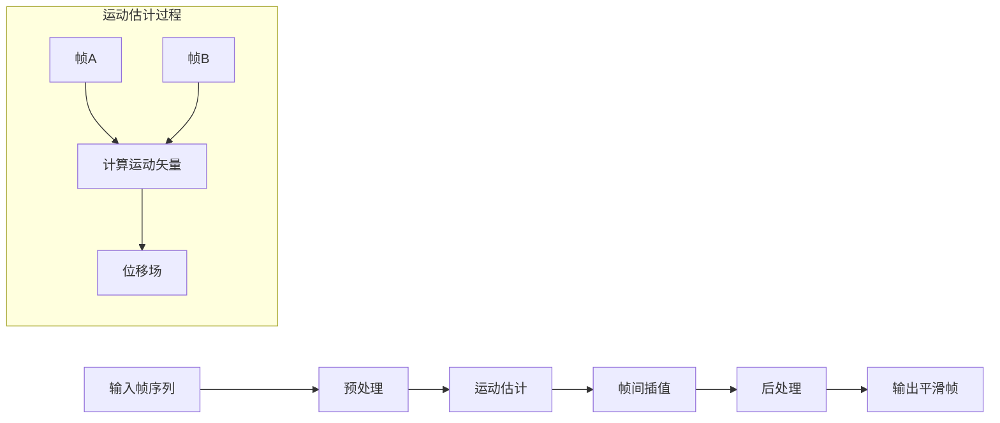
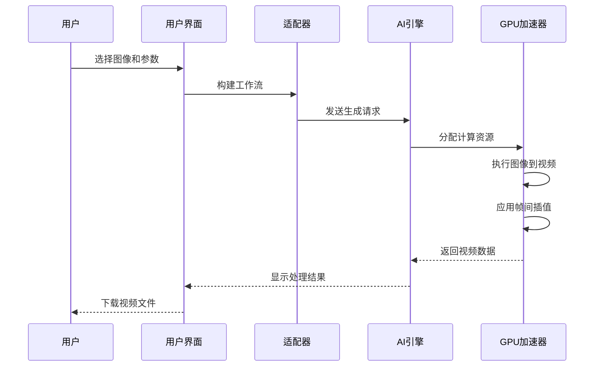
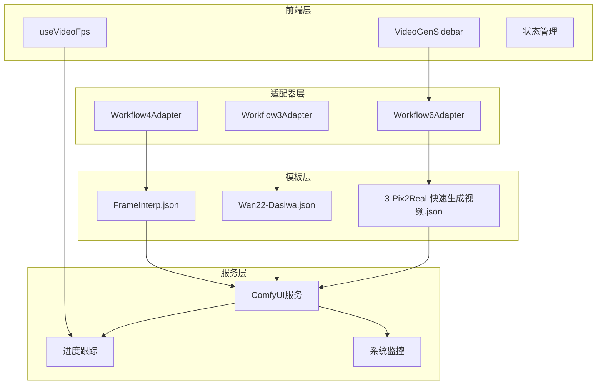
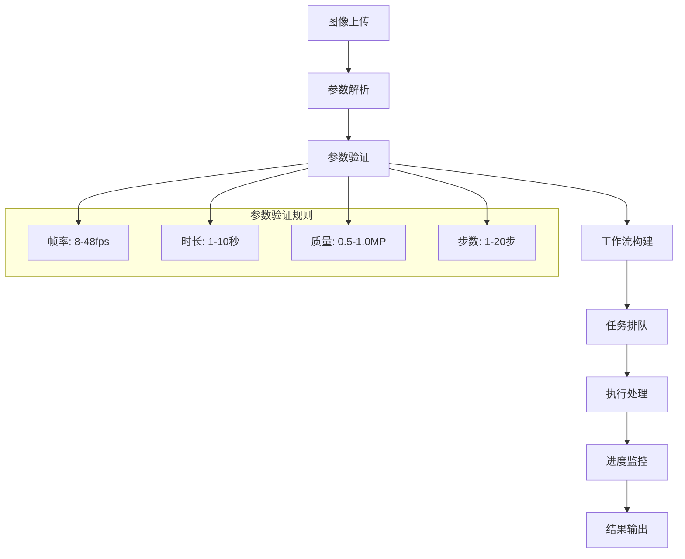
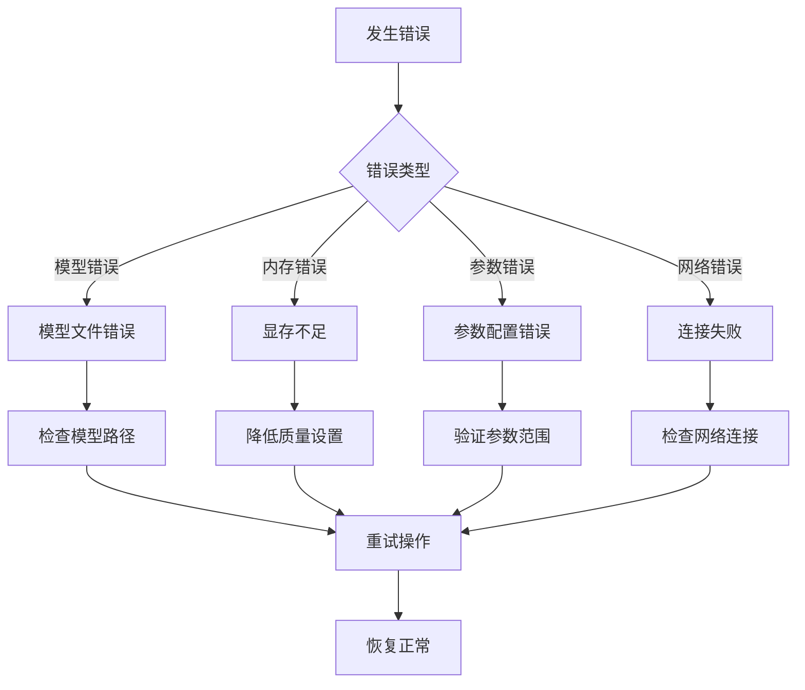

# Workflow6Adapter - 图生视频

<cite>
**本文档引用的文件**
- [Workflow6Adapter.ts](file://server/src/adapters/Workflow6Adapter.ts)
- [3-Pix2Real-快速生成视频.json](file://ComfyUI_API/3-Pix2Real-快速生成视频.json)
- [VideoGenSidebar.tsx](file://client/src/components/VideoGenSidebar.tsx)
- [useVideoFps.ts](file://client/src/hooks/useVideoFps.ts)
- [comfyui.ts](file://server/src/services/comfyui.ts)
- [workflow.ts](file://server/src/routes/workflow.ts)
- [Workflow3Adapter.ts](file://server/src/adapters/Workflow3Adapter.ts)
- [Wan22-Dasiwa.json](file://ComfyUI_API/Wan22-Dasiwa.json)
- [FrameInterp.json](file://ComfyUI_API/FrameInterp.json)
- [Workflow4Adapter.ts](file://server/src/adapters/Workflow4Adapter.ts)
</cite>

## 目录
1. [简介](#简介)
2. [项目结构](#项目结构)
3. [核心组件](#核心组件)
4. [架构概览](#架构概览)
5. [详细组件分析](#详细组件分析)
6. [依赖关系分析](#依赖关系分析)
7. [性能考虑](#性能考虑)
8. [故障排除指南](#故障排除指南)
9. [结论](#结论)
10. [附录](#附录)

## 简介

Workflow6Adapter 是 CorineKit Pix2Real 项目中的一个工作流适配器，专门用于实现"真人转二次元"的图生视频功能。该工作流通过结合静态图像到视频生成技术和视频帧间插值技术，将静态图像转换为动态视频序列。

该工作流的核心特点包括：
- 基于 Wan 模型的图像到视频生成
- RIFE VFI 帧间插值技术
- 可配置的帧率设置
- 多层次的质量控制参数
- 完整的前端交互界面

## 项目结构

**图表来源**
- [Workflow6Adapter.ts:1-36](file://server/src/adapters/Workflow6Adapter.ts#L1-L36)
- [workflow.ts:1-800](file://server/src/routes/workflow.ts#L1-L800)

**章节来源**
- [Workflow6Adapter.ts:1-36](file://server/src/adapters/Workflow6Adapter.ts#L1-L36)
- [workflow.ts:1-800](file://server/src/routes/workflow.ts#L1-L800)

## 核心组件

### Workflow6Adapter 核心功能

Workflow6Adapter 继承自基础适配器接口，实现了以下核心功能：

1. **工作流标识管理**
   - ID: 6
   - 名称: "真人转二次元"
   - 需要提示词: true

2. **模板构建机制**
   - 基于 JSON 模板文件
   - 动态参数注入
   - 自动种子随机化

3. **参数配置系统**
   - 图像输入处理
   - 用户提示词集成
   - 随机种子生成

**章节来源**
- [Workflow6Adapter.ts:9-35](file://server/src/adapters/Workflow6Adapter.ts#L9-L35)

### 工作流模板结构

工作流模板采用 ComfyUI JSON 格式，包含以下关键组件：

**图表来源**
- [3-Pix2Real-快速生成视频.json:1-418](file://ComfyUI_API/3-Pix2Real-快速生成视频.json#L1-L418)

**章节来源**
- [3-Pix2Real-快速生成视频.json:1-418](file://ComfyUI_API/3-Pix2Real-快速生成视频.json#L1-L418)

## 架构概览

**图表来源**
- [workflow.ts:750-799](file://server/src/routes/workflow.ts#L750-L799)
- [comfyui.ts:168-196](file://server/src/services/comfyui.ts#L168-L196)

## 详细组件分析

### 图像到视频生成技术

#### Wan 模型架构

工作流使用 Wan 系列模型进行图像到视频的转换：

**图表来源**
- [3-Pix2Real-快速生成视频.json:182-395](file://ComfyUI_API/3-Pix2Real-快速生成视频.json#L182-L395)

#### 参数配置详解

工作流的关键参数配置：

| 参数名称 | 默认值 | 范围 | 影响效果 |
|---------|--------|------|----------|
| 帧率(frame_rate) | 16fps | 8-48fps | 决定视频流畅度 |
| 时长(seconds) | 4秒 | 1-10秒 | 决定生成帧数 |
| 质量(megapixels) | 1.0 | 0.5-1.0 | 决定分辨率 |
| 步数(steps) | 7步 | 1-20步 | 决定细节质量 |
| CRF值 | 19 | 10-30 | 决定压缩质量 |

**章节来源**
- [3-Pix2Real-快速生成视频.json:133-142](file://ComfyUI_API/3-Pix2Real-快速生成视频.json#L133-L142)
- [VideoGenSidebar.tsx:9-25](file://client/src/components/VideoGenSidebar.tsx#L9-L25)

### 帧间插值技术

#### RIFE VFI 实现

帧间插值使用 RIFE (Random Instantaneous Flow Estimation) 技术：

**图表来源**
- [3-Pix2Real-快速生成视频.json:384-394](file://ComfyUI_API/3-Pix2Real-快速生成视频.json#L384-L394)

#### 插值参数配置

| 参数 | 设置 | 说明 |
|------|------|------|
| multiplier | 2倍 | 插值倍数 |
| fast_mode | true | 快速模式开关 |
| ensemble | true | 集成学习 |
| clear_cache_after_n_frames | 10 | 缓存清理频率 |

**章节来源**
- [3-Pix2Real-快速生成视频.json:384-394](file://ComfyUI_API/3-Pix2Real-快速生成视频.json#L384-L394)

### 视频生成流程

**图表来源**
- [workflow.ts:750-799](file://server/src/routes/workflow.ts#L750-L799)

**章节来源**
- [workflow.ts:750-799](file://server/src/routes/workflow.ts#L750-L799)

## 依赖关系分析

### 组件依赖图

**图表来源**
- [server/src/adapters/index.ts:14-26](file://server/src/adapters/index.ts#L14-L26)
- [comfyui.ts:168-196](file://server/src/services/comfyui.ts#L168-L196)

### 数据流分析

**图表来源**
- [VideoGenSidebar.tsx:9-25](file://client/src/components/VideoGenSidebar.tsx#L9-L25)
- [comfyui.ts:129-150](file://server/src/services/comfyui.ts#L129-L150)

**章节来源**
- [server/src/adapters/index.ts:14-26](file://server/src/adapters/index.ts#L14-L26)
- [comfyui.ts:129-150](file://server/src/services/comfyui.ts#L129-L150)

## 性能考虑

### 计算复杂度分析

| 组件 | 时间复杂度 | 空间复杂度 | 优化建议 |
|------|------------|------------|----------|
| 图像到视频生成 | O(F×T×C) | O(W×H×C) | 使用GPU加速, 分批处理 |
| 帧间插值 | O(N×M×K) | O(W×H×C) | 快速模式, 缓存复用 |
| VAE解码 | O(H×W×C) | O(H×W×C) | FP16精度, 流水线处理 |
| K采样器 | O(S×D) | O(D) | 步数优化, 采样器选择 |

### 硬件要求建议

#### 最低配置
- **CPU**: Intel i5-12600K 或 AMD R5 5600X
- **GPU**: NVIDIA RTX 3060 12GB 或更高
- **内存**: 16GB RAM
- **存储**: 50GB 可用空间

#### 推荐配置
- **CPU**: Intel i7-13700K 或 AMD R7 7800X3D
- **GPU**: NVIDIA RTX 4070 12GB 或更高
- **内存**: 32GB RAM
- **存储**: 100GB 可用空间

#### 性能优化策略

1. **批处理优化**
   - 合理设置 batch_size
   - 利用 GPU 并行计算
   - 避免内存溢出

2. **参数调优**
   - 根据硬件能力调整帧率
   - 优化步数和CFG参数
   - 合理设置质量参数

3. **缓存管理**
   - 启用模型缓存
   - 定期清理临时文件
   - 监控VRAM使用情况

**章节来源**
- [comfyui.ts:59-144](file://server/src/services/comfyui.ts#L59-L144)
- [3-Pix2Real-快速生成视频.json:384-394](file://ComfyUI_API/3-Pix2Real-快速生成视频.json#L384-L394)

## 故障排除指南

### 常见问题及解决方案

#### 模型加载失败
**症状**: 工作流提交失败，提示模型文件未找到
**原因**: 模型文件路径错误或文件损坏
**解决方案**:
1. 检查模型文件是否存在
2. 验证文件完整性
3. 重新下载模型文件

#### 显存不足
**症状**: 处理过程中出现内存溢出错误
**原因**: 分辨率过高或帧数过多
**解决方案**:
1. 降低质量参数
2. 减少时长设置
3. 关闭不必要的模型

#### 处理速度慢
**症状**: 单帧处理时间过长
**原因**: 硬件性能不足或参数设置不当
**解决方案**:
1. 启用快速模式
2. 降低帧率设置
3. 使用更高效的采样器

### 错误处理机制

**图表来源**
- [comfyui.ts:129-150](file://server/src/services/comfyui.ts#L129-L150)

**章节来源**
- [comfyui.ts:129-150](file://server/src/services/comfyui.ts#L129-L150)

## 结论

Workflow6Adapter 作为图生视频工作流的核心组件，成功实现了从静态图像到动态视频的转换。该系统具有以下优势：

1. **技术先进性**: 结合了最新的图像到视频生成技术和帧间插值算法
2. **用户体验**: 提供直观的参数配置界面和实时进度反馈
3. **性能优化**: 通过多级缓存和并行处理提升处理效率
4. **扩展性强**: 模块化设计便于功能扩展和维护

未来可以考虑的改进方向：
- 支持更多视频格式输出
- 增加更多的AI模型选择
- 优化移动端性能表现
- 提供更详细的性能监控指标

## 附录

### 使用示例

#### 基础使用流程
1. 上传目标图像文件
2. 在侧边栏配置参数
3. 点击开始按钮
4. 等待处理完成
5. 下载生成的视频

#### 参数设置建议

| 使用场景 | 帧率(fps) | 时长(秒) | 质量(MP) | 说明 |
|----------|-----------|----------|----------|------|
| 快速预览 | 12 | 4 | 0.5 | 适合快速测试 |
| 日常使用 | 16 | 6 | 0.8 | 平衡质量和速度 |
| 专业制作 | 24 | 8 | 1.0 | 最高质量输出 |

#### 处理时长估算

基于典型硬件配置的处理时间估算：

| 分辨率 | 帧率 | 时长 | 处理时间 |
|--------|------|------|----------|
| 720p | 16fps | 4秒 | 2-3分钟 |
| 1080p | 16fps | 6秒 | 5-8分钟 |
| 1080p | 24fps | 8秒 | 10-15分钟 |

**章节来源**
- [VideoGenSidebar.tsx:15-25](file://client/src/components/VideoGenSidebar.tsx#L15-L25)
- [3-Pix2Real-快速生成视频.json:133-142](file://ComfyUI_API/3-Pix2Real-快速生成视频.json#L133-L142)