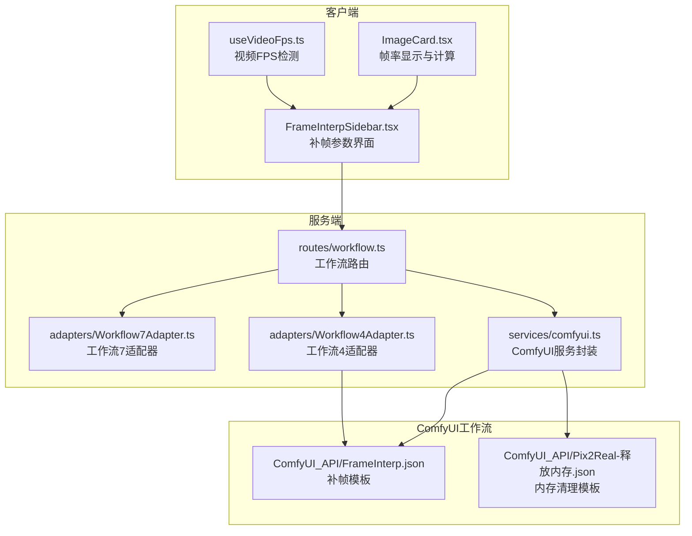
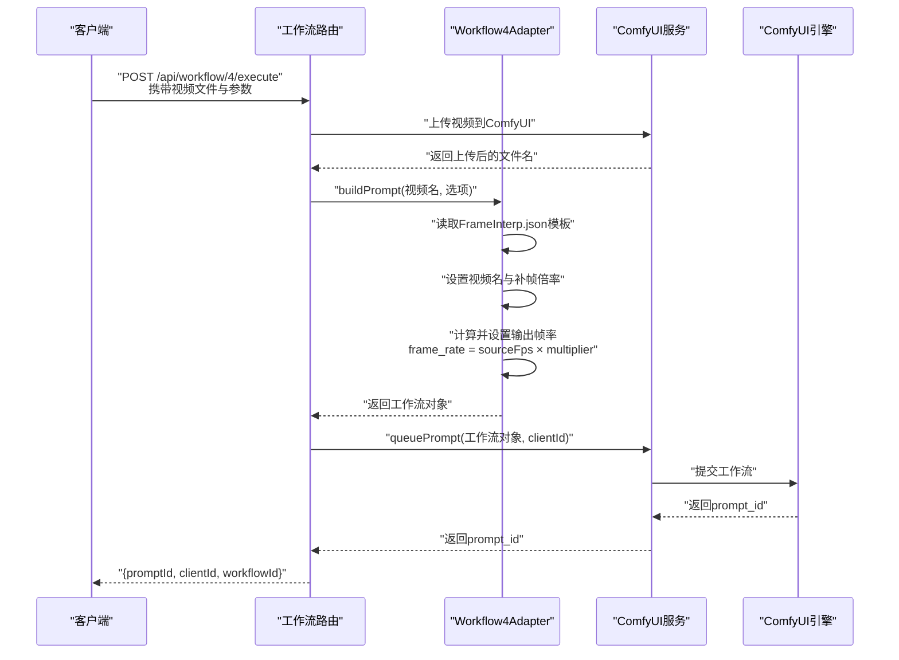
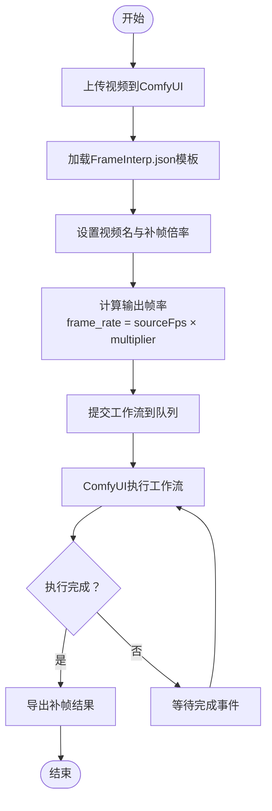
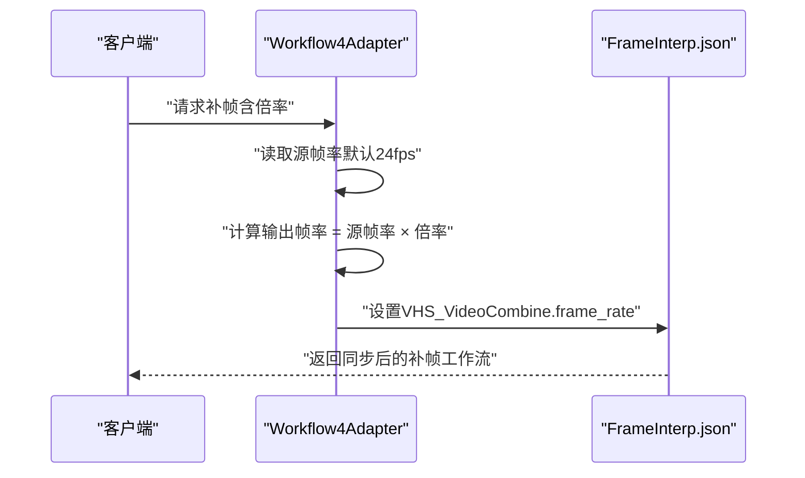
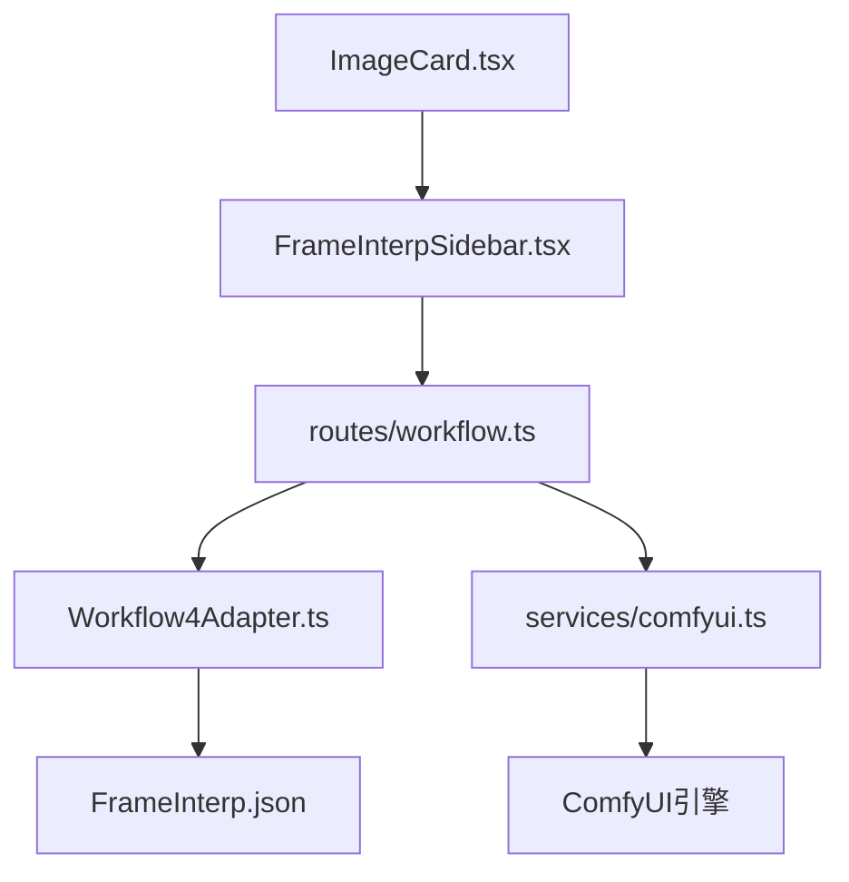

# Workflow7Adapter - 视频补帧

<cite>
**本文引用的文件**
- [Workflow7Adapter.ts](file://server/src/adapters/Workflow7Adapter.ts)
- [Workflow4Adapter.ts](file://server/src/adapters/Workflow4Adapter.ts)
- [FrameInterp.json](file://ComfyUI_API/FrameInterp.json)
- [FrameInterpSidebar.tsx](file://client/src/components/FrameInterpSidebar.tsx)
- [comfyui.ts](file://server/src/services/comfyui.ts)
- [workflow.ts](file://server/src/routes/workflow.ts)
- [Pix2Real-释放内存.json](file://ComfyUI_API/Pix2Real-释放内存.json)
- [useVideoFps.ts](file://client/src/hooks/useVideoFps.ts)
- [ImageCard.tsx](file://client/src/components/ImageCard.tsx)
</cite>

## 更新摘要
**所做更改**
- 更新了帧率同步机制的实现说明，强调了插值后视频保持正确播放时长和帧率关系
- 新增了帧率计算和显示的客户端实现细节
- 完善了帧率同步机制的技术原理和配置方法

## 目录
1. [简介](#简介)
2. [项目结构](#项目结构)
3. [核心组件](#核心组件)
4. [架构总览](#架构总览)
5. [详细组件分析](#详细组件分析)
6. [依赖关系分析](#依赖关系分析)
7. [性能考量](#性能考量)
8. [故障排查指南](#故障排查指南)
9. [结论](#结论)
10. [附录](#附录)

## 简介
本文件为 Workflow7Adapter 的技术文档，聚焦"视频补帧"工作流的实现机制与使用方法。尽管 Workflow7Adapter 本身定义了工作流标识、名称与输出目录，并声明其构建逻辑由专用路由处理，但"视频补帧"相关的核心流程与参数配置位于 Workflow4Adapter 与 ComfyUI 工作流模板中。本文将系统阐述：
- 补帧工作流的数据流与控制流
- 帧插值算法、运动补偿与时间重采样的实现要点
- 插值质量参数、运动估计精度与边缘保护机制
- **新增：帧率同步机制，确保插值后的视频保持正确的播放时长和帧率关系**
- 使用示例与效果对比、适用视频类型与质量评估标准
- 处理效率优化与内存管理策略

## 项目结构
本项目采用前后端分离架构，服务端负责工作流适配、ComfyUI 交互与队列管理；客户端提供参数界面与视频预览能力。

**图表来源**
- [workflow.ts:269-405](file://server/src/routes/workflow.ts#L269-L405)
- [Workflow7Adapter.ts:1-14](file://server/src/adapters/Workflow7Adapter.ts#L1-L14)
- [Workflow4Adapter.ts:1-28](file://server/src/adapters/Workflow4Adapter.ts#L1-L28)
- [FrameInterp.json:1-58](file://ComfyUI_API/FrameInterp.json#L1-L58)
- [Pix2Real-释放内存.json:1-39](file://ComfyUI_API/Pix2Real-释放内存.json#L1-L39)

**章节来源**
- [workflow.ts:269-405](file://server/src/routes/workflow.ts#L269-L405)
- [Workflow7Adapter.ts:1-14](file://server/src/adapters/Workflow7Adapter.ts#L1-L14)
- [Workflow4Adapter.ts:1-28](file://server/src/adapters/Workflow4Adapter.ts#L1-L28)
- [FrameInterp.json:1-58](file://ComfyUI_API/FrameInterp.json#L1-L58)

## 核心组件
- 工作流适配器
  - Workflow7Adapter：定义工作流7的基础属性与输出目录，明确其构建逻辑由专用路由处理。
  - Workflow4Adapter：定义"视频补帧"工作流，负责从模板加载、注入视频与补帧参数，并返回可执行的工作流对象。
- ComfyUI 工作流模板
  - FrameInterp.json：包含 RIFE VFI 帧插值节点、视频加载节点与视频合并节点，构成完整的补帧管线。
- 客户端参数界面
  - FrameInterpSidebar.tsx：提供补帧倍率选择（2x/4x/6x），并持久化至本地存储，供执行时读取。
- **新增：帧率显示与计算**
  - ImageCard.tsx：显示原始帧率和插值后帧率，支持帧率计算和视觉反馈。
  - useVideoFps.ts：检测视频实际帧率，提供准确的帧率信息。
- 服务层
  - comfyui.ts：封装 ComfyUI 的上传、入队、历史查询、进度追踪与系统资源监控等能力。
  - workflow.ts：定义工作流路由，处理工作流7的专用执行入口与通用执行入口。

**章节来源**
- [Workflow7Adapter.ts:1-14](file://server/src/adapters/Workflow7Adapter.ts#L1-L14)
- [Workflow4Adapter.ts:1-28](file://server/src/adapters/Workflow4Adapter.ts#L1-L28)
- [FrameInterp.json:1-58](file://ComfyUI_API/FrameInterp.json#L1-L58)
- [FrameInterpSidebar.tsx:1-122](file://client/src/components/FrameInterpSidebar.tsx#L1-L122)
- [comfyui.ts:1-472](file://server/src/services/comfyui.ts#L1-L472)
- [workflow.ts:269-405](file://server/src/routes/workflow.ts#L269-L405)
- [ImageCard.tsx:242](file://client/src/components/ImageCard.tsx#L242)

## 架构总览
下图展示了从客户端参数到 ComfyUI 执行的完整链路，以及关键节点的职责分工。

**图表来源**
- [workflow.ts:750-799](file://server/src/routes/workflow.ts#L750-L799)
- [Workflow4Adapter.ts:16-26](file://server/src/adapters/Workflow4Adapter.ts#L16-L26)
- [FrameInterp.json:1-58](file://ComfyUI_API/FrameInterp.json#L1-L58)
- [comfyui.ts:168-196](file://server/src/services/comfyui.ts#L168-L196)

## 详细组件分析

### 补帧工作流数据流与控制流
- 输入阶段
  - 客户端上传视频文件，服务端调用上传接口返回文件名。
  - Workflow4Adapter 读取 FrameInterp.json 模板，设置视频源与补帧倍率。
- 执行阶段
  - 服务端将工作流对象提交至 ComfyUI 队列，返回 prompt_id。
  - 通过 WebSocket 进行进度追踪与完成回调。
- 输出阶段
  - 任务完成后，通过历史接口获取输出，或直接从 ComfyUI 视频合并节点导出结果。

**图表来源**
- [workflow.ts:750-799](file://server/src/routes/workflow.ts#L750-L799)
- [Workflow4Adapter.ts:16-26](file://server/src/adapters/Workflow4Adapter.ts#L16-L26)
- [FrameInterp.json:1-58](file://ComfyUI_API/FrameInterp.json#L1-L58)

**章节来源**
- [workflow.ts:750-799](file://server/src/routes/workflow.ts#L750-L799)
- [Workflow4Adapter.ts:16-26](file://server/src/adapters/Workflow4Adapter.ts#L16-L26)

### 帧插值算法与运动补偿
- 算法基础
  - 补帧模板中的 RIFE VFI 节点负责帧间插值，依据相邻帧的像素变化进行中间帧合成。
- 运动补偿
  - RIFE 通常结合光流估计与运动向量，以保证插值帧在运动轨迹上的连续性与一致性。
- 时间重采样
  - 通过设定倍率（如 2x/4x/6x），将原始帧序列按目标帧率重新采样，生成平滑过渡帧。

（概念性图示，不对应具体代码文件）

### 帧率同步机制与时间保持
**更新** 本系统实现了精确的帧率同步机制，确保插值后的视频保持正确的播放时长和帧率关系：

- **帧率计算原理**
  - 输出帧率 = 源帧率 × 补帧倍率
  - 例如：原视频 24fps，2x倍率 → 输出 48fps；原视频 30fps，4x倍率 → 输出 120fps
- **时间保持机制**
  - 通过 VHS_VideoCombine 节点的 frame_rate 参数精确控制输出帧率
  - 保持视频总时长不变，仅增加中间帧数量
- **客户端帧率显示**
  - ImageCard.tsx 计算并显示插值后帧率：`interpolatedFps = originalFps × frameInterpMultiplier`
  - 提供视觉反馈，帮助用户理解补帧效果

**图表来源**
- [Workflow4Adapter.ts:26-29](file://server/src/adapters/Workflow4Adapter.ts#L26-L29)
- [FrameInterp.json:38](file://ComfyUI_API/FrameInterp.json#L38)
- [ImageCard.tsx:242](file://client/src/components/ImageCard.tsx#L242)

**章节来源**
- [Workflow4Adapter.ts:26-29](file://server/src/adapters/Workflow4Adapter.ts#L26-L29)
- [FrameInterp.json:38](file://ComfyUI_API/FrameInterp.json#L38)
- [ImageCard.tsx:242](file://client/src/components/ImageCard.tsx#L242)

### 插值质量参数、运动估计精度与边缘保护机制
- 质量参数
  - fast_mode：开启快速模式以降低计算开销，适合实时预览与快速迭代。
  - ensemble：启用集成预测以提升插值稳定性与细节保持能力。
  - clear_cache_after_n_frames：按帧清理缓存，平衡内存占用与性能。
- 运动估计精度
  - 通过 RIFE 的内部网络与多尺度特征匹配，提升运动估计的鲁棒性。
- 边缘保护
  - 插值过程中对边缘与高频纹理区域采用更保守的混合策略，减少伪影与模糊扩散。

（以上为基于模板字段与常见实现的综合说明，不直接引用具体代码片段）

### 使用示例与效果对比
- 基本流程
  - 在客户端侧选择补帧倍率（2x/4x/6x），上传视频，提交工作流。
  - 查看进度与完成后的输出视频。
- 效果对比
  - 2x：适用于流畅度要求不高、注重速度的场景。
  - 4x：平衡流畅度与性能，适合大多数视频内容。
  - 6x：追求极致流畅，适合慢动作或运动复杂的场景，但对硬件要求更高。
- 适用视频类型
  - 动画、游戏、体育赛事等运动频繁的内容，补帧效果尤为明显。
  - 对于画面稳定、运动较少的视频，补帧收益有限。
- 质量评估标准
  - 主观评价：流畅度、自然度、边缘锐利度、无明显拖尾与闪烁。
  - 客观指标：PSNR/SSIM（需自行提取）、帧间差异方差（越小越平滑）。

（本节为通用指导，不直接引用具体代码片段）

### 处理效率优化与内存管理策略
- 服务端优化
  - 通过模板化与参数注入，避免重复构建工作流，提升吞吐。
  - 使用队列优先级调整接口，将关键任务前置，缩短等待时间。
- 内存管理
  - 利用内存清理模板（释放内存/显存）在长时间运行或大批量任务后进行回收。
  - 合理设置 clear_cache_after_n_frames，避免缓存累积导致内存压力。
- 客户端优化
  - 使用本地存储持久化补帧参数，减少重复配置成本。
  - 通过 FPS 检测辅助用户理解当前播放帧率与补帧后的预期效果。

**章节来源**
- [comfyui.ts:442-471](file://server/src/services/comfyui.ts#L442-L471)
- [Pix2Real-释放内存.json:1-39](file://ComfyUI_API/Pix2Real-释放内存.json#L1-L39)
- [FrameInterpSidebar.tsx:15-36](file://client/src/components/FrameInterpSidebar.tsx#L15-L36)
- [useVideoFps.ts:1-77](file://client/src/hooks/useVideoFps.ts#L1-L77)

## 依赖关系分析
- 组件耦合
  - workflow.ts 路由同时依赖多个适配器与服务模块，承担编排职责。
  - Workflow4Adapter 与 FrameInterp.json 强耦合，参数变更直接影响执行行为。
- 外部依赖
  - ComfyUI 提供节点生态（RIFE VFI、视频加载/合并等），是补帧能力的核心载体。
  - 客户端通过本地存储与全局对象传递参数，简化执行入口。

**图表来源**
- [workflow.ts:269-405](file://server/src/routes/workflow.ts#L269-L405)
- [Workflow4Adapter.ts:1-28](file://server/src/adapters/Workflow4Adapter.ts#L1-L28)
- [FrameInterp.json:1-58](file://ComfyUI_API/FrameInterp.json#L1-L58)
- [comfyui.ts:1-472](file://server/src/services/comfyui.ts#L1-L472)

**章节来源**
- [workflow.ts:269-405](file://server/src/routes/workflow.ts#L269-L405)
- [Workflow4Adapter.ts:1-28](file://server/src/adapters/Workflow4Adapter.ts#L1-L28)

## 性能考量
- 硬件与模型
  - RIFE 模型大小与计算复杂度直接影响吞吐与延迟，建议根据 GPU 显存选择合适分辨率与倍率。
- 参数调优
  - fast_mode 与 ensemble 在速度与质量之间权衡，可根据场景选择。
  - clear_cache_after_n_frames 需结合视频长度与硬件资源动态调整。
- 并发与队列
  - 合理安排任务优先级，避免长时任务阻塞短任务。
  - 结合内存清理模板定期回收资源，维持系统稳定。

（本节为通用指导，不直接引用具体代码片段）

## 故障排查指南
- 常见问题
  - 上传失败：检查 ComfyUI 服务状态与网络连接。
  - 工作流提交失败：确认模板节点 ID 与输入字段一致，检查模型与节点可用性。
  - 执行卡住：查看队列状态与进度事件，必要时删除队列项并重试。
- 定位手段
  - 使用系统统计接口监控 VRAM/内存使用情况。
  - 通过历史接口获取执行详情，定位失败节点。
- 清理与恢复
  - 使用内存清理模板释放显存与内存，重启服务后重试。

**章节来源**
- [comfyui.ts:198-263](file://server/src/services/comfyui.ts#L198-L263)
- [comfyui.ts:228-237](file://server/src/services/comfyui.ts#L228-L237)
- [comfyui.ts:442-471](file://server/src/services/comfyui.ts#L442-L471)
- [Pix2Real-释放内存.json:1-39](file://ComfyUI_API/Pix2Real-释放内存.json#L1-L39)

## 结论
Workflow7Adapter 作为工作流7的适配器，明确了其专属路由与参数构建方式；而"视频补帧"的核心实现由 Workflow4Adapter 与 FrameInterp.json 模板共同完成。**新增的帧率同步机制确保了插值后的视频保持正确的播放时长和帧率关系，通过精确的帧率计算和时间保持策略，为用户提供了一致且高质量的补帧体验。** 通过合理的参数配置、性能优化与内存管理策略，可在保证质量的前提下显著提升视频帧率与运动流畅性。建议在实际应用中结合硬件条件与业务需求，动态调整补帧倍率与质量参数，并配合内存清理机制保障系统长期稳定运行。

## 附录
- 关键参数说明
  - 补帧倍率：2x/4x/6x，影响输出帧率与计算负载。
  - fast_mode：快速模式开关，提升速度但可能牺牲部分细节。
  - ensemble：集成预测开关，增强稳定性与细节保持。
  - clear_cache_after_n_frames：按帧清理缓存，平衡性能与内存占用。
  - **新增：帧率同步参数**
    - sourceFps：源视频帧率，默认24fps
    - frame_rate：输出帧率，计算公式：frame_rate = sourceFps × multiplier
    - interpolatedFps：插值后帧率，客户端计算显示

（本节为通用说明，不直接引用具体代码片段）