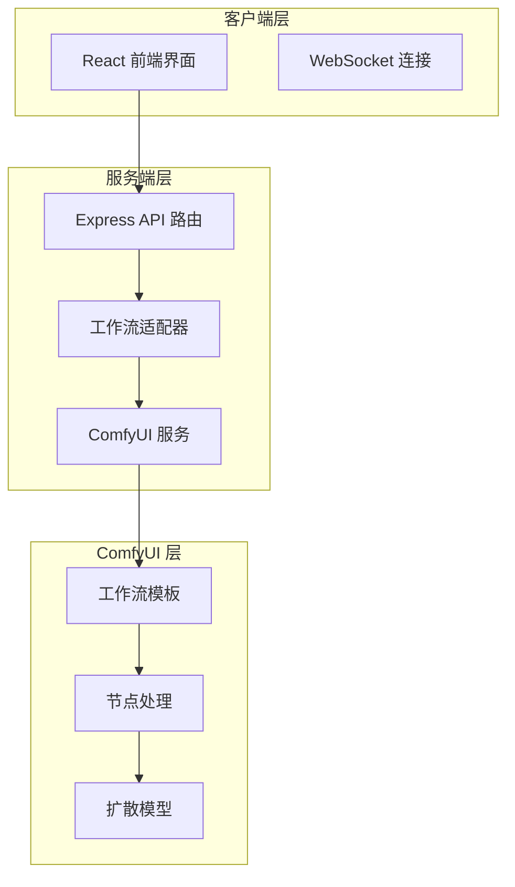
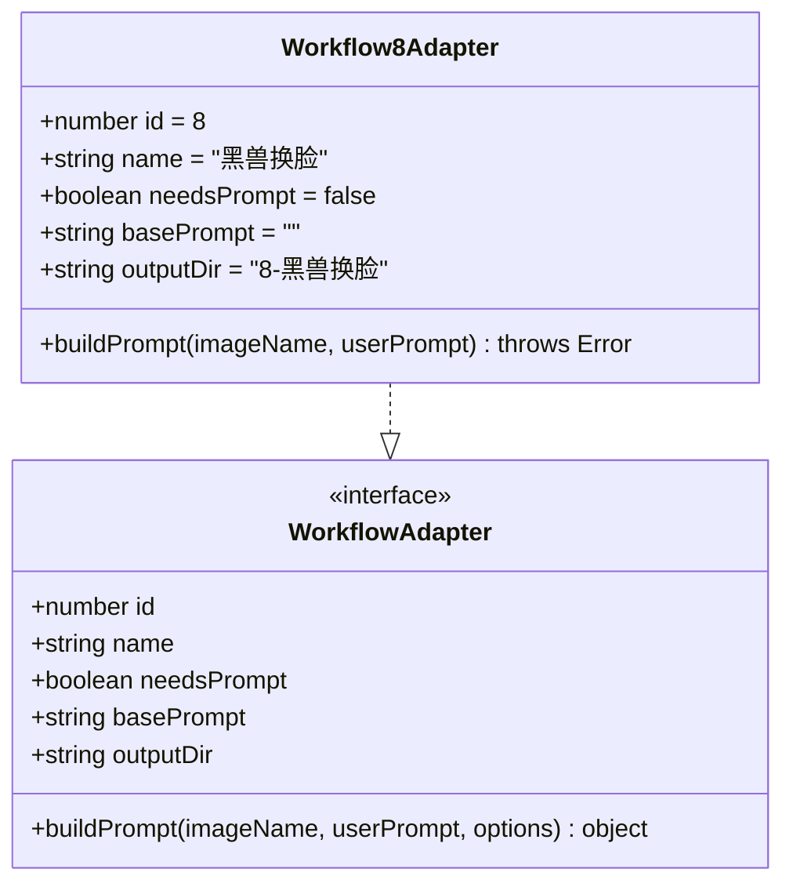
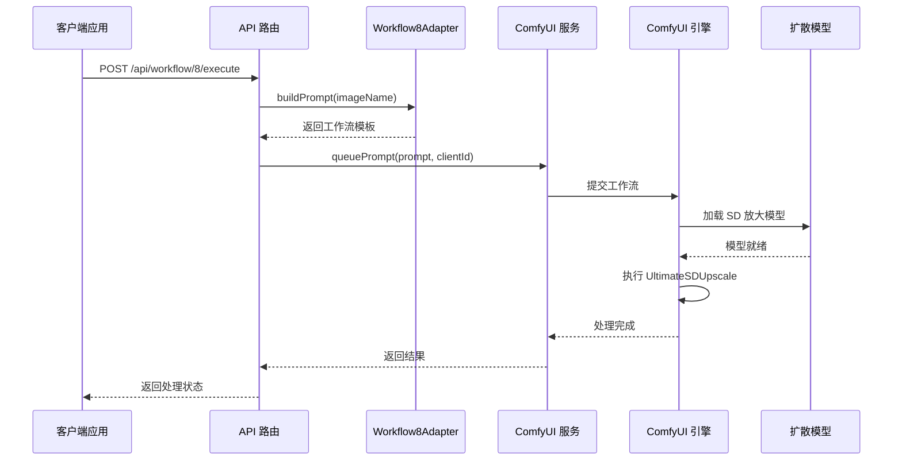
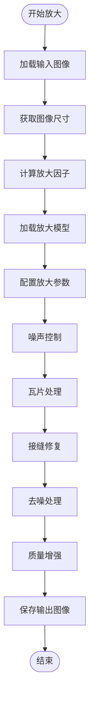
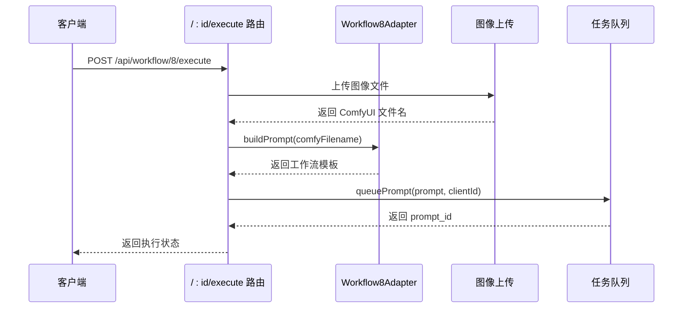
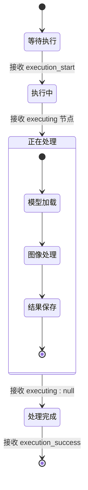
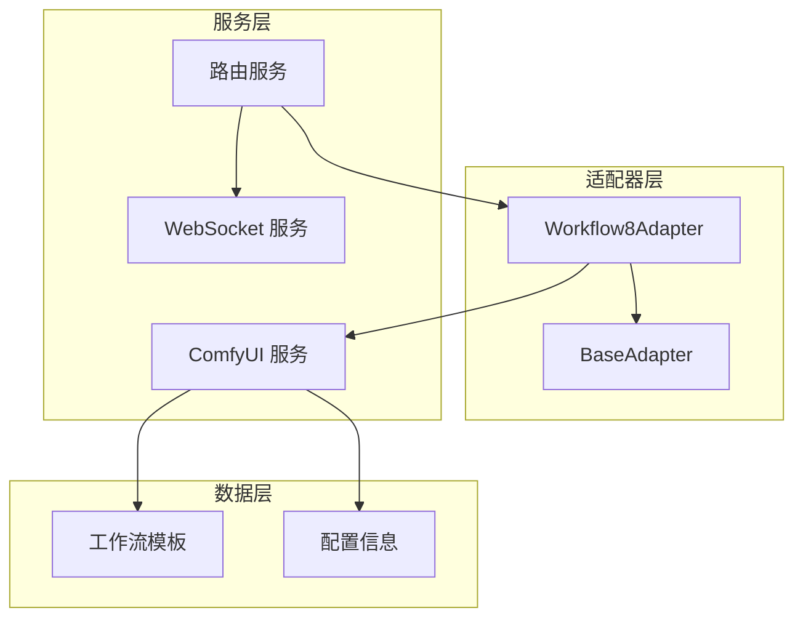

# Workflow8Adapter - SD 放大

<cite>
**本文档引用的文件**
- [Workflow8Adapter.ts](file://server/src/adapters/Workflow8Adapter.ts)
- [Pix2Real-SD放大.json](file://ComfyUI_API/Pix2Real-SD放大.json)
- [comfyui.ts](file://server/src/services/comfyui.ts)
- [workflow.ts](file://server/src/routes/workflow.ts)
- [README.md](file://README.md)
</cite>

## 目录
1. [简介](#简介)
2. [项目结构](#项目结构)
3. [核心组件](#核心组件)
4. [架构概览](#架构概览)
5. [详细组件分析](#详细组件分析)
6. [依赖关系分析](#依赖关系分析)
7. [性能考虑](#性能考虑)
8. [故障排除指南](#故障排除指南)
9. [结论](#结论)
10. [附录](#附录)

## 简介

Workflow8Adapter 是 CorineKit Pix2Real 项目中的一个特殊工作流适配器，专门用于 SD 放大（Stable Diffusion 超分辨率）功能。该项目是一个基于 Web 的本地图像处理工具，通过 ComfyUI 实现高质量的图像放大和超分辨率处理。

SD 放大工作流利用扩散模型技术，在保持图像质量的同时实现高质量的图像放大。该工作流特别专注于：
- 使用 UltimateSDUpscale 节点进行智能放大
- 通过噪声控制和细节恢复机制提升放大质量
- 支持多种放大倍数和优化参数配置
- 实现实时进度监控和内存管理

## 项目结构

CorineKit Pix2Real 采用模块化的架构设计，主要包含以下关键组件：



**图表来源**
- [README.md:41-62](file://README.md#L41-L62)
- [workflow.ts:750-799](file://server/src/routes/workflow.ts#L750-L799)

**章节来源**
- [README.md:41-79](file://README.md#L41-L79)

## 核心组件

### Workflow8Adapter 基础适配器

Workflow8Adapter 继承自基础适配器接口，专门为 SD 放大功能提供支持：



**图表来源**
- [Workflow8Adapter.ts:3-13](file://server/src/adapters/Workflow8Adapter.ts#L3-L13)

### ComfyUI 工作流模板

SD 放大功能的核心是基于 ComfyUI 的工作流模板，该模板包含了完整的超分辨率处理流程：

**章节来源**
- [Workflow8Adapter.ts:1-14](file://server/src/adapters/Workflow8Adapter.ts#L1-L14)

## 架构概览

SD 放大工作流的整体架构采用分层设计，从用户界面到底层模型推理形成完整的处理链路：



**图表来源**
- [workflow.ts:750-799](file://server/src/routes/workflow.ts#L750-L799)
- [comfyui.ts:168-196](file://server/src/services/comfyui.ts#L168-L196)

## 详细组件分析

### SD 放大工作流实现原理

SD 放大工作流基于 UltimateSDUpscale 节点实现，该节点提供了高级的超分辨率功能：

#### 核心处理流程



**图表来源**
- [Pix2Real-SD放大.json:125-129](file://ComfyUI_API/Pix2Real-SD放大.json#L125-L129)

#### 放大参数配置详解

SD 放大工作流的关键参数配置如下：

| 参数名称 | 默认值 | 作用描述 | 性能影响 |
|---------|--------|----------|----------|
| upscale_by | 2 | 放大倍数 | 直接影响处理时间和内存占用 |
| steps | 2 | 采样步数 | 影响质量但显著增加处理时间 |
| cfg | 1 | 提示词引导强度 | 控制细节保留程度 |
| denoise | 0.15 | 去噪强度 | 平衡细节和噪声控制 |
| sampler_name | "res_multistep" | 采样器类型 | 影响质量和速度平衡 |
| scheduler | "simple" | 调度器 | 控制采样过程稳定性 |

#### 噪声控制机制

工作流实现了多层次的噪声控制策略：

1. **初始去噪**: 使用较低的 denoise 值 (0.15) 进行初步去噪
2. **多级采样**: 通过减少 steps 数量降低噪声引入
3. **瓦片处理**: 将大图像分割为小块处理，减少累积噪声
4. **接缝修复**: 自动修复放大过程中产生的接缝伪影

#### 细节恢复机制

为了在放大过程中保持图像细节，工作流采用了以下策略：

1. **高分辨率模型**: 使用 UltraSharp 放大模型
2. **优化的瓦片大小**: 动态计算最优瓦片尺寸
3. **强制均匀瓦片**: 确保处理一致性
4. **质量压缩**: 输出前进行高质量压缩

**章节来源**
- [Pix2Real-SD放大.json:77-99](file://ComfyUI_API/Pix2Real-SD放大.json#L77-L99)

### 工作流执行流程

#### 请求处理流程



**图表来源**
- [workflow.ts:750-799](file://server/src/routes/workflow.ts#L750-L799)

#### 进度监控机制

工作流集成了实时进度监控功能，通过 WebSocket 实时传输处理状态：



**图表来源**
- [comfyui.ts:325-348](file://server/src/services/comfyui.ts#L325-L348)

**章节来源**
- [workflow.ts:750-799](file://server/src/routes/workflow.ts#L750-L799)
- [comfyui.ts:304-348](file://server/src/services/comfyui.ts#L304-L348)

## 依赖关系分析

### 组件耦合关系



**图表来源**
- [Workflow8Adapter.ts:1-14](file://server/src/adapters/Workflow8Adapter.ts#L1-L14)
- [comfyui.ts:168-196](file://server/src/services/comfyui.ts#L168-L196)

### 外部依赖

SD 放大工作流依赖于以下外部组件：

1. **ComfyUI 引擎**: 核心的图像处理引擎
2. **扩散模型**: Stable Diffusion 超分辨率模型
3. **GPU 显存**: 高性能显存支持大规模图像处理
4. **WebSocket 通信**: 实时状态同步

**章节来源**
- [comfyui.ts:1-25](file://server/src/services/comfyui.ts#L1-L25)

## 性能考虑

### 处理时间估算

根据工作流配置，SD 放大的处理时间可以通过以下公式估算：

```
处理时间 ≈ 基础时间 × 放大倍数 × 步数 × 瓦片数量
```

其中：
- 基础时间：约 2-5 秒（取决于图像大小）
- 放大倍数：线性影响处理时间
- 步数：对质量影响更大，处理时间呈线性增长
- 瓦片数量：与图像尺寸和放大倍数相关

### 内存使用优化

工作流实现了多项内存优化策略：

1. **动态瓦片大小计算**: 根据输入图像尺寸自动调整
2. **渐进式处理**: 分块处理减少峰值内存占用
3. **缓存管理**: 合理的模型和中间结果缓存策略

### 硬件要求建议

基于工作流的特性，推荐以下硬件配置：

| 组件 | 最低要求 | 推荐要求 | 用途 |
|------|----------|----------|------|
| CPU | Intel i5-12400F | AMD R5-5600X | 通用处理 |
| GPU | RTX 3060 12GB | RTX 4070 12GB | 主要处理单元 |
| 内存 | 16GB | 32GB | 系统运行 |
| 存储 | 500GB SSD | 1TB SSD | 模型和临时文件 |

**章节来源**
- [comfyui.ts:118-144](file://server/src/services/comfyui.ts#L118-L144)

## 故障排除指南

### 常见问题及解决方案

#### 1. 模型加载失败

**症状**: 工作流执行时报错，提示模型文件不存在

**解决方案**:
- 确认模型文件已正确安装到 ComfyUI 模型目录
- 检查模型文件权限设置
- 验证模型文件完整性

#### 2. 显存不足错误

**症状**: 处理过程中出现 CUDA out of memory 错误

**解决方案**:
- 减少放大倍数或降低图像分辨率
- 调整瓦片大小参数
- 关闭其他占用显存的应用程序
- 使用更小的模型文件

#### 3. 处理速度过慢

**症状**: 工作流执行时间过长

**优化建议**:
- 降低 steps 参数值
- 减少 denoise 强度
- 使用更高效的采样器
- 确保 GPU 驱动程序更新

### 调试工具

工作流提供了多种调试和监控工具：

1. **系统状态监控**: 实时显示 VRAM 和 RAM 使用情况
2. **进度跟踪**: 详细的处理阶段信息
3. **错误日志**: 详细的错误信息和堆栈跟踪

**章节来源**
- [workflow.ts:877-884](file://server/src/routes/workflow.ts#L877-L884)
- [comfyui.ts:304-348](file://server/src/services/comfyui.ts#L304-L348)

## 结论

Workflow8Adapter 为 CorineKit Pix2Real 项目提供了专业的 SD 放大功能。通过精心设计的工作流架构和参数配置，该适配器能够实现高质量的图像超分辨率处理。

### 主要优势

1. **高质量输出**: 基于扩散模型的智能放大技术
2. **灵活配置**: 支持多种参数调优选项
3. **实时监控**: 完善的进度跟踪和状态反馈
4. **性能优化**: 多层次的内存和计算资源优化

### 技术特点

- 支持 2x 放大倍数的高质量处理
- 实现了智能的噪声控制和细节恢复
- 提供了完善的错误处理和故障排除机制
- 集成了实时进度监控和状态反馈

该工作流为需要高质量图像放大的应用场景提供了可靠的解决方案，特别适用于需要保持图像细节和质量的专业用途。

## 附录

### 使用示例

#### 基本放大操作

1. 上传目标图像文件
2. 选择 Workflow8 适配器
3. 确认默认参数设置
4. 发送执行请求
5. 查看实时进度
6. 下载处理结果

#### 参数调优建议

| 场景 | 放大倍数 | 步数 | 去噪强度 | 适用性 |
|------|----------|------|----------|--------|
| 一般照片 | 2x | 2-4 | 0.1-0.2 | 高 |
| 专业摄影 | 2x | 4-6 | 0.15-0.25 | 高 |
| 低质量图像 | 2x | 6-8 | 0.2-0.3 | 中等 |
| 大图像处理 | 2x | 2-4 | 0.1-0.2 | 高 |

### API 接口规范

工作流通过标准的 REST API 接口提供服务：

- **端点**: `/api/workflow/:id/execute`
- **方法**: POST
- **认证**: 需要 clientId 参数
- **响应**: 包含 prompt_id 和执行状态

**章节来源**
- [workflow.ts:750-799](file://server/src/routes/workflow.ts#L750-L799)