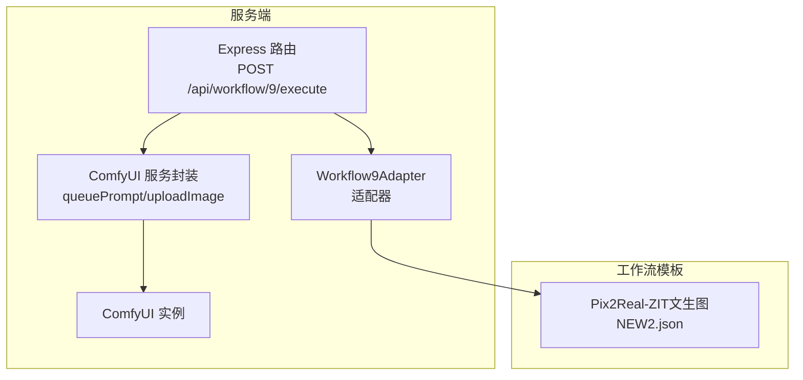
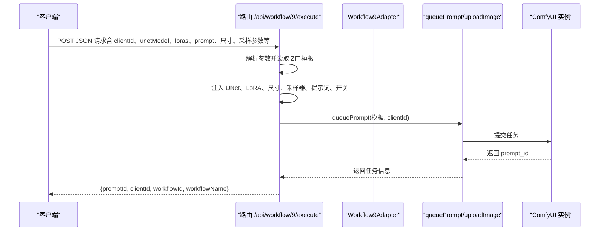
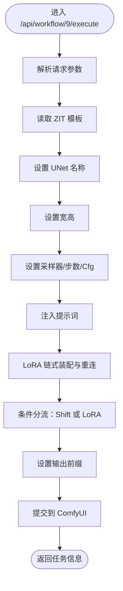
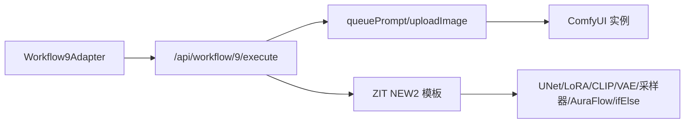

# Workflow9Adapter - 二次元生成

<cite>
**本文引用的文件**
- [Workflow9Adapter.ts](file://server/src/adapters/Workflow9Adapter.ts)
- [index.ts（适配器索引）](file://server/src/adapters/index.ts)
- [BaseAdapter.ts](file://server/src/adapters/BaseAdapter.ts)
- [workflow.ts（路由）](file://server/src/routes/workflow.ts)
- [comfyui.ts（服务）](file://server/src/services/comfyui.ts)
- [Pix2Real-ZIT文生图NEW2.json（ZIT模板）](file://ComfyUI_API/Pix2Real-ZIT文生图NEW2.json)
- [Pix2Real-二次元生成.json（二次元生成模板）](file://ComfyUI_API/Pix2Real-二次元生成.json)
- [二次元生成 (PRO).json（二次元生成PRO模板）](file://ComfyUI_API/二次元生成 (PRO).json)
- [Pix2Real-提示词助手.json（提示词助手模板）](file://docs/提示词助理开发需求/Pix2Real-提示词助手.json)
</cite>

## 目录
1. [简介](#简介)
2. [项目结构](#项目结构)
3. [核心组件](#核心组件)
4. [架构总览](#架构总览)
5. [详细组件分析](#详细组件分析)
6. [依赖关系分析](#依赖关系分析)
7. [性能考量](#性能考量)
8. [故障排查指南](#故障排查指南)
9. [结论](#结论)
10. [附录](#附录)

## 简介
本文件面向 Workflow9Adapter 的技术文档，聚焦“ZIT快出”（二次元生成）工作流的实现机制与使用方法。内容涵盖：
- 文本到图像生成流程与关键节点
- 风格控制与质量优化策略（LoRA、UNet、采样器、AuraFlow Sampling）
- 提示词工程、负向提示词与风格参数配置
- 使用示例与优化技巧（提示词优化、质量与多样性控制）
- 生成效率优化与资源使用建议

## 项目结构
Workflow9Adapter 属于服务端适配器体系的一部分，通过统一的路由接口对外暴露执行入口，并以 ComfyUI 工作流模板作为生成管线。

图表来源
- [workflow.ts（路由）:485-593](file://server/src/routes/workflow.ts#L485-L593)
- [Workflow9Adapter.ts:1-14](file://server/src/adapters/Workflow9Adapter.ts#L1-L14)
- [comfyui.ts（服务）:168-196](file://server/src/services/comfyui.ts#L168-L196)
- [Pix2Real-ZIT文生图NEW2.json（ZIT模板）:1-265](file://ComfyUI_API/Pix2Real-ZIT文生图NEW2.json#L1-L265)

章节来源
- [workflow.ts（路由）:485-593](file://server/src/routes/workflow.ts#L485-L593)
- [Workflow9Adapter.ts:1-14](file://server/src/adapters/Workflow9Adapter.ts#L1-L14)
- [index.ts（适配器索引）:14-26](file://server/src/adapters/index.ts#L14-L26)

## 核心组件
- Workflow9Adapter：声明式适配器，标识工作流 ID、名称、输出目录等元数据；当前版本不直接构建提示词，而是通过专用路由执行。
- 路由层（/api/workflow/9/execute）：接收客户端请求，解析参数，动态装配 ZIT 模板，注入 UNet、LoRA、采样器、尺寸与提示词，提交到 ComfyUI。
- 服务层（queuePrompt/uploadImage）：负责与 ComfyUI 通信、上传输入、登记进度权重、返回任务 ID。
- 工作流模板（ZIT NEW2）：定义完整的生成链路，包含 UNet 加载、CLIP/VAE 加载、LoRA 链式连接、采样器、AuraFlow 采样算法与条件分流。

章节来源
- [Workflow9Adapter.ts:3-12](file://server/src/adapters/Workflow9Adapter.ts#L3-L12)
- [workflow.ts（路由）:485-593](file://server/src/routes/workflow.ts#L485-L593)
- [comfyui.ts（服务）:168-196](file://server/src/services/comfyui.ts#L168-L196)
- [Pix2Real-ZIT文生图NEW2.json（ZIT模板）:1-265](file://ComfyUI_API/Pix2Real-ZIT文生图NEW2.json#L1-L265)

## 架构总览
ZIT 快出工作流采用“模板 + 参数注入”的方式，将客户端提供的 UNet、LoRA、提示词、尺寸与采样参数映射到模板节点，再交由 ComfyUI 执行。

图表来源
- [workflow.ts（路由）:485-593](file://server/src/routes/workflow.ts#L485-L593)
- [comfyui.ts（服务）:168-196](file://server/src/services/comfyui.ts#L168-L196)
- [Pix2Real-ZIT文生图NEW2.json（ZIT模板）:1-265](file://ComfyUI_API/Pix2Real-ZIT文生图NEW2.json#L1-L265)

## 详细组件分析

### 组件一：Workflow9Adapter 适配器
- 角色：声明工作流元数据与提示词构建策略。当前版本明确声明不需要用户提示词（needsPrompt=false），且 buildPrompt 方法抛出异常，提示应通过专用路由执行。
- 输出目录：用于生成结果的命名与归档（outputDir）。
- 设计意图：将“提示词构建”与“工作流执行”解耦，提示词与风格参数由路由层集中管理与注入。

章节来源
- [Workflow9Adapter.ts:3-12](file://server/src/adapters/Workflow9Adapter.ts#L3-L12)
- [BaseAdapter.ts:1-4](file://server/src/adapters/BaseAdapter.ts#L1-L4)

### 组件二：路由层（/api/workflow/9/execute）
- 输入参数
  - 必填：clientId
  - 模型与风格：unetModel、loras（数组，含 model、enabled、strength）、shiftEnabled、shift
  - 生成参数：prompt、width、height、steps、cfg、sampler、scheduler、name
- 关键处理逻辑
  - 读取 ZIT 模板，设置 UNet 名称、尺寸、采样器、随机种子、提示词与输出前缀
  - LoRA 链式装配：根据 enabled 状态动态重连，禁用的 LoRA 被跳过，最终输出连接到下游节点
  - 条件分流：通过 ifElse 节点在“启用 Shift（AuraFlow）”与“最后启用的 LoRA”之间切换
- 输出：返回 promptId、clientId、workflowId、workflowName

图表来源
- [workflow.ts（路由）:485-593](file://server/src/routes/workflow.ts#L485-L593)
- [Pix2Real-ZIT文生图NEW2.json（ZIT模板）:1-265](file://ComfyUI_API/Pix2Real-ZIT文生图NEW2.json#L1-L265)

章节来源
- [workflow.ts（路由）:485-593](file://server/src/routes/workflow.ts#L485-L593)

### 组件三：工作流模板（ZIT NEW2）
- 关键节点
  - UNet 加载：选择 Z-image 系列 UNet
  - CLIP/Vae 加载：加载对应 CLIP 与 VAE
  - LoRA 链：最多 5 个 LoRA 节点串联，按 enabled 状态动态连接
  - 采样器：KSampler（euler/simple）
  - 采样算法：ModelSamplingAuraFlow（Shift 参数）
  - 条件分流：easy ifElse 切换 ModelSampling 或 LoRA 输出
  - VAE 解码与保存
- 尺寸与随机性：EmptyLatentImage 与 KSampler 的 seed 控制分辨率与随机性

章节来源
- [Pix2Real-ZIT文生图NEW2.json（ZIT模板）:1-265](file://ComfyUI_API/Pix2Real-ZIT文生图NEW2.json#L1-L265)

### 组件四：服务层（queuePrompt 与进度权重）
- 任务提交：将模板 JSON 与 client_id 发送到 ComfyUI，返回 prompt_id
- 进度权重：根据节点类型与步骤数估算权重，用于阶段化进度展示
- 错误映射：将底层错误转换为用户可理解的提示

章节来源
- [comfyui.ts（服务）:168-196](file://server/src/services/comfyui.ts#L168-L196)
- [comfyui.ts（服务）:47-144](file://server/src/services/comfyui.ts#L47-L144)

### 组件五：提示词工程与风格控制
- 正向提示词（Prompt）
  - 由客户端直接传入，注入到模板节点
  - 建议：结合风格关键词（如“动漫风格”、“高细节”、“8K”）与主体描述，避免与模型风格冲突
- 负向提示词（Negative Prompt）
  - 默认包含低质量、畸形、水印等负面元素，可由客户端追加
  - 建议：针对特定缺陷（如“变形手/脸”、“模糊”）进行针对性补充
- 风格参数
  - UNet：选择 Z-image 系列以适配二次元风格
  - LoRA：通过链式装配叠加风格特征，按 enabled 控制开关与 strength 调整强度
  - 采样器与步数：euler/simple、steps=9 适合快速生成；可根据质量需求提升
  - Shift（AuraFlow）：通过 shiftEnabled 与 shift 参数控制采样算法，影响细节与稳定性

章节来源
- [workflow.ts（路由）:485-593](file://server/src/routes/workflow.ts#L485-L593)
- [Pix2Real-ZIT文生图NEW2.json（ZIT模板）:1-265](file://ComfyUI_API/Pix2Real-ZIT文生图NEW2.json#L1-L265)

### 组件六：与二次元生成（基础版/PRO）的关系
- 基础版（二次元生成）：使用固定模板，支持 LoRA 链式装配与负向提示词拼接
- PRO 版（二次元生成 PRO）：引入 ControlNet（Depth/Pose）与 DW 姿态估计，强调参考图驱动的风格与姿态一致性
- ZIT 快出（Workflow9）：以 UNet + LoRA + AuraFlow 为核心，强调快速与风格可控

章节来源
- [Pix2Real-二次元生成.json（二次元生成模板）:1-240](file://ComfyUI_API/Pix2Real-二次元生成.json#L1-L240)
- [二次元生成 (PRO).json（二次元生成PRO模板）](file://ComfyUI_API/二次元生成 (PRO).json#L1-L422)

## 依赖关系分析
- 适配器与路由
  - 适配器提供元数据与提示词构建能力；路由层负责参数解析与模板装配
- 路由与服务
  - 路由调用服务层完成上传与任务提交；服务层维护进度权重与错误映射
- 模板与节点
  - 模板定义节点间连接关系；路由通过节点 ID 注入参数；LoRA 与 UNet 的连接需满足 enabled 状态

图表来源
- [index.ts（适配器索引）:14-26](file://server/src/adapters/index.ts#L14-L26)
- [workflow.ts（路由）:485-593](file://server/src/routes/workflow.ts#L485-L593)
- [comfyui.ts（服务）:168-196](file://server/src/services/comfyui.ts#L168-L196)
- [Pix2Real-ZIT文生图NEW2.json（ZIT模板）:1-265](file://ComfyUI_API/Pix2Real-ZIT文生图NEW2.json#L1-L265)

章节来源
- [index.ts（适配器索引）:14-26](file://server/src/adapters/index.ts#L14-L26)
- [workflow.ts（路由）:485-593](file://server/src/routes/workflow.ts#L485-L593)

## 性能考量
- 采样器与步数
  - ZIT 模板默认 steps=9、euler/simple，适合快速生成；若追求更高质量，可适度增加 steps 并调整 sampler
- UNet 与 LoRA
  - 优先选择与二次元风格匹配的 UNet；LoRA 强度与数量需平衡，过多可能造成风格过载或不稳定
- AuraFlow 采样
  - shiftEnabled 与 shift 参数影响采样稳定性与细节；建议先以较低强度验证，再逐步提升
- 资源使用
  - 采样阶段 GPU 占用最高；合理设置 batch 与分辨率，避免超显存
  - LoRA 链式装配时注意节点重连，减少无效连接带来的额外开销

## 故障排查指南
- 常见错误与定位
  - 模型/LoRA 未找到：检查模型路径与文件名，确认 ComfyUI 已正确安装
  - 任务提交失败：确认 ComfyUI 服务可用，网络连通性正常
  - 任务无响应：检查 prompt_id 是否正确，确认进度事件是否推送
- 建议排查步骤
  - 核对 clientId 与请求体字段
  - 确认模板节点 ID 与参数映射一致
  - 查看服务层错误映射与日志输出

章节来源
- [workflow.ts（路由）:126-150](file://server/src/routes/workflow.ts#L126-L150)
- [comfyui.ts（服务）:168-196](file://server/src/services/comfyui.ts#L168-L196)

## 结论
Workflow9Adapter 通过“模板 + 参数注入”的方式，将 UNet、LoRA、采样器与提示词等要素整合到 ZIT 快出工作流中，实现高效、可控的二次元风格生成。配合 AuraFlow 采样与条件分流，可在速度与质量之间灵活权衡。建议在提示词工程、LoRA 强度与采样参数上进行渐进式优化，以获得稳定且高质量的输出。

## 附录

### 使用示例与最佳实践
- 快速生成
  - 设置 unetModel 为 Z-image 系列，steps=9，sampler=euler/simple，shiftEnabled=false
  - prompt 仅包含主体与风格关键词，避免冗余描述
- 风格强化
  - 启用若干 LoRA（enabled=true），适度提高 strength；观察输出风格变化
  - 启用 shiftEnabled=true，调整 shift 参数，提升细节与稳定性
- 负向提示词
  - 保留默认负面词，按需追加特定缺陷描述（如“变形手/脸”、“模糊”）
- 输出命名
  - 通过 name 参数设置输出前缀，避免文件名冲突

章节来源
- [workflow.ts（路由）:485-593](file://server/src/routes/workflow.ts#L485-L593)
- [Pix2Real-ZIT文生图NEW2.json（ZIT模板）:1-265](file://ComfyUI_API/Pix2Real-ZIT文生图NEW2.json#L1-L265)

### 提示词助手与风格参考
- 提示词助手模板可用于生成与优化提示词，结合 LLM 参数与示例场景，提升提示词质量与一致性
- 可参考二次元生成（基础版/PRO）模板中的正负向提示词组织方式，形成标准化风格词库

章节来源
- [Pix2Real-提示词助手.json（提示词助手模板）:1-106](file://docs/提示词助理开发需求/Pix2Real-提示词助手.json#L1-L106)
- [Pix2Real-二次元生成.json（二次元生成模板）:1-240](file://ComfyUI_API/Pix2Real-二次元生成.json#L1-L240)
- [二次元生成 (PRO).json（二次元生成PRO模板）](file://ComfyUI_API/二次元生成 (PRO).json#L1-L422)