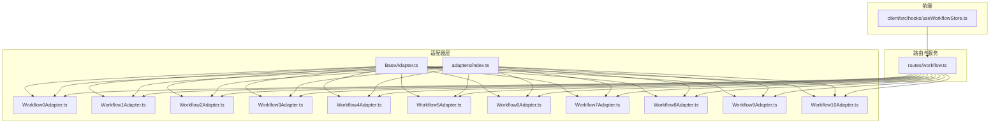
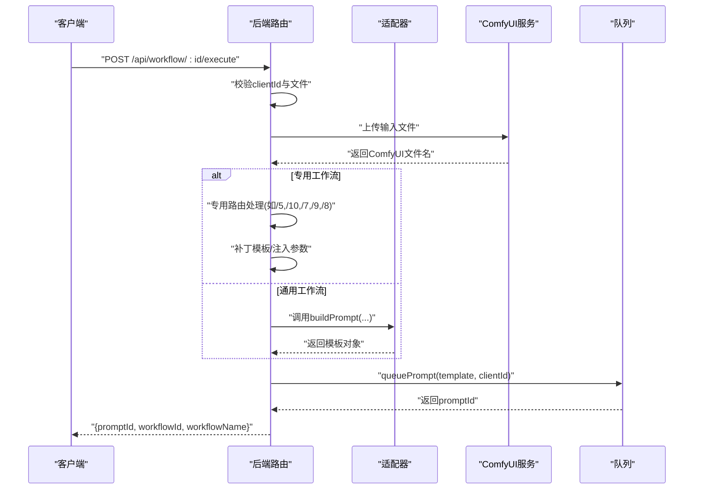
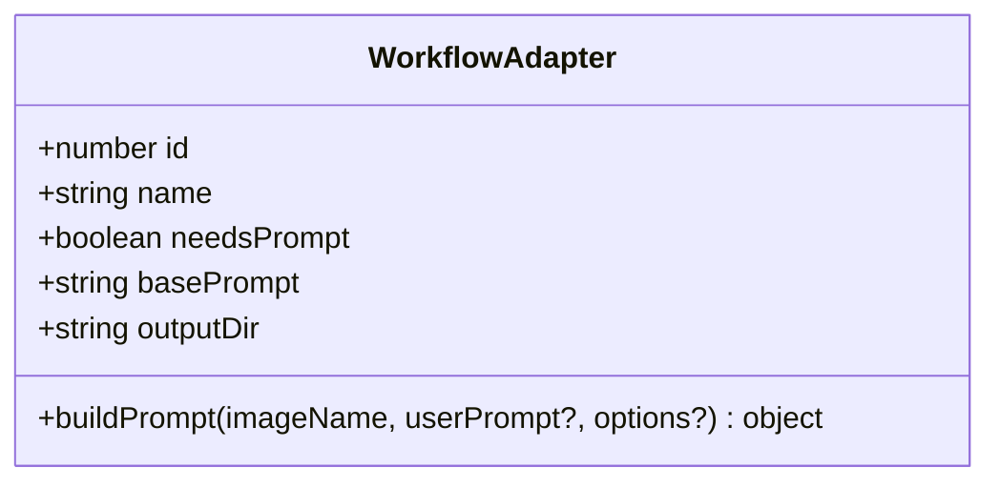
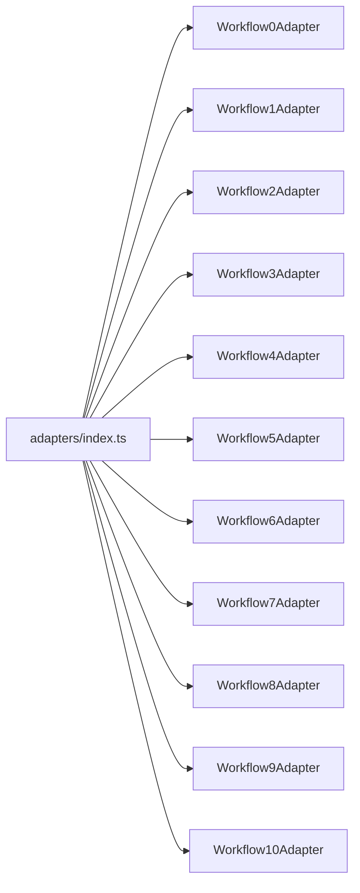
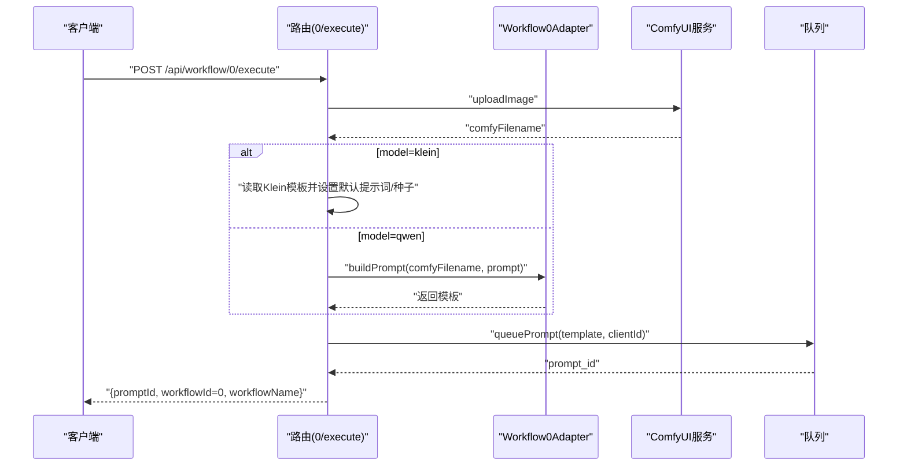
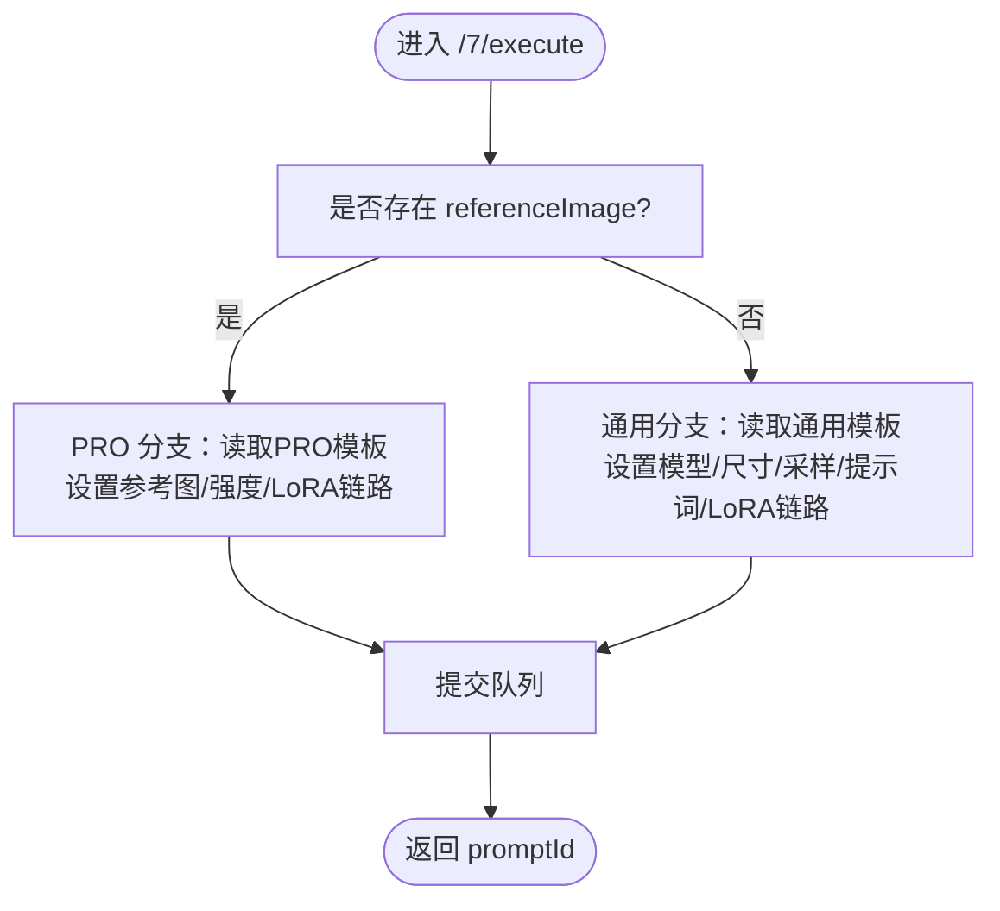
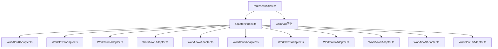

# 工作流实现详解

<cite>
**本文引用的文件**
- [server/src/adapters/BaseAdapter.ts](file://server/src/adapters/BaseAdapter.ts)
- [server/src/adapters/Workflow0Adapter.ts](file://server/src/adapters/Workflow0Adapter.ts)
- [server/src/adapters/Workflow1Adapter.ts](file://server/src/adapters/Workflow1Adapter.ts)
- [server/src/adapters/Workflow2Adapter.ts](file://server/src/adapters/Workflow2Adapter.ts)
- [server/src/adapters/Workflow3Adapter.ts](file://server/src/adapters/Workflow3Adapter.ts)
- [server/src/adapters/Workflow4Adapter.ts](file://server/src/adapters/Workflow4Adapter.ts)
- [server/src/adapters/Workflow5Adapter.ts](file://server/src/adapters/Workflow5Adapter.ts)
- [server/src/adapters/Workflow6Adapter.ts](file://server/src/adapters/Workflow6Adapter.ts)
- [server/src/adapters/Workflow7Adapter.ts](file://server/src/adapters/Workflow7Adapter.ts)
- [server/src/adapters/Workflow8Adapter.ts](file://server/src/adapters/Workflow8Adapter.ts)
- [server/src/adapters/Workflow9Adapter.ts](file://server/src/adapters/Workflow9Adapter.ts)
- [server/src/adapters/Workflow10Adapter.ts](file://server/src/adapters/Workflow10Adapter.ts)
- [server/src/adapters/index.ts](file://server/src/adapters/index.ts)
- [server/src/types/index.ts](file://server/src/types/index.ts)
- [server/src/routes/workflow.ts](file://server/src/routes/workflow.ts)
- [client/src/hooks/useWorkflowStore.ts](file://client/src/hooks/useWorkflowStore.ts)
</cite>

## 目录
1. [引言](#引言)
2. [项目结构](#项目结构)
3. [核心组件](#核心组件)
4. [架构总览](#架构总览)
5. [详细组件分析](#详细组件分析)
6. [依赖关系分析](#依赖关系分析)
7. [性能考虑](#性能考虑)
8. [故障排查指南](#故障排查指南)
9. [结论](#结论)
10. [附录](#附录)

## 引言
本文件面向开发者，系统梳理并深入解析 11 种工作流适配器的实现与差异，覆盖从通用适配器接口到各工作流的输入参数、处理逻辑、输出格式与性能特征。文档同时提供工作流选择指南、调试技巧与优化建议，并通过可视化图表帮助快速理解关键流程。

## 项目结构
后端采用适配器模式组织工作流，前端通过状态管理驱动任务生命周期。核心目录与文件如下：
- 适配器层：server/src/adapters 下的 BaseAdapter.ts 与各 WorkflowXAdapter.ts
- 类型定义：server/src/types/index.ts
- 路由与执行：server/src/routes/workflow.ts
- 前端工作流状态：client/src/hooks/useWorkflowStore.ts

**图表来源**
- [server/src/adapters/BaseAdapter.ts:1-4](file://server/src/adapters/BaseAdapter.ts#L1-L4)
- [server/src/adapters/index.ts:1-33](file://server/src/adapters/index.ts#L1-L33)
- [server/src/routes/workflow.ts:1-800](file://server/src/routes/workflow.ts#L1-L800)
- [client/src/hooks/useWorkflowStore.ts:71-83](file://client/src/hooks/useWorkflowStore.ts#L71-L83)

**章节来源**
- [server/src/adapters/index.ts:1-33](file://server/src/adapters/index.ts#L1-L33)
- [server/src/routes/workflow.ts:1-800](file://server/src/routes/workflow.ts#L1-L800)
- [client/src/hooks/useWorkflowStore.ts:71-83](file://client/src/hooks/useWorkflowStore.ts#L71-L83)

## 核心组件
- 适配器接口：WorkflowAdapter 定义了工作流的标识、名称、是否需要提示词、基础提示词、输出目录以及构建提示模板的方法。
- 适配器集合：adapters/index.ts 将 0~10 的适配器集中导出并提供按 id 获取的工具函数。
- 路由执行：routes/workflow.ts 提供统一的执行入口与专用路由，负责文件上传、模板补丁、队列提交与错误映射。
- 前端状态：useWorkflowStore.ts 维护工作流列表、图像与任务状态、提示词与配置等。

**章节来源**
- [server/src/types/index.ts:1-52](file://server/src/types/index.ts#L1-L52)
- [server/src/adapters/index.ts:14-32](file://server/src/adapters/index.ts#L14-L32)
- [server/src/routes/workflow.ts:152-161](file://server/src/routes/workflow.ts#L152-L161)
- [client/src/hooks/useWorkflowStore.ts:71-83](file://client/src/hooks/useWorkflowStore.ts#L71-L83)

## 架构总览
下图展示通用工作流执行与专用工作流执行的关键路径，包括参数校验、模板加载、节点补丁与队列提交。

**图表来源**
- [server/src/routes/workflow.ts:750-799](file://server/src/routes/workflow.ts#L750-L799)
- [server/src/routes/workflow.ts:163-215](file://server/src/routes/workflow.ts#L163-L215)
- [server/src/routes/workflow.ts:217-267](file://server/src/routes/workflow.ts#L217-L267)
- [server/src/routes/workflow.ts:269-405](file://server/src/routes/workflow.ts#L269-L405)
- [server/src/routes/workflow.ts:485-593](file://server/src/routes/workflow.ts#L485-L593)
- [server/src/routes/workflow.ts:595-642](file://server/src/routes/workflow.ts#L595-L642)
- [server/src/routes/workflow.ts:644-748](file://server/src/routes/workflow.ts#L644-L748)

## 详细组件分析

### 通用适配器接口与基类
- 接口定义：WorkflowAdapter
  - id: number
  - name: string
  - needsPrompt: boolean
  - basePrompt: string
  - outputDir: string
  - buildPrompt(imageName: string, userPrompt?: string, options?: Record<string, any>): object
- 基类导出：BaseAdapter.ts 导出 WorkflowAdapter 类型，便于统一约束。

**图表来源**
- [server/src/types/index.ts:1-8](file://server/src/types/index.ts#L1-L8)
- [server/src/adapters/BaseAdapter.ts:1-4](file://server/src/adapters/BaseAdapter.ts#L1-L4)

**章节来源**
- [server/src/types/index.ts:1-8](file://server/src/types/index.ts#L1-L8)
- [server/src/adapters/BaseAdapter.ts:1-4](file://server/src/adapters/BaseAdapter.ts#L1-L4)

### 适配器集合与索引
- adapters/index.ts 将 0~10 的适配器集中导出，并提供 getAdapter(id) 工具函数，便于路由层按 id 获取对应适配器。

**图表来源**
- [server/src/adapters/index.ts:14-26](file://server/src/adapters/index.ts#L14-L26)

**章节来源**
- [server/src/adapters/index.ts:14-32](file://server/src/adapters/index.ts#L14-L32)

### 工作流0：二次元转真人
- 功能概述：将二次元风格图像转换为真实照片风格，支持 qwen 与 klein 两种模型路径。
- 输入参数
  - 文件：image（二选一）
  - 表单字段：model（默认 qwen；可选 klein）、prompt（用户提示词，为空则使用基础提示词）
  - 查询/请求体：clientId（必填）
- 处理逻辑
  - 上传文件至 ComfyUI，得到 comfyFilename
  - model 为 klein 时，读取 Klein 模板并设置默认提示词与随机种子
  - model 为 qwen 时，委托 Workflow0Adapter.buildPrompt 使用模板路径与基础提示词拼装
  - 提交队列并返回 promptId
- 输出格式：标准队列响应，包含 prompt_id
- 性能特点：模板读取与节点补丁开销低，主要耗时在采样阶段
- 参数验证与错误处理：toFriendlyComfyError 将常见模型缺失与队列失败映射为用户友好提示

**图表来源**
- [server/src/routes/workflow.ts:644-687](file://server/src/routes/workflow.ts#L644-L687)
- [server/src/adapters/Workflow0Adapter.ts:9-34](file://server/src/adapters/Workflow0Adapter.ts#L9-L34)

**章节来源**
- [server/src/routes/workflow.ts:644-687](file://server/src/routes/workflow.ts#L644-L687)
- [server/src/adapters/Workflow0Adapter.ts:9-34](file://server/src/adapters/Workflow0Adapter.ts#L9-L34)

### 工作流1：真人精修
- 功能概述：对输入图像进行高质量精修，强调细节与真实感
- 输入参数
  - 文件：image
  - 表单字段：prompt（可选，为空则使用基础提示词）
  - 查询/请求体：clientId（必填）
- 处理逻辑
  - 上传图像，读取专用模板
  - 设置 LoadImage 节点为上传文件名
  - 设置 CLIPTextEncode 节点文本为基础提示词或用户提示词
  - 注入随机种子
  - 提交队列
- 输出格式：标准队列响应
- 性能特点：提示词较长，采样步数与 CFG 较高时耗时增加
- 参数验证与错误处理：同上

**章节来源**
- [server/src/adapters/Workflow1Adapter.ts:9-35](file://server/src/adapters/Workflow1Adapter.ts#L9-L35)
- [server/src/routes/workflow.ts:750-799](file://server/src/routes/workflow.ts#L750-L799)

### 工作流2：精修放大
- 功能概述：对图像进行精修与放大，支持多种模型（seedvr2、klein、kleinpro、sd、remacri）
- 输入参数
  - 文件：image
  - 表单字段：model（默认 seedvr2；可选 klein/kleinpro/sd/remacri）、prompt（该工作流不使用）
  - 查询/请求体：clientId（必填）
- 处理逻辑
  - 上传图像，按 model 分支读取不同模板
  - 设置 LoadImage 节点与随机种子
  - 提交队列
- 输出格式：标准队列响应
- 性能特点：不同模型的计算复杂度不同，seedvr2 通常较快，klein/kleinpro 更注重细节
- 参数验证与错误处理：同上

**章节来源**
- [server/src/adapters/Workflow2Adapter.ts:9-27](file://server/src/adapters/Workflow2Adapter.ts#L9-L27)
- [server/src/routes/workflow.ts:689-748](file://server/src/routes/workflow.ts#L689-L748)

### 工作流3：图生视频
- 功能概述：将静态图像生成短视频，支持自定义时长、帧率与分辨率
- 输入参数
  - 文件：image
  - 表单字段：prompt（可选，为空则使用基础提示词）、options（JSON 字符串，包含 seconds/fps/megapixels）
  - 查询/请求体：clientId（必填）
- 处理逻辑
  - 上传图像，读取模板
  - 设置 LoadImage 节点
  - 设置 CLIPTextEncode 文本为用户提示词或基础提示词
  - 设置视频时长、帧率与质量（megapixels）
  - 注入噪声种子
  - 提交队列
- 输出格式：标准队列响应
- 性能特点：seconds×fps 决定帧数，megapixels 影响分辨率与显存占用
- 参数验证与错误处理：同上

**章节来源**
- [server/src/adapters/Workflow3Adapter.ts:9-40](file://server/src/adapters/Workflow3Adapter.ts#L9-L40)
- [server/src/routes/workflow.ts:750-799](file://server/src/routes/workflow.ts#L750-L799)

### 工作流4：视频补帧
- 功能概述：对现有视频进行帧插值以提升流畅度
- 输入参数
  - 文件：video
  - 表单字段：options（JSON 字符串，包含 multiplier，默认 2）
  - 查询/请求体：clientId（必填）
- 处理逻辑
  - 上传视频，读取模板
  - 设置 VHS_LoadVideo 节点为上传视频
  - 设置插值倍数（multiplier）
  - 提交队列
- 输出格式：标准队列响应
- 性能特点：multiplier 越大，计算量越大
- 参数验证与错误处理：同上

**章节来源**
- [server/src/adapters/Workflow4Adapter.ts:9-27](file://server/src/adapters/Workflow4Adapter.ts#L9-L27)
- [server/src/routes/workflow.ts:750-799](file://server/src/routes/workflow.ts#L750-L799)

### 工作流5：解除装备
- 功能概述：专用工作流，需同时提供原图与蒙版，支持可选 pose 回退
- 输入参数
  - 文件：image（原图）、mask（蒙版）
  - 请求体字段：clientId（必填）、backPose（字符串 'true'/'false'）、prompt（可选）
- 处理逻辑
  - 上传 image 与 mask，读取固定模板
  - 设置节点：原图、蒙版、backPose、随机种子
  - prompt 存在时覆盖默认文本
  - 提交队列
- 输出格式：标准队列响应
- 性能特点：模板固定，节点数量有限
- 参数验证与错误处理：同上

**章节来源**
- [server/src/adapters/Workflow5Adapter.ts:4-14](file://server/src/adapters/Workflow5Adapter.ts#L4-L14)
- [server/src/routes/workflow.ts:163-215](file://server/src/routes/workflow.ts#L163-L215)

### 工作流6：真人转二次元
- 功能概述：将真实人物图像转换为二次元风格
- 输入参数
  - 文件：image
  - 表单字段：prompt（可选，为空则使用空提示词，触发自动标签路径）
  - 查询/请求体：clientId（必填）
- 处理逻辑
  - 上传图像，读取模板
  - 设置 LoadImage 节点
  - 设置 TextInput_ 节点：空字符串走自动标签路径，否则直接作为正向提示词
  - 注入两个随机种子
  - 提交队列
- 输出格式：标准队列响应
- 性能特点：提示词路径影响后续处理分支
- 参数验证与错误处理：同上

**章节来源**
- [server/src/adapters/Workflow6Adapter.ts:9-35](file://server/src/adapters/Workflow6Adapter.ts#L9-L35)
- [server/src/routes/workflow.ts:750-799](file://server/src/routes/workflow.ts#L750-L799)

### 工作流7：快速出图（文本到图像）
- 功能概述：通用文本到图像生成，支持参考图（PRO 分支）与 LoRA 链式连接
- 输入参数（通用）
  - JSON 请求体：clientId（必填）、model、prompt、negativePrompt、width、height、steps、cfg、sampler、scheduler、name、seed
  - 可选：loras（数组，每项含 model、enabled、strength）
- 输入参数（PRO 分支）
  - JSON 请求体：referenceImage（参考图文件名）、depthStrength、poseStrength、useOriginalRatio
- 处理逻辑
  - 通用分支：读取模板，设置 Checkpoint、尺寸、采样器、提示词、LoRA 链路、输出前缀，提交队列
  - PRO 分支：读取 PRO 模板，设置参考图、深度与姿态强度、LoRA 链路，提交队列
- 输出格式：标准队列响应
- 性能特点：LoRA 链路与采样参数直接影响耗时与显存
- 参数验证与错误处理：同上

**图表来源**
- [server/src/routes/workflow.ts:269-405](file://server/src/routes/workflow.ts#L269-L405)

**章节来源**
- [server/src/routes/workflow.ts:269-405](file://server/src/routes/workflow.ts#L269-L405)

### 工作流8：黑兽换脸
- 功能概述：专用工作流，需同时提供目标图像与人脸图像
- 输入参数
  - 文件：targetImage（目标图像）、faceImage（人脸图像）
  - 请求体字段：clientId（必填）
- 处理逻辑
  - 上传两张图像，读取模板
  - 设置节点：目标图、人脸图、随机种子
  - 提交队列
- 输出格式：标准队列响应
- 性能特点：模板固定，节点数量有限
- 参数验证与错误处理：同上

**章节来源**
- [server/src/adapters/Workflow8Adapter.ts:3-13](file://server/src/adapters/Workflow8Adapter.ts#L3-L13)
- [server/src/routes/workflow.ts:595-642](file://server/src/routes/workflow.ts#L595-L642)

### 工作流9：ZIT快出（UNet + LoRA）
- 功能概述：基于 UNet 与 LoRA 的文本到图像生成，支持 AuraFlow shift 开关
- 输入参数
  - JSON 请求体：clientId（必填）、unetModel、shiftEnabled、shift、prompt、width、height、steps、cfg、sampler、scheduler、name、loras（数组）
- 处理逻辑
  - 读取模板，设置 UNet、尺寸、采样器、提示词
  - 根据 shiftEnabled 决定模型来源（UNet 或 LoRA 链路）
  - LoRA 链式连接：启用的 LoRA 串联，禁用的 LoRA 被跳过
  - 提交队列
- 输出格式：标准队列响应
- 性能特点：LoRA 链路与 shiftEnabled 影响模型采样路径与显存占用
- 参数验证与错误处理：同上

**章节来源**
- [server/src/adapters/Workflow9Adapter.ts:3-13](file://server/src/adapters/Workflow9Adapter.ts#L3-L13)
- [server/src/routes/workflow.ts:485-593](file://server/src/routes/workflow.ts#L485-L593)

### 工作流10：区域编辑
- 功能概述：专用工作流，需同时提供原图与蒙版，支持可选 pose 回退
- 输入参数
  - 文件：image（原图）、mask（蒙版）
  - 请求体字段：clientId（必填）、backPose（字符串 'true'/'false'）、prompt（必填，且始终设置）
- 处理逻辑
  - 上传 image 与 mask，读取模板
  - 设置节点：原图、蒙版、backPose、随机种子
  - prompt 始终设置（即使为空字符串）
  - 提交队列
- 输出格式：标准队列响应
- 性能特点：模板固定，节点数量有限
- 参数验证与错误处理：同上

**章节来源**
- [server/src/adapters/Workflow10Adapter.ts:4-14](file://server/src/adapters/Workflow10Adapter.ts#L4-L14)
- [server/src/routes/workflow.ts:217-267](file://server/src/routes/workflow.ts#L217-L267)

## 依赖关系分析
- 适配器与路由的耦合
  - 通用工作流：路由通过 getAdapter(id) 获取适配器，再调用 buildPrompt 构建模板
  - 专用工作流：路由直接读取固定模板并注入参数
- 适配器与模板文件
  - 适配器通过相对路径读取 ComfyUI 工作流 JSON 模板，构建节点映射与参数
- 前后端协作
  - 前端 useWorkflowStore 维护工作流列表与任务状态，后端 routes/workflow.ts 提供统一执行入口与专用路由

**图表来源**
- [server/src/adapters/index.ts:14-26](file://server/src/adapters/index.ts#L14-L26)
- [server/src/routes/workflow.ts:1-800](file://server/src/routes/workflow.ts#L1-L800)

**章节来源**
- [server/src/adapters/index.ts:14-26](file://server/src/adapters/index.ts#L14-L26)
- [server/src/routes/workflow.ts:1-800](file://server/src/routes/workflow.ts#L1-L800)

## 性能考虑
- 采样参数
  - steps、cfg、sampler、scheduler 对耗时与显存影响显著，建议按需求平衡
- LoRA 链路
  - 启用的 LoRA 会串联，链路过长可能增加计算与显存压力；合理选择 enabled 与 strength
- 视频工作流
  - seconds×fps 决定帧数，megapixels 决定分辨率；建议从小参数起步
- 模型选择
  - 不同模型的计算复杂度不同，seedvr2 通常更快，klein/kleinpro 更注重细节
- 错误映射
  - toFriendlyComfyError 将常见模型缺失与队列失败映射为用户友好提示，减少调试成本

[本节为通用指导，无需特定文件引用]

## 故障排查指南
- 常见错误与定位
  - 模型文件未找到：检查 ckpt/lora/unet/vae/control_net 是否正确安装
  - 队列提交失败：确认 ComfyUI 正常运行
  - 缺少必要文件：如 /5/execute 需要 image 与 mask；/8/execute 需要 targetImage 与 faceImage
- 建议排查步骤
  - 确认 clientId 有效
  - 检查上传文件类型与大小
  - 查看后端日志中的 [Workflow X Execute Error] 记录
  - 使用 toFriendlyComfyError 映射的中文提示进行针对性修复

**章节来源**
- [server/src/routes/workflow.ts:126-150](file://server/src/routes/workflow.ts#L126-L150)
- [server/src/routes/workflow.ts:163-215](file://server/src/routes/workflow.ts#L163-L215)
- [server/src/routes/workflow.ts:217-267](file://server/src/routes/workflow.ts#L217-L267)
- [server/src/routes/workflow.ts:269-405](file://server/src/routes/workflow.ts#L269-L405)
- [server/src/routes/workflow.ts:485-593](file://server/src/routes/workflow.ts#L485-L593)
- [server/src/routes/workflow.ts:595-642](file://server/src/routes/workflow.ts#L595-L642)

## 结论
本项目通过适配器模式将 11 种工作流抽象为统一接口，结合专用路由实现灵活扩展。通用工作流侧重于模板化与参数注入，专用工作流聚焦于特定业务场景与输入约束。开发者可根据输入类型（图像/视频/文本）、输出目标（照片/动画/换脸）与性能要求（速度/质量）选择合适的工作流，并利用 LoRA 链路与采样参数实现精细控制。

[本节为总结，无需特定文件引用]

## 附录
- 工作流选择指南
  - 图像到图像：0（二次元转真人）、1（真人精修）、2（精修放大）、6（真人转二次元）
  - 图像到视频：3（图生视频）
  - 视频处理：4（视频补帧）
  - 特殊场景：5（解除装备）、8（黑兽换脸）、10（区域编辑）
  - 文本到图像：7（快速出图，含 PRO 分支）、9（ZIT快出）
- 前端工作流列表
  - 前端 useWorkflowStore.ts 维护了工作流 id、名称与是否需要提示词的列表，便于 UI 展示与交互

**章节来源**
- [client/src/hooks/useWorkflowStore.ts:71-83](file://client/src/hooks/useWorkflowStore.ts#L71-L83)