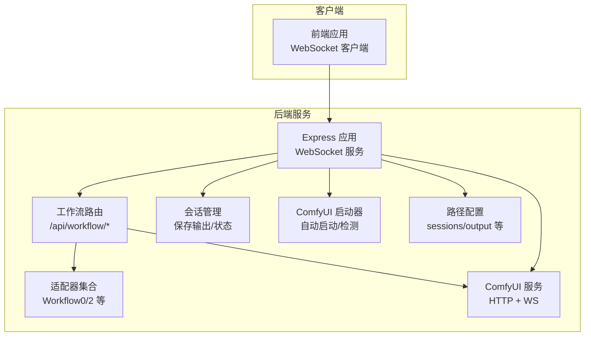
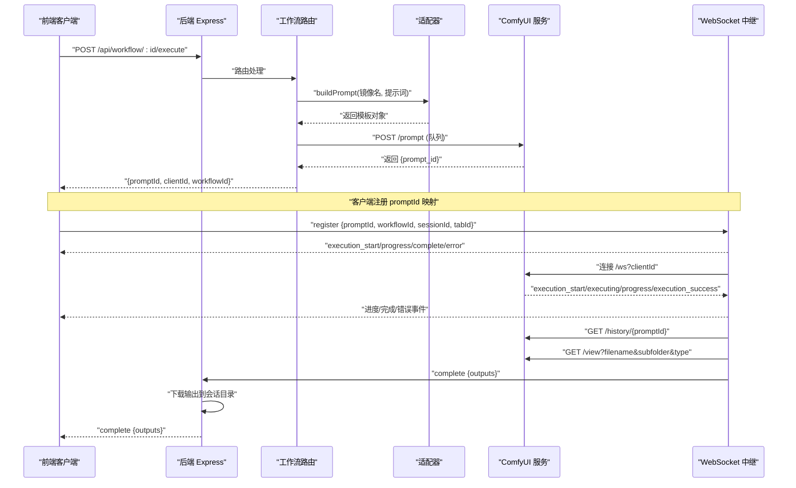
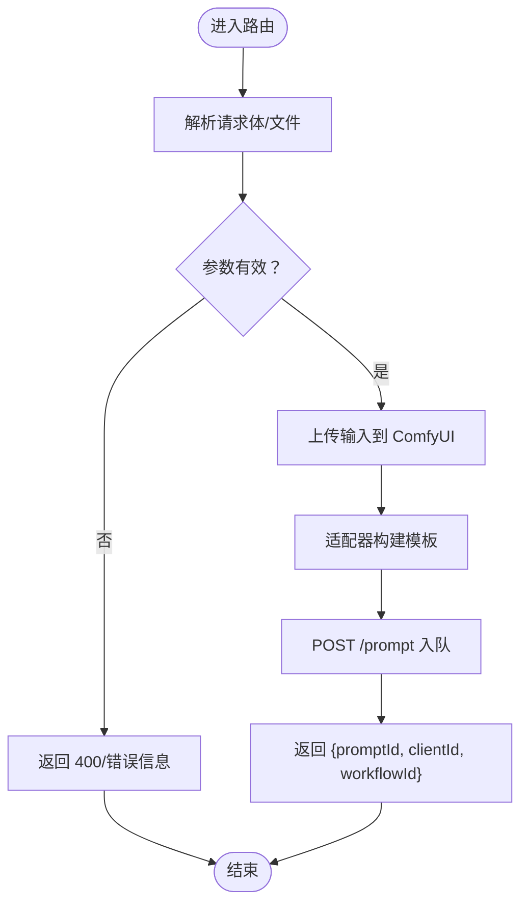
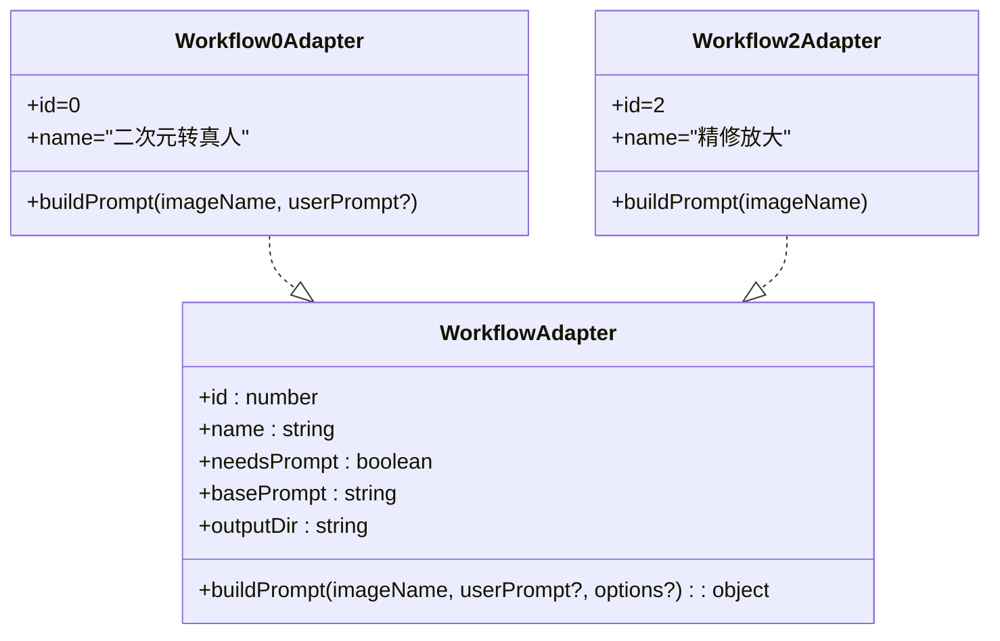
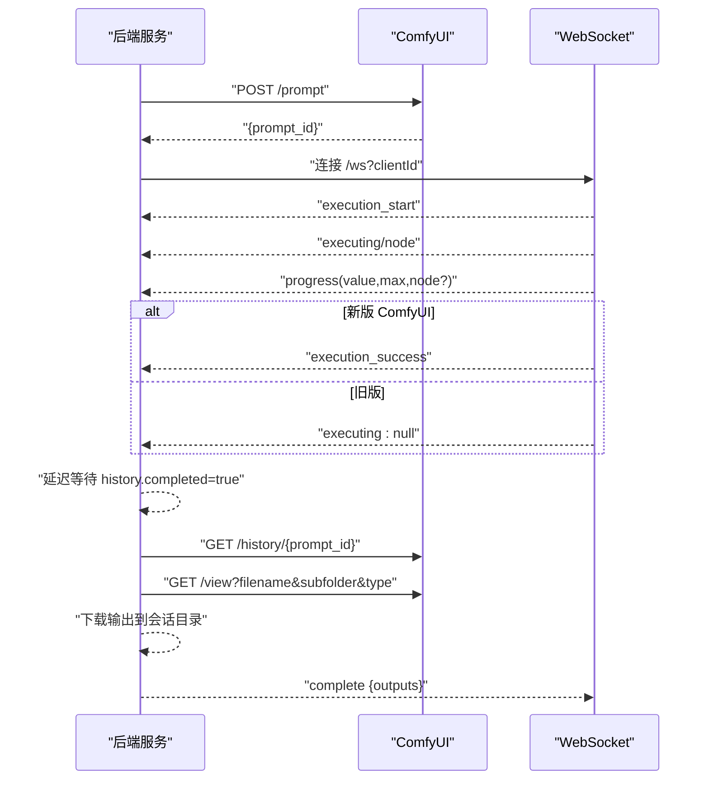
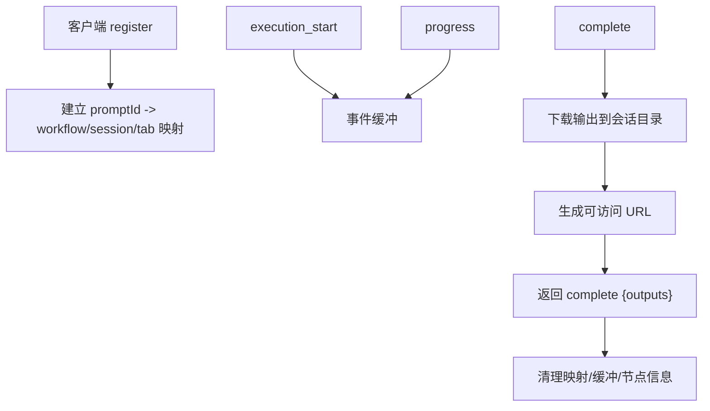
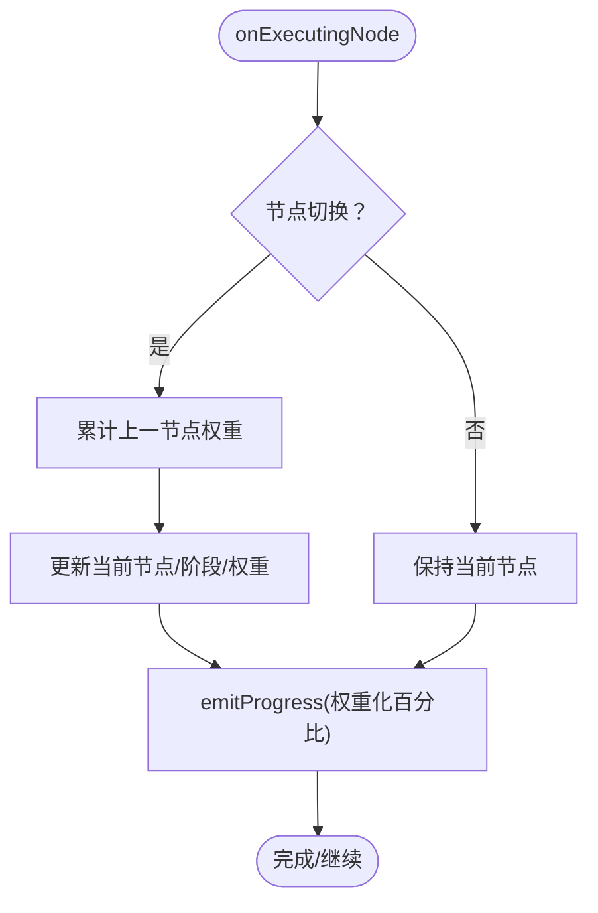
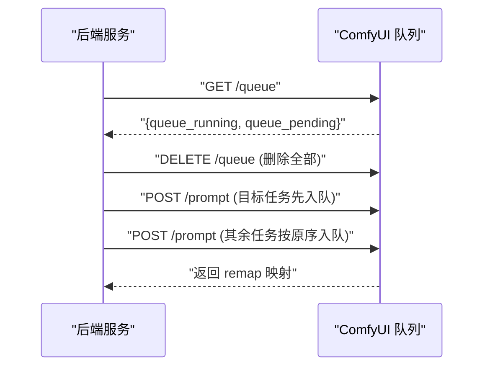
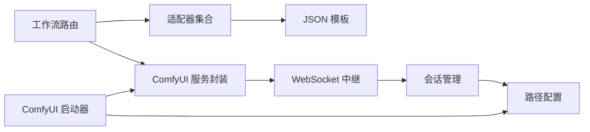

# 工作流执行流程

<cite>
**本文引用的文件**
- [server/src/index.ts](file://server/src/index.ts)
- [server/src/services/comfyui.ts](file://server/src/services/comfyui.ts)
- [server/src/routes/workflow.ts](file://server/src/routes/workflow.ts)
- [server/src/services/sessionManager.ts](file://server/src/services/sessionManager.ts)
- [server/src/services/comfyuiLauncher.ts](file://server/src/services/comfyuiLauncher.ts)
- [server/src/adapters/index.ts](file://server/src/adapters/index.ts)
- [server/src/adapters/Workflow0Adapter.ts](file://server/src/adapters/Workflow0Adapter.ts)
- [server/src/adapters/Workflow2Adapter.ts](file://server/src/adapters/Workflow2Adapter.ts)
- [server/src/types/index.ts](file://server/src/types/index.ts)
- [server/src/config/paths.ts](file://server/src/config/paths.ts)
- [README.md](file://README.md)
</cite>

## 目录
1. [简介](#简介)
2. [项目结构](#项目结构)
3. [核心组件](#核心组件)
4. [架构总览](#架构总览)
5. [详细组件分析](#详细组件分析)
6. [依赖关系分析](#依赖关系分析)
7. [性能考量](#性能考量)
8. [故障排查指南](#故障排查指南)
9. [结论](#结论)
10. [附录](#附录)

## 简介
本技术文档围绕“AI 工作流执行流程”展开，系统性阐述从用户请求到最终结果返回的完整链路，包括请求接收、参数验证、模板加载、ComfyUI 调用、结果处理与下载、状态管理与进度报告、错误处理、异步执行与并发控制、监控与调试等。文档同时给出可视化图示，帮助读者快速把握整体架构与关键流程。

## 项目结构
后端采用 Express + TypeScript，核心模块如下：
- 服务层：与 ComfyUI 的 HTTP/WebSocket 交互、ComfyUI 启动器、会话管理、路径配置
- 路由层：工作流路由，负责解析请求、拼装模板、调用队列接口
- 适配器层：每个工作流一个适配器，负责加载模板并注入输入参数
- 类型定义：统一事件与数据结构
- 前端：React/Vite，通过 WebSocket 实时接收进度与结果

图表来源
- [server/src/index.ts:118-146](file://server/src/index.ts#L118-L146)
- [server/src/routes/workflow.ts:152-161](file://server/src/routes/workflow.ts#L152-L161)
- [server/src/services/comfyui.ts:168-196](file://server/src/services/comfyui.ts#L168-L196)
- [server/src/services/comfyuiLauncher.ts:101-130](file://server/src/services/comfyuiLauncher.ts#L101-L130)
- [server/src/services/sessionManager.ts:37-48](file://server/src/services/sessionManager.ts#L37-L48)
- [server/src/config/paths.ts:74-100](file://server/src/config/paths.ts#L74-L100)

章节来源
- [README.md:41-79](file://README.md#L41-L79)
- [server/src/index.ts:118-146](file://server/src/index.ts#L118-L146)

## 核心组件
- Express 应用与 WebSocket 服务：统一处理 HTTP 请求与 WebSocket 事件，维护全局进度状态与事件缓冲，连接 ComfyUI 并转发进度/完成/错误事件。
- 工作流路由：根据工作流 ID 选择适配器，加载模板，注入参数，调用队列接口，返回 promptId。
- 适配器：每个工作流一个适配器，负责加载对应 JSON 模板并注入输入（如图像名、提示词、种子等）。
- ComfyUI 服务封装：提供上传、队列、历史、视图、系统统计、队列优先级调整等接口；WebSocket 事件中继与去重。
- 会话管理：将 ComfyUI 输出下载到会话目录，生成可访问 URL，持久化会话状态。
- ComfyUI 启动器：检测服务状态，必要时自动启动并等待就绪。
- 路径配置：集中管理 sessions/output/model_meta 等目录，支持运行时切换。

章节来源
- [server/src/index.ts:157-494](file://server/src/index.ts#L157-L494)
- [server/src/routes/workflow.ts:152-800](file://server/src/routes/workflow.ts#L152-L800)
- [server/src/services/comfyui.ts:168-472](file://server/src/services/comfyui.ts#L168-L472)
- [server/src/services/sessionManager.ts:37-133](file://server/src/services/sessionManager.ts#L37-L133)
- [server/src/services/comfyuiLauncher.ts:101-130](file://server/src/services/comfyuiLauncher.ts#L101-L130)
- [server/src/config/paths.ts:74-100](file://server/src/config/paths.ts#L74-L100)

## 架构总览
下面以序列图展示一次典型工作流执行的端到端流程。

图表来源
- [server/src/routes/workflow.ts:750-799](file://server/src/routes/workflow.ts#L750-L799)
- [server/src/services/comfyui.ts:168-196](file://server/src/services/comfyui.ts#L168-L196)
- [server/src/index.ts:273-464](file://server/src/index.ts#L273-L464)
- [server/src/services/comfyui.ts:198-207](file://server/src/services/comfyui.ts#L198-L207)
- [server/src/services/comfyui.ts:209-219](file://server/src/services/comfyui.ts#L209-L219)

## 详细组件分析

### 组件 A：请求接收与参数验证
- HTTP 路由：根据工作流 ID 选择适配器，解析请求体/文件，进行基础参数校验（如 clientId、文件存在性）。
- 文件上传：使用 multer 支持多文件上传（如解除装备、区域编辑、换脸等）。
- 参数映射：将用户输入映射到模板节点，如提示词、尺寸、采样器、种子等。
- 友好错误：将 ComfyUI 的错误信息映射为中文提示，提升用户体验。

图表来源
- [server/src/routes/workflow.ts:163-215](file://server/src/routes/workflow.ts#L163-L215)
- [server/src/routes/workflow.ts:217-267](file://server/src/routes/workflow.ts#L217-L267)
- [server/src/routes/workflow.ts:269-405](file://server/src/routes/workflow.ts#L269-L405)
- [server/src/routes/workflow.ts:595-642](file://server/src/routes/workflow.ts#L595-L642)
- [server/src/routes/workflow.ts:644-748](file://server/src/routes/workflow.ts#L644-L748)
- [server/src/routes/workflow.ts:750-799](file://server/src/routes/workflow.ts#L750-L799)

章节来源
- [server/src/routes/workflow.ts:163-215](file://server/src/routes/workflow.ts#L163-L215)
- [server/src/routes/workflow.ts:217-267](file://server/src/routes/workflow.ts#L217-L267)
- [server/src/routes/workflow.ts:269-405](file://server/src/routes/workflow.ts#L269-L405)
- [server/src/routes/workflow.ts:595-642](file://server/src/routes/workflow.ts#L595-L642)
- [server/src/routes/workflow.ts:644-748](file://server/src/routes/workflow.ts#L644-L748)
- [server/src/routes/workflow.ts:750-799](file://server/src/routes/workflow.ts#L750-L799)

### 组件 B：模板加载与参数注入
- 适配器模式：每个工作流一个适配器，负责加载 JSON 模板并注入输入参数（如图像名、提示词、种子、采样器、LoRA 等）。
- 通用适配器：通用路由支持任意工作流 ID，通过适配器集合选择对应适配器。
- 特定工作流：如二次元转真人、精修放大等，有专门路由处理特殊参数与模板。

图表来源
- [server/src/types/index.ts:1-8](file://server/src/types/index.ts#L1-L8)
- [server/src/adapters/Workflow0Adapter.ts:9-34](file://server/src/adapters/Workflow0Adapter.ts#L9-L34)
- [server/src/adapters/Workflow2Adapter.ts:9-27](file://server/src/adapters/Workflow2Adapter.ts#L9-L27)

章节来源
- [server/src/adapters/index.ts:14-30](file://server/src/adapters/index.ts#L14-L30)
- [server/src/adapters/Workflow0Adapter.ts:9-34](file://server/src/adapters/Workflow0Adapter.ts#L9-L34)
- [server/src/adapters/Workflow2Adapter.ts:9-27](file://server/src/adapters/Workflow2Adapter.ts#L9-L27)

### 组件 C：ComfyUI 调用与队列管理
- 队列接口：POST /prompt 入队，返回 prompt_id；支持删除队列项、获取队列、优先级调整。
- 上传接口：上传图片/视频到 ComfyUI，返回文件名。
- 历史与视图：获取历史状态与输出文件二进制。
- WebSocket 中继：监听 progress/executing 等事件，去重与顺序保证，优先使用 execution_success，回退到 executing:null 的延迟策略。
- 系统统计：获取 VRAM/内存使用情况。

图表来源
- [server/src/services/comfyui.ts:168-196](file://server/src/services/comfyui.ts#L168-L196)
- [server/src/services/comfyui.ts:228-237](file://server/src/services/comfyui.ts#L228-L237)
- [server/src/services/comfyui.ts:389-408](file://server/src/services/comfyui.ts#L389-L408)
- [server/src/services/comfyui.ts:442-471](file://server/src/services/comfyui.ts#L442-L471)
- [server/src/services/comfyui.ts:265-375](file://server/src/services/comfyui.ts#L265-L375)
- [server/src/services/comfyui.ts:198-207](file://server/src/services/comfyui.ts#L198-L207)
- [server/src/services/comfyui.ts:209-219](file://server/src/services/comfyui.ts#L209-L219)

章节来源
- [server/src/services/comfyui.ts:168-196](file://server/src/services/comfyui.ts#L168-L196)
- [server/src/services/comfyui.ts:228-237](file://server/src/services/comfyui.ts#L228-L237)
- [server/src/services/comfyui.ts:389-408](file://server/src/services/comfyui.ts#L389-L408)
- [server/src/services/comfyui.ts:442-471](file://server/src/services/comfyui.ts#L442-L471)
- [server/src/services/comfyui.ts:265-375](file://server/src/services/comfyui.ts#L265-L375)
- [server/src/services/comfyui.ts:198-207](file://server/src/services/comfyui.ts#L198-L207)
- [server/src/services/comfyui.ts:209-219](file://server/src/services/comfyui.ts#L209-L219)

### 组件 D：结果处理与会话存储
- 注册映射：客户端在连接后发送 register，后端建立 promptId -> workflow/session/tab 的映射。
- 下载输出：完成事件触发后，从 ComfyUI 视图接口下载输出文件，保存到会话 output 目录，生成可访问 URL。
- 事件缓冲：若客户端在执行开始前连接，会重放已发生的 execution_start/progress 事件。
- 清理：完成后清理映射、事件缓冲、节点信息。

图表来源
- [server/src/index.ts:470-488](file://server/src/index.ts#L470-L488)
- [server/src/index.ts:335-448](file://server/src/index.ts#L335-L448)
- [server/src/services/sessionManager.ts:37-48](file://server/src/services/sessionManager.ts#L37-L48)

章节来源
- [server/src/index.ts:470-488](file://server/src/index.ts#L470-L488)
- [server/src/index.ts:335-448](file://server/src/index.ts#L335-L448)
- [server/src/services/sessionManager.ts:37-48](file://server/src/services/sessionManager.ts#L37-L48)

### 组件 E：状态管理与进度报告
- 全局进度：基于节点权重的加权进度，支持多轮节点（如 tiled 采样）与缓存跳过节点。
- 阶段名称：根据节点 class_type 映射为中文阶段名，或回退到节点标题。
- 事件去重：同一 prompt 仅触发一次 execution_start，避免重复上报。
- 完成信号：优先使用 execution_success，若无则在 executing:null 后延时触发，解决历史未落盘问题。

图表来源
- [server/src/index.ts:289-333](file://server/src/index.ts#L289-L333)
- [server/src/index.ts:240-271](file://server/src/index.ts#L240-L271)
- [server/src/services/comfyui.ts:325-354](file://server/src/services/comfyui.ts#L325-L354)

章节来源
- [server/src/index.ts:289-333](file://server/src/index.ts#L289-L333)
- [server/src/index.ts:240-271](file://server/src/index.ts#L240-L271)
- [server/src/services/comfyui.ts:325-354](file://server/src/services/comfyui.ts#L325-L354)

### 组件 F：异步执行与并发控制
- 异步队列：ComfyUI 本身维护队列（running/pending），后端通过 /queue 查询与优先级调整。
- 并发策略：后端为每个客户端维持一个 WebSocket 连接，避免重复连接；客户端侧也通过单例 Hook 确保唯一连接。
- 资源分配：通过系统统计接口监控 VRAM/内存，辅助决策并发与优先级。
- 优先级调整：支持将目标任务重新入队至队首，减少等待时间。

图表来源
- [server/src/services/comfyui.ts:389-408](file://server/src/services/comfyui.ts#L389-L408)
- [server/src/services/comfyui.ts:442-471](file://server/src/services/comfyui.ts#L442-L471)

章节来源
- [server/src/services/comfyui.ts:389-408](file://server/src/services/comfyui.ts#L389-L408)
- [server/src/services/comfyui.ts:442-471](file://server/src/services/comfyui.ts#L442-L471)

### 组件 G：错误处理与恢复机制
- 友好错误：将 ComfyUI 的 value_not_in_list 等错误映射为中文提示。
- 完成前重试：完成事件触发后，对 /history 进行多次重试，确保历史已落盘。
- 异常降级：若历史未完成，仍返回现有数据并告警，避免“完成但空”的体验。
- 连接容错：WebSocket 错误捕获与清理，确保资源回收。

章节来源
- [server/src/routes/workflow.ts:126-150](file://server/src/routes/workflow.ts#L126-L150)
- [server/src/index.ts:350-371](file://server/src/index.ts#L350-L371)
- [server/src/services/comfyui.ts:370-372](file://server/src/services/comfyui.ts#L370-L372)

## 依赖关系分析
- 路由依赖适配器：工作流路由通过适配器集合选择适配器，构建模板。
- 适配器依赖模板：适配器加载 JSON 模板并注入参数。
- 服务依赖 ComfyUI：所有 HTTP/WS 调用均通过服务封装。
- 会话管理依赖路径配置：会话目录与输出目录由路径配置统一管理。
- 启动器依赖路径配置：ComfyUI 启动路径来自环境变量或默认路径。

图表来源
- [server/src/routes/workflow.ts:152-161](file://server/src/routes/workflow.ts#L152-L161)
- [server/src/adapters/index.ts:14-30](file://server/src/adapters/index.ts#L14-L30)
- [server/src/services/comfyui.ts:168-196](file://server/src/services/comfyui.ts#L168-L196)
- [server/src/services/sessionManager.ts:37-48](file://server/src/services/sessionManager.ts#L37-L48)
- [server/src/config/paths.ts:74-100](file://server/src/config/paths.ts#L74-L100)
- [server/src/services/comfyuiLauncher.ts:101-130](file://server/src/services/comfyuiLauncher.ts#L101-L130)

章节来源
- [server/src/routes/workflow.ts:152-161](file://server/src/routes/workflow.ts#L152-L161)
- [server/src/adapters/index.ts:14-30](file://server/src/adapters/index.ts#L14-L30)
- [server/src/services/comfyui.ts:168-196](file://server/src/services/comfyui.ts#L168-L196)
- [server/src/services/sessionManager.ts:37-48](file://server/src/services/sessionManager.ts#L37-L48)
- [server/src/config/paths.ts:74-100](file://server/src/config/paths.ts#L74-L100)
- [server/src/services/comfyuiLauncher.ts:101-130](file://server/src/services/comfyuiLauncher.ts#L101-L130)

## 性能考量
- 节点权重与进度：基于节点类型与输入（如采样步数）计算权重，使进度条更贴合实际耗时。
- 多轮节点处理：对 tiled 采样等多轮节点使用 tick 计数，避免 max 重置导致的回退。
- 历史落盘延迟：在 executing:null 后短暂等待 execution_success，确保历史写盘完成，避免“完成但空”。
- 系统统计：定期查询 VRAM/内存，辅助限流与优先级策略。
- I/O 优化：输出下载与保存合并为一次操作，减少网络往返与磁盘写入次数。

章节来源
- [server/src/services/comfyui.ts:58-144](file://server/src/services/comfyui.ts#L58-L144)
- [server/src/services/comfyui.ts:126-142](file://server/src/services/comfyui.ts#L126-L142)
- [server/src/index.ts:335-371](file://server/src/index.ts#L335-L371)
- [server/src/services/comfyui.ts:244-263](file://server/src/services/comfyui.ts#L244-L263)

## 故障排查指南
- ComfyUI 未运行：后端启动时尝试自动启动并等待，若超时需手动启动。
- 队列提交失败：检查 ComfyUI 是否正常，查看错误映射提示。
- 输出为空：确认 history.completed=true，必要时增加重试等待。
- WebSocket 连接异常：检查连接状态与事件缓冲，确保客户端及时注册。
- 路径权限问题：确保 sessions/output 目录可写，必要时切换到绝对路径。

章节来源
- [server/src/services/comfyuiLauncher.ts:101-130](file://server/src/services/comfyuiLauncher.ts#L101-L130)
- [server/src/routes/workflow.ts:126-150](file://server/src/routes/workflow.ts#L126-L150)
- [server/src/index.ts:350-371](file://server/src/index.ts#L350-L371)
- [server/src/services/comfyui.ts:370-372](file://server/src/services/comfyui.ts#L370-L372)
- [server/src/config/paths.ts:106-137](file://server/src/config/paths.ts#L106-L137)

## 结论
本系统通过适配器模式将不同工作流模板化，结合后端 WebSocket 中继与会话管理，实现了从请求到结果的全链路闭环。进度权重化与多轮节点处理提升了用户体验，完成事件的延迟策略与历史重试保障了结果完整性。路径配置与启动器提供了灵活部署与运维能力。建议在生产环境中结合系统统计与队列优先级策略，进一步优化并发与资源利用。

## 附录
- 关键接口与事件
  - HTTP
    - POST /api/workflow/:id/execute：提交工作流
    - GET /api/workflow/models/*：查询模型列表
    - GET /api/comfyui/status：查询 ComfyUI 状态
  - WebSocket
    - type: execution_start/executing/progress/execution_success/execution_error
    - type: complete/error（后端向客户端）

章节来源
- [server/src/routes/workflow.ts:152-161](file://server/src/routes/workflow.ts#L152-L161)
- [server/src/routes/workflow.ts:407-435](file://server/src/routes/workflow.ts#L407-L435)
- [server/src/index.ts:147-155](file://server/src/index.ts#L147-L155)
- [server/src/types/index.ts:10-30](file://server/src/types/index.ts#L10-L30)