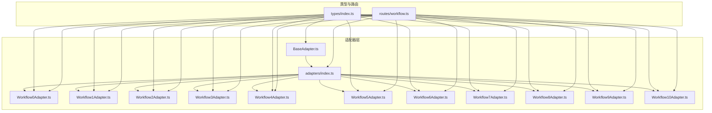
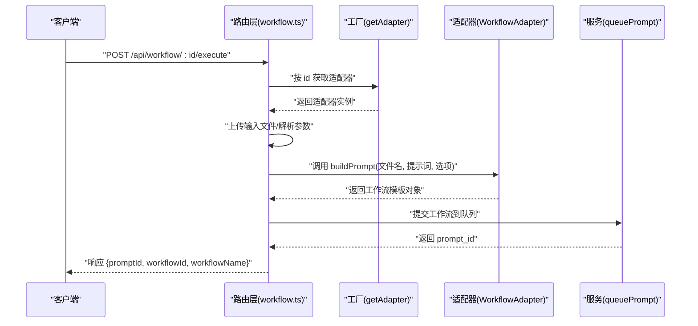
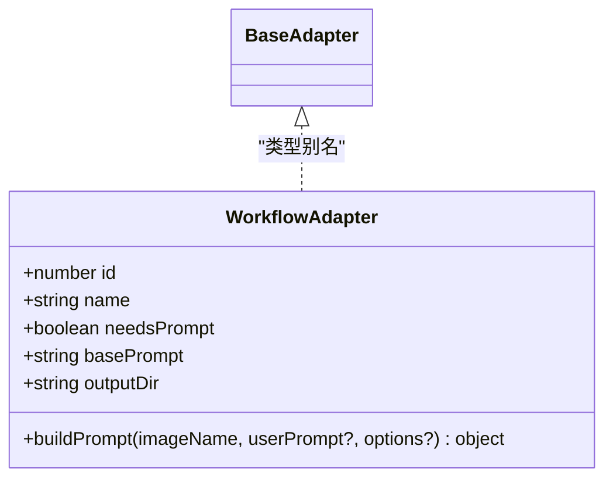
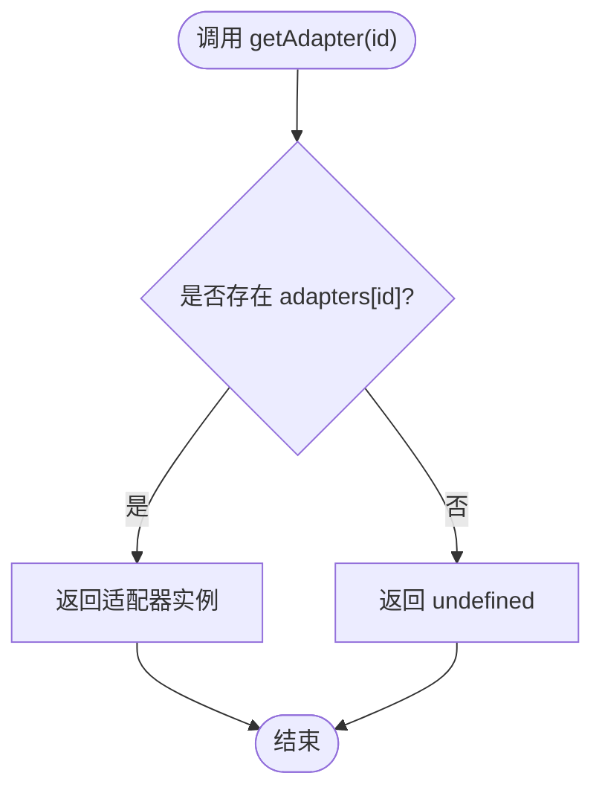
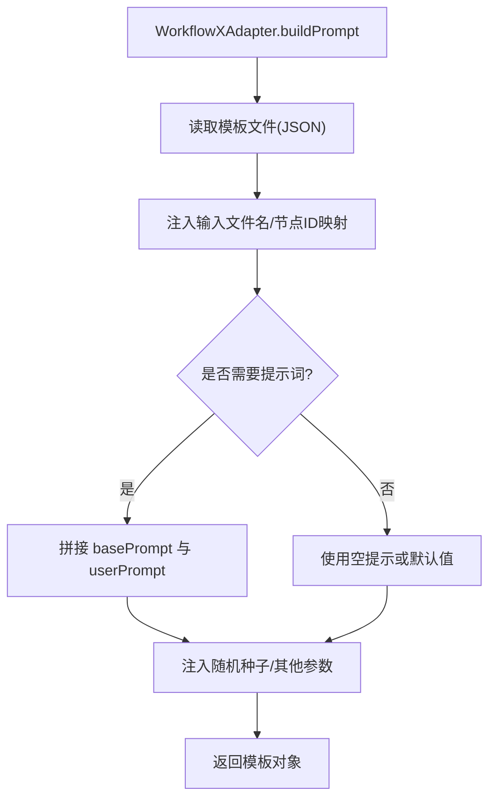
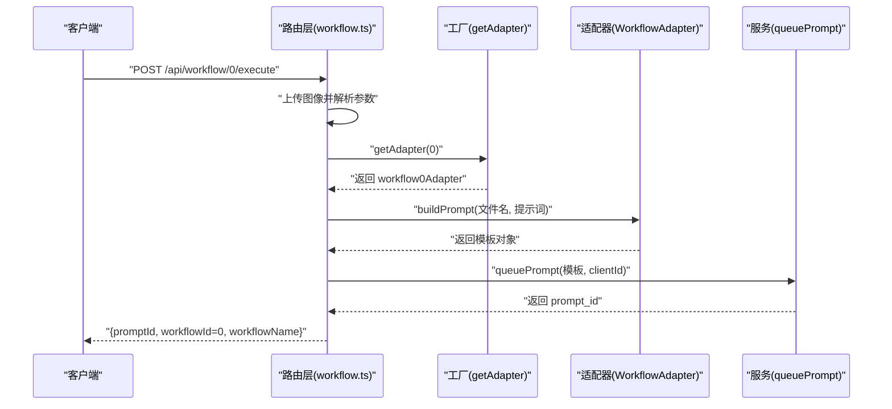
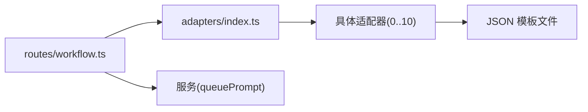

# 工作流适配器模式

<cite>
**本文引用的文件**
- [server/src/adapters/BaseAdapter.ts](file://server/src/adapters/BaseAdapter.ts)
- [server/src/adapters/index.ts](file://server/src/adapters/index.ts)
- [server/src/times/index.ts](file://server/src/types/index.ts)
- [server/src/adapters/Workflow0Adapter.ts](file://server/src/adapters/Workflow0Adapter.ts)
- [server/src/adapters/Workflow1Adapter.ts](file://server/src/adapters/Workflow1Adapter.ts)
- [server/src/adapters/Workflow2Adapter.ts](file://server/src/adapters/Workflow2Adapter.ts)
- [server/src/adapters/Workflow3Adapter.ts](file://server/src/adapters/Workflow3Adapter.ts)
- [server/src/adapters/Workflow4Adapter.ts](file://server/src/adapters/Workflow4Adapter.ts)
- [server/src/adapters/Workflow5Adapter.ts](file://server/src/adapters/Workflow5Adapter.ts)
- [server/src/adapters/Workflow6Adapter.ts](file://server/src/adapters/Workflow6Adapter.ts)
- [server/src/adapters/Workflow7Adapter.ts](file://server/src/adapters/Workflow7Adapter.ts)
- [server/src/adapters/Workflow8Adapter.ts](file://server/src/adapters/Workflow8Adapter.ts)
- [server/src/adapters/Workflow9Adapter.ts](file://server/src/adapters/Workflow9Adapter.ts)
- [server/src/adapters/Workflow10Adapter.ts](file://server/src/adapters/Workflow10Adapter.ts)
- [server/src/routes/workflow.ts](file://server/src/routes/workflow.ts)
</cite>

## 目录
1. [引言](#引言)
2. [项目结构](#项目结构)
3. [核心组件](#核心组件)
4. [架构总览](#架构总览)
5. [详细组件分析](#详细组件分析)
6. [依赖关系分析](#依赖关系分析)
7. [性能考量](#性能考量)
8. [故障排查指南](#故障排查指南)
9. [结论](#结论)
10. [附录：适配器开发指南](#附录适配器开发指南)

## 引言
本文件系统性阐述本项目中“工作流适配器模式”的设计思想与实现方式，重点围绕以下目标展开：
- 统一工作流执行接口与差异化实现解耦
- 参数标准化、错误处理与生命周期管理
- 适配器注册机制与工厂模式应用
- 动态扩展与热插拔能力
- 新适配器开发步骤、接口实现要求与最佳实践

该系统通过 WorkflowAdapter 抽象接口定义统一契约，结合适配器集合与路由层的动态分发，实现了对多种 AI 工作流的统一接入与灵活扩展。

## 项目结构
本项目的服务端位于 server/src，适配器相关代码集中在 adapters 目录，类型定义位于 types 目录，路由层位于 routes 目录。关键文件如下：
- 适配器基类与导出：BaseAdapter.ts、adapters/index.ts
- 类型定义：types/index.ts
- 具体适配器实现：Workflow0Adapter.ts 至 Workflow10Adapter.ts
- 工作流路由入口：routes/workflow.ts

图表来源
- [server/src/adapters/BaseAdapter.ts:1-4](file://server/src/adapters/BaseAdapter.ts#L1-L4)
- [server/src/adapters/index.ts:1-33](file://server/src/adapters/index.ts#L1-L33)
- [server/src/times/index.ts:1-52](file://server/src/types/index.ts#L1-L52)
- [server/src/adapters/Workflow0Adapter.ts:1-35](file://server/src/adapters/Workflow0Adapter.ts#L1-L35)
- [server/src/adapters/Workflow1Adapter.ts:1-36](file://server/src/adapters/Workflow1Adapter.ts#L1-L36)
- [server/src/adapters/Workflow2Adapter.ts:1-28](file://server/src/adapters/Workflow2Adapter.ts#L1-L28)
- [server/src/adapters/Workflow3Adapter.ts:1-41](file://server/src/adapters/Workflow3Adapter.ts#L1-L41)
- [server/src/adapters/Workflow4Adapter.ts:1-28](file://server/src/adapters/Workflow4Adapter.ts#L1-L28)
- [server/src/adapters/Workflow5Adapter.ts:1-15](file://server/src/adapters/Workflow5Adapter.ts#L1-L15)
- [server/src/adapters/Workflow6Adapter.ts:1-36](file://server/src/adapters/Workflow6Adapter.ts#L1-L36)
- [server/src/adapters/Workflow7Adapter.ts:1-14](file://server/src/adapters/Workflow7Adapter.ts#L1-L14)
- [server/src/adapters/Workflow8Adapter.ts:1-14](file://server/src/adapters/Workflow8Adapter.ts#L1-L14)
- [server/src/adapters/Workflow9Adapter.ts:1-14](file://server/src/adapters/Workflow9Adapter.ts#L1-L14)
- [server/src/adapters/Workflow10Adapter.ts:1-15](file://server/src/adapters/Workflow10Adapter.ts#L1-L15)
- [server/src/routes/workflow.ts:1-800](file://server/src/routes/workflow.ts#L1-L800)

章节来源
- [server/src/adapters/BaseAdapter.ts:1-4](file://server/src/adapters/BaseAdapter.ts#L1-L4)
- [server/src/adapters/index.ts:1-33](file://server/src/adapters/index.ts#L1-L33)
- [server/src/times/index.ts:1-52](file://server/src/types/index.ts#L1-L52)
- [server/src/routes/workflow.ts:1-800](file://server/src/routes/workflow.ts#L1-L800)

## 核心组件
- WorkflowAdapter 抽象接口：定义工作流统一契约，包含标识、名称、提示词需求、基础提示词、输出目录与构建提示模板的方法。
- BaseAdapter：当前仅导出 WorkflowAdapter 类型别名，便于集中管理类型依赖。
- 适配器集合与工厂：adapters/index.ts 提供适配器字典与按 id 获取适配器的工厂函数。
- 路由层：routes/workflow.ts 依据请求参数动态选择适配器或专用路由，完成文件上传、参数注入与队列提交。

章节来源
- [server/src/times/index.ts:1-52](file://server/src/types/index.ts#L1-L52)
- [server/src/adapters/BaseAdapter.ts:1-4](file://server/src/adapters/BaseAdapter.ts#L1-L4)
- [server/src/adapters/index.ts:14-33](file://server/src/adapters/index.ts#L14-L33)
- [server/src/routes/workflow.ts:750-799](file://server/src/routes/workflow.ts#L750-L799)

## 架构总览
适配器模式在此系统中的作用是：
- 将“工作流执行”抽象为统一接口，屏蔽不同工作流模板的差异
- 通过适配器集合与工厂函数实现动态分发
- 在路由层根据请求动态选择适配器或专用处理逻辑
- 统一错误映射与用户反馈

图表来源
- [server/src/routes/workflow.ts:750-799](file://server/src/routes/workflow.ts#L750-L799)
- [server/src/adapters/index.ts:28-30](file://server/src/adapters/index.ts#L28-L30)
- [server/src/times/index.ts:1-8](file://server/src/types/index.ts#L1-L8)

## 详细组件分析

### 抽象接口与基类
- WorkflowAdapter 接口定义了：
  - 基本属性：id、name、needsPrompt、basePrompt、outputDir
  - 关键方法：buildPrompt(imageName, userPrompt?, options?) -> object
- BaseAdapter.ts 当前仅导出类型别名，确保类型一致性与集中管理。

图表来源
- [server/src/times/index.ts:1-8](file://server/src/types/index.ts#L1-L8)
- [server/src/adapters/BaseAdapter.ts:1-4](file://server/src/adapters/BaseAdapter.ts#L1-L4)

章节来源
- [server/src/times/index.ts:1-8](file://server/src/types/index.ts#L1-L8)
- [server/src/adapters/BaseAdapter.ts:1-4](file://server/src/adapters/BaseAdapter.ts#L1-L4)

### 适配器集合与工厂
- adapters/index.ts 导出适配器字典与工厂函数：
  - adapters: Record<number, WorkflowAdapter>，按 id 映射到具体适配器
  - getAdapter(id): 返回对应适配器或 undefined
- 该设计使新增适配器只需在 index.ts 中注册即可被路由层发现。

图表来源
- [server/src/adapters/index.ts:14-30](file://server/src/adapters/index.ts#L14-L30)

章节来源
- [server/src/adapters/index.ts:14-33](file://server/src/adapters/index.ts#L14-L33)

### 典型适配器实现模式
- Workflow0Adapter 至 Workflow4Adapter：均基于 JSON 模板文件，通过 buildPrompt 注入输入文件名、提示词与随机种子等参数。
- Workflow3Adapter：支持 options 参数（如秒数、帧率、分辨率），体现参数标准化与差异化配置。
- Workflow5Adapter 至 Workflow10Adapter：部分工作流采用专用路由而非通用路由，其 buildPrompt 方法抛出异常以强制走专用路径，体现“差异化实现”。

图表来源
- [server/src/adapters/Workflow0Adapter.ts:16-33](file://server/src/adapters/Workflow0Adapter.ts#L16-L33)
- [server/src/adapters/Workflow3Adapter.ts:16-39](file://server/src/adapters/Workflow3Adapter.ts#L16-L39)
- [server/src/adapters/Workflow5Adapter.ts:11-13](file://server/src/adapters/Workflow5Adapter.ts#L11-L13)
- [server/src/adapters/Workflow10Adapter.ts:11-13](file://server/src/adapters/Workflow10Adapter.ts#L11-L13)

章节来源
- [server/src/adapters/Workflow0Adapter.ts:1-35](file://server/src/adapters/Workflow0Adapter.ts#L1-L35)
- [server/src/adapters/Workflow1Adapter.ts:1-36](file://server/src/adapters/Workflow1Adapter.ts#L1-L36)
- [server/src/adapters/Workflow2Adapter.ts:1-28](file://server/src/adapters/Workflow2Adapter.ts#L1-L28)
- [server/src/adapters/Workflow3Adapter.ts:1-41](file://server/src/adapters/Workflow3Adapter.ts#L1-L41)
- [server/src/adapters/Workflow4Adapter.ts:1-28](file://server/src/adapters/Workflow4Adapter.ts#L1-L28)
- [server/src/adapters/Workflow5Adapter.ts:1-15](file://server/src/adapters/Workflow5Adapter.ts#L1-L15)
- [server/src/adapters/Workflow6Adapter.ts:1-36](file://server/src/adapters/Workflow6Adapter.ts#L1-L36)
- [server/src/adapters/Workflow7Adapter.ts:1-14](file://server/src/adapters/Workflow7Adapter.ts#L1-L14)
- [server/src/adapters/Workflow8Adapter.ts:1-14](file://server/src/adapters/Workflow8Adapter.ts#L1-L14)
- [server/src/adapters/Workflow9Adapter.ts:1-14](file://server/src/adapters/Workflow9Adapter.ts#L1-L14)
- [server/src/adapters/Workflow10Adapter.ts:1-15](file://server/src/adapters/Workflow10Adapter.ts#L1-L15)

### 路由层与适配器协作
- 通用执行路由：/api/workflow/:id/execute
  - 通过 getAdapter(id) 获取适配器
  - 上传输入文件（图像或视频）
  - 调用适配器的 buildPrompt 构建模板
  - 提交队列并返回结果
- 专用路由：针对特殊工作流（如 5、7、8、9、10）采用独立处理逻辑，体现差异化实现与参数定制。

图表来源
- [server/src/routes/workflow.ts:644-687](file://server/src/routes/workflow.ts#L644-L687)
- [server/src/adapters/index.ts:28-30](file://server/src/adapters/index.ts#L28-L30)
- [server/src/adapters/Workflow0Adapter.ts:16-33](file://server/src/adapters/Workflow0Adapter.ts#L16-L33)

章节来源
- [server/src/routes/workflow.ts:750-799](file://server/src/routes/workflow.ts#L750-L799)
- [server/src/routes/workflow.ts:644-687](file://server/src/routes/workflow.ts#L644-L687)
- [server/src/routes/workflow.ts:163-215](file://server/src/routes/workflow.ts#L163-L215)
- [server/src/routes/workflow.ts:217-267](file://server/src/routes/workflow.ts#L217-L267)
- [server/src/routes/workflow.ts:269-405](file://server/src/routes/workflow.ts#L269-L405)
- [server/src/routes/workflow.ts:485-593](file://server/src/routes/workflow.ts#L485-L593)
- [server/src/routes/workflow.ts:595-642](file://server/src/routes/workflow.ts#L595-L642)

## 依赖关系分析
- 低耦合高内聚：适配器仅依赖模板文件与 WorkflowAdapter 接口；路由层通过工厂函数解耦具体实现。
- 可扩展性：新增适配器只需实现接口并在 index.ts 注册，无需修改路由层。
- 循环依赖风险：当前结构无循环导入迹象；建议新增适配器时避免反向依赖模板文件。

图表来源
- [server/src/routes/workflow.ts:1-800](file://server/src/routes/workflow.ts#L1-L800)
- [server/src/adapters/index.ts:1-33](file://server/src/adapters/index.ts#L1-L33)

章节来源
- [server/src/routes/workflow.ts:1-800](file://server/src/routes/workflow.ts#L1-L800)
- [server/src/adapters/index.ts:1-33](file://server/src/adapters/index.ts#L1-L33)

## 性能考量
- 模板读取缓存：当前每次执行均读取 JSON 模板文件，建议在高频场景下引入文件内容缓存，减少 IO 开销。
- 并发与队列：路由层直接调用队列服务，建议在适配器层增加轻量级参数校验与预处理，降低无效请求对队列的压力。
- 随机种子：适配器中使用随机种子提升多样性，注意在需要可复现场景下提供固定种子参数。

## 故障排查指南
- 通用错误映射：路由层提供 toFriendlyComfyError 函数，将底层错误映射为用户可理解的提示，有助于快速定位问题（如模型缺失、队列提交失败等）。
- 适配器未注册：若 getAdapter 返回 undefined，路由会返回“未知工作流”错误；请检查 adapters/index.ts 的注册表。
- 专用路由误用：部分工作流（5、7、8、9、10）需走专用路由；若调用通用路由，适配器的 buildPrompt 可能抛出异常，应切换到对应专用端点。

章节来源
- [server/src/routes/workflow.ts:126-150](file://server/src/routes/workflow.ts#L126-L150)
- [server/src/routes/workflow.ts:754-759](file://server/src/routes/workflow.ts#L754-L759)
- [server/src/adapters/Workflow5Adapter.ts:11-13](file://server/src/adapters/Workflow5Adapter.ts#L11-L13)
- [server/src/adapters/Workflow7Adapter.ts:10-12](file://server/src/adapters/Workflow7Adapter.ts#L10-L12)
- [server/src/adapters/Workflow8Adapter.ts:10-12](file://server/src/adapters/Workflow8Adapter.ts#L10-L12)
- [server/src/adapters/Workflow9Adapter.ts:10-12](file://server/src/adapters/Workflow9Adapter.ts#L10-L12)
- [server/src/adapters/Workflow10Adapter.ts:11-13](file://server/src/adapters/Workflow10Adapter.ts#L11-L13)

## 结论
本项目通过 WorkflowAdapter 抽象接口与适配器集合，成功实现了工作流执行的统一接口与差异化实现解耦。配合路由层的动态分发与专用路由策略，系统具备良好的扩展性与可维护性。建议在后续迭代中引入模板缓存、参数校验前置与更细粒度的生命周期钩子，以进一步提升性能与可观测性。

## 附录：适配器开发指南
- 创建步骤
  - 在 adapters 目录新建适配器文件，实现 WorkflowAdapter 接口的所有成员
  - 在 adapters/index.ts 中注册适配器（id -> 实例）
  - 如需专用路由，新增对应路由处理逻辑；否则复用通用执行路由
- 接口实现要求
  - id 唯一且连续，便于路由层按 id 分发
  - needsPrompt 与 basePrompt 决定提示词注入策略
  - buildPrompt 应严格遵循模板节点映射，注入输入文件名、提示词、随机种子等
  - 对于需要外部参数的工作流，通过 options 参数进行标准化传递
- 最佳实践
  - 模板文件与适配器分离，便于维护与版本控制
  - 在适配器中进行最小必要参数校验，避免无效请求进入队列
  - 使用随机种子提升多样性，必要时提供固定种子选项
  - 对于复杂工作流，优先考虑专用路由以简化参数与流程控制
  - 错误处理：在适配器内部捕获并转换为可读信息，或交由路由层统一映射

章节来源
- [server/src/times/index.ts:1-8](file://server/src/types/index.ts#L1-L8)
- [server/src/adapters/index.ts:14-33](file://server/src/adapters/index.ts#L14-L33)
- [server/src/adapters/Workflow3Adapter.ts:16-39](file://server/src/adapters/Workflow3Adapter.ts#L16-L39)
- [server/src/routes/workflow.ts:750-799](file://server/src/routes/workflow.ts#L750-L799)