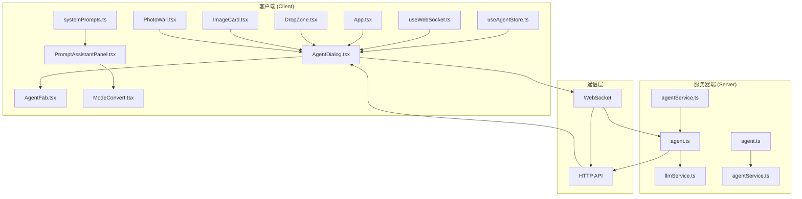
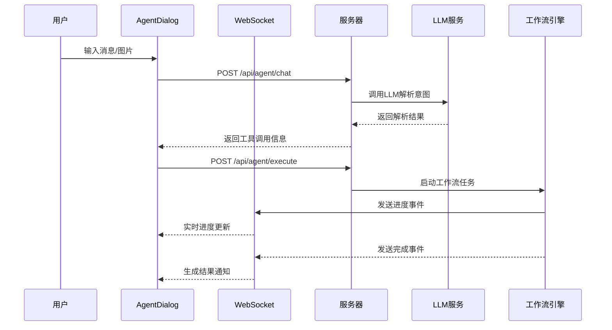
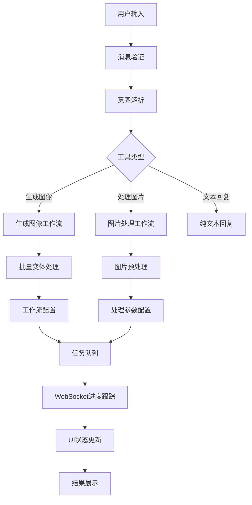
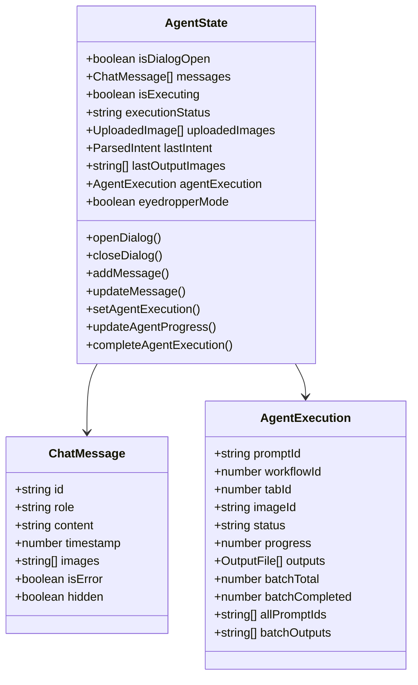
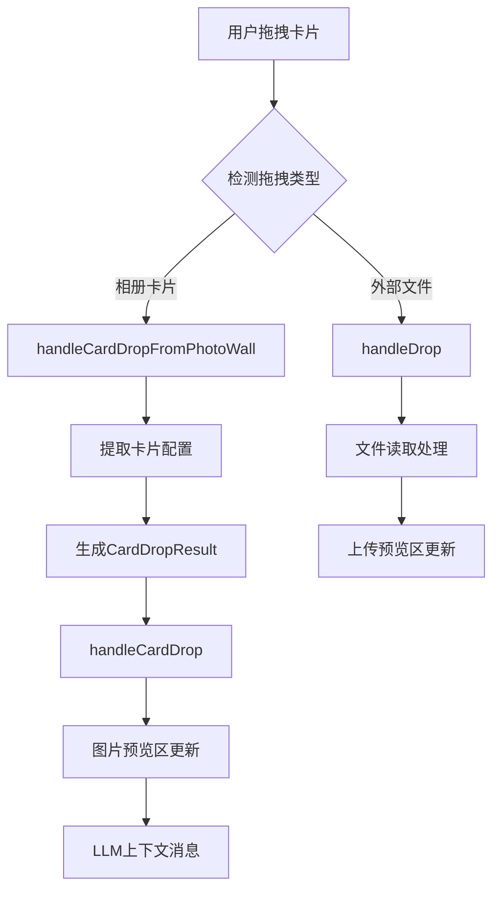
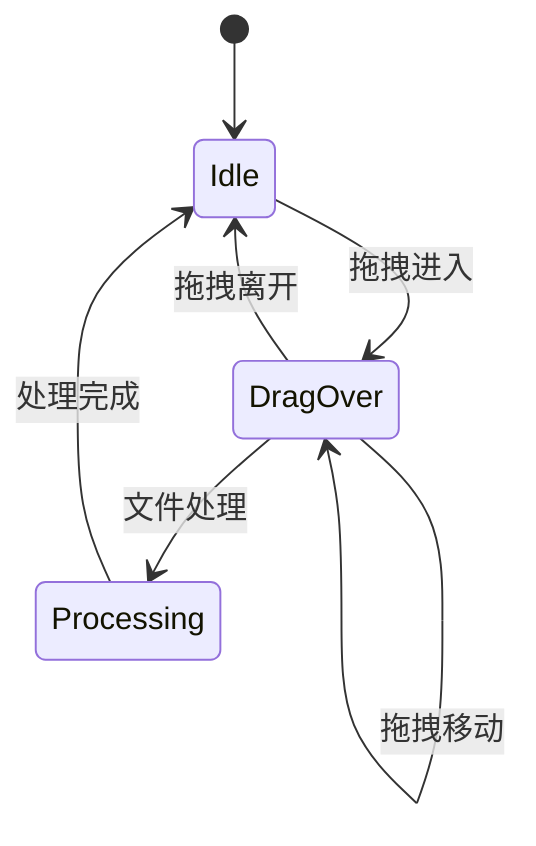
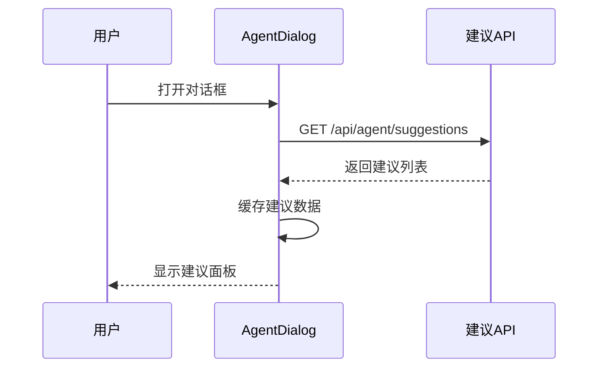
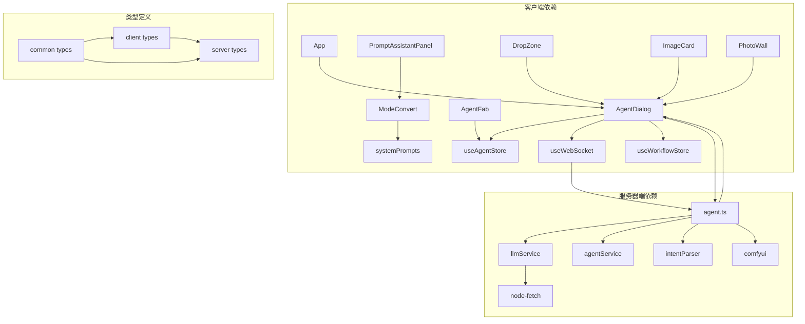

# AI对话界面组件

<cite>
**本文档引用的文件**
- [AgentDialog.tsx](file://client/src/components/AgentDialog.tsx)
- [AgentFab.tsx](file://client/src/components/AgentFab.tsx)
- [useAgentStore.ts](file://client/src/hooks/useAgentStore.ts)
- [useWebSocket.ts](file://client/src/hooks/useWebSocket.ts)
- [DropZone.tsx](file://client/src/components/DropZone.tsx)
- [ImageCard.tsx](file://client/src/components/ImageCard.tsx)
- [PhotoWall.tsx](file://client/src/components/PhotoWall.tsx)
- [agent.ts](file://server/src/routes/agent.ts)
- [llmService.ts](file://server/src/services/llmService.ts)
- [agentService.ts](file://server/src/services/agentService.ts)
- [App.tsx](file://client/src/components/App.tsx)
- [PromptAssistantPanel.tsx](file://client/src/components/PromptAssistantPanel.tsx)
- [ModeConvert.tsx](file://client/src/components/prompt-assistant/ModeConvert.tsx)
- [systemPrompts.ts](file://client/src/components/prompt-assistant/systemPrompts.ts)
- [index.ts](file://client/src/types/index.ts)
- [index.ts](file://server/src/types/index.ts)
</cite>

## 更新摘要
**所做更改**
- 新增卡片拖拽功能章节，详细介绍AgentDialog的拖拽上传和卡片拖拽功能
- 更新批量模式处理能力说明，增加CardDropResult类型的详细描述
- 增强暖启动建议功能分析，说明建议生成和缓存机制
- 补充拖拽上传体验改进说明，包括视觉反馈和文件处理优化

## 目录
1. [简介](#简介)
2. [项目结构](#项目结构)
3. [核心组件](#核心组件)
4. [架构概览](#架构概览)
5. [详细组件分析](#详细组件分析)
6. [拖拽功能实现](#拖拽功能实现)
7. [依赖关系分析](#依赖关系分析)
8. [性能考虑](#性能考虑)
9. [故障排除指南](#故障排除指南)
10. [结论](#结论)

## 简介

AI对话界面组件是Pix2Real项目中的智能助手系统，提供了一个集成的AI对话界面，支持自然语言到图像生成的智能解析、批量变体生成、图片处理等功能。该组件通过WebSocket实现实时通信，结合LLM服务实现智能意图解析，为用户提供直观的AI图像生成体验。

**更新** 新增卡片拖拽功能、改进拖拽上传体验、优化暖启动建议、增强批量模式处理能力

## 项目结构

该项目采用前后端分离的架构设计，主要分为客户端界面组件和服务器端AI服务两个部分：



**图表来源**
- [AgentDialog.tsx:1-800](file://client/src/components/AgentDialog.tsx#L1-L800)
- [agent.ts:1-1032](file://server/src/routes/agent.ts#L1-L1032)

**章节来源**
- [AgentDialog.tsx:1-800](file://client/src/components/AgentDialog.tsx#L1-L800)
- [App.tsx:58-408](file://client/src/components/App.tsx#L58-L408)

## 核心组件

### Agent对话组件

Agent对话组件是整个AI助手系统的核心，提供了完整的对话交互界面和工作流管理功能。

**主要特性：**
- 实时对话界面，支持文本和图片输入
- 智能意图解析，自动识别生成需求
- 批量变体生成支持
- 实时进度跟踪和状态管理
- 与工作流系统的深度集成
- **新增** 卡片拖拽功能，支持从相册拖拽图片到对话框
- **新增** 改进的拖拽上传体验，提供视觉反馈和文件处理优化

**状态管理：**
组件使用Zustand状态管理库，维护以下关键状态：
- 对话消息历史
- 执行状态和进度
- 上传的图片资源
- 最近的意图解析结果
- **新增** CardDropResult类型支持，用于卡片拖拽结果处理

**章节来源**
- [AgentDialog.tsx:1-800](file://client/src/components/AgentDialog.tsx#L1-L800)
- [useAgentStore.ts:1-287](file://client/src/hooks/useAgentStore.ts#L1-L287)

### Agent浮动按钮

Agent浮动按钮提供了便捷的入口点，用户可以通过点击按钮快速打开AI对话界面。

**设计特点：**
- 圆形悬浮设计，符合现代UI标准
- 动画效果，提供良好的用户体验
- 自适应位置调整，避免遮挡其他界面元素

**章节来源**
- [AgentFab.tsx:1-47](file://client/src/components/AgentFab.tsx#L1-L47)

### WebSocket通信层

WebSocket通信层实现了客户端与服务器之间的实时双向通信，支持进度更新、状态同步等功能。

**核心功能：**
- 连接管理与自动重连
- 消息路由和分发
- 进度事件处理
- 错误处理和恢复机制

**章节来源**
- [useWebSocket.ts:1-225](file://client/src/hooks/useWebSocket.ts#L1-L225)

## 架构概览

系统采用分层架构设计，清晰分离了表现层、业务逻辑层和数据访问层：



**图表来源**
- [agent.ts:492-602](file://server/src/routes/agent.ts#L492-L602)
- [useWebSocket.ts:28-177](file://client/src/hooks/useWebSocket.ts#L28-L177)

**章节来源**
- [agent.ts:1-1032](file://server/src/routes/agent.ts#L1-L1032)
- [llmService.ts:1-387](file://server/src/services/llmService.ts#L1-L387)

## 详细组件分析

### Agent对话组件详细分析

Agent对话组件是整个系统的核心，实现了完整的AI对话流程：

#### 数据流分析



**图表来源**
- [AgentDialog.tsx:577-670](file://client/src/components/AgentDialog.tsx#L577-L670)
- [agent.ts:633-800](file://server/src/routes/agent.ts#L633-L800)

#### 批量变体处理机制

系统支持批量变体生成，通过以下机制实现：

1. **变体配置解析**：从LLM响应中提取变体配置
2. **独立任务创建**：为每个变体创建独立的工作流任务
3. **进度同步**：实时跟踪每个变体的生成进度
4. **结果聚合**：将所有变体结果合并展示
5. **新增** CardDropResult类型支持，增强卡片拖拽处理能力

**章节来源**
- [AgentDialog.tsx:352-406](file://client/src/components/AgentDialog.tsx#L352-L406)
- [agent.ts:794-800](file://server/src/routes/agent.ts#L794-L800)

### LLM服务集成

LLM服务集成了Grok AI API，提供了强大的自然语言理解和意图解析能力：

#### 工具定义

系统定义了三种核心工具：

1. **generate_image**：用于图像生成
2. **process_image**：用于图片处理
3. **text_response**：用于纯文本回复

#### 系统提示词构建

系统提示词包含了丰富的上下文信息，包括：
- 用户偏好画像
- 可用模型列表
- LoRA模型信息
- 工作流指导原则

**章节来源**
- [llmService.ts:113-223](file://server/src/services/llmService.ts#L113-L223)
- [llmService.ts:227-387](file://server/src/services/llmService.ts#L227-L387)

### 状态管理系统

状态管理系统采用Zustand实现，提供了高效的状态管理解决方案：

#### 核心状态结构



**图表来源**
- [useAgentStore.ts:72-154](file://client/src/hooks/useAgentStore.ts#L72-L154)

**章节来源**
- [useAgentStore.ts:1-287](file://client/src/hooks/useAgentStore.ts#L1-L287)

### 提示词助手组件

提示词助手组件提供了多种提示词处理模式：

#### 模式类型

| 模式 | 功能 | 描述 |
|------|------|------|
| 标签转换 | 自然语言 ↔ 标签 | 支持双向转换，保持语义一致性 |
| 创建变体 | 提示词变体生成 | 基于标记的变体创建 |
| 按需扩写 | 细节扩展 | 根据标记级别扩展细节 |
| 脑补后续 | 故事延续 | 基于当前场景的后续设计 |
| 分镜生成 | 剧本分镜 | 完整的视觉故事板生成 |
| 标签合成器 | 标签组合 | 自动标签合成和优化

**章节来源**
- [PromptAssistantPanel.tsx:1-139](file://client/src/components/PromptAssistantPanel.tsx#L1-L139)
- [ModeConvert.tsx:1-195](file://client/src/components/prompt-assistant/ModeConvert.tsx#L1-L195)

## 拖拽功能实现

### 卡片拖拽功能

AgentDialog组件新增了强大的卡片拖拽功能，允许用户直接从相册拖拽图片到对话框中进行处理。

#### 卡片拖拽实现机制



**图表来源**
- [AgentDialog.tsx:820-830](file://client/src/components/AgentDialog.tsx#L820-L830)
- [AgentDialog.tsx:696-730](file://client/src/components/AgentDialog.tsx#L696-L730)

#### CardDropResult类型支持

useAgentStore新增了CardDropResult类型，用于描述卡片拖拽的结果：

```typescript
export interface CardDropResult {
  type: 'text2img' | 'img2img';
  tabId: number;
  imageId: string;
  // text2img 时
  config?: {
    prompt: string;
    model?: string;
    loras?: Array<{ model: string; strength: number }>;
    width?: number;
    height?: number;
  };
  // img2img 时
  imageUrl?: string;
}
```

**新增功能特性：**
- 支持text2img和img2img两种拖拽类型
- 自动提取卡片配置信息
- 处理图片URL和文件数据
- 维护拖拽源的tabId和imageId

**章节来源**
- [useAgentStore.ts:56-70](file://client/src/hooks/useAgentStore.ts#L56-L70)
- [AgentDialog.tsx:696-796](file://client/src/components/AgentDialog.tsx#L696-L796)

### 拖拽上传体验改进

AgentDialog组件改进了拖拽上传体验，提供了更好的视觉反馈和文件处理机制。

#### 拖拽状态管理



**新增功能：**
- 实时拖拽状态指示（边框高亮）
- 拖拽区域视觉反馈
- 文件类型验证和过滤
- 多文件同时处理支持

**章节来源**
- [AgentDialog.tsx:25-36](file://client/src/components/AgentDialog.tsx#L25-L36)
- [AgentDialog.tsx:815-841](file://client/src/components/AgentDialog.tsx#L815-L841)

### 暖启动建议优化

AgentDialog组件优化了暖启动建议功能，提供了更智能的建议生成和缓存机制。

#### 建议生成流程



**新增优化：**
- 建议数据缓存机制
- 建议刷新功能
- 加载状态指示
- 建议复用策略

**章节来源**
- [AgentDialog.tsx:195-214](file://client/src/components/AgentDialog.tsx#L195-L214)
- [AgentDialog.tsx:682-694](file://client/src/components/AgentDialog.tsx#L682-L694)

## 依赖关系分析

系统各组件之间的依赖关系清晰明确：



**图表来源**
- [App.tsx:24-27](file://client/src/components/App.tsx#L24-L27)
- [agent.ts:1-14](file://server/src/routes/agent.ts#L1-L14)

**章节来源**
- [index.ts:1-58](file://client/src/types/index.ts#L1-L58)
- [index.ts:1-52](file://server/src/types/index.ts#L1-L52)

## 性能考虑

### WebSocket连接优化

系统实现了智能的WebSocket连接管理：
- 连接池复用，避免重复建立连接
- 自动重连机制，确保连接稳定性
- 连接计数管理，防止内存泄漏

### 状态更新优化

- 局部状态更新，减少不必要的重渲染
- 批量操作合并，提高响应效率
- 缓存策略，避免重复计算

### 图像处理优化

- 图片预加载机制
- 渐进式显示策略
- 内存管理优化

### 拖拽功能性能优化

- **新增** 拖拽状态缓存，避免重复计算
- **新增** 文件处理异步化，防止UI阻塞
- **新增** 拖拽区域命中测试优化
- **新增** 卡片拖拽数据预处理

## 故障排除指南

### 常见问题及解决方案

#### WebSocket连接失败

**症状：** 无法接收实时进度更新
**解决方案：**
1. 检查网络连接状态
2. 验证服务器端WebSocket服务运行状态
3. 查看浏览器开发者工具中的网络面板

#### LLM调用超时

**症状：** 意图解析长时间无响应
**解决方案：**
1. 检查API密钥配置
2. 验证网络连接
3. 查看服务器端日志

#### 图像生成失败

**症状：** 生成任务卡在某个进度阶段
**解决方案：**
1. 检查工作流模板配置
2. 验证模型文件完整性
3. 查看ComfyUI服务状态

#### 拖拽功能异常

**症状：** 卡片拖拽无效或拖拽上传失败
**解决方案：**
1. 检查浏览器拖拽API支持
2. 验证文件类型和大小限制
3. 查看控制台错误信息
4. 确认相册卡片数据完整性

**章节来源**
- [useWebSocket.ts:179-191](file://client/src/hooks/useWebSocket.ts#L179-L191)
- [agent.ts:598-602](file://server/src/routes/agent.ts#L598-L602)

## 结论

AI对话界面组件通过精心设计的架构和实现，为用户提供了强大而直观的AI图像生成体验。系统的主要优势包括：

1. **完整的对话体验**：从意图解析到结果展示的一站式服务
2. **实时交互**：通过WebSocket实现真正的实时进度反馈
3. **智能工作流**：支持复杂的批量变体生成和图片处理
4. **可扩展性**：模块化的架构设计便于功能扩展
5. **用户体验**：简洁直观的界面设计和流畅的操作体验
6. **新增** **强大的拖拽功能**：支持卡片拖拽和改进的拖拽上传体验
7. **新增** **智能建议系统**：优化的暖启动建议和缓存机制
8. **新增** **增强的批量处理**：CardDropResult类型支持和批量模式优化

**更新** 本次更新显著增强了AgentDialog组件的功能性和用户体验，特别是新增的卡片拖拽功能和改进的拖拽上传体验，为用户提供了更加直观和高效的AI图像生成工作流程。

该组件为Pix2Real项目奠定了坚实的AI助手基础，为未来的功能扩展和技术升级提供了良好的平台支撑。