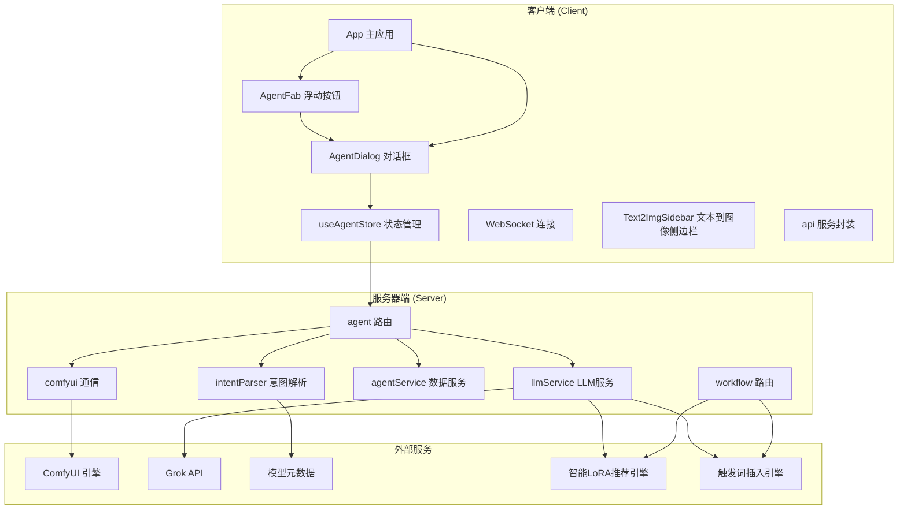
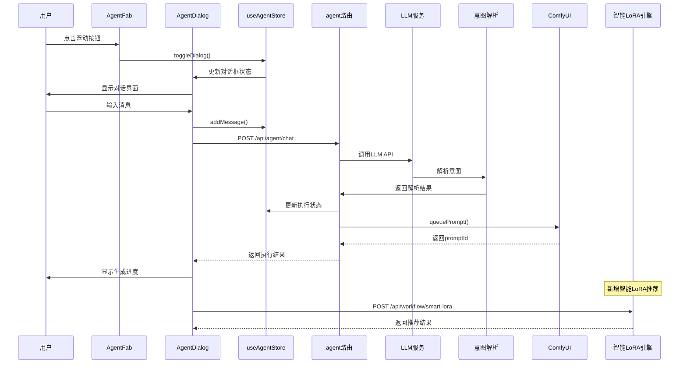
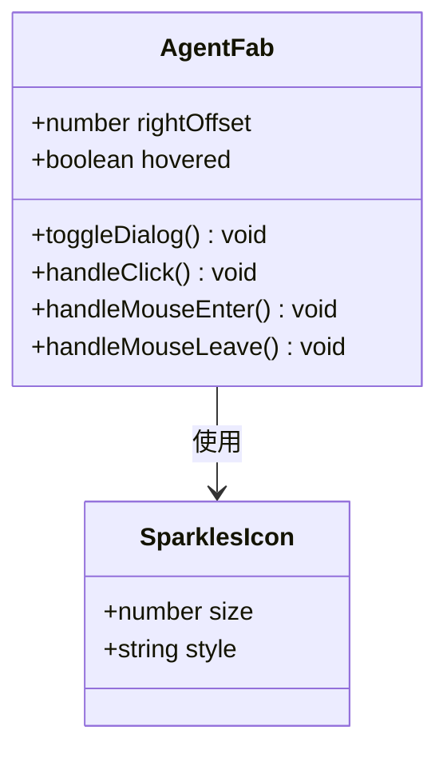
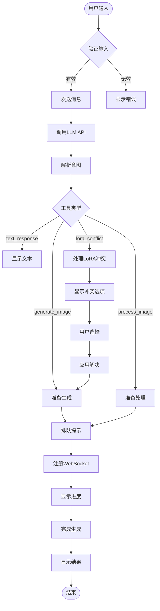
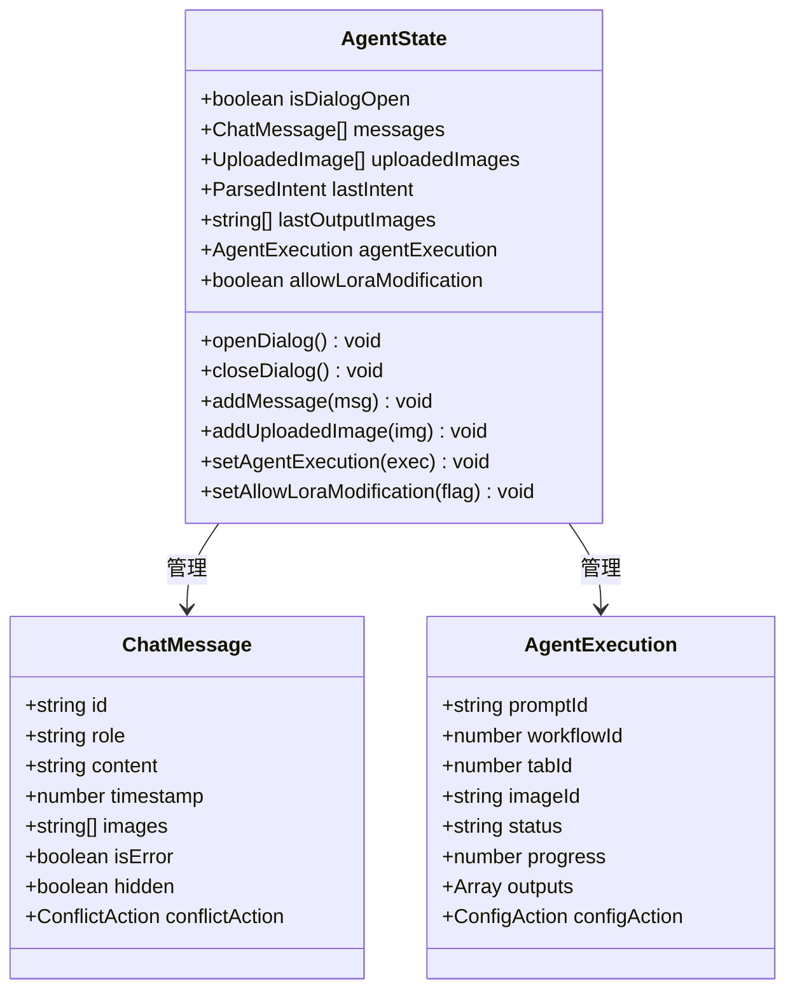
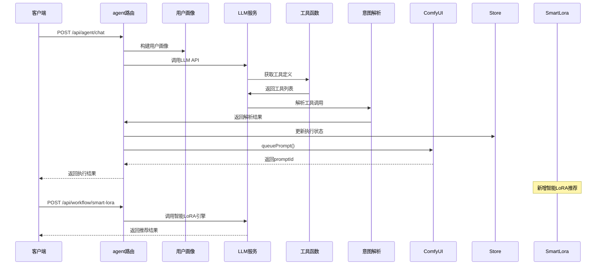
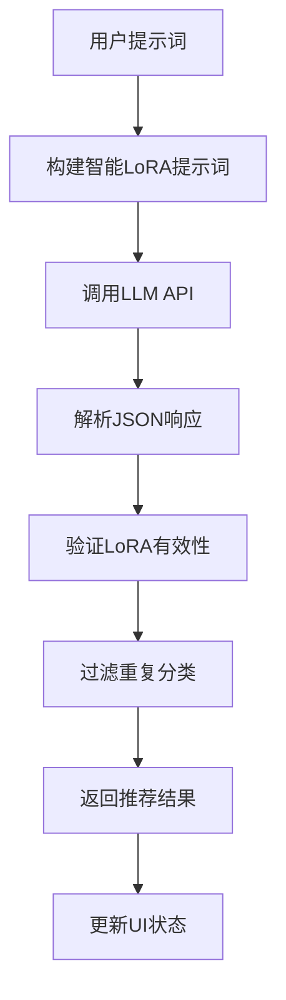
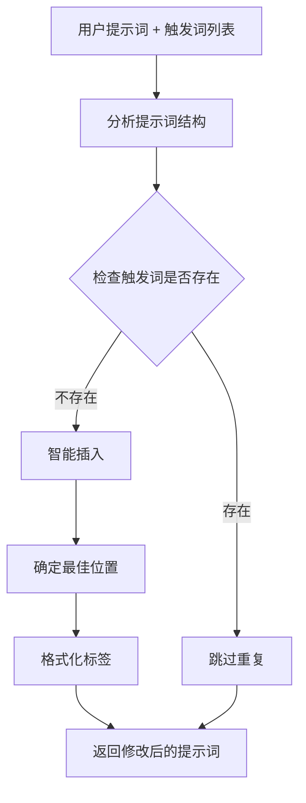
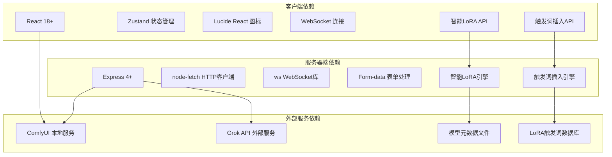

# AI浮动按钮组件

<cite>
**本文档引用的文件**
- [AgentFab.tsx](file://client/src/components/AgentFab.tsx)
- [AgentDialog.tsx](file://client/src/components/AgentDialog.tsx)
- [useAgentStore.ts](file://client/src/hooks/useAgentStore.ts)
- [App.tsx](file://client/src/components/App.tsx)
- [agent.ts](file://server/src/routes/agent.ts)
- [llmService.ts](file://server/src/services/llmService.ts)
- [intentParser.ts](file://server/src/services/intentParser.ts)
- [agentService.ts](file://server/src/services/agentService.ts)
- [comfyui.ts](file://server/src/services/comfyui.ts)
- [workflow.ts](file://server/src/routes/workflow.ts)
- [Text2ImgSidebar.tsx](file://client/src/components/Text2ImgSidebar.tsx)
- [api.ts](file://client/src/services/api.ts)
- [index.ts](file://client/src/types/index.ts)
- [README.md](file://README.md)
- [package.json](file://package.json)
</cite>

## 更新摘要
**变更内容**
- 新增智能LoRA推荐系统功能
- 新增触发词智能插入功能
- 增强AI浮动按钮的LoRA冲突检测能力
- 更新服务器端智能LoRA推荐API实现

## 目录
1. [简介](#简介)
2. [项目结构](#项目结构)
3. [核心组件](#核心组件)
4. [架构概览](#架构概览)
5. [详细组件分析](#详细组件分析)
6. [智能LoRA推荐系统](#智能lora推荐系统)
7. [触发词智能插入功能](#触发词智能插入功能)
8. [依赖关系分析](#依赖关系分析)
9. [性能考虑](#性能考虑)
10. [故障排除指南](#故障排除指南)
11. [结论](#结论)

## 简介

AI浮动按钮组件是CorineKit Pix2Real项目中的核心交互组件，提供了一个智能的AI助手界面，允许用户通过自然语言与系统进行交互，实现图片生成、处理和管理等功能。该组件采用浮动操作按钮(Floating Action Button)的设计模式，为用户提供便捷的AI助手入口。

该项目基于React + TypeScript前端框架和Express + TypeScript后端服务，集成了ComfyUI作为图像生成引擎，提供了完整的本地Web UI解决方案。**最新版本增强了智能LoRA推荐系统和触发词插入功能，为用户提供更智能化的LoRA使用体验。**

## 项目结构

项目采用前后端分离的架构设计，主要分为以下几个核心模块：

**图表来源**
- [AgentFab.tsx:1-47](file://client/src/components/AgentFab.tsx#L1-L47)
- [AgentDialog.tsx:1-1223](file://client/src/components/AgentDialog.tsx#L1-L1223)
- [agent.ts:1-927](file://server/src/routes/agent.ts#L1-L927)
- [workflow.ts:1250-1415](file://server/src/routes/workflow.ts#L1250-L1415)

**章节来源**
- [README.md:41-79](file://README.md#L41-L79)
- [package.json:1-15](file://package.json#L1-L15)

## 核心组件

AI浮动按钮组件由多个相互协作的组件构成，每个组件都有明确的职责分工：

### 浮动按钮组件 (AgentFab)

浮动按钮是用户与AI助手交互的主要入口点，具有以下特性：
- 圆形设计，使用品牌色彩
- 悬停效果增强用户体验
- 动态旋转动画表示对话框状态
- 绝对定位，固定在页面右下角

### 对话框组件 (AgentDialog)

对话框提供了完整的AI助手交互界面：
- 实时消息显示和滚动
- 输入区域支持文本和图片
- 建议功能提供智能提示
- 进度指示器显示生成状态
- 导航功能跳转到生成结果
- **新增LoRA冲突检测和处理**
- **新增智能LoRA推荐集成**

### 状态管理 (useAgentStore)

使用Zustand状态管理库实现：
- 对话状态管理
- 消息历史存储
- 上传图片管理
- 生成任务状态
- 收藏功能
- **LoRA配置状态管理**

### 文本到图像侧边栏 (Text2ImgSidebar)

**新增** 侧边栏集成了智能LoRA推荐和触发词插入功能：
- 智能LoRA推荐按钮
- 触发词智能插入功能
- LoRA权重自动管理
- 提示词触发词自动补全

**章节来源**
- [AgentFab.tsx:1-47](file://client/src/components/AgentFab.tsx#L1-L47)
- [AgentDialog.tsx:1-1223](file://client/src/components/AgentDialog.tsx#L1-L1223)
- [useAgentStore.ts:1-226](file://client/src/hooks/useAgentStore.ts#L1-L226)
- [Text2ImgSidebar.tsx:140-339](file://client/src/components/Text2ImgSidebar.tsx#L140-L339)

## 架构概览

AI浮动按钮组件采用分层架构设计，确保各层职责清晰分离：

**图表来源**
- [AgentDialog.tsx:461-531](file://client/src/components/AgentDialog.tsx#L461-L531)
- [agent.ts:492-602](file://server/src/routes/agent.ts#L492-L602)
- [workflow.ts:1250-1271](file://server/src/routes/workflow.ts#L1250-L1271)

## 详细组件分析

### AgentFab 组件分析

AgentFab组件实现了浮动按钮的核心功能：

**图表来源**
- [AgentFab.tsx:5-47](file://client/src/components/AgentFab.tsx#L5-L47)

组件特点：
- 使用Lucide React图标库的Sparkles图标
- 动态阴影和缩放效果
- 根据对话框状态旋转图标
- 支持右侧偏移量调整位置

**章节来源**
- [AgentFab.tsx:1-47](file://client/src/components/AgentFab.tsx#L1-L47)

### AgentDialog 组件分析

AgentDialog组件提供了完整的AI助手交互界面：

**图表来源**
- [AgentDialog.tsx:162-393](file://client/src/components/AgentDialog.tsx#L162-L393)
- [agent.ts:719-736](file://server/src/routes/agent.ts#L719-L736)

组件功能：
- 实时消息显示和滚动
- 图片上传和预览
- 建议功能生成
- 进度跟踪和状态更新
- 结果导航和跳转
- **LoRA冲突检测和处理**
- **智能LoRA推荐集成**

**章节来源**
- [AgentDialog.tsx:1-1223](file://client/src/components/AgentDialog.tsx#L1-L1223)

### useAgentStore 状态管理分析

状态管理采用Zustand库实现，提供集中式状态管理：

**图表来源**
- [useAgentStore.ts:54-122](file://client/src/hooks/useAgentStore.ts#L54-L122)

状态管理特性：
- 对话框状态管理
- 消息历史存储
- 上传图片管理
- 生成任务状态跟踪
- 收藏功能持久化
- **LoRA修改权限管理**
- **冲突处理状态管理**

**章节来源**
- [useAgentStore.ts:1-226](file://client/src/hooks/useAgentStore.ts#L1-L226)

### 服务器端集成分析

服务器端通过Express路由提供AI助手功能：

**图表来源**
- [agent.ts:492-602](file://server/src/routes/agent.ts#L492-L602)
- [llmService.ts:113-197](file://server/src/services/llmService.ts#L113-L197)
- [workflow.ts:1250-1271](file://server/src/routes/workflow.ts#L1250-L1271)

服务器端功能：
- 用户画像构建和管理
- LLM API调用和响应处理
- 工具函数定义和调用
- 意图解析和参数提取
- ComfyUI工作流执行
- **智能LoRA推荐服务**
- **触发词插入服务**

**章节来源**
- [agent.ts:1-927](file://server/src/routes/agent.ts#L1-L927)
- [llmService.ts:1-354](file://server/src/services/llmService.ts#L1-L354)

## 智能LoRA推荐系统

**新增** 智能LoRA推荐系统为用户提供基于提示词的LoRA模型智能推荐功能。

### 系统架构

**图表来源**
- [llmService.ts:118-172](file://server/src/services/llmService.ts#L118-L172)
- [workflow.ts:1250-1271](file://server/src/routes/workflow.ts#L1250-L1271)

### 核心功能

1. **智能推荐算法**：
   - 基于用户提示词分析LoRA相关性
   - 优先匹配角色、服饰、姿势、表情、风格等维度
   - 同一分类最多选择1个LoRA
   - 根据推荐权重调整强度

2. **提示词融合**：
   - 将触发词自然融入用户提示词
   - 保持用户原始描述不变
   - 自动添加缺失的触发词

3. **客户端集成**：
   - Text2ImgSidebar中的智能推荐按钮
   - 自动应用推荐的LoRA配置
   - 实时更新提示词

**章节来源**
- [llmService.ts:118-172](file://server/src/services/llmService.ts#L118-L172)
- [workflow.ts:1250-1271](file://server/src/routes/workflow.ts#L1250-L1271)
- [Text2ImgSidebar.tsx:161-190](file://client/src/components/Text2ImgSidebar.tsx#L161-L190)
- [api.ts:23-31](file://client/src/services/api.ts#L23-L31)

## 触发词智能插入功能

**新增** 触发词智能插入功能允许用户将LoRA的触发词智能地插入到现有提示词中。

### 插入算法

**图表来源**
- [llmService.ts:174-187](file://server/src/services/llmService.ts#L174-L187)
- [workflow.ts:1275-1317](file://server/src/routes/workflow.ts#L1275-L1317)

### 实现特性

1. **智能位置判断**：
   - 角色相关词插入到角色描述附近
   - 姿势动作词插入到动作描述附近
   - 避免简单追加到末尾

2. **格式规范化**：
   - 统一使用英文逗号加空格分隔
   - 确保标签之间有正确的空格
   - 去除多余逗号和空格

3. **重复检测**：
   - 检测提示词中是否已存在触发词
   - 自动跳过重复的触发词

4. **客户端集成**：
   - LoRA开关旁的智能插入按钮
   - 触发词冲突检测和提醒
   - 实时预览修改效果

**章节来源**
- [llmService.ts:174-187](file://server/src/services/llmService.ts#L174-L187)
- [workflow.ts:1275-1317](file://server/src/routes/workflow.ts#L1275-L1317)
- [Text2ImgSidebar.tsx:192-211](file://client/src/components/Text2ImgSidebar.tsx#L192-L211)
- [Text2ImgSidebar.tsx:825-857](file://client/src/components/Text2ImgSidebar.tsx#L825-L857)
- [api.ts:33-41](file://client/src/services/api.ts#L33-L41)

## 依赖关系分析

AI浮动按钮组件的依赖关系呈现清晰的层次结构：

**图表来源**
- [package.json:1-15](file://package.json#L1-L15)
- [comfyui.ts:1-285](file://server/src/services/comfyui.ts#L1-L285)
- [workflow.ts:1250-1415](file://server/src/routes/workflow.ts#L1250-L1415)

依赖管理特点：
- 客户端使用现代React生态系统
- 服务器端采用轻量级Express框架
- 外部服务依赖明确分离
- 状态管理采用轻量级解决方案
- **新增智能LoRA和触发词插入服务依赖**

**章节来源**
- [package.json:1-15](file://package.json#L1-L15)

## 性能考虑

AI浮动按钮组件在设计时充分考虑了性能优化：

### 前端性能优化
- **懒加载**: 对话框组件按需渲染
- **状态最小化**: 使用Zustand减少不必要的重渲染
- **虚拟滚动**: 大消息列表的优化显示
- **防抖处理**: 输入和搜索的防抖机制
- **智能LoRA缓存**: 避免重复的LoRA推荐计算

### 后端性能优化
- **缓存策略**: 模型元数据的内存缓存
- **并发控制**: WebSocket连接的单例模式
- **异步处理**: 文件上传和生成任务的异步执行
- **资源清理**: 生成完成后的资源释放
- **LLM调用优化**: 智能LoRA推荐的批量处理

### 网络性能优化
- **连接复用**: WebSocket连接的持久化
- **批量请求**: 多个操作的批处理
- **压缩传输**: 响应数据的压缩
- **CDN加速**: 静态资源的CDN部署
- **智能LoRA预热**: 常用LoRA的预加载

## 故障排除指南

### 常见问题及解决方案

#### ComfyUI连接问题
**症状**: 生成任务无法启动或进度不更新
**解决方案**:
1. 确认ComfyUI服务正常运行
2. 检查网络连接和防火墙设置
3. 验证端口配置(8188)

#### LLM API调用失败
**症状**: AI助手无法响应或返回错误
**解决方案**:
1. 检查Grok API密钥配置
2. 验证网络连接和API可用性
3. 查看服务器端错误日志

#### WebSocket连接异常
**症状**: 实时进度更新中断
**解决方案**:
1. 检查浏览器WebSocket支持
2. 验证服务器端WebSocket配置
3. 确认防火墙允许WebSocket连接

#### 状态同步问题
**症状**: 对话状态不一致或丢失
**解决方案**:
1. 检查Zustand状态持久化
2. 验证会话ID的有效性
3. 确认浏览器存储权限

#### 智能LoRA推荐失败
**症状**: LoRA推荐功能不可用
**解决方案**:
1. 检查模型元数据文件完整性
2. 验证LLM API配置
3. 确认提示词格式正确
4. 查看服务器端错误日志

#### 触发词插入错误
**症状**: 触发词无法正确插入
**解决方案**:
1. 检查LoRA元数据中的触发词配置
2. 验证提示词格式和结构
3. 确认智能插入API可用性
4. 查看客户端错误提示

**章节来源**
- [comfyui.ts:127-188](file://server/src/services/comfyui.ts#L127-L188)
- [agent.ts:492-602](file://server/src/routes/agent.ts#L492-L602)
- [workflow.ts:1250-1415](file://server/src/routes/workflow.ts#L1250-L1415)

## 结论

AI浮动按钮组件是CorineKit Pix2Real项目中的核心创新功能，它成功地将复杂的AI图像生成能力包装成简单易用的浮动按钮界面。**最新版本通过新增智能LoRA推荐系统和触发词插入功能，进一步提升了用户体验和创作效率。**

### 主要成就
- **用户体验优化**: 通过浮动按钮简化了AI助手的访问方式
- **技术架构先进**: 采用现代React和Express技术栈
- **功能完整性**: 提供了从对话到生成的完整流程
- **性能表现优秀**: 通过多种优化技术确保流畅体验
- **智能LoRA集成**: 新增智能LoRA推荐和触发词插入功能
- **LoRA冲突处理**: 增强的LoRA配置管理和冲突检测

### 技术亮点
- **模块化设计**: 清晰的组件分离和职责划分
- **状态管理**: 高效的Zustand状态管理模式
- **实时通信**: WebSocket实现的即时反馈机制
- **扩展性强**: 适配器模式支持工作流扩展
- **智能推荐**: 基于用户画像的LoRA智能推荐
- **触发词管理**: 智能触发词插入和冲突检测

### 未来发展方向
- **多模态支持**: 增加语音和视频输入支持
- **个性化定制**: 更丰富的用户偏好设置
- **团队协作**: 多用户环境下的状态同步
- **移动端优化**: 移动设备上的专用界面
- **LoRA生态扩展**: 更丰富的LoRA模型支持
- **智能创作辅助**: 更强大的AI创作助手功能

该组件为本地AI图像处理应用树立了良好的设计典范，为用户提供了直观、高效的AI助手体验。智能LoRA推荐系统的加入使得LoRA的使用变得更加智能化和自动化，大大降低了用户的使用门槛，提升了创作效率。