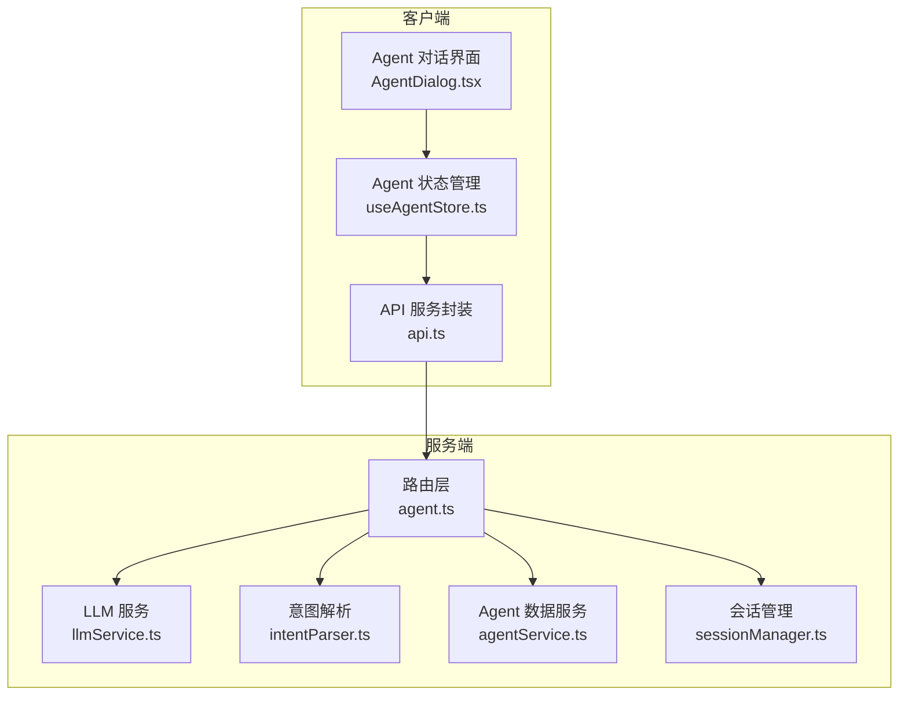
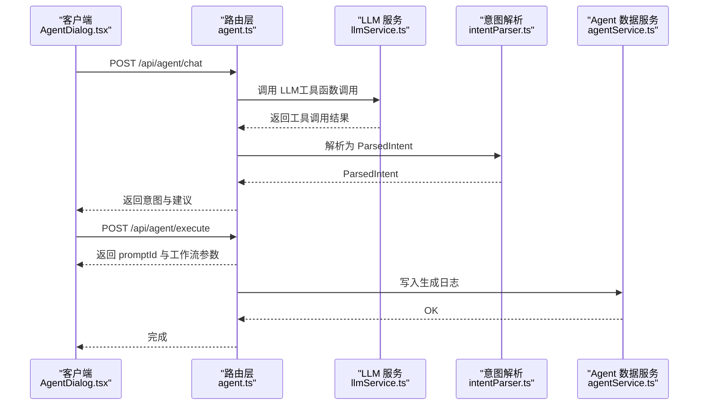
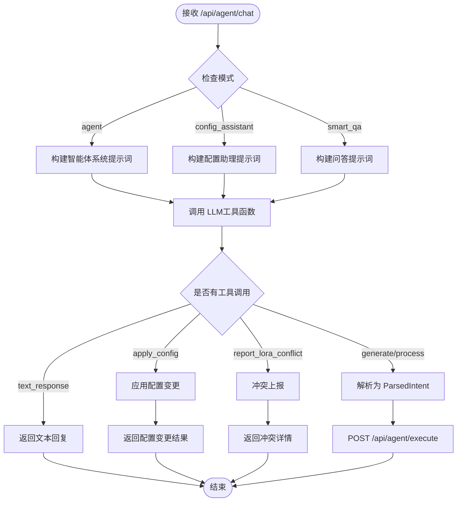
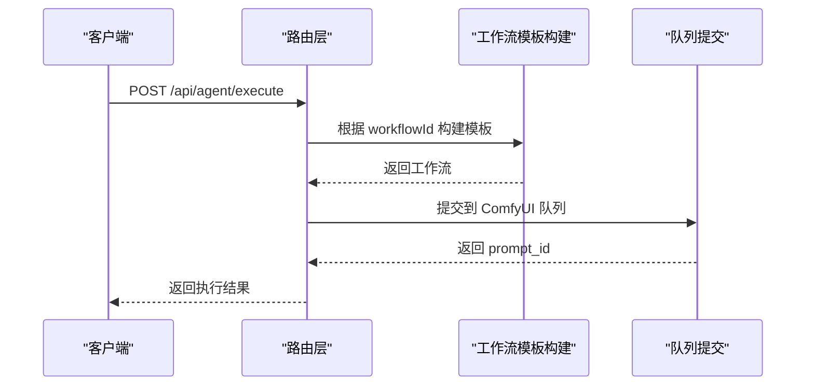
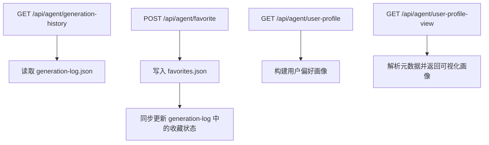
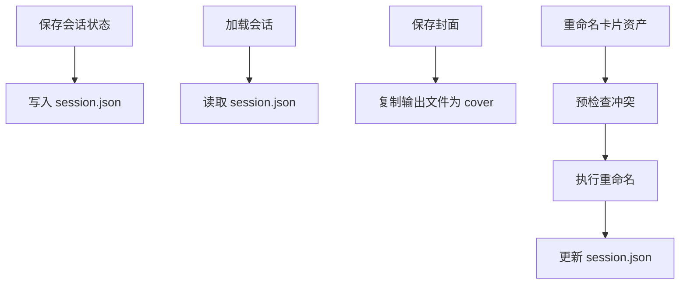
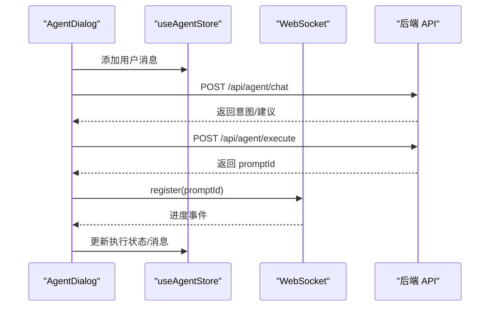
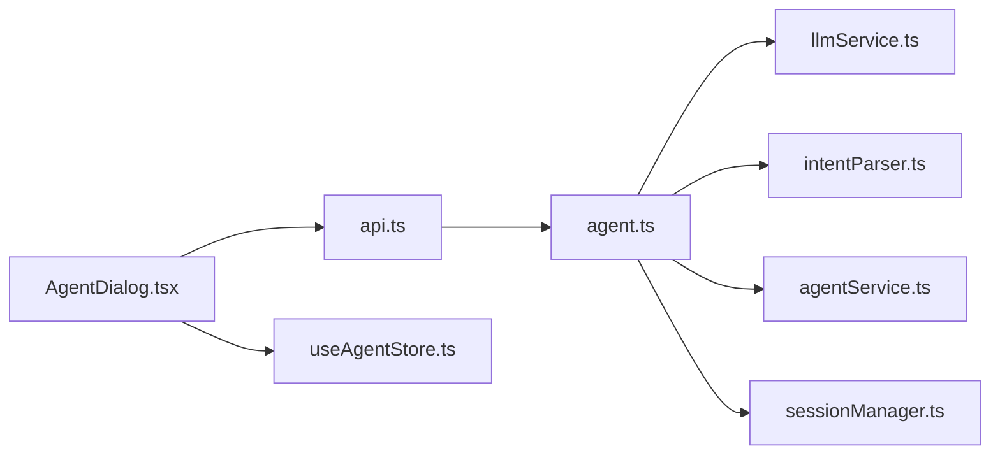

# AI Agent 对话 API

<cite>
**本文档引用的文件**
- [agent.ts](file://server/src/routes/agent.ts)
- [llmService.ts](file://server/src/services/llmService.ts)
- [intentParser.ts](file://server/src/services/intentParser.ts)
- [agentService.ts](file://server/src/services/agentService.ts)
- [sessionManager.ts](file://server/src/services/sessionManager.ts)
- [AgentDialog.tsx](file://client/src/components/AgentDialog.tsx)
- [useAgentStore.ts](file://client/src/hooks/useAgentStore.ts)
- [api.ts](file://client/src/services/api.ts)
- [SystemPrompt.txt](file://docs/SystemPrompt.txt)
- [系统提示词优化方案.md](file://docs/系统提示词优化方案.md)
</cite>

## 目录
1. [简介](#简介)
2. [项目结构](#项目结构)
3. [核心组件](#核心组件)
4. [架构总览](#架构总览)
5. [详细组件分析](#详细组件分析)
6. [依赖关系分析](#依赖关系分析)
7. [性能考虑](#性能考虑)
8. [故障排除指南](#故障排除指南)
9. [结论](#结论)

## 简介
本文件为 CorineKit Pix2Real 的 AI Agent 对话 API 文档，聚焦智能提示词助手接口，覆盖以下能力：
- 对话发起与消息发送：支持普通智能体、配置助理、智能问答三种模式
- 历史记录查询与收藏管理：生成历史、收藏夹持久化
- 会话管理：会话状态存储、封面生成、卡片资产重命名
- LLM 服务集成：Grok API 调用、工具函数调用（Function Calling）
- 提示词优化算法：基于用户画像与 LoRA 元数据的智能推荐
- 对话上下文管理：多轮对话、图片输入、意图解析与工作流执行

## 项目结构
后端采用 Express 路由 + 服务层设计，前端使用 React + Zustand 状态管理，通过 REST API 与后端交互。

**图表来源**
- [agent.ts:1317-1737](file://server/src/routes/agent.ts#L1317-L1737)
- [llmService.ts:55-114](file://server/src/services/llmService.ts#L55-L114)
- [intentParser.ts:487-641](file://server/src/services/intentParser.ts#L487-L641)
- [agentService.ts:52-126](file://server/src/services/agentService.ts#L52-L126)
- [sessionManager.ts:102-133](file://server/src/services/sessionManager.ts#L102-L133)

**章节来源**
- [agent.ts:1-200](file://server/src/routes/agent.ts#L1-L200)
- [AgentDialog.tsx:1-120](file://client/src/components/AgentDialog.tsx#L1-L120)
- [useAgentStore.ts:198-337](file://client/src/hooks/useAgentStore.ts#L198-L337)

## 核心组件
- 路由层（/api/agent/*）：提供对话、执行意图、生成历史、收藏、用户画像等接口
- LLM 服务：封装 Grok API 调用、工具定义、系统提示词构建
- 意图解析器：将 LLM 工具调用结果映射为工作流参数
- Agent 数据服务：生成日志与收藏持久化
- 会话管理：会话状态、封面、卡片资产重命名
- 前端对话组件：消息发送、图片上传、执行状态跟踪、建议展示

**章节来源**
- [agent.ts:1317-1737](file://server/src/routes/agent.ts#L1317-L1737)
- [llmService.ts:192-489](file://server/src/services/llmService.ts#L192-L489)
- [intentParser.ts:487-641](file://server/src/services/intentParser.ts#L487-L641)
- [agentService.ts:52-126](file://server/src/services/agentService.ts#L52-L126)
- [sessionManager.ts:102-133](file://server/src/services/sessionManager.ts#L102-L133)
- [AgentDialog.tsx:227-774](file://client/src/components/AgentDialog.tsx#L227-L774)
- [useAgentStore.ts:198-337](file://client/src/hooks/useAgentStore.ts#L198-L337)

## 架构总览
AI Agent 对话 API 的核心流程：
1. 前端发送对话消息（可携带图片）
2. 后端根据模式构建系统提示词与工具定义
3. 调用 LLM 执行 Function Calling，解析为 ParsedIntent
4. 生成后续建议或直接执行工作流
5. 通过 WebSocket 推送进度，完成后写入生成日志与收藏

**图表来源**
- [agent.ts:1317-1737](file://server/src/routes/agent.ts#L1317-L1737)
- [llmService.ts:55-114](file://server/src/services/llmService.ts#L55-L114)
- [intentParser.ts:487-641](file://server/src/services/intentParser.ts#L487-L641)
- [agentService.ts:63-72](file://server/src/services/agentService.ts#L63-L72)

**章节来源**
- [agent.ts:1317-1737](file://server/src/routes/agent.ts#L1317-L1737)
- [AgentDialog.tsx:619-774](file://client/src/components/AgentDialog.tsx#L619-L774)

## 详细组件分析

### 对话接口（/api/agent/chat）
- 支持模式：
  - agent：智能体模式，负责生成/处理图片
  - config_assistant：配置助理模式，调整右侧面板参数
  - smart_qa：智能问答模式，回答绘图相关问题
- 输入参数：
  - sessionId：会话标识
  - message：用户消息
  - messages：历史消息（最近若干条）
  - images：图片数据（base64）
  - hasImage：是否已上传图片
  - mode：对话模式
  - currentConfig：当前面板配置（config_assistant）
  - allowLoraModification：是否允许修改 LoRA（config_assistant）
- 输出：
  - text_response：纯文本回复
  - tool_call：触发工作流执行，返回 intent 与建议
  - config_change：配置变更（config_assistant）
  - lora_conflict：LoRA 冲突报告（config_assistant）

**图表来源**
- [agent.ts:1317-1737](file://server/src/routes/agent.ts#L1317-L1737)
- [llmService.ts:192-489](file://server/src/services/llmService.ts#L192-L489)
- [llmService.ts:493-800](file://server/src/services/llmService.ts#L493-L800)

**章节来源**
- [agent.ts:1317-1737](file://server/src/routes/agent.ts#L1317-L1737)
- [llmService.ts:192-489](file://server/src/services/llmService.ts#L192-L489)
- [llmService.ts:493-800](file://server/src/services/llmService.ts#L493-L800)

### 执行意图（/api/agent/execute）
- 接收 ParsedIntent，根据 workflowId 构建对应工作流模板
- 支持：
  - Tab 7：快速出图（Text2Img）
  - Tab 9：ZIT 快出
  - Tab 0/2/6：图片处理工作流（二次元转真人、精修放大、真人转二次元）
- 支持批量变体生成（variants）
- 返回 promptId、resolvedConfig、batchTotal 等

**图表来源**
- [agent.ts:1768-2164](file://server/src/routes/agent.ts#L1768-L2164)

**章节来源**
- [agent.ts:1768-2164](file://server/src/routes/agent.ts#L1768-L2164)

### 历史记录与收藏（/api/agent/generation-history, /api/agent/favorite）
- 生成历史：按 sessionId 读取 generation-log.json
- 收藏管理：写入 favorites.json，并同步更新 generation-log 中的收藏状态
- 用户画像：提供用户偏好摘要与可视化画像

**图表来源**
- [agent.ts:1187-1315](file://server/src/routes/agent.ts#L1187-L1315)
- [agentService.ts:52-126](file://server/src/services/agentService.ts#L52-L126)

**章节来源**
- [agent.ts:1187-1315](file://server/src/routes/agent.ts#L1187-L1315)
- [agentService.ts:52-126](file://server/src/services/agentService.ts#L52-L126)

### 会话管理（/api/session/*）
- 会话状态：保存/加载 session.json，包含创建/更新时间、活动标签页、各标签页数据
- 封面生成：复制输出文件为会话封面
- 卡片资产重命名：支持单卡与批量重命名，事务性保证一致性

**图表来源**
- [sessionManager.ts:102-133](file://server/src/services/sessionManager.ts#L102-L133)
- [sessionManager.ts:178-218](file://server/src/services/sessionManager.ts#L178-L218)
- [sessionManager.ts:256-360](file://server/src/services/sessionManager.ts#L256-L360)
- [sessionManager.ts:381-538](file://server/src/services/sessionManager.ts#L381-L538)

**章节来源**
- [sessionManager.ts:102-133](file://server/src/services/sessionManager.ts#L102-L133)
- [sessionManager.ts:178-218](file://server/src/services/sessionManager.ts#L178-L218)
- [sessionManager.ts:256-360](file://server/src/services/sessionManager.ts#L256-L360)
- [sessionManager.ts:381-538](file://server/src/services/sessionManager.ts#L381-L538)

### 前端对话组件与状态管理
- AgentDialog：对话窗口、消息渲染、图片上传、执行状态跟踪、建议展示
- useAgentStore：消息、执行状态、上传图片、收藏、配置快照等状态管理
- WebSocket：注册 promptId，接收进度事件，完成后更新 UI

**图表来源**
- [AgentDialog.tsx:283-574](file://client/src/components/AgentDialog.tsx#L283-L574)
- [AgentDialog.tsx:619-774](file://client/src/components/AgentDialog.tsx#L619-L774)
- [useAgentStore.ts:198-337](file://client/src/hooks/useAgentStore.ts#L198-L337)

**章节来源**
- [AgentDialog.tsx:283-574](file://client/src/components/AgentDialog.tsx#L283-L574)
- [AgentDialog.tsx:619-774](file://client/src/components/AgentDialog.tsx#L619-L774)
- [useAgentStore.ts:198-337](file://client/src/hooks/useAgentStore.ts#L198-L337)

## 依赖关系分析
- 路由层依赖 LLM 服务、意图解析器、Agent 数据服务、会话管理
- LLM 服务依赖元数据（model_meta/metadata.json）与外部 Grok API
- 意图解析器依赖元数据与用户画像，生成 ParsedIntent
- 前端依赖路由层提供的 REST API 与 WebSocket 事件

**图表来源**
- [agent.ts:1-50](file://server/src/routes/agent.ts#L1-L50)
- [llmService.ts:1-50](file://server/src/services/llmService.ts#L1-L50)
- [intentParser.ts:1-20](file://server/src/services/intentParser.ts#L1-L20)
- [agentService.ts:1-20](file://server/src/services/agentService.ts#L1-L20)
- [sessionManager.ts:1-10](file://server/src/services/sessionManager.ts#L1-L10)
- [AgentDialog.tsx:1-20](file://client/src/components/AgentDialog.tsx#L1-L20)
- [useAgentStore.ts:1-20](file://client/src/hooks/useAgentStore.ts#L1-L20)
- [api.ts:1-20](file://client/src/services/api.ts#L1-L20)

**章节来源**
- [agent.ts:1-50](file://server/src/routes/agent.ts#L1-L50)
- [llmService.ts:1-50](file://server/src/services/llmService.ts#L1-L50)
- [intentParser.ts:1-20](file://server/src/services/intentParser.ts#L1-L20)
- [agentService.ts:1-20](file://server/src/services/agentService.ts#L1-L20)
- [sessionManager.ts:1-10](file://server/src/services/sessionManager.ts#L1-L10)
- [AgentDialog.tsx:1-20](file://client/src/components/AgentDialog.tsx#L1-L20)
- [useAgentStore.ts:1-20](file://client/src/hooks/useAgentStore.ts#L1-L20)
- [api.ts:1-20](file://client/src/services/api.ts#L1-L20)

## 性能考虑
- LLM 调用：使用工具函数调用（tool_choice=required），减少无效对话轮次
- 元数据缓存：元数据读取增加 TTL 缓存（1 分钟），降低磁盘 IO
- 批量变体：前端一次性提交多个变体，后端并发构建工作流模板并提交队列
- WebSocket：按 promptId 注册进度回调，避免轮询
- 生成日志：异步写入，不阻塞响应

**章节来源**
- [agent.ts:21-34](file://server/src/routes/agent.ts#L21-L34)
- [agent.ts:1026-1161](file://server/src/routes/agent.ts#L1026-L1161)
- [agent.ts:1768-2164](file://server/src/routes/agent.ts#L1768-L2164)

## 故障排除指南
- LLM API 错误：检查 Grok API Key 与网络连通性
- 工具调用失败：确认工具定义与 tool_choice 配置
- 模型/LoRA 未找到：检查 ComfyUI 模型安装与路径
- 会话状态异常：检查 session.json 格式与权限
- 收藏同步失败：确认 generation-log 与 favorites 文件写入权限

**章节来源**
- [llmService.ts:55-114](file://server/src/services/llmService.ts#L55-L114)
- [agent.ts:2142-2164](file://server/src/routes/agent.ts#L2142-L2164)
- [sessionManager.ts:102-133](file://server/src/services/sessionManager.ts#L102-L133)
- [agentService.ts:110-125](file://server/src/services/agentService.ts#L110-L125)

## 结论
AI Agent 对话 API 通过清晰的路由分层、完善的 LLM 集成与意图解析、可靠的会话与数据持久化，实现了从自然语言到工作流执行的完整闭环。建议在生产环境中关注：
- LLM API 的稳定性与配额管理
- 元数据与用户画像的维护与更新
- 前端状态与 WebSocket 的一致性保障
- 批量变体与多轮对话的上下文管理