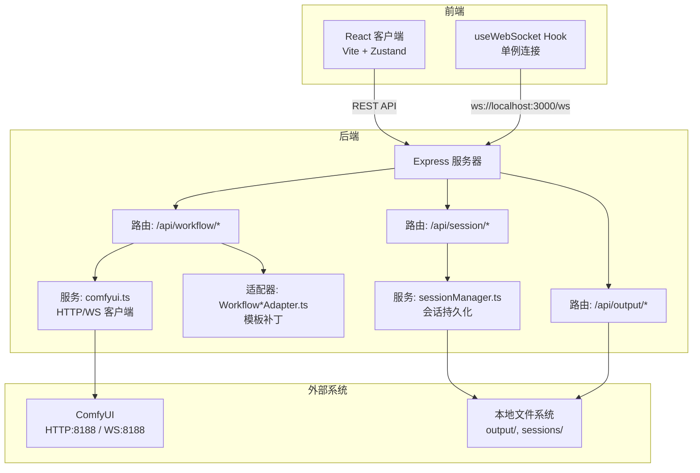
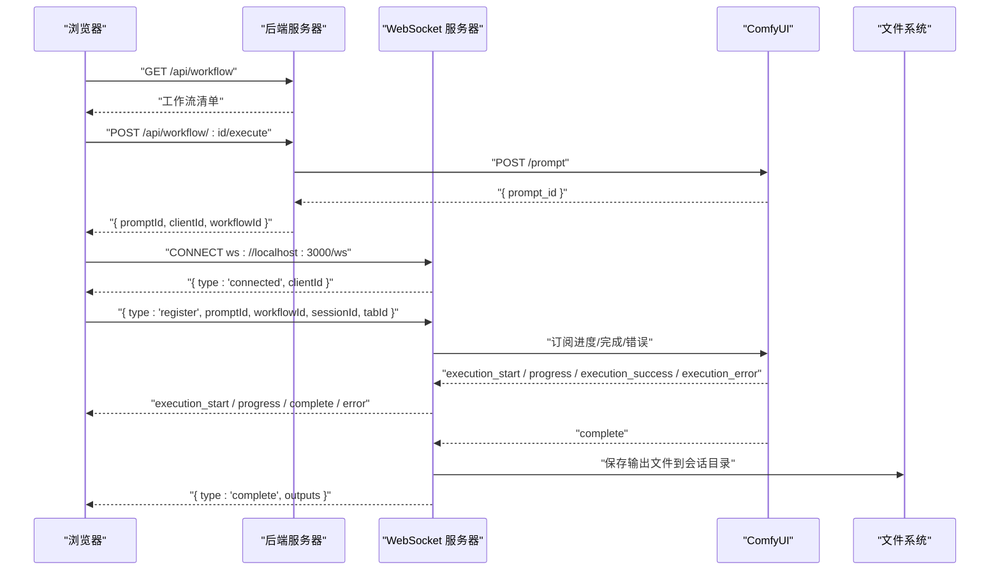
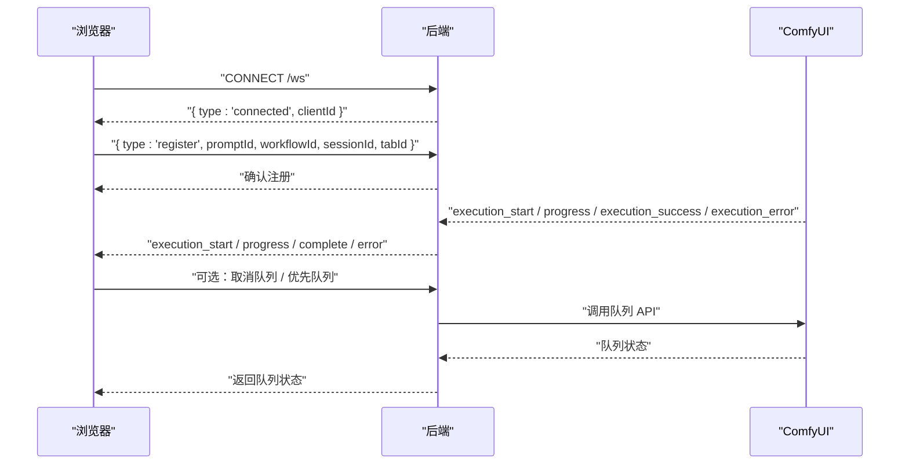
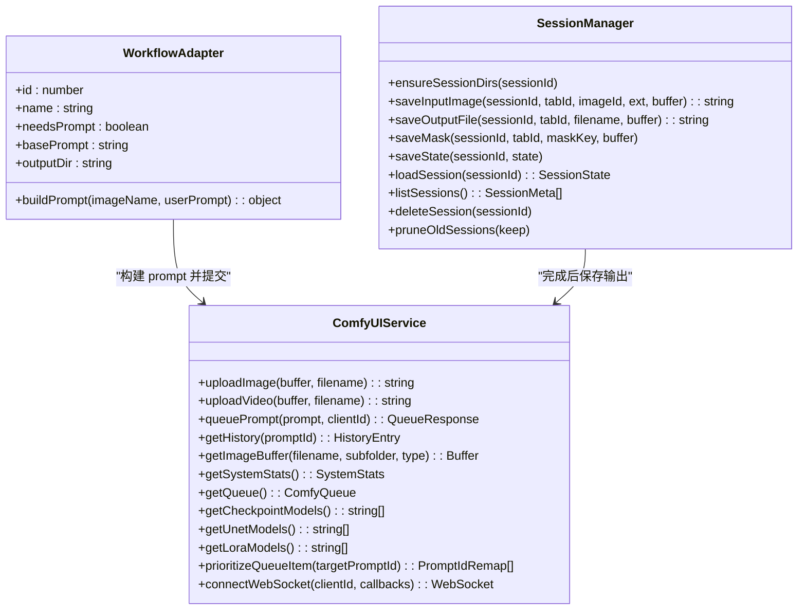

# API 参考文档

<cite>
**本文引用的文件**
- [server/src/index.ts](file://server/src/index.ts)
- [server/src/routes/workflow.ts](file://server/src/routes/workflow.ts)
- [server/src/routes/session.ts](file://server/src/routes/session.ts)
- [server/src/routes/output.ts](file://server/src/routes/output.ts)
- [server/src/services/comfyui.ts](file://server/src/services/comfyui.ts)
- [server/src/services/sessionManager.ts](file://server/src/services/sessionManager.ts)
- [server/src/adapters/Workflow0Adapter.ts](file://server/src/adapters/Workflow0Adapter.ts)
- [server/src/types/index.ts](file://server/src/types/index.ts)
- [client/src/hooks/useWebSocket.ts](file://client/src/hooks/useWebSocket.ts)
- [client/src/types/index.ts](file://client/src/types/index.ts)
- [README.md](file://README.md)
</cite>

## 目录
1. [简介](#简介)
2. [项目结构](#项目结构)
3. [核心组件](#核心组件)
4. [架构总览](#架构总览)
5. [详细组件分析](#详细组件分析)
6. [依赖关系分析](#依赖关系分析)
7. [性能考量](#性能考量)
8. [故障排查指南](#故障排查指南)
9. [结论](#结论)
10. [附录](#附录)

## 简介
本文件为 CorineKit Pix2Real 的完整 API 参考文档，覆盖后端 RESTful API（工作流执行、状态查询、输出文件下载、会话管理）与 WebSocket 实时通信协议。文档面向开发者与集成者，提供端点定义、请求/响应模式、认证方式、错误处理策略、安全与性能建议，并给出常见使用场景与调试方法。

## 项目结构
后端采用 Express + TypeScript，前端采用 Vite + React + TypeScript。后端通过适配器加载 ComfyUI 工作流模板，统一调度 ComfyUI 的 HTTP 与 WebSocket 接口；前端通过单例 WebSocket Hook 与后端建立长连接，接收进度与完成事件。

图表来源
- [server/src/index.ts:42-61](file://server/src/index.ts#L42-L61)
- [server/src/routes/workflow.ts:1-22](file://server/src/routes/workflow.ts#L1-L22)
- [server/src/routes/session.ts:15-16](file://server/src/routes/session.ts#L15-L16)
- [server/src/routes/output.ts:11-11](file://server/src/routes/output.ts#L11-L11)
- [server/src/services/comfyui.ts:6-7](file://server/src/services/comfyui.ts#L6-L7)
- [server/src/services/sessionManager.ts:6](file://server/src/services/sessionManager.ts#L6)

章节来源
- [README.md:41-62](file://README.md#L41-L62)
- [server/src/index.ts:42-61](file://server/src/index.ts#L42-L61)

## 核心组件
- 后端服务器：提供 REST 路由、静态资源、WebSocket 服务。
- 适配器：按工作流 ID 加载模板并补丁化，生成可提交给 ComfyUI 的 prompt。
- 会话管理：负责会话目录、输入/掩码/输出文件的保存与读取。
- ComfyUI 服务：封装上传、入队、历史查询、进度/完成事件转发、队列操作、模型列表等。
- 前端 WebSocket Hook：单例连接，解析后端推送的进度/完成/错误事件，驱动 UI 状态。

章节来源
- [server/src/adapters/Workflow0Adapter.ts:9-34](file://server/src/adapters/Workflow0Adapter.ts#L9-L34)
- [server/src/services/sessionManager.ts:10-57](file://server/src/services/sessionManager.ts#L10-L57)
- [server/src/services/comfyui.ts:9-284](file://server/src/services/comfyui.ts#L9-L284)
- [client/src/hooks/useWebSocket.ts:10-98](file://client/src/hooks/useWebSocket.ts#L10-L98)

## 架构总览
后端在启动时：
- 初始化 Express 应用与 HTTP 服务器。
- 注册 CORS、JSON 中间件、静态资源挂载。
- 注册 REST 路由：/api/workflow、/api/output、/api/session。
- 创建 WebSocket 服务器，代理来自浏览器的注册消息到 ComfyUI，并将 ComfyUI 的进度/完成/错误事件回传给浏览器。
- 确保 output 与 sessions 目录存在。

图表来源
- [server/src/index.ts:73-219](file://server/src/index.ts#L73-L219)
- [server/src/routes/workflow.ts:407-455](file://server/src/routes/workflow.ts#L407-L455)
- [server/src/services/comfyui.ts:127-188](file://server/src/services/comfyui.ts#L127-L188)

章节来源
- [server/src/index.ts:42-61](file://server/src/index.ts#L42-L61)
- [server/src/index.ts:62-63](file://server/src/index.ts#L62-L63)

## 详细组件分析

### REST API 总览
- 基础路径：/api
- 主要模块：
  - /workflow：工作流执行、队列、系统统计、模型列表、提示词助手与反推、导出混合图等。
  - /output：列出与下载输出文件、打开文件。
  - /session：会话输入/掩码/状态的保存与读取、会话列表与删除。

章节来源
- [server/src/index.ts:54-60](file://server/src/index.ts#L54-L60)
- [server/src/routes/workflow.ts:29-38](file://server/src/routes/workflow.ts#L29-L38)
- [server/src/routes/output.ts:22-73](file://server/src/routes/output.ts#L22-L73)
- [server/src/routes/session.ts:18-92](file://server/src/routes/session.ts#L18-L92)

### 工作流执行接口
- 列表
  - 方法：GET
  - 路径：/api/workflow
  - 响应：工作流数组，包含 id、name、needsPrompt、basePrompt。
  - 认证：无。
  - 示例：返回包含多个工作流的数组。

- 单图执行（通用）
  - 方法：POST
  - 路径：/api/workflow/:id/execute
  - 参数：multipart/form-data，字段 image（必填），clientId（必填），prompt（可选）。
  - 响应：{ promptId, clientId, workflowId, workflowName }。
  - 备注：根据 workflowId 选择适配器或模板，补丁化后提交至 ComfyUI。

- 批量执行
  - 方法：POST
  - 路径：/api/workflow/:id/batch
  - 参数：multipart/form-data，字段 images（必填，最多 50 张），clientId（必填），prompt 或 prompts（可选）。
  - 响应：{ clientId, workflowId, workflowName, tasks: [{ promptId, originalName }] }。

- 特定工作流执行
  - 0：二次元转真人
    - 路径：/api/workflow/0/execute
    - 参数：multipart image（必填），clientId（必填），model（可选，默认 qwen），prompt（可选）。
    - 响应：{ promptId, clientId, workflowId, workflowName }。
  - 2：精修放大
    - 路径：/api/workflow/2/execute
    - 参数：multipart image（必填），clientId（必填），model（可选，默认 seedvr2），prompt（可选）。
    - 响应：同上。
  - 5：解除装备
    - 路径：/api/workflow/5/execute
    - 参数：multipart image（必填）、mask（必填），clientId（必填），backPose（可选），prompt（可选）。
    - 响应：同上。
  - 7：快速出图（文生图）
    - 路径：/api/workflow/7/execute
    - 参数：JSON，字段 clientId（必填），model（必填），prompt（必填），width/height（必填），steps/cfg/sampler/scheduler（必填），name（可选）。
    - 响应：同上。
  - 8：黑兽换脸
    - 路径：/api/workflow/8/execute
    - 参数：multipart targetImage、faceImage（必填），clientId（必填）。
    - 响应：同上。
  - 9：ZIT快出（UNet+LoRA）
    - 路径：/api/workflow/9/execute
    - 参数：JSON，字段 clientId（必填），unetModel/loraModel（必填），loraEnabled（必选），shiftEnabled（必选），shift（可选），prompt（可选），width/height/steps/cfg/sampler/scheduler（必选），name（可选）。
    - 响应：同上。

- 队列与系统
  - 取消队列项：POST /api/workflow/cancel-queue/:promptId
  - 获取系统统计：GET /api/workflow/system-stats
  - 释放显存：POST /api/workflow/release-memory
  - 获取队列：GET /api/workflow/queue
  - 队列优先：POST /api/workflow/queue/prioritize/:promptId
  - 打开输出目录：POST /api/workflow/:id/open-folder（JSON：{ sessionId?, tabId? }）

- 模型列表
  - GET /api/workflow/models/checkpoints
  - GET /api/workflow/models/unets
  - GET /api/workflow/models/loras

- 提示词相关
  - 反推提示词：POST /api/workflow/reverse-prompt?model=Qwen3VL|Florence|WD-14（multipart image，必填）
  - 提示词助理：POST /api/workflow/prompt-assistant（JSON：{ systemPrompt, userPrompt }）

- 导出混合图
  - POST /api/workflow/export-blend（JSON：{ sessionId, tabId, filename, imageDataBase64 }）

章节来源
- [server/src/routes/workflow.ts:29-38](file://server/src/routes/workflow.ts#L29-L38)
- [server/src/routes/workflow.ts:407-455](file://server/src/routes/workflow.ts#L407-L455)
- [server/src/routes/workflow.ts:457-520](file://server/src/routes/workflow.ts#L457-L520)
- [server/src/routes/workflow.ts:41-92](file://server/src/routes/workflow.ts#L41-L92)
- [server/src/routes/workflow.ts:94-149](file://server/src/routes/workflow.ts#L94-L149)
- [server/src/routes/workflow.ts:263-310](file://server/src/routes/workflow.ts#L263-L310)
- [server/src/routes/workflow.ts:312-355](file://server/src/routes/workflow.ts#L312-L355)
- [server/src/routes/workflow.ts:357-405](file://server/src/routes/workflow.ts#L357-L405)
- [server/src/routes/workflow.ts:522-539](file://server/src/routes/workflow.ts#L522-L539)
- [server/src/routes/workflow.ts:542-559](file://server/src/routes/workflow.ts#L542-L559)
- [server/src/routes/workflow.ts:561-579](file://server/src/routes/workflow.ts#L561-L579)
- [server/src/routes/workflow.ts:581-623](file://server/src/routes/workflow.ts#L581-L623)
- [server/src/routes/workflow.ts:151-179](file://server/src/routes/workflow.ts#L151-L179)
- [server/src/routes/workflow.ts:674-744](file://server/src/routes/workflow.ts#L674-L744)
- [server/src/routes/workflow.ts:746-800](file://server/src/routes/workflow.ts#L746-L800)
- [server/src/routes/workflow.ts:626-655](file://server/src/routes/workflow.ts#L626-L655)

### 输出文件接口
- 列出输出文件
  - 方法：GET
  - 路径：/api/output/:workflowId
  - 响应：文件数组，包含 filename、size、createdAt、url。
- 下载单个文件
  - 方法：GET
  - 路径：/api/output/:workflowId/:filename
  - 响应：文件内容（二进制）。
- 打开文件
  - 方法：POST
  - 路径：/api/output/open-file
  - 请求体：{ url }，支持 /api/output/、/output/、/api/session-files/ 三种前缀。
  - 响应：{ ok }。

章节来源
- [server/src/routes/output.ts:22-73](file://server/src/routes/output.ts#L22-L73)
- [server/src/routes/output.ts:75-131](file://server/src/routes/output.ts#L75-L131)

### 会话管理接口
- 保存输入图片
  - 方法：POST
  - 路径：/api/session/:sessionId/images
  - 参数：multipart image（必填），tabId（必填），imageId（必填）。
  - 响应：{ url }。
- 保存掩码
  - 方法：POST
  - 路径：/api/session/:sessionId/masks
  - 参数：multipart mask（必填），tabId（必填），maskKey（必填）。
  - 响应：{ ok }。
- 保存会话状态（PUT/POST）
  - 方法：PUT 或 POST
  - 路径：/api/session/:sessionId/state
  - 请求体：{ activeTab, tabData }。
  - 响应：{ ok }。
- 读取会话
  - 方法：GET
  - 路径：/api/session/:sessionId
  - 响应：会话 JSON。
- 列出会话
  - 方法：GET
  - 路径：/api/sessions
  - 响应：会话元数据数组。
- 删除会话
  - 方法：DELETE
  - 路径：/api/session/:sessionId
  - 响应：{ ok }。

章节来源
- [server/src/routes/session.ts:18-92](file://server/src/routes/session.ts#L18-L92)

### WebSocket API
- 连接
  - URL：ws://localhost:3000/ws
  - 握手：后端发送 { type: 'connected', clientId }。
- 客户端注册
  - 发送：{ type: 'register', promptId, workflowId, sessionId, tabId }
  - 作用：建立 promptId 与工作流/会话映射，以便完成后自动下载输出并写入会话目录。
- 事件类型
  - execution_start：开始执行某 promptId。
  - progress：{ value, max, percentage }。
  - complete：完成，outputs 为文件数组。
  - error：错误，包含 message。
- 事件缓冲与重放
  - 若客户端在 ComfyUI 开始执行后再连接，后端会重放最近的 execution_start/progress 事件。

图表来源
- [server/src/index.ts:73-219](file://server/src/index.ts#L73-L219)
- [client/src/hooks/useWebSocket.ts:26-51](file://client/src/hooks/useWebSocket.ts#L26-L51)

章节来源
- [server/src/index.ts:73-219](file://server/src/index.ts#L73-L219)
- [client/src/hooks/useWebSocket.ts:10-98](file://client/src/hooks/useWebSocket.ts#L10-L98)
- [client/src/types/index.ts:27-57](file://client/src/types/index.ts#L27-L57)
- [server/src/types/index.ts:10-30](file://server/src/types/index.ts#L10-L30)

## 依赖关系分析
- 适配器与模板：每个 WorkflowAdapter 负责加载对应 JSON 模板并补丁化，减少重复逻辑。
- 服务层：comfyui.ts 统一封装与 ComfyUI 的交互；sessionManager.ts 负责会话文件系统操作。
- 路由层：routes/* 聚合业务逻辑，调用服务层与适配器。
- 前端：useWebSocket.ts 单例连接，避免重复连接与资源浪费。

图表来源
- [server/src/adapters/Workflow0Adapter.ts:9-34](file://server/src/adapters/Workflow0Adapter.ts#L9-L34)
- [server/src/services/comfyui.ts:9-284](file://server/src/services/comfyui.ts#L9-L284)
- [server/src/services/sessionManager.ts:10-163](file://server/src/services/sessionManager.ts#L10-L163)

章节来源
- [server/src/adapters/Workflow0Adapter.ts:9-34](file://server/src/adapters/Workflow0Adapter.ts#L9-L34)
- [server/src/services/comfyui.ts:9-284](file://server/src/services/comfyui.ts#L9-L284)
- [server/src/services/sessionManager.ts:10-163](file://server/src/services/sessionManager.ts#L10-L163)

## 性能考量
- 批量执行：批量端点支持一次提交多张图片，减少网络往返。
- 队列优先：通过重新排队将目标任务置顶，降低等待时间。
- 内存释放：提供释放显存的工作流，缓解长时间运行导致的显存不足。
- 文件大小限制：后端 JSON 解析限制为 50MB，避免过大请求导致内存压力。
- WebSocket 单例：前端 Hook 使用模块级全局连接，避免重复连接与资源浪费。

章节来源
- [server/src/routes/workflow.ts:457-520](file://server/src/routes/workflow.ts#L457-L520)
- [server/src/routes/workflow.ts:571-579](file://server/src/routes/workflow.ts#L571-L579)
- [server/src/routes/workflow.ts:542-559](file://server/src/routes/workflow.ts#L542-L559)
- [server/src/index.ts:51](file://server/src/index.ts#L51)
- [client/src/hooks/useWebSocket.ts:10-73](file://client/src/hooks/useWebSocket.ts#L10-L73)

## 故障排查指南
- ComfyUI 不可用
  - 现象：系统统计、队列、模型列表返回 502。
  - 处理：确认 ComfyUI 在 http://127.0.0.1:8188 正常运行。
- 上传失败
  - 现象：上传图片/视频返回错误。
  - 处理：检查 ComfyUI 的 /upload/image 接口是否可达，确认文件格式与大小。
- 队列异常
  - 现象：取消/优先队列失败。
  - 处理：确认 promptId 存在且处于 pending 状态。
- WebSocket 连接断开
  - 现象：进度不更新或断线重连。
  - 处理：前端会自动重连；检查后端日志与防火墙设置。
- 输出文件缺失
  - 现象：完成后无法在 /api/output 或会话目录找到文件。
  - 处理：确认后端已将 ComfyUI 输出保存到会话目录；检查 promptId 是否正确注册。

章节来源
- [server/src/services/comfyui.ts:106-125](file://server/src/services/comfyui.ts#L106-L125)
- [server/src/services/comfyui.ts:202-221](file://server/src/services/comfyui.ts#L202-L221)
- [server/src/services/comfyui.ts:255-284](file://server/src/services/comfyui.ts#L255-L284)
- [server/src/index.ts:177-188](file://server/src/index.ts#L177-L188)

## 结论
本项目通过适配器模式与统一的服务层，将多种工作流模板标准化为一致的 REST + WebSocket 接口，既便于前端集成，也利于扩展新的工作流。建议在生产环境中：
- 明确客户端身份与权限控制（当前为无认证）。
- 对外暴露 API 时增加速率限制与请求校验。
- 使用 HTTPS 与跨域白名单。
- 增加日志审计与错误追踪。

## 附录

### 认证与安全
- 当前实现：无认证与授权机制。
- 建议：在网关或中间件中加入基于 Cookie/JWT 的鉴权，限制 /api/session 与 /api/output 的访问范围。

章节来源
- [server/src/index.ts:46-49](file://server/src/index.ts#L46-L49)

### 错误码与语义
- 200：成功
- 400：参数缺失或非法
- 404：会话/文件不存在
- 500：服务器内部错误
- 502：上游服务不可达
- 504：提示词反推/助理超时

章节来源
- [server/src/routes/workflow.ts:88-91](file://server/src/routes/workflow.ts#L88-L91)
- [server/src/routes/workflow.ts:720-723](file://server/src/routes/workflow.ts#L720-L723)
- [server/src/routes/output.ts:67-70](file://server/src/routes/output.ts#L67-L70)
- [server/src/routes/session.ts:74-77](file://server/src/routes/session.ts#L74-L77)

### 版本信息
- 服务端版本：0.0.1
- 客户端版本：0.0.1
- 依赖：Express、ws、node-fetch、multer、cors

章节来源
- [server/package.json:4](file://server/package.json#L4)
- [client/package.json:4](file://client/package.json#L4)

### 常见使用场景
- 批量二次元转真人：使用 /api/workflow/0/execute 或 /api/workflow/0/batch，设置 model 与 prompt。
- 精修放大：使用 /api/workflow/2/execute，选择 seedvr2/sd/klein。
- 解除装备：使用 /api/workflow/5/execute，提供原图与掩码。
- 快速出图：使用 /api/workflow/7/execute，传入模型与采样参数。
- ZIT快出：使用 /api/workflow/9/execute，配置 UNet/LoRA/Shift。
- 监控进度：连接 /ws，注册 promptId，监听 progress/complete。
- 查看输出：使用 /api/output/:workflowId 列表或直接下载 /api/output/:workflowId/:filename。

章节来源
- [server/src/routes/workflow.ts:41-92](file://server/src/routes/workflow.ts#L41-L92)
- [server/src/routes/workflow.ts:94-149](file://server/src/routes/workflow.ts#L94-L149)
- [server/src/routes/workflow.ts:263-310](file://server/src/routes/workflow.ts#L263-L310)
- [server/src/routes/workflow.ts:312-355](file://server/src/routes/workflow.ts#L312-L355)
- [server/src/routes/workflow.ts:357-405](file://server/src/routes/workflow.ts#L357-L405)
- [server/src/routes/workflow.ts:457-520](file://server/src/routes/workflow.ts#L457-L520)
- [server/src/routes/output.ts:22-73](file://server/src/routes/output.ts#L22-L73)

### 客户端实现要点
- 使用单例 WebSocket Hook：确保全局仅有一个连接，避免重复订阅。
- 注册 promptId：在收到 connected 后立即发送 register 消息。
- 处理事件：根据 type 分发到 UI 状态（如进度条、完成态）。
- 会话持久化：通过 /api/session/* 保存输入/掩码/状态，恢复 UI。

章节来源
- [client/src/hooks/useWebSocket.ts:10-98](file://client/src/hooks/useWebSocket.ts#L10-L98)
- [client/src/types/index.ts:27-57](file://client/src/types/index.ts#L27-L57)

### 调试与监控
- 后端日志：关注连接、事件缓冲、完成处理与错误事件。
- ComfyUI 日志：检查 /prompt、/history、/queue 的响应。
- 前端调试：在浏览器控制台查看 WS onmessage 与 onclose。
- 文件系统：确认 output 与 sessions 目录权限与磁盘空间。

章节来源
- [server/src/index.ts:73-219](file://server/src/index.ts#L73-L219)
- [server/src/services/comfyui.ts:127-188](file://server/src/services/comfyui.ts#L127-L188)