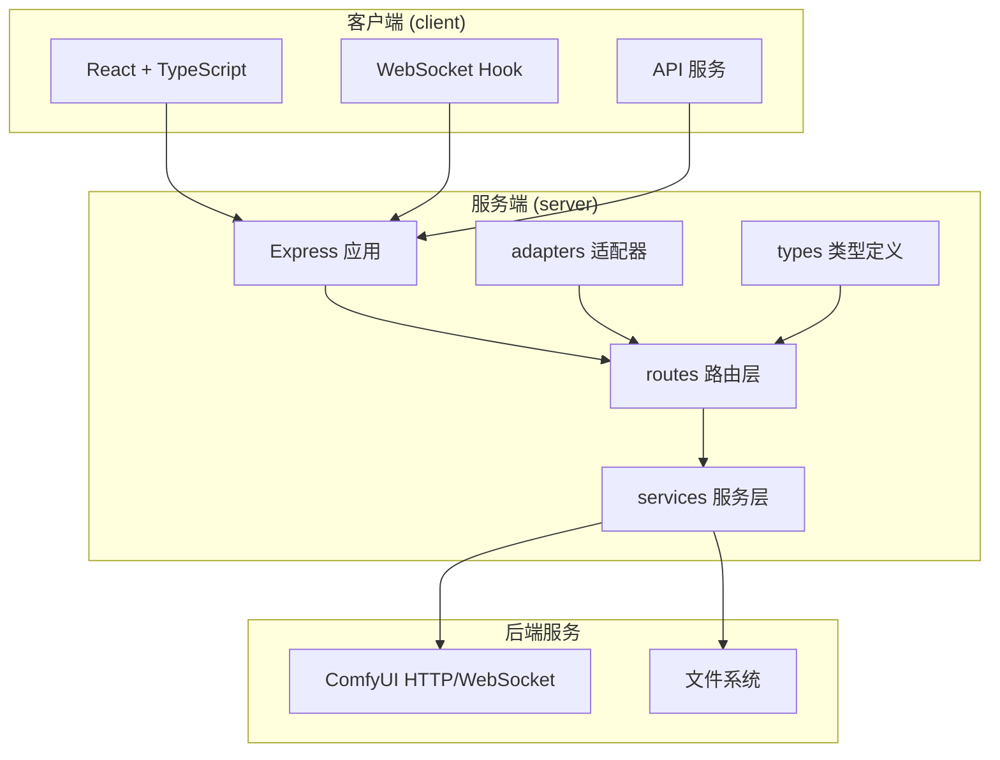
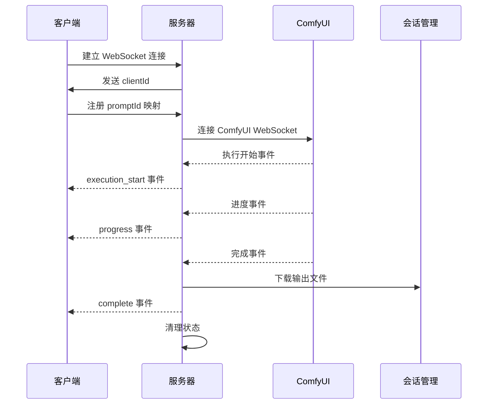
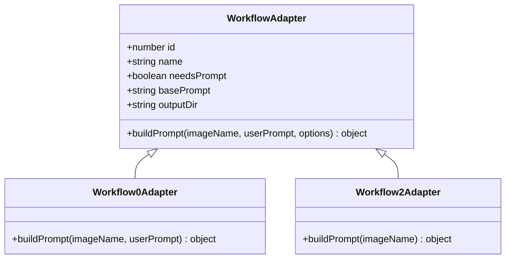
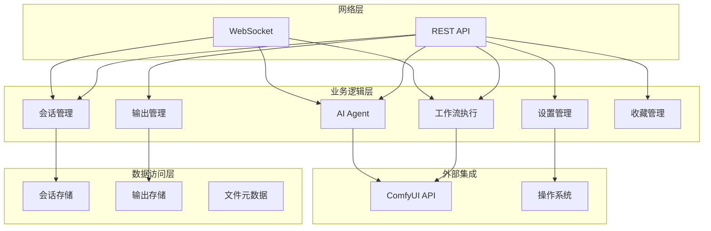
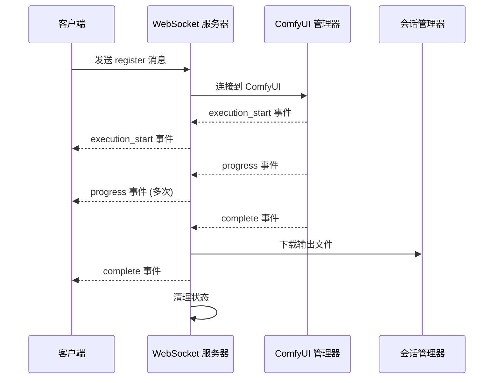
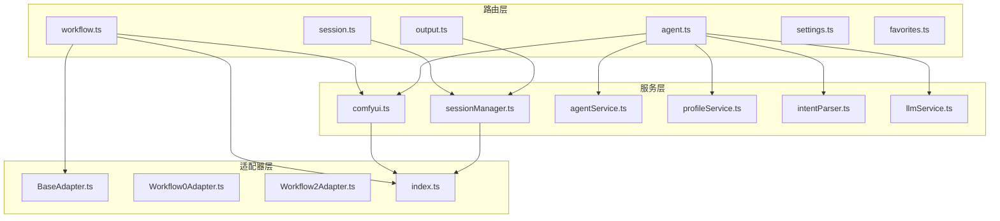
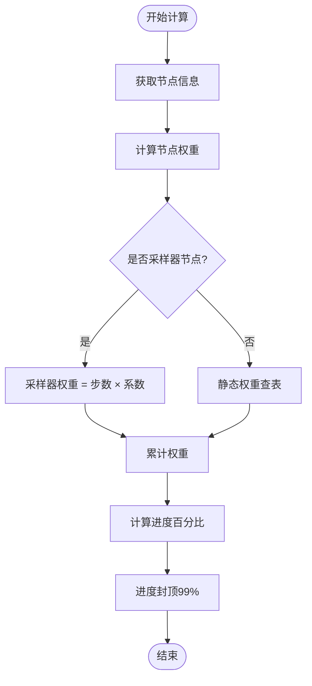

# API 参考文档

<cite>
**本文档引用的文件**
- [README.md](file://README.md)
- [server/src/index.ts](file://server/src/index.ts)
- [server/src/routes/workflow.ts](file://server/src/routes/workflow.ts)
- [server/src/routes/session.ts](file://server/src/routes/session.ts)
- [server/src/routes/output.ts](file://server/src/routes/output.ts)
- [server/src/routes/agent.ts](file://server/src/routes/agent.ts)
- [server/src/routes/settings.ts](file://server/src/routes/settings.ts)
- [server/src/routes/favorites.ts](file://server/src/routes/favorites.ts)
- [server/src/services/comfyui.ts](file://server/src/services/comfyui.ts)
- [server/src/services/sessionManager.ts](file://server/src/services/sessionManager.ts)
- [server/src/types/index.ts](file://server/src/types/index.ts)
- [client/src/hooks/useWebSocket.ts](file://client/src/hooks/useWebSocket.ts)
- [client/src/services/api.ts](file://client/src/services/api.ts)
</cite>

## 目录
1. [简介](#简介)
2. [项目结构](#项目结构)
3. [核心组件](#核心组件)
4. [架构概览](#架构概览)
5. [详细组件分析](#详细组件分析)
6. [依赖关系分析](#依赖关系分析)
7. [性能考虑](#性能考虑)
8. [故障排除指南](#故障排除指南)
9. [结论](#结论)
10. [附录](#附录)

## 简介

CorineKit Pix2Real 是一个基于 Web 的本地 AI 图像处理应用，通过 ComfyUI 提供批量图像/视频处理功能。该项目采用前后端分离架构，前端使用 React + TypeScript，后端使用 Express + TypeScript，通过 WebSocket 实现实时进度更新。

主要特性包括：
- 5种内置工作流：二次元转真人、真人精修、精修放大、图像转视频、视频放大
- 批量处理：拖拽多个文件一次性执行
- 实时进度：WebSocket 从 ComfyUI 到浏览器的实时进度更新
- 会话管理：每标签页独立的图像列表和状态管理
- 输出文件管理：一键打开输出文件夹
- VRAM 释放：从 UI 触发 ComfyUI 内存清理

## 项目结构

**图表来源**
- [server/src/index.ts:118-145](file://server/src/index.ts#L118-L145)
- [server/src/routes/workflow.ts:29](file://server/src/routes/workflow.ts#L29)

**章节来源**
- [README.md:41-79](file://README.md#L41-L79)

## 核心组件

### WebSocket 通信架构

系统采用双向 WebSocket 通信机制：

**图表来源**
- [server/src/index.ts:168-494](file://server/src/index.ts#L168-L494)
- [server/src/services/comfyui.ts:265-375](file://server/src/services/comfyui.ts#L265-L375)

### 工作流适配器模式

系统采用适配器模式处理不同工作流：

**图表来源**
- [server/src/adapters/Workflow0Adapter.ts:9-34](file://server/src/adapters/Workflow0Adapter.ts#L9-L34)
- [server/src/adapters/Workflow2Adapter.ts:9-27](file://server/src/adapters/Workflow2Adapter.ts#L9-L27)

**章节来源**
- [server/src/adapters/Workflow0Adapter.ts:1-35](file://server/src/adapters/Workflow0Adapter.ts#L1-L35)
- [server/src/adapters/Workflow2Adapter.ts:1-28](file://server/src/adapters/Workflow2Adapter.ts#L1-L28)

## 架构概览

**图表来源**
- [server/src/index.ts:129-145](file://server/src/index.ts#L129-L145)
- [server/src/services/comfyui.ts:168-196](file://server/src/services/comfyui.ts#L168-L196)

## 详细组件分析

### 工作流执行 API

#### 基础工作流执行

| 端点 | 方法 | 描述 | 请求体 | 响应 |
|------|------|------|--------|------|
| `/api/workflow/:id/execute` | POST | 执行基础工作流 | multipart/form-data: image, prompt, options | { promptId, clientId, workflowId, workflowName } |
| `/api/workflow/:id/execute` | POST | 执行视频工作流 | multipart/form-data: video | { promptId, clientId, workflowId, workflowName } |

**章节来源**
- [server/src/routes/workflow.ts:750-799](file://server/src/routes/workflow.ts#L750-L799)

#### 专用工作流执行

| 端点 | 方法 | 描述 | 请求体 | 响应 |
|------|------|------|--------|------|
| `/api/workflow/0/execute` | POST | 二次元转真人 | multipart/form-data: image, model, prompt | { promptId, clientId, workflowId, workflowName } |
| `/api/workflow/2/execute` | POST | 精修放大 | multipart/form-data: image, model | { promptId, clientId, workflowId, workflowName } |
| `/api/workflow/5/execute` | POST | 解除装备 | multipart/form-data: image, mask, backPose, prompt | { promptId, clientId, workflowId, workflowName } |
| `/api/workflow/8/execute` | POST | 黑兽换脸 | multipart/form-data: targetImage, faceImage | { promptId, clientId, workflowId, workflowName } |
| `/api/workflow/7/execute` | POST | 快速出图 | JSON: clientId, model, loras, prompt, ... | { promptId, clientId, workflowId, workflowName } |
| `/api/workflow/9/execute` | POST | ZIT快出 | JSON: clientId, unetModel, loras, prompt, ... | { promptId, clientId, workflowId, workflowName } |
| `/api/workflow/10/execute` | POST | 区域编辑 | multipart/form-data: image, mask, backPose, prompt | { promptId, clientId, workflowId, workflowName } |

**章节来源**
- [server/src/routes/workflow.ts:163-748](file://server/src/routes/workflow.ts#L163-L748)

#### 模型管理 API

| 端点 | 方法 | 描述 | 请求体 | 响应 |
|------|------|------|--------|------|
| `/api/workflow/models/checkpoints` | GET | 获取可用检查点模型 | 无 | string[] |
| `/api/workflow/models/unets` | GET | 获取可用 UNET 模型 | 无 | string[] |
| `/api/workflow/models/loras` | GET | 获取可用 LoRA 模型 | 无 | string[] |

**章节来源**
- [server/src/routes/workflow.ts:407-435](file://server/src/routes/workflow.ts#L407-L435)

#### 参考图管理 API

| 端点 | 方法 | 描述 | 请求体 | 响应 |
|------|------|------|--------|------|
| `/api/workflow/7/ref-image` | POST | 上传参考图 | multipart/form-data: image | { filename, url, width, height } |
| `/api/workflow/7/ref-image/:filename` | GET | 获取参考图 | 无 | 图片文件 |
| `/api/workflow/7/ref-image/:filename` | DELETE | 删除参考图 | 无 | { ok: true } |

**章节来源**
- [server/src/routes/workflow.ts:440-483](file://server/src/routes/workflow.ts#L440-L483)

### 会话管理 API

#### 会话状态管理

| 端点 | 方法 | 描述 | 请求体 | 响应 |
|------|------|------|--------|------|
| `/api/session/:sessionId/images` | POST | 保存输入图像 | multipart/form-data: image, tabId, imageId | { url } |
| `/api/session/:sessionId/masks` | POST | 保存遮罩 | multipart/form-data: mask, tabId, maskKey | { ok: true } |
| `/api/session/:sessionId/state` | PUT | 保存会话状态 | JSON: { activeTab, tabData } | { ok: true } |
| `/api/session/:sessionId/state` | POST | 保存会话状态（页面关闭） | JSON: { activeTab, tabData } | { ok: true } |
| `/api/session/:sessionId` | GET | 获取会话详情 | 无 | SessionState |
| `/api/sessions` | GET | 列出所有会话 | 无 | SessionMeta[] |
| `/api/session/:sessionId` | DELETE | 删除会话 | 无 | { ok: true } |

**章节来源**
- [server/src/routes/session.ts:21-113](file://server/src/routes/session.ts#L21-L113)

#### 会话封面管理

| 端点 | 方法 | 描述 | 请求体 | 响应 |
|------|------|------|--------|------|
| `/api/session/:sessionId/cover` | POST | 设置会话封面 | JSON: { sourceUrl } | { coverUrl } |

**章节来源**
- [server/src/routes/session.ts:90-106](file://server/src/routes/session.ts#L90-L106)

#### 资产重命名 API

| 端点 | 方法 | 描述 | 请求体 | 响应 |
|------|------|------|--------|------|
| `/api/session/:sessionId/rename-card` | POST | 重命名单个卡片资产 | JSON: { tabId, imageId, label } | RenamedCardResult |
| `/api/session/:sessionId/rename-cards-batch` | POST | 批量重命名卡片资产 | JSON: { tabId, items: [{ imageId, label }] } | { results: BatchRenamedCardResult[] } |

**章节来源**
- [server/src/routes/session.ts:115-160](file://server/src/routes/session.ts#L115-L160)

### 输出文件管理 API

#### 输出文件列表

| 端点 | 方法 | 描述 | 请求体 | 响应 |
|------|------|------|--------|------|
| `/api/output/:workflowId` | GET | 获取工作流输出文件列表 | 无 | FileMetadata[] |
| `/api/output/:workflowId/:filename` | GET | 获取单个输出文件 | 无 | 文件内容 |

**章节来源**
- [server/src/routes/output.ts:27-78](file://server/src/routes/output.ts#L27-L78)

#### 文件操作 API

| 端点 | 方法 | 描述 | 请求体 | 响应 |
|------|------|------|--------|------|
| `/api/output/open-file` | POST | 使用系统默认程序打开文件 | JSON: { url } | { ok: true } |

**章节来源**
- [server/src/routes/output.ts:80-136](file://server/src/routes/output.ts#L80-L136)

### AI Agent 对话 API

#### 建议生成 API

| 端点 | 方法 | 描述 | 请求体 | 响应 |
|------|------|------|--------|------|
| `/api/agent/suggestions` | GET | 获取暖场建议 | query: { mode?: 'agent' \| 'config_assistant' \| 'smart_qa' } | { suggestions: string[] } |

**章节来源**
- [server/src/routes/agent.ts:613-649](file://server/src/routes/agent.ts#L613-L649)

#### 智能提示词助手

| 端点 | 方法 | 描述 | 请求体 | 响应 |
|------|------|------|--------|------|
| `/api/workflow/prompt-assistant` | POST | 智能提示词助手 | JSON: { systemPrompt, userPrompt } | { text: string } |
| `/api/workflow/smart-lora` | POST | 智能 LoRA 推荐 | JSON: { prompt } | { loras: Array, modifiedPrompt: string } |
| `/api/workflow/smart-trigger-insert` | POST | 智能触发词插入 | JSON: { prompt, triggerWords, loraName } | { modifiedPrompt: string } |

**章节来源**
- [client/src/services/api.ts:3-41](file://client/src/services/api.ts#L3-L41)

### 设置管理 API

#### 服务器设置

| 端点 | 方法 | 描述 | 请求体 | 响应 |
|------|------|------|--------|------|
| `/api/settings` | GET | 获取当前设置 | 无 | { sessionsBase: string, defaultSessionsBase: string } |
| `/api/settings` | PUT | 更新设置 | JSON: { sessionsBase?: string \| null } | { sessionsBase, defaultSessionsBase } |
| `/api/settings/browse-folder` | POST | 浏览文件夹（Windows） | JSON: { initialPath?: string } | { path: string } \| { cancelled: true } \| { error: string } |

**章节来源**
- [server/src/routes/settings.ts:21-103](file://server/src/routes/settings.ts#L21-L103)

### 收藏管理 API

#### 面容收藏

| 端点 | 方法 | 描述 | 请求体 | 响应 |
|------|------|------|--------|------|
| `/api/favorites/faces` | GET | 列出所有收藏的面容 | 无 | FavoriteFace[] |
| `/api/favorites/faces` | POST | 收藏一张面容 | multipart/form-data: image | FavoriteFace |
| `/api/favorites/faces/:id` | DELETE | 取消收藏 | 无 | { success: true } |

**章节来源**
- [server/src/routes/favorites.ts:52-111](file://server/src/routes/favorites.ts#L52-L111)

### WebSocket 事件定义

#### 连接处理

| 事件类型 | 数据结构 | 描述 |
|----------|----------|------|
| `connected` | `{ type: 'connected', clientId: string }` | 连接建立时发送，包含分配的 clientId |
| `register` | `{ type: 'register', promptId: string, workflowId: number, sessionId?: string, tabId?: number }` | 客户端注册工作流映射 |

**章节来源**
- [server/src/index.ts:172-173](file://server/src/index.ts#L172-L173)
- [server/src/index.ts:467-488](file://server/src/index.ts#L467-L488)

#### 进度事件

| 事件类型 | 数据结构 | 描述 |
|----------|----------|------|
| `execution_start` | `{ type: 'execution_start', promptId: string }` | 工作流开始执行 |
| `progress` | `{ type: 'progress', promptId: string, value: number, max: number, percentage: number, stage: string, stepIndex: number, stepTotal: number }` | 执行进度更新 |
| `complete` | `{ type: 'complete', promptId: string, outputs: Array<{ filename: string, url: string }> }` | 工作流执行完成 |
| `error` | `{ type: 'error', promptId: string, message: string }` | 执行过程中发生错误 |

**章节来源**
- [server/src/index.ts:274-464](file://server/src/index.ts#L274-L464)
- [server/src/types/index.ts:10-30](file://server/src/types/index.ts#L10-L30)

#### 实时交互模式

**图表来源**
- [server/src/index.ts:467-494](file://server/src/index.ts#L467-L494)
- [server/src/services/sessionManager.ts:37-48](file://server/src/services/sessionManager.ts#L37-L48)

## 依赖关系分析

**图表来源**
- [server/src/index.ts:8-14](file://server/src/index.ts#L8-L14)
- [server/src/routes/workflow.ts:9-14](file://server/src/routes/workflow.ts#L9-L14)

**章节来源**
- [server/src/index.ts:1-516](file://server/src/index.ts#L1-L516)

## 性能考虑

### 进度计算算法

系统采用权重化进度计算，考虑节点执行时间和复杂度：

**图表来源**
- [server/src/index.ts:240-271](file://server/src/index.ts#L240-L271)
- [server/src/services/comfyui.ts:131-144](file://server/src/services/comfyui.ts#L131-L144)

### 并发处理策略

- **WebSocket 连接池**：使用全局变量确保每个客户端只有一个 WebSocket 连接
- **事件缓冲**：为每个 promptId 维护事件缓冲，防止客户端注册延迟导致的消息丢失
- **状态清理**：完成或错误后及时清理内存中的状态映射

**章节来源**
- [server/src/index.ts:168-178](file://server/src/index.ts#L168-L178)
- [server/src/index.ts:431-435](file://server/src/index.ts#L431-L435)

## 故障排除指南

### 常见错误处理

| 错误类型 | 触发条件 | 处理策略 |
|----------|----------|----------|
| ComfyUI 连接失败 | ComfyUI 未运行或端口占用 | 自动尝试启动 ComfyUI，提供用户友好提示 |
| 工作流执行失败 | 参数验证失败或模型缺失 | 统一错误映射为中文提示，保留原始错误信息 |
| WebSocket 连接断开 | 网络波动或服务器重启 | 自动重连机制，最多重试若干次 |
| 文件下载失败 | 输出文件不存在或权限问题 | 记录详细错误日志，提供重试机制 |

**章节来源**
- [server/src/index.ts:498-513](file://server/src/index.ts#L498-L513)
- [server/src/routes/workflow.ts:126-150](file://server/src/routes/workflow.ts#L126-L150)

### 调试工具和监控

- **ComfyUI 状态查询**：`GET /api/comfyui/status` 返回 ComfyUI 运行状态
- **系统资源监控**：通过 ComfyUI API 获取 VRAM 和 RAM 使用率
- **详细日志记录**：所有错误和异常都会记录到控制台

**章节来源**
- [server/src/index.ts:148-155](file://server/src/index.ts#L148-L155)
- [server/src/services/comfyui.ts:244-263](file://server/src/services/comfyui.ts#L244-L263)

## 结论

CorineKit Pix2Real 提供了一个功能完整、架构清晰的本地 AI 图像处理解决方案。其设计特点包括：

1. **模块化架构**：清晰的路由、服务、适配器分层
2. **实时反馈**：基于 WebSocket 的实时进度更新
3. **会话持久化**：完整的会话状态管理和文件组织
4. **扩展性强**：适配器模式支持新增工作流
5. **用户友好**：直观的 API 设计和错误处理

该系统适合需要本地部署、隐私保护的 AI 图像处理场景，为开发者提供了良好的扩展基础。

## 附录

### 版本信息

- **后端版本**：基于 Node.js 18+ 和 Express
- **前端版本**：Vite + React + TypeScript
- **ComfyUI 集成**：通过 HTTP 和 WebSocket 与 ComfyUI 通信

### 安全考虑

- **CORS 配置**：仅允许本地开发环境访问
- **文件上传限制**：最大 50MB，支持多种图片格式
- **路径安全**：所有文件操作都在受控目录内进行
- **会话隔离**：每个会话有独立的文件存储空间

### 客户端实现指南

1. **WebSocket 连接**：使用 `useWebSocket` Hook 自动管理连接
2. **工作流执行**：通过 `multipart/form-data` 上传文件
3. **进度监听**：监听 `progress` 事件更新 UI
4. **错误处理**：捕获并显示友好的错误信息

### 性能优化技巧

1. **批量处理**：合理安排工作流顺序，减少不必要的转换
2. **内存管理**：定期触发 ComfyUI 内存清理
3. **并发控制**：避免同时执行过多大型工作流
4. **缓存利用**：合理使用 ComfyUI 的节点缓存机制