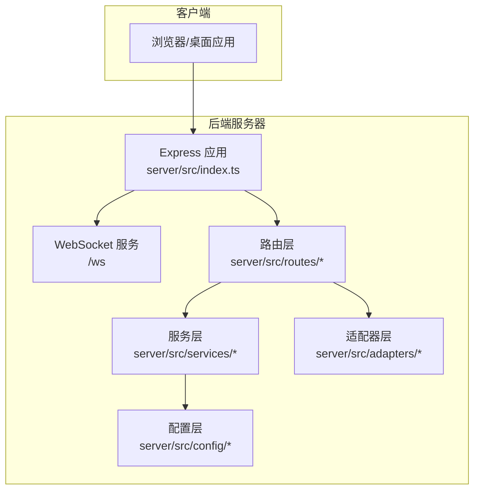
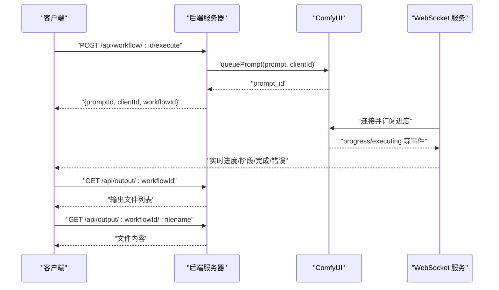
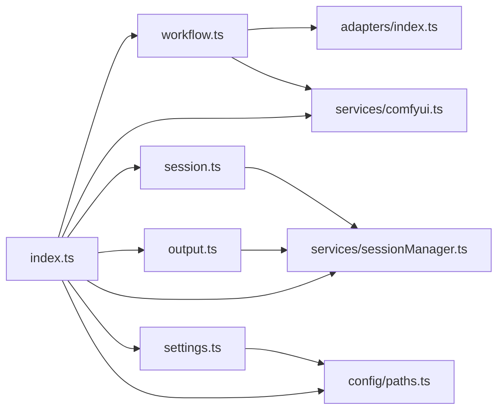

# RESTful API 接口

<cite>
**本文引用的文件**
- [server/src/index.ts](file://server/src/index.ts)
- [server/src/routes/workflow.ts](file://server/src/routes/workflow.ts)
- [server/src/routes/modelMeta.ts](file://server/src/routes/modelMeta.ts)
- [server/src/routes/session.ts](file://server/src/routes/session.ts)
- [server/src/routes/output.ts](file://server/src/routes/output.ts)
- [server/src/routes/settings.ts](file://server/src/routes/settings.ts)
- [server/src/services/comfyui.ts](file://server/src/services/comfyui.ts)
- [server/src/services/sessionManager.ts](file://server/src/services/sessionManager.ts)
- [server/src/config/paths.ts](file://server/src/config/paths.ts)
- [server/src/adapters/index.ts](file://server/src/adapters/index.ts)
- [server/src/types/index.ts](file://server/src/types/index.ts)
- [client/src/services/api.ts](file://client/src/services/api.ts)
</cite>

## 目录
1. [简介](#简介)
2. [项目结构](#项目结构)
3. [核心组件](#核心组件)
4. [架构总览](#架构总览)
5. [详细接口规范](#详细接口规范)
6. [依赖关系分析](#依赖关系分析)
7. [性能考量](#性能考量)
8. [故障排查指南](#故障排查指南)
9. [结论](#结论)

## 简介
本文件为 CorineKit Pix2Real 的 RESTful API 接口文档，覆盖以下主要接口族：
- 工作流执行接口：POST /api/workflow/:id/execute
- 模型管理接口：GET /api/workflow/models/*
- 会话管理接口：GET/POST /api/session/* 与 /api/session-files/*
- 输出文件管理接口：GET/DELETE /api/output/*
- 设置管理接口：GET/POST /api/settings/*
- 会话文件访问接口：GET /api/session-files/*
- 其他辅助接口：GET /api/comfyui/status

接口设计遵循统一的错误处理与响应格式，并提供身份验证、请求头、文件上传格式与数据类型约束说明。同时给出 curl 命令示例与 JavaScript 客户端调用示例，帮助快速集成。

## 项目结构
后端采用 Express + WebSocket 架构，路由集中在 server/src/routes 下，业务逻辑分布在 services 与 adapters 中；前端通过 client/src/services 调用后端接口。

图表来源
- [server/src/index.ts:118-146](file://server/src/index.ts#L118-L146)
- [server/src/routes/workflow.ts:29](file://server/src/routes/workflow.ts#L29)
- [server/src/routes/session.ts:18](file://server/src/routes/session.ts#L18)
- [server/src/routes/output.ts:11](file://server/src/routes/output.ts#L11)
- [server/src/routes/settings.ts:19](file://server/src/routes/settings.ts#L19)
- [server/src/services/comfyui.ts:168](file://server/src/services/comfyui.ts#L168)
- [server/src/services/sessionManager.ts:11](file://server/src/services/sessionManager.ts#L11)
- [server/src/config/paths.ts:74](file://server/src/config/paths.ts#L74)
- [server/src/adapters/index.ts:14](file://server/src/adapters/index.ts#L14)

章节来源
- [server/src/index.ts:118-146](file://server/src/index.ts#L118-L146)
- [server/src/index.ts:157-494](file://server/src/index.ts#L157-L494)

## 核心组件
- Express 应用与中间件：CORS、JSON 解析、静态资源挂载
- WebSocket 服务：连接 ComfyUI 并向客户端推送进度、完成与错误事件
- 路由层：按功能划分的 REST 接口
- 服务层：与 ComfyUI 交互、会话持久化、路径与配置管理
- 适配器层：不同工作流的模板与参数构建

章节来源
- [server/src/index.ts:118-146](file://server/src/index.ts#L118-L146)
- [server/src/services/comfyui.ts:168-196](file://server/src/services/comfyui.ts#L168-L196)
- [server/src/services/sessionManager.ts:11-122](file://server/src/services/sessionManager.ts#L11-L122)
- [server/src/adapters/index.ts:14-30](file://server/src/adapters/index.ts#L14-L30)

## 架构总览
后端通过 Express 提供 REST 接口，同时通过 WebSocket 与 ComfyUI 实时通信，将工作流执行进度与结果推送给前端。会话数据与输出文件存储在可配置的目录中，支持跨平台文件打开与封面生成等操作。

图表来源
- [server/src/routes/workflow.ts:750-799](file://server/src/routes/workflow.ts#L750-L799)
- [server/src/services/comfyui.ts:168-196](file://server/src/services/comfyui.ts#L168-L196)
- [server/src/index.ts:157-494](file://server/src/index.ts#L157-L494)
- [server/src/routes/output.ts:27-78](file://server/src/routes/output.ts#L27-L78)

## 详细接口规范

### 通用约定
- 基础地址：http://localhost:3000（可通过环境变量 PORT 修改）
- 身份验证：无内置鉴权，建议在生产环境配合反向代理或网关进行鉴权与 HTTPS
- 请求头：
  - Content-Type: application/json（JSON 请求体）
  - multipart/form-data（文件上传）
- 响应格式：统一为 JSON；成功通常返回数据对象，错误返回 { error: "..." }
- 错误码：HTTP 状态码；错误消息来自后端或友好映射

章节来源
- [server/src/index.ts:122-125](file://server/src/index.ts#L122-L125)
- [server/src/routes/workflow.ts:129-150](file://server/src/routes/workflow.ts#L129-L150)

---

### 工作流执行接口
- 路径：POST /api/workflow/:id/execute
- 描述：根据工作流 ID 执行对应的工作流，支持上传输入文件并传递参数
- 路径参数
  - id: number（工作流编号）
- 查询参数
  - clientId: string（必填，用于 WebSocket 进度跟踪）
- 表单字段（multipart/form-data）
  - image: File（部分工作流需要输入图像）
  - prompt: string（可选，用户提示词）
  - options: string（可选，JSON 字符串，解析为对象）
- 请求体（JSON，部分工作流）
  - clientId: string（必填）
  - model: string（可选，模型名称）
  - loras: Array（可选，LoRA 列表）
  - prompt: string（可选）
  - negativePrompt: string（可选）
  - width/height: number（可选）
  - steps/cfg/sampler/scheduler: number/string（可选）
  - name: string（可选，输出文件名前缀）
  - seed: number（可选）
  - referenceImage: string（可选，PRO 工作流）
  - depthStrength/poseStrength: number（可选，PRO 工作流）
  - backPose: boolean（可选，某些工作流）
  - image/mask: File（可选，多文件上传）
  - targetImage/faceImage: File（可选，换脸工作流）
- 成功响应
  - promptId: string（ComfyUI prompt_id）
  - clientId: string
  - workflowId: number
  - workflowName: string
- 错误
  - 400：缺少必要参数或文件
  - 500：ComfyUI 错误映射为用户友好提示

curl 示例
- 单文件工作流（如 0/2/5/8/10）
  - curl -X POST "http://localhost:3000/api/workflow/0/execute?clientId=xxx" -F "image=@input.png" -F "prompt=你的提示词"
- JSON 参数工作流（如 7/9）
  - curl -X POST "http://localhost:3000/api/workflow/7/execute" -H "Content-Type: application/json" -d '{"clientId":"xxx","model":"ckpt","prompt":"...","width":512,"height":512,...}'
- 多文件工作流（如 5/10）
  - curl -X POST "http://localhost:3000/api/workflow/5/execute?clientId=xxx" -F "image=@img.png" -F "mask=@mask.png"

JavaScript 客户端示例
- 使用 fetch 发送 JSON 参数工作流
  - 参考：[client/src/services/api.ts:23-31](file://client/src/services/api.ts#L23-L31)
- 使用 FormData 发送单文件工作流
  - 参考：[server/src/routes/workflow.ts:750-799](file://server/src/routes/workflow.ts#L750-L799)

章节来源
- [server/src/routes/workflow.ts:750-799](file://server/src/routes/workflow.ts#L750-L799)
- [server/src/routes/workflow.ts:269-405](file://server/src/routes/workflow.ts#L269-L405)
- [server/src/routes/workflow.ts:485-593](file://server/src/routes/workflow.ts#L485-L593)
- [server/src/routes/workflow.ts:595-642](file://server/src/routes/workflow.ts#L595-L642)
- [server/src/routes/workflow.ts:163-215](file://server/src/routes/workflow.ts#L163-L215)
- [server/src/routes/workflow.ts:217-267](file://server/src/routes/workflow.ts#L217-L267)

---

### 模型管理接口
- 路径：GET /api/workflow/models/*
- 描述：查询可用模型列表（检查点、UNet、LoRA）
- 子路径
  - /checkpoints：返回可用检查点模型名称数组
  - /unets：返回可用 UNet 模型名称数组
  - /loras：返回可用 LoRA 模型名称数组
- 成功响应：字符串数组
- 错误
  - 502：无法从 ComfyUI 获取模型列表

curl 示例
- curl "http://localhost:3000/api/workflow/models/checkpoints"
- curl "http://localhost:3000/api/workflow/models/unets"
- curl "http://localhost:3000/api/workflow/models/loras"

章节来源
- [server/src/routes/workflow.ts:407-435](file://server/src/routes/workflow.ts#L407-L435)
- [server/src/services/comfyui.ts:415-440](file://server/src/services/comfyui.ts#L415-L440)

---

### 会话管理接口
- 路径：/api/session/*
- 描述：管理会话状态、输入图像、遮罩、封面与卡片重命名
- 子路径
  - POST /api/session/:sessionId/images
    - 表单字段：image(File)、tabId(number)、imageId(string)
    - 成功响应：{ url: string }
  - POST /api/session/:sessionId/masks
    - 表单字段：mask(File PNG)、tabId(number)、maskKey(string)
    - 成功响应：{ ok: true }
  - PUT /api/session/:sessionId/state
    - 请求体：{ activeTab: number, tabData: object }
    - 成功响应：{ ok: true }
  - POST /api/session/:sessionId/state
    - 请求体：{ activeTab: number, tabData: object }
    - 成功响应：{ ok: true }
  - GET /api/session/:sessionId
    - 成功响应：会话状态对象（含 createdAt/updatedAt/activeTab/tabData 等）
  - GET /api/sessions
    - 成功响应：会话元数据数组（按 updatedAt 降序）
  - POST /api/session/:sessionId/cover
    - 请求体：{ sourceUrl: string }
    - 成功响应：{ coverUrl: string }
  - DELETE /api/session/:sessionId
    - 成功响应：{ ok: true }
  - POST /api/session/:sessionId/rename-card
    - 请求体：{ tabId: number, imageId: string, label: string }
    - 成功响应：重命名结果对象
  - POST /api/session/:sessionId/rename-cards-batch
    - 请求体：{ tabId: number, items: Array<{ imageId: string; label: string }> }
    - 成功响应：{ results: Array }

curl 示例
- 上传输入图像：curl -X POST "http://localhost:3000/api/session/sess1/images" -F "image=@img.png" -F "tabId=0" -F "imageId=id1"
- 保存会话状态：curl -X PUT "http://localhost:3000/api/session/sess1/state" -H "Content-Type: application/json" -d '{"activeTab":0,"tabData":{}}'
- 生成封面：curl -X POST "http://localhost:3000/api/session/sess1/cover" -H "Content-Type: application/json" -d '{"sourceUrl":"/api/session-files/sess1/tab-0/output/xxx.png"}'

章节来源
- [server/src/routes/session.ts:21-160](file://server/src/routes/session.ts#L21-L160)
- [server/src/services/sessionManager.ts:22-122](file://server/src/services/sessionManager.ts#L22-L122)
- [server/src/services/sessionManager.ts:178-218](file://server/src/services/sessionManager.ts#L178-L218)
- [server/src/services/sessionManager.ts:256-360](file://server/src/services/sessionManager.ts#L256-L360)
- [server/src/services/sessionManager.ts:381-538](file://server/src/services/sessionManager.ts#L381-L538)

---

### 会话文件访问接口
- 路径：/api/session-files/*
- 描述：动态访问 sessions 目录下的文件，支持输入、输出、遮罩与封面
- 静态挂载：/api/session-files -> sessionsBase（运行时可配置）
- 注意：路径解析基于当前 sessionsBase，设置面板切换后无需重启

curl 示例
- curl "http://localhost:3000/api/session-files/sess1/tab-0/input/xxx.png"

章节来源
- [server/src/index.ts:137-139](file://server/src/index.ts#L137-L139)
- [server/src/config/paths.ts:74](file://server/src/config/paths.ts#L74)

---

### 输出文件管理接口
- 路径：/api/output/*
- 描述：列出与下载工作流输出文件，以及打开文件
- 子路径
  - GET /api/output/:workflowId
    - 成功响应：文件信息数组（包含 filename/size/createdAt/url）
  - GET /api/output/:workflowId/:filename
    - 成功响应：文件内容（二进制）
  - POST /api/output/open-file
    - 请求体：{ url: string }（支持 /api/output/、/output/、/api/session-files/）
    - 成功响应：{ ok: true }

curl 示例
- 列出输出：curl "http://localhost:3000/api/output/7"
- 下载文件：curl -O "http://localhost:3000/api/output/7/xxx.png"
- 打开文件：curl -X POST "http://localhost:3000/api/output/open-file" -H "Content-Type: application/json" -d '{"url":"/api/output/7/xxx.png"}'

章节来源
- [server/src/routes/output.ts:27-78](file://server/src/routes/output.ts#L27-L78)
- [server/src/routes/output.ts:80-136](file://server/src/routes/output.ts#L80-L136)

---

### 设置管理接口
- 路径：/api/settings/*
- 描述：管理服务端设置（当前为 sessionsBase 路径）
- 子路径
  - GET /api/settings
    - 成功响应：{ sessionsBase: string, defaultSessionsBase: string }
  - PUT /api/settings
    - 请求体：{ sessionsBase: string|null }
    - 成功响应：同 GET
  - POST /api/settings/browse-folder
    - 请求体：{ initialPath: string }
    - 成功响应：{ path: string } 或 { cancelled: true } 或 { error: string }

curl 示例
- 读取设置：curl "http://localhost:3000/api/settings"
- 切换路径：curl -X PUT "http://localhost:3000/api/settings" -H "Content-Type: application/json" -d '{"sessionsBase":"绝对路径"}'
- 浏览目录（Windows）：curl -X POST "http://localhost:3000/api/settings/browse-folder" -H "Content-Type: application/json" -d '{"initialPath":"C:\\\\Users\\\\..."}'

章节来源
- [server/src/routes/settings.ts:21-103](file://server/src/routes/settings.ts#L21-L103)
- [server/src/config/paths.ts:74-137](file://server/src/config/paths.ts#L74-L137)

---

### ComfyUI 状态查询接口
- 路径：GET /api/comfyui/status
- 描述：查询 ComfyUI 是否运行
- 成功响应：{ running: boolean }

curl 示例
- curl "http://localhost:3000/api/comfyui/status"

章节来源
- [server/src/index.ts:147-155](file://server/src/index.ts#L147-L155)

---

### WebSocket 进度事件
- 路径：ws://localhost:3000/ws
- 描述：连接后接收进度、阶段、完成与错误事件；需先发送注册消息以绑定 promptId 与工作流/会话
- 注册消息
  - { type: "register", promptId: string, workflowId: number, sessionId?: string, tabId?: number }
- 事件类型
  - execution_start：工作流开始
  - progress：{ value, max, percentage, stage, stepIndex, stepTotal }
  - complete：{ outputs: [{ filename, url }] }
  - error：{ message }

章节来源
- [server/src/index.ts:157-494](file://server/src/index.ts#L157-L494)
- [server/src/services/comfyui.ts:265-375](file://server/src/services/comfyui.ts#L265-L375)

---

## 依赖关系分析

图表来源
- [server/src/routes/workflow.ts:12](file://server/src/routes/workflow.ts#L12)
- [server/src/adapters/index.ts:14](file://server/src/adapters/index.ts#L14)
- [server/src/services/comfyui.ts:168](file://server/src/services/comfyui.ts#L168)
- [server/src/routes/session.ts:16](file://server/src/routes/session.ts#L16)
- [server/src/services/sessionManager.ts:11](file://server/src/services/sessionManager.ts#L11)
- [server/src/routes/output.ts:6](file://server/src/routes/output.ts#L6)
- [server/src/routes/settings.ts:13](file://server/src/routes/settings.ts#L13)
- [server/src/config/paths.ts:74](file://server/src/config/paths.ts#L74)
- [server/src/index.ts:8-18](file://server/src/index.ts#L8-L18)

章节来源
- [server/src/index.ts:8-18](file://server/src/index.ts#L8-L18)

## 性能考量
- 上传限制：Express JSON 解析限制为 50MB，适合大体积图像/视频上传
- WebSocket 进度：基于节点权重的全局进度估算，避免 UI 回退
- 输出下载：完成后异步下载至会话输出目录，减少前端阻塞
- 模型列表：直接转发 ComfyUI object_info 接口，网络延迟为主要瓶颈

章节来源
- [server/src/index.ts:127](file://server/src/index.ts#L127)
- [server/src/index.ts:240-271](file://server/src/index.ts#L240-L271)
- [server/src/services/comfyui.ts:415-440](file://server/src/services/comfyui.ts#L415-L440)

## 故障排查指南
- 400 错误
  - 缺少 clientId、缺少必要文件或参数
  - 参考：[server/src/routes/workflow.ts:163-183](file://server/src/routes/workflow.ts#L163-L183)、[server/src/routes/session.ts:28-31](file://server/src/routes/session.ts#L28-L31)
- 500 错误
  - 通用错误映射：ComfyUI 报错转换为用户友好提示
  - 参考：[server/src/routes/workflow.ts:129-150](file://server/src/routes/workflow.ts#L129-L150)
- 404 错误
  - 文件不存在（输出/会话文件）
  - 参考：[server/src/routes/output.ts:72-75](file://server/src/routes/output.ts#L72-L75)、[server/src/routes/session.ts:77-81](file://server/src/routes/session.ts#L77-L81)
- ComfyUI 未运行
  - 通过 /api/comfyui/status 检查状态
  - 参考：[server/src/index.ts:147-155](file://server/src/index.ts#L147-L155)

章节来源
- [server/src/routes/workflow.ts:129-150](file://server/src/routes/workflow.ts#L129-L150)
- [server/src/routes/output.ts:72-75](file://server/src/routes/output.ts#L72-L75)
- [server/src/routes/session.ts:77-81](file://server/src/routes/session.ts#L77-L81)
- [server/src/index.ts:147-155](file://server/src/index.ts#L147-L155)

## 结论
本文档提供了 CorineKit Pix2Real 的完整 RESTful API 接口规范，涵盖工作流执行、模型查询、会话管理、输出文件与设置管理等核心功能。结合 WebSocket 进度事件，可实现完整的离线/在线工作流体验。建议在生产环境中增加鉴权、HTTPS 与日志审计，并根据实际硬件条件调整上传大小限制与并发策略。