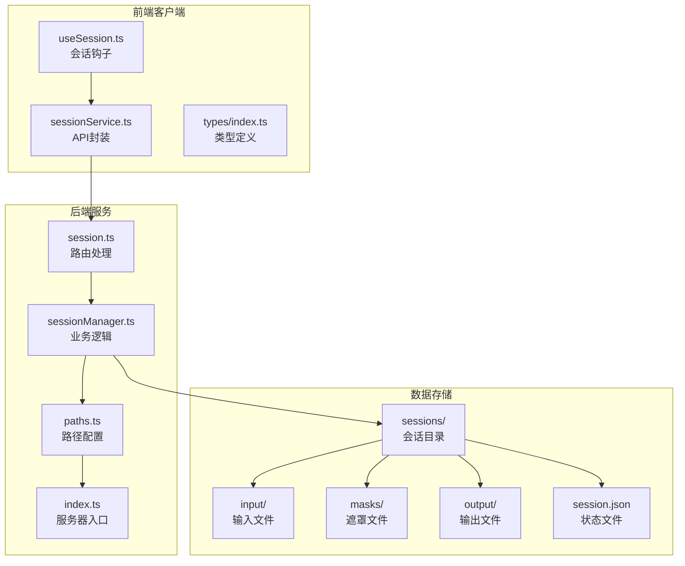
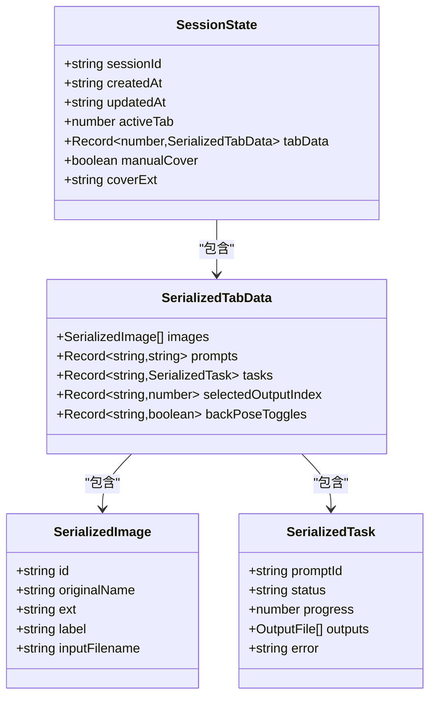
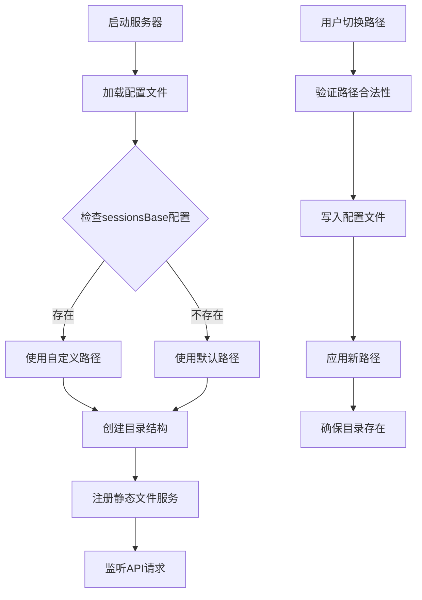
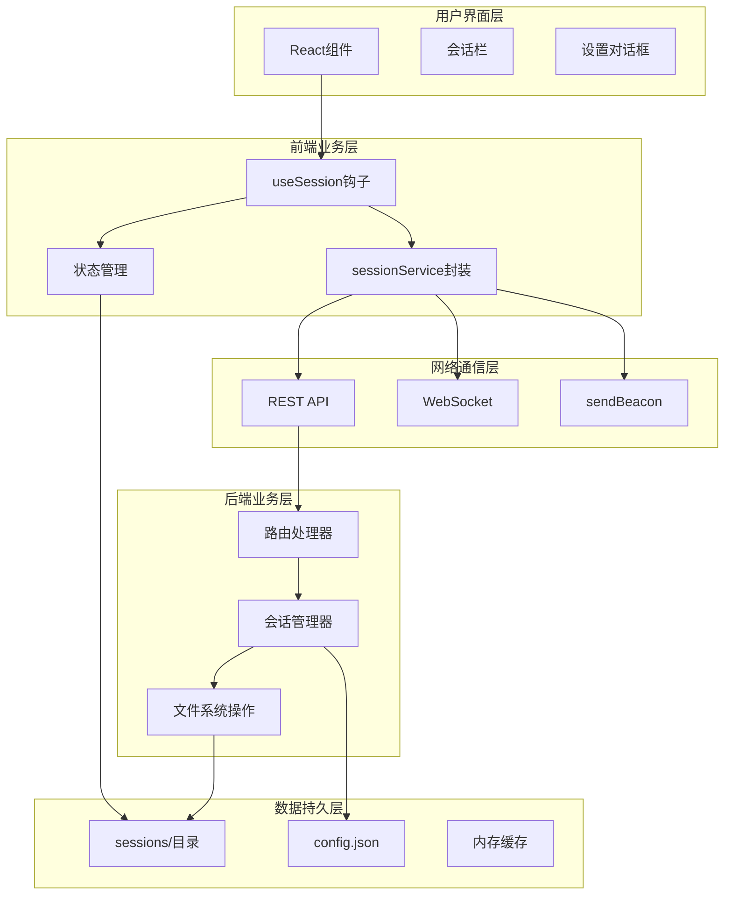
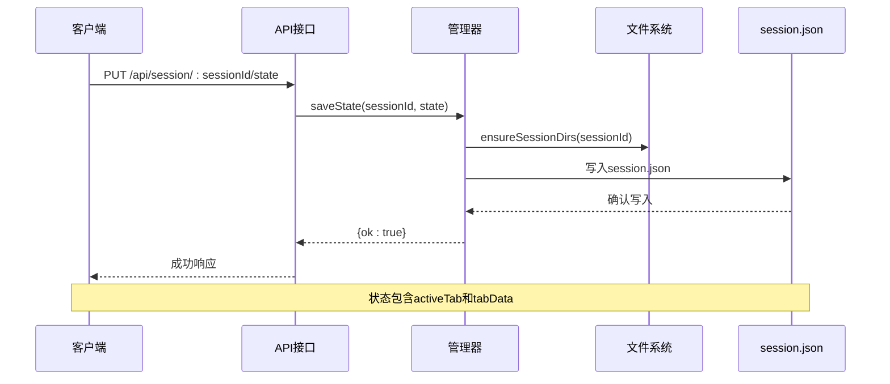
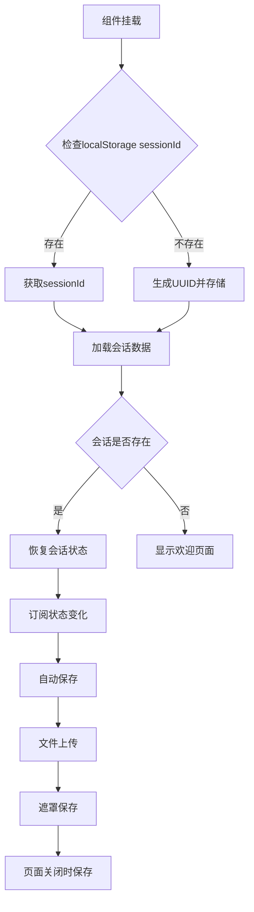
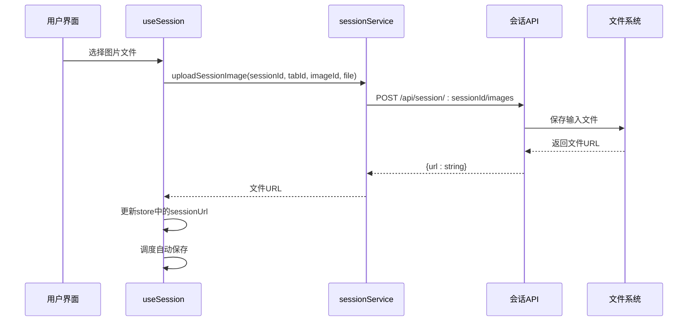
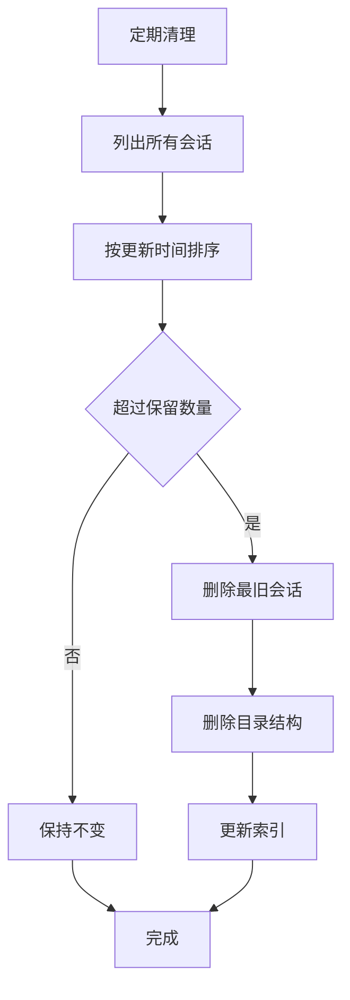
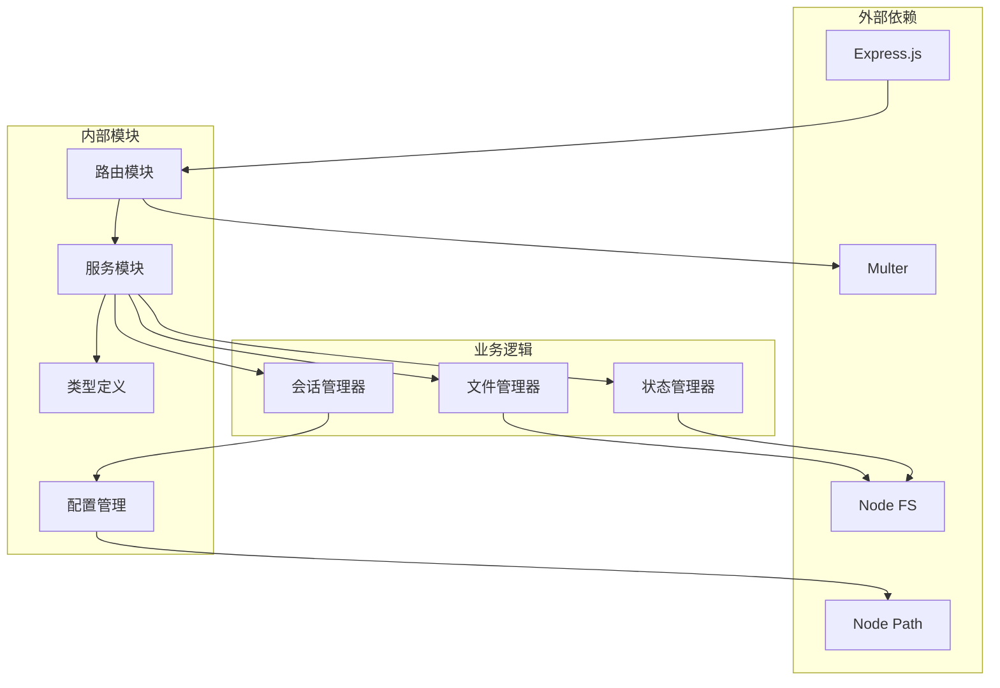

# 会话管理接口

<cite>
**本文引用的文件**
- [server/src/routes/session.ts](file://server/src/routes/session.ts)
- [server/src/services/sessionManager.ts](file://server/src/services/sessionManager.ts)
- [client/src/hooks/useSession.ts](file://client/src/hooks/useSession.ts)
- [client/src/services/sessionService.ts](file://client/src/services/sessionService.ts)
- [server/src/config/paths.ts](file://server/src/config/paths.ts)
- [server/src/index.ts](file://server/src/index.ts)
- [client/src/types/index.ts](file://client/src/types/index.ts)
- [TODO-session-persistence.md](file://TODO-session-persistence.md)
</cite>

## 目录
1. [简介](#简介)
2. [项目结构](#项目结构)
3. [核心组件](#核心组件)
4. [架构概览](#架构概览)
5. [详细组件分析](#详细组件分析)
6. [依赖关系分析](#依赖关系分析)
7. [性能考虑](#性能考虑)
8. [故障排除指南](#故障排除指南)
9. [结论](#结论)

## 简介

CorineKit Pix2Real 的会话管理接口提供了完整的会话生命周期管理功能，支持用户在不同标签页之间共享状态、持久化会话数据以及跨设备恢复工作进度。该系统采用前后端分离的架构设计，前端负责状态收集和用户交互，后端负责数据持久化和文件存储。

会话管理系统的核心特性包括：
- 多标签页状态同步
- 会话数据持久化
- 文件上传和下载
- 会话历史管理
- 路径配置和迁移

## 项目结构

会话管理功能分布在以下主要文件中：



**图表来源**
- [server/src/routes/session.ts:1-163](file://server/src/routes/session.ts#L1-L163)
- [server/src/services/sessionManager.ts:1-539](file://server/src/services/sessionManager.ts#L1-L539)
- [client/src/hooks/useSession.ts:1-435](file://client/src/hooks/useSession.ts#L1-L435)

**章节来源**
- [server/src/routes/session.ts:1-163](file://server/src/routes/session.ts#L1-L163)
- [server/src/services/sessionManager.ts:1-539](file://server/src/services/sessionManager.ts#L1-L539)
- [client/src/hooks/useSession.ts:1-435](file://client/src/hooks/useSession.ts#L1-L435)

## 核心组件

### 会话状态数据结构

会话管理系统的核心数据结构定义如下：



**图表来源**
- [server/src/services/sessionManager.ts:66-100](file://server/src/services/sessionManager.ts#L66-L100)
- [client/src/services/sessionService.ts:69-86](file://client/src/services/sessionService.ts#L69-L86)

### 路径配置系统

会话文件存储采用灵活的路径配置机制：



**图表来源**
- [server/src/config/paths.ts:35-100](file://server/src/config/paths.ts#L35-L100)
- [server/src/index.ts:103-139](file://server/src/index.ts#L103-L139)

**章节来源**
- [server/src/services/sessionManager.ts:66-100](file://server/src/services/sessionManager.ts#L66-L100)
- [server/src/config/paths.ts:35-100](file://server/src/config/paths.ts#L35-L100)
- [client/src/types/index.ts:1-76](file://client/src/types/index.ts#L1-L76)

## 架构概览

会话管理系统的整体架构采用分层设计：



**图表来源**
- [client/src/hooks/useSession.ts:118-435](file://client/src/hooks/useSession.ts#L118-L435)
- [client/src/services/sessionService.ts:1-232](file://client/src/services/sessionService.ts#L1-L232)
- [server/src/routes/session.ts:1-163](file://server/src/routes/session.ts#L1-L163)

## 详细组件分析

### 会话路由处理

会话路由系统提供了完整的CRUD操作接口：

| 接口 | 方法 | 路径 | 功能描述 |
|------|------|------|----------|
| 上传输入图片 | POST | `/api/session/:sessionId/images` | 上传输入图像文件 |
| 上传遮罩文件 | POST | `/api/session/:sessionId/masks` | 上传遮罩PNG文件 |
| 保存会话状态 | PUT | `/api/session/:sessionId/state` | 保存会话状态（正常保存） |
| 保存会话状态 | POST | `/api/session/:sessionId/state` | 保存会话状态（页面关闭时） |
| 获取会话详情 | GET | `/api/session/:sessionId` | 获取指定会话的完整信息 |
| 列出会话 | GET | `/api/session` | 列出最近的会话（最多5个） |
| 设置封面 | POST | `/api/session/:sessionId/cover` | 设置会话封面图片 |
| 删除会话 | DELETE | `/api/session/:sessionId` | 删除指定会话 |

**章节来源**
- [server/src/routes/session.ts:21-163](file://server/src/routes/session.ts#L21-L163)

### 会话状态管理

会话状态管理器负责核心业务逻辑：



**图表来源**
- [server/src/routes/session.ts:54-71](file://server/src/routes/session.ts#L54-L71)
- [server/src/services/sessionManager.ts:102-122](file://server/src/services/sessionManager.ts#L102-L122)

**章节来源**
- [server/src/services/sessionManager.ts:102-122](file://server/src/services/sessionManager.ts#L102-L122)

### 前端会话钩子

前端useSession钩子实现了完整的会话生命周期管理：



**图表来源**
- [client/src/hooks/useSession.ts:118-400](file://client/src/hooks/useSession.ts#L118-L400)

**章节来源**
- [client/src/hooks/useSession.ts:118-435](file://client/src/hooks/useSession.ts#L118-L435)

### 文件上传处理

文件上传系统支持多种文件类型和格式：



**图表来源**
- [client/src/services/sessionService.ts:90-104](file://client/src/services/sessionService.ts#L90-L104)
- [server/src/routes/session.ts:21-36](file://server/src/routes/session.ts#L21-L36)

**章节来源**
- [client/src/services/sessionService.ts:90-119](file://client/src/services/sessionService.ts#L90-L119)
- [server/src/services/sessionManager.ts:22-35](file://server/src/services/sessionManager.ts#L22-L35)

### 会话清理机制

系统提供了会话清理和维护功能：



**图表来源**
- [server/src/services/sessionManager.ts:220-226](file://server/src/services/sessionManager.ts#L220-L226)

**章节来源**
- [server/src/services/sessionManager.ts:220-226](file://server/src/services/sessionManager.ts#L220-L226)

## 依赖关系分析

会话管理系统的依赖关系如下：



**图表来源**
- [server/src/routes/session.ts:1-16](file://server/src/routes/session.ts#L1-L16)
- [server/src/services/sessionManager.ts:1-7](file://server/src/services/sessionManager.ts#L1-L7)

**章节来源**
- [server/src/routes/session.ts:1-16](file://server/src/routes/session.ts#L1-L16)
- [server/src/services/sessionManager.ts:1-7](file://server/src/services/sessionManager.ts#L1-L7)

## 性能考虑

会话管理系统在性能方面采用了多项优化策略：

### 1. 自动保存机制
- **防抖处理**：500ms防抖延迟，避免频繁保存
- **条件保存**：仅在状态真正变化时保存
- **空会话优化**：空会话不进行持久化

### 2. 文件上传优化
- **异步上传**：图片上传采用异步方式，不影响UI响应
- **重复上传检测**：避免重复上传已存在的文件
- **内存管理**：及时释放上传过程中的临时资源

### 3. 内存优化
- **懒加载**：会话数据按需加载
- **缓存策略**：合理使用浏览器缓存
- **资源清理**：及时清理不再使用的资源

### 4. 网络优化
- **批量操作**：支持批量重命名等原子操作
- **错误重试**：网络异常时自动重试
- **超时控制**：合理的请求超时设置

## 故障排除指南

### 常见问题及解决方案

#### 1. 会话无法恢复
**症状**：页面刷新后会话丢失
**可能原因**：
- sessionId未正确存储在localStorage
- 会话文件损坏
- 路径配置错误

**解决方法**：
```javascript
// 检查sessionId存储
const sessionId = localStorage.getItem('pix2real_session_id');
console.log('Current sessionId:', sessionId);

// 检查会话文件
const session = await getSession(sessionId);
console.log('Session data:', session);
```

#### 2. 文件上传失败
**症状**：图片或遮罩无法上传
**可能原因**：
- 网络连接问题
- 文件大小超出限制
- 权限不足

**解决方法**：
```javascript
// 检查文件大小
if (file.size > 50 * 1024 * 1024) {
    throw new Error('File too large (max 50MB)');
}

// 检查文件类型
const allowedTypes = ['image/jpeg', 'image/png', 'image/gif'];
if (!allowedTypes.includes(file.type)) {
    throw new Error('Invalid file type');
}
```

#### 3. 路径配置问题
**症状**：会话文件存储路径不正确
**解决方法**：
```javascript
// 验证路径
const validation = await validateSessionsBase(newPath);
if (validation) {
    console.error('Path validation failed:', validation);
    return;
}

// 更新路径
await updateSessionsPath(newPath);
```

#### 4. 性能问题
**症状**：页面响应缓慢
**解决方法**：
- 检查自动保存频率
- 监控文件上传进度
- 清理不必要的会话

**章节来源**
- [client/src/hooks/useSession.ts:168-179](file://client/src/hooks/useSession.ts#L168-L179)
- [server/src/config/paths.ts:106-137](file://server/src/config/paths.ts#L106-L137)

## 结论

CorineKit Pix2Real 的会话管理接口提供了一个完整、可靠的会话生命周期管理解决方案。系统通过前后端协作，实现了多标签页状态同步、会话数据持久化、文件上传下载等功能。

### 主要优势

1. **可靠性**：采用文件系统持久化，数据安全可靠
2. **可扩展性**：模块化设计，易于添加新功能
3. **用户体验**：自动保存、状态恢复等提升用户体验
4. **性能优化**：防抖、缓存等优化策略

### 技术特点

- **前后端分离**：清晰的职责划分
- **类型安全**：完整的TypeScript类型定义
- **错误处理**：完善的错误处理机制
- **配置灵活**：支持动态路径配置

### 未来发展

系统可以进一步优化的方向包括：
- 增加会话版本控制
- 支持云端同步
- 优化大数据量处理
- 增强并发控制