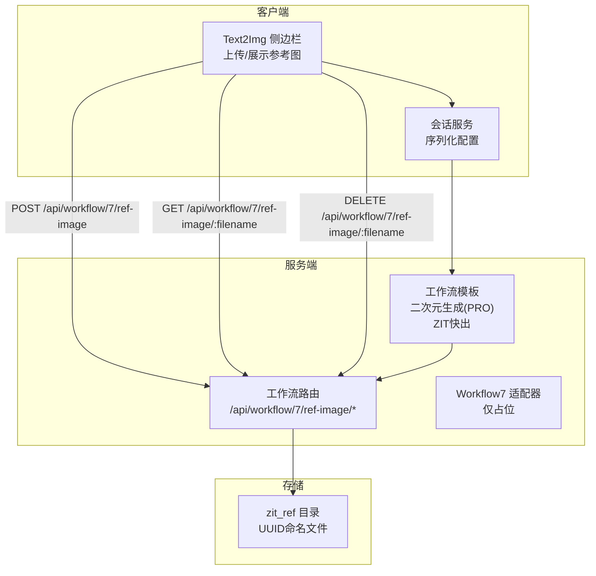
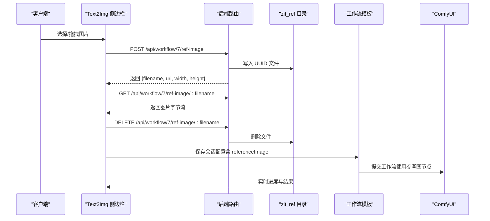
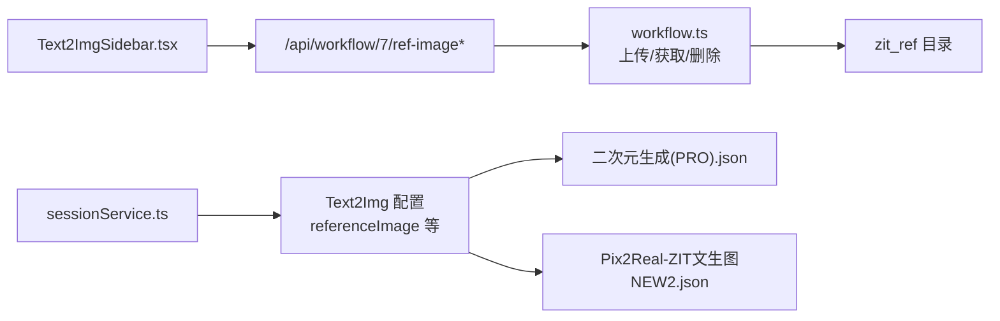

# 参考图像管理

<cite>
**本文引用的文件**
- [server/src/routes/workflow.ts](file://server/src/routes/workflow.ts)
- [server/src/adapters/Workflow7Adapter.ts](file://server/src/adapters/Workflow7Adapter.ts)
- [client/src/components/Text2ImgSidebar.tsx](file://client/src/components/Text2ImgSidebar.tsx)
- [client/src/services/sessionService.ts](file://client/src/services/sessionService.ts)
- [ComfyUI_API/二次元生成 (PRO).json](file://ComfyUI_API/二次元生成 (PRO).json)
- [ComfyUI_API/Pix2Real-ZIT文生图NEW2.json](file://ComfyUI_API/Pix2Real-ZIT文生图NEW2.json)
- [server/src/config/paths.ts](file://server/src/config/paths.ts)
</cite>

## 目录
1. [简介](#简介)
2. [项目结构](#项目结构)
3. [核心组件](#核心组件)
4. [架构总览](#架构总览)
5. [详细组件分析](#详细组件分析)
6. [依赖关系分析](#依赖关系分析)
7. [性能考量](#性能考量)
8. [故障排查指南](#故障排查指南)
9. [结论](#结论)
10. [附录](#附录)

## 简介
本章节面向 ZIT 快出工作流（Workflow 7）中的参考图像管理功能，提供完整的 API 文档与最佳实践说明。参考图像用于指导生成过程，使输出更贴合用户提供的参考图风格与构图。本文涵盖：
- 参考图像上传、获取与删除的完整 API 流程
- 支持的图像格式与尺寸解析机制
- 在 ZIT 快出工作流中的配置与使用方式
- 存储策略与安全建议

## 项目结构
参考图像管理位于后端路由模块中，配合前端侧的上传交互与会话持久化，形成闭环的数据流。

图表来源
- [server/src/routes/workflow.ts:440-483](file://server/src/routes/workflow.ts#L440-L483)
- [client/src/components/Text2ImgSidebar.tsx:642-671](file://client/src/components/Text2ImgSidebar.tsx#L642-L671)
- [client/src/services/sessionService.ts:10-27](file://client/src/services/sessionService.ts#L10-L27)
- [ComfyUI_API/二次元生成 (PRO).json](file://ComfyUI_API/二次元生成 (PRO).json#L1-L200)
- [ComfyUI_API/Pix2Real-ZIT文生图NEW2.json:1-200](file://ComfyUI_API/Pix2Real-ZIT文生图NEW2.json#L1-L200)

章节来源
- [server/src/routes/workflow.ts:440-483](file://server/src/routes/workflow.ts#L440-L483)
- [client/src/components/Text2ImgSidebar.tsx:642-671](file://client/src/components/Text2ImgSidebar.tsx#L642-L671)
- [client/src/services/sessionService.ts:10-27](file://client/src/services/sessionService.ts#L10-L27)

## 核心组件
- 参考图像上传接口：POST /api/workflow/7/ref-image
- 参考图像获取接口：GET /api/workflow/7/ref-image/:filename
- 参考图像删除接口：DELETE /api/workflow/7/ref-image/:filename
- 前端上传与展示：Text2Img 侧边栏组件
- 会话配置：包含 referenceImage、poseStrength、depthStrength 等字段
- 工作流模板：二次元生成(PRO)与 ZIT快出模板中使用参考图节点

章节来源
- [server/src/routes/workflow.ts:440-483](file://server/src/routes/workflow.ts#L440-L483)
- [client/src/components/Text2ImgSidebar.tsx:642-671](file://client/src/components/Text2ImgSidebar.tsx#L642-L671)
- [client/src/services/sessionService.ts:10-27](file://client/src/services/sessionService.ts#L10-L27)

## 架构总览
参考图像在 ZIT 快出工作流中的作用与配置流程如下：

图表来源
- [server/src/routes/workflow.ts:440-483](file://server/src/routes/workflow.ts#L440-L483)
- [client/src/components/Text2ImgSidebar.tsx:642-671](file://client/src/components/Text2ImgSidebar.tsx#L642-L671)
- [client/src/services/sessionService.ts:10-27](file://client/src/services/sessionService.ts#L10-L27)
- [ComfyUI_API/二次元生成 (PRO).json](file://ComfyUI_API/二次元生成 (PRO).json#L1-L200)
- [ComfyUI_API/Pix2Real-ZIT文生图NEW2.json:1-200](file://ComfyUI_API/Pix2Real-ZIT文生图NEW2.json#L1-L200)

## 详细组件分析

### 参考图像上传 API
- 请求方法：POST
- 路径：/api/workflow/7/ref-image
- 请求体：multipart/form-data，字段名为 image，值为单个图片文件
- 成功响应：JSON 对象，包含
  - filename：服务器保存的文件名（UUID + 原扩展名）
  - url：访问该文件的相对路径
  - width/height：通过解析图片头信息得到的尺寸（若解析失败为 0）

实现要点
- 使用内存存储上传的二进制缓冲区
- 自动创建 zit_ref 目录（如不存在）
- 以 UUID 命名文件，避免冲突与路径遍历风险
- 解析 PNG/JPEG/WebP 头部以获取宽高

章节来源
- [server/src/routes/workflow.ts:440-458](file://server/src/routes/workflow.ts#L440-L458)
- [server/src/routes/workflow.ts:88-120](file://server/src/routes/workflow.ts#L88-L120)

### 参考图像获取 API
- 请求方法：GET
- 路径：/api/workflow/7/ref-image/:filename
- 参数：filename（路径安全处理，仅允许基础名称）
- 响应：对应扩展名的 Content-Type，随后返回文件字节流
- 支持格式：PNG、JPG、JPEG、GIF、WEBP、BMP

实现要点
- 严格限定文件路径在 zit_ref 目录内
- 通过扩展名映射设置正确的 MIME 类型
- 404：文件不存在

章节来源
- [server/src/routes/workflow.ts:460-474](file://server/src/routes/workflow.ts#L460-L474)

### 参考图像删除 API
- 请求方法：DELETE
- 路径：/api/workflow/7/ref-image/:filename
- 参数：filename
- 响应：JSON 对象，ok: true
- 安全性：忽略删除异常，确保幂等性

章节来源
- [server/src/routes/workflow.ts:476-483](file://server/src/routes/workflow.ts#L476-L483)

### 前端上传与展示
- 上传触发：点击或拖拽图片到指定区域
- 上传逻辑：构造 FormData 并调用 POST /api/workflow/7/ref-image
- 成功后：更新本地状态 referenceImage，并尝试读取宽高以设置比例
- 展示逻辑：通过 GET /api/workflow/7/ref-image/:filename 直接渲染图片
- 删除逻辑：调用 DELETE /api/workflow/7/ref-image/:filename 清理本地状态

章节来源
- [client/src/components/Text2ImgSidebar.tsx:642-671](file://client/src/components/Text2ImgSidebar.tsx#L642-L671)
- [client/src/components/Text2ImgSidebar.tsx:1664-1669](file://client/src/components/Text2ImgSidebar.tsx#L1664-L1669)

### 会话配置与工作流集成
- 会话服务中包含 referenceImage 字段，用于持久化参考图文件名
- 二次元生成(PRO)模板中使用参考图节点（如深度/姿态强度参数）
- ZIT快出模板中也支持通过参考图进行风格约束（具体节点位置以模板为准）

章节来源
- [client/src/services/sessionService.ts:10-27](file://client/src/services/sessionService.ts#L10-L27)
- [ComfyUI_API/二次元生成 (PRO).json](file://ComfyUI_API/二次元生成 (PRO).json#L1-L200)
- [ComfyUI_API/Pix2Real-ZIT文生图NEW2.json:1-200](file://ComfyUI_API/Pix2Real-ZIT文生图NEW2.json#L1-L200)

### Workflow7 适配器
- Workflow7Adapter 仅占位，实际执行使用专用路由 POST /api/workflow/7/execute
- 该适配器不直接暴露 buildPrompt 方法

章节来源
- [server/src/adapters/Workflow7Adapter.ts:1-14](file://server/src/adapters/Workflow7Adapter.ts#L1-L14)

## 依赖关系分析

图表来源
- [client/src/components/Text2ImgSidebar.tsx:642-671](file://client/src/components/Text2ImgSidebar.tsx#L642-L671)
- [server/src/routes/workflow.ts:440-483](file://server/src/routes/workflow.ts#L440-L483)
- [client/src/services/sessionService.ts:10-27](file://client/src/services/sessionService.ts#L10-L27)
- [ComfyUI_API/二次元生成 (PRO).json](file://ComfyUI_API/二次元生成 (PRO).json#L1-L200)
- [ComfyUI_API/Pix2Real-ZIT文生图NEW2.json:1-200](file://ComfyUI_API/Pix2Real-ZIT文生图NEW2.json#L1-L200)

## 性能考量
- 上传采用内存存储（multer.memoryStorage），适合小文件与低并发场景。若需支持大文件或高并发，建议改为临时磁盘写入并结合流式处理。
- 图片尺寸解析仅读取头部字节，时间复杂度低，不影响整体性能。
- 前端直接渲染参考图，建议在移动端开启懒加载与缩略图策略以减少首屏压力。

## 故障排查指南
常见问题与定位步骤
- 上传失败
  - 检查请求体是否为 multipart/form-data 且包含 image 字段
  - 查看后端日志中的错误堆栈
- 获取图片 404
  - 确认文件名是否正确（不含路径分隔符）
  - 确认 zit_ref 目录是否存在且可读
- 删除无效
  - 确认文件确实存在于 zit_ref 目录
  - 检查文件权限与占用情况
- 尺寸为 0
  - 确认上传的是受支持的格式（PNG/JPEG/WebP）
  - 检查文件头是否完整

章节来源
- [server/src/routes/workflow.ts:440-483](file://server/src/routes/workflow.ts#L440-L483)
- [server/src/routes/workflow.ts:88-120](file://server/src/routes/workflow.ts#L88-L120)

## 结论
参考图像管理为 ZIT 快出工作流提供了灵活的风格与构图控制手段。通过简洁的上传/获取/删除 API 与前端直观的交互，用户可以便捷地管理参考图并将其应用于生成流程。建议在生产环境中结合磁盘空间监控与定期清理策略，确保系统长期稳定运行。

## 附录

### API 定义与参数说明
- POST /api/workflow/7/ref-image
  - 请求体：multipart/form-data，字段 image（必填）
  - 响应：{ filename, url, width, height }
- GET /api/workflow/7/ref-image/:filename
  - 路径参数：filename（基础名）
  - 响应：对应格式的图片字节流
- DELETE /api/workflow/7/ref-image/:filename
  - 路径参数：filename（基础名）
  - 响应：{ ok: true }

章节来源
- [server/src/routes/workflow.ts:440-483](file://server/src/routes/workflow.ts#L440-L483)

### 支持的图像格式与尺寸解析
- 支持格式：PNG、JPG、JPEG、GIF、WEBP、BMP
- 尺寸解析：通过读取图片头部字节计算宽高，不依赖第三方库

章节来源
- [server/src/routes/workflow.ts:88-120](file://server/src/routes/workflow.ts#L88-L120)
- [server/src/routes/workflow.ts:467-471](file://server/src/routes/workflow.ts#L467-L471)

### ZIT 快出工作流中的参考图像配置
- 会话配置包含 referenceImage、poseStrength、depthStrength 等字段
- 二次元生成(PRO)与 ZIT快出模板中使用参考图节点进行风格与姿态约束

章节来源
- [client/src/services/sessionService.ts:10-27](file://client/src/services/sessionService.ts#L10-L27)
- [ComfyUI_API/二次元生成 (PRO).json](file://ComfyUI_API/二次元生成 (PRO).json#L1-L200)
- [ComfyUI_API/Pix2Real-ZIT文生图NEW2.json:1-200](file://ComfyUI_API/Pix2Real-ZIT文生图NEW2.json#L1-L200)

### 最佳实践与存储策略
- 命名策略：使用 UUID 生成文件名，避免冲突与路径注入
- 目录管理：zit_ref 目录按需创建，确保可写
- 清理策略：定期扫描并删除长时间未使用的参考图，或在删除卡片时同步清理
- 安全建议：限制文件类型与大小，必要时增加白名单校验
- 性能建议：大文件上传建议改用临时磁盘写入与流式处理

章节来源
- [server/src/routes/workflow.ts:447-451](file://server/src/routes/workflow.ts#L447-L451)
- [server/src/config/paths.ts:1-156](file://server/src/config/paths.ts#L1-L156)