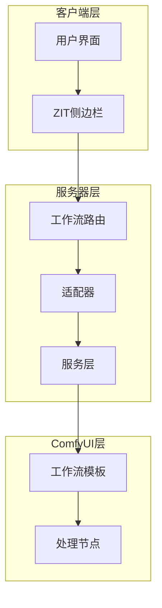
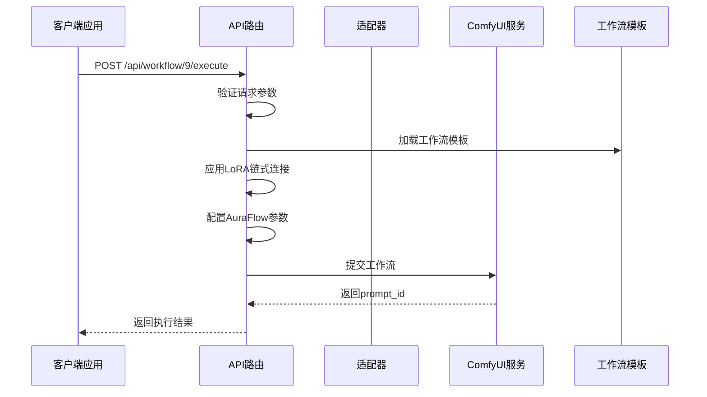
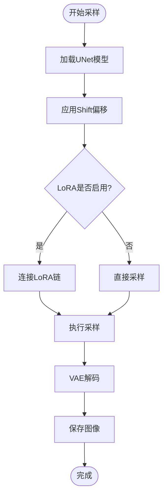
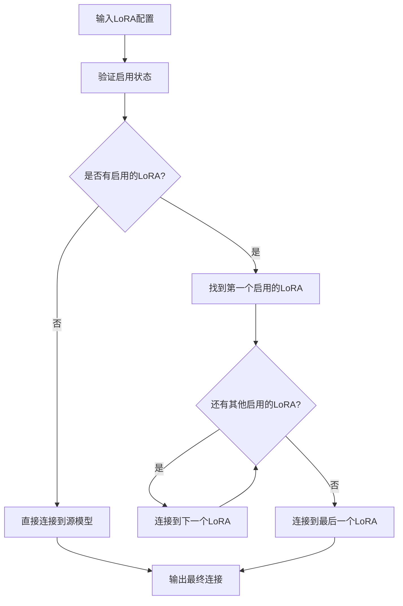
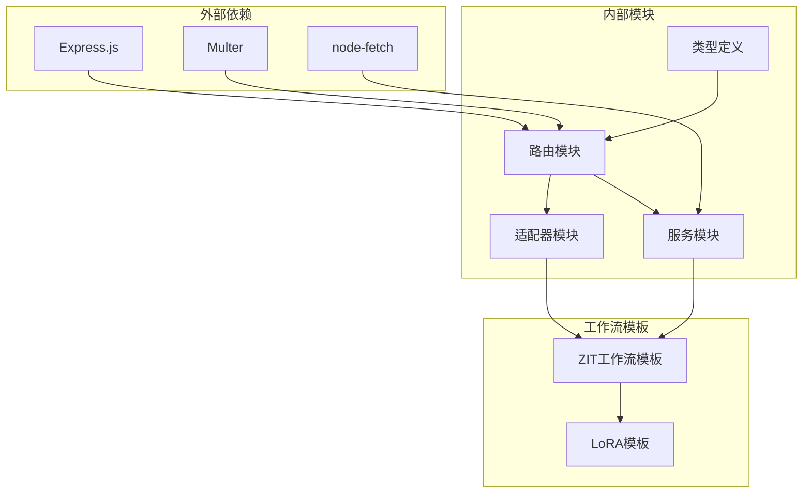

# ZIT快出工作流

<cite>
**本文档引用的文件**
- [workflow.ts](file://server/src/routes/workflow.ts)
- [Workflow9Adapter.ts](file://server/src/adapters/Workflow9Adapter.ts)
- [Pix2Real-ZIT文生图NEW2.json](file://ComfyUI_API/Pix2Real-ZIT文生图NEW2.json)
- [ZITSidebar.tsx](file://client/src/components/ZITSidebar.tsx)
- [index.ts](file://server/src/types/index.ts)
</cite>

## 目录
1. [简介](#简介)
2. [项目结构](#项目结构)
3. [核心组件](#核心组件)
4. [架构概览](#架构概览)
5. [详细组件分析](#详细组件分析)
6. [依赖关系分析](#依赖关系分析)
7. [性能考虑](#性能考虑)
8. [故障排除指南](#故障排除指南)
9. [结论](#结论)
10. [附录](#附录)

## 简介
ZIT快出工作流是基于ComfyUI的高效文生图工作流，专为快速生成高质量图像而设计。该工作流集成了AuraFlow采样算法、动态LoRA链式连接机制和灵活的UNet模型选择功能，能够在保证图像质量的同时显著提升生成效率。

## 项目结构
ZIT快出工作流位于项目的服务器端路由系统中，通过Express.js提供RESTful API接口。整个系统采用模块化设计，将工作流逻辑、适配器模式和前端交互分离。



**图表来源**
- [workflow.ts:486-593](file://server/src/routes/workflow.ts#L486-L593)
- [Workflow9Adapter.ts:1-14](file://server/src/adapters/Workflow9Adapter.ts#L1-L14)

**章节来源**
- [workflow.ts:1-800](file://server/src/routes/workflow.ts#L1-L800)
- [Workflow9Adapter.ts:1-14](file://server/src/adapters/Workflow9Adapter.ts#L1-L14)

## 核心组件
ZIT快出工作流由以下核心组件构成：

### API端点
- **POST /api/workflow/9/execute** - 主要的执行端点，接受JSON格式的请求参数
- **GET /api/workflow/models/unets** - 获取可用的UNet模型列表
- **GET /api/workflow/models/loras** - 获取可用的LoRA模型列表

### 关键特性
1. **AuraFlow采样算法** - 支持Shift偏移参数优化
2. **动态LoRA链式连接** - 支持多层LoRA模型的智能组合
3. **灵活的UNet模型选择** - 支持多种UNet模型的动态切换
4. **实时参数调整** - 支持采样器、调度器、步数、CFG等参数的实时配置

**章节来源**
- [workflow.ts:486-593](file://server/src/routes/workflow.ts#L486-L593)
- [workflow.ts:407-435](file://server/src/routes/workflow.ts#L407-L435)

## 架构概览
ZIT快出工作流采用分层架构设计，实现了业务逻辑与数据处理的分离。



**图表来源**
- [workflow.ts:486-593](file://server/src/routes/workflow.ts#L486-L593)
- [Pix2Real-ZIT文生图NEW2.json:1-265](file://ComfyUI_API/Pix2Real-ZIT文生图NEW2.json#L1-L265)

## 详细组件分析

### API端点定义
ZIT快出工作流的主执行端点提供完整的参数控制能力：

#### 请求参数规范
| 参数名 | 类型 | 必填 | 默认值 | 描述 |
|--------|------|------|--------|------|
| clientId | string | 是 | - | 客户端标识符 |
| unetModel | string | 是 | - | UNet模型名称 |
| loras | Array | 否 | [] | LoRA模型数组 |
| shiftEnabled | boolean | 否 | false | AuraFlow Shift开关 |
| shift | number | 否 | 3 | Shift数值 |
| prompt | string | 否 | "" | 提示词内容 |
| width | number | 否 | 720 | 图像宽度 |
| height | number | 否 | 1280 | 图像高度 |
| steps | number | 否 | 9 | 采样步数 |
| cfg | number | 否 | 1 | CFG尺度 |
| sampler | string | 否 | "euler" | 采样器类型 |
| scheduler | string | 否 | "simple" | 调度器类型 |
| name | string | 否 | 自动生成 | 输出文件名 |

#### LoRA模型数组结构
每个LoRA项包含：
- **model**: string - LoRA模型名称
- **enabled**: boolean - 是否启用
- **strength**: number - 强度值（范围：-2到2）

**章节来源**
- [workflow.ts:486-502](file://server/src/routes/workflow.ts#L486-L502)
- [workflow.ts:488-491](file://server/src/routes/workflow.ts#L488-L491)

### AuraFlow Shift技术详解

#### 技术原理
AuraFlow是一种高效的扩散模型采样算法，通过引入Shift偏移参数来优化采样过程：



**图表来源**
- [Pix2Real-ZIT文生图NEW2.json:248-264](file://ComfyUI_API/Pix2Real-ZIT文生图NEW2.json#L248-L264)

#### 使用场景
- **高分辨率生成**：Shift参数可提升大尺寸图像的质量
- **复杂场景**：适用于包含多个主体或复杂背景的图像
- **艺术创作**：支持创意性的视觉效果生成
- **商业应用**：满足高质量图像生成的需求

#### 参数优化建议
- **Shift值范围**：1-5之间通常获得最佳效果
- **步数配合**：Shift越大，可能需要增加步数以获得更稳定的结果
- **CFG尺度**：建议与Shift值保持平衡，避免过度约束

**章节来源**
- [workflow.ts:513-514](file://server/src/routes/workflow.ts#L513-L514)
- [Pix2Real-ZIT文生图NEW2.json:235-246](file://ComfyUI_API/Pix2Real-ZIT文生图NEW2.json#L235-L246)

### LoRA动态链式连接机制

#### 连接算法实现
系统实现了智能的LoRA链式连接算法，能够根据启用状态动态重组连接关系：



**图表来源**
- [workflow.ts:545-574](file://server/src/routes/workflow.ts#L545-L574)

#### 动态重连策略
1. **全禁用模式**：所有LoRA都禁用时，直接连接到源模型
2. **部分启用模式**：仅连接启用的LoRA，跳过禁用的LoRA
3. **完整链模式**：按顺序连接所有启用的LoRA

#### 性能优化
- **智能跳过**：自动跳过禁用的LoRA节点，减少计算开销
- **动态分配**：根据实际启用状态动态调整连接关系
- **内存优化**：避免不必要的中间变量存储

**章节来源**
- [workflow.ts:40-86](file://server/src/routes/workflow.ts#L40-L86)

### 工作流模板结构
ZIT快出工作流使用ComfyUI JSON模板定义，包含以下关键节点：

#### 核心节点功能
- **UNet加载器 (Node 25)**: 加载指定的UNet模型
- **LoRA加载器 (Nodes 36, 50-53)**: 支持多层LoRA模型
- **AuraFlow采样器 (Node 45)**: 实现AuraFlow采样算法
- **条件判断 (Node 47)**: 控制Shift开关的逻辑分支
- **采样器 (Node 4)**: 执行实际的图像生成过程

#### 模板定制化
工作流支持运行时参数定制，包括：
- 模型名称替换
- Shift参数配置
- 采样参数调整
- 输出文件名设置

**章节来源**
- [Pix2Real-ZIT文生图NEW2.json:85-265](file://ComfyUI_API/Pix2Real-ZIT文生图NEW2.json#L85-L265)

## 依赖关系分析

### 组件依赖图


**图表来源**
- [workflow.ts:1-15](file://server/src/routes/workflow.ts#L1-L15)
- [index.ts:1-52](file://server/src/types/index.ts#L1-L52)

### 数据流分析
ZIT快出工作流的数据流遵循标准的API-服务-模板模式：

1. **请求接收**：Express路由接收JSON请求
2. **参数验证**：验证必需参数的存在性和有效性
3. **模板加载**：加载ZIT工作流模板文件
4. **参数注入**：将请求参数注入到模板节点
5. **动态连接**：根据LoRA配置动态重连
6. **工作流提交**：将完整的工作流提交给ComfyUI
7. **结果返回**：返回执行结果和prompt_id

**章节来源**
- [workflow.ts:486-593](file://server/src/routes/workflow.ts#L486-L593)

## 性能考虑

### 优化策略
1. **内存管理**：合理设置LoRA数量，避免过多的链式连接
2. **采样参数**：根据图像尺寸和复杂度调整步数和CFG值
3. **模型选择**：选择合适的UNet模型以平衡质量和速度
4. **批处理**：支持批量生成以提高整体吞吐量

### 性能特点
- **快速生成**：AuraFlow算法相比传统扩散模型有显著的速度优势
- **高质量输出**：通过Shift参数和多层LoRA实现更好的图像质量
- **资源友好**：智能的LoRA链式连接减少不必要的计算
- **扩展性强**：支持动态模型加载和参数调整

### 适用场景
- **批量生产**：适合需要大量图像生成的场景
- **创意设计**：支持快速原型设计和概念验证
- **内容创作**：满足社交媒体和营销内容的制作需求
- **艺术探索**：为艺术家提供实验性的创作工具

## 故障排除指南

### 常见问题及解决方案

#### 模型文件未找到
**症状**：返回"模型文件未找到"错误
**原因**：UNet或LoRA模型路径不正确
**解决方法**：
1. 检查模型文件是否存在于ComfyUI的模型目录
2. 验证模型名称是否与文件名完全一致
3. 确认模型文件格式为.safetensors或.ckpt

#### LoRA连接异常
**症状**：LoRA效果不明显或完全无效
**原因**：LoRA链式连接配置错误
**解决方法**：
1. 确保至少有一个LoRA被启用
2. 检查LoRA强度值是否在合理范围内
3. 验证LoRA模型与基础模型的兼容性

#### AuraFlow参数错误
**症状**：Shift参数设置无效或产生异常结果
**原因**：Shift值超出有效范围
**解决方法**：
1. 将Shift值限制在1-5之间
2. 根据图像复杂度调整步数和CFG值
3. 测试不同参数组合以找到最佳配置

#### 采样器配置问题
**症状**：采样器选择无效或生成质量差
**原因**：采样器与模型不兼容
**解决方法**：
1. 选择与目标模型兼容的采样器
2. 尝试不同的调度器类型
3. 根据具体需求调整采样参数

**章节来源**
- [workflow.ts:129-150](file://server/src/routes/workflow.ts#L129-L150)

## 结论
ZIT快出工作流是一个功能强大且高度优化的文生图解决方案，通过集成AuraFlow采样算法、动态LoRA链式连接和灵活的UNet模型选择，为用户提供了高效、高质量的图像生成体验。其模块化的架构设计使得系统具有良好的可扩展性和维护性，能够适应各种应用场景的需求。

## 附录

### 使用示例

#### 基础调用示例
```json
{
  "clientId": "user_123",
  "unetModel": "Z-image/z_image_turbo_bf16.safetensors",
  "prompt": "美丽的风景画，夕阳西下",
  "width": 1024,
  "height": 768,
  "steps": 15,
  "cfg": 7,
  "sampler": "euler",
  "scheduler": "simple",
  "shiftEnabled": true,
  "shift": 3,
  "name": "my_generation"
}
```

#### LoRA强度调节示例
```json
{
  "clientId": "user_123",
  "unetModel": "Z-image/z_image_turbo_bf16.safetensors",
  "loras": [
    {
      "model": "YJY/Lora_YJY_000002750.safetensors",
      "enabled": true,
      "strength": 0.8
    },
    {
      "model": "another_lora.safetensors",
      "enabled": true,
      "strength": 0.5
    }
  ]
}
```

#### Shift参数优化示例
```json
{
  "clientId": "user_123",
  "unetModel": "Z-image/z_image_turbo_bf16.safetensors",
  "shiftEnabled": true,
  "shift": 4,
  "steps": 20,
  "cfg": 8
}
```

### 参数最佳实践
- **UNet模型选择**：根据图像尺寸和质量要求选择合适的模型
- **LoRA强度**：一般在0.3-0.8之间获得最佳效果
- **Shift参数**：1-5之间的整数值通常表现最佳
- **采样参数**：步数与CFG值应保持合理的平衡关系