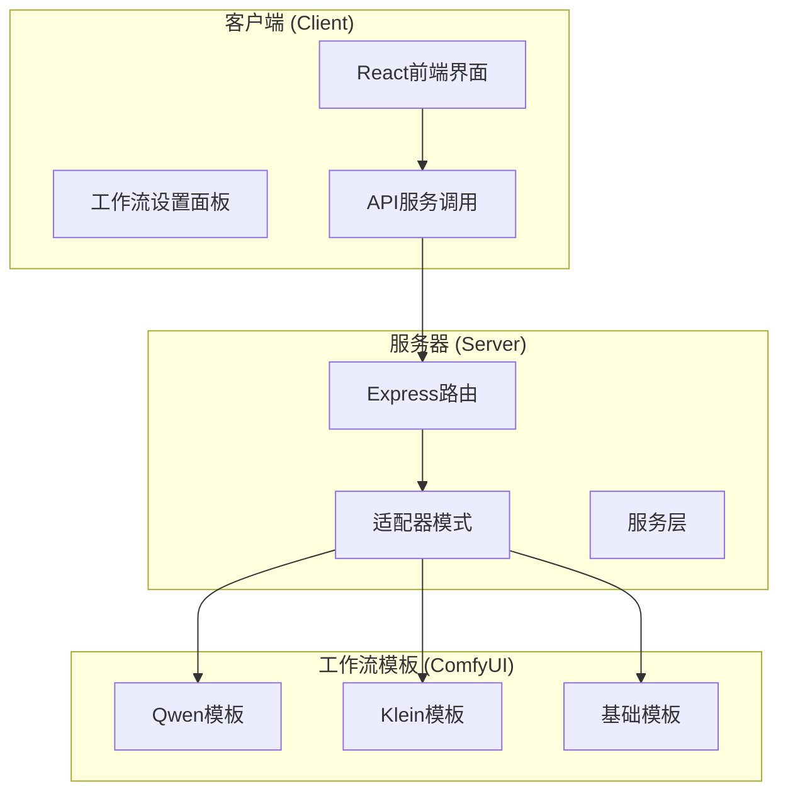
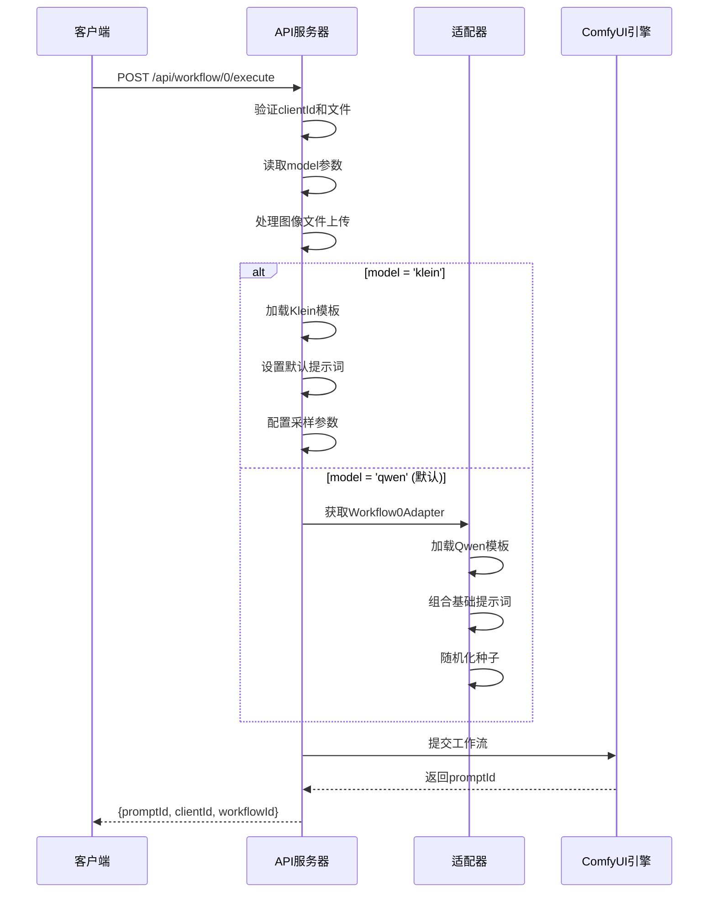
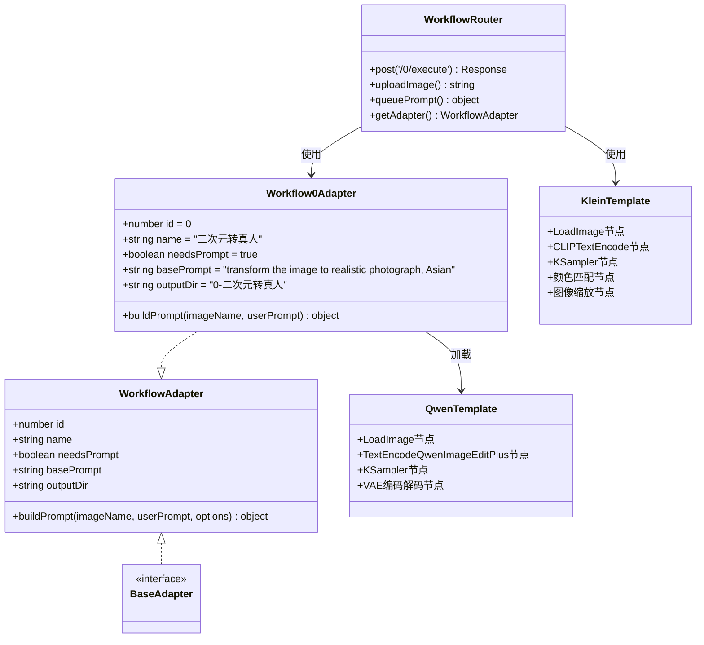
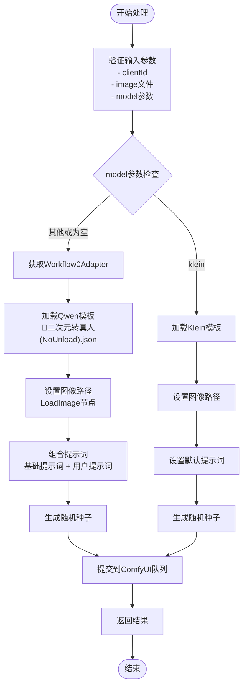
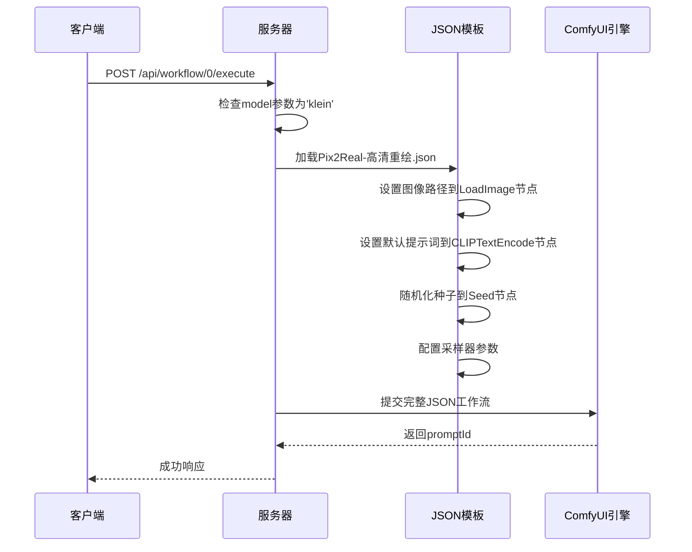
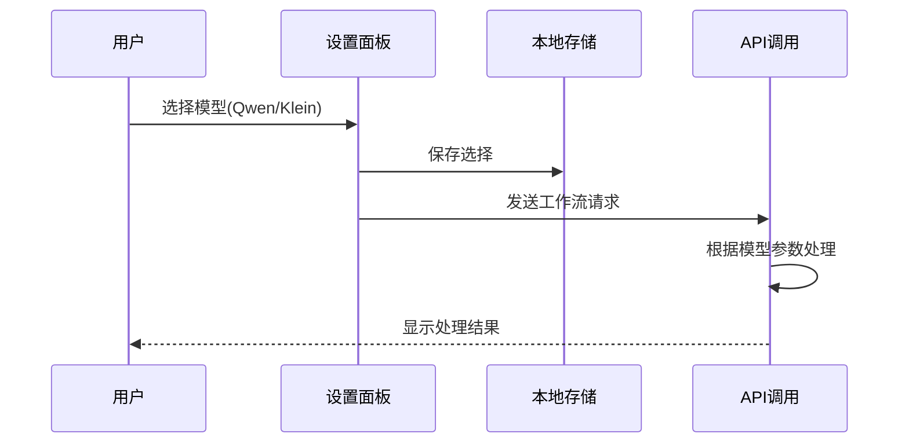
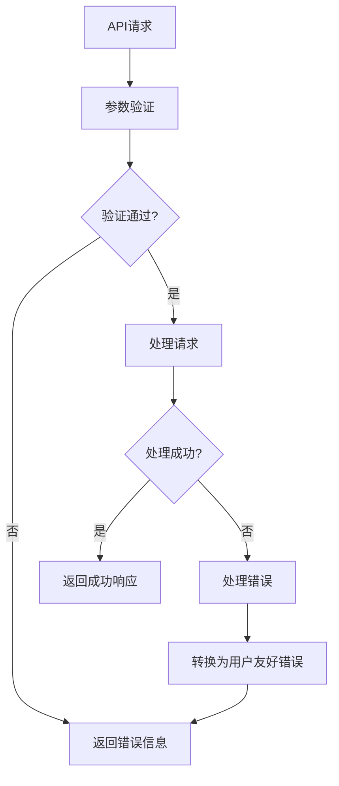

# 二次元转真人工作流

<cite>
**本文档引用的文件**
- [workflow.ts](file://server/src/routes/workflow.ts)
- [Workflow0Adapter.ts](file://server/src/adapters/Workflow0Adapter.ts)
- [BaseAdapter.ts](file://server/src/adapters/BaseAdapter.ts)
- [index.ts](file://server/src/types/index.ts)
- [0-Pix2Real-二次元转真人.json](file://ComfyUI_API/0-Pix2Real-二次元转真人.json)
- [👻二次元转真人(NoUnload).json](file://ComfyUI_API/👻二次元转真人(NoUnload).json)
- [Pix2Real-高清重绘.json](file://ComfyUI_API/Pix2Real-高清重绘.json)
- [Workflow0SettingsPanel.tsx](file://client/src/components/Workflow0SettingsPanel.tsx)
- [README.md](file://README.md)
</cite>

## 目录
1. [简介](#简介)
2. [项目结构](#项目结构)
3. [核心组件](#核心组件)
4. [架构概览](#架构概览)
5. [详细组件分析](#详细组件分析)
6. [依赖关系分析](#依赖关系分析)
7. [性能考虑](#性能考虑)
8. [故障排除指南](#故障排除指南)
9. [结论](#结论)

## 简介

二次元转真人工作流（POST /api/workflow/0/execute）是本项目的核心功能之一，专门用于将动漫风格的图像转换为逼真的真人照片。该工作流支持两种不同的模型选择：Qwen模型和Klein模型，采用不同的处理策略来实现最佳的转换效果。

该工作流通过适配器模式（Adapter Pattern）实现，允许在不修改核心逻辑的情况下支持多种模型和处理方式。Qwen模型使用基于模板的工作流，而Klein模型则使用JSON模板直接处理。

## 项目结构

该项目采用前后端分离的架构设计，主要分为三个部分：



**图表来源**
- [workflow.ts:644-687](file://server/src/routes/workflow.ts#L644-L687)
- [Workflow0Adapter.ts:1-35](file://server/src/adapters/Workflow0Adapter.ts#L1-L35)

**章节来源**
- [README.md:41-79](file://README.md#L41-L79)

## 核心组件

### API端点定义

二次元转真人工作流的API端点定义如下：

| 参数 | 类型 | 必需 | 描述 | 默认值 |
|------|------|------|------|--------|
| clientId | string | 是 | 客户端标识符 | - |
| model | string | 否 | 模型选择，支持'qwen'和'klein' | 'qwen' |
| image | file | 是 | 输入的二次元图像文件 | - |
| prompt | string | 否 | 用户自定义提示词 | 空字符串 |

### 请求格式



**图表来源**
- [workflow.ts:644-687](file://server/src/routes/workflow.ts#L644-L687)
- [Workflow0Adapter.ts:16-33](file://server/src/adapters/Workflow0Adapter.ts#L16-L33)

**章节来源**
- [workflow.ts:644-687](file://server/src/routes/workflow.ts#L644-L687)

## 架构概览

该工作流采用了经典的适配器模式架构，实现了高度的模块化和可扩展性：



**图表来源**
- [Workflow0Adapter.ts:9-34](file://server/src/adapters/Workflow0Adapter.ts#L9-L34)
- [BaseAdapter.ts:1-4](file://server/src/adapters/BaseAdapter.ts#L1-L4)
- [workflow.ts:644-687](file://server/src/routes/workflow.ts#L644-L687)

## 详细组件分析

### Qwen模型处理流程

Qwen模型采用基于适配器模式的处理方式：



**图表来源**
- [workflow.ts:644-687](file://server/src/routes/workflow.ts#L644-L687)
- [Workflow0Adapter.ts:16-33](file://server/src/adapters/Workflow0Adapter.ts#L16-L33)

### Klein模型处理流程

Klein模型采用直接JSON模板处理的方式：



**图表来源**
- [workflow.ts:663-669](file://server/src/routes/workflow.ts#L663-L669)
- [Pix2Real-高清重绘.json:179-187](file://ComfyUI_API/Pix2Real-高清重绘.json#L179-L187)

### 模型差异对比

| 特性 | Qwen模型 | Klein模型 |
|------|----------|-----------|
| **处理方式** | 适配器模式 + 模板加载 | 直接JSON模板处理 |
| **提示词节点** | TextEncodeQwenImageEditPlus | CLIPTextEncode |
| **图像处理** | VAE编码解码 + 缩放 | 颜色匹配 + 图像缩放 |
| **采样器** | KSampler | SamplerCustomAdvanced |
| **默认提示词** | transform the image to realistic photograph, Asian | realistic, 将画面变为真实的照片... |
| **适用场景** | 通用二次元转真人 | 高质量真人化处理 |
| **性能特点** | 模板加载开销小 | 直接处理效率高 |

**章节来源**
- [workflow.ts:663-673](file://server/src/routes/workflow.ts#L663-L673)
- [0-Pix2Real-二次元转真人.json:222-242](file://ComfyUI_API/0-Pix2Real-二次元转真人.json#L222-L242)
- [Pix2Real-高清重绘.json:302-310](file://ComfyUI_API/Pix2Real-高清重绘.json#L302-L310)

## 依赖关系分析

### 服务器端依赖

```mermaid
graph LR
subgraph "服务器端核心"
WorkflowRoute[workflow.ts]
AdapterIndex[adapters/index.ts]
Workflow0Adapter[Workflow0Adapter.ts]
Types[index.ts]
end
subgraph "工作流模板"
QwenTemplate[0-Pix2Real-二次元转真人.json]
NoUnloadTemplate[👻二次元转真人(NoUnload).json]
KleinTemplate[Pix2Real-高清重绘.json]
end
subgraph "外部服务"
ComfyUI[ComfyUI引擎]
FileSystem[文件系统]
end
WorkflowRoute --> AdapterIndex
AdapterIndex --> Workflow0Adapter
Workflow0Adapter --> NoUnloadTemplate
WorkflowRoute --> QwenTemplate
WorkflowRoute --> KleinTemplate
WorkflowRoute --> ComfyUI
WorkflowRoute --> FileSystem
```

**图表来源**
- [workflow.ts:1-29](file://server/src/routes/workflow.ts#L1-L29)
- [Workflow0Adapter.ts:1-7](file://server/src/adapters/Workflow0Adapter.ts#L1-L7)

### 客户端集成

客户端通过设置面板控制模型选择：



**图表来源**
- [Workflow0SettingsPanel.tsx:10](file://client/src/components/Workflow0SettingsPanel.tsx#L10)

**章节来源**
- [Workflow0SettingsPanel.tsx:1-58](file://client/src/components/Workflow0SettingsPanel.tsx#L1-L58)

## 性能考虑

### 内存管理

工作流在处理过程中采用了多种内存管理策略：

1. **显存清理**：使用RAMCleanup节点进行显存释放
2. **内存清理**：通过cleanGpuUsed节点清理GPU占用
3. **模板缓存**：适配器模式下模板文件会被缓存
4. **文件上传优化**：使用multer内存存储减少磁盘IO

### 处理效率

- **Qwen模型**：模板加载开销较小，适合快速处理
- **Klein模型**：处理链路更复杂，但转换质量更高
- **并发处理**：支持多客户端同时处理，每个客户端独立连接

## 故障排除指南

### 常见错误及解决方案

| 错误类型 | 错误信息 | 可能原因 | 解决方案 |
|----------|----------|----------|----------|
| 模型文件缺失 | value_not_in_list ckpt_name | 模型文件未正确安装 | 检查ComfyUI模型目录 |
| LoRA文件缺失 | value_not_in_list lora_name | LoRA文件未找到 | 确认LoRA文件路径正确 |
| UNET模型缺失 | value_not_in_list unet_name | UNET模型未安装 | 安装对应UNet模型 |
| 工作流提交失败 | Queue prompt failed | ComfyUI服务异常 | 检查ComfyUI是否正常运行 |
| 文件上传失败 | No image file provided | 图像文件未上传 | 确认multipart/form-data格式 |

### 错误处理机制



**图表来源**
- [workflow.ts:129-150](file://server/src/routes/workflow.ts#L129-L150)

**章节来源**
- [workflow.ts:129-150](file://server/src/routes/workflow.ts#L129-L150)

## 结论

二次元转真人工作流是一个设计精良的图像处理系统，具有以下优势：

1. **灵活的模型选择**：支持Qwen和Klein两种不同的处理策略
2. **适配器模式**：实现了良好的代码组织和扩展性
3. **用户友好**：提供直观的设置面板和错误处理
4. **高性能**：优化的内存管理和并发处理能力

### 最佳实践建议

1. **模型选择**：
   - Qwen模型：适用于快速处理和一般质量要求
   - Klein模型：适用于高质量真人化处理，但需要更多计算资源

2. **提示词配置**：
   - Qwen模型：可以添加个性化的描述性内容
   - Klein模型：使用默认提示词通常获得最佳效果

3. **性能优化**：
   - 合理设置图像分辨率
   - 避免同时运行过多大型工作流
   - 定期清理显存和临时文件

4. **错误处理**：
   - 检查模型文件完整性
   - 确保ComfyUI服务正常运行
   - 监控系统资源使用情况

该工作流为二次元图像向真人照片的转换提供了强大而灵活的解决方案，适合各种应用场景和用户需求。