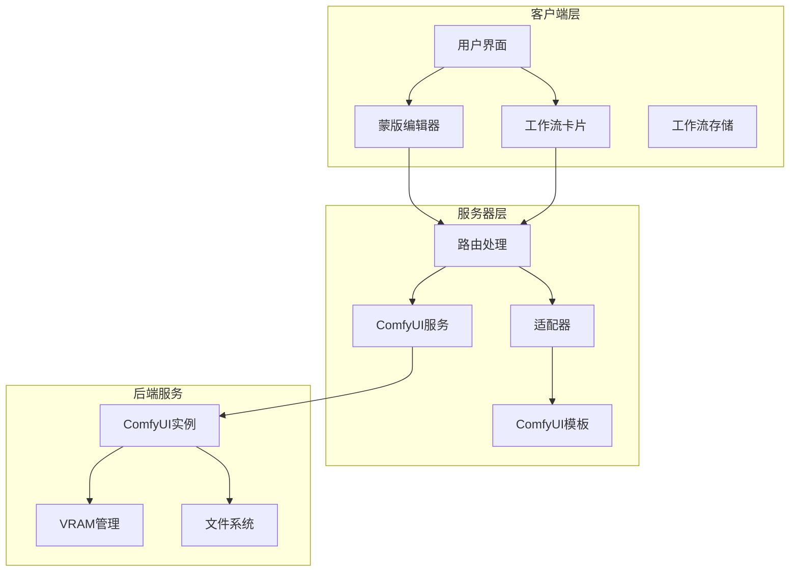
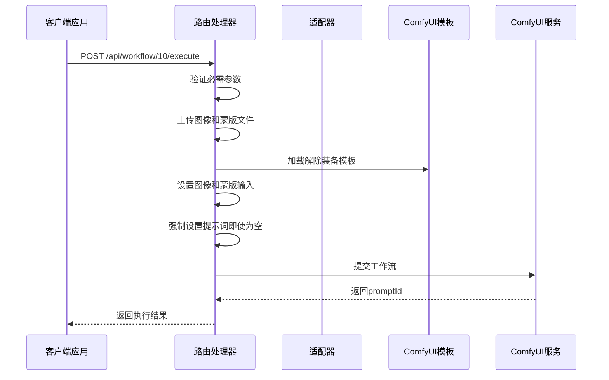
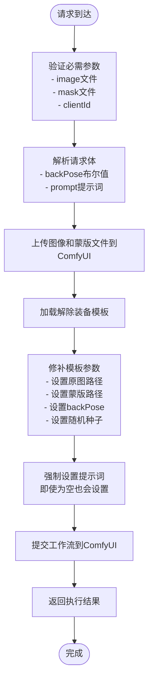
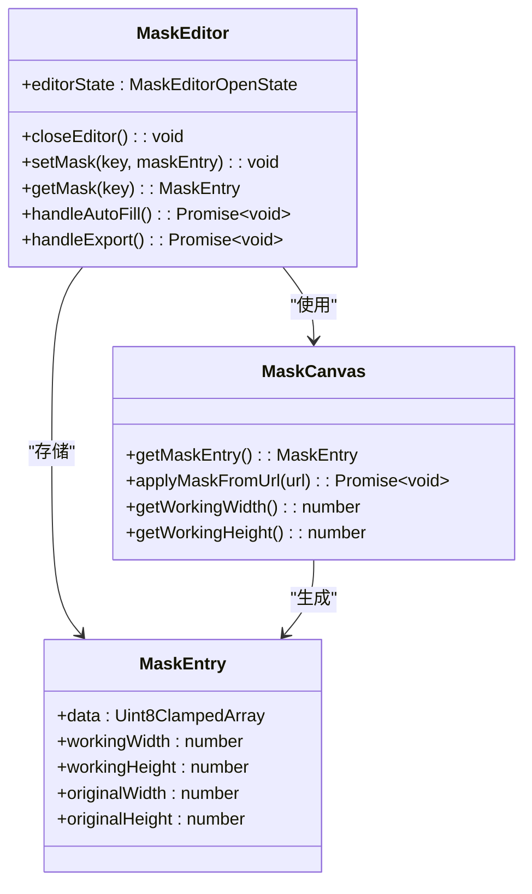
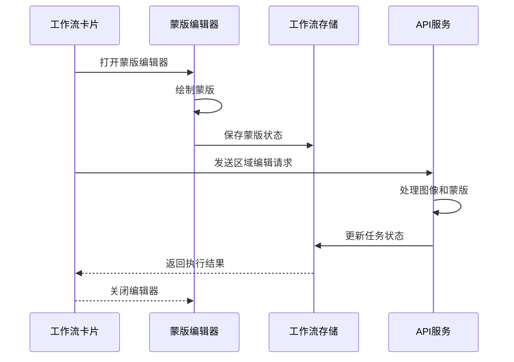
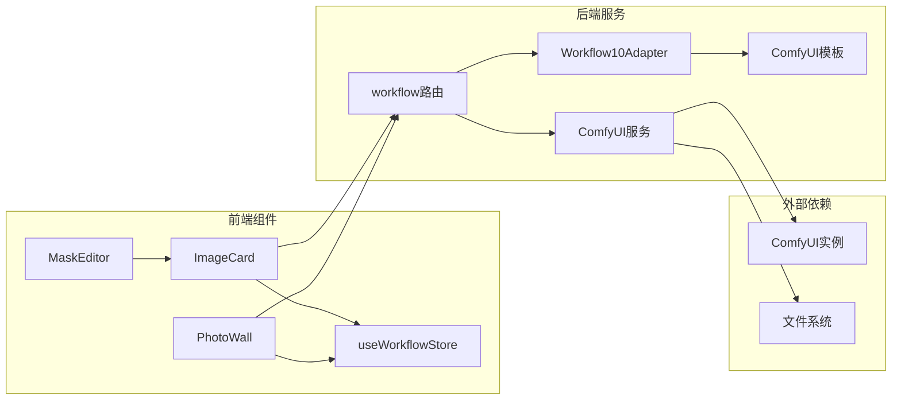

# 区域编辑工作流

<cite>
**本文档引用的文件**
- [workflow.ts](file://server/src/routes/workflow.ts)
- [Workflow10Adapter.ts](file://server/src/adapters/Workflow10Adapter.ts)
- [Pix2Real-解除装备Fixed.json](file://ComfyUI_API/Pix2Real-解除装备Fixed.json)
- [MaskEditor.tsx](file://client/src/components/MaskEditor.tsx)
- [useWorkflowStore.ts](file://client/src/hooks/useWorkflowStore.ts)
- [maskConfig.ts](file://client/src/config/maskConfig.ts)
- [ImageCard.tsx](file://client/src/components/ImageCard.tsx)
- [PhotoWall.tsx](file://client/src/components/PhotoWall.tsx)
</cite>

## 目录
1. [简介](#简介)
2. [项目结构](#项目结构)
3. [核心组件](#核心组件)
4. [架构概览](#架构概览)
5. [详细组件分析](#详细组件分析)
6. [依赖关系分析](#依赖关系分析)
7. [性能考虑](#性能考虑)
8. [故障排除指南](#故障排除指南)
9. [结论](#结论)

## 简介

区域编辑工作流（POST /api/workflow/10/execute）是CorineKit Pix2Real项目中的一个高级图像处理功能，专门用于对图像的特定区域进行精确编辑。该工作流基于ComfyUI的局部重绘技术，允许用户通过蒙版精确控制编辑区域，实现智能的图像增强和修改。

与解除装备工作流相比，区域编辑工作流具有以下关键特性：
- **强制提示词设置**：即使提示词为空也会强制设置，确保编辑过程有明确的指导
- **复杂的蒙版支持**：支持精细的蒙版绘制和编辑
- **实时预览模式**：提供多种预览模式以帮助用户精确控制编辑效果

## 项目结构

该工作流涉及前后端的完整架构：



**图表来源**
- [workflow.ts:1-800](file://server/src/routes/workflow.ts#L1-L800)
- [Workflow10Adapter.ts:1-15](file://server/src/adapters/Workflow10Adapter.ts#L1-L15)

**章节来源**
- [workflow.ts:1-800](file://server/src/routes/workflow.ts#L1-L800)
- [Workflow10Adapter.ts:1-15](file://server/src/adapters/Workflow10Adapter.ts#L1-L15)

## 核心组件

### API端点定义

区域编辑工作流的API端点定义如下：

| 属性 | 值 |
|------|-----|
| 方法 | POST |
| 路径 | `/api/workflow/10/execute` |
| 功能 | 区域编辑工作流执行 |
| 鉴权 | 需要clientId参数 |

### 请求参数详解

#### 必需参数

| 参数名 | 类型 | 必需 | 描述 | 示例 |
|--------|------|------|------|------|
| clientId | string | 是 | 客户端标识符，用于区分不同用户的任务 | `"client_12345"` |
| image | file | 是 | 原始图像文件（PNG/JPEG/WebP） | 二进制文件数据 |
| mask | file | 是 | 蒙版图像文件（PNG格式） | 二进制文件数据 |

#### 可选参数

| 参数名 | 类型 | 默认值 | 描述 | 示例 |
|--------|------|--------|------|------|
| prompt | string | 空字符串 | 用户提示词，即使为空也会强制设置 | `"高清修复，细节增强"` |
| backPose | boolean | false | 背面姿态布尔值，控制某些处理逻辑 | `true` |

### 响应格式

```json
{
  "promptId": "string",
  "clientId": "string", 
  "workflowId": 10,
  "workflowName": "区域编辑"
}
```

**章节来源**
- [workflow.ts:217-267](file://server/src/routes/workflow.ts#L217-L267)

## 架构概览

区域编辑工作流采用分层架构设计，确保了良好的可维护性和扩展性：



**图表来源**
- [workflow.ts:217-267](file://server/src/routes/workflow.ts#L217-L267)
- [Workflow10Adapter.ts:1-15](file://server/src/adapters/Workflow10Adapter.ts#L1-L15)

## 详细组件分析

### 服务器端实现

#### 路由处理逻辑

服务器端的区域编辑工作流处理流程如下：



**图表来源**
- [workflow.ts:217-267](file://server/src/routes/workflow.ts#L217-L267)

#### 关键实现细节

1. **文件上传处理**：使用Multer中间件处理multipart/form-data格式的文件上传
2. **模板复用**：复用解除装备工作流的ComfyUI模板，减少模板维护成本
3. **提示词强制设置**：这是区域编辑工作流的核心特性，确保即使用户未提供提示词也能正常执行

**章节来源**
- [workflow.ts:217-267](file://server/src/routes/workflow.ts#L217-L267)

### 客户端集成

#### 蒙版编辑器

蒙版编辑器提供了强大的图像编辑功能：



**图表来源**
- [MaskEditor.tsx:1-375](file://client/src/components/MaskEditor.tsx#L1-L375)

#### 工作流卡片集成

工作流卡片负责协调整个编辑流程：



**图表来源**
- [ImageCard.tsx:424-546](file://client/src/components/ImageCard.tsx#L424-L546)
- [PhotoWall.tsx:246-248](file://client/src/components/PhotoWall.tsx#L246-L248)

**章节来源**
- [MaskEditor.tsx:1-375](file://client/src/components/MaskEditor.tsx#L1-L375)
- [ImageCard.tsx:424-546](file://client/src/components/ImageCard.tsx#L424-L546)
- [PhotoWall.tsx:246-248](file://client/src/components/PhotoWall.tsx#L246-L248)

### ComfyUI模板分析

区域编辑工作流复用了解除装备工作流的ComfyUI模板，主要节点包括：

| 节点ID | 类型 | 功能 | 输入参数 |
|--------|------|------|----------|
| 313 | LoadImage | 加载原图 | image |
| 385 | LoadImage | 加载蒙版 | image |
| 387 | MaskFromColor+ | 蒙版颜色转换 | red, green, blue, threshold |
| 314 | CLIPTextEncode | 文本编码 | text, clip |
| 316 | InpaintCropImproved | 局部重绘裁剪 | image, mask |
| 320 | InpaintStitchImproved | 局部重绘拼接 | stitcher, inpainted_image |
| 389 | easy ifElse | 条件判断 | boolean, on_true, on_false |

**章节来源**
- [Pix2Real-解除装备Fixed.json:1-360](file://ComfyUI_API/Pix2Real-解除装备Fixed.json#L1-L360)

## 依赖关系分析

### 组件耦合度



**图表来源**
- [workflow.ts:1-800](file://server/src/routes/workflow.ts#L1-L800)
- [Workflow10Adapter.ts:1-15](file://server/src/adapters/Workflow10Adapter.ts#L1-L15)

### 数据流分析

区域编辑工作流的数据流遵循以下模式：

1. **输入阶段**：客户端上传图像和蒙版文件
2. **处理阶段**：服务器端解析参数并修补ComfyUI模板
3. **执行阶段**：提交工作流到ComfyUI进行图像处理
4. **输出阶段**：返回处理结果并更新状态

**章节来源**
- [workflow.ts:217-267](file://server/src/routes/workflow.ts#L217-L267)

## 性能考虑

### 内存管理

1. **图像尺寸优化**：建议使用合理的图像分辨率，避免过大的文件影响处理速度
2. **蒙版精度平衡**：蒙版的精度与处理时间成正比，需要在精度和效率间找到平衡点
3. **VRAM管理**：ComfyUI会自动管理显存，但大量并发处理可能需要手动清理

### 并发处理

- **任务队列**：系统支持多任务并发处理，但需要合理分配资源
- **进度监控**：WebSocket连接提供实时进度反馈
- **错误恢复**：系统具备基本的错误处理和恢复机制

## 故障排除指南

### 常见问题及解决方案

#### 1. 文件上传失败

**症状**：API返回400错误，提示缺少必需文件

**原因**：
- 未提供image或mask参数
- 文件格式不支持
- 文件大小超出限制

**解决方案**：
- 确保同时提供image和mask参数
- 支持的格式：PNG、JPEG、WebP
- 检查文件大小限制

#### 2. 提示词设置异常

**症状**：区域编辑工作流无法正常执行

**原因**：
- 提示词参数未正确传递
- ComfyUI模板配置问题

**解决方案**：
- 确保prompt参数正确传递
- 检查ComfyUI模板中的提示词节点配置

#### 3. 蒙版绘制问题

**症状**：蒙版编辑器无法正常工作

**原因**：
- 浏览器兼容性问题
- Canvas渲染异常
- 存储空间不足

**解决方案**：
- 确保使用支持的浏览器版本
- 检查浏览器控制台错误信息
- 清理浏览器缓存

**章节来源**
- [workflow.ts:217-267](file://server/src/routes/workflow.ts#L217-L267)

## 结论

区域编辑工作流作为CorineKit Pix2Real项目的重要组成部分，提供了强大而灵活的图像编辑能力。其核心优势包括：

1. **精确控制**：通过蒙版实现对图像特定区域的精确编辑
2. **智能处理**：强制提示词设置确保编辑过程有明确指导
3. **用户友好**：提供直观的蒙版编辑界面和多种预览模式
4. **高效执行**：基于ComfyUI的高性能图像处理引擎

该工作流特别适用于需要精细图像编辑的专业应用场景，如人物照片修复、图像增强、局部修改等。通过合理的参数配置和蒙版绘制技巧，用户可以实现高质量的图像编辑效果。

随着项目的持续发展，区域编辑工作流将继续完善其功能和性能，为用户提供更加优秀的图像编辑体验。