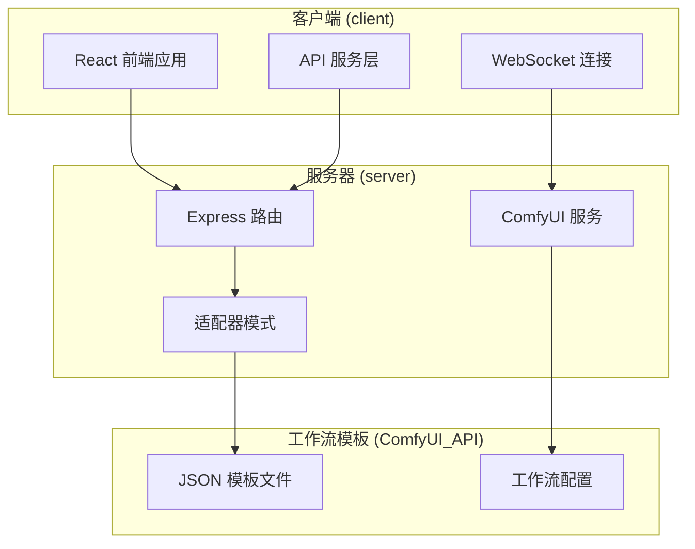
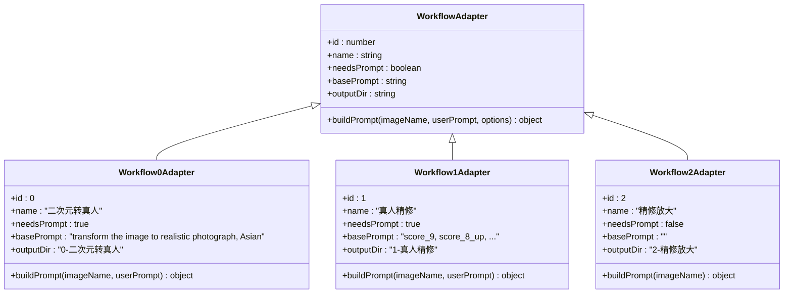
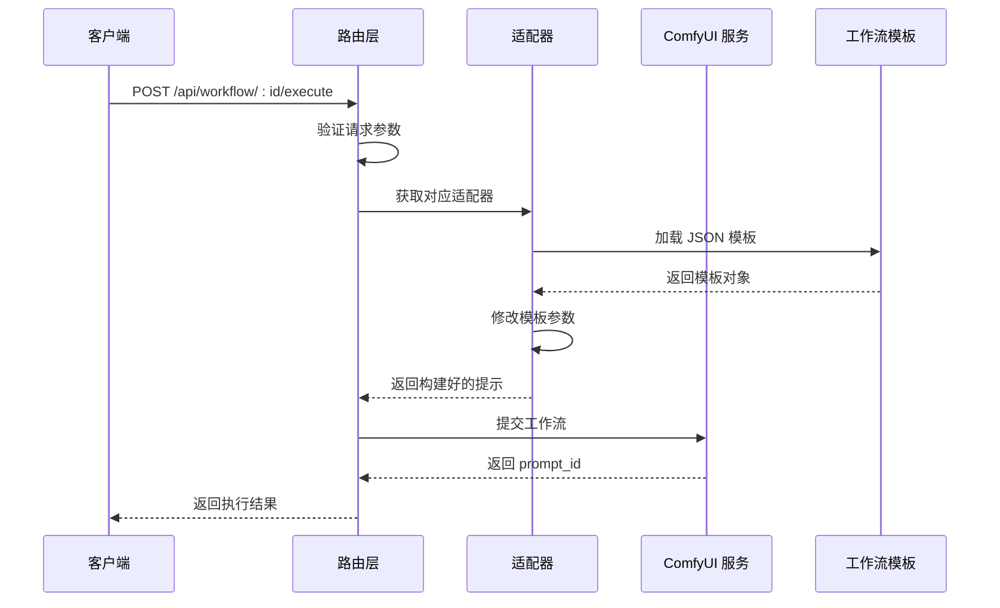
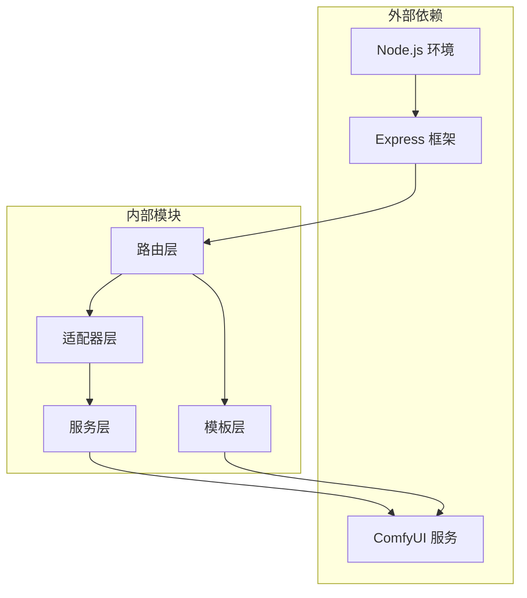
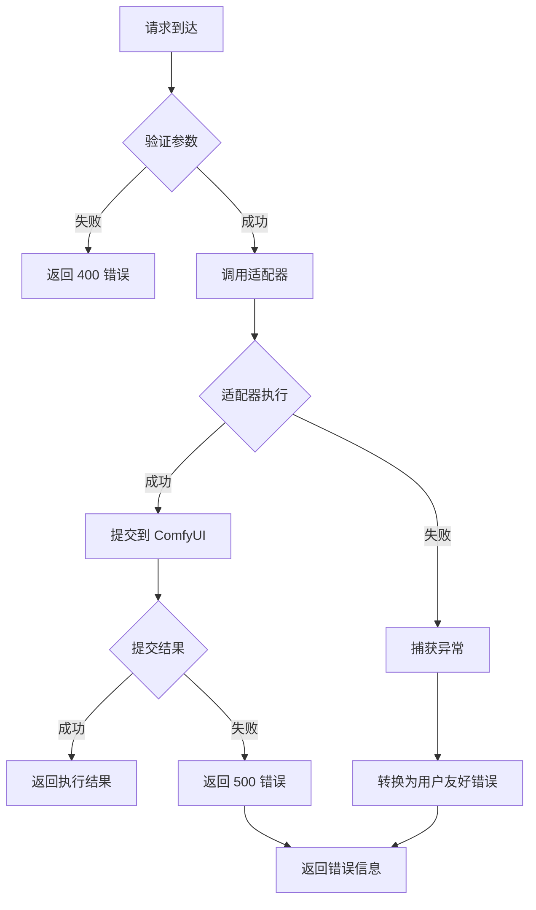
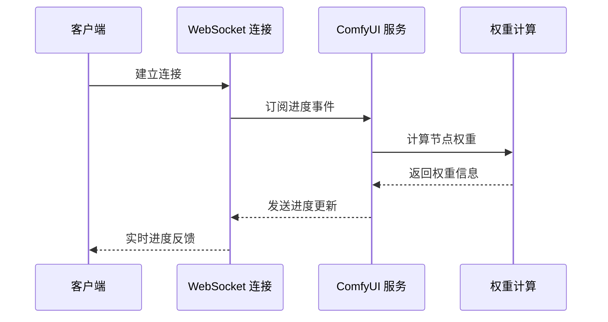

# 图像处理工作流

<cite>
**本文档引用的文件**
- [server/src/routes/workflow.ts](file://server/src/routes/workflow.ts)
- [server/src/adapters/index.ts](file://server/src/adapters/index.ts)
- [server/src/adapters/Workflow0Adapter.ts](file://server/src/adapters/Workflow0Adapter.ts)
- [server/src/adapters/Workflow1Adapter.ts](file://server/src/adapters/Workflow1Adapter.ts)
- [server/src/adapters/Workflow2Adapter.ts](file://server/src/adapters/Workflow2Adapter.ts)
- [server/src/adapters/Workflow3Adapter.ts](file://server/src/adapters/Workflow3Adapter.ts)
- [server/src/adapters/Workflow4Adapter.ts](file://server/src/adapters/Workflow4Adapter.ts)
- [server/src/adapters/Workflow5Adapter.ts](file://server/src/adapters/Workflow5Adapter.ts)
- [server/src/services/comfyui.ts](file://server/src/services/comfyui.ts)
- [client/src/services/api.ts](file://client/src/services/api.ts)
- [README.md](file://README.md)
- [ComfyUI_API/0-Pix2Real-二次元转真人.json](file://ComfyUI_API/0-Pix2Real-二次元转真人.json)
- [ComfyUI_API/2-Pix2Real-精修放大.json](file://ComfyUI_API/2-Pix2Real-精修放大.json)
- [ComfyUI_API/Pix2Real-真人精修.json](file://ComfyUI_API/Pix2Real-真人精修.json)
- [ComfyUI_API/Pix2Real-高清重绘.json](file://ComfyUI_API/Pix2Real-高清重绘.json)
- [ComfyUI_API/Pix2Real-SD放大.json](file://ComfyUI_API/Pix2Real-SD放大.json)
- [ComfyUI_API/Pix2Real-解除装备.json](file://ComfyUI_API/Pix2Real-解除装备.json)
</cite>

## 目录
1. [简介](#简介)
2. [项目结构](#项目结构)
3. [核心组件](#核心组件)
4. [架构概览](#架构概览)
5. [详细组件分析](#详细组件分析)
6. [依赖关系分析](#依赖关系分析)
7. [性能考虑](#性能考虑)
8. [故障排除指南](#故障排除指南)
9. [结论](#结论)

## 简介

CorineKit Pix2Real 是一个基于 ComfyUI 的本地图像处理工作流系统，提供了完整的二次元转真人、精修放大、真人精修、高清重绘、SD 放大、解除装备等图像处理工作流。该系统通过 Web API 提供了直观的接口，支持实时进度跟踪和批量处理功能。

## 项目结构

项目采用前后端分离的架构设计，主要分为以下模块：



**图表来源**
- [README.md:41-62](file://README.md#L41-L62)

**章节来源**
- [README.md:1-79](file://README.md#L1-L79)

## 核心组件

### 工作流路由系统

系统通过 Express 路由提供 RESTful API 接口，支持多种工作流的执行：

| 工作流 ID | 名称 | HTTP 方法 | 路径 | 输入类型 |
|-----------|------|-----------|------|----------|
| 0 | 二次元转真人 | POST | `/api/workflow/0/execute` | 单文件上传 |
| 1 | 真人精修 | POST | `/api/workflow/1/execute` | 单文件上传 |
| 2 | 精修放大 | POST | `/api/workflow/2/execute` | 单文件上传 |
| 3 | 快速生成视频 | POST | `/api/workflow/3/execute` | 单文件上传 |
| 4 | 视频放大 | POST | `/api/workflow/4/execute` | 视频文件上传 |
| 5 | 解除装备 | POST | `/api/workflow/5/execute` | 多文件上传 |

### 适配器模式架构

系统采用适配器模式来管理不同的工作流，每个工作流都有对应的适配器类：



**图表来源**
- [server/src/adapters/Workflow0Adapter.ts:9-34](file://server/src/adapters/Workflow0Adapter.ts#L9-L34)
- [server/src/adapters/Workflow1Adapter.ts:9-35](file://server/src/adapters/Workflow1Adapter.ts#L9-L35)
- [server/src/adapters/Workflow2Adapter.ts:9-27](file://server/src/adapters/Workflow2Adapter.ts#L9-L27)

**章节来源**
- [server/src/adapters/index.ts:14-30](file://server/src/adapters/index.ts#L14-L30)

## 架构概览

系统整体架构采用分层设计，实现了清晰的关注点分离：



**图表来源**
- [server/src/routes/workflow.ts:750-799](file://server/src/routes/workflow.ts#L750-L799)
- [server/src/services/comfyui.ts:168-196](file://server/src/services/comfyui.ts#L168-L196)

## 详细组件分析

### 二次元转真人工作流 (ID: 0)

#### 接口规范

**请求方法**: `POST /api/workflow/0/execute`

**请求头**:
- `Content-Type: multipart/form-data`
- `clientId`: 客户端标识符（必需）

**表单字段**:
- `image`: 输入图像文件（必需）
- `model`: 模型选择 (`qwen` 或 `klein`)
- `prompt`: 自定义提示词

**响应数据**:
```json
{
  "promptId": "字符串类型的提示ID",
  "clientId": "客户端标识符",
  "workflowId": 0,
  "workflowName": "二次元转真人"
}
```

#### 参数配置

| 参数 | 类型 | 必需 | 默认值 | 描述 |
|------|------|------|--------|------|
| image | File | 是 | - | 输入的二次元图像 |
| model | String | 否 | `qwen` | 模型选择：`qwen` 或 `klein` |
| prompt | String | 否 | 空字符串 | 自定义提示词，将附加到基础提示词后 |
| clientId | String | 是 | - | 客户端唯一标识符 |

#### 模型选择

系统支持两种不同的模型：

1. **Qwen 模型** (`model=qwen`):
   - 使用 `👻二次元转真人(NoUnload).json` 模板
   - 基础提示词: `"transform the image to realistic photograph, Asian"`
   - 适合标准的二次元转真人转换

2. **Klein 模型** (`model=klein`):
   - 使用 `Pix2Real-高清重绘.json` 模板
   - 默认提示词: `"realistic, 将画面变为真实的照片，将动漫角色真人化，补充细节，修复画面。超高清，极致细节，高对比度，清晰的光影细节，保持画面色调不变，8K画质。亚洲人。"`
   - 适合高质量的真人化转换

#### 使用示例

```javascript
// 使用 Qwen 模型进行二次元转真人
const formData = new FormData();
formData.append('image', imageFile);
formData.append('model', 'qwen');
formData.append('prompt', '高质量，超清细节');

fetch('/api/workflow/0/execute?clientId=user123', {
  method: 'POST',
  body: formData
});
```

**章节来源**
- [server/src/routes/workflow.ts:644-687](file://server/src/routes/workflow.ts#L644-L687)
- [server/src/adapters/Workflow0Adapter.ts:16-33](file://server/src/adapters/Workflow0Adapter.ts#L16-L33)

### 精修放大工作流 (ID: 2)

#### 接口规范

**请求方法**: `POST /api/workflow/2/execute`

**请求头**:
- `Content-Type: multipart/form-data`
- `clientId`: 客户端标识符（必需）

**表单字段**:
- `image`: 输入图像文件（必需）
- `model`: 模型选择

#### 模型选择

系统支持四种不同的放大模型：

1. **SeedVR2 模型** (`model=seedvr2`):
   - 使用 `2-Pix2Real-精修放大.json` 模板
   - 默认模型，适合大多数精修放大场景

2. **Klein 模型** (`model=klein`):
   - 使用 `Pix2Real-高清重绘.json` 模板
   - 默认提示词: `"realistic，补充细节，修复画面。超高清，极致细节，高对比度，清晰的光影细节，保持画面色调不变，8K画质。亚洲人。"`

3. **Klein Pro 模型** (`model=kleinpro`):
   - 使用 `Pix2Real-Klein重绘Pro.json` 模板
   - 高级版本的 Klein 模型

4. **SD 放大模型** (`model=sd`):
   - 使用 `Pix2Real-SD放大.json` 模板
   - 基于 SD 放大的放大算法

5. **Remacri 模型** (`model=remacri`):
   - 使用 `Pix2Real-SD放大.json` 模板
   - 特定的放大模型变体

#### 参数配置

| 参数 | 类型 | 必需 | 默认值 | 描述 |
|------|------|------|--------|------|
| image | File | 是 | - | 输入图像文件 |
| model | String | 否 | `seedvr2` | 放大模型选择 |
| clientId | String | 是 | - | 客户端唯一标识符 |

#### 使用示例

```javascript
// 使用 SD 放大模型
const formData = new FormData();
formData.append('image', imageFile);
formData.append('model', 'sd');

fetch('/api/workflow/2/execute?clientId=user123', {
  method: 'POST',
  body: formData
});
```

**章节来源**
- [server/src/routes/workflow.ts:689-748](file://server/src/routes/workflow.ts#L689-L748)
- [server/src/adapters/Workflow2Adapter.ts:16-26](file://server/src/adapters/Workflow2Adapter.ts#L16-L26)

### 真人精修工作流 (ID: 1)

#### 接口规范

**请求方法**: `POST /api/workflow/1/execute`

**请求头**:
- `Content-Type: multipart/form-data`
- `clientId`: 客户端标识符（必需）

**表单字段**:
- `image`: 输入图像文件（必需）
- `prompt`: 自定义提示词

#### 参数配置

| 参数 | 类型 | 必需 | 默认值 | 描述 |
|------|------|------|--------|------|
| image | File | 是 | - | 输入的真人图像 |
| prompt | String | 否 | 空字符串 | 自定义提示词，将附加到基础提示词后 |
| clientId | String | 是 | - | 客户端唯一标识符 |

#### 基础提示词

系统内置了丰富的基础提示词，包括：
- 质量评分: `score_9, score_8_up, score_7_up`
- 画质描述: `masterpiece, realistic, HDR, UHD, 8K, best quality`
- 细节描述: `Highly detailed, clear details, detailed skin, skin textures`
- 人物特征: `fair skin, newest, A Korean girl, completely nude`

#### 使用示例

```javascript
// 进行真人精修
const formData = new FormData();
formData.append('image', imageFile);
formData.append('prompt', '更清晰的皮肤纹理，更好的光影效果');

fetch('/api/workflow/1/execute?clientId=user123', {
  method: 'POST',
  body: formData
});
```

**章节来源**
- [server/src/routes/workflow.ts:750-799](file://server/src/routes/workflow.ts#L750-L799)
- [server/src/adapters/Workflow1Adapter.ts:16-34](file://server/src/adapters/Workflow1Adapter.ts#L16-L34)

### 高清重绘工作流 (ID: 3)

#### 接口规范

**请求方法**: `POST /api/workflow/3/execute`

**请求头**:
- `Content-Type: multipart/form-data`
- `clientId`: 客户端标识符（必需）

**表单字段**:
- `image`: 输入图像文件（必需）
- `prompt`: 自定义提示词
- `options`: JSON 格式的选项参数

#### 选项参数

| 参数 | 类型 | 必需 | 默认值 | 描述 |
|------|------|------|--------|------|
| image | File | 是 | - | 输入图像文件 |
| prompt | String | 否 | 基础提示词 | 自定义提示词 |
| options.seconds | Number | 否 | 4 | 视频时长（秒） |
| options.fps | Number | 否 | 16 | 帧率 |
| options.megapixels | Number | 否 | 1 | 视频质量 |
| clientId | String | 是 | - | 客户端唯一标识符 |

#### 基础提示词

默认提示词: `"女孩轻微摇晃，微风吹拂头发"`

#### 使用示例

```javascript
// 生成视频
const formData = new FormData();
formData.append('image', imageFile);
formData.append('prompt', '动态效果，流畅过渡');

const options = {
  seconds: 5,
  fps: 24,
  megapixels: 2
};

formData.append('options', JSON.stringify(options));

fetch('/api/workflow/3/execute?clientId=user123', {
  method: 'POST',
  body: formData
});
```

**章节来源**
- [server/src/routes/workflow.ts:750-799](file://server/src/routes/workflow.ts#L750-L799)
- [server/src/adapters/Workflow3Adapter.ts:16-39](file://server/src/adapters/Workflow3Adapter.ts#L16-L39)

### SD 放大工作流 (ID: 4)

#### 接口规范

**请求方法**: `POST /api/workflow/4/execute`

**请求头**:
- `Content-Type: multipart/form-data`
- `clientId`: 客户端标识符（必需）

**表单字段**:
- `video`: 输入视频文件（必需）
- `multiplier`: 放大倍数

#### 参数配置

| 参数 | 类型 | 必需 | 默认值 | 描述 |
|------|------|------|--------|------|
| video | File | 是 | - | 输入视频文件 |
| multiplier | Number | 否 | 2 | 视频帧插值倍数 |
| clientId | String | 是 | - | 客户端唯一标识符 |

#### 使用示例

```javascript
// 视频补帧
const formData = new FormData();
formData.append('video', videoFile);
formData.append('multiplier', 4);

fetch('/api/workflow/4/execute?clientId=user123', {
  method: 'POST',
  body: formData
});
```

**章节来源**
- [server/src/routes/workflow.ts:750-799](file://server/src/routes/workflow.ts#L750-L799)
- [server/src/adapters/Workflow4Adapter.ts:16-26](file://server/src/adapters/Workflow4Adapter.ts#L16-L26)

### 解除装备工作流 (ID: 5)

#### 接口规范

**请求方法**: `POST /api/workflow/5/execute`

**请求头**:
- `Content-Type: multipart/form-data`
- `clientId`: 客户端标识符（必需）

**表单字段**:
- `image`: 原始图像文件（必需）
- `mask`: 遮罩文件（必需）
- `prompt`: 自定义提示词
- `backPose`: 是否背面姿势

#### 参数配置

| 参数 | 类型 | 必需 | 默认值 | 描述 |
|------|------|------|--------|------|
| image | File | 是 | - | 原始图像文件 |
| mask | File | 是 | - | 遮罩文件 |
| prompt | String | 否 | 空字符串 | 自定义提示词 |
| backPose | Boolean | 否 | false | 是否背面姿势 |
| clientId | String | 是 | - | 客户端唯一标识符 |

#### 使用示例

```javascript
// 解除装备
const formData = new FormData();
formData.append('image', imageFile);
formData.append('mask', maskFile);
formData.append('prompt', '去除绿色区域的衣服');
formData.append('backPose', true);

fetch('/api/workflow/5/execute?clientId=user123', {
  method: 'POST',
  body: formData
});
```

**章节来源**
- [server/src/routes/workflow.ts:163-215](file://server/src/routes/workflow.ts#L163-L215)
- [server/src/adapters/Workflow5Adapter.ts:11-14](file://server/src/adapters/Workflow5Adapter.ts#L11-L14)

## 依赖关系分析

系统的核心依赖关系如下：



**图表来源**
- [server/src/services/comfyui.ts:6-7](file://server/src/services/comfyui.ts#L6-L7)
- [server/src/routes/workflow.ts:1-14](file://server/src/routes/workflow.ts#L1-L14)

### 错误处理机制

系统实现了完善的错误处理机制：



**图表来源**
- [server/src/routes/workflow.ts:129-150](file://server/src/routes/workflow.ts#L129-L150)

**章节来源**
- [server/src/routes/workflow.ts:126-150](file://server/src/routes/workflow.ts#L126-L150)

## 性能考虑

### 进度追踪系统

系统实现了基于 WebSocket 的实时进度追踪：



**图表来源**
- [server/src/services/comfyui.ts:265-375](file://server/src/services/comfyui.ts#L265-L375)

### 资源管理

系统支持 VRAM 内存释放和模型缓存管理：

- **内存释放**: 通过专用模板实现 ComfyUI 内存清理
- **模型缓存**: 支持模型文件的缓存和重用
- **资源监控**: 实时监控系统资源使用情况

## 故障排除指南

### 常见问题及解决方案

| 问题类型 | 错误信息 | 可能原因 | 解决方案 |
|----------|----------|----------|----------|
| 模型文件缺失 | `模型文件未找到，请检查 ComfyUI 模型是否已正确安装` | 检查点模型、LoRA 模型或 UNET 模型未安装 | 确认模型文件路径正确，重新安装模型 |
| 工作流提交失败 | `工作流提交失败，请检查 ComfyUI 是否正常运行` | ComfyUI 服务未启动或网络连接问题 | 检查 ComfyUI 服务状态，确认端口 8188 可访问 |
| 文件上传失败 | `No image file provided` | 请求缺少必要的文件参数 | 确认使用 multipart/form-data 格式上传文件 |
| 客户端标识符缺失 | `clientId is required` | 缺少客户端标识符参数 | 在查询参数或请求体中提供 clientId |

### 调试建议

1. **检查 ComfyUI 连接**: 确认 ComfyUI 服务在 `http://localhost:8188` 正常运行
2. **验证模型安装**: 使用 `/api/workflow/models/checkpoints` 等端点检查可用模型
3. **查看日志输出**: 关注服务器控制台的错误日志信息
4. **测试基本功能**: 先尝试简单的图像上传和处理测试

**章节来源**
- [server/src/routes/workflow.ts:129-150](file://server/src/routes/workflow.ts#L129-L150)

## 结论

CorineKit Pix2Real 提供了一个完整且强大的图像处理工作流系统，具有以下特点：

1. **模块化设计**: 通过适配器模式实现了良好的代码组织和扩展性
2. **实时反馈**: 基于 WebSocket 的进度追踪提供了优秀的用户体验
3. **灵活配置**: 支持多种模型选择和参数配置
4. **错误处理**: 完善的错误处理和用户友好提示机制
5. **性能优化**: 合理的资源管理和进度权重计算

该系统适用于各种图像处理场景，从简单的二次元转真人到复杂的视频处理，都能提供稳定可靠的服务。