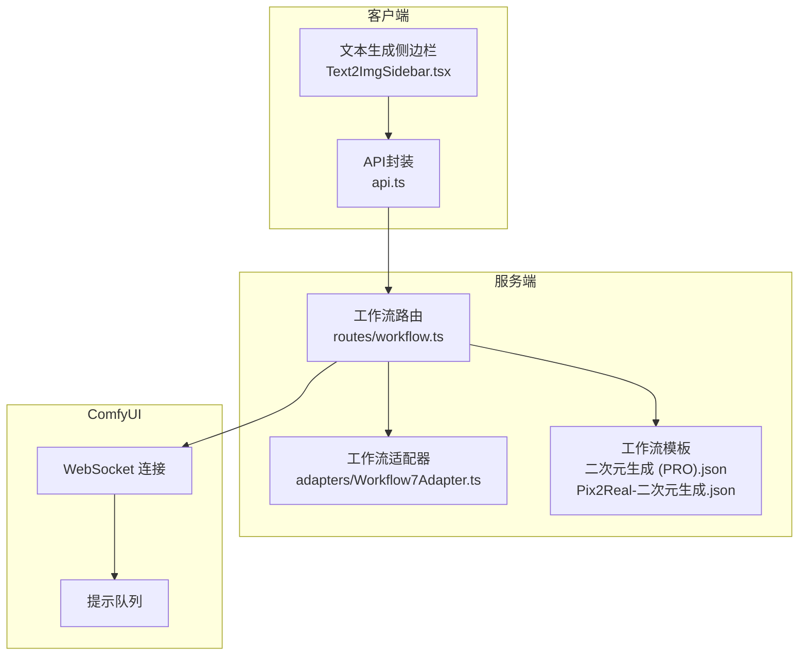
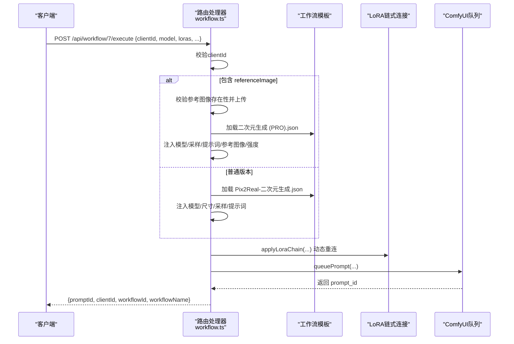
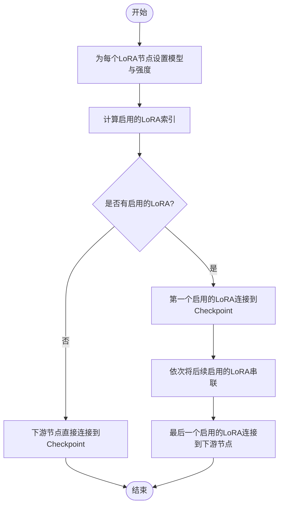
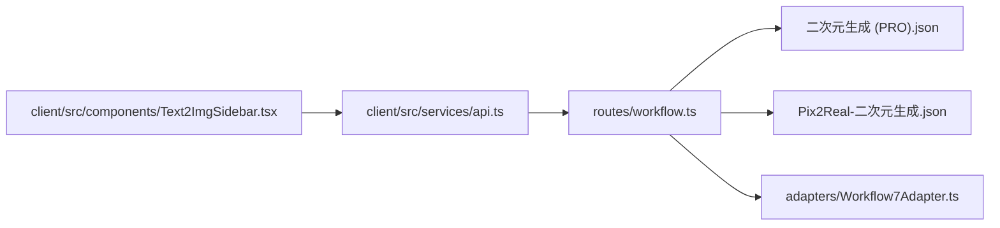

# 快速出图工作流

<cite>
**本文档引用的文件**
- [Workflow7Adapter.ts](file://server/src/adapters/Workflow7Adapter.ts)
- [workflow.ts](file://server/src/routes/workflow.ts)
- [二次元生成 (PRO).json](file://ComfyUI_API/二次元生成 (PRO).json)
- [Pix2Real-二次元生成.json](file://ComfyUI_API/Pix2Real-二次元生成.json)
- [Text2ImgSidebar.tsx](file://client/src/components/Text2ImgSidebar.tsx)
- [api.ts](file://client/src/services/api.ts)
- [types/index.ts](file://server/src/types/index.ts)
</cite>

## 目录
1. [简介](#简介)
2. [项目结构](#项目结构)
3. [核心组件](#核心组件)
4. [架构总览](#架构总览)
5. [详细组件分析](#详细组件分析)
6. [依赖关系分析](#依赖关系分析)
7. [性能考量](#性能考量)
8. [故障排除指南](#故障排除指南)
9. [结论](#结论)
10. [附录](#附录)

## 简介
本文件为“快速出图”工作流（POST /api/workflow/7/execute）的完整API文档，涵盖：
- 请求参数定义与类型约束
- 普通版本与PRO版本的差异说明
- LoRA模型链式连接机制
- 参考图像（PRO版本）的使用方式
- 输出文件命名最佳实践
- 实际调用示例与常见问题排查

## 项目结构
快速出图工作流位于服务端路由模块中，通过适配器模式加载ComfyUI工作流模板，并在运行时按需注入参数。前端侧提供参考图像上传与强度调节界面，后端负责模板解析、LoRA链式连接与队列提交。

图表来源
- [workflow.ts:269-405](file://server/src/routes/workflow.ts#L269-L405)
- [Workflow7Adapter.ts:1-14](file://server/src/adapters/Workflow7Adapter.ts#L1-L14)
- [二次元生成 (PRO).json](file://ComfyUI_API/二次元生成 (PRO).json#L1-L200)
- [Pix2Real-二次元生成.json:1-240](file://ComfyUI_API/Pix2Real-二次元生成.json#L1-L240)

章节来源
- [workflow.ts:269-405](file://server/src/routes/workflow.ts#L269-L405)
- [Workflow7Adapter.ts:1-14](file://server/src/adapters/Workflow7Adapter.ts#L1-L14)

## 核心组件
- 路由处理器：负责解析请求体、校验必填参数、选择模板、应用LoRA链式连接、上传参考图像（如适用）、提交到ComfyUI队列。
- 模板文件：普通版本与PRO版本分别对应不同的JSON工作流模板，后者包含Depth与Pose ControlNet节点及参考图像输入。
- 前端组件：提供参考图像上传、强度滑块调节、比例选择等交互，最终将参数打包发送至后端。

章节来源
- [workflow.ts:269-405](file://server/src/routes/workflow.ts#L269-L405)
- [二次元生成 (PRO).json](file://ComfyUI_API/二次元生成 (PRO).json#L221-L282)
- [Pix2Real-二次元生成.json:132-226](file://ComfyUI_API/Pix2Real-二次元生成.json#L132-L226)
- [Text2ImgSidebar.tsx:1650-1739](file://client/src/components/Text2ImgSidebar.tsx#L1650-L1739)

## 架构总览
快速出图工作流的请求处理流程如下：

图表来源
- [workflow.ts:269-405](file://server/src/routes/workflow.ts#L269-L405)
- [二次元生成 (PRO).json](file://ComfyUI_API/二次元生成 (PRO).json#L1-L200)
- [Pix2Real-二次元生成.json:1-240](file://ComfyUI_API/Pix2Real-二次元生成.json#L1-L240)

## 详细组件分析

### API定义与请求参数
- 终端：POST /api/workflow/7/execute
- 请求体（JSON）：
  - clientId: string（必填）
  - model: string（必填，检查点模型名称）
  - loras: 数组（可选，元素包含model、enabled、strength）
  - prompt: string（必填，正向提示词）
  - negativePrompt: string（可选，负向提示词）
  - width: number（必填，宽度）
  - height: number（必填，高度）
  - steps: number（必填，采样步数）
  - cfg: number（必填，CFG尺度）
  - sampler: string（必填，采样器）
  - scheduler: string（必填，调度器）
  - name: string（可选，输出文件名前缀）
  - seed: number（可选，随机种子）
  - referenceImage: string（可选，参考图像文件名；PRO版本专用）
  - depthStrength: number（可选，默认0.3；PRO版本）
  - poseStrength: number（可选，默认0.5；PRO版本）
  - useOriginalRatio: boolean（可选，PRO版本；为false时使用自定义宽高覆盖节点）

章节来源
- [workflow.ts:272-286](file://server/src/routes/workflow.ts#L272-L286)
- [workflow.ts:294-326](file://server/src/routes/workflow.ts#L294-L326)
- [workflow.ts:354-377](file://server/src/routes/workflow.ts#L354-L377)

### 普通版本 vs PRO版本
- 普通版本（无referenceImage）：
  - 使用模板：Pix2Real-二次元生成.json
  - 关键节点：CheckpointLoaderSimple（模型）、EmptyLatentImage（尺寸）、KSampler（采样）、CLIPTextEncode（正/负提示词）、SaveImage（输出）
  - 支持LoRA链式连接，最多5个节点
- PRO版本（包含referenceImage）：
  - 使用模板：二次元生成 (PRO).json
  - 新增节点：参考图像加载、Depth ControlNet、Pose ControlNet、DW姿态预处理器
  - 参数：depthStrength（深度强度，默认0.3）、poseStrength（姿态强度，默认0.5）
  - 可根据useOriginalRatio决定是否使用参考图像尺寸

章节来源
- [workflow.ts:293-350](file://server/src/routes/workflow.ts#L293-L350)
- [二次元生成 (PRO).json](file://ComfyUI_API/二次元生成 (PRO).json#L221-L282)
- [Pix2Real-二次元生成.json:132-226](file://ComfyUI_API/Pix2Real-二次元生成.json#L132-L226)

### LoRA模型链式连接机制
后端提供通用的LoRA链式连接函数，用于动态重连Checkpoint与下游节点，支持启用/禁用LoRA叠加效果。

图表来源
- [workflow.ts:40-86](file://server/src/routes/workflow.ts#L40-L86)

章节来源
- [workflow.ts:40-86](file://server/src/routes/workflow.ts#L40-L86)
- [二次元生成 (PRO).json](file://ComfyUI_API/二次元生成 (PRO).json#L327-L399)
- [Pix2Real-二次元生成.json:132-226](file://ComfyUI_API/Pix2Real-二次元生成.json#L132-L226)

### 参考图像与强度参数
- 参考图像上传与访问：
  - 上传接口：POST /api/workflow/7/ref-image（multipart/form-data，字段名为image）
  - 访问接口：GET /api/workflow/7/ref-image/:filename
  - 删除接口：DELETE /api/workflow/7/ref-image/:filename
- 强度参数：
  - depthStrength：控制Depth ControlNet对输出的影响强度，默认0.3
  - poseStrength：控制Pose ControlNet对输出的影响强度，默认0.5
- 前端交互：
  - 文本生成侧边栏提供参考图像上传入口与强度滑块
  - 当未选择参考图像时，强度滑块与比例按钮处于禁用状态

章节来源
- [workflow.ts:440-483](file://server/src/routes/workflow.ts#L440-L483)
- [Text2ImgSidebar.tsx:1650-1739](file://client/src/components/Text2ImgSidebar.tsx#L1650-L1739)
- [二次元生成 (PRO).json](file://ComfyUI_API/二次元生成 (PRO).json#L190-L282)

### 输出文件命名最佳实践
- 后端会将输出文件名前缀中的路径分隔符（/ 或 \）替换为“-”，避免不同子目录下同名文件导致覆盖
- 建议使用描述性强且不含非法字符的名称，必要时可添加时间戳或任务标识

章节来源
- [workflow.ts:321-326](file://server/src/routes/workflow.ts#L321-L326)
- [workflow.ts:374-377](file://server/src/routes/workflow.ts#L374-L377)

### 使用示例

- 普通版本（无参考图像）
  - 请求体要点：
    - clientId、model、prompt、width、height、steps、cfg、sampler、scheduler
    - 可选：negativePrompt、name、seed
    - 可选：loras（启用/禁用与强度）
  - 示例场景：纯文本生成，无需参考图像

- PRO版本（含参考图像）
  - 请求体要点：
    - clientId、model、prompt、referenceImage（必填）、depthStrength、poseStrength
    - 可选：negativePrompt、name、seed、width、height、useOriginalRatio
    - 可选：loras（启用/禁用与强度）
  - 示例场景：基于参考图像进行风格迁移与姿态/深度约束

- LoRA链式连接示例
  - 启用多个LoRA时，仅启用的LoRA会被串联，禁用的LoRA会被跳过
  - 最终输出连接到KSampler的模型与CLIP输入

- 参考图像使用示例
  - 先通过上传接口获得文件名，再在快速出图请求中传入referenceImage
  - 调整depthStrength与poseStrength以平衡细节与姿态一致性

章节来源
- [workflow.ts:269-405](file://server/src/routes/workflow.ts#L269-L405)
- [二次元生成 (PRO).json](file://ComfyUI_API/二次元生成 (PRO).json#L221-L282)
- [Pix2Real-二次元生成.json:132-226](file://ComfyUI_API/Pix2Real-二次元生成.json#L132-L226)

## 依赖关系分析

图表来源
- [workflow.ts:1-29](file://server/src/routes/workflow.ts#L1-L29)
- [二次元生成 (PRO).json](file://ComfyUI_API/二次元生成 (PRO).json#L1-L200)
- [Pix2Real-二次元生成.json:1-240](file://ComfyUI_API/Pix2Real-二次元生成.json#L1-L240)
- [Workflow7Adapter.ts:1-14](file://server/src/adapters/Workflow7Adapter.ts#L1-L14)
- [Text2ImgSidebar.tsx:1650-1739](file://client/src/components/Text2ImgSidebar.tsx#L1650-L1739)
- [api.ts:1-42](file://client/src/services/api.ts#L1-L42)

章节来源
- [workflow.ts:1-29](file://server/src/routes/workflow.ts#L1-L29)
- [Text2ImgSidebar.tsx:1650-1739](file://client/src/components/Text2ImgSidebar.tsx#L1650-L1739)
- [api.ts:1-42](file://client/src/services/api.ts#L1-L42)

## 性能考量
- LoRA链式连接会增加节点数量与数据流复杂度，建议仅启用必要的LoRA以减少计算开销。
- PRO版本引入ControlNet与姿态预处理，对GPU显存与计算时间有更高要求，建议合理设置steps与强度参数。
- 输出文件命名冲突规避策略可避免重复写入导致的IO争用，提升批处理稳定性。

## 故障排除指南
- 常见错误与提示映射：
  - 检查点/LoRA/UNet/VAE/ControlNet未找到：提示“模型文件未找到，请检查ComfyUI模型是否已正确安装”
  - 队列提交失败：提示“工作流提交失败，请检查ComfyUI是否正常运行”
- 定位步骤：
  - 确认clientId有效
  - 确认模型与LoRA名称存在于ComfyUI
  - 确认参考图像文件存在且可访问
  - 检查网络与ComfyUI服务状态

章节来源
- [workflow.ts:129-150](file://server/src/routes/workflow.ts#L129-L150)
- [workflow.ts:401-404](file://server/src/routes/workflow.ts#L401-L404)

## 结论
快速出图工作流提供了两种模式以满足不同创作需求：普通模式适合纯文本生成，PRO模式则通过参考图像与ControlNet实现更精细的风格迁移与姿态约束。通过LoRA链式连接与参数化强度控制，用户可在保证质量的同时灵活调整生成结果。建议结合实际硬件条件合理设置采样参数与强度值，并采用规范的输出命名策略以避免冲突。

## 附录

### 请求参数对照表
- 必填项
  - clientId: 客户端标识
  - model: 检查点模型名称
  - prompt: 正向提示词
  - width/height: 图像尺寸
  - steps/cfg/sampler/scheduler: 采样参数
- 可选项
  - negativePrompt: 负向提示词
  - name: 输出文件名前缀
  - seed: 随机种子
  - loras: LoRA数组（model、enabled、strength）
  - referenceImage: 参考图像文件名（PRO）
  - depthStrength/poseStrength: 参考图像强度（PRO）
  - useOriginalRatio: 是否使用参考图像原图比例（PRO）

章节来源
- [workflow.ts:272-286](file://server/src/routes/workflow.ts#L272-L286)
- [workflow.ts:294-326](file://server/src/routes/workflow.ts#L294-L326)
- [workflow.ts:354-377](file://server/src/routes/workflow.ts#L354-L377)