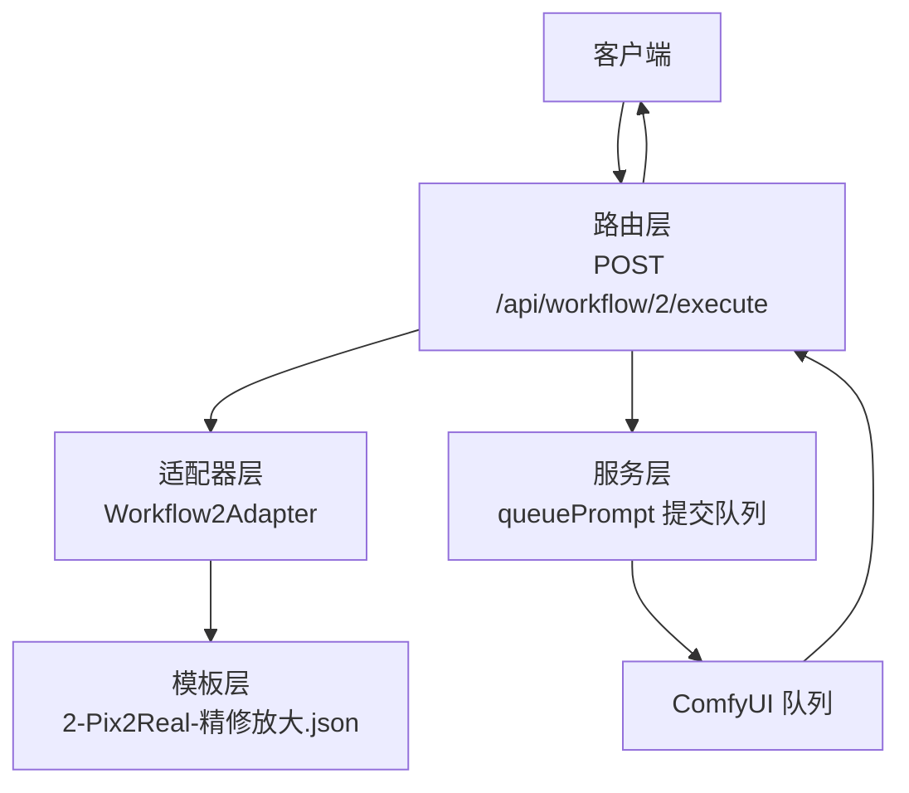
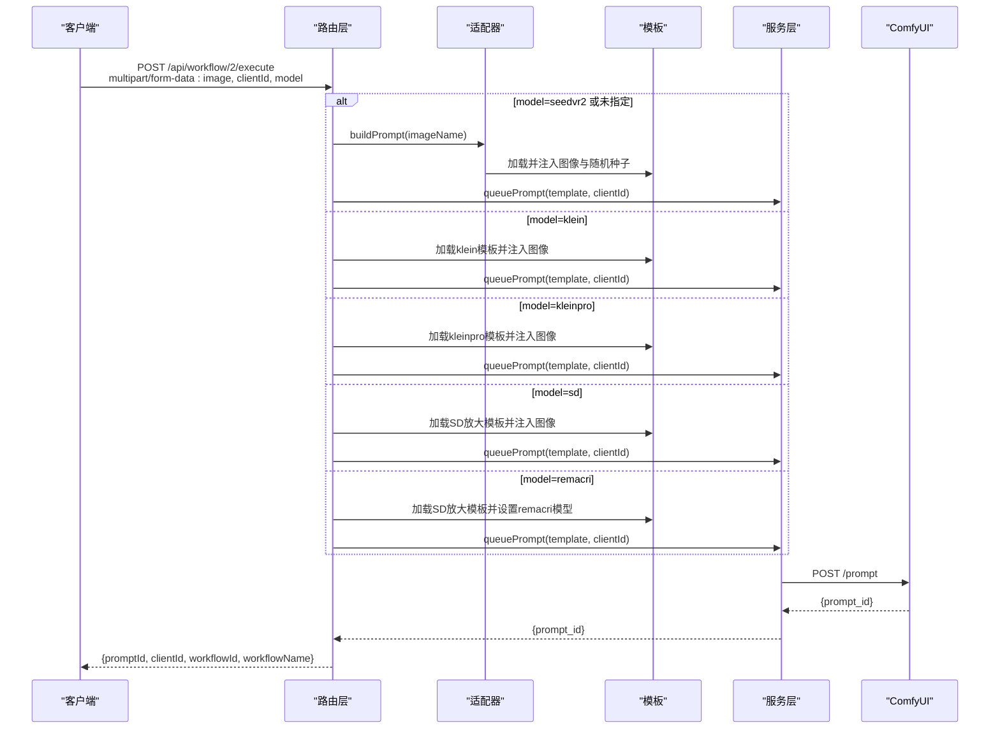
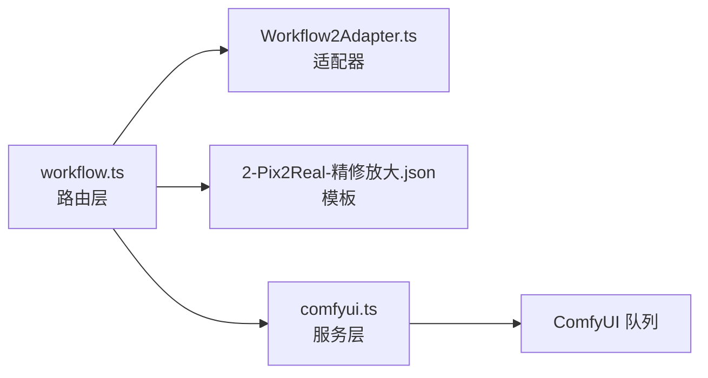

# 精修放大工作流

<cite>
**本文引用的文件**
- [workflow.ts](file://server/src/routes/workflow.ts)
- [Workflow2Adapter.ts](file://server/src/adapters/Workflow2Adapter.ts)
- [2-Pix2Real-精修放大.json](file://ComfyUI_API/2-Pix2Real-精修放大.json)
- [Workflow2SettingsPanel.tsx](file://client/src/components/Workflow2SettingsPanel.tsx)
- [comfyui.ts](file://server/src/services/comfyui.ts)
- [index.ts](file://server/src/types/index.ts)
- [README.md](file://README.md)
</cite>

## 目录
1. [简介](#简介)
2. [项目结构](#项目结构)
3. [核心组件](#核心组件)
4. [架构总览](#架构总览)
5. [详细组件分析](#详细组件分析)
6. [依赖关系分析](#依赖关系分析)
7. [性能考量](#性能考量)
8. [故障排查指南](#故障排查指南)
9. [结论](#结论)
10. [附录](#附录)

## 简介
本文件为“精修放大”工作流（POST /api/workflow/2/execute）的完整API文档，涵盖：
- 请求参数说明：clientId（客户端ID）、model（模型选择）、image（输入图像）
- 五种模型特点与适用场景：seedvr2默认模型、klein基础模型、kleinpro专业模型、sd标准放大模型、remacri特殊效果模型
- 使用示例：不同放大倍数、质量参数配置、响应格式
- 性能考虑与最佳实践

## 项目结构
精修放大工作流由三层协作完成：
- 路由层：接收HTTP请求，解析参数，调用适配器或模板拼装工作流
- 适配器层：加载JSON模板，注入输入图像与随机种子等关键参数
- ComfyUI服务层：将拼装好的工作流提交至ComfyUI队列，并返回prompt_id

图表来源
- [workflow.ts:689-748](file://server/src/routes/workflow.ts#L689-L748)
- [Workflow2Adapter.ts:9-27](file://server/src/adapters/Workflow2Adapter.ts#L9-L27)
- [2-Pix2Real-精修放大.json:1-146](file://ComfyUI_API/2-Pix2Real-精修放大.json#L1-L146)
- [comfyui.ts:168-196](file://server/src/services/comfyui.ts#L168-L196)

章节来源
- [README.md:41-62](file://README.md#L41-L62)
- [workflow.ts:689-748](file://server/src/routes/workflow.ts#L689-L748)

## 核心组件
- 路由处理器：负责解析clientId、model、image，根据model分支选择模板或适配器，并调用queuePrompt提交任务
- 适配器：加载精修放大模板，设置输入图像与随机种子
- 模板：包含SeedVR2放大链路及预览、保存节点
- 服务层：封装ComfyUI队列提交与历史查询

章节来源
- [workflow.ts:689-748](file://server/src/routes/workflow.ts#L689-L748)
- [Workflow2Adapter.ts:9-27](file://server/src/adapters/Workflow2Adapter.ts#L9-L27)
- [2-Pix2Real-精修放大.json:1-146](file://ComfyUI_API/2-Pix2Real-精修放大.json#L1-L146)
- [comfyui.ts:168-196](file://server/src/services/comfyui.ts#L168-L196)

## 架构总览
精修放大工作流的执行序列如下：

图表来源
- [workflow.ts:689-748](file://server/src/routes/workflow.ts#L689-L748)
- [Workflow2Adapter.ts:16-26](file://server/src/adapters/Workflow2Adapter.ts#L16-L26)
- [2-Pix2Real-精修放大.json:57-145](file://ComfyUI_API/2-Pix2Real-精修放大.json#L57-L145)
- [comfyui.ts:168-196](file://server/src/services/comfyui.ts#L168-L196)

## 详细组件分析

### API定义
- 方法与路径：POST /api/workflow/2/execute
- 内容类型：multipart/form-data
- 表单字段：
  - image（必填）：输入图像文件
  - clientId（必填）：客户端标识
  - model（可选）：模型选择，默认seedvr2；可选值seedvr2、klein、kleinpro、sd、remacri

响应格式：
- 成功：返回JSON对象，包含promptId、clientId、workflowId、workflowName
- 失败：返回JSON对象，包含error字段

章节来源
- [workflow.ts:689-748](file://server/src/routes/workflow.ts#L689-L748)
- [index.ts:38-40](file://server/src/types/index.ts#L38-L40)

### 参数详解
- clientId（客户端ID）
  - 类型：字符串
  - 必填：是
  - 作用：用于区分不同客户端的任务队列归属
- model（模型选择）
  - 类型：字符串
  - 可选值：seedvr2、klein、kleinpro、sd、remacri
  - 默认值：seedvr2
- image（输入图像）
  - 类型：二进制文件
  - 必填：是
  - 作用：作为工作流的输入图像

章节来源
- [workflow.ts:697-701](file://server/src/routes/workflow.ts#L697-L701)
- [Workflow2SettingsPanel.tsx](file://client/src/components/Workflow2SettingsPanel.tsx#L10)

### 模型选择与行为
- seedvr2（默认）
  - 通过适配器加载模板，设置输入图像与随机种子
  - 适用于通用精修与放大
- klein
  - 加载klein模板，注入图像并设置默认提示词
  - 适用于动漫转写实风格的修复与细节增强
- kleinpro
  - 加载kleinpro模板，注入图像并设置随机种子
  - 适用于更专业的重绘与细节修复
- sd
  - 加载SD放大模板，注入图像并设置随机种子
  - 适用于标准的2倍放大与细节增强
- remacri
  - 在sd模板基础上，将放大模型设置为remacri_original.safetensors
  - 适用于特殊风格的放大与细节处理

章节来源
- [workflow.ts:703-734](file://server/src/routes/workflow.ts#L703-L734)
- [2-Pix2Real-精修放大.json:57-145](file://ComfyUI_API/2-Pix2Real-精修放大.json#L57-L145)

### 模板与节点说明（精修放大）
- LoadImage（节点1145）：加载上传的输入图像
- SeedVR2LoadVAEModel（节点1146）：加载VAE模型
- SeedVR2LoadDiTModel（节点1149）：加载DiT模型
- SeedVR2VideoUpscaler（节点1148）：执行放大与精修
- PreviewImage（节点1011）：预览输出
- SaveImage（节点1078）：保存输出

章节来源
- [2-Pix2Real-精修放大.json:57-145](file://ComfyUI_API/2-Pix2Real-精修放大.json#L57-L145)

### 使用示例

- 示例1：使用默认seedvr2模型进行精修放大
  - 请求：multipart/form-data，字段image、clientId、model（可省略）
  - 响应：包含promptId、clientId、workflowId、workflowName
- 示例2：选择klein模型
  - 请求：multipart/form-data，字段image、clientId、model=klein
  - 响应：包含promptId、clientId、workflowId、workflowName
- 示例3：选择kleinpro模型
  - 请求：multipart/form-data，字段image、clientId、model=kleinpro
  - 响应：包含promptId、clientId、workflowId、workflowName
- 示例4：选择sd模型
  - 请求：multipart/form-data，字段image、clientId、model=sd
  - 响应：包含promptId、clientId、workflowId、workflowName
- 示例5：选择remacri模型
  - 请求：multipart/form-data，字段image、clientId、model=remacri
  - 响应：包含promptId、clientId、workflowId、workflowName

章节来源
- [workflow.ts:689-748](file://server/src/routes/workflow.ts#L689-L748)

### 响应格式
- 成功响应字段
  - promptId：任务在ComfyUI中的唯一标识
  - clientId：客户端标识
  - workflowId：工作流ID（固定为2）
  - workflowName：工作流名称（固定为“精修放大”）

章节来源
- [workflow.ts:738-743](file://server/src/routes/workflow.ts#L738-L743)
- [index.ts:38-40](file://server/src/types/index.ts#L38-L40)

## 依赖关系分析

图表来源
- [workflow.ts:689-748](file://server/src/routes/workflow.ts#L689-L748)
- [Workflow2Adapter.ts:9-27](file://server/src/adapters/Workflow2Adapter.ts#L9-L27)
- [2-Pix2Real-精修放大.json:1-146](file://ComfyUI_API/2-Pix2Real-精修放大.json#L1-L146)
- [comfyui.ts:168-196](file://server/src/services/comfyui.ts#L168-L196)

章节来源
- [workflow.ts:689-748](file://server/src/routes/workflow.ts#L689-L748)
- [Workflow2Adapter.ts:9-27](file://server/src/adapters/Workflow2Adapter.ts#L9-L27)
- [comfyui.ts:168-196](file://server/src/services/comfyui.ts#L168-L196)

## 性能考量
- 放大倍数与分辨率
  - 精修放大模板中包含分辨率与最大分辨率等参数，可在模板层面调整以控制输出尺寸与显存占用
- 显存与分块
  - 模板中存在VAE与DiT模型的设备选择、分块编码/解码参数，合理设置可降低显存峰值
- 随机种子
  - 模板与适配器均会注入随机种子，避免重复结果
- 输出与预览
  - 模板包含预览与保存节点，建议在调试阶段优先使用预览，确认效果后再保存

章节来源
- [2-Pix2Real-精修放大.json:85-145](file://ComfyUI_API/2-Pix2Real-精修放大.json#L85-L145)
- [Workflow2Adapter.ts:16-26](file://server/src/adapters/Workflow2Adapter.ts#L16-L26)

## 故障排查指南
- 常见错误与提示
  - 无图像文件：检查multipart/form-data中是否包含image字段
  - 无clientId：检查请求中是否包含clientId
  - 模型文件未找到：检查ComfyUI中对应模型是否已安装
  - 队列提交失败：检查ComfyUI服务状态
- 错误映射
  - 路由层将ComfyUI错误映射为用户友好的提示，便于定位问题

章节来源
- [workflow.ts:129-150](file://server/src/routes/workflow.ts#L129-L150)
- [workflow.ts:744-747](file://server/src/routes/workflow.ts#L744-L747)

## 结论
精修放大工作流提供了灵活的多模型选择与稳定的执行流程。通过适配器与模板的分离设计，既保证了扩展性，又简化了参数注入。建议在生产环境中结合模板参数与硬件资源，合理选择模型与分辨率，以获得最佳的性能与质量平衡。

## 附录

### 模型特性与适用场景速览
- seedvr2（默认）
  - 特点：通用精修与放大，适合大多数场景
  - 适用：常规细节增强与放大
- klein
  - 特点：动漫转写实风格，强调细节修复
  - 适用：动漫角色写实化与细节增强
- kleinpro
  - 特点：专业级重绘与细节修复
  - 适用：高质量重绘与细节强化
- sd
  - 特点：标准2倍放大与细节增强
  - 适用：常规放大与细节提升
- remacri
  - 特点：特殊风格的放大与细节处理
  - 适用：需要特殊风格效果的放大

章节来源
- [workflow.ts:703-734](file://server/src/routes/workflow.ts#L703-L734)
- [Workflow2SettingsPanel.tsx](file://client/src/components/Workflow2SettingsPanel.tsx#L10)