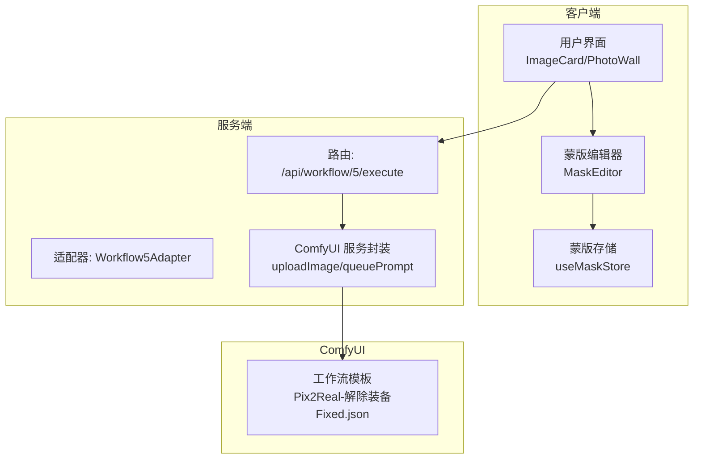
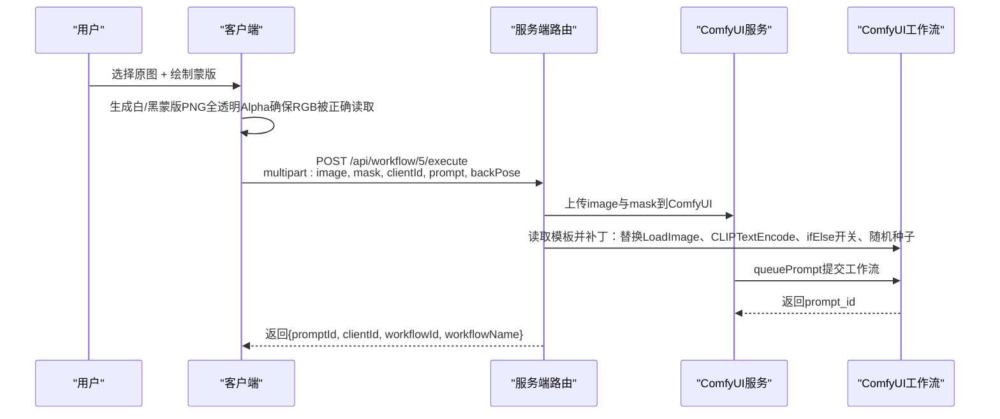
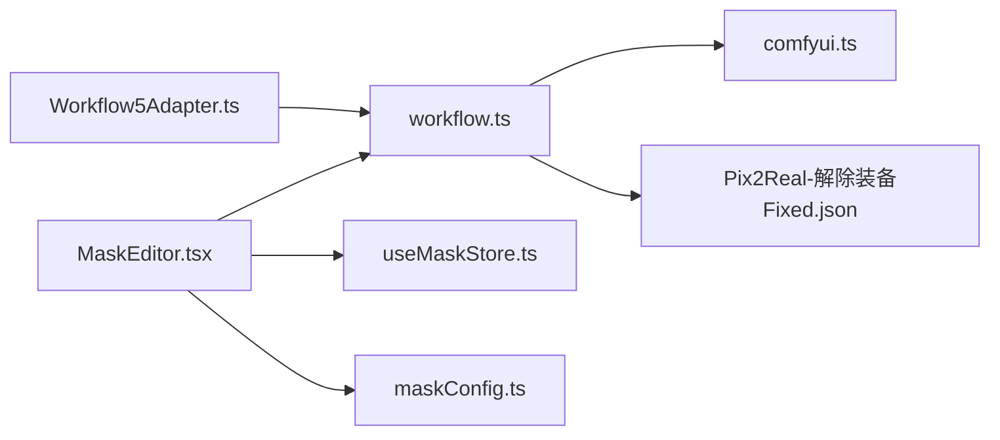

# 解除装备工作流

<cite>
**本文引用的文件**
- [Workflow5Adapter.ts](file://server/src/adapters/Workflow5Adapter.ts)
- [workflow.ts](file://server/src/routes/workflow.ts)
- [comfyui.ts](file://server/src/services/comfyui.ts)
- [Pix2Real-解除装备Fixed.json](file://ComfyUI_API/Pix2Real-解除装备Fixed.json)
- [Pix2Real-解除装备.json](file://ComfyUI_API/Pix2Real-解除装备.json)
- [MaskEditor.tsx](file://client/src/components/MaskEditor.tsx)
- [useMaskStore.ts](file://client/src/hooks/useMaskStore.ts)
- [maskConfig.ts](file://client/src/config/maskConfig.ts)
- [2026-02-25-jiechuazhuangbei-impl.md](file://docs/plans/2026-02-25-jiechuazhuangbei-impl.md)
- [2026-02-25-jiechuazhuangbei-workflow-design.md](file://docs/plans/2026-02-25-jiechuazhuangbei-workflow-design.md)
</cite>

## 目录
1. [简介](#简介)
2. [项目结构](#项目结构)
3. [核心组件](#核心组件)
4. [架构总览](#架构总览)
5. [详细组件分析](#详细组件分析)
6. [依赖关系分析](#依赖关系分析)
7. [性能考量](#性能考量)
8. [故障排查指南](#故障排查指南)
9. [结论](#结论)
10. [附录](#附录)

## 简介
本文件为“解除装备”工作流（POST /api/workflow/5/execute）的完整API文档，面向使用者与开发者，涵盖：
- 请求参数说明（clientId、image、mask、backPose、prompt）
- 为什么需要同时提供原图与蒙版文件
- 蒙版在智能移除装备过程中的作用机制
- 使用示例与最佳实践（蒙版绘制、提示词优化、backPose参数）
- 技术实现原理与局限性

## 项目结构
解除装备工作流位于服务端路由与ComfyUI工作流模板之间，采用“专用路由 + 模板补丁”的设计：
- 服务端：专用路由处理多文件上传与参数解析，并将模板补丁后提交至ComfyUI
- 客户端：蒙版编辑器负责生成符合要求的白/黑蒙版PNG，供工作流使用
- ComfyUI：通过工作流模板完成裁剪、重绘与拼接

图表来源
- [workflow.ts:163-215](file://server/src/routes/workflow.ts#L163-L215)
- [Workflow5Adapter.ts:4-14](file://server/src/adapters/Workflow5Adapter.ts#L4-L14)
- [comfyui.ts:9-25](file://server/src/services/comfyui.ts#L9-L25)
- [Pix2Real-解除装备Fixed.json:1-360](file://ComfyUI_API/Pix2Real-解除装备Fixed.json#L1-L360)

章节来源
- [workflow.ts:163-215](file://server/src/routes/workflow.ts#L163-L215)
- [Workflow5Adapter.ts:4-14](file://server/src/adapters/Workflow5Adapter.ts#L4-L14)
- [comfyui.ts:9-25](file://server/src/services/comfyui.ts#L9-L25)

## 核心组件
- 专用路由：处理POST /api/workflow/5/execute，要求image与mask两个文件，支持clientId、backPose、prompt参数
- 适配器：Workflow5Adapter声明工作流元数据（名称、是否需要提示词、输出目录等）
- ComfyUI服务：封装上传与入队逻辑
- 工作流模板：Pix2Real-解除装备Fixed.json定义节点连接与参数占位
- 客户端蒙版编辑器：生成白/黑蒙版PNG，支持撤销/重做、清空/反转、笔刷调节等

章节来源
- [workflow.ts:163-215](file://server/src/routes/workflow.ts#L163-L215)
- [Workflow5Adapter.ts:4-14](file://server/src/adapters/Workflow5Adapter.ts#L4-L14)
- [comfyui.ts:9-25](file://server/src/services/comfyui.ts#L9-L25)
- [Pix2Real-解除装备Fixed.json:1-360](file://ComfyUI_API/Pix2Real-解除装备Fixed.json#L1-L360)
- [MaskEditor.tsx:1-375](file://client/src/components/MaskEditor.tsx#L1-L375)
- [useMaskStore.ts:1-51](file://client/src/hooks/useMaskStore.ts#L1-L51)
- [maskConfig.ts:1-21](file://client/src/config/maskConfig.ts#L1-L21)

## 架构总览
解除装备工作流的关键交互序列如下：

图表来源
- [workflow.ts:163-215](file://server/src/routes/workflow.ts#L163-L215)
- [comfyui.ts:9-25](file://server/src/services/comfyui.ts#L9-L25)
- [comfyui.ts:168-196](file://server/src/services/comfyui.ts#L168-L196)
- [Pix2Real-解除装备Fixed.json:1-360](file://ComfyUI_API/Pix2Real-解除装备Fixed.json#L1-L360)

## 详细组件分析

### 服务端路由：/api/workflow/5/execute
- 路由注册位置：在通用/:id/execute之前，确保专用路由优先匹配
- 参数校验：
  - image与mask必须同时提供
  - clientId必填
  - backPose接受字符串“true”/“false”，转换为布尔值
  - prompt为空时保留模板默认提示词
- 文件上传：使用upload.fields同时接收image与mask
- 模板补丁：将上传后的文件名注入模板对应节点；根据backPose切换LoRA分支；设置随机种子；按需替换提示词
- 结果返回：返回prompt_id、clientId、workflowId与workflowName

章节来源
- [workflow.ts:163-215](file://server/src/routes/workflow.ts#L163-L215)

### 适配器：Workflow5Adapter
- 提供工作流元数据：id=5、名称“解除装备”、needsPrompt=true、输出目录“5-解除装备”
- buildPrompt抛出异常（工作流5使用专用路由，不走通用构建流程）

章节来源
- [Workflow5Adapter.ts:4-14](file://server/src/adapters/Workflow5Adapter.ts#L4-L14)

### ComfyUI服务封装
- uploadImage：将Buffer上传至ComfyUI，返回文件名
- queuePrompt：提交工作流至ComfyUI，记录节点权重用于进度估计

章节来源
- [comfyui.ts:9-25](file://server/src/services/comfyui.ts#L9-L25)
- [comfyui.ts:168-196](file://server/src/services/comfyui.ts#L168-L196)

### 工作流模板：Pix2Real-解除装备Fixed.json
- 关键节点与补丁点：
  - 节点313：LoadImage（原图）
  - 节点385：LoadImage（蒙版PNG）
  - 节点314：CLIPTextEncode（提示词）
  - 节点389：easy ifElse（backPose开关）
  - 节点315：Seed（随机种子）
- 蒙版读取规则：通过MaskFromColor+（阈值10）将白色区域视为有效蒙版
- 固定版本：Fixed版本去除了中间节点，直接从LoadImage输出读取蒙版

章节来源
- [Pix2Real-解除装备Fixed.json:1-360](file://ComfyUI_API/Pix2Real-解除装备Fixed.json#L1-L360)
- [2026-02-25-jiechuazhuangbei-workflow-design.md:18-35](file://docs/plans/2026-02-25-jiechuazhuangbei-workflow-design.md#L18-L35)

### 客户端蒙版编辑器：MaskEditor
- 功能要点：
  - 支持撤销/重做、清空/反转、笔刷大小/硬度/不透明度调节
  - 生成白/黑蒙版PNG（Alpha设为255，确保ComfyUI读取RGB）
  - 与useMaskStore集成，持久化单张卡片的蒙版
- 与工作流5的协作：
  - 单卡执行：若无蒙版则提示“请先在蒙版编辑器中绘制蒙版”
  - 批量执行：跳过无蒙版的卡片
  - backPose开关：底部Footprints按钮控制后位LoRA开关

章节来源
- [MaskEditor.tsx:1-375](file://client/src/components/MaskEditor.tsx#L1-L375)
- [useMaskStore.ts:1-51](file://client/src/hooks/useMaskStore.ts#L1-L51)
- [maskConfig.ts:1-21](file://client/src/config/maskConfig.ts#L1-L21)

### 数据模型：蒙版存储
- MaskEntry：包含蒙版像素数据、工作分辨率与原始分辨率
- useMaskStore：以“imageId:outputIndex”为键存储蒙版
- maskConfig：tab5启用Mode A蒙版编辑

章节来源
- [useMaskStore.ts:4-10](file://client/src/hooks/useMaskStore.ts#L4-L10)
- [maskConfig.ts:5-17](file://client/src/config/maskConfig.ts#L5-L17)

## 依赖关系分析

图表来源
- [Workflow5Adapter.ts:4-14](file://server/src/adapters/Workflow5Adapter.ts#L4-L14)
- [workflow.ts:163-215](file://server/src/routes/workflow.ts#L163-L215)
- [comfyui.ts:9-25](file://server/src/services/comfyui.ts#L9-L25)
- [Pix2Real-解除装备Fixed.json:1-360](file://ComfyUI_API/Pix2Real-解除装备Fixed.json#L1-L360)
- [MaskEditor.tsx:1-375](file://client/src/components/MaskEditor.tsx#L1-L375)
- [useMaskStore.ts:1-51](file://client/src/hooks/useMaskStore.ts#L1-L51)
- [maskConfig.ts:1-21](file://client/src/config/maskConfig.ts#L1-L21)

## 性能考量
- 模板节点权重：采样器节点权重较高，整体耗时主要集中在采样阶段
- 进度估计：基于节点权重与步骤数估算全局进度，便于前端展示
- 蒙版生成：客户端使用OffscreenCanvas生成PNG，避免服务端图像处理开销
- 并发执行：批量执行时逐个提交至ComfyUI，避免资源争用

章节来源
- [comfyui.ts:58-129](file://server/src/services/comfyui.ts#L58-L129)
- [comfyui.ts:168-196](file://server/src/services/comfyui.ts#L168-L196)

## 故障排查指南
- 400错误：缺少image或mask或clientId
  - 检查FormData是否包含image与mask字段
  - 确认clientId参数传递
- 500错误：ComfyUI报错映射
  - 模型文件缺失：ckpt/lora/unet/vae/control_net
  - 队列提交失败：ComfyUI未启动或网络异常
- 蒙版无效
  - 确认蒙版为纯RGB PNG，白色区域为有效蒙版
  - 确认Alpha为255（全不透明），以便ComfyUI正确读取RGB
- backPose未生效
  - 确认backPose传入“true”或“false”字符串
  - 检查模板节点389的布尔输入是否正确补丁

章节来源
- [workflow.ts:163-215](file://server/src/routes/workflow.ts#L163-L215)
- [comfyui.ts:126-150](file://server/src/services/comfyui.ts#L126-L150)

## 结论
解除装备工作流通过“专用路由 + 模板补丁 + 客户端蒙版编辑”的组合，实现了对原图中特定区域的智能移除与重绘。其关键在于：
- 同时提供原图与蒙版PNG，确保算法聚焦目标区域
- 蒙版读取严格基于白色区域，配合模板中的阈值与扩展参数提升鲁棒性
- backPose参数通过ifElse节点切换LoRA模型，满足不同姿态风格需求
- 客户端蒙版编辑器提供直观的绘制体验与批量执行能力

## 附录

### API定义
- 方法：POST
- 路径：/api/workflow/5/execute
- 认证：无（如需鉴权可在网关层添加）
- 内容类型：multipart/form-data
- 请求参数
  - clientId: string（必填）
  - image: File（必填，原图）
  - mask: File（必填，白/黑蒙版PNG）
  - backPose: string（可选，默认false；"true"/"false"）
  - prompt: string（可选；留空使用模板默认提示词）

- 响应字段
  - promptId: string
  - clientId: string
  - workflowId: number
  - workflowName: string

章节来源
- [workflow.ts:163-215](file://server/src/routes/workflow.ts#L163-L215)
- [2026-02-25-jiechuazhuangbei-workflow-design.md:104-109](file://docs/plans/2026-02-25-jiechuazhuangbei-workflow-design.md#L104-L109)

### 技术实现原理
- 模板补丁策略
  - 将上传后的文件名注入LoadImage节点
  - 根据backPose切换LoRA分支
  - 设置随机种子，保证每次生成的多样性
  - 按需替换提示词，支持用户自定义
- 蒙版读取与处理
  - 通过MaskFromColor+（阈值10）提取白色区域
  - 客户端生成全不透明PNG，确保ComfyUI正确读取RGB
- 节点权重与进度估计
  - 基于采样器权重与步骤数估算整体耗时
  - 为前端阶段化进度提供依据

章节来源
- [Pix2Real-解除装备Fixed.json:1-360](file://ComfyUI_API/Pix2Real-解除装备Fixed.json#L1-L360)
- [2026-02-25-jiechuazhuangbei-workflow-design.md:18-35](file://docs/plans/2026-02-25-jiechuazhuangbei-workflow-design.md#L18-L35)
- [comfyui.ts:58-129](file://server/src/services/comfyui.ts#L58-L129)

### 使用示例与最佳实践
- 蒙版绘制最佳实践
  - 使用蒙版编辑器的“清空/反转/撤销/重做”功能
  - 笔刷大小建议从40px起，逐步调整至边缘细节
  - 硬度与不透明度结合使用，边缘过渡更自然
  - 生成蒙版PNG时保持Alpha为255，确保RGB被正确读取
- 提示词优化技巧
  - 留空使用模板默认提示词，适合快速尝试
  - 自定义提示词时强调“沿边缘去除镂空区域内的衣服，边缘外衣服保留”
  - 避免与模板默认冲突的表述，以免影响效果
- backPose参数使用场景
  - 面向“后位”姿态风格时启用，切换到对应的LoRA模型
  - 一般情况下保持关闭，使用默认模型

章节来源
- [MaskEditor.tsx:1-375](file://client/src/components/MaskEditor.tsx#L1-L375)
- [2026-02-25-jiechuazhuangbei-workflow-design.md:104-109](file://docs/plans/2026-02-25-jiechuazhuangbei-workflow-design.md#L104-L109)

### 为什么需要同时提供原图与蒙版文件
- 蒙版定义了需要移除或重绘的目标区域，仅凭原图无法确定边界
- 模板通过LoadImage读取蒙版PNG，并用MaskFromColor+提取有效区域
- 白色区域被视为蒙版有效区，黑色区域为背景，二者缺一不可

章节来源
- [2026-02-25-jiechuazhuangbei-workflow-design.md:28-35](file://docs/plans/2026-02-25-jiechuazhuangbei-workflow-design.md#L28-L35)
- [Pix2Real-解除装备Fixed.json:1-360](file://ComfyUI_API/Pix2Real-解除装备Fixed.json#L1-L360)

### 局限性
- 蒙版质量直接影响结果：边缘模糊或颜色偏差会导致重绘不准确
- backPose切换依赖LoRA模型可用性，若模型缺失将回退到默认
- 模板默认提示词可能与复杂场景存在偏差，需结合用户提示词微调
- 批量执行时若某张图无蒙版会被跳过，需在前端进行状态提示

章节来源
- [2026-02-25-jiechuazhuangbei-impl.md:648-667](file://docs/plans/2026-02-25-jiechuazhuangbei-impl.md#L648-L667)
- [workflow.ts:163-215](file://server/src/routes/workflow.ts#L163-L215)