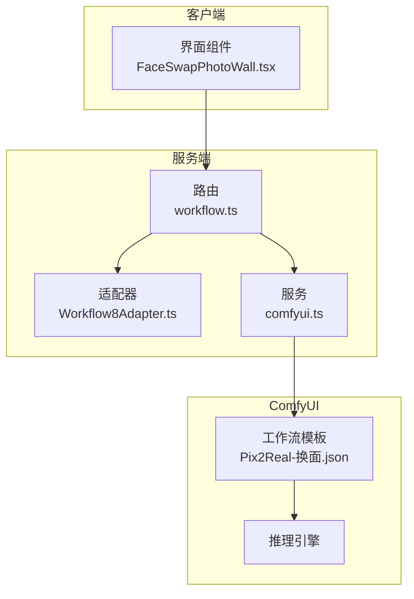
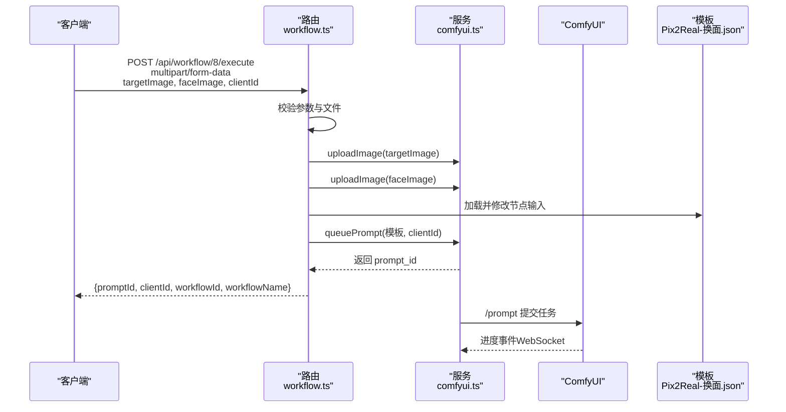
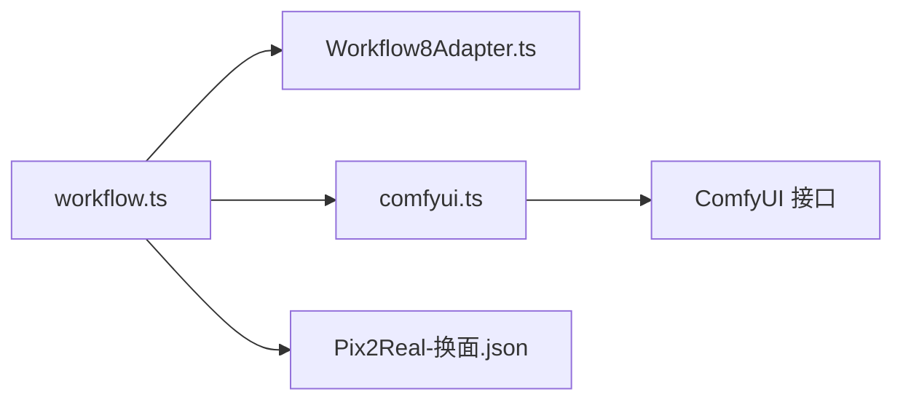

# 黑兽换脸工作流

<cite>
**本文档引用的文件**
- [workflow.ts](file://server/src/routes/workflow.ts)
- [Workflow8Adapter.ts](file://server/src/adapters/Workflow8Adapter.ts)
- [Pix2Real-换面.json](file://ComfyUI_API/Pix2Real-换面.json)
- [comfyui.ts](file://server/src/services/comfyui.ts)
- [FaceSwapPhotoWall.tsx](file://client/src/components/FaceSwapPhotoWall.tsx)
- [README.md](file://README.md)
</cite>

## 目录
1. [简介](#简介)
2. [项目结构](#项目结构)
3. [核心组件](#核心组件)
4. [架构概览](#架构概览)
5. [详细组件分析](#详细组件分析)
6. [依赖关系分析](#依赖关系分析)
7. [性能考量](#性能考量)
8. [故障排查指南](#故障排查指南)
9. [结论](#结论)
10. [附录](#附录)

## 简介
本文件为“黑兽换脸”工作流（POST /api/workflow/8/execute）的完整API文档。该工作流通过同时提供目标图像与人脸图像，实现高质量的人脸替换。本文将详细说明：
- 请求参数与数据格式
- 工作流为何需要同时提供目标图像与人脸图像
- 换脸过程中的技术要点
- 使用示例与最佳实践
- 技术限制与隐私保护
- 常见问题与解决方案

## 项目结构
该系统采用前后端分离架构：
- 客户端（React）负责拖拽、选择与提交任务
- 服务端（Express）负责接收请求、校验参数、上传文件、拼接工作流模板并提交至ComfyUI
- ComfyUI负责执行实际的AI推理与图像处理

图表来源
- [workflow.ts:595-642](file://server/src/routes/workflow.ts#L595-L642)
- [Workflow8Adapter.ts:1-14](file://server/src/adapters/Workflow8Adapter.ts#L1-L14)
- [comfyui.ts:1-25](file://server/src/services/comfyui.ts#L1-L25)
- [Pix2Real-换面.json:1-369](file://ComfyUI_API/Pix2Real-换面.json#L1-L369)

章节来源
- [README.md:41-79](file://README.md#L41-L79)

## 核心组件
- 路由层：处理HTTP请求，解析multipart/form-data，校验必需参数，调用上传与队列服务
- 适配器层：为工作流8提供名称、输出目录等元数据；明确该工作流不使用通用构建流程
- 服务层：封装ComfyUI上传与队列接口，记录节点权重以支持进度计算
- 模板层：工作流JSON模板，定义节点连接与参数映射

章节来源
- [workflow.ts:595-642](file://server/src/routes/workflow.ts#L595-L642)
- [Workflow8Adapter.ts:1-14](file://server/src/adapters/Workflow8Adapter.ts#L1-L14)
- [comfyui.ts:1-25](file://server/src/services/comfyui.ts#L1-L25)
- [Pix2Real-换面.json:1-369](file://ComfyUI_API/Pix2Real-换面.json#L1-L369)

## 架构概览
下图展示了从客户端发起请求到ComfyUI执行的完整序列：

图表来源
- [workflow.ts:595-642](file://server/src/routes/workflow.ts#L595-L642)
- [comfyui.ts:9-25](file://server/src/services/comfyui.ts#L9-L25)
- [comfyui.ts:168-196](file://server/src/services/comfyui.ts#L168-L196)
- [Pix2Real-换面.json:1-369](file://ComfyUI_API/Pix2Real-换面.json#L1-L369)

## 详细组件分析

### API定义：POST /api/workflow/8/execute
- 方法：POST
- 路径：/api/workflow/8/execute
- 内容类型：multipart/form-data
- 表单字段：
  - targetImage（必填）：目标图像文件（支持PNG/JPEG/WebP等）
  - faceImage（必填）：人脸图像文件（建议清晰、正面、无遮挡）
  - clientId（必填）：客户端标识，用于WebSocket进度回传与任务关联
- 成功响应：返回任务标识与工作流元数据
- 错误响应：返回用户友好的错误信息（如缺少文件、ComfyUI不可达）

请求参数说明
- clientId：字符串，用于区分不同客户端的任务队列与进度推送
- targetImage：二进制文件，作为换脸的目标主体
- faceImage：二进制文件，作为被替换的人脸来源

请求示例（curl）
- curl -X POST http://localhost:3000/api/workflow/8/execute \
  -F clientId=abc123 \
  -F targetImage=@target.png \
  -F faceImage=@face.jpg

响应示例
- { "promptId": "xxxx", "clientId": "abc123", "workflowId": 8, "workflowName": "黑兽换脸" }

章节来源
- [workflow.ts:595-642](file://server/src/routes/workflow.ts#L595-L642)

### 为什么需要同时提供目标图像与人脸图像
- 目标图像：提供背景、姿态、光照与整体场景，确保换脸后的融合自然
- 人脸图像：提供清晰的人脸特征（五官、肤色、发色等），保证替换质量
- 模板设计：工作流模板明确将目标图像与人脸图像分别注入对应节点，实现“仅替换人脸”的目标

章节来源
- [Pix2Real-换面.json:226-234](file://ComfyUI_API/Pix2Real-换面.json#L226-L234)
- [Pix2Real-换面.json:160-168](file://ComfyUI_API/Pix2Real-换面.json#L160-L168)

### 换脸过程中的技术要点
- 图像上传：服务端将两个图像上传至ComfyUI，返回文件名
- 模板拼接：读取工作流模板，将目标图像与人脸图像分别绑定到对应节点
- 随机种子：为每次任务生成随机种子，提升结果多样性
- 队列提交：将拼接后的模板提交到ComfyUI队列，返回任务ID
- 进度追踪：服务端记录节点权重，结合WebSocket事件计算阶段化进度

章节来源
- [workflow.ts:620-630](file://server/src/routes/workflow.ts#L620-L630)
- [comfyui.ts:168-196](file://server/src/services/comfyui.ts#L168-L196)

### 客户端交互与使用示例
- 拖拽布局：界面分为“脸部参考区”和“目标图区”，支持拖拽交换
- 任务提交：将人脸图像拖拽到目标图像上，触发换脸任务
- 会话关联：通过clientId与WebSocket建立进度通道

使用示例（界面操作）
- 将目标图像拖入“目标图区”
- 将人脸图像拖入“脸部参考区”
- 将人脸图像拖拽到目标图像上，系统自动构造multipart/form-data并提交

章节来源
- [FaceSwapPhotoWall.tsx:397-427](file://client/src/components/FaceSwapPhotoWall.tsx#L397-L427)

### 图像质量要求与人脸检测注意事项
- 目标图像
  - 清晰度：建议分辨率≥1080p，避免过度模糊
  - 光照：与人脸图像光照尽量一致，减少阴影差异
  - 角度：人脸应处于可见范围，避免过大侧脸或背对
- 人脸图像
  - 正面：尽量正脸拍摄，避免强烈侧脸或闭眼
  - 清晰度：五官清晰，避免模糊、反光或遮挡
  - 质量：建议高像素，避免压缩过度
- 人脸检测
  - 模板内部包含人脸/分割相关节点，建议确保人脸在图像中完整且可辨识
  - 若目标图像中存在多人物，建议裁剪或调整目标图像，突出目标人物

章节来源
- [Pix2Real-换面.json:91-98](file://ComfyUI_API/Pix2Real-换面.json#L91-L98)

### 换脸效果优化技巧
- 一致性控制
  - 保持目标图像与人脸图像的色调、饱和度相近
  - 调整光照方向与强度，使两者匹配
- 细节增强
  - 使用“真人精修/高清重绘”类工作流进行后处理
  - 对边缘进行轻微羽化或融合，避免明显接缝
- 参数微调
  - 适当提高采样步数与CFG值，提升细节还原
  - 控制种子变化，便于批量对比与筛选

章节来源
- [comfyui.ts:58-107](file://server/src/services/comfyui.ts#L58-L107)

### 技术限制
- 模型与硬件
  - 需要ComfyUI运行于本地或内网（默认地址为127.0.0.1:8188）
  - 换脸过程对显存占用较高，需确保GPU显存充足
- 输入约束
  - 人脸必须清晰可见，否则换脸效果可能不佳
  - 目标图像中若存在多人物，建议明确目标人物
- 输出路径
  - 结果保存在ComfyUI的输出目录中，可通过服务端提供的输出接口访问

章节来源
- [README.md:16-31](file://README.md#L16-L31)
- [comfyui.ts:6-7](file://server/src/services/comfyui.ts#L6-L7)

### 隐私保护考虑
- 数据本地化：图像上传至本地ComfyUI，不经过第三方服务器
- 任务隔离：clientId用于区分任务，避免跨用户进度泄露
- 临时文件：上传的图像在ComfyUI中以临时文件形式存在，建议及时清理

章节来源
- [workflow.ts:614-618](file://server/src/routes/workflow.ts#L614-L618)
- [comfyui.ts:9-25](file://server/src/services/comfyui.ts#L9-L25)

## 依赖关系分析
- 路由依赖适配器与服务层
- 服务层依赖ComfyUI的HTTP与WebSocket接口
- 模板文件定义了节点间的连接关系与参数映射

图表来源
- [workflow.ts:595-642](file://server/src/routes/workflow.ts#L595-L642)
- [Workflow8Adapter.ts:1-14](file://server/src/adapters/Workflow8Adapter.ts#L1-L14)
- [comfyui.ts:1-25](file://server/src/services/comfyui.ts#L1-L25)
- [Pix2Real-换面.json:1-369](file://ComfyUI_API/Pix2Real-换面.json#L1-L369)

## 性能考量
- 上传与队列
  - 上传采用内存存储，建议控制单次文件大小，避免内存压力
  - 队列提交后，服务端记录节点权重，WebSocket事件用于进度反馈
- 节点权重
  - 采样器节点权重与步骤数相关，步骤越多耗时越长
  - tiled采样器会根据估算tile数增加权重，影响总体进度

章节来源
- [comfyui.ts:58-144](file://server/src/services/comfyui.ts#L58-L144)

## 故障排查指南
- 常见错误与解决
  - 缺少参数：确保同时提供targetImage、faceImage与clientId
  - ComfyUI不可达：确认ComfyUI已在127.0.0.1:8188运行
  - 上传失败：检查文件格式与大小，确保网络稳定
- 日志与诊断
  - 服务端会打印错误日志，便于定位问题
  - WebSocket连接异常时，检查浏览器与服务端的网络连通性

章节来源
- [workflow.ts:638-641](file://server/src/routes/workflow.ts#L638-L641)
- [comfyui.ts:175-178](file://server/src/services/comfyui.ts#L175-L178)

## 结论
黑兽换脸工作流通过“目标图像+人脸图像”的双输入设计，实现了高质量的人脸替换。配合清晰的参数规范、完善的错误处理与进度反馈机制，能够在本地环境中高效完成换脸任务。建议在使用中关注图像质量与光照一致性，并结合后处理工作流进一步优化效果。

## 附录

### API参数一览
- 路径：/api/workflow/8/execute
- 方法：POST
- 内容类型：multipart/form-data
- 字段：
  - targetImage：目标图像（必填）
  - faceImage：人脸图像（必填）
  - clientId：客户端ID（必填）

章节来源
- [workflow.ts:595-642](file://server/src/routes/workflow.ts#L595-L642)