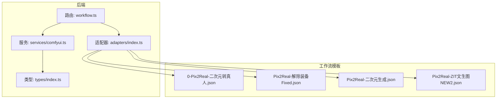
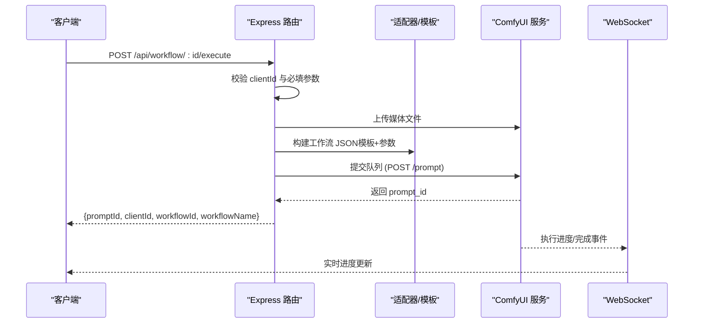
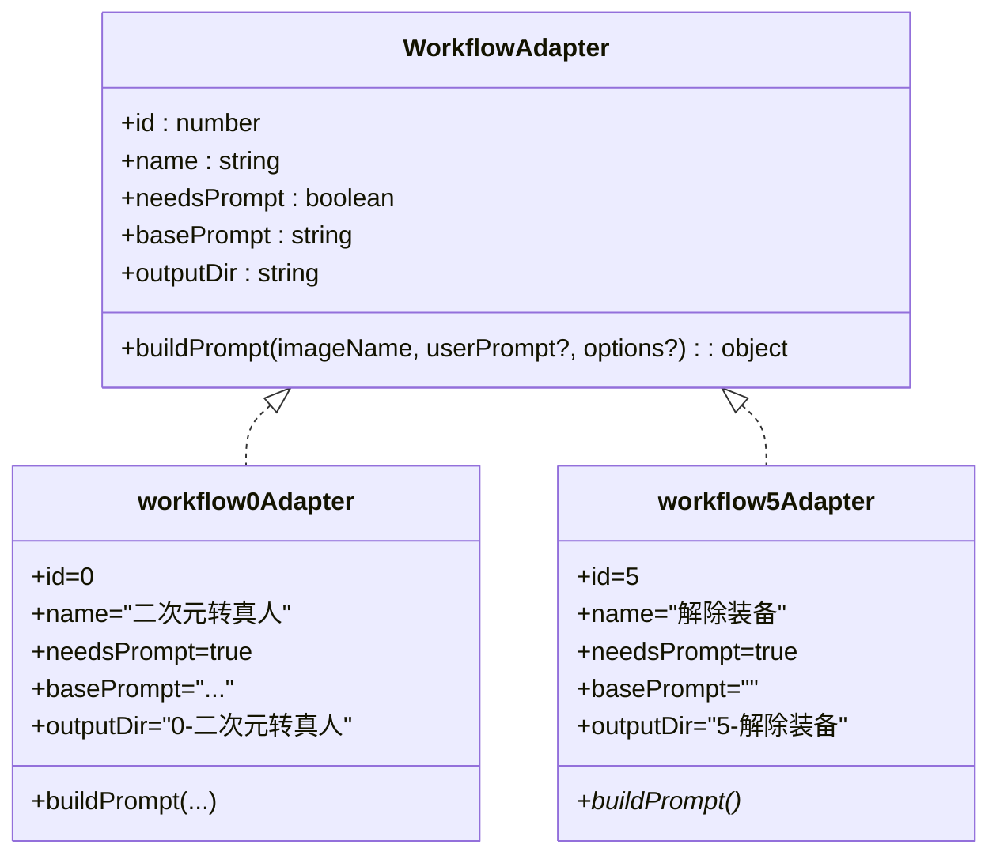

# 工作流执行接口

<cite>
**本文引用的文件**
- [server/src/routes/workflow.ts](file://server/src/routes/workflow.ts)
- [server/src/services/comfyui.ts](file://server/src/services/comfyui.ts)
- [server/src/adapters/index.ts](file://server/src/adapters/index.ts)
- [server/src/adapters/BaseAdapter.ts](file://server/src/adapters/BaseAdapter.ts)
- [server/src/adapters/Workflow0Adapter.ts](file://server/src/adapters/Workflow0Adapter.ts)
- [server/src/adapters/Workflow5Adapter.ts](file://server/src/adapters/Workflow5Adapter.ts)
- [server/src/types/index.ts](file://server/src/types/index.ts)
- [README.md](file://README.md)
- [ComfyUI_API/0-Pix2Real-二次元转真人.json](file://ComfyUI_API/0-Pix2Real-二次元转真人.json)
- [ComfyUI_API/Pix2Real-解除装备Fixed.json](file://ComfyUI_API/Pix2Real-解除装备Fixed.json)
- [ComfyUI_API/Pix2Real-二次元生成.json](file://ComfyUI_API/Pix2Real-二次元生成.json)
- [ComfyUI_API/Pix2Real-ZIT文生图NEW2.json](file://ComfyUI_API/Pix2Real-ZIT文生图NEW2.json)
- [client/src/hooks/useWorkflowStore.ts](file://client/src/hooks/useWorkflowStore.ts)
- [client/src/services/api.ts](file://client/src/services/api.ts)
</cite>

## 目录
1. [简介](#简介)
2. [项目结构](#项目结构)
3. [核心组件](#核心组件)
4. [架构总览](#架构总览)
5. [详细组件分析](#详细组件分析)
6. [依赖关系分析](#依赖关系分析)
7. [性能考量](#性能考量)
8. [故障排查指南](#故障排查指南)
9. [结论](#结论)
10. [附录](#附录)

## 简介
本文件为 CorineKit Pix2Real 的工作流执行接口 API 文档，覆盖通用执行接口与多个专用工作流接口，包括：
- 通用执行接口：POST /api/workflow/:id/execute
- 专用工作流接口：如 POST /api/workflow/0/execute（二次元转真人）、POST /api/workflow/5/execute（解除装备）等
- 以及与之配套的模型查询接口、参考图上传与访问接口等

文档内容涵盖：
- 请求参数说明（文件上传参数、JSON 请求体参数）
- 响应数据格式
- 错误码定义与错误处理策略
- 关键约束：客户端 ID 要求、文件格式限制、LoRA 模型配置、提示词参数等
- curl 命令示例与 JavaScript 客户端调用示例

## 项目结构
后端采用 Express + TypeScript，路由集中在 workflow.ts，适配器模式封装不同工作流的模板与参数构建逻辑，服务层通过 comfyui.ts 与 ComfyUI 进行交互。

图表来源
- [server/src/routes/workflow.ts:152-800](file://server/src/routes/workflow.ts#L152-L800)
- [server/src/adapters/index.ts:14-33](file://server/src/adapters/index.ts#L14-L33)
- [server/src/services/comfyui.ts:168-196](file://server/src/services/comfyui.ts#L168-L196)
- [ComfyUI_API/0-Pix2Real-二次元转真人.json:1-200](file://ComfyUI_API/0-Pix2Real-二次元转真人.json#L1-L200)
- [ComfyUI_API/Pix2Real-解除装备Fixed.json:1-200](file://ComfyUI_API/Pix2Real-解除装备Fixed.json#L1-L200)
- [ComfyUI_API/Pix2Real-二次元生成.json:1-200](file://ComfyUI_API/Pix2Real-二次元生成.json#L1-L200)
- [ComfyUI_API/Pix2Real-ZIT文生图NEW2.json:1-200](file://ComfyUI_API/Pix2Real-ZIT文生图NEW2.json#L1-L200)

章节来源
- [README.md: 项目结构与工作流概览:41-79](file://README.md#L41-L79)
- [server/src/routes/workflow.ts: 路由与执行逻辑:152-800](file://server/src/routes/workflow.ts#L152-L800)
- [server/src/adapters/index.ts: 适配器注册:14-33](file://server/src/adapters/index.ts#L14-L33)

## 核心组件
- 路由层（workflow.ts）：提供工作流执行端点、模型查询端点、参考图管理端点等
- 适配器层（adapters/*Adapter.ts）：封装各工作流的模板加载与参数构建
- 服务层（services/comfyui.ts）：负责与 ComfyUI 的 HTTP/WS 通信、队列管理、进度追踪
- 类型定义（types/index.ts）：统一响应与事件类型

章节来源
- [server/src/routes/workflow.ts: 路由与执行逻辑:152-800](file://server/src/routes/workflow.ts#L152-L800)
- [server/src/adapters/index.ts: 适配器注册:14-33](file://server/src/adapters/index.ts#L14-L33)
- [server/src/services/comfyui.ts: 服务接口:168-196](file://server/src/services/comfyui.ts#L168-L196)
- [server/src/types/index.ts: 类型定义:1-52](file://server/src/types/index.ts#L1-L52)

## 架构总览
后端通过 Express 暴露 REST 接口，请求到达路由层后根据工作流 ID 选择适配器或直接使用通用模板，将上传的媒体文件上传至 ComfyUI，并将构建好的工作流 JSON 提交到队列。前端通过 WebSocket 接收进度事件，完成后从 ComfyUI 获取输出文件。

图表来源
- [server/src/routes/workflow.ts: 通用执行流程:750-799](file://server/src/routes/workflow.ts#L750-L799)
- [server/src/services/comfyui.ts: queuePrompt 与 WebSocket:168-196](file://server/src/services/comfyui.ts#L168-L196)
- [server/src/services/comfyui.ts: connectWebSocket:265-375](file://server/src/services/comfyui.ts#L265-L375)

## 详细组件分析

### 通用执行接口
- 端点：POST /api/workflow/:id/execute
- 方法：multipart/form-data（单文件上传）
- 查询参数/请求体参数：
  - clientId（必需）：字符串，客户端标识
  - image（必需）：二进制文件（图片或视频，视工作流而定）
  - prompt（可选）：字符串，用户自定义提示词
  - options（可选）：JSON 字符串，传递给适配器的选项对象
- 响应：
  - promptId：提交到队列的工作流标识
  - clientId：回显
  - workflowId：工作流编号
  - workflowName：工作流名称
- 错误：
  - 400：缺少 clientId 或缺少 image
  - 500：通用错误，内部错误映射为用户友好提示

章节来源
- [server/src/routes/workflow.ts: 通用执行实现:750-799](file://server/src/routes/workflow.ts#L750-L799)

### 专用工作流接口

#### 二次元转真人（POST /api/workflow/0/execute）
- 输入：
  - multipart/form-data：
    - image（必需）：图片文件
  - 表单字段：
    - clientId（必需）：字符串
    - model（可选，默认 qwen）：字符串，支持 qwen/klein
    - prompt（可选）：字符串，用户提示词
- 行为：
  - 支持两种模型路径：qwen（通过适配器构建）与 klein（使用模板）
  - prompt 为空时使用默认提示词
- 响应：同通用接口

章节来源
- [server/src/routes/workflow.ts: 二次元转真人:644-687](file://server/src/routes/workflow.ts#L644-L687)
- [server/src/adapters/Workflow0Adapter.ts: 适配器实现:9-35](file://server/src/adapters/Workflow0Adapter.ts#L9-L35)

#### 解除装备（POST /api/workflow/5/execute）
- 输入：
  - multipart/form-data：
    - image（必需）：原图
    - mask（必需）：蒙版
  - 表单字段：
    - clientId（必需）：字符串
    - backPose（可选）：布尔字符串（'true'/'false'）
    - prompt（可选）：字符串，用户提示词
- 行为：
  - 使用固定模板，将 image 与 mask 绑定到相应节点
  - prompt 为空时使用 JSON 默认提示词
- 响应：同通用接口

章节来源
- [server/src/routes/workflow.ts: 解除装备:163-215](file://server/src/routes/workflow.ts#L163-L215)
- [ComfyUI_API/Pix2Real-解除装备Fixed.json: 模板结构:1-200](file://ComfyUI_API/Pix2Real-解除装备Fixed.json#L1-L200)

#### 区域编辑（POST /api/workflow/10/execute）
- 输入：
  - multipart/form-data：
    - image（必需）：原图
    - mask（必需）：蒙版
  - 表单字段：
    - clientId（必需）：字符串
    - backPose（可选）：布尔字符串（'true'/'false'）
    - prompt（可选）：字符串，用户提示词（与 5 相比，总是设置，即使为空）
- 行为：
  - 与 5 相同的模板与参数绑定，但 prompt 设置策略不同
- 响应：同通用接口

章节来源
- [server/src/routes/workflow.ts: 区域编辑:217-267](file://server/src/routes/workflow.ts#L217-L267)

#### 黑兽换脸（POST /api/workflow/8/execute）
- 输入：
  - multipart/form-data：
    - targetImage（必需）：目标人物图
    - faceImage（必需）：替换的脸部图
  - 表单字段：
    - clientId（必需）：字符串
- 行为：
  - 使用固定模板，绑定两张图片
- 响应：同通用接口

章节来源
- [server/src/routes/workflow.ts: 黑兽换脸:595-642](file://server/src/routes/workflow.ts#L595-L642)

#### 精修放大（POST /api/workflow/2/execute）
- 输入：
  - multipart/form-data：
    - image（必需）：图片文件
  - 表单字段：
    - clientId（必需）：字符串
    - model（可选，默认 seedvr2）：字符串，支持 seedvr2/klein/kleinpro/sd/remacri
- 行为：
  - 支持多种模型路径，分别加载不同模板
- 响应：同通用接口

章节来源
- [server/src/routes/workflow.ts: 精修放大:689-748](file://server/src/routes/workflow.ts#L689-L748)

#### 快速出图（POST /api/workflow/7/execute）
- 输入：JSON 请求体（application/json）
  - clientId（必需）：字符串
  - model（可选）：字符串，Checkpoint 模型名
  - loras（可选）：数组，每项包含 model、enabled、strength
  - prompt（可选）：字符串
  - negativePrompt（可选）：字符串
  - width/height（可选）：数字
  - steps/cfg/sampler/scheduler（可选）：采样相关参数
  - name（可选）：输出文件名前缀
  - seed（可选）：数字
  - referenceImage（可选）：字符串，参考图文件名（配合 PRO 分支）
  - depthStrength/poseStrength（可选）：数字（PRO 分支）
  - useOriginalRatio（可选）：布尔，是否使用原图比例（PRO 分支）
- 行为：
  - 若包含 referenceImage，则使用 PRO 模板；否则使用普通模板
  - LoRA 通过链式连接与开关控制
- 响应：同通用接口

章节来源
- [server/src/routes/workflow.ts: 快速出图:269-405](file://server/src/routes/workflow.ts#L269-L405)
- [ComfyUI_API/Pix2Real-二次元生成.json: 模板结构:1-200](file://ComfyUI_API/Pix2Real-二次元生成.json#L1-L200)

#### ZIT快出（POST /api/workflow/9/execute）
- 输入：JSON 请求体（application/json）
  - clientId（必需）：字符串
  - unetModel（必需）：UNet 模型名
  - loras（可选）：数组，每项包含 model、enabled、strength
  - shiftEnabled（必需）：布尔，是否启用 AuraFlow shift
  - shift（可选）：数字
  - prompt（可选）：字符串
  - width/height（可选）：数字
  - steps/cfg/sampler/scheduler（可选）：采样相关参数
  - name（可选）：输出文件名前缀
- 行为：
  - 使用 ZIT 模板，支持 UNet + LoRA + shift 切换
  - LoRA 启用状态决定下游连接
- 响应：同通用接口

章节来源
- [server/src/routes/workflow.ts: ZIT快出:485-593](file://server/src/routes/workflow.ts#L485-L593)
- [ComfyUI_API/Pix2Real-ZIT文生图NEW2.json: 模板结构:1-200](file://ComfyUI_API/Pix2Real-ZIT文生图NEW2.json#L1-L200)

### 参考图管理（快速出图 PRO 分支）
- 上传参考图：POST /api/workflow/7/ref-image
  - multipart/form-data：image（必需）
  - 响应：{ filename, url, width, height }
- 访问参考图：GET /api/workflow/7/ref-image/:filename
  - 响应：二进制图片
- 删除参考图：DELETE /api/workflow/7/ref-image/:filename
  - 响应：{ ok: true }

章节来源
- [server/src/routes/workflow.ts: 参考图管理:437-484](file://server/src/routes/workflow.ts#L437-L484)

### 模型查询接口
- GET /api/workflow/models/checkpoints
  - 响应：可用 Checkpoint 模型名数组
- GET /api/workflow/models/unets
  - 响应：可用 UNet 模型名数组
- GET /api/workflow/models/loras
  - 响应：可用 LoRA 模型名数组

章节来源
- [server/src/routes/workflow.ts: 模型查询:407-435](file://server/src/routes/workflow.ts#L407-L435)
- [server/src/services/comfyui.ts: 模型查询实现:415-440](file://server/src/services/comfyui.ts#L415-L440)

## 依赖关系分析

图表来源
- [server/src/adapters/BaseAdapter.ts:1-4](file://server/src/adapters/BaseAdapter.ts#L1-L4)
- [server/src/adapters/Workflow0Adapter.ts:9-35](file://server/src/adapters/Workflow0Adapter.ts#L9-L35)
- [server/src/adapters/Workflow5Adapter.ts:4-14](file://server/src/adapters/Workflow5Adapter.ts#L4-L14)

章节来源
- [server/src/adapters/index.ts: 适配器注册:14-33](file://server/src/adapters/index.ts#L14-L33)

## 性能考量
- 采样器权重估算：服务层根据节点类型与采样步数估算总权重，用于进度条的全局百分比计算
- Tiled 采样器：对大图/高倍放大场景进行经验权重估算
- WebSocket 进度：优先使用 execution_success 事件，若缺失则以 executing:null 作为兜底，避免“卡片完成但输出为空”的问题

章节来源
- [server/src/services/comfyui.ts: 节点权重与进度估算:58-144](file://server/src/services/comfyui.ts#L58-L144)
- [server/src/services/comfyui.ts: WebSocket 事件处理:265-375](file://server/src/services/comfyui.ts#L265-L375)

## 故障排查指南
- 常见错误映射：
  - 模型/LoRA/UNet/Vae/ControlNet 未找到：映射为用户友好提示
  - 队列提交失败：提示检查 ComfyUI 是否正常运行
- 通用错误处理：
  - 400：缺少必要参数（clientId、image、mask、referenceImage 等）
  - 500：内部错误，返回友好错误信息
- 建议排查步骤：
  - 确认 ComfyUI 服务地址与端口（默认 http://127.0.0.1:8188）
  - 确认模型文件已正确安装并出现在模型列表中
  - 确认上传文件格式与大小符合预期（图片/视频）

章节来源
- [server/src/routes/workflow.ts: 错误映射与处理:126-150](file://server/src/routes/workflow.ts#L126-L150)
- [README.md: ComfyUI 依赖:16-20](file://README.md#L16-L20)

## 结论
本文档系统性梳理了 Pix2Real 的工作流执行接口，覆盖通用与专用端点、参数与响应规范、错误处理策略及性能要点。结合前端 store 与服务层的 WebSocket 进度机制，可实现稳定的批量处理与实时反馈体验。

## 附录

### API 定义与示例

- 通用执行接口
  - 端点：POST /api/workflow/:id/execute
  - 请求：
    - Content-Type: multipart/form-data
    - 表单字段：
      - image（必需）：媒体文件
      - clientId（必需）：字符串
      - prompt（可选）：字符串
      - options（可选）：JSON 字符串
  - 响应：{ promptId, clientId, workflowId, workflowName }

- 二次元转真人（POST /api/workflow/0/execute）
  - 请求：
    - Content-Type: multipart/form-data
    - 表单字段：
      - image（必需）：图片
      - clientId（必需）：字符串
      - model（可选）：qwen/klein
      - prompt（可选）：字符串
  - 响应：同上

- 解除装备（POST /api/workflow/5/execute）
  - 请求：
    - Content-Type: multipart/form-data
    - 表单字段：
      - image（必需）：原图
      - mask（必需）：蒙版
      - clientId（必需）：字符串
      - backPose（可选）：'true'/'false'
      - prompt（可选）：字符串
  - 响应：同上

- 区域编辑（POST /api/workflow/10/execute）
  - 请求：
    - Content-Type: multipart/form-data
    - 表单字段：
      - image（必需）：原图
      - mask（必需）：蒙版
      - clientId（必需）：字符串
      - backPose（可选）：'true'/'false'
      - prompt（可选）：字符串
  - 响应：同上

- 黑兽换脸（POST /api/workflow/8/execute）
  - 请求：
    - Content-Type: multipart/form-data
    - 表单字段：
      - targetImage（必需）：目标图
      - faceImage（必需）：替换脸
      - clientId（必需）：字符串
  - 响应：同上

- 精修放大（POST /api/workflow/2/execute）
  - 请求：
    - Content-Type: multipart/form-data
    - 表单字段：
      - image（必需）：图片
      - clientId（必需）：字符串
      - model（可选）：seedvr2/klein/kleinpro/sd/remacri
  - 响应：同上

- 快速出图（POST /api/workflow/7/execute）
  - 请求：
    - Content-Type: application/json
    - JSON 字段：
      - clientId（必需）：字符串
      - model（可选）：Checkpoint 名称
      - loras（可选）：[{ model, enabled, strength }]
      - prompt/negativePrompt（可选）：字符串
      - width/height（可选）：数字
      - steps/cfg/sampler/scheduler（可选）：采样参数
      - name（可选）：输出前缀
      - seed（可选）：数字
      - referenceImage（可选）：参考图文件名
      - depthStrength/poseStrength（可选）：数字
      - useOriginalRatio（可选）：布尔
  - 响应：同上

- ZIT快出（POST /api/workflow/9/execute）
  - 请求：
    - Content-Type: application/json
    - JSON 字段：
      - clientId（必需）：字符串
      - unetModel（必需）：UNet 名称
      - loras（可选）：[{ model, enabled, strength }]
      - shiftEnabled（必需）：布尔
      - shift（可选）：数字
      - prompt（可选）：字符串
      - width/height（可选）：数字
      - steps/cfg/sampler/scheduler（可选）：采样参数
      - name（可选）：输出前缀
  - 响应：同上

- 模型查询
  - GET /api/workflow/models/checkpoints
  - GET /api/workflow/models/unets
  - GET /api/workflow/models/loras
  - 响应：字符串数组

- 参考图管理
  - POST /api/workflow/7/ref-image
    - Content-Type: multipart/form-data
    - 表单字段：image（必需）
    - 响应：{ filename, url, width, height }
  - GET /api/workflow/7/ref-image/:filename
    - 响应：二进制图片
  - DELETE /api/workflow/7/ref-image/:filename
    - 响应：{ ok: true }

- curl 示例（通用执行）
  - curl -X POST "http://localhost:3000/api/workflow/0/execute?clientId=abc" \
    -H "Content-Type: multipart/form-data" \
    -F "image=@/path/to/image.png" \
    -F "prompt=高质量写真" \
    -F "model=qwen"

- curl 示例（快速出图）
  - curl -X POST "http://localhost:3000/api/workflow/7/execute" \
    -H "Content-Type: application/json" \
    -d '{
      "clientId": "abc",
      "model": "XL-漫画2.5D\\IL-Gembyte_20Emerald.safetensors",
      "prompt": " masterpiece, best quality",
      "width": 832,
      "height": 1216,
      "steps": 30,
      "cfg": 6,
      "sampler": "euler_ancestral",
      "scheduler": "normal",
      "name": "test"
    }'

- curl 示例（ZIT快出）
  - curl -X POST "http://localhost:3000/api/workflow/9/execute" \
    -H "Content-Type: application/json" \
    -d '{
      "clientId": "abc",
      "unetModel": "Z-image\\z_image_turbo_bf16.safetensors",
      "shiftEnabled": true,
      "shift": 3,
      "prompt": "19岁韩国美女",
      "width": 720,
      "height": 1280,
      "steps": 9,
      "cfg": 1,
      "sampler": "euler",
      "scheduler": "simple"
    }'

- JavaScript 客户端调用示例（前端 store）
  - 客户端通过 store 管理 clientId 与任务状态，典型流程：
    - 生成 clientId 并保存到 store
    - 选择图片并调用工作流执行接口
    - 通过 WebSocket 监听进度事件，更新任务状态
  - 参考实现位置：
    - [client/src/hooks/useWorkflowStore.ts: 任务状态管理与进度更新:560-680](file://client/src/hooks/useWorkflowStore.ts#L560-L680)
    - [client/src/services/api.ts: 辅助 API 调用:1-42](file://client/src/services/api.ts#L1-L42)