# 模型管理接口

<cite>
**本文档引用的文件**
- [workflow.ts](file://server/src/routes/workflow.ts)
- [comfyui.ts](file://server/src/services/comfyui.ts)
- [modelMeta.ts](file://server/src/routes/modelMeta.ts)
- [useModelMetadata.ts](file://client/src/hooks/useModelMetadata.ts)
- [ModelSelect.tsx](file://client/src/components/ModelSelect.tsx)
- [metadata.json](file://model_meta/metadata.json)
- [intentParser.ts](file://server/src/services/intentParser.ts)
- [index.ts](file://server/src/types/index.ts)
</cite>

## 目录
1. [简介](#简介)
2. [项目结构](#项目结构)
3. [核心组件](#核心组件)
4. [架构概览](#架构概览)
5. [详细组件分析](#详细组件分析)
6. [依赖关系分析](#依赖关系分析)
7. [性能考虑](#性能考虑)
8. [故障排除指南](#故障排除指南)
9. [结论](#结论)

## 简介

本文档详细介绍了 CorineKit Pix2Real 项目中的模型管理接口，重点涵盖以下三个核心 API：

- GET /api/workflow/models/checkpoints - 获取检查点模型列表
- GET /api/workflow/models/unets - 获取 UNET 模型列表  
- GET /api/workflow/models/loras - 获取 LoRA 模型列表

这些接口为前端提供了实时的模型可用性信息，支持用户在不同工作流中进行模型选择和管理。文档不仅详细说明了每个接口的响应格式和模型信息字段，还深入解释了模型在不同工作流中的应用方式、兼容性检查机制以及最佳实践。

## 项目结构

项目采用前后端分离的架构设计，模型管理功能主要分布在以下层次：

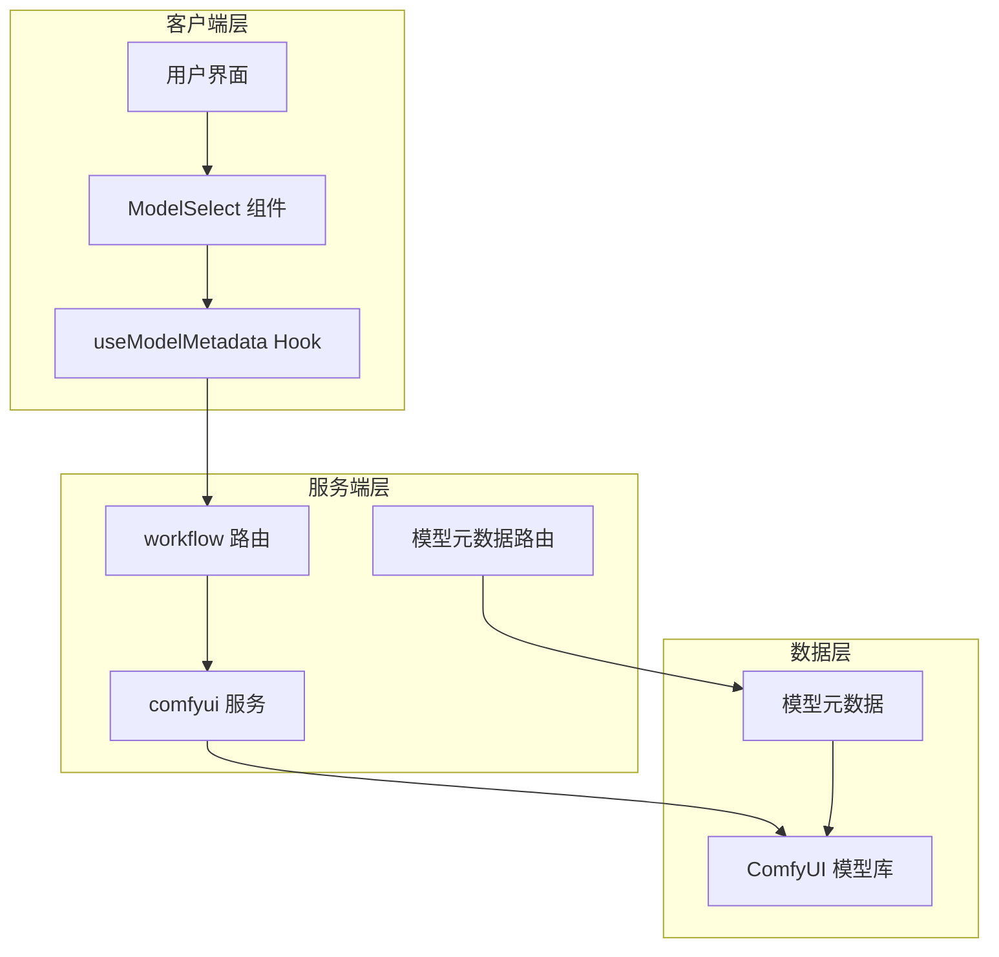

**图表来源**
- [workflow.ts:1-800](file://server/src/routes/workflow.ts#L1-L800)
- [comfyui.ts:1-472](file://server/src/services/comfyui.ts#L1-L472)
- [modelMeta.ts:1-272](file://server/src/routes/modelMeta.ts#L1-L272)

**章节来源**
- [workflow.ts:1-800](file://server/src/routes/workflow.ts#L1-L800)
- [comfyui.ts:1-472](file://server/src/services/comfyui.ts#L1-L472)

## 核心组件

### 模型查询接口

三个核心的模型查询接口都位于 workflow 路由中，采用统一的错误处理机制：

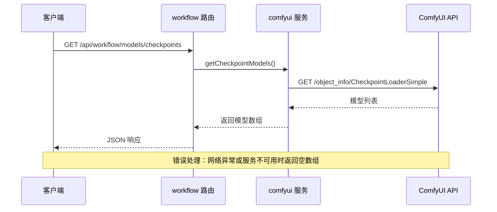

**图表来源**
- [workflow.ts:407-415](file://server/src/routes/workflow.ts#L407-L415)
- [comfyui.ts:414-422](file://server/src/services/comfyui.ts#L414-L422)

### 模型类型分类体系

项目建立了完整的模型分类体系，支持多种维度的模型组织和管理：

| 模型类型 | 分类标签 | 示例 |
|---------|----------|------|
| 检查点模型 | 光辉、PONY | IL-lunarcherrymix_v20.safetensors |
| LoRA 模型 | 角色、姿势、表情、风格、性别、多视角、滑块 | IllustriousLora/face_grab_illustrious.safetensors |

**章节来源**
- [metadata.json:1-800](file://model_meta/metadata.json#L1-L800)
- [intentParser.ts:324-330](file://server/src/services/intentParser.ts#L324-L330)

## 架构概览

模型管理系统采用分层架构设计，确保了良好的可维护性和扩展性：

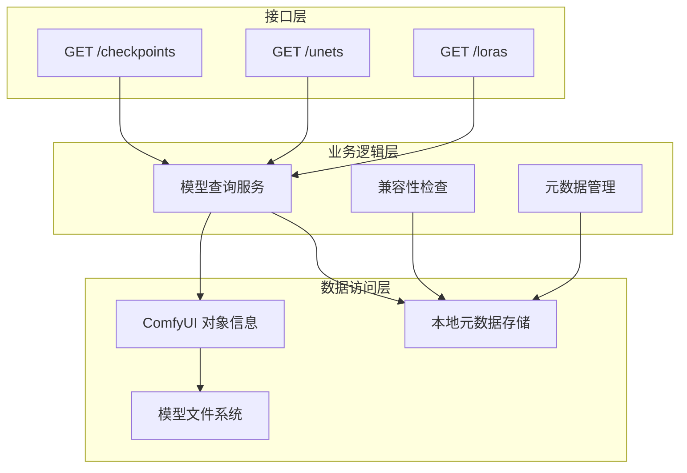

**图表来源**
- [workflow.ts:407-435](file://server/src/routes/workflow.ts#L407-L435)
- [comfyui.ts:414-440](file://server/src/services/comfyui.ts#L414-L440)
- [modelMeta.ts:28-39](file://server/src/routes/modelMeta.ts#L28-L39)

## 详细组件分析

### 检查点模型接口 (GET /api/workflow/models/checkpoints)

#### 接口规范

- **方法**: GET
- **路径**: /api/workflow/models/checkpoints
- **功能**: 获取 ComfyUI 中可用的检查点模型列表
- **响应格式**: 字符串数组，每个元素代表一个可用的检查点模型名称

#### 实现细节

接口实现简洁高效，直接调用 `getCheckpointModels()` 函数：

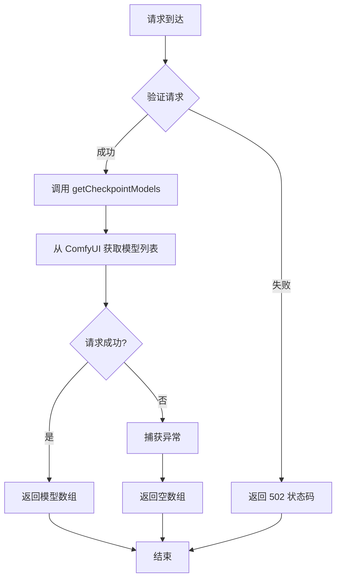

**图表来源**
- [workflow.ts:407-415](file://server/src/routes/workflow.ts#L407-L415)
- [comfyui.ts:414-422](file://server/src/services/comfyui.ts#L414-L422)

#### 响应示例

成功的响应是一个字符串数组：
```json
[
  "IL-lunarcherrymix_v20.safetensors",
  "XL-漫画2.5D\\IL-Gembyte_20Emerald.safetensors",
  "perfectdeliberate_v70.safetensors"
]
```

### UNET 模型接口 (GET /api/workflow/models/unets)

#### 接口规范

- **方法**: GET
- **路径**: /api/workflow/models/unets
- **功能**: 获取 ComfyUI 中可用的 UNET 模型列表
- **响应格式**: 字符串数组，每个元素代表一个可用的 UNET 模型名称

#### 实现机制

与检查点模型接口类似，但针对不同的模型类型：

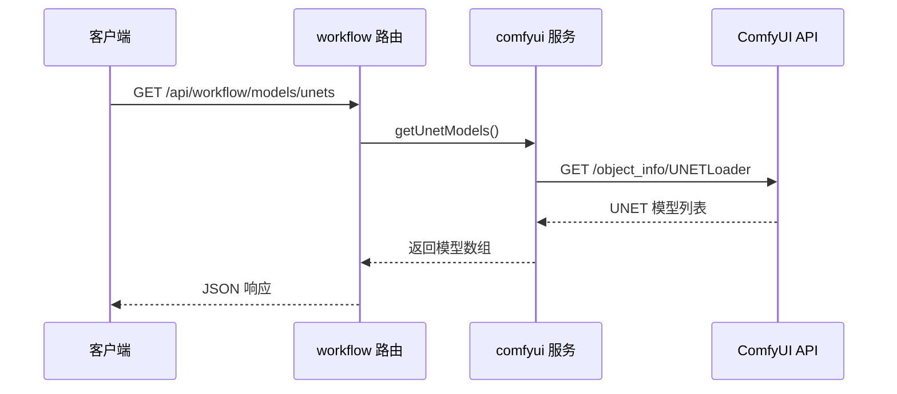

**图表来源**
- [workflow.ts:417-425](file://server/src/routes/workflow.ts#L417-L425)
- [comfyui.ts:423-431](file://server/src/services/comfyui.ts#L423-L431)

#### 错误处理

接口实现了健壮的错误处理机制：
- 网络请求失败时返回空数组
- ComfyUI 服务不可用时返回空数组
- 其他异常情况捕获并返回空数组

### LoRA 模型接口 (GET /api/workflow/models/loras)

#### 接口规范

- **方法**: GET
- **路径**: /api/workflow/models/loras
- **功能**: 获取 ComfyUI 中可用的 LoRA 模型列表
- **响应格式**: 字符串数组，每个元素代表一个可用的 LoRA 模型名称

#### 元数据集成

LoRA 模型与丰富的元数据系统集成：

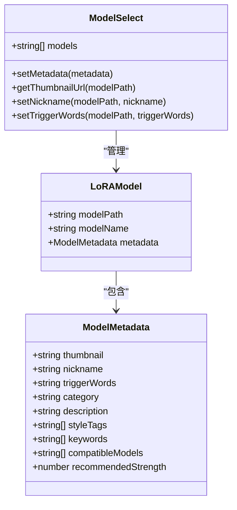

**图表来源**
- [useModelMetadata.ts:3-14](file://client/src/hooks/useModelMetadata.ts#L3-L14)
- [ModelSelect.tsx:75-118](file://client/src/components/ModelSelect.tsx#L75-L118)

**章节来源**
- [workflow.ts:427-435](file://server/src/routes/workflow.ts#L427-L435)
- [comfyui.ts:432-440](file://server/src/services/comfyui.ts#L432-L440)
- [useModelMetadata.ts:1-254](file://client/src/hooks/useModelMetadata.ts#L1-L254)

### 模型兼容性检查机制

项目实现了智能的模型兼容性检查系统：

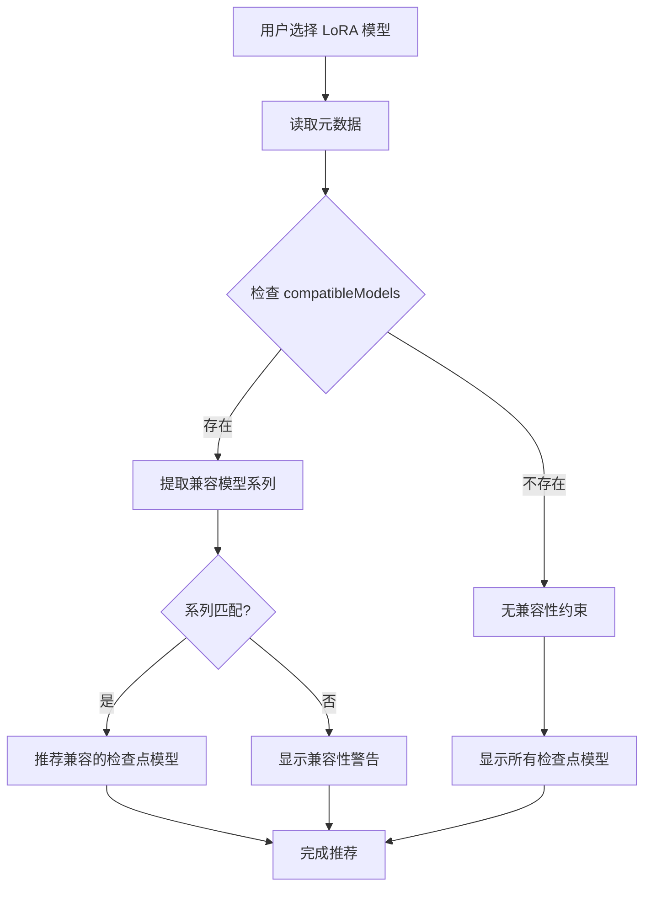

**图表来源**
- [intentParser.ts:397-483](file://server/src/services/intentParser.ts#L397-L483)

**章节来源**
- [intentParser.ts:324-330](file://server/src/services/intentParser.ts#L324-L330)
- [intentParser.ts:397-483](file://server/src/services/intentParser.ts#L397-L483)

## 依赖关系分析

### 组件耦合度

模型管理系统的组件间耦合度设计合理，遵循单一职责原则：

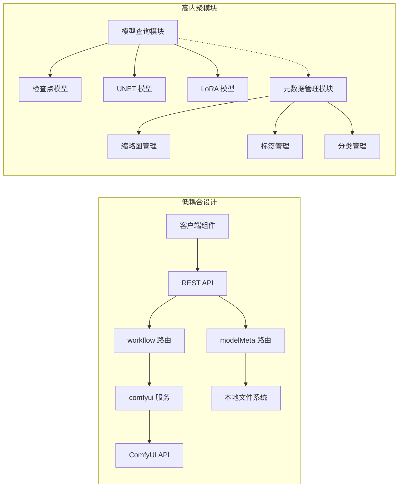

**图表来源**
- [workflow.ts:1-800](file://server/src/routes/workflow.ts#L1-L800)
- [modelMeta.ts:1-272](file://server/src/routes/modelMeta.ts#L1-L272)

### 数据流分析

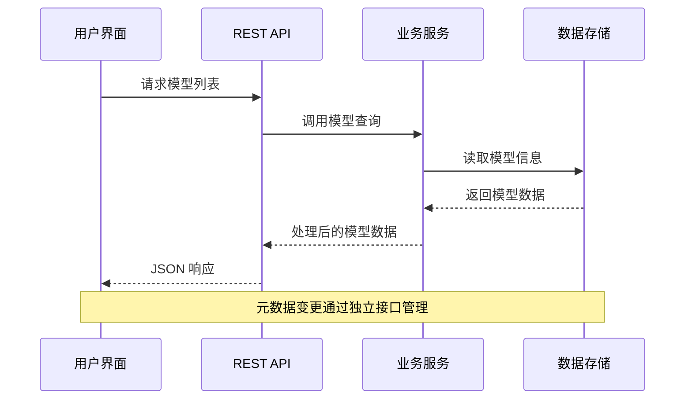

**图表来源**
- [useModelMetadata.ts:16-28](file://client/src/hooks/useModelMetadata.ts#L16-L28)
- [modelMeta.ts:43-47](file://server/src/routes/modelMeta.ts#L43-L47)

**章节来源**
- [workflow.ts:1-800](file://server/src/routes/workflow.ts#L1-L800)
- [modelMeta.ts:1-272](file://server/src/routes/modelMeta.ts#L1-L272)

## 性能考虑

### 缓存策略

系统采用了多层次的缓存策略来优化性能：

1. **HTTP 缓存**: 浏览器层面的缓存控制
2. **服务端缓存**: 内存中的模型列表缓存
3. **数据库缓存**: 元数据文件的本地缓存

### 并发处理

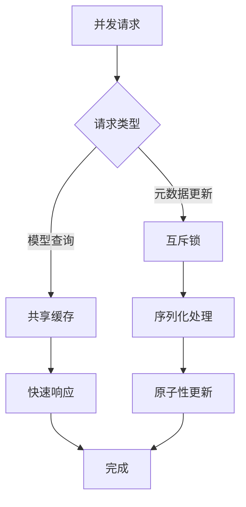

### 错误恢复

系统具备完善的错误恢复机制：
- 网络异常时返回降级数据
- 服务不可用时提供本地缓存
- 自动重试机制
- 优雅降级策略

## 故障排除指南

### 常见问题诊断

#### 模型列表为空

**可能原因**：
1. ComfyUI 服务未启动
2. 模型文件未正确安装
3. 网络连接问题

**解决方案**：
1. 检查 ComfyUI 服务状态
2. 验证模型文件完整性
3. 确认网络连接稳定

#### 模型兼容性错误

**症状**：选择特定 LoRA 模型时出现兼容性警告

**解决步骤**：
1. 检查 LoRA 模型的 `compatibleModels` 字段
2. 确认目标检查点模型的分类
3. 使用智能推荐功能自动选择兼容模型

#### 元数据同步问题

**症状**：模型元数据更新后未生效

**排查步骤**：
1. 检查 `metadata.json` 文件是否正确更新
2. 验证缩略图文件是否存在于指定目录
3. 确认文件权限设置正确

### 调试工具

系统提供了多种调试工具辅助问题定位：

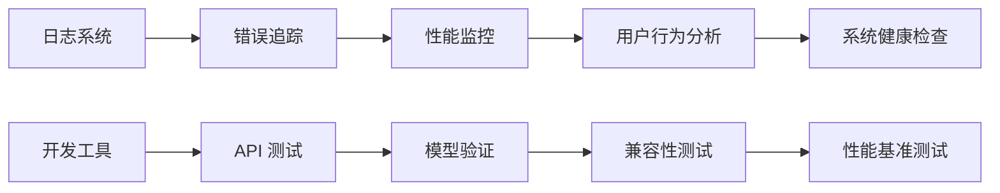

**章节来源**
- [workflow.ts:126-150](file://server/src/routes/workflow.ts#L126-L150)
- [index.ts:1-52](file://server/src/types/index.ts#L1-L52)

## 结论

CorineKit Pix2Real 的模型管理接口设计体现了现代 Web 应用的最佳实践：

### 设计优势

1. **清晰的接口设计**: 三个核心接口职责明确，响应格式统一
2. **强大的元数据系统**: 支持模型的丰富属性管理和智能推荐
3. **健壮的错误处理**: 完善的异常处理和降级机制
4. **良好的扩展性**: 模块化设计便于功能扩展和维护

### 最佳实践建议

1. **模型管理**：定期清理无效模型，维护元数据完整性
2. **性能优化**：合理利用缓存机制，避免频繁的 API 调用
3. **错误处理**：实现优雅的错误降级，提升用户体验
4. **监控告警**：建立完善的监控体系，及时发现和解决问题

该系统为 AI 模型管理提供了完整的解决方案，既满足了当前的功能需求，又为未来的扩展奠定了坚实的基础。