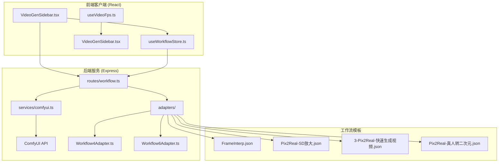
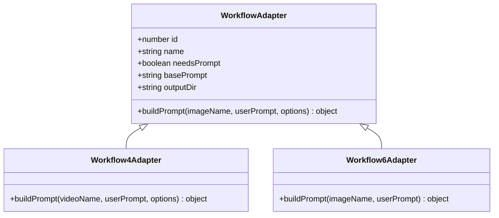
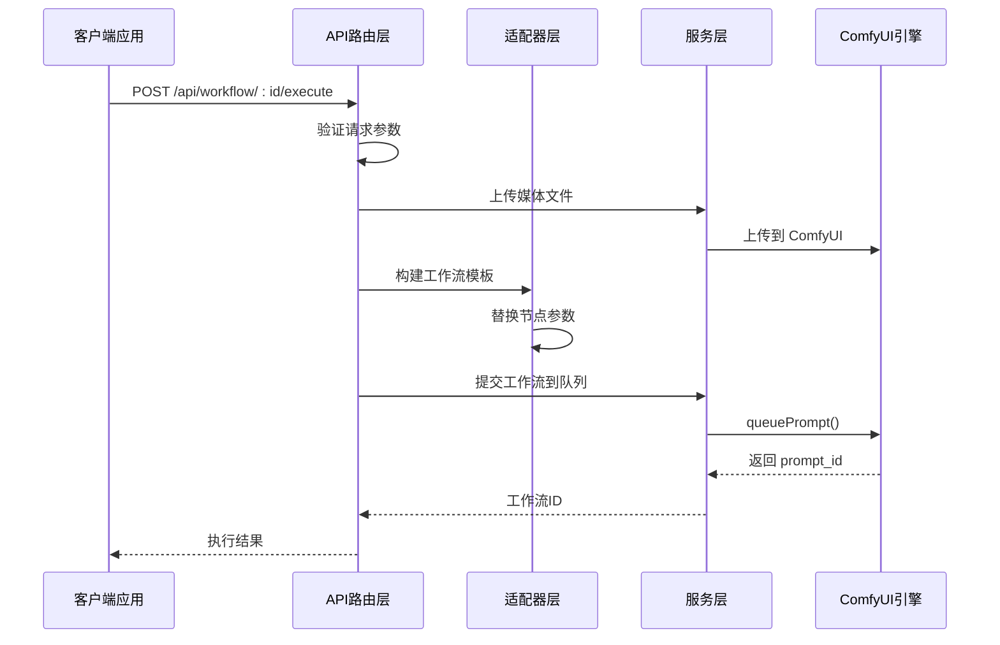
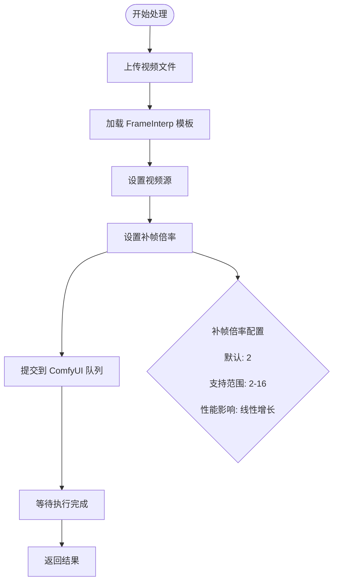
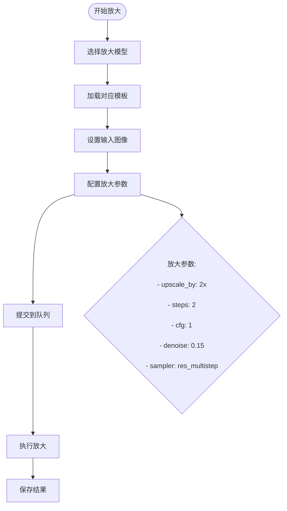
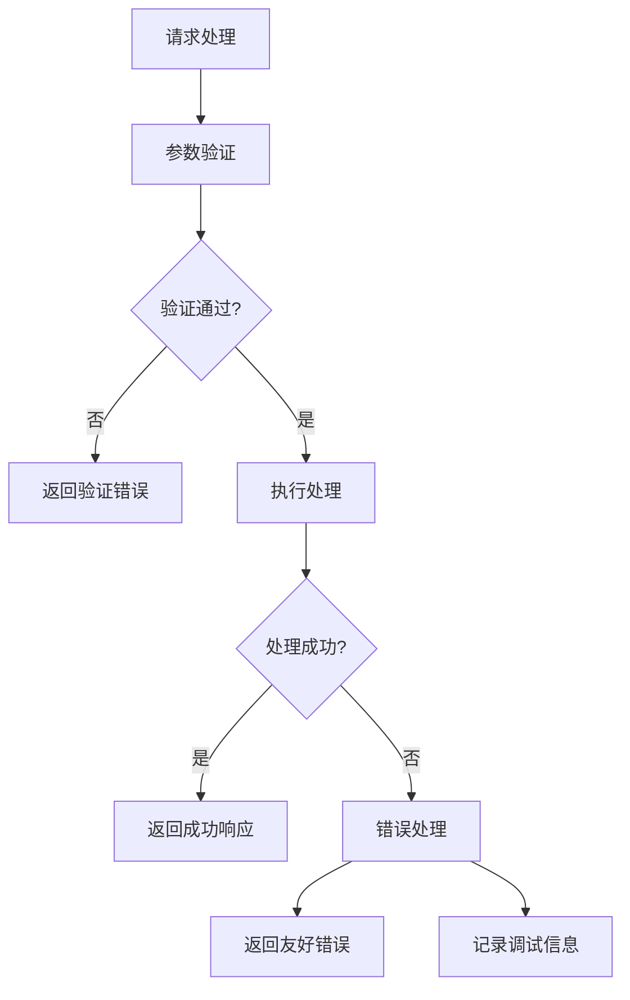

# 视频处理工作流

<cite>
**本文档引用的文件**
- [server/src/routes/workflow.ts](file://server/src/routes/workflow.ts)
- [server/src/adapters/Workflow4Adapter.ts](file://server/src/adapters/Workflow4Adapter.ts)
- [server/src/adapters/Workflow6Adapter.ts](file://server/src/adapters/Workflow6Adapter.ts)
- [server/src/services/comfyui.ts](file://server/src/services/comfyui.ts)
- [ComfyUI_API/FrameInterp.json](file://ComfyUI_API/FrameInterp.json)
- [ComfyUI_API/Pix2Real-SD放大.json](file://ComfyUI_API/Pix2Real-SD放大.json)
- [ComfyUI_API/3-Pix2Real-快速生成视频.json](file://ComfyUI_API/3-Pix2Real-快速生成视频.json)
- [ComfyUI_API/Pix2Real-真人转二次元.json](file://ComfyUI_API/Pix2Real-真人转二次元.json)
- [client/src/components/VideoGenSidebar.tsx](file://client/src/components/VideoGenSidebar.tsx)
- [client/src/hooks/useVideoFps.ts](file://client/src/hooks/useVideoFps.ts)
- [client/src/hooks/useWorkflowStore.ts](file://client/src/hooks/useWorkflowStore.ts)
- [README.md](file://README.md)
</cite>

## 目录
1. [简介](#简介)
2. [项目结构](#项目结构)
3. [核心组件](#核心组件)
4. [架构概览](#架构概览)
5. [详细组件分析](#详细组件分析)
6. [依赖关系分析](#依赖关系分析)
7. [性能考虑](#性能考虑)
8. [故障排除指南](#故障排除指南)
9. [结论](#结论)

## 简介

CorineKit Pix2Real 是一个基于 ComfyUI 的本地 Web 图像/视频处理工具，提供了完整的视频处理工作流解决方案。本文档专注于视频处理相关的工作流接口，包括图生视频、视频补帧和 SD 放大功能。

该系统通过适配器模式实现了灵活的工作流扩展，支持多种视频处理场景，具有实时进度监控和批量处理能力。

## 项目结构

项目采用前后端分离架构，主要包含以下核心模块：



**图表来源**
- [server/src/routes/workflow.ts:1-800](file://server/src/routes/workflow.ts#L1-L800)
- [server/src/adapters/Workflow4Adapter.ts:1-28](file://server/src/adapters/Workflow4Adapter.ts#L1-L28)
- [server/src/adapters/Workflow6Adapter.ts:1-36](file://server/src/adapters/Workflow6Adapter.ts#L1-L36)

**章节来源**
- [README.md:41-79](file://README.md#L41-L79)

## 核心组件

### 视频处理工作流接口

系统提供了三个主要的视频处理工作流接口：

| 工作流ID | 接口路径 | 名称 | 输入类型 | 特殊参数 |
|---------|----------|------|----------|----------|
| 4 | POST /api/workflow/4/execute | 视频补帧 | Video | multiplier |
| 6 | POST /api/workflow/6/execute | 真人转二次元 | Image | prompt |
| 4 | POST /api/workflow/4/execute | SD 放大 | Image | 无 |

### 适配器模式实现

每个工作流都通过专门的适配器类实现，采用统一的接口规范：



**图表来源**
- [server/src/adapters/Workflow4Adapter.ts:9-27](file://server/src/adapters/Workflow4Adapter.ts#L9-L27)
- [server/src/adapters/Workflow6Adapter.ts:9-35](file://server/src/adapters/Workflow6Adapter.ts#L9-L35)

**章节来源**
- [server/src/adapters/Workflow4Adapter.ts:1-28](file://server/src/adapters/Workflow4Adapter.ts#L1-L28)
- [server/src/adapters/Workflow6Adapter.ts:1-36](file://server/src/adapters/Workflow6Adapter.ts#L1-L36)

## 架构概览

系统采用分层架构设计，实现了清晰的关注点分离：



**图表来源**
- [server/src/routes/workflow.ts:750-799](file://server/src/routes/workflow.ts#L750-L799)
- [server/src/services/comfyui.ts:168-196](file://server/src/services/comfyui.ts#L168-L196)

## 详细组件分析

### 视频补帧工作流 (ID: 4)

视频补帧功能通过 RIFE 模型实现帧间插值，支持自定义补帧倍率。

#### API 接口规范

**请求方法**: POST
**请求路径**: `/api/workflow/4/execute`
**内容类型**: multipart/form-data

**请求参数**:
- `image`: 视频文件 (必需)
- `clientId`: 客户端标识 (必需)
- `options.multiplier`: 补帧倍率 (可选，默认: 2)

**响应数据**:
```json
{
  "promptId": "string",
  "clientId": "string", 
  "workflowId": 4,
  "workflowName": "视频补帧"
}
```

#### 工作流配置



**图表来源**
- [server/src/adapters/Workflow4Adapter.ts:16-26](file://server/src/adapters/Workflow4Adapter.ts#L16-L26)
- [ComfyUI_API/FrameInterp.json:1-58](file://ComfyUI_API/FrameInterp.json#L1-L58)

**章节来源**
- [server/src/adapters/Workflow4Adapter.ts:1-28](file://server/src/adapters/Workflow4Adapter.ts#L1-L28)
- [ComfyUI_API/FrameInterp.json:1-58](file://ComfyUI_API/FrameInterp.json#L1-L58)

### 图生视频工作流 (ID: 3)

图生视频功能支持从静态图像生成视频序列，提供丰富的质量控制选项。

#### API 接口规范

**请求方法**: POST  
**请求路径**: `/api/workflow/3/execute`
**内容类型**: multipart/form-data

**请求参数**:
- `image`: 输入图像 (必需)
- `clientId`: 客户端标识 (必需)
- `prompt`: 提示词 (可选)
- `options.seconds`: 视频时长 (可选，默认: 4)
- `options.fps`: 帧率 (可选，默认: 16)  
- `options.megapixels`: 质量级别 (可选，默认: 1.0)

**响应数据**:
```json
{
  "promptId": "string",
  "clientId": "string",
  "workflowId": 3,
  "workflowName": "图生视频"
}
```

#### 参数配置详解

| 参数名称 | 类型 | 默认值 | 取值范围 | 性能影响 | 用途说明 |
|---------|------|--------|----------|----------|----------|
| seconds | number | 4 | 1-30秒 | 线性增长 | 视频总时长 |
| fps | number | 16 | 8-60 fps | 线性增长 | 视频流畅度 |
| megapixels | number | 1.0 | 0.5-2.0 | 平方级增长 | 图像质量 |
| prompt | string | 自动反推 | - | 无 | 视频内容描述 |

**章节来源**
- [server/src/adapters/Workflow3Adapter.ts:16-40](file://server/src/adapters/Workflow3Adapter.ts#L16-L40)
- [ComfyUI_API/3-Pix2Real-快速生成视频.json:133-147](file://ComfyUI_API/3-Pix2Real-快速生成视频.json#L133-L147)

### SD 放大工作流 (ID: 4)

SD 放大功能通过 UltimateSDUpscale 实现高质量图像放大，支持多种放大算法。

#### API 接口规范

**请求方法**: POST
**请求路径**: `/api/workflow/4/execute`  
**内容类型**: multipart/form-data

**请求参数**:
- `image`: 输入图像 (必需)
- `clientId`: 客户端标识 (必需)
- `model`: 放大模型 (可选，默认: "seedvr2")
- `prompt`: 提示词 (可选)

**支持的模型类型**:
- `seedvr2`: 默认模型
- `klein`: Klein Pro 模型
- `sd`: SD 放大模型
- `remacri`: Remacri 模型

**响应数据**:
```json
{
  "promptId": "string", 
  "clientId": "string",
  "workflowId": 4,
  "workflowName": "SD 放大"
}
```

#### 放大参数配置



**图表来源**
- [server/src/routes/workflow.ts:690-748](file://server/src/routes/workflow.ts#L690-L748)
- [ComfyUI_API/Pix2Real-SD放大.json:70-129](file://ComfyUI_API/Pix2Real-SD放大.json#L70-L129)

**章节来源**
- [server/src/routes/workflow.ts:690-748](file://server/src/routes/workflow.ts#L690-L748)
- [ComfyUI_API/Pix2Real-SD放大.json:1-229](file://ComfyUI_API/Pix2Real-SD放大.json#L1-L229)

### 真人转二次元工作流 (ID: 6)

真人转二次元功能支持将真实照片转换为动漫风格图像。

#### API 接口规范

**请求方法**: POST
**请求路径**: `/api/workflow/6/execute`
**内容类型**: multipart/form-data

**请求参数**:
- `image`: 输入图像 (必需)
- `clientId`: 客户端标识 (必需)
- `prompt`: 提示词 (可选)

**响应数据**:
```json
{
  "promptId": "string",
  "clientId": "string", 
  "workflowId": 6,
  "workflowName": "真人转二次元"
}
```

#### 工作流特点

该工作流支持智能提示词处理：
- 空提示词时自动使用 WD14 模型进行标签反推
- 非空提示词时直接作为正向提示词使用
- 提供两套 KSampler 参数用于不同风格需求

**章节来源**
- [server/src/adapters/Workflow6Adapter.ts:16-35](file://server/src/adapters/Workflow6Adapter.ts#L16-L35)
- [ComfyUI_API/Pix2Real-真人转二次元.json:1-323](file://ComfyUI_API/Pix2Real-真人转二次元.json#L1-L323)

## 依赖关系分析

系统的核心依赖关系如下：


**图表来源**
- [server/src/routes/workflow.ts:1-29](file://server/src/routes/workflow.ts#L1-L29)
- [server/src/services/comfyui.ts:1-8](file://server/src/services/comfyui.ts#L1-L8)

**章节来源**
- [server/src/routes/workflow.ts:1-800](file://server/src/routes/workflow.ts#L1-L800)
- [server/src/services/comfyui.ts:1-472](file://server/src/services/comfyui.ts#L1-L472)

## 性能考虑

### 视频处理性能优化

1. **内存管理**
   - 使用 `clear_cache_after_n_frames` 参数控制内存使用
   - 建议在长时间处理时设置合理的缓存清理阈值

2. **质量与速度平衡**
   - 质量级别 (megapixels) 对性能影响呈平方关系
   - 建议根据硬件能力选择合适的质量设置

3. **并发处理**
   - 系统支持多工作流并发执行
   - 建议合理安排工作流优先级

### 最佳实践建议

1. **视频补帧**
   - 选择合适的补帧倍率：2x-4x 适合大多数场景
   - 注意处理时间与质量的关系

2. **图生视频**
   - 质量设置建议：0.8-1.2 为常用范围
   - 时长设置建议：4-8 秒为最佳观看体验

3. **SD 放大**
   - 默认模型效果最佳，仅在特殊需求时更换
   - 注意显存占用，必要时降低放大倍数

## 故障排除指南

### 常见问题及解决方案

1. **ComfyUI 连接失败**
   - 检查 ComfyUI 是否在 `http://localhost:8188` 运行
   - 验证网络连接和防火墙设置

2. **文件上传失败**
   - 确认文件格式支持 (PNG/JPEG/WebP/MP4)
   - 检查文件大小限制 (默认 10MB)

3. **工作流执行错误**
   - 查看服务器日志获取详细错误信息
   - 验证模型文件是否正确安装

### 错误处理机制

系统实现了统一的错误处理机制：



**图表来源**
- [server/src/routes/workflow.ts:126-150](file://server/src/routes/workflow.ts#L126-L150)

**章节来源**
- [server/src/routes/workflow.ts:126-150](file://server/src/routes/workflow.ts#L126-L150)

## 结论

CorineKit Pix2Real 提供了完整的视频处理工作流解决方案，通过模块化的设计实现了高度的灵活性和可扩展性。系统的主要优势包括：

1. **统一的 API 接口**：所有工作流遵循一致的接口规范
2. **灵活的配置选项**：支持细粒度的参数控制
3. **实时进度监控**：提供完整的工作流执行状态反馈
4. **性能优化**：针对不同硬件配置提供了优化建议

建议用户根据具体的使用场景选择合适的工作流和参数配置，在保证质量的前提下获得最佳的处理性能。