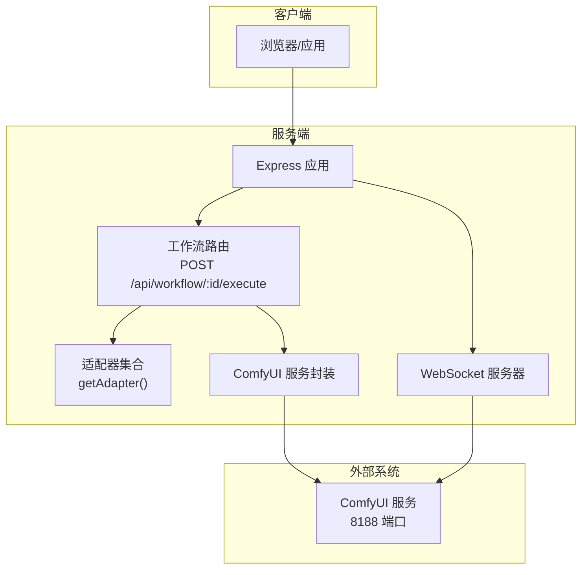
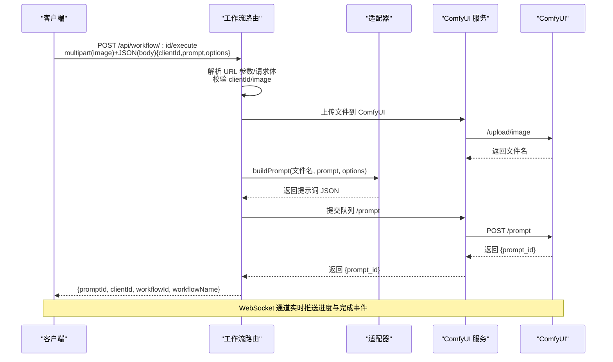
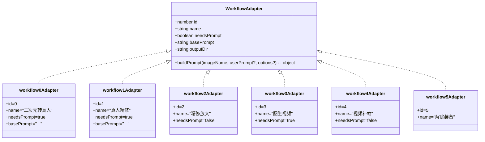
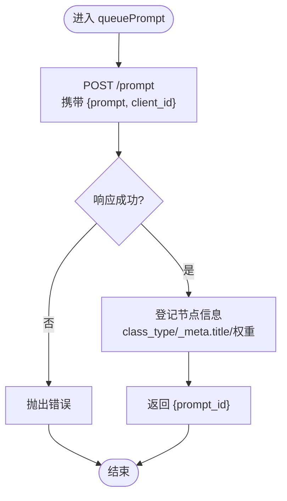
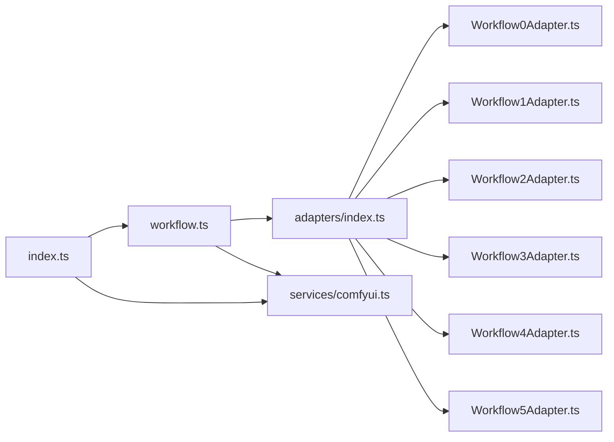

# 通用工作流执行接口

<cite>
**本文引用的文件**
- [workflow.ts](file://server/src/routes/workflow.ts)
- [comfyui.ts](file://server/src/services/comfyui.ts)
- [index.ts](file://server/src/index.ts)
- [index.ts](file://server/src/types/index.ts)
- [index.ts](file://server/src/adapters/index.ts)
- [BaseAdapter.ts](file://server/src/adapters/BaseAdapter.ts)
- [Workflow0Adapter.ts](file://server/src/adapters/Workflow0Adapter.ts)
- [Workflow1Adapter.ts](file://server/src/adapters/Workflow1Adapter.ts)
- [Workflow2Adapter.ts](file://server/src/adapters/Workflow2Adapter.ts)
- [Workflow3Adapter.ts](file://server/src/adapters/Workflow3Adapter.ts)
- [Workflow4Adapter.ts](file://server/src/adapters/Workflow4Adapter.ts)
- [Workflow5Adapter.ts](file://server/src/adapters/Workflow5Adapter.ts)
- [Workflow6Adapter.ts](file://server/src/adapters/Workflow6Adapter.ts)
</cite>

## 目录
1. [简介](#简介)
2. [项目结构](#项目结构)
3. [核心组件](#核心组件)
4. [架构总览](#架构总览)
5. [详细组件分析](#详细组件分析)
6. [依赖关系分析](#依赖关系分析)
7. [性能考量](#性能考量)
8. [故障排查指南](#故障排查指南)
9. [结论](#结论)
10. [附录](#附录)

## 简介
本文档面向 CorineKit Pix2Real 的通用工作流执行接口，聚焦于通用执行端点 POST /api/workflow/:id/execute。该接口通过适配器模式支持所有工作流的通用执行模式，具备如下特点：
- 通用执行端点：统一入口，按 workflowId 调用对应适配器
- 文件上传参数：image 字段（multipart/form-data）
- JSON 请求体参数：clientId、prompt、options
- URL 查询参数：clientId（可选，优先级低于请求体）
- 执行流程：文件上传到 ComfyUI → 适配器构建提示词 → 队列提交 → WebSocket 进度与结果返回

## 项目结构
后端采用 Express + WebSocket 架构，路由集中于 workflow 路由模块，工作流逻辑通过适配器模式扩展，ComfyUI 交互封装在服务层。

图表来源
- [index.ts:118-145](file://server/src/index.ts#L118-L145)
- [workflow.ts:750-799](file://server/src/routes/workflow.ts#L750-L799)
- [comfyui.ts:168-196](file://server/src/services/comfyui.ts#L168-L196)
- [index.ts:157-494](file://server/src/index.ts#L157-L494)

章节来源
- [index.ts:118-145](file://server/src/index.ts#L118-L145)
- [workflow.ts:750-799](file://server/src/routes/workflow.ts#L750-L799)

## 核心组件
- 通用执行端点：POST /api/workflow/:id/execute
  - 参数来源：multipart/form-data 的 image 字段；JSON 请求体的 clientId、prompt、options；URL 查询参数 clientId
  - 行为：根据 workflowId 获取适配器，构建提示词 JSON，上传文件至 ComfyUI，提交队列并返回 promptId
- 适配器模式：通过 getAdapter(id) 获取对应 WorkflowAdapter，调用 buildPrompt(imageName, userPrompt, options) 生成工作流模板
- ComfyUI 服务：封装上传、队列提交、历史查询、WebSocket 连接等操作

章节来源
- [workflow.ts:750-799](file://server/src/routes/workflow.ts#L750-L799)
- [index.ts:28-30](file://server/src/adapters/index.ts#L28-L30)
- [comfyui.ts:9-45](file://server/src/services/comfyui.ts#L9-L45)
- [comfyui.ts:168-196](file://server/src/services/comfyui.ts#L168-L196)

## 架构总览
通用执行流程的端到端序列如下：

图表来源
- [workflow.ts:750-799](file://server/src/routes/workflow.ts#L750-L799)
- [comfyui.ts:9-45](file://server/src/services/comfyui.ts#L9-L45)
- [comfyui.ts:168-196](file://server/src/services/comfyui.ts#L168-L196)
- [index.ts:273-375](file://server/src/index.ts#L273-L375)

## 详细组件分析

### 通用执行端点：POST /api/workflow/:id/execute
- 路径与方法
  - 路径：/api/workflow/:id/execute
  - 方法：POST
- 请求参数
  - multipart/form-data
    - image：必填，单文件，作为工作流输入
  - JSON 请求体（application/json）
    - clientId：必填，用于队列与进度跟踪
    - prompt：可选，字符串，传递给适配器构建提示词
    - options：可选，字符串形式的 JSON 对象，传递给适配器
  - URL 查询参数
    - clientId：可选，若请求体未提供则使用该参数
- 处理流程
  - 校验参数：workflowId 存在、image 存在、clientId 存在
  - 上传文件：根据 workflowId 判断上传图片或视频
  - 适配器构建：调用 getAdapter(id).buildPrompt(imageName, prompt, options)
  - 提交队列：queuePrompt(prompt, clientId)
  - 返回：{promptId, clientId, workflowId, workflowName}
- 错误处理
  - 400：缺少必要参数或未知 workflowId
  - 500：上传失败、队列提交失败、ComfyUI 错误映射为用户友好提示

章节来源
- [workflow.ts:750-799](file://server/src/routes/workflow.ts#L750-L799)
- [index.ts:28-30](file://server/src/adapters/index.ts#L28-L30)
- [comfyui.ts:9-45](file://server/src/services/comfyui.ts#L9-L45)
- [comfyui.ts:168-196](file://server/src/services/comfyui.ts#L168-L196)

### 适配器模式与提示词构建
- 适配器接口
  - id、name、needsPrompt、basePrompt、outputDir
  - buildPrompt(imageName, userPrompt?, options?)：返回工作流模板对象
- 通用适配器集合
  - 通过 getAdapter(id) 获取对应适配器实例
  - 适配器负责读取 ComfyUI 模板文件，填充输入节点（如 LoadImage、种子、提示词等）
- 典型适配器示例
  - Workflow0Adapter：二次元转真人，需要提示词
  - Workflow1Adapter：真人精修，需要提示词
  - Workflow2Adapter：精修放大，不需要提示词
  - Workflow3Adapter：图生视频，需要提示词，并支持 seconds、fps、megapixels 等选项
  - Workflow4Adapter：视频补帧，不需要提示词，支持 multiplier 选项
  - Workflow5Adapter：解除装备，不使用通用执行端点（有专用路由）

图表来源
- [index.ts:14-30](file://server/src/adapters/index.ts#L14-L30)
- [BaseAdapter.ts:1-4](file://server/src/adapters/BaseAdapter.ts#L1-L4)
- [Workflow0Adapter.ts:9-34](file://server/src/adapters/Workflow0Adapter.ts#L9-L34)
- [Workflow1Adapter.ts:9-35](file://server/src/adapters/Workflow1Adapter.ts#L9-L35)
- [Workflow2Adapter.ts:9-27](file://server/src/adapters/Workflow2Adapter.ts#L9-L27)
- [Workflow3Adapter.ts:9-40](file://server/src/adapters/Workflow3Adapter.ts#L9-L40)
- [Workflow4Adapter.ts:9-27](file://server/src/adapters/Workflow4Adapter.ts#L9-L27)
- [Workflow5Adapter.ts:4-14](file://server/src/adapters/Workflow5Adapter.ts#L4-L14)

章节来源
- [index.ts:14-30](file://server/src/adapters/index.ts#L14-L30)
- [BaseAdapter.ts:1-4](file://server/src/adapters/BaseAdapter.ts#L1-L4)
- [Workflow0Adapter.ts:9-34](file://server/src/adapters/Workflow0Adapter.ts#L9-L34)
- [Workflow1Adapter.ts:9-35](file://server/src/adapters/Workflow1Adapter.ts#L9-L35)
- [Workflow2Adapter.ts:9-27](file://server/src/adapters/Workflow2Adapter.ts#L9-L27)
- [Workflow3Adapter.ts:9-40](file://server/src/adapters/Workflow3Adapter.ts#L9-L40)
- [Workflow4Adapter.ts:9-27](file://server/src/adapters/Workflow4Adapter.ts#L9-L27)
- [Workflow5Adapter.ts:4-14](file://server/src/adapters/Workflow5Adapter.ts#L4-L14)

### ComfyUI 服务与队列提交
- 上传文件
  - 图片：/upload/image，返回文件名
  - 视频：/upload/image，附加 type=input，返回文件名
- 队列提交
  - POST /prompt，body 包含 prompt 与 client_id
  - 成功后登记节点权重信息，用于 WebSocket 阶段化进度
- WebSocket 连接
  - 客户端连接 ws://localhost:PORT/ws，接收 execution_start、progress、execution_cached、execution_success、execution_error、complete、error 等事件
  - 服务端将 ComfyUI 的进度转换为权重化全局百分比，阶段名称映射中文

图表来源
- [comfyui.ts:168-196](file://server/src/services/comfyui.ts#L168-L196)

章节来源
- [comfyui.ts:9-45](file://server/src/services/comfyui.ts#L9-L45)
- [comfyui.ts:168-196](file://server/src/services/comfyui.ts#L168-L196)
- [index.ts:273-375](file://server/src/index.ts#L273-L375)

### 执行流程与状态码
- 请求参数校验
  - 缺少 image：400
  - 缺少 clientId：400
  - 未知 workflowId：400
- 执行期间错误
  - 上传失败：500
  - 队列提交失败：500
  - ComfyUI 校验失败：映射为用户友好提示
- 成功响应
  - 返回 {promptId, clientId, workflowId, workflowName}

章节来源
- [workflow.ts:750-799](file://server/src/routes/workflow.ts#L750-L799)
- [comfyui.ts:168-196](file://server/src/services/comfyui.ts#L168-L196)

## 依赖关系分析
- 路由依赖适配器集合：通过 getAdapter(id) 获取适配器
- 适配器依赖 ComfyUI 模板文件：读取 JSON 模板并填充节点
- 路由依赖 ComfyUI 服务：上传文件、提交队列、错误映射
- WebSocket 服务依赖 ComfyUI WebSocket：转发进度与完成事件

图表来源
- [workflow.ts:750-799](file://server/src/routes/workflow.ts#L750-L799)
- [index.ts:14-30](file://server/src/adapters/index.ts#L14-L30)
- [index.ts:118-145](file://server/src/index.ts#L118-L145)

章节来源
- [workflow.ts:750-799](file://server/src/routes/workflow.ts#L750-L799)
- [index.ts:14-30](file://server/src/adapters/index.ts#L14-L30)
- [index.ts:118-145](file://server/src/index.ts#L118-L145)

## 性能考量
- 上传与队列
  - 上传图片/视频为网络 I/O，建议控制文件大小与并发
  - 队列提交后立即登记节点权重，WebSocket 进度基于权重计算，避免频繁轮询
- 进度计算
  - 采样器节点权重与 steps 成正比，放大类节点权重较高
  - tiled 采样器按估算 tile 数加权，避免进度回退
- 输出下载
  - 完成事件后异步下载输出到会话目录，失败不阻塞主流程

## 故障排查指南
- 常见错误与定位
  - 400：检查是否提供 image 与 clientId；确认 workflowId 是否存在
  - 500：查看服务端日志，关注上传与队列提交错误
  - ComfyUI 校验失败：根据错误信息检查模型/LoRA/V AE/ControlNet 是否安装正确
- WebSocket 进度异常
  - 确认客户端已连接并发送注册消息，服务端会回放缓冲事件
  - 若出现“完成但为空”，等待历史提交后再重试获取
- 输出缺失
  - 确认会话 ID 正确，输出保存在会话目录下

章节来源
- [workflow.ts:750-799](file://server/src/routes/workflow.ts#L750-L799)
- [index.ts:335-448](file://server/src/index.ts#L335-L448)

## 结论
通用执行端点通过适配器模式实现了工作流的统一入口，结合 ComfyUI 的上传与队列机制，提供了稳定、可扩展的工作流执行能力。配合 WebSocket 实时进度与完成事件，能够满足多样化的图像/视频生成与处理需求。

## 附录

### 请求与响应规范

- 端点
  - POST /api/workflow/:id/execute
- 请求头
  - Content-Type: multipart/form-data（image 字段）
  - JSON 请求体需设置 Content-Type: application/json
- URL 查询参数
  - clientId：可选，若请求体未提供则使用该参数
- 请求体（JSON）
  - clientId: string（必填）
  - prompt: string（可选）
  - options: string（可选，JSON 字符串）
- 文件字段（multipart/form-data）
  - image: File（必填）
- 成功响应
  - 200 OK
  - Body: { promptId: string, clientId: string, workflowId: number, workflowName: string }
- 错误响应
  - 400 Bad Request：缺少参数或未知 workflowId
  - 500 Internal Server Error：上传失败、队列提交失败、ComfyUI 错误映射为用户友好提示

章节来源
- [workflow.ts:750-799](file://server/src/routes/workflow.ts#L750-L799)
- [comfyui.ts:168-196](file://server/src/services/comfyui.ts#L168-L196)
- [index.ts:38-51](file://server/src/types/index.ts#L38-L51)