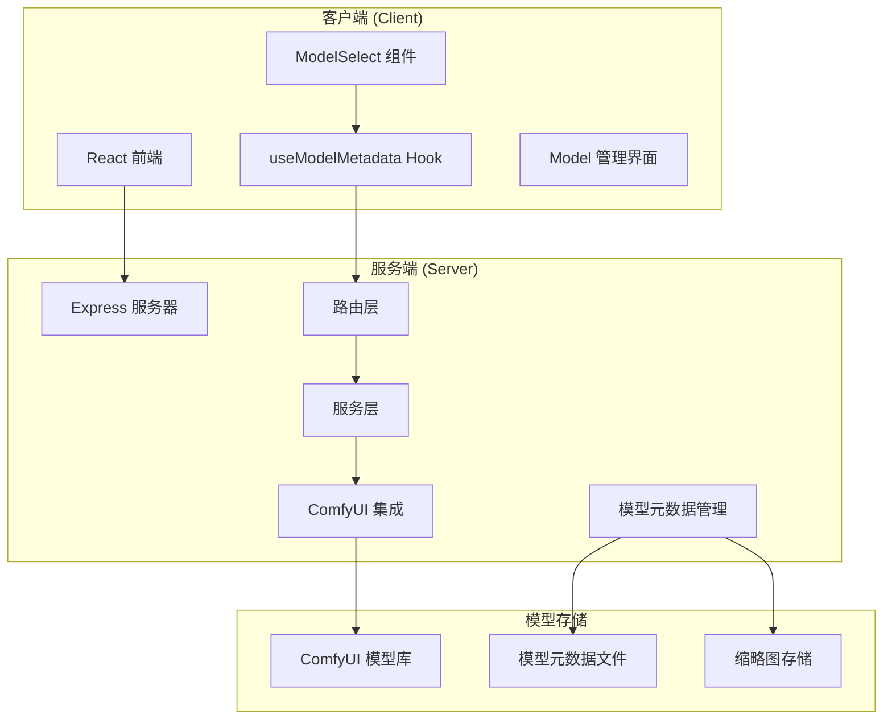
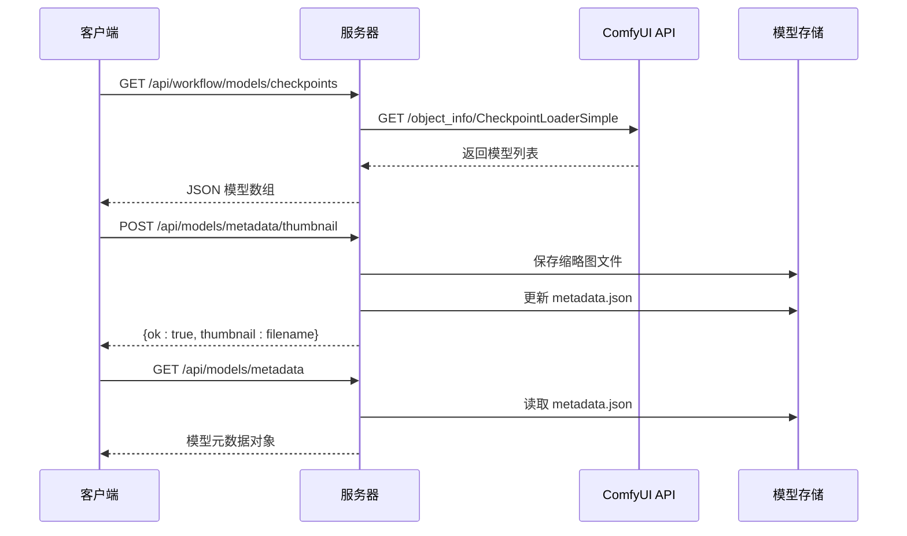
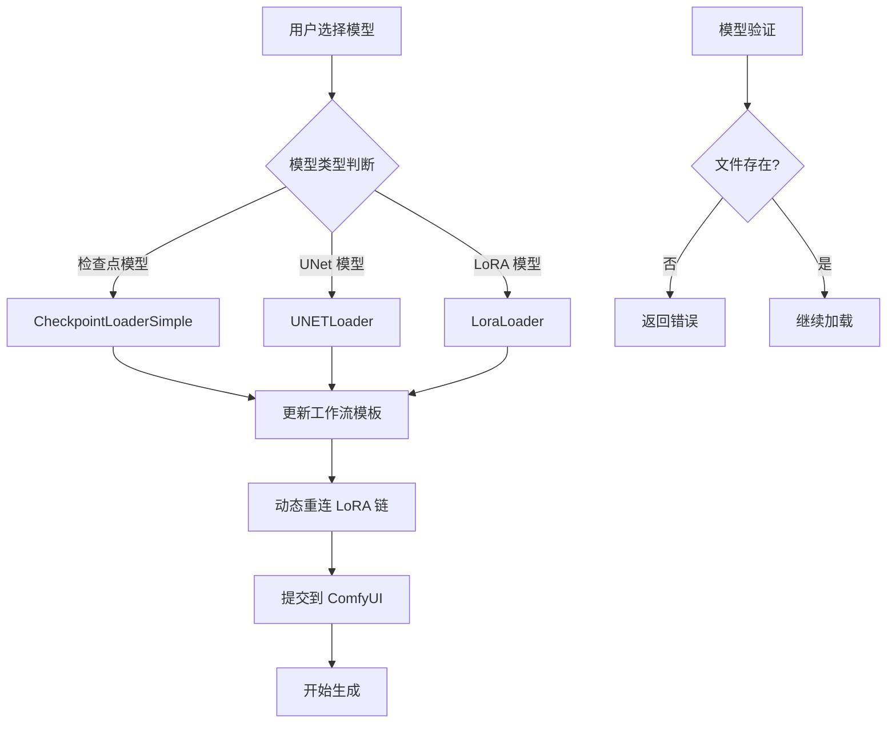
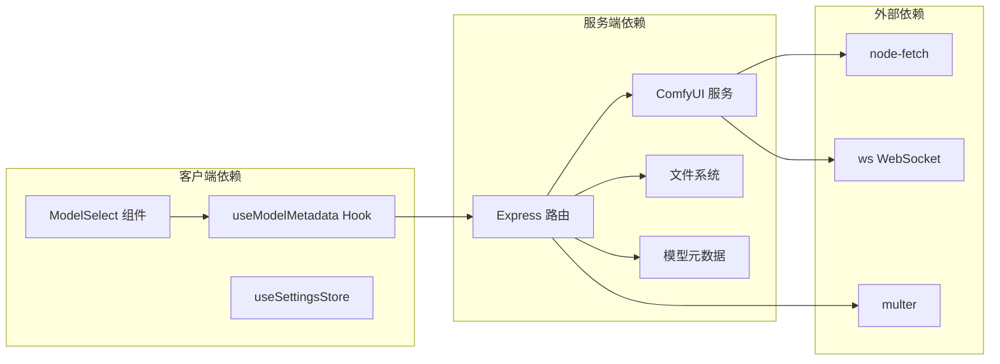
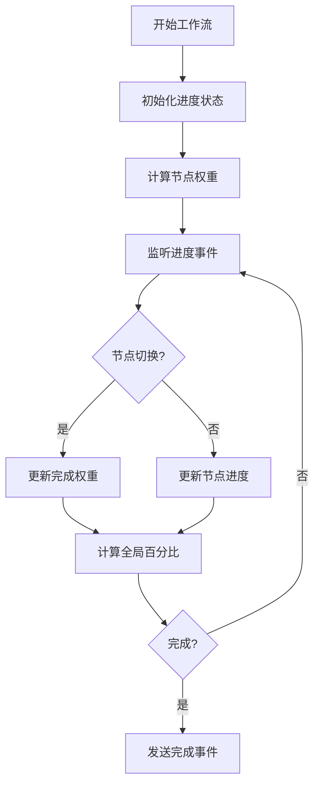
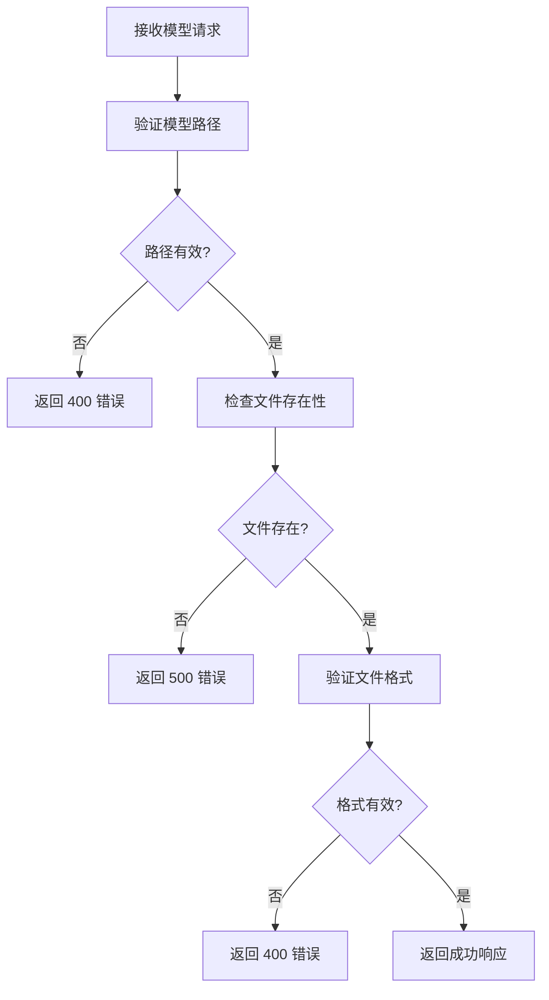

# 模型管理接口

<cite>
**本文档引用的文件**
- [server/src/routes/workflow.ts](file://server/src/routes/workflow.ts)
- [server/src/services/comfyui.ts](file://server/src/services/comfyui.ts)
- [server/src/routes/modelMeta.ts](file://server/src/routes/modelMeta.ts)
- [client/src/hooks/useModelMetadata.ts](file://client/src/hooks/useModelMetadata.ts)
- [client/src/components/ModelSelect.tsx](file://client/src/components/ModelSelect.tsx)
- [model_meta/metadata.json](file://model_meta/metadata.json)
- [server/src/types/index.ts](file://server/src/types/index.ts)
</cite>

## 目录
1. [简介](#简介)
2. [项目结构](#项目结构)
3. [核心组件](#核心组件)
4. [架构概览](#架构概览)
5. [详细组件分析](#详细组件分析)
6. [依赖关系分析](#依赖关系分析)
7. [性能考虑](#性能考虑)
8. [故障排除指南](#故障排除指南)
9. [结论](#结论)

## 简介

CorineKit Pix2Real 是一个基于 ComfyUI 的 AI 图像生成平台，提供了完整的模型管理功能。本文档详细介绍了模型相关的所有 HTTP 接口，包括检查点模型列表、UNet 模型列表、LoRA 模型列表等接口。文档涵盖了请求参数说明、响应数据格式、模型信息结构、错误码定义和使用示例，并包含了模型类型分类、模型版本管理、模型验证、模型缓存等关键信息。

## 项目结构

项目采用前后端分离的架构，主要分为以下模块：



**图表来源**
- [server/src/index.ts:118-145](file://server/src/index.ts#L118-L145)
- [server/src/routes/workflow.ts:1-30](file://server/src/routes/workflow.ts#L1-L30)

**章节来源**
- [server/src/index.ts:118-145](file://server/src/index.ts#L118-L145)
- [server/src/routes/workflow.ts:1-30](file://server/src/routes/workflow.ts#L1-L30)

## 核心组件

### 模型管理接口

系统提供了三个主要的模型列表接口：

1. **检查点模型列表** (`/api/workflow/models/checkpoints`)
2. **UNet 模型列表** (`/api/workflow/models/unets`)  
3. **LoRA 模型列表** (`/api/workflow/models/loras`)

### 模型元数据管理

除了基本的模型列表，系统还提供了完整的模型元数据管理功能：

- 缩略图上传和管理
- 模型昵称设置
- 触发词管理
- 分类管理
- 批量元数据更新

**章节来源**
- [server/src/routes/workflow.ts:407-435](file://server/src/routes/workflow.ts#L407-L435)
- [server/src/routes/modelMeta.ts:43-272](file://server/src/routes/modelMeta.ts#L43-L272)

## 架构概览



**图表来源**
- [server/src/routes/workflow.ts:407-435](file://server/src/routes/workflow.ts#L407-L435)
- [server/src/routes/modelMeta.ts:49-83](file://server/src/routes/modelMeta.ts#L49-L83)
- [server/src/services/comfyui.ts:415-440](file://server/src/services/comfyui.ts#L415-L440)

## 详细组件分析

### 模型列表接口

#### 检查点模型列表接口

**接口定义**
- 方法: `GET`
- 路径: `/api/workflow/models/checkpoints`
- 功能: 获取 ComfyUI 中可用的检查点模型列表

**请求参数**
- 无参数

**响应数据格式**
```json
[
  "model1.safetensors",
  "model2.ckpt",
  "model3.fp16.safetensors"
]
```

**错误处理**
- 成功: 返回 200 状态码和模型数组
- 失败: 返回 502 状态码和空数组

**实现细节**
接口通过调用 `getCheckpointModels()` 函数获取模型列表，该函数向 ComfyUI 发送请求获取 `CheckpointLoaderSimple` 节点的可用模型列表。

**章节来源**
- [server/src/routes/workflow.ts:407-415](file://server/src/routes/workflow.ts#L407-L415)
- [server/src/services/comfyui.ts:415-422](file://server/src/services/comfyui.ts#L415-L422)

#### UNet 模型列表接口

**接口定义**
- 方法: `GET`
- 路径: `/api/workflow/models/unets`
- 功能: 获取 ComfyUI 中可用的 UNet 模型列表

**请求参数**
- 无参数

**响应数据格式**
```json
[
  "unet1.safetensors",
  "unet2.fp16.safetensors"
]
```

**错误处理**
- 成功: 返回 200 状态码和模型数组
- 失败: 返回 502 状态码和空数组

**实现细节**
接口通过调用 `getUnetModels()` 函数获取模型列表，该函数向 ComfyUI 发送请求获取 `UNETLoader` 节点的可用模型列表。

**章节来源**
- [server/src/routes/workflow.ts:417-425](file://server/src/routes/workflow.ts#L417-L425)
- [server/src/services/comfyui.ts:424-431](file://server/src/services/comfyui.ts#L424-L431)

#### LoRA 模型列表接口

**接口定义**
- 方法: `GET`
- 路径: `/api/workflow/models/loras`
- 功能: 获取 ComfyUI 中可用的 LoRA 模型列表

**请求参数**
- 无参数

**响应数据格式**
```json
[
  "lora1.safetensors",
  "lora2.safetensors"
]
```

**错误处理**
- 成功: 返回 200 状态码和模型数组
- 失败: 返回 502 状态码和空数组

**实现细节**
接口通过调用 `getLoraModels()` 函数获取模型列表，该函数向 ComfyUI 发送请求获取 `LoraLoader` 节点的可用模型列表。

**章节来源**
- [server/src/routes/workflow.ts:427-435](file://server/src/routes/workflow.ts#L427-L435)
- [server/src/services/comfyui.ts:433-440](file://server/src/services/comfyui.ts#L433-L440)

### 模型元数据管理接口

#### 缩略图管理接口

**上传缩略图**
- 方法: `POST`
- 路径: `/api/models/metadata/thumbnail`
- 请求体: multipart/form-data
- 参数:
  - `file`: 图片文件 (必需)
  - `modelPath`: 模型路径 (必需)

**删除缩略图**
- 方法: `DELETE`
- 路径: `/api/models/metadata/thumbnail`
- 请求体: JSON
- 参数:
  - `modelPath`: 模型路径 (必需)

**章节来源**
- [server/src/routes/modelMeta.ts:49-83](file://server/src/routes/modelMeta.ts#L49-L83)
- [server/src/routes/modelMeta.ts:103-126](file://server/src/routes/modelMeta.ts#L103-L126)

#### 模型昵称管理接口

**设置昵称**
- 方法: `POST`
- 路径: `/api/models/metadata/nickname`
- 请求体: JSON
- 参数:
  - `modelPath`: 模型路径 (必需)
  - `nickname`: 昵称 (必需)

**删除昵称**
- 方法: `DELETE`
- 路径: `/api/models/metadata/nickname`
- 请求体: JSON
- 参数:
  - `modelPath`: 模型路径 (必需)

**章节来源**
- [server/src/routes/modelMeta.ts:85-101](file://server/src/routes/modelMeta.ts#L85-L101)
- [server/src/routes/modelMeta.ts:128-147](file://server/src/routes/modelMeta.ts#L128-L147)

#### 触发词管理接口

**设置触发词**
- 方法: `POST`
- 路径: `/api/models/metadata/trigger-words`
- 请求体: JSON
- 参数:
  - `modelPath`: 模型路径 (必需)
  - `triggerWords`: 触发词 (必需)

**删除触发词**
- 方法: `DELETE`
- 路径: `/api/models/metadata/trigger-words`
- 请求体: JSON
- 参数:
  - `modelPath`: 模型路径 (必需)

**章节来源**
- [server/src/routes/modelMeta.ts:149-165](file://server/src/routes/modelMeta.ts#L149-L165)
- [server/src/routes/modelMeta.ts:167-186](file://server/src/routes/modelMeta.ts#L167-L186)

#### 分类管理接口

**设置分类**
- 方法: `POST`
- 路径: `/api/models/metadata/category`
- 请求体: JSON
- 参数:
  - `modelPath`: 模型路径 (必需)
  - `category`: 分类 (必需)

**删除分类**
- 方法: `DELETE`
- 路径: `/api/models/metadata/category`
- 请求体: JSON
- 参数:
  - `modelPath`: 模型路径 (必需)

**章节来源**
- [server/src/routes/modelMeta.ts:188-204](file://server/src/routes/modelMeta.ts#L188-L204)
- [server/src/routes/modelMeta.ts:206-225](file://server/src/routes/modelMeta.ts#L206-L225)

#### 批量元数据更新接口

**更新元数据**
- 方法: `PUT`
- 路径: `/api/models/metadata/update`
- 请求体: JSON
- 参数:
  - `modelPath`: 模型路径 (必需)
  - `fields`: 要更新的字段对象

**支持的字段**
- `description`: 模型描述
- `styleTags`: 风格标签数组
- `keywords`: 关键词数组
- `compatibleModels`: 兼容模型数组
- `recommendedStrength`: 推荐强度
- `nickname`: 昵称
- `triggerWords`: 触发词
- `category`: 分类

**章节来源**
- [server/src/routes/modelMeta.ts:227-269](file://server/src/routes/modelMeta.ts#L227-L269)

### 模型元数据结构

模型元数据采用 JSON 格式存储，支持以下字段：

```json
{
  "IL-lunarcherrymix_v20.safetensors": {
    "nickname": "光辉-CherryMix",
    "thumbnail": "a7b00d45-c1d8-434e-b416-1bda8f5eb2c2.png",
    "category": "光辉",
    "keywords": ["光辉-CherryMix"],
    "description": "基础模型 - 光辉-CherryMix",
    "styleTags": [],
    "triggerWords": "multiple views, pov",
    "compatibleModels": ["IL"],
    "recommendedStrength": 0.7
  }
}
```

**字段说明**
- `nickname`: 模型的显示昵称
- `thumbnail`: 缩略图文件名
- `category`: 模型分类
- `keywords`: 关键词数组
- `description`: 模型描述
- `styleTags`: 风格标签数组
- `triggerWords`: 触发词
- `compatibleModels`: 兼容的基础模型列表
- `recommendedStrength`: 推荐的 LoRA 强度

**章节来源**
- [model_meta/metadata.json:1-800](file://model_meta/metadata.json#L1-L800)
- [client/src/hooks/useModelMetadata.ts:3-14](file://client/src/hooks/useModelMetadata.ts#L3-L14)

### 模型加载和切换机制

系统实现了智能的模型加载和切换机制：



**图表来源**
- [server/src/routes/workflow.ts:40-86](file://server/src/routes/workflow.ts#L40-L86)
- [server/src/services/comfyui.ts:415-440](file://server/src/services/comfyui.ts#L415-L440)

**章节来源**
- [server/src/routes/workflow.ts:40-86](file://server/src/routes/workflow.ts#L40-L86)

## 依赖关系分析



**图表来源**
- [server/src/index.ts:1-20](file://server/src/index.ts#L1-L20)
- [server/src/routes/workflow.ts:1-15](file://server/src/routes/workflow.ts#L1-L15)

**章节来源**
- [server/src/index.ts:1-20](file://server/src/index.ts#L1-L20)
- [server/src/routes/workflow.ts:1-15](file://server/src/routes/workflow.ts#L1-L15)

## 性能考虑

### 模型加载性能

系统通过以下方式优化模型加载性能：

1. **权重计算**: 不同类型的模型节点具有不同的权重值，用于准确计算整体进度
2. **缓存机制**: ComfyUI 内置的模型缓存机制
3. **异步处理**: 使用异步操作避免阻塞主线程

### 进度追踪算法



**图表来源**
- [server/src/index.ts:188-271](file://server/src/index.ts#L188-L271)

**章节来源**
- [server/src/index.ts:188-271](file://server/src/index.ts#L188-L271)

## 故障排除指南

### 常见错误及解决方案

| 错误类型 | HTTP 状态码 | 描述 | 解决方案 |
|---------|------------|------|----------|
| ComfyUI 未运行 | 502 | 无法连接到 ComfyUI | 启动 ComfyUI 服务 |
| 模型文件缺失 | 500 | 指定的模型文件不存在 | 检查模型文件路径 |
| 请求参数错误 | 400 | 缺少必需的请求参数 | 验证请求参数完整性 |
| 文件类型不支持 | 400 | 上传的文件类型不被支持 | 使用支持的图片格式 |

### 模型验证流程



**图表来源**
- [server/src/routes/workflow.ts:129-150](file://server/src/routes/workflow.ts#L129-L150)

**章节来源**
- [server/src/routes/workflow.ts:129-150](file://server/src/routes/workflow.ts#L129-L150)

### 日志记录和监控

系统提供了完善的日志记录机制：

- **错误日志**: 记录所有 API 调用错误
- **进度日志**: 记录工作流执行进度
- **性能日志**: 记录模型加载时间和资源使用情况

**章节来源**
- [server/src/index.ts:335-447](file://server/src/index.ts#L335-L447)

## 结论

CorineKit Pix2Real 提供了完整的模型管理解决方案，包括：

1. **完整的模型列表接口**: 支持检查点、UNet、LoRA 三种类型的模型查询
2. **强大的元数据管理**: 支持缩略图、昵称、触发词、分类等元数据的管理
3. **智能的模型加载机制**: 实现了高效的模型加载和切换
4. **完善的错误处理**: 提供了全面的错误处理和故障排除机制
5. **优秀的用户体验**: 通过分类、搜索、收藏等功能提升用户使用体验

该系统为 AI 图像生成应用提供了坚实的技术基础，支持复杂的模型管理和工作流执行需求。