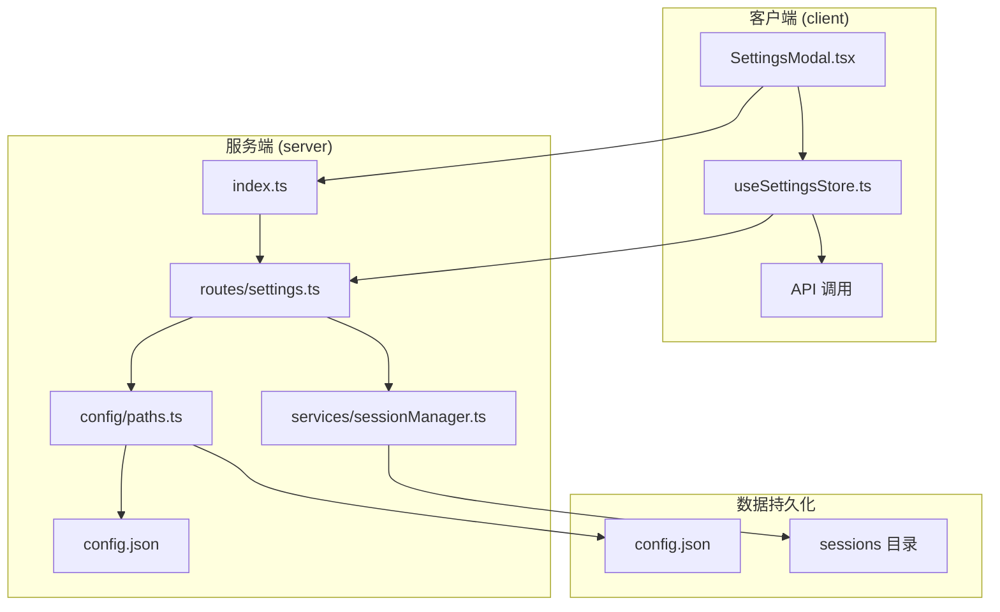
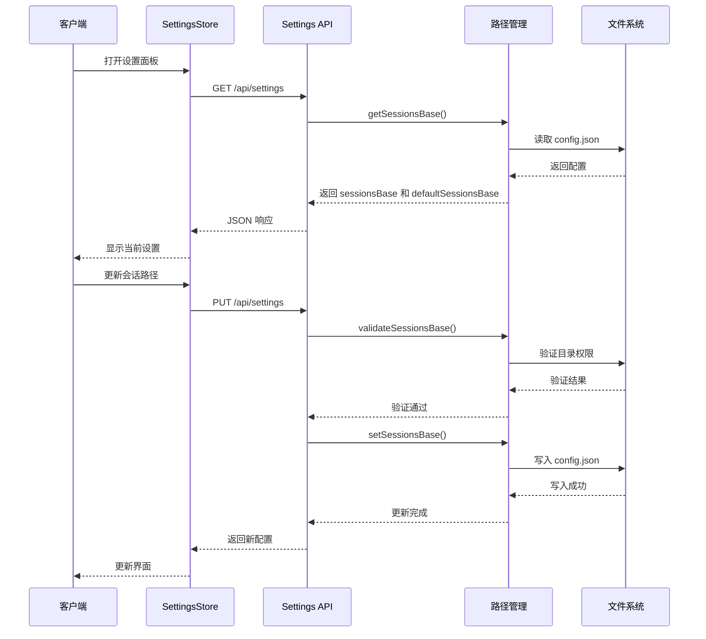
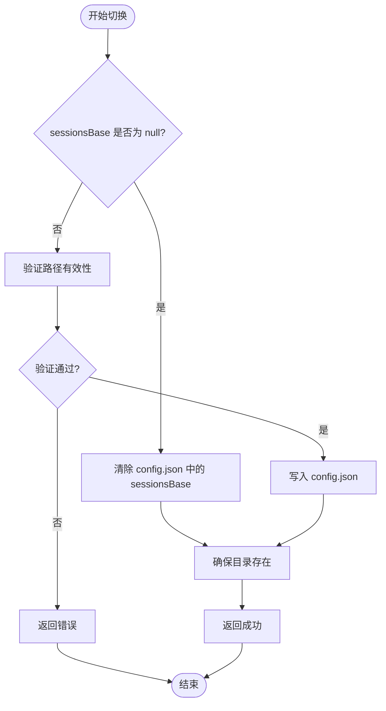
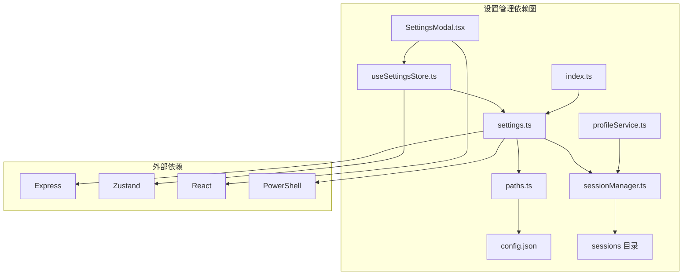

# 设置管理接口

<cite>
**本文档引用的文件**
- [settings.ts](file://server/src/routes/settings.ts)
- [paths.ts](file://server/src/config/paths.ts)
- [sessionManager.ts](file://server/src/services/sessionManager.ts)
- [useSettingsStore.ts](file://client/src/hooks/useSettingsStore.ts)
- [SettingsModal.tsx](file://client/src/components/SettingsModal.tsx)
- [index.ts](file://server/src/index.ts)
- [profileService.ts](file://server/src/services/profileService.ts)
</cite>

## 目录
1. [简介](#简介)
2. [项目结构](#项目结构)
3. [核心组件](#核心组件)
4. [架构概览](#架构概览)
5. [详细组件分析](#详细组件分析)
6. [依赖关系分析](#依赖关系分析)
7. [性能考虑](#性能考虑)
8. [故障排除指南](#故障排除指南)
9. [结论](#结论)

## 简介

CorineKit Pix2Real 的设置管理接口提供了完整的配置管理功能，主要围绕会话存储路径的配置管理。该系统采用前后端分离的设计，前端使用 React + Zustand 管理本地设置，后端使用 Express 提供 RESTful API 接口。

系统支持以下核心功能：
- 获取当前服务端配置（会话存储路径）
- 更新服务端配置（切换会话存储路径）
- 浏览文件夹选择器（Windows 平台）
- 用户偏好画像生成

## 项目结构

设置管理相关的文件组织结构如下：



**图表来源**
- [settings.ts:1-106](file://server/src/routes/settings.ts#L1-L106)
- [paths.ts:1-156](file://server/src/config/paths.ts#L1-L156)
- [useSettingsStore.ts:1-177](file://client/src/hooks/useSettingsStore.ts#L1-L177)

**章节来源**
- [settings.ts:1-106](file://server/src/routes/settings.ts#L1-L106)
- [paths.ts:1-156](file://server/src/config/paths.ts#L1-L156)
- [index.ts:144-144](file://server/src/index.ts#L144-L144)

## 核心组件

### 服务端设置路由

服务端设置路由位于 `server/src/routes/settings.ts`，提供三个主要接口：

1. **GET /api/settings** - 获取当前配置
2. **PUT /api/settings** - 更新配置
3. **POST /api/settings/browse-folder** - 浏览文件夹选择器

### 客户端设置存储

客户端设置存储位于 `client/src/hooks/useSettingsStore.ts`，使用 Zustand 管理状态，包含：
- 本地设置（localStorage 持久化）
- 服务端设置（远程同步）
- 会话路径管理

### 路径配置管理

路径配置管理位于 `server/src/config/paths.ts`，负责：
- 读取和写入 config.json
- 验证路径有效性
- 管理会话存储根目录

**章节来源**
- [settings.ts:21-103](file://server/src/routes/settings.ts#L21-L103)
- [useSettingsStore.ts:19-52](file://client/src/hooks/useSettingsStore.ts#L19-L52)
- [paths.ts:24-137](file://server/src/config/paths.ts#L24-L137)

## 架构概览



**图表来源**
- [settings.ts:22-67](file://server/src/routes/settings.ts#L22-L67)
- [paths.ts:106-137](file://server/src/config/paths.ts#L106-L137)
- [useSettingsStore.ts:140-175](file://client/src/hooks/useSettingsStore.ts#L140-L175)

## 详细组件分析

### 设置路由实现

#### GET /api/settings 接口

**请求参数**: 无

**响应数据格式**:
```json
{
  "sessionsBase": "string",
  "defaultSessionsBase": "string"
}
```

**功能说明**:
- 返回当前生效的会话存储根目录路径
- 返回默认会话存储根目录路径
- 用于前端设置面板显示当前配置状态

#### PUT /api/settings 接口

**请求参数**:
```json
{
  "sessionsBase": "string | null"
}
```

**响应数据格式**:
```json
{
  "sessionsBase": "string",
  "defaultSessionsBase": "string"
}
```

**更新规则**:
- `sessionsBase` 为字符串：切换到自定义路径
- `sessionsBase` 为 `null`：恢复默认路径
- 不包含该字段：保持现有配置不变

#### POST /api/settings/browse-folder 接口

**请求参数**:
```json
{
  "initialPath": "string"
}
```

**响应数据格式**:
```json
{
  "path": "string"
} | {
  "cancelled": true
} | {
  "error": "string"
}
```

**平台限制**: 仅支持 Windows 平台，使用 PowerShell 调用 `pick-folder.ps1` 脚本。

**章节来源**
- [settings.ts:21-103](file://server/src/routes/settings.ts#L21-L103)

### 路径配置管理

#### 配置文件结构

配置文件位于项目根目录的 `config.json`，格式如下：
```json
{
  "sessionsBase": "绝对路径"
}
```

#### 路径验证逻辑

路径验证包含以下检查：
1. 路径非空且为字符串
2. 必须是绝对路径
3. 不能嵌套在当前 sessionsBase 的子 tab 目录下
4. 目录可创建且具有写权限
5. 具备写入测试能力

#### 路径切换机制



**图表来源**
- [paths.ts:84-100](file://server/src/config/paths.ts#L84-L100)
- [paths.ts:106-137](file://server/src/config/paths.ts#L106-L137)

**章节来源**
- [paths.ts:24-137](file://server/src/config/paths.ts#L24-L137)

### 客户端设置存储

#### 状态管理

客户端使用 Zustand 管理设置状态，包含：
- **本地设置**：存储在 localStorage 中，如 `settings_reversePromptModel`
- **服务端设置**：从服务端同步，如 `sessionsBase`、`defaultSessionsBase`
- **会话路径状态**：`sessionsPathLoaded`

#### 设置面板集成

设置面板位于 `client/src/components/SettingsModal.tsx`，提供：
- 工作流设置（反推模型、LLM 模型、下拉菜单样式）
- 随机生成设置（偏好、参考图、比例、内容限制）
- 会话设置（启动行为、会话存储路径）
- 通知设置（桌面通知）
- 提示词管理（标签数据导入导出）

**章节来源**
- [useSettingsStore.ts:19-176](file://client/src/hooks/useSettingsStore.ts#L19-L176)
- [SettingsModal.tsx:59-679](file://client/src/components/SettingsModal.tsx#L59-L679)

### 用户偏好画像服务

系统还提供了用户偏好画像生成功能，位于 `server/src/services/profileService.ts`：

#### 数据收集范围
- 所有会话目录下的生成日志
- 收藏数据
- 用户交互历史

#### 偏好分析维度
1. **模型偏好**：基于使用次数和收藏次数计算评分
2. **LoRA 偏好**：统计 LoRA 使用频率和强度
3. **参数偏好**：使用众数统计常用参数组合
4. **风格特征**：提取高频标签
5. **使用模式**：统计使用频率和活跃度

**章节来源**
- [profileService.ts:77-250](file://server/src/services/profileService.ts#L77-L250)

## 依赖关系分析



**图表来源**
- [index.ts:14-14](file://server/src/index.ts#L14-L14)
- [settings.ts:4-17](file://server/src/routes/settings.ts#L4-L17)
- [useSettingsStore.ts:1-1](file://client/src/hooks/useSettingsStore.ts#L1-L1)

### 关键依赖关系

1. **路由依赖**: `index.ts` 将 `/api/settings` 路由挂载到 Express 应用
2. **配置依赖**: `settings.ts` 依赖 `paths.ts` 进行路径管理
3. **持久化依赖**: `paths.ts` 依赖 `config.json` 进行配置持久化
4. **会话依赖**: `sessionManager.ts` 依赖 `paths.ts` 获取会话根目录
5. **前端依赖**: `SettingsModal.tsx` 依赖 `useSettingsStore.ts` 进行状态管理

**章节来源**
- [index.ts:144-144](file://server/src/index.ts#L144-L144)
- [settings.ts:8-17](file://server/src/routes/settings.ts#L8-L17)
- [paths.ts:35-66](file://server/src/config/paths.ts#L35-L66)

## 性能考虑

### 路径验证性能
- 路径验证包含文件系统操作，建议在用户交互时异步执行
- 避免频繁的路径切换操作
- 使用缓存机制减少重复验证

### 配置持久化性能
- `config.json` 文件读写操作相对轻量
- 建议在应用启动时一次性加载配置
- 避免在高频操作中频繁写入配置文件

### 前端状态管理性能
- 使用 Zustand 减少不必要的组件重渲染
- 合理的分层状态管理，避免全局状态过大
- 使用异步加载机制处理大型配置数据

## 故障排除指南

### 常见错误及解决方案

#### 路径验证失败
**错误类型**: `必须是绝对路径`
**原因**: 提供的路径不是绝对路径
**解决方法**: 确保提供完整的绝对路径

**错误类型**: `不能嵌套在 session 的 tab 子目录下`
**原因**: 路径指向 sessions 目录的子目录
**解决方法**: 选择 sessions 目录的父级或同级目录

**错误类型**: `目录不可写`
**原因**: 目录没有写入权限
**解决方法**: 检查目录权限，确保具有写入权限

#### API 调用失败
**HTTP 500 错误**: 服务器内部错误
**可能原因**: 文件系统操作失败
**解决方法**: 检查磁盘空间和权限

**HTTP 501 错误**: 平台不支持
**可能原因**: 非 Windows 平台调用文件夹选择器
**解决方法**: 在 Windows 平台上使用该功能

#### 配置持久化失败
**问题现象**: 设置无法保存
**可能原因**: config.json 文件损坏或权限不足
**解决方法**: 检查文件权限，必要时删除损坏的配置文件

**章节来源**
- [settings.ts:46-59](file://server/src/routes/settings.ts#L46-L59)
- [paths.ts:106-137](file://server/src/config/paths.ts#L106-L137)

## 结论

CorineKit Pix2Real 的设置管理接口设计合理，实现了以下关键特性：

1. **简洁的 API 设计**: 提供了必要的设置管理功能，接口清晰易用
2. **完善的配置验证**: 包含多层次的路径验证，确保配置的有效性
3. **可靠的持久化机制**: 使用 JSON 文件进行配置持久化，简单可靠
4. **良好的用户体验**: 前后端协同，提供直观的设置界面
5. **扩展性设计**: 路由设计预留了扩展空间，便于未来添加更多设置项

系统在路径管理方面表现优秀，特别是在跨平台兼容性和安全性方面考虑周全。用户偏好画像功能为系统的智能化提供了基础，有助于提升用户体验。

建议在未来版本中：
- 添加设置重置功能
- 增加设置导入导出功能
- 扩展更多系统级设置项
- 提供设置版本管理和迁移机制