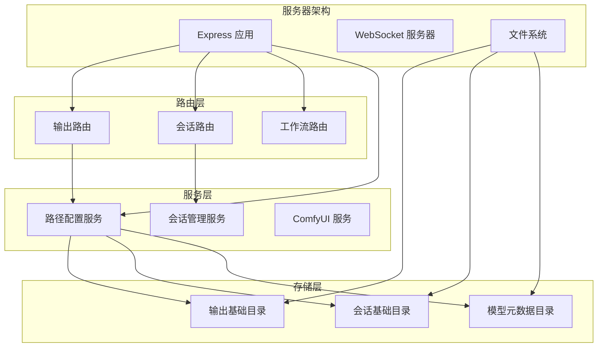
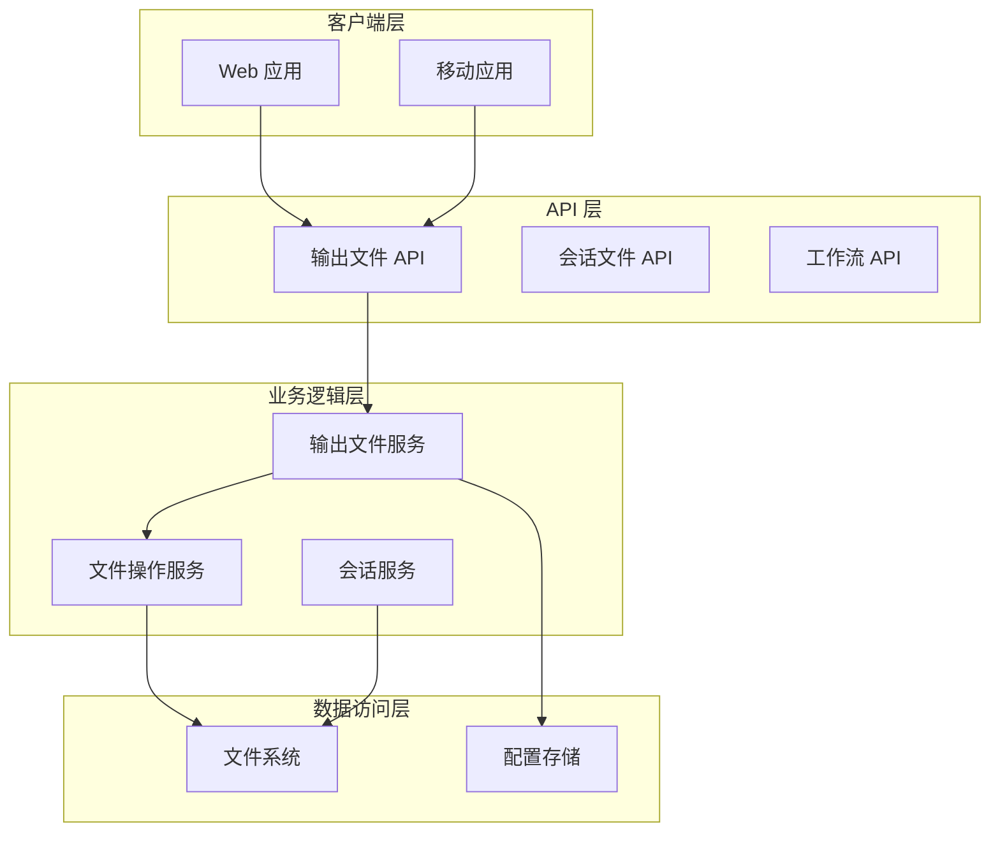
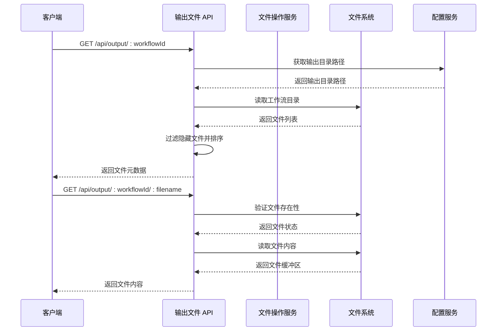
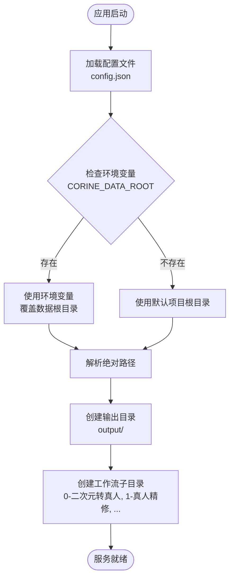
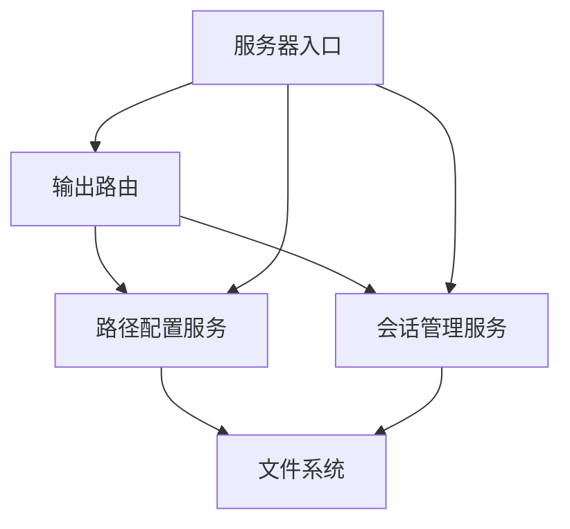
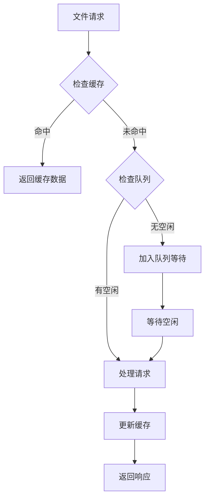
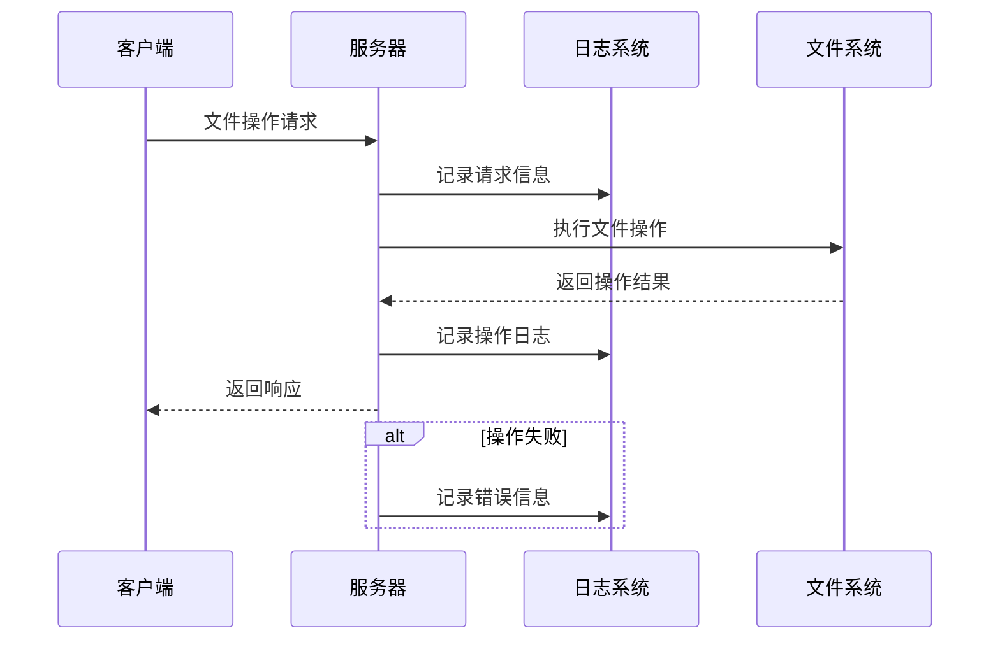

# 输出文件管理接口

<cite>
**本文档引用的文件**
- [server/src/routes/output.ts](file://server/src/routes/output.ts)
- [server/src/config/paths.ts](file://server/src/config/paths.ts)
- [server/src/services/sessionManager.ts](file://server/src/services/sessionManager.ts)
- [server/src/index.ts](file://server/src/index.ts)
- [server/package.json](file://server/package.json)
</cite>

## 目录
1. [简介](#简介)
2. [项目结构](#项目结构)
3. [核心组件](#核心组件)
4. [架构概览](#架构概览)
5. [详细组件分析](#详细组件分析)
6. [依赖关系分析](#依赖关系分析)
7. [性能考虑](#性能考虑)
8. [故障排除指南](#故障排除指南)
9. [结论](#结论)

## 简介

CorineKit Pix2Real 的输出文件管理接口提供了对生成结果文件的完整生命周期管理能力。该系统支持多种工作流类型的输出文件管理，包括二次元转真人、真人精修、视频生成等11种不同的工作流类型。

系统采用分层架构设计，将输出文件存储在独立的 `output` 目录中，每个工作流类型对应一个专门的子目录。文件管理接口提供了文件列表获取、单文件下载、文件打开等功能，并通过统一的路径配置管理确保了跨平台兼容性和可配置性。

## 项目结构

输出文件管理系统主要由以下核心组件构成：



**图表来源**
- [server/src/index.ts:118-146](file://server/src/index.ts#L118-L146)
- [server/src/config/paths.ts:141-155](file://server/src/config/paths.ts#L141-L155)

**章节来源**
- [server/src/index.ts:118-146](file://server/src/index.ts#L118-L146)
- [server/src/config/paths.ts:1-156](file://server/src/config/paths.ts#L1-L156)

## 核心组件

### 输出文件路由模块

输出文件管理接口的核心实现位于 `server/src/routes/output.ts` 文件中，提供了完整的 RESTful API 接口：

| 组件 | 描述 | 负责人 |
|------|------|--------|
| **路由注册** | 在 Express 应用中注册输出文件相关路由 | server/src/index.ts |
| **文件列表接口** | 获取指定工作流类型的输出文件列表 | server/src/routes/output.ts |
| **文件下载接口** | 提供单个输出文件的下载服务 | server/src/routes/output.ts |
| **文件打开接口** | 在操作系统中打开指定文件 | server/src/routes/output.ts |
| **路径配置服务** | 管理输出文件存储路径配置 | server/src/config/paths.ts |

### 工作流目录映射

系统支持11种不同工作流类型，每种工作流都有对应的输出目录：

| 工作流ID | 工作流名称 | 输出目录 | 文件类型 |
|----------|------------|----------|----------|
| 0 | 二次元转真人 | 0-二次元转真人 | 图像文件 |
| 1 | 真人精修 | 1-真人精修 | 图像文件 |
| 2 | 精修放大 | 2-精修放大 | 图像文件 |
| 3 | 图生视频 | 3-图生视频 | 视频文件 |
| 4 | 视频补帧 | 4-视频补帧 | 视频文件 |
| 5 | 解除装备 | 5-解除装备 | 图像文件 |
| 6 | 真人转二次元 | 6-真人转二次元 | 图像文件 |
| 7 | 快速出图 | 7-快速出图 | 图像文件 |
| 8 | 黑兽换脸 | 8-黑兽换脸 | 图像文件 |
| 9 | ZIT快出 | 9-ZIT快出 | 图像文件 |
| 10 | 区域编辑 | 10-区域编辑 | 图像文件 |

**章节来源**
- [server/src/routes/output.ts:13-25](file://server/src/routes/output.ts#L13-L25)
- [server/src/index.ts:83-100](file://server/src/index.ts#L83-L100)

## 架构概览

输出文件管理系统采用分层架构设计，确保了良好的可维护性和扩展性：



**图表来源**
- [server/src/index.ts:118-146](file://server/src/index.ts#L118-L146)
- [server/src/routes/output.ts:1-139](file://server/src/routes/output.ts#L1-L139)

### 数据流架构



**图表来源**
- [server/src/routes/output.ts:27-78](file://server/src/routes/output.ts#L27-L78)
- [server/src/config/paths.ts:141-143](file://server/src/config/paths.ts#L141-L143)

**章节来源**
- [server/src/routes/output.ts:1-139](file://server/src/routes/output.ts#L1-L139)
- [server/src/index.ts:79-100](file://server/src/index.ts#L79-L100)

## 详细组件分析

### 输出文件列表接口

#### 接口定义
- **方法**: GET
- **路径**: `/api/output/:workflowId`
- **描述**: 获取指定工作流类型的输出文件列表

#### 请求参数
| 参数名 | 类型 | 必需 | 描述 | 示例 |
|--------|------|------|------|------|
| workflowId | number | 是 | 工作流类型ID | 0-10 |

#### 响应数据格式
```json
[
  {
    "filename": "string",
    "size": "number",
    "createdAt": "string (ISO 8601)",
    "url": "string"
  }
]
```

#### 错误码定义
| 状态码 | 错误类型 | 描述 |
|--------|----------|------|
| 400 | Bad Request | 未知的工作流ID |
| 404 | Not Found | 目录不存在 |

#### 使用示例
```javascript
// 获取二次元转真人工作流的输出文件列表
fetch('/api/output/0')
  .then(response => response.json())
  .then(data => console.log(data));
```

**章节来源**
- [server/src/routes/output.ts:27-58](file://server/src/routes/output.ts#L27-L58)

### 单个文件下载接口

#### 接口定义
- **方法**: GET
- **路径**: `/api/output/:workflowId/:filename`
- **描述**: 下载指定的工作流输出文件

#### 请求参数
| 参数名 | 类型 | 必需 | 描述 | 示例 |
|--------|------|------|------|------|
| workflowId | number | 是 | 工作流类型ID | 0-10 |
| filename | string | 是 | 文件名 | "example.png" |

#### 响应数据格式
- **成功**: 文件内容（二进制数据）
- **失败**: JSON 错误对象

#### 错误码定义
| 状态码 | 错误类型 | 描述 |
|--------|----------|------|
| 400 | Bad Request | 未知的工作流ID |
| 404 | Not Found | 文件不存在 |

#### 使用示例
```javascript
// 下载指定文件
fetch('/api/output/0/example.png')
  .then(response => {
    if (response.ok) {
      return response.blob();
    }
  })
  .then(blob => {
    const url = window.URL.createObjectURL(blob);
    const a = document.createElement('a');
    a.href = url;
    a.download = 'example.png';
    document.body.appendChild(a);
    a.click();
    window.URL.revokeObjectURL(url);
  });
```

**章节来源**
- [server/src/routes/output.ts:60-78](file://server/src/routes/output.ts#L60-L78)

### 文件打开接口

#### 接口定义
- **方法**: POST
- **路径**: `/api/output/open-file`
- **描述**: 在操作系统默认应用程序中打开指定文件

#### 请求体参数
| 参数名 | 类型 | 必需 | 描述 | 示例 |
|--------|------|------|------|------|
| url | string | 是 | 文件URL地址 | "/api/output/0/example.png" |

#### 响应数据格式
```json
{
  "ok": true
}
```

#### 错误码定义
| 状态码 | 错误类型 | 描述 |
|--------|----------|------|
| 400 | Bad Request | 缺少URL参数或URL格式不支持 |
| 404 | Not Found | 文件不存在 |

#### 支持的URL格式
- `/api/output/:workflowId/:filename`
- `/output/:filename`（静态文件）
- `/api/session-files/:sessionId/:tabId/:type/:filename`

#### 使用示例
```javascript
// 在系统默认应用中打开文件
fetch('/api/output/open-file', {
  method: 'POST',
  headers: {
    'Content-Type': 'application/json'
  },
  body: JSON.stringify({
    url: '/api/output/0/example.png'
  })
})
.then(response => response.json())
.then(data => console.log(data));
```

**章节来源**
- [server/src/routes/output.ts:80-136](file://server/src/routes/output.ts#L80-L136)

### 文件存储路径管理

#### 路径配置服务

输出文件存储路径通过集中化的路径配置服务进行管理：



**图表来源**
- [server/src/index.ts:82-100](file://server/src/index.ts#L82-L100)
- [server/src/config/paths.ts:18-20](file://server/src/config/paths.ts#L18-L20)

#### 路径配置选项

| 配置项 | 类型 | 默认值 | 描述 |
|--------|------|--------|------|
| CORINE_DATA_ROOT | 环境变量 | 项目根目录 | 覆盖默认数据根目录 |
| sessionsBase | string | "sessions" | 会话文件存储目录 |
| outputBase | string | "output" | 输出文件存储目录 |
| modelMetaBase | string | "model_meta" | 模型元数据目录 |

**章节来源**
- [server/src/config/paths.ts:18-155](file://server/src/config/paths.ts#L18-L155)
- [server/src/index.ts:82-100](file://server/src/index.ts#L82-L100)

## 依赖关系分析

### 外部依赖

输出文件管理系统依赖以下核心外部库：

```mermaid
graph LR
subgraph "核心依赖"
Express[Express 4.x]
Cors[CORS 2.x]
Ws[WebSocket 8.x]
end
subgraph "开发依赖"
Typescript[TypeScript 5.x]
Tsx[Tsx 4.x]
TypesExpress[@types/express]
TypesWs[@types/ws]
end
subgraph "运行时依赖"
NodeFetch[Node-fetch 3.x]
FormData[Form-data 4.x]
Multer[Multer 1.x]
end
Express --> Cors
Express --> Ws
Express --> NodeFetch
Express --> FormData
Express --> Multer
```

**图表来源**
- [server/package.json:11-26](file://server/package.json#L11-L26)

### 内部模块依赖



**图表来源**
- [server/src/index.ts:8-18](file://server/src/index.ts#L8-L18)
- [server/src/routes/output.ts:1-11](file://server/src/routes/output.ts#L1-L11)

**章节来源**
- [server/package.json:1-28](file://server/package.json#L1-L28)
- [server/src/index.ts:1-516](file://server/src/index.ts#L1-L516)

## 性能考虑

### 文件访问优化

系统采用了多项性能优化策略来提升文件访问效率：

1. **静态文件缓存**: 输出文件目录通过 Express 静态文件中间件提供服务，减少不必要的路由处理开销
2. **文件列表缓存**: 对于频繁访问的文件列表，可以考虑在应用层面添加缓存机制
3. **并发控制**: 限制同时进行的文件操作数量，避免系统资源耗尽

### 存储优化建议

1. **定期清理**: 建议定期清理过期的输出文件，释放磁盘空间
2. **压缩存储**: 对于大量相似的输出文件，可以考虑使用压缩技术减少存储占用
3. **分层存储**: 将常用文件和不常用文件分别存储在不同性能级别的存储介质上

### 并发处理

系统通过以下方式处理高并发场景：



## 故障排除指南

### 常见问题及解决方案

#### 文件无法下载
**症状**: 请求文件时返回404错误
**可能原因**:
1. 文件已被删除或移动
2. 工作流ID不正确
3. 文件名包含特殊字符未正确编码

**解决步骤**:
1. 验证工作流ID是否在有效范围内（0-10）
2. 检查文件是否存在于对应的输出目录
3. 确认文件名URL编码是否正确

#### 权限错误
**症状**: 访问输出目录时报权限不足
**可能原因**:
1. 应用程序没有读取输出目录的权限
2. 文件被其他进程占用

**解决步骤**:
1. 检查应用程序运行用户权限
2. 关闭可能占用文件的其他程序
3. 重新启动服务器应用

#### 路径配置问题
**症状**: 输出文件无法找到或存储位置不正确
**可能原因**:
1. 环境变量 CORINE_DATA_ROOT 设置错误
2. config.json 配置文件损坏

**解决步骤**:
1. 检查环境变量设置
2. 验证 config.json 文件格式
3. 重新生成默认配置

**章节来源**
- [server/src/routes/output.ts:32-75](file://server/src/routes/output.ts#L32-L75)
- [server/src/config/paths.ts:35-56](file://server/src/config/paths.ts#L35-L56)

### 日志监控

系统提供了完善的日志记录机制，便于问题诊断：



## 结论

CorineKit Pix2Real 的输出文件管理接口提供了一个完整、高效且易于使用的文件管理解决方案。系统通过清晰的架构设计、完善的错误处理机制和灵活的配置选项，为用户提供了可靠的输出文件管理能力。

主要优势包括：
- **模块化设计**: 清晰的分层架构便于维护和扩展
- **跨平台兼容**: 支持Windows、macOS和Linux操作系统
- **灵活配置**: 通过环境变量和配置文件实现灵活的路径管理
- **性能优化**: 采用静态文件服务和缓存策略提升访问速度
- **安全可靠**: 完善的错误处理和权限控制机制

未来可以考虑的功能增强包括：
- 批量文件操作接口
- 文件版本管理和历史记录
- 存储配额管理和自动清理
- 文件分享和协作功能