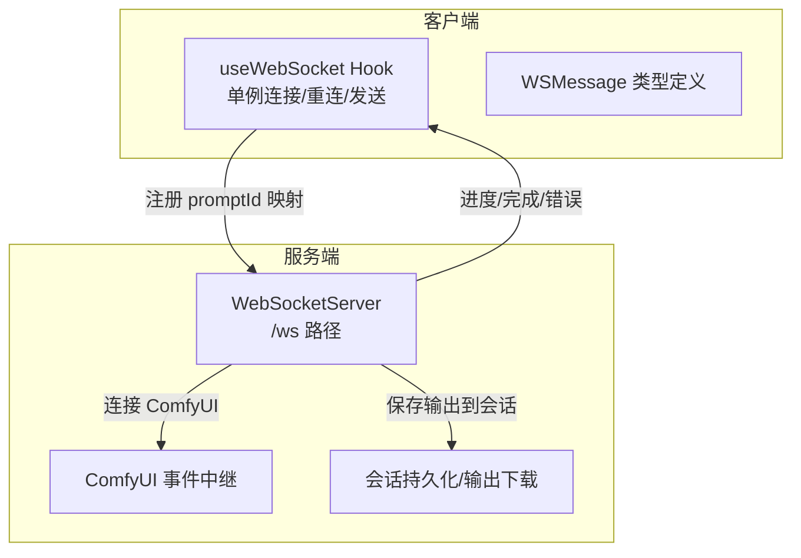
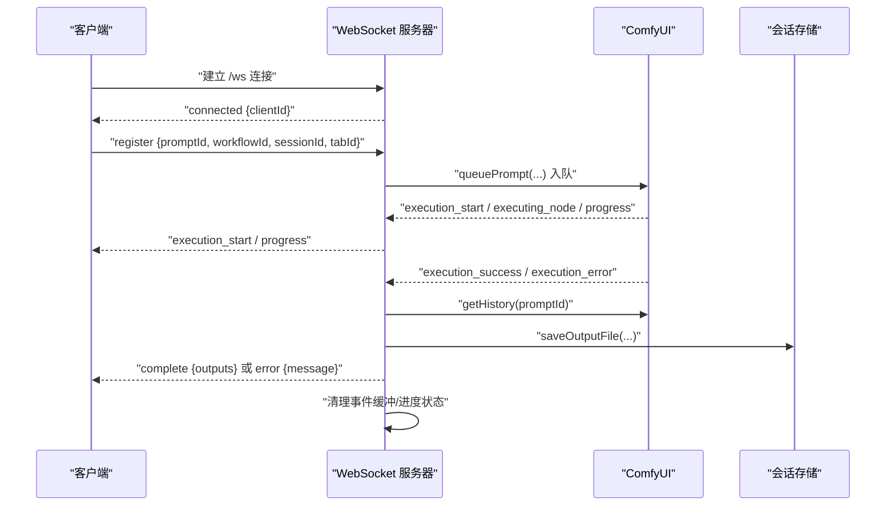
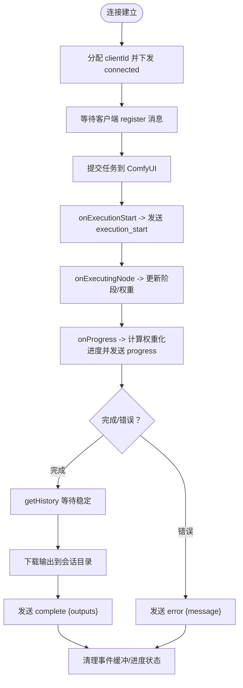
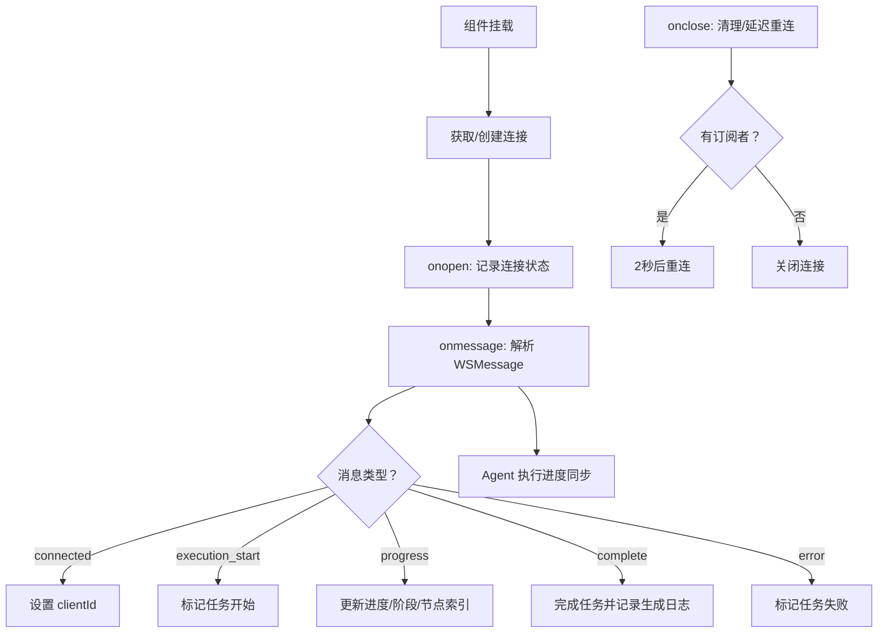
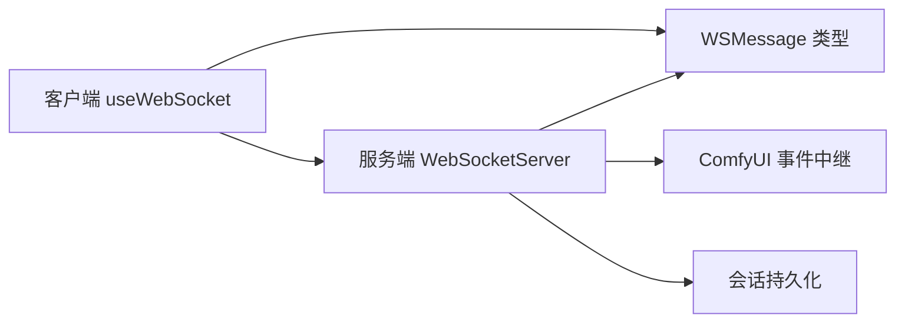

# WebSocket 实时通信

<cite>
**本文引用的文件**
- [server/src/index.ts](file://server/src/index.ts)
- [server/src/services/comfyui.ts](file://server/src/services/comfyui.ts)
- [client/src/hooks/useWebSocket.ts](file://client/src/hooks/useWebSocket.ts)
- [client/src/types/index.ts](file://client/src/types/index.ts)
- [server/src/types/index.ts](file://server/src/types/index.ts)
- [server/src/routes/workflow.ts](file://server/src/routes/workflow.ts)
- [server/src/services/sessionManager.ts](file://server/src/services/sessionManager.ts)
- [server/src/routes/session.ts](file://server/src/routes/session.ts)
</cite>

## 目录
1. [简介](#简介)
2. [项目结构](#项目结构)
3. [核心组件](#核心组件)
4. [架构总览](#架构总览)
5. [详细组件分析](#详细组件分析)
6. [依赖关系分析](#依赖关系分析)
7. [性能考虑](#性能考虑)
8. [故障排查指南](#故障排查指南)
9. [结论](#结论)
10. [附录](#附录)

## 简介
本文档面向 CorineKit Pix2Real 的 WebSocket 实时通信子系统，系统性梳理连接建立流程、消息格式规范、事件类型定义、状态同步机制与错误处理策略。重点覆盖以下内容：
- WebSocket 服务器与客户端的连接建立与心跳/重连策略
- 实时进度事件与完成/错误事件的格式与语义
- 客户端注册 promptId 与工作流/会话映射的机制
- 服务端对 ComfyUI 事件的中继与会话持久化
- 并发连接限制与性能优化建议
- 调试工具与监控方法

## 项目结构
WebSocket 子系统位于服务端与客户端两侧，分别负责：
- 服务端：WebSocket 服务器、与 ComfyUI 的双向事件中继、会话状态持久化
- 客户端：单例连接管理、消息解析与 UI 状态更新、断线重连与事件缓冲

图表来源
- [server/src/index.ts:157-494](file://server/src/index.ts#L157-L494)
- [client/src/hooks/useWebSocket.ts:29-277](file://client/src/hooks/useWebSocket.ts#L29-L277)

章节来源
- [server/src/index.ts:157-494](file://server/src/index.ts#L157-L494)
- [client/src/hooks/useWebSocket.ts:29-277](file://client/src/hooks/useWebSocket.ts#L29-L277)

## 核心组件
- 服务端 WebSocket 服务器：监听 /ws，分配 clientId，中继 ComfyUI 事件，维护事件缓冲与 prompt 映射
- 客户端 useWebSocket Hook：单例连接、消息解析、UI 状态更新、断线重连
- 类型系统：统一的 WSMessage 接口与事件类型别名
- 会话持久化：将 ComfyUI 输出下载到会话目录并返回可访问 URL

章节来源
- [server/src/index.ts:157-494](file://server/src/index.ts#L157-L494)
- [client/src/hooks/useWebSocket.ts:29-277](file://client/src/hooks/useWebSocket.ts#L29-L277)
- [client/src/types/index.ts:39-75](file://client/src/types/index.ts#L39-L75)
- [server/src/types/index.ts:10-30](file://server/src/types/index.ts#L10-L30)
- [server/src/services/sessionManager.ts:37-48](file://server/src/services/sessionManager.ts#L37-L48)

## 架构总览
WebSocket 实时通信的端到端流程如下：
- 客户端首次连接 /ws，服务端分配 clientId 并下发 connected 消息
- 客户端在 UI 交互中提交工作流，服务端将任务入队至 ComfyUI
- 服务端订阅 ComfyUI 事件，生成进度/完成/错误事件并转发给客户端
- 客户端注册 promptId 与工作流/会话映射，确保事件能正确落盘与 UI 更新
- 服务端在完成事件时，将 ComfyUI 输出下载到会话目录并返回 URL 列表

图表来源
- [server/src/index.ts:168-494](file://server/src/index.ts#L168-L494)
- [server/src/services/comfyui.ts:265-278](file://server/src/services/comfyui.ts#L265-L278)
- [server/src/services/sessionManager.ts:37-48](file://server/src/services/sessionManager.ts#L37-L48)

## 详细组件分析

### 服务端 WebSocket 服务器
- 路径与实例：在主入口创建 WebSocketServer 并监听 /ws
- 连接生命周期：分配 clientId，发送 connected，处理客户端注册消息
- 事件缓冲：对每个 promptId 维护最近事件缓冲，客户端晚到时可重放
- 与 ComfyUI 的集成：通过 connectWebSocket 订阅执行事件，生成权重化进度
- 完成与错误处理：等待历史记录稳定后下载输出，发送 complete/error，清理状态

图表来源
- [server/src/index.ts:168-494](file://server/src/index.ts#L168-L494)

章节来源
- [server/src/index.ts:157-170](file://server/src/index.ts#L157-L170)
- [server/src/index.ts:175-185](file://server/src/index.ts#L175-L185)
- [server/src/index.ts:208-229](file://server/src/index.ts#L208-L229)
- [server/src/index.ts:240-271](file://server/src/index.ts#L240-L271)
- [server/src/index.ts:335-447](file://server/src/index.ts#L335-L447)
- [server/src/index.ts:466-488](file://server/src/index.ts#L466-L488)

### 客户端 useWebSocket Hook
- 单例连接：全局 WebSocket 实例，连接计数控制生命周期
- 断线重连：连接关闭时延迟重连，仅在有活跃订阅者时重连
- 消息解析：解析 WSMessage，分派到工作流状态与智能生成状态
- 注册与事件重放：向服务端发送注册消息，接收事件缓冲重放
- 发送消息：提供 sendMessage 方法，仅在连接 OPEN 时发送

图表来源
- [client/src/hooks/useWebSocket.ts:29-277](file://client/src/hooks/useWebSocket.ts#L29-L277)

章节来源
- [client/src/hooks/useWebSocket.ts:29-277](file://client/src/hooks/useWebSocket.ts#L29-L277)

### 消息格式规范与事件类型
- 事件类型
  - connected：服务端下发，包含 clientId
  - execution_start：任务开始
  - progress：权重化进度，包含 value/max/percentage/stage/stepIndex/stepTotal
  - complete：任务完成，包含 outputs（文件名与 URL）
  - error：任务错误，包含 message
- 客户端注册消息
  - 客户端需发送 register 消息，包含 promptId、workflowId、sessionId、tabId
  - 服务端收到后建立映射，重放事件缓冲

章节来源
- [client/src/types/index.ts:39-75](file://client/src/types/index.ts#L39-L75)
- [server/src/types/index.ts:10-30](file://server/src/types/index.ts#L10-L30)
- [server/src/index.ts:466-488](file://server/src/index.ts#L466-L488)

### 状态同步机制
- 服务端维护每个 promptId 的进度状态，基于节点权重与步骤计数生成全局百分比
- 事件缓冲确保客户端晚到也能收到早期事件
- 完成事件时，服务端等待 ComfyUI 历史记录稳定，再下载输出到会话目录并返回 URL

章节来源
- [server/src/index.ts:187-229](file://server/src/index.ts#L187-L229)
- [server/src/index.ts:175-185](file://server/src/index.ts#L175-L185)
- [server/src/index.ts:335-447](file://server/src/index.ts#L335-L447)

### 会话状态事件与输出持久化
- 服务端在完成事件时，将 ComfyUI 输出下载到会话 output 目录，并返回可访问 URL
- 会话状态文件保存在 session.json 中，包含活动标签页与各卡片的任务状态

章节来源
- [server/src/services/sessionManager.ts:37-48](file://server/src/services/sessionManager.ts#L37-L48)
- [server/src/services/sessionManager.ts:102-122](file://server/src/services/sessionManager.ts#L102-L122)
- [server/src/routes/session.ts:21-52](file://server/src/routes/session.ts#L21-L52)

### 进度事件格式详解
- progress 字段
  - value/max：当前节点内部进度
  - percentage：权重化全局百分比（上限 99%，完成事件再推进至 100%）
  - stage：当前阶段中文名（由节点 class_type 映射）
  - stepIndex/stepTotal：当前节点索引与总节点数
- 权重化算法要点
  - 采样器节点权重与 steps 成正比
  - Tiled 采样器权重估算 tile 数与 steps
  - 多轮节点（如 UltimateSDUpscale）使用 tick 计数推进

章节来源
- [server/src/index.ts:240-271](file://server/src/index.ts#L240-L271)
- [server/src/services/comfyui.ts:58-144](file://server/src/services/comfyui.ts#L58-L144)

### 客户端连接示例与消息订阅模式
- 连接地址：ws://host/ws（或 wss://host/ws，取决于协议）
- 订阅模式：客户端在收到 connected 后发送 register，随后接收 progress/complete/error
- 断线重连：连接关闭时延迟重连，仅在有活跃订阅者时重连

章节来源
- [client/src/hooks/useWebSocket.ts:29-277](file://client/src/hooks/useWebSocket.ts#L29-L277)

### 错误处理机制
- 服务端在错误回调中发送 error 事件并清理状态
- 完成事件时对历史记录进行重试等待，避免“空卡”问题
- 客户端在 error 事件中更新任务状态并触发桌面通知

章节来源
- [server/src/index.ts:450-463](file://server/src/index.ts#L450-L463)
- [server/src/index.ts:338-371](file://server/src/index.ts#L338-L371)
- [client/src/hooks/useWebSocket.ts:150-158](file://client/src/hooks/useWebSocket.ts#L150-L158)

## 依赖关系分析
- 服务端依赖
  - ws：WebSocket 服务器
  - node-fetch：与 ComfyUI 交互
  - multer：文件上传（会话与工作流）
- 客户端依赖
  - React Hooks：状态与生命周期管理
  - 自定义类型：统一的 WSMessage 接口

图表来源
- [server/src/index.ts:157-158](file://server/src/index.ts#L157-L158)
- [client/src/hooks/useWebSocket.ts:29-277](file://client/src/hooks/useWebSocket.ts#L29-L277)
- [client/src/types/index.ts:39-75](file://client/src/types/index.ts#L39-L75)

章节来源
- [server/src/index.ts:157-158](file://server/src/index.ts#L157-L158)
- [client/src/hooks/useWebSocket.ts:29-277](file://client/src/hooks/useWebSocket.ts#L29-L277)
- [client/src/types/index.ts:39-75](file://client/src/types/index.ts#L39-L75)

## 性能考虑
- 事件缓冲与重放：对每个 promptId 维护事件缓冲，减少客户端晚到导致的数据丢失
- 权重化进度：基于节点权重与步骤估算，避免 UI 进度抖动
- 历史记录重试：完成事件时等待 ComfyUI 历史记录稳定，降低“空卡”风险
- 输出下载策略：仅在存在有效会话映射时下载输出，节省带宽与 IO
- 并发连接限制：当前实现未显式限制并发连接数，建议结合部署环境配置反向代理或网关限流

[本节为通用性能建议，不直接分析具体文件]

## 故障排查指南
- 连接失败
  - 检查服务端是否启动成功与 /ws 路径可用
  - 确认客户端协议（ws/wss）与主机一致
- 无进度事件
  - 确认客户端已发送 register 消息
  - 检查服务端事件缓冲是否被清理（完成/错误后会清理）
- 完成事件为空
  - 检查 ComfyUI 历史记录是否稳定（服务端已内置重试等待）
  - 确认会话映射是否存在（promptWorkflowMap）
- 输出未落盘
  - 确认 sessionId 存在且有效
  - 检查会话目录权限与磁盘空间

章节来源
- [server/src/index.ts:338-371](file://server/src/index.ts#L338-L371)
- [server/src/index.ts:466-488](file://server/src/index.ts#L466-L488)

## 结论
本 WebSocket 实时通信子系统通过服务端与客户端的协作，实现了从 ComfyUI 到 UI 的高效进度与结果传递。其关键特性包括：
- 客户端单例连接与断线重连
- 服务端事件缓冲与重放
- 权重化进度与阶段化展示
- 完成事件的稳健落盘与 URL 返回
- 明确的消息格式与错误处理

建议在生产环境中结合部署环境配置连接数限制与健康检查，持续监控历史记录等待与输出下载的稳定性。

[本节为总结性内容，不直接分析具体文件]

## 附录

### WebSocket 服务器配置
- 路径：/ws
- 协议：ws 或 wss（取决于部署）
- 连接数：未显式限制
- 日志：连接/断开/事件处理均有日志输出

章节来源
- [server/src/index.ts:157-158](file://server/src/index.ts#L157-L158)
- [server/src/index.ts:498-512](file://server/src/index.ts#L498-L512)

### 客户端连接与消息订阅
- 连接建立：useWebSocket Hook 自动建立连接
- 发送消息：sendMessage(data) 仅在连接 OPEN 时发送
- 订阅事件：connected/execution_start/progress/complete/error

章节来源
- [client/src/hooks/useWebSocket.ts:254-277](file://client/src/hooks/useWebSocket.ts#L254-L277)

### 事件类型与字段对照
- connected：clientId
- execution_start：promptId
- progress：promptId/value/max/percentage/stage/stepIndex/stepTotal
- complete：promptId/outputs[]
- error：promptId/message

章节来源
- [client/src/types/index.ts:39-75](file://client/src/types/index.ts#L39-L75)
- [server/src/types/index.ts:10-30](file://server/src/types/index.ts#L10-L30)