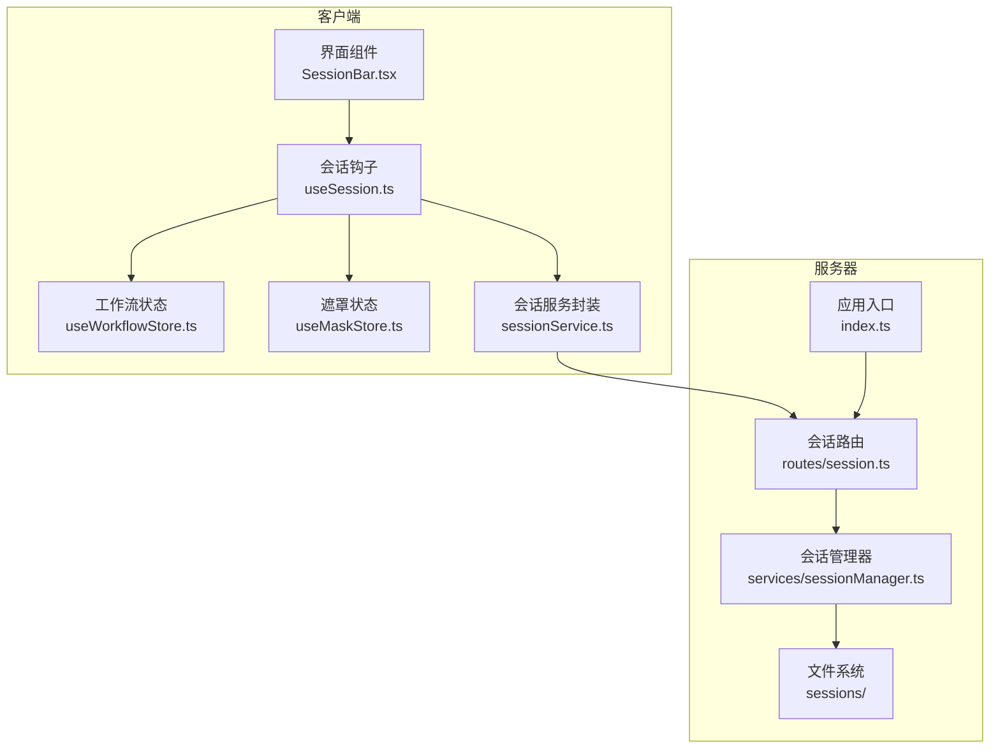
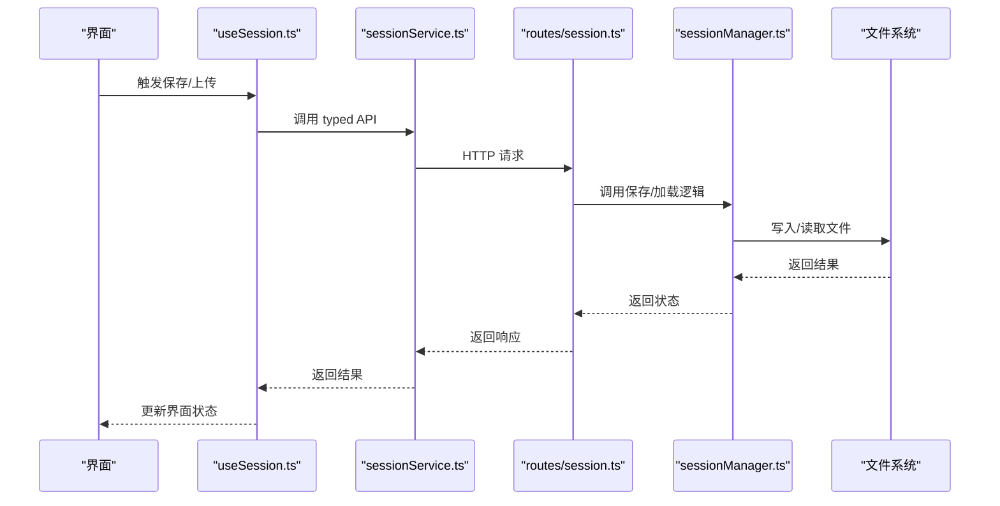
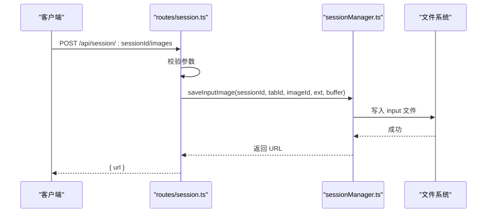
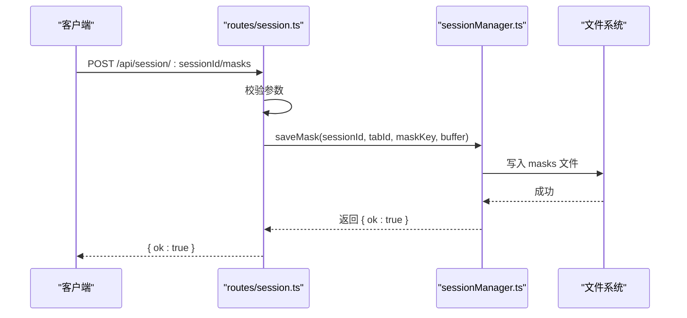
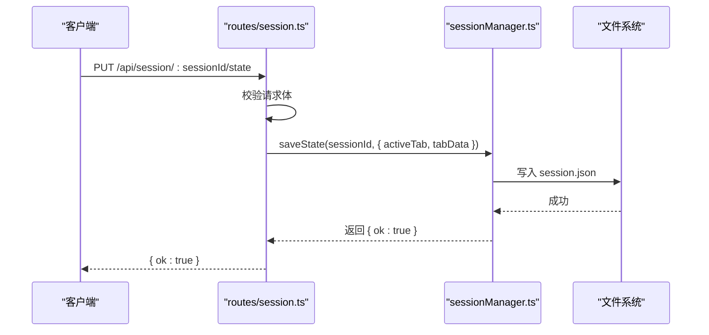
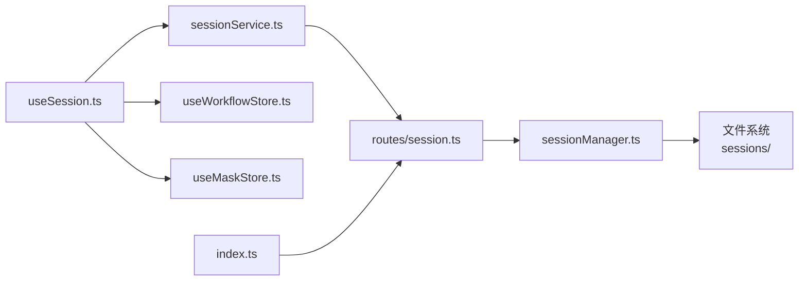

# 会话管理 API

<cite>
**本文档引用的文件**
- [server/src/routes/session.ts](file://server/src/routes/session.ts)
- [server/src/services/sessionManager.ts](file://server/src/services/sessionManager.ts)
- [server/src/index.ts](file://server/src/index.ts)
- [client/src/services/sessionService.ts](file://client/src/services/sessionService.ts)
- [client/src/hooks/useSession.ts](file://client/src/hooks/useSession.ts)
- [client/src/hooks/useWorkflowStore.ts](file://client/src/hooks/useWorkflowStore.ts)
- [client/src/hooks/useMaskStore.ts](file://client/src/hooks/useMaskStore.ts)
- [client/src/types/index.ts](file://client/src/types/index.ts)
- [TODO-session-persistence.md](file://TODO-session-persistence.md)
</cite>

## 目录
1. [简介](#简介)
2. [项目结构](#项目结构)
3. [核心组件](#核心组件)
4. [架构总览](#架构总览)
5. [详细组件分析](#详细组件分析)
6. [依赖关系分析](#依赖关系分析)
7. [性能考量](#性能考量)
8. [故障排查指南](#故障排查指南)
9. [结论](#结论)
10. [附录](#附录)

## 简介
本文件系统性梳理会话管理 API 的设计与实现，覆盖以下主题：
- 会话创建、列表获取、状态查询、数据持久化等接口
- POST /api/session/:sessionId/images 与 POST /api/session/:sessionId/masks 的参数要求、会话 ID 生成规则、初始状态设置
- GET /api/sessions 的过滤条件、排序方式、分页机制
- 会话数据结构、状态字段含义、生命周期管理
- 会话恢复、断点续传、数据备份的实现细节
- 会话清理策略、过期处理、存储优化建议

## 项目结构
会话管理由前后端协作完成：
- 后端提供会话路由与状态管理服务，负责文件与 JSON 状态的持久化
- 前端通过 typed API 封装进行会话操作，并在用户交互中自动保存

图表来源
- [server/src/routes/session.ts:1-95](file://server/src/routes/session.ts#L1-L95)
- [server/src/services/sessionManager.ts:1-164](file://server/src/services/sessionManager.ts#L1-L164)
- [server/src/index.ts:1-228](file://server/src/index.ts#L1-L228)
- [client/src/services/sessionService.ts:1-134](file://client/src/services/sessionService.ts#L1-L134)
- [client/src/hooks/useSession.ts:1-422](file://client/src/hooks/useSession.ts#L1-L422)

章节来源
- [server/src/routes/session.ts:1-95](file://server/src/routes/session.ts#L1-L95)
- [server/src/services/sessionManager.ts:1-164](file://server/src/services/sessionManager.ts#L1-L164)
- [server/src/index.ts:1-228](file://server/src/index.ts#L1-L228)
- [client/src/services/sessionService.ts:1-134](file://client/src/services/sessionService.ts#L1-L134)
- [client/src/hooks/useSession.ts:1-422](file://client/src/hooks/useSession.ts#L1-L422)

## 核心组件
- 会话路由层：提供会话相关 HTTP 接口，包括上传输入图、上传遮罩、保存/加载会话状态、列出会话、删除会话
- 会话管理器：负责会话目录结构、文件读写、会话 JSON 的序列化与反序列化、会话列表与清理
- 应用入口：注册路由、启动静态文件服务、配置 CORS 与 WebSocket
- 前端会话服务：对后端接口进行类型化封装，便于在组件中使用
- 前端会话钩子：集中处理会话 ID 生成、恢复、自动保存、断点续传、清理空会话
- 前端状态：工作流与遮罩状态，配合会话钩子进行序列化与恢复

章节来源
- [server/src/routes/session.ts:1-95](file://server/src/routes/session.ts#L1-L95)
- [server/src/services/sessionManager.ts:1-164](file://server/src/services/sessionManager.ts#L1-L164)
- [server/src/index.ts:1-228](file://server/src/index.ts#L1-L228)
- [client/src/services/sessionService.ts:1-134](file://client/src/services/sessionService.ts#L1-L134)
- [client/src/hooks/useSession.ts:1-422](file://client/src/hooks/useSession.ts#L1-L422)

## 架构总览
会话管理采用“事件驱动静默自动保存”的策略：
- 导入图片时立即拷贝到会话目录
- 任务完成时更新 session.json
- 遮罩绘制结束时保存遮罩 PNG
- 提示词变更时 500ms 去抖后更新 session.json
- 页面关闭前通过 sendBeacon 发送最终状态

图表来源
- [client/src/hooks/useSession.ts:164-181](file://client/src/hooks/useSession.ts#L164-L181)
- [client/src/services/sessionService.ts:102-113](file://client/src/services/sessionService.ts#L102-L113)
- [server/src/routes/session.ts:51-68](file://server/src/routes/session.ts#L51-L68)
- [server/src/services/sessionManager.ts:91-110](file://server/src/services/sessionManager.ts#L91-L110)

## 详细组件分析

### 会话创建与会话 ID 生成
- 会话 ID 生成：前端在首次访问时通过随机 UUID 生成，保存在本地存储中；后续访问直接读取该 ID，保证同一用户跨页面/重启的会话连续性
- 初始状态设置：会话创建时并不立即向后端发送完整状态；只有当用户进行有意义的操作（如导入图片、编辑提示词、完成任务）时，才会序列化当前状态并保存到 session.json

章节来源
- [client/src/hooks/useSession.ts:25-36](file://client/src/hooks/useSession.ts#L25-L36)
- [client/src/hooks/useSession.ts:138-162](file://client/src/hooks/useSession.ts#L138-L162)
- [client/src/hooks/useSession.ts:164-175](file://client/src/hooks/useSession.ts#L164-L175)

### POST /api/session/:sessionId/images（上传输入图）
- 功能：将用户上传的图片保存到指定会话的对应标签页 input 目录，并返回持久化 URL
- 参数要求：
  - 路径参数：sessionId（字符串）
  - 表单字段：image（文件）、tabId（数字）、imageId（字符串）
- 处理流程：
  - 校验必填字段
  - 解析扩展名，默认 .png
  - 写入 sessions/<sessionId>/tab-<tabId>/input/<imageId><ext>
  - 返回 /api/session-files/<sessionId>/tab-<tabId>/input/<filename> 形式的 URL

图表来源
- [server/src/routes/session.ts:18-33](file://server/src/routes/session.ts#L18-L33)
- [server/src/services/sessionManager.ts:20-32](file://server/src/services/sessionManager.ts#L20-L32)

章节来源
- [server/src/routes/session.ts:18-33](file://server/src/routes/session.ts#L18-L33)
- [server/src/services/sessionManager.ts:20-32](file://server/src/services/sessionManager.ts#L20-L32)
- [client/src/services/sessionService.ts:69-85](file://client/src/services/sessionService.ts#L69-L85)

### POST /api/session/:sessionId/masks（上传遮罩）
- 功能：将遮罩 PNG 保存到 sessions/<sessionId>/tab-<tabId>/masks/
- 参数要求：
  - 路径参数：sessionId（字符串）
  - 表单字段：mask（PNG 文件）、tabId（数字）、maskKey（字符串）
- 处理流程：
  - 校验必填字段
  - 将 maskKey 中的冒号替换为下划线以兼容 Windows 文件系统
  - 写入 sessions/<sessionId>/tab-<tabId>/masks/<maskKey>.png

图表来源
- [server/src/routes/session.ts:35-49](file://server/src/routes/session.ts#L35-L49)
- [server/src/services/sessionManager.ts:46-57](file://server/src/services/sessionManager.ts#L46-L57)

章节来源
- [server/src/routes/session.ts:35-49](file://server/src/routes/session.ts#L35-L49)
- [server/src/services/sessionManager.ts:46-57](file://server/src/services/sessionManager.ts#L46-L57)
- [client/src/services/sessionService.ts:87-100](file://client/src/services/sessionService.ts#L87-L100)

### PUT /api/session/:sessionId/state 与 POST /api/session/:sessionId/state（保存会话状态）
- 功能：将当前工作流状态序列化并保存到 session.json
- 参数要求：
  - 路径参数：sessionId（字符串）
  - 请求体：{ activeTab: number, tabData: Record<number, SerializedTabData> }
- 处理流程：
  - 校验请求体
  - 确保会话目录存在
  - 读取现有 session.json 的创建时间（若存在），否则使用当前时间
  - 写入 session.json，包含 sessionId、createdAt、updatedAt、activeTab、tabData

图表来源
- [server/src/routes/session.ts:51-68](file://server/src/routes/session.ts#L51-L68)
- [server/src/services/sessionManager.ts:91-110](file://server/src/services/sessionManager.ts#L91-L110)

章节来源
- [server/src/routes/session.ts:51-68](file://server/src/routes/session.ts#L51-L68)
- [server/src/services/sessionManager.ts:91-110](file://server/src/services/sessionManager.ts#L91-L110)
- [client/src/services/sessionService.ts:102-113](file://client/src/services/sessionService.ts#L102-L113)

### GET /api/session/:sessionId（查询会话）
- 功能：根据 sessionId 返回完整的会话状态
- 返回内容：SessionData（包含 sessionId、createdAt、updatedAt、activeTab、tabData）

章节来源
- [server/src/routes/session.ts:70-79](file://server/src/routes/session.ts#L70-L79)
- [server/src/services/sessionManager.ts:112-120](file://server/src/services/sessionManager.ts#L112-L120)
- [client/src/services/sessionService.ts:115-121](file://client/src/services/sessionService.ts#L115-L121)

### GET /api/sessions（列出会话）
- 功能：列出所有会话的元信息（最多 5 个，按 updatedAt 倒序）
- 处理流程：
  - 遍历 sessions 目录下的每个子目录
  - 读取每个子目录中的 session.json 并提取 sessionId、createdAt、updatedAt
  - 按 updatedAt 倒序排序

章节来源
- [server/src/routes/session.ts:81-85](file://server/src/routes/session.ts#L81-L85)
- [server/src/services/sessionManager.ts:130-148](file://server/src/services/sessionManager.ts#L130-L148)
- [client/src/services/sessionService.ts:123-128](file://client/src/services/sessionService.ts#L123-L128)

### DELETE /api/session/:sessionId（删除会话）
- 功能：删除指定会话的所有文件与目录
- 处理流程：递归删除 sessions/<sessionId> 目录

章节来源
- [server/src/routes/session.ts:87-92](file://server/src/routes/session.ts#L87-L92)
- [server/src/services/sessionManager.ts:150-155](file://server/src/services/sessionManager.ts#L150-L155)
- [client/src/services/sessionService.ts:130-133](file://client/src/services/sessionService.ts#L130-L133)

### 会话数据结构与状态字段
- SessionData（前端）与 SessionState（后端）结构一致，包含：
  - sessionId：会话标识符
  - createdAt：会话创建时间（ISO 8601）
  - updatedAt：会话最后更新时间（ISO 8601）
  - activeTab：当前激活的标签页索引
  - tabData：各标签页的数据，包含 images、prompts、tasks、selectedOutputIndex、backPoseToggles 等

章节来源
- [server/src/services/sessionManager.ts:61-89](file://server/src/services/sessionManager.ts#L61-L89)
- [client/src/services/sessionService.ts:61-67](file://client/src/services/sessionService.ts#L61-L67)
- [client/src/types/index.ts:1-58](file://client/src/types/index.ts#L1-L58)

### 生命周期管理
- 会话生命周期：
  - 创建：首次访问生成 sessionId 并保存到本地存储
  - 恢复：启动时根据本地存储的 sessionId 从后端加载会话
  - 自动保存：工作流状态变化时 500ms 去抖保存；遮罩绘制完成后保存；任务完成后更新
  - 断点续传：页面关闭前通过 sendBeacon 发送最终状态
  - 清理：空会话在欢迎页或关闭时删除

章节来源
- [client/src/hooks/useSession.ts:29-36](file://client/src/hooks/useSession.ts#L29-L36)
- [client/src/hooks/useSession.ts:290-387](file://client/src/hooks/useSession.ts#L290-L387)
- [client/src/hooks/useSession.ts:397-418](file://client/src/hooks/useSession.ts#L397-L418)
- [TODO-session-persistence.md:6-11](file://TODO-session-persistence.md#L6-L11)

### 会话恢复、断点续传、数据备份
- 会话恢复：
  - 从后端读取 session.json
  - 逐标签页重建 ImageItem（通过 /api/session-files 下载文件）
  - 恢复遮罩：遍历已知 maskKey 变体，探测并下载
  - 恢复工作流与遮罩状态
- 断点续传：
  - beforeunload 事件中，若非空会话，使用 sendBeacon 发送最终状态
  - 若为空会话且之前保存过，则删除服务器端记录
- 数据备份：
  - 输入图与遮罩均持久化到 sessions 目录
  - 输出文件不复制，仅记录 URL，避免重复占用空间

章节来源
- [client/src/hooks/useSession.ts:306-387](file://client/src/hooks/useSession.ts#L306-L387)
- [client/src/hooks/useSession.ts:397-418](file://client/src/hooks/useSession.ts#L397-L418)
- [TODO-session-persistence.md:13-26](file://TODO-session-persistence.md#L13-L26)

### 会话清理策略与过期处理
- 清理策略：
  - pruneOldSessions(keep=5)：仅保留最近 5 个会话，其余删除
  - 空会话清理：在欢迎页或关闭时，若会话为空且之前保存过，则删除服务器记录
- 过期处理：
  - 未显式设置过期时间；通过定期清理保留最近会话
- 存储优化建议：
  - 输出文件不复制，仅记录 URL
  - 遮罩文件名替换非法字符，避免平台兼容问题
  - 使用去抖保存减少频繁写入

章节来源
- [server/src/services/sessionManager.ts:157-163](file://server/src/services/sessionManager.ts#L157-L163)
- [client/src/hooks/useSession.ts:390-395](file://client/src/hooks/useSession.ts#L390-L395)
- [TODO-session-persistence.md:13-26](file://TODO-session-persistence.md#L13-L26)

## 依赖关系分析

图表来源
- [client/src/hooks/useSession.ts:1-16](file://client/src/hooks/useSession.ts#L1-L16)
- [client/src/services/sessionService.ts:1-2](file://client/src/services/sessionService.ts#L1-L2)
- [server/src/routes/session.ts:1-13](file://server/src/routes/session.ts#L1-L13)
- [server/src/services/sessionManager.ts:1-6](file://server/src/services/sessionManager.ts#L1-L6)
- [server/src/index.ts:1-12](file://server/src/index.ts#L1-L12)

章节来源
- [client/src/hooks/useSession.ts:1-16](file://client/src/hooks/useSession.ts#L1-L16)
- [client/src/services/sessionService.ts:1-2](file://client/src/services/sessionService.ts#L1-L2)
- [server/src/routes/session.ts:1-13](file://server/src/routes/session.ts#L1-L13)
- [server/src/services/sessionManager.ts:1-6](file://server/src/services/sessionManager.ts#L1-L6)
- [server/src/index.ts:1-12](file://server/src/index.ts#L1-L12)

## 性能考量
- 事件驱动保存：仅在状态发生有意义变化时保存，减少磁盘写入
- 去抖保存：提示词变更等高频操作通过 500ms 去抖降低保存频率
- 断点续传：使用 sendBeacon 在页面关闭前异步提交，避免阻塞导航
- 目录结构：固定 0-5 号标签页，避免动态创建目录带来的开销
- 输出文件：仅记录 URL，避免大文件复制

## 故障排查指南
- 404 会话不存在：GET /api/session/:sessionId 返回错误，前端应提示用户新建会话
- 400 缺少必要字段：上传图片/遮罩时缺少 image/tabId/imageId 或 mask/tabId/maskKey
- 保存失败：检查 session.json 写入权限与磁盘空间
- 遮罩无法恢复：确认 maskKey 是否包含冒号，后端会替换为下划线
- 空会话清理：若页面显示空会话且未保存，关闭时会自动删除服务器记录

章节来源
- [server/src/routes/session.ts:25-28](file://server/src/routes/session.ts#L25-L28)
- [server/src/routes/session.ts:42-45](file://server/src/routes/session.ts#L42-L45)
- [server/src/routes/session.ts:74-76](file://server/src/routes/session.ts#L74-L76)
- [server/src/services/sessionManager.ts:54-56](file://server/src/services/sessionManager.ts#L54-L56)
- [client/src/hooks/useSession.ts:390-395](file://client/src/hooks/useSession.ts#L390-L395)

## 结论
会话管理 API 通过前后端协同实现了可靠的会话持久化与恢复能力。其设计遵循“事件驱动静默保存”原则，结合去抖、断点续传与清理策略，在保证用户体验的同时兼顾了性能与存储效率。建议在生产环境中配合定期清理与监控，确保长期稳定运行。

## 附录

### API 定义概览
- POST /api/session/:sessionId/images
  - 表单字段：image（文件）、tabId（数字）、imageId（字符串）
  - 返回：{ url }
- POST /api/session/:sessionId/masks
  - 表单字段：mask（PNG 文件）、tabId（数字）、maskKey（字符串）
  - 返回：{ ok: true }
- PUT /api/session/:sessionId/state
  - 请求体：{ activeTab, tabData }
  - 返回：{ ok: true }
- POST /api/session/:sessionId/state
  - 请求体：同上（sendBeacon）
  - 返回：{ ok: true }
- GET /api/session/:sessionId
  - 返回：SessionData
- GET /api/sessions
  - 返回：SessionMeta[]
- DELETE /api/session/:sessionId
  - 返回：{ ok: true }

章节来源
- [server/src/routes/session.ts:18-92](file://server/src/routes/session.ts#L18-L92)
- [client/src/services/sessionService.ts:69-133](file://client/src/services/sessionService.ts#L69-L133)