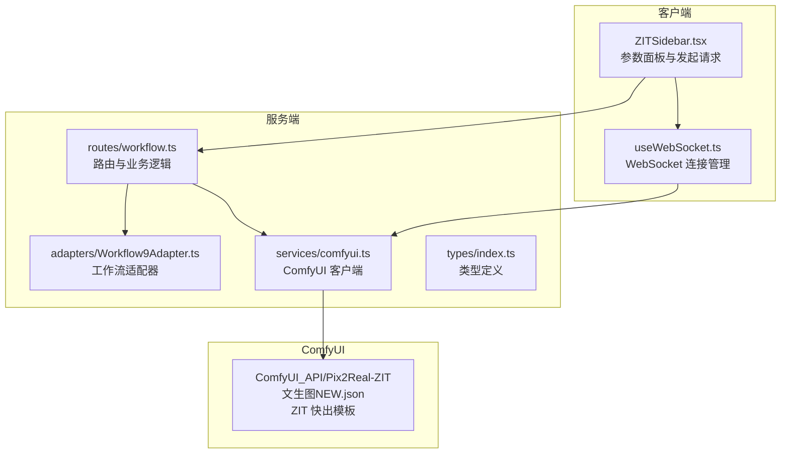
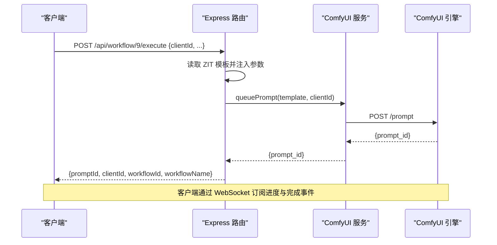
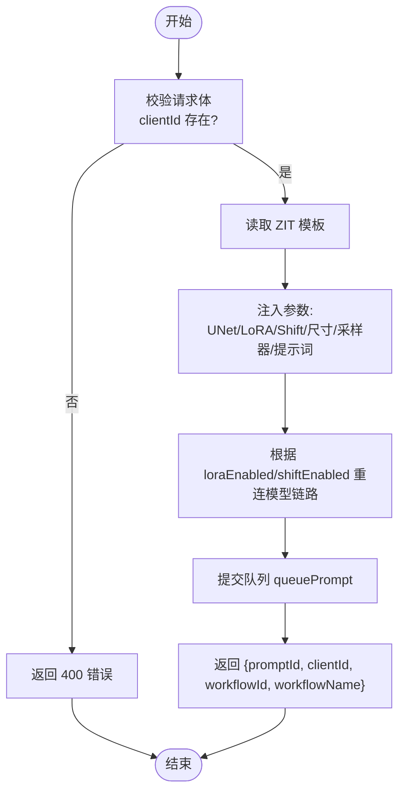
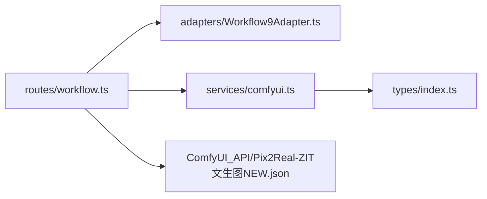

# ZIT快出 API

<cite>
**本文档引用的文件**
- [Workflow9Adapter.ts](file://server/src/adapters/Workflow9Adapter.ts)
- [Pix2Real-ZIT文生图NEW.json](file://ComfyUI_API/Pix2Real-ZIT文生图NEW.json)
- [workflow.ts](file://server/src/routes/workflow.ts)
- [comfyui.ts](file://server/src/services/comfyui.ts)
- [ZITSidebar.tsx](file://client/src/components/ZITSidebar.tsx)
- [index.ts](file://server/src/types/index.ts)
- [BaseAdapter.ts](file://server/src/adapters/BaseAdapter.ts)
- [useWorkflowStore.ts](file://client/src/hooks/useWorkflowStore.ts)
- [README.md](file://README.md)
</cite>

## 目录
1. [简介](#简介)
2. [项目结构](#项目结构)
3. [核心组件](#核心组件)
4. [架构总览](#架构总览)
5. [详细组件分析](#详细组件分析)
6. [依赖关系分析](#依赖关系分析)
7. [性能考虑](#性能考虑)
8. [故障排除指南](#故障排除指南)
9. [结论](#结论)
10. [附录](#附录)

## 简介
本文件为 ZIT快出（工作流 9）的完整 API 文档，聚焦于“快速图像生成”的接口规范与实现细节。ZIT快出通过专用路由 POST /api/workflow/9/execute，结合 ComfyUI 的 Z-image 模型链路，实现极简提示词驱动的高质量图像生成。该功能不依赖通用适配器模式，而是直接读取预置模板并按请求参数进行节点重连与参数注入，从而在保证灵活性的同时最大化生成速度。

## 项目结构
后端采用 Express 路由 + 服务层封装，前端通过 React 组件与 WebSocket 实时接收进度事件。ZIT快出位于工作流 9，其模板位于 ComfyUI_API 目录下，后端路由负责解析请求、注入参数并提交到 ComfyUI 队列。

**图表来源**
- [workflow.ts:181-261](file://server/src/routes/workflow.ts#L181-L261)
- [Workflow9Adapter.ts:1-14](file://server/src/adapters/Workflow9Adapter.ts#L1-L14)
- [comfyui.ts:1-285](file://server/src/services/comfyui.ts#L1-L285)
- [ZITSidebar.tsx:107-156](file://client/src/components/ZITSidebar.tsx#L107-L156)

**章节来源**
- [README.md:41-79](file://README.md#L41-L79)
- [workflow.ts:181-261](file://server/src/routes/workflow.ts#L181-L261)

## 核心组件
- 工作流适配器：声明工作流 9 的元信息（名称、是否需要提示词等），并提供 buildPrompt 抛错以强制使用专用路由。
- 路由处理器：解析 JSON 请求体，读取模板，按参数重连线程与节点，提交队列并返回任务信息。
- ComfyUI 服务：封装上传、入队、历史查询、系统状态、WebSocket 连接等底层操作。
- 前端组件：提供参数面板、批量生成、提示词助手、实时进度展示与输出目录打开能力。

**章节来源**
- [Workflow9Adapter.ts:3-13](file://server/src/adapters/Workflow9Adapter.ts#L3-L13)
- [workflow.ts:181-261](file://server/src/routes/workflow.ts#L181-L261)
- [comfyui.ts:1-285](file://server/src/services/comfyui.ts#L1-L285)
- [ZITSidebar.tsx:107-156](file://client/src/components/ZITSidebar.tsx#L107-L156)

## 架构总览
ZIT快出的调用链路如下：
1. 客户端发送 POST /api/workflow/9/execute，携带 JSON 参数。
2. 服务端读取 ZIT 模板，根据参数重连线程（UNet、LoRA、AuraFlow Shift）。
3. 将模板与 clientId 提交至 ComfyUI 队列，返回 prompt_id。
4. 客户端通过 WebSocket 订阅进度与完成事件，UI 更新任务状态与输出列表。

**图表来源**
- [workflow.ts:181-261](file://server/src/routes/workflow.ts#L181-L261)
- [comfyui.ts:47-60](file://server/src/services/comfyui.ts#L47-L60)

## 详细组件分析

### 接口规范：POST /api/workflow/9/execute
- 方法：POST
- 路径：/api/workflow/9/execute
- 内容类型：application/json
- 请求体字段（均为必填或可选，视具体用途而定）：
  - clientId: string（必需）
  - unetModel: string（必需；从 /api/workflow/models/unets 获取）
  - loraModel: string（必需；从 /api/workflow/models/loras 获取）
  - loraEnabled: boolean（可选；默认 false）
  - shiftEnabled: boolean（可选；默认 false）
  - shift: number（可选；默认 3）
  - prompt: string（可选；为空则保留模板默认提示词）
  - width: number（可选；默认模板尺寸）
  - height: number（可选；默认模板尺寸）
  - steps: number（可选；默认模板 steps）
  - cfg: number（可选；默认模板 cfg）
  - sampler: string（可选；默认模板 sampler）
  - scheduler: string（可选；默认模板 scheduler）
  - name: string（可选；作为输出文件名前缀）

- 响应体字段：
  - promptId: string
  - clientId: string
  - workflowId: number（固定为 9）
  - workflowName: string（固定为 "ZIT快出"）

- 错误处理：
  - 缺少 clientId：400
  - 服务器内部错误：500
  - ComfyUI 入队失败：抛出错误（状态码取决于上游）

- 并发与批处理：
  - 该路由单次仅处理一个请求体，不支持批量数组。
  - 如需批量，可在客户端循环调用该接口。

**章节来源**
- [workflow.ts:181-261](file://server/src/routes/workflow.ts#L181-L261)
- [comfyui.ts:47-60](file://server/src/services/comfyui.ts#L47-L60)

### 参数配置与模板重连机制
- UNet 模型注入：将节点 25 的 unet_name 替换为请求中的 unetModel。
- LoRA 模型注入：将节点 36 的 lora_name 替换为请求中的 loraModel。
- AuraFlow Shift 注入：将节点 45 的 shift 设置为请求中的 shift（默认 3）。
- 图像尺寸：节点 7 的 width/height。
- 采样器与 CFG：节点 4 的 steps/cfg/sampler_name/scheduler。
- 提示词：节点 5 的 text。
- 模型链路重连：
  - 当 loraEnabled=false 且 shiftEnabled=true：跳过 LoRA，模型链为 #25 → #45 → #4。
  - 当 loraEnabled=false 且 shiftEnabled=false：跳过 LoRA 与 Shift，模型链为 #25 → #4。
  - 当 loraEnabled=true 且 shiftEnabled=true：默认链路 #25 → #36 → #45 → #4。
  - 当 loraEnabled=true 且 shiftEnabled=false：链路 #25 → #36 → #4。

- 输出文件名前缀：节点 24 的 filename_prefix。

**章节来源**
- [workflow.ts:206-247](file://server/src/routes/workflow.ts#L206-L247)
- [Pix2Real-ZIT文生图NEW.json:1-172](file://ComfyUI_API/Pix2Real-ZIT文生图NEW.json#L1-L172)

### 与 ComfyUI 工作流的集成方式
- 模板来源：/api/workflow/9/execute 读取 Pix2Real-ZIT文生图NEW.json。
- 模板节点映射：
  - 4: KSampler（采样器）
  - 5: CLIPTextEncode（正向提示词）
  - 7: EmptyLatentImage（尺寸）
  - 25: UNETLoader（UNet 模型）
  - 26: CLIPLoader（CLIP 模型）
  - 27: VAELoader（VAE 模型）
  - 36: LoraLoader（LoRA 模型）
  - 38: ConditioningZeroOut（负向提示词）
  - 44: RepeatLatentBatch（批量复制）
  - 45: ModelSamplingAuraFlow（AuraFlow 采样算法与 Shift）
  - 24: SaveImage（保存图像）
- 重连策略：根据 loraEnabled 与 shiftEnabled 动态调整 clip/model 输入连接，避免不必要的 LoRA 或 Shift。

**章节来源**
- [workflow.ts:206-247](file://server/src/routes/workflow.ts#L206-L247)
- [Pix2Real-ZIT文生图NEW.json:1-172](file://ComfyUI_API/Pix2Real-ZIT文生图NEW.json#L1-L172)

### 前端调用示例与最佳实践
- 单次调用（推荐）：
  - 发送 POST /api/workflow/9/execute，请求体包含 clientId、unetModel、loraModel、prompt、width、height、steps、cfg、sampler、scheduler、name 等。
  - 成功后记录 promptId，并通过 WebSocket 订阅进度与完成事件。
- 批量调用：
  - 在客户端循环多次调用该接口，每次传入不同的 name 或 prompt。
  - 注意控制并发速率，避免 ComfyUI 队列拥塞。
- 最佳实践：
  - 使用 /api/workflow/models/unets 与 /api/workflow/models/loras 获取可用模型列表。
  - 合理设置 steps 与 cfg，平衡质量与速度。
  - 启用 shiftEnabled 可提升采样稳定性，但会增加计算开销。
  - 使用 name 字段为输出文件命名，便于后续检索。

**章节来源**
- [ZITSidebar.tsx:107-156](file://client/src/components/ZITSidebar.tsx#L107-L156)
- [workflow.ts:181-261](file://server/src/routes/workflow.ts#L181-L261)

### 数据流与处理流程

**图表来源**
- [workflow.ts:181-261](file://server/src/routes/workflow.ts#L181-L261)

## 依赖关系分析
- 路由依赖：
  - 读取模板文件路径常量（/api/workflow/9/execute）。
  - 调用服务层 queuePrompt 提交任务。
- 服务层依赖：
  - ComfyUI HTTP API（上传、入队、历史、系统状态、队列优先级）。
  - WebSocket 通道用于进度与完成事件。
- 类型定义：
  - QueueResponse、HistoryEntry、OutputFile 等统一了数据结构。

**图表来源**
- [workflow.ts:181-261](file://server/src/routes/workflow.ts#L181-L261)
- [comfyui.ts:1-285](file://server/src/services/comfyui.ts#L1-L285)
- [index.ts:1-52](file://server/src/types/index.ts#L1-L52)

**章节来源**
- [workflow.ts:181-261](file://server/src/routes/workflow.ts#L181-L261)
- [comfyui.ts:1-285](file://server/src/services/comfyui.ts#L1-L285)
- [index.ts:1-52](file://server/src/types/index.ts#L1-L52)

## 性能考虑
- 采样器与调度器选择：
  - euler/euler_ancestral 等适合快速生成；dpm_2m 等收敛更快但耗时更长。
  - scheduler 可选 simple/exponential/ddim_uniform/beta/normal，默认 simple。
- 步数与 CFG：
  - steps=9、cfg=1 的组合在 ZIT 模板中已优化，适合快速出图；可根据需求微调。
- Shift（AuraFlow）：
  - 启用 shiftEnabled 可提升稳定性，但会增加一次采样阶段的计算。
- 批量与并发：
  - 建议限制并发数量，避免显存/内存压力过大。
  - 使用 /api/workflow/system-stats 监控 VRAM/内存使用率。
- 模型链路：
  - 关闭不需要的 LoRA 或 Shift 可减少节点计算，提高吞吐。

[本节为通用性能建议，无需特定文件来源]

## 故障排除指南
- 常见错误与排查：
  - 400 缺少 clientId：检查客户端是否正确生成并传递 clientId。
  - 500 服务器错误：查看服务端日志，确认 ComfyUI 是否可达、模板是否存在。
  - 入队失败：检查 ComfyUI 返回的状态码与消息，必要时清理队列或释放内存。
  - WebSocket 连接异常：确认浏览器与服务端 WebSocket 地址一致，网络无阻断。
- 资源监控：
  - 使用 /api/workflow/system-stats 获取当前 VRAM/内存占用，避免 OOM。
  - 使用 /api/workflow/release-memory 释放 GPU/RAM。
- 超时与重试：
  - ComfyUI 历史查询与提示词反推存在超时（例如提示词反推最长 180 秒），请合理设置等待时间。
  - 对于长时间任务，建议在客户端实现重试与进度轮询。

**章节来源**
- [workflow.ts:532-559](file://server/src/routes/workflow.ts#L532-L559)
- [comfyui.ts:106-125](file://server/src/services/comfyui.ts#L106-L125)

## 结论
ZIT快出 API 通过专用路由与模板重连机制，在保证灵活性的同时实现了极高的执行效率。其核心优势在于：
- 无需通用适配器，直接读取模板并注入参数；
- 支持 LoRA 与 AuraFlow Shift 的动态开关，兼顾速度与质量；
- 前后端协同，提供实时进度与输出管理。

建议在生产环境中配合资源监控与合理的并发控制，以获得稳定且高效的图像生成体验。

[本节为总结性内容，无需特定文件来源]

## 附录

### API 定义表
- 端点：POST /api/workflow/9/execute
- 请求体字段：
  - clientId: string（必需）
  - unetModel: string（必需）
  - loraModel: string（必需）
  - loraEnabled: boolean（可选）
  - shiftEnabled: boolean（可选）
  - shift: number（可选）
  - prompt: string（可选）
  - width: number（可选）
  - height: number（可选）
  - steps: number（可选）
  - cfg: number（可选）
  - sampler: string（可选）
  - scheduler: string（可选）
  - name: string（可选）
- 响应体字段：
  - promptId: string
  - clientId: string
  - workflowId: number（固定为 9）
  - workflowName: string（固定为 "ZIT快出"）

**章节来源**
- [workflow.ts:181-261](file://server/src/routes/workflow.ts#L181-L261)

### 模板节点参考
- 4: KSampler（采样器）
- 5: CLIPTextEncode（正向提示词）
- 7: EmptyLatentImage（尺寸）
- 25: UNETLoader（UNet 模型）
- 26: CLIPLoader（CLIP 模型）
- 27: VAELoader（VAE 模型）
- 36: LoraLoader（LoRA 模型）
- 38: ConditioningZeroOut（负向提示词）
- 44: RepeatLatentBatch（批量复制）
- 45: ModelSamplingAuraFlow（AuraFlow 采样算法与 Shift）
- 24: SaveImage（保存图像）

**章节来源**
- [Pix2Real-ZIT文生图NEW.json:1-172](file://ComfyUI_API/Pix2Real-ZIT文生图NEW.json#L1-L172)