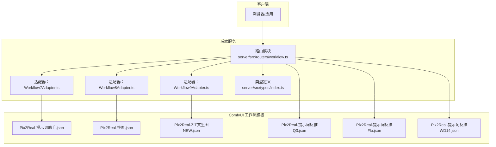
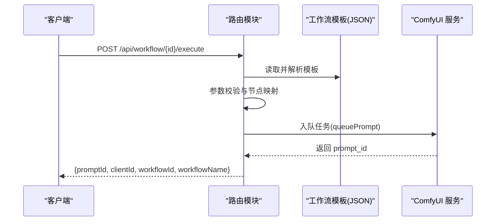
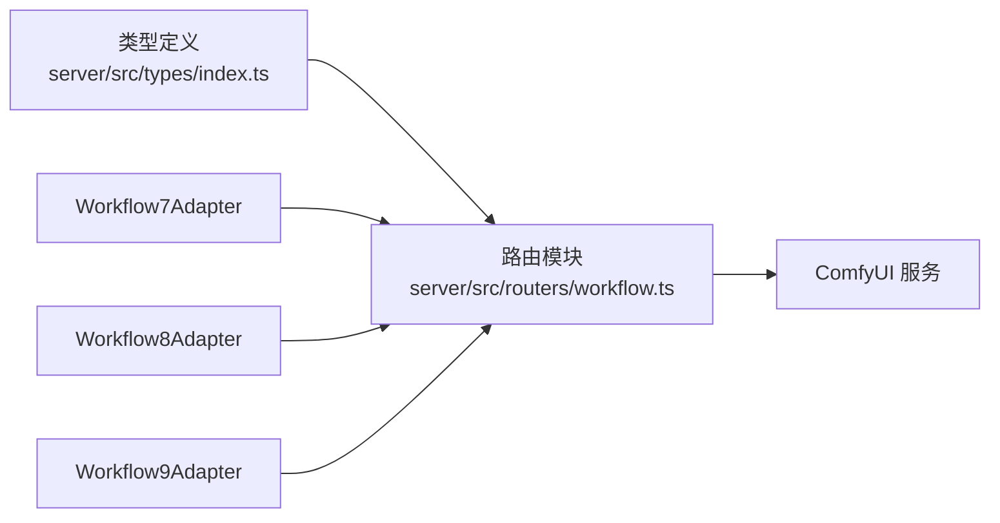

# 专业功能 API

<cite>
**本文引用的文件**
- [server/src/adapters/Workflow7Adapter.ts](file://server/src/adapters/Workflow7Adapter.ts)
- [server/src/adapters/Workflow8Adapter.ts](file://server/src/adapters/Workflow8Adapter.ts)
- [server/src/adapters/Workflow9Adapter.ts](file://server/src/adapters/Workflow9Adapter.ts)
- [server/src/routers/workflow.ts](file://server/src/routers/workflow.ts)
- [server/src/types/index.ts](file://server/src/types/index.ts)
- [ComfyUI_API/Pix2Real-提示词助手.json](file://ComfyUI_API/Pix2Real-提示词助手.json)
- [docs/提示词助理开发需求/Pix2Real-提示词助手.json](file://docs/提示词助理开发需求/Pix2Real-提示词助手.json)
- [docs/提示词助理开发需求/SystemPrompt.txt](file://docs/提示词助理开发需求/SystemPrompt.txt)
- [ComfyUI_API/Pix2Real-提示词反推Q3.json](file://ComfyUI_API/Pix2Real-提示词反推Q3.json)
- [ComfyUI_API/Pix2Real-提示词反推Flo.json](file://ComfyUI_API/Pix2Real-提示词反推Flo.json)
- [ComfyUI_API/Pix2Real-提示词反推WD14.json](file://ComfyUI_API/Pix2Real-提示词反推WD14.json)
- [README.md](file://README.md)
</cite>

## 目录
1. [简介](#简介)
2. [项目结构](#项目结构)
3. [核心组件](#核心组件)
4. [架构总览](#架构总览)
5. [详细组件分析](#详细组件分析)
6. [依赖关系分析](#依赖关系分析)
7. [性能考量](#性能考量)
8. [故障排查指南](#故障排查指南)
9. [结论](#结论)
10. [附录](#附录)

## 简介
本文件面向“专业功能 API”，聚焦以下四个工作流与功能：
- 快速出图（Workflow 7）
- 黑兽换脸（Workflow 8）
- ZIT快出（Workflow 9）
- 提示词反推（基于多模型）

文档提供每个功能的完整接口规范（请求参数、响应格式、特殊处理逻辑）、使用场景、参数配置、与其他工作流的区别、调用示例与最佳实践，以及错误处理、性能考虑与使用限制。

## 项目结构
后端采用 Express + TypeScript，通过适配器模式加载 ComfyUI 工作流模板，按需替换节点参数后入队执行。前端通过 WebSocket 实时接收进度事件，支持一键打开输出目录、批量处理、队列优先级调整等。

图表来源
- [server/src/routers/workflow.ts](file://server/src/routers/workflow.ts)
- [server/src/adapters/Workflow7Adapter.ts](file://server/src/adapters/Workflow7Adapter.ts)
- [server/src/adapters/Workflow8Adapter.ts](file://server/src/adapters/Workflow8Adapter.ts)
- [server/src/adapters/Workflow9Adapter.ts](file://server/src/adapters/Workflow9Adapter.ts)
- [ComfyUI_API/Pix2Real-提示词助手.json](file://ComfyUI_API/Pix2Real-提示词助手.json)
- [ComfyUI_API/Pix2Real-提示词反推Q3.json](file://ComfyUI_API/Pix2Real-提示词反推Q3.json)
- [ComfyUI_API/Pix2Real-提示词反推Flo.json](file://ComfyUI_API/Pix2Real-提示词反推Flo.json)
- [ComfyUI_API/Pix2Real-提示词反推WD14.json](file://ComfyUI_API/Pix2Real-提示词反推WD14.json)

章节来源
- [README.md: 项目结构与架构要点:41-79](file://README.md#L41-L79)

## 核心组件
- 路由与执行器：集中于路由模块，负责解析请求、上传文件、拼接模板、入队 ComfyUI 并返回任务标识。
- 适配器：为特定工作流提供统一接口，封装模板读取与节点参数映射。
- 类型系统：定义工作流适配器、进度事件、完成事件、错误事件、输出文件、队列响应与历史条目等数据结构。
- 提示词反推：支持 Qwen3VL、Florence-2、WD-14 三种模型，异步轮询 ComfyUI 历史以获取生成文本。

章节来源
- [server/src/routers/workflow.ts: 路由与执行流程:1-862](file://server/src/routers/workflow.ts#L1-L862)
- [server/src/adapters/Workflow7Adapter.ts: Workflow7 适配器:1-14](file://server/src/adapters/Workflow7Adapter.ts#L1-L14)
- [server/src/adapters/Workflow8Adapter.ts: Workflow8 适配器:1-14](file://server/src/adapters/Workflow8Adapter.ts#L1-L14)
- [server/src/adapters/Workflow9Adapter.ts: Workflow9 适配器:1-14](file://server/src/adapters/Workflow9Adapter.ts#L1-L14)
- [server/src/types/index.ts: 类型定义:1-52](file://server/src/types/index.ts#L1-L52)

## 架构总览
后端通过路由层接收请求，根据工作流 ID 选择对应模板与参数映射策略，将 ComfyUI 任务入队并返回 prompt_id。前端通过 WebSocket 订阅进度事件，完成后可从输出目录或历史记录中获取结果。

图表来源
- [server/src/routers/workflow.ts: 通用执行流程:407-455](file://server/src/routers/workflow.ts#L407-L455)

## 详细组件分析

### 快速出图（Workflow 7）
- 功能定位：纯文本到图像的快速生成，适用于需要直接输入提示词与参数的场景。
- 请求方式：POST /api/workflow/7/execute
- 内容类型：application/json
- 请求体字段
  - clientId: 字符串，必填
  - model: 字符串，模型名称
  - prompt: 字符串，提示词
  - width: 数值，图像宽度
  - height: 数值，图像高度
  - steps: 数值，采样步数
  - cfg: 数值，CFG 分数
  - sampler: 字符串，采样器名称
  - scheduler: 字符串，调度器名称
  - name: 字符串，可选，输出文件名前缀
- 响应字段
  - promptId: 字符串，任务标识
  - clientId: 字符串
  - workflowId: 数值，固定为 7
  - workflowName: 字符串，固定为“快速出图”
- 特殊处理
  - 该工作流不使用通用适配器的 buildPrompt，而是直接读取二次元生成模板并映射参数。
  - 若传入 prompt，则覆盖默认提示词；否则保留模板默认值。
  - 输出目录为“7-快速出图”。
- 使用场景
  - 快速验证提示词效果
  - 批量生成同构风格图像
- 与其他工作流区别
  - 不需要上传输入图像，仅依赖文本参数。
  - 与 Workflow 9 的差异在于：Workflow 7 仅使用基础模型，Workflow 9 支持 UNet + LoRA + 可选 AuraFlow shift。
- 错误处理
  - 缺少 clientId 或其他参数时返回 400。
  - 服务器内部错误返回 500。
- 性能与限制
  - 采样步数与 CFG 会显著影响生成时间与质量。
  - 建议合理设置分辨率，避免过高导致显存压力。
- 调用示例（路径参考）
  - [请求体字段与参数映射:94-149](file://server/src/routers/workflow.ts#L94-L149)
  - [模板节点映射（模型、尺寸、采样、种子、提示词、命名）:115-135](file://server/src/routers/workflow.ts#L115-L135)

章节来源
- [server/src/adapters/Workflow7Adapter.ts: 适配器定义:1-14](file://server/src/adapters/Workflow7Adapter.ts#L1-L14)
- [server/src/routers/workflow.ts: Workflow 7 执行逻辑:94-149](file://server/src/routers/workflow.ts#L94-L149)

### 黑兽换脸（Workflow 8）
- 功能定位：将目标图像中的面部替换为另一张人脸图像，适合换脸与角色复用。
- 请求方式：POST /api/workflow/8/execute
- 多部分表单字段
  - targetImage: 图像文件，必填
  - faceImage: 图像文件，必填
  - clientId: 字符串，必填
- 响应字段
  - promptId: 字符串，任务标识
  - clientId: 字符串
  - workflowId: 数值，固定为 8
  - workflowName: 字符串，固定为“黑兽换脸”
- 特殊处理
  - 同时上传目标图像与人脸图像，并映射到模板节点。
  - 生成随机种子，确保每次结果不同。
  - 输出目录为“8-黑兽换脸”。
- 使用场景
  - 角色换脸、表情复用、风格迁移
- 与其他工作流区别
  - 输入为两张图像，属于“图像到图像”的换脸类工作流。
  - 与 Workflow 0 的“二次元转真人”不同，后者是风格转换而非换脸。
- 错误处理
  - 缺少任一文件或 clientId 返回 400。
  - 服务器内部错误返回 500。
- 性能与限制
  - 换脸算法对人脸检测与对齐敏感，建议提供清晰正面人脸。
- 调用示例（路径参考）
  - [多文件上传与模板映射:263-310](file://server/src/routers/workflow.ts#L263-L310)
  - [模板节点映射（目标图、人脸图、种子）:292-297](file://server/src/routers/workflow.ts#L292-L297)

章节来源
- [server/src/adapters/Workflow8Adapter.ts: 适配器定义:1-14](file://server/src/adapters/Workflow8Adapter.ts#L1-L14)
- [server/src/routers/workflow.ts: Workflow 8 执行逻辑:263-310](file://server/src/routers/workflow.ts#L263-L310)

### ZIT快出（Workflow 9）
- 功能定位：基于 UNet + LoRA 的快速生成，支持可选的 AuraFlow shift，适合追求特定风格与精度的场景。
- 请求方式：POST /api/workflow/9/execute
- 内容类型：application/json
- 请求体字段
  - clientId: 字符串，必填
  - unetModel: 字符串，UNet 模型名称
  - loraModel: 字符串，LoRA 模型名称
  - loraEnabled: 布尔，是否启用 LoRA
  - shiftEnabled: 布尔，是否启用 AuraFlow shift
  - shift: 数值，可选，AuraFlow shift 值，默认 3
  - prompt: 字符串，提示词
  - width: 数值，图像宽度
  - height: 数值，图像高度
  - steps: 数值，采样步数
  - cfg: 数值，CFG 分数
  - sampler: 字符串，采样器名称
  - scheduler: 字符串，调度器名称
  - name: 字符串，可选，输出文件名前缀
- 响应字段
  - promptId: 字符串，任务标识
  - clientId: 字符串
  - workflowId: 数值，固定为 9
  - workflowName: 字符串，固定为“ZIT快出”
- 特殊处理
  - 根据 loraEnabled 与 shiftEnabled 动态重连模型链路：
    - 关闭 LoRA：提示词 CLIP 直接连接基础模型，可选启用 shift。
    - 启用 LoRA：LoRA 模型接入，CLIP 输出经 LoRA 后进入 UNet。
  - 未启用 LoRA 且启用 shift：UNet → Shift → UNet 采样器链路。
  - 未启用 LoRA 且未启用 shift：UNet → UNet 采样器链路。
  - 启用 LoRA 且启用 shift：默认链路（UNet → LoRA → Shift → UNet 采样器）。
  - 输出目录为“9-ZIT快出”。
- 使用场景
  - 需要精细风格控制与特定模型组合的高质量生成。
- 与其他工作流区别
  - 与 Workflow 7 的区别：Workflow 9 引入 UNet/LoRA/Shift，参数更复杂但可控性更强。
- 错误处理
  - 缺少 clientId 或其他参数时返回 400。
  - 服务器内部错误返回 500。
- 性能与限制
  - LoRA 与 Shift 会增加计算开销，建议在显存允许范围内调整分辨率与步数。
- 调用示例（路径参考）
  - [请求体字段与参数映射:181-261](file://server/src/routers/workflow.ts#L181-L261)
  - [模型链路重连逻辑:227-243](file://server/src/routers/workflow.ts#L227-L243)

章节来源
- [server/src/adapters/Workflow9Adapter.ts: 适配器定义:1-14](file://server/src/adapters/Workflow9Adapter.ts#L1-L14)
- [server/src/routers/workflow.ts: Workflow 9 执行逻辑:181-261](file://server/src/routers/workflow.ts#L181-L261)

### 提示词反推
- 功能定位：基于图像生成对应的提示词文本，支持 Qwen3VL、Florence-2、WD-14 三类模型。
- 请求方式：POST /api/workflow/reverse-prompt
- 查询参数
  - model: 字符串，可选，默认 Qwen3VL；可选值：Qwen3VL、Florence、WD-14
- 单文件上传
  - image: 图像文件，必填
- 响应字段
  - text: 字符串，生成的提示词文本
- 特殊处理
  - 根据 model 选择对应模板与保存节点。
  - 将 easy saveText 的输出路径临时指向本地临时目录，完成后读取并清理。
  - 轮询 ComfyUI 历史直到完成（最长等待约 180 秒）。
  - 输出目录为 rp_temp。
- 使用场景
  - 从现有图像提取高质量提示词，用于回流到其他工作流。
- 与其他工作流区别
  - 属于“图像到文本”的推理类功能，不生成图像。
- 错误处理
  - 缺少图像或未知模型返回 400。
  - 超时返回 504。
  - ComfyUI 未返回文本返回 500。
- 性能与限制
  - LLM 推理耗时较长，建议在后台任务中使用。
- 调用示例（路径参考）
  - [模型配置与模板映射:659-672](file://server/src/routers/workflow.ts#L659-L672)
  - [反推执行与轮询逻辑:674-744](file://server/src/routers/workflow.ts#L674-L744)

章节来源
- [server/src/routers/workflow.ts: 提示词反推实现:659-744](file://server/src/routers/workflow.ts#L659-L744)
- [ComfyUI_API/Pix2Real-提示词反推Q3.json: Qwen3VL 模板:1-106](file://ComfyUI_API/Pix2Real-提示词反推Q3.json#L1-L106)
- [ComfyUI_API/Pix2Real-提示词反推Flo.json: Florence-2 模板:1-77](file://ComfyUI_API/Pix2Real-提示词反推Flo.json#L1-L77)
- [ComfyUI_API/Pix2Real-提示词反推WD14.json: WD-14 模板:1-58](file://ComfyUI_API/Pix2Real-提示词反推WD14.json#L1-L58)

### 提示词助理（Workflow 7 的专用路由）
- 功能定位：基于系统提示词与用户提示词生成文案，支持多种提示词工程模式（标签互转、变体、扩写、续拍、分镜）。
- 请求方式：POST /api/workflow/prompt-assistant
- 内容类型：application/json
- 请求体字段
  - systemPrompt: 字符串，系统提示词（决定模式与规则）
  - userPrompt: 字符串，用户输入
- 响应字段
  - text: 字符串，生成的文案
- 特殊处理
  - 读取提示词助手模板，注入 systemPrompt 与 custom_prompt。
  - 将 easy saveText 输出路径临时指向本地临时目录，完成后读取并清理。
  - 轮询 ComfyUI 历史直到完成（最长等待约 180 秒）。
  - 输出目录为 pa_temp。
- 使用场景
  - 文案创作、提示词工程、创意辅助。
- 与其他工作流区别
  - 与 Workflow 7 的“快速出图”不同，提示词助理专注于文本生成。
- 错误处理
  - 缺少必要字段返回 400。
  - 超时返回 504。
  - ComfyUI 未返回文本返回 500。
- 性能与限制
  - LLM 推理耗时较长，建议在后台任务中使用。
- 调用示例（路径参考）
  - [提示词助理执行与轮询逻辑:746-800](file://server/src/routers/workflow.ts#L746-L800)
  - [模板结构与节点映射:1-106](file://ComfyUI_API/Pix2Real-提示词助手.json#L1-L106)
  - [开发需求中的模板与系统提示词:1-106](file://docs/提示词助理开发需求/Pix2Real-提示词助手.json#L1-L106)
  - [系统提示词规则说明:1-153](file://docs/提示词助理开发需求/SystemPrompt.txt#L1-L153)

章节来源
- [server/src/routers/workflow.ts: 提示词助理实现:746-800](file://server/src/routers/workflow.ts#L746-L800)
- [ComfyUI_API/Pix2Real-提示词助手.json: 模板:1-106](file://ComfyUI_API/Pix2Real-提示词助手.json#L1-L106)
- [docs/提示词助理开发需求/Pix2Real-提示词助手.json: 开发需求模板:1-106](file://docs/提示词助理开发需求/Pix2Real-提示词助手.json#L1-L106)
- [docs/提示词助理开发需求/SystemPrompt.txt: 系统提示词规则:1-153](file://docs/提示词助理开发需求/SystemPrompt.txt#L1-L153)

## 依赖关系分析
- 路由模块依赖适配器集合与 ComfyUI 服务层，负责参数校验、模板读取、节点映射与队列入队。
- 适配器仅暴露统一接口，降低路由层复杂度。
- 类型系统贯穿前后端，保证事件与响应结构一致。

图表来源
- [server/src/types/index.ts: 类型定义:1-52](file://server/src/types/index.ts#L1-L52)
- [server/src/routers/workflow.ts: 路由模块:1-862](file://server/src/routers/workflow.ts#L1-L862)
- [server/src/adapters/Workflow7Adapter.ts: 适配器:1-14](file://server/src/adapters/Workflow7Adapter.ts#L1-L14)
- [server/src/adapters/Workflow8Adapter.ts: 适配器:1-14](file://server/src/adapters/Workflow8Adapter.ts#L1-L14)
- [server/src/adapters/Workflow9Adapter.ts: 适配器:1-14](file://server/src/adapters/Workflow9Adapter.ts#L1-L14)

## 性能考量
- 显存与内存
  - 换脸与反推类任务通常占用较高显存，建议在任务间释放内存（见“释放内存”路由）。
  - 可通过降低分辨率、减少采样步数、关闭 LoRA/Shift 来缓解显存压力。
- 并发与队列
  - 后端支持队列优先级调整与取消排队，便于管理长耗时任务。
- I/O 与轮询
  - 提示词反推与提示词助理采用轮询历史的方式获取结果，建议在前端使用 WebSocket 订阅进度事件以提升交互体验。
- 最佳实践
  - 在调用前先查询系统统计（系统统计路由），评估当前资源状态。
  - 对大体积图像与批量任务，建议拆分批次并设置合理的超时阈值。

## 故障排查指南
- 常见错误码
  - 400：缺少必要参数（如 clientId、文件、模型等）。
  - 500：服务器内部错误。
  - 502：ComfyUI 不可用。
  - 504：提示词反推/提示词助理超时。
- 排查步骤
  - 确认 ComfyUI 服务运行正常（端口 8188）。
  - 检查 clientId 是否正确传递。
  - 对于提示词反推/提示词助理，确认临时目录存在且可写。
  - 使用系统统计路由检查 VRAM/RAM 使用情况。
- 相关实现参考
  - [系统统计路由:532-540](file://server/src/routers/workflow.ts#L532-L540)
  - [释放内存路由:542-559](file://server/src/routers/workflow.ts#L542-L559)
  - [取消队列路由:522-530](file://server/src/routers/workflow.ts#L522-L530)
  - [队列优先级路由:571-579](file://server/src/routers/workflow.ts#L571-L579)

章节来源
- [server/src/routers/workflow.ts: 错误处理与系统路由:522-580](file://server/src/routers/workflow.ts#L522-L580)

## 结论
本文档系统梳理了四个专业功能 API 的接口规范、参数配置、特殊处理逻辑与最佳实践。通过统一的路由与适配器模式，后端实现了对多种工作流的灵活扩展；结合提示词反推与提示词助理，形成了从图像到文本再到图像的完整创作闭环。建议在实际使用中结合资源监控与队列管理，确保稳定高效的生产体验。

## 附录
- 术语
  - prompt_id：ComfyUI 中的任务标识，用于历史查询与进度订阅。
  - clientId：客户端标识，用于区分不同浏览器会话。
  - 采样器/调度器：控制扩散过程的采样策略与噪声调度。
  - LoRA：低秩适应微调模型，用于风格与细节增强。
  - Shift：AuraFlow 的可学习偏移，用于提升细节与稳定性。
- 参考
  - [README.md: 项目结构与架构要点:41-79](file://README.md#L41-L79)