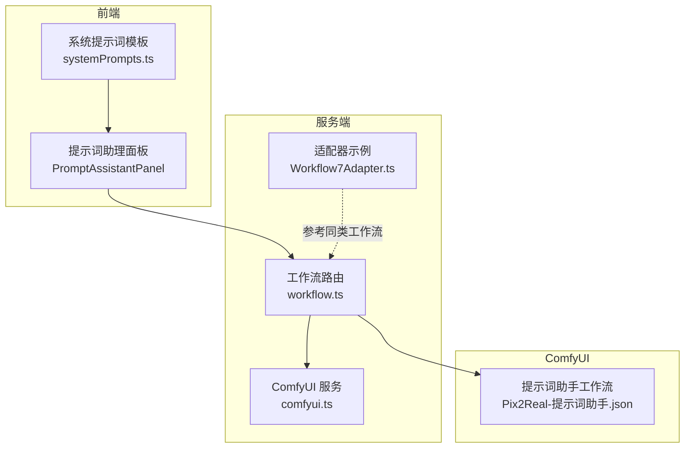
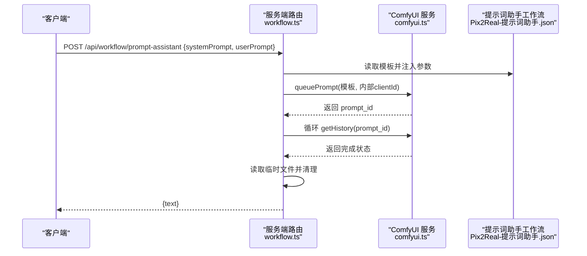
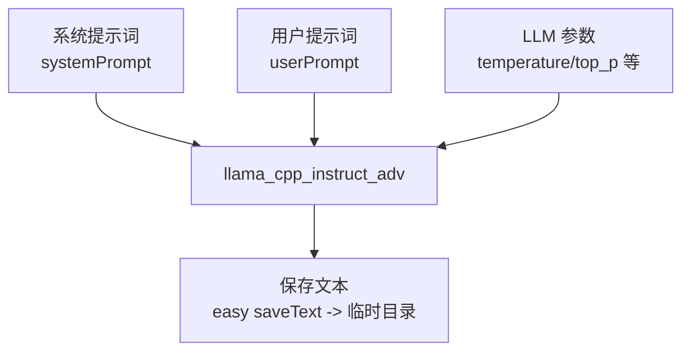
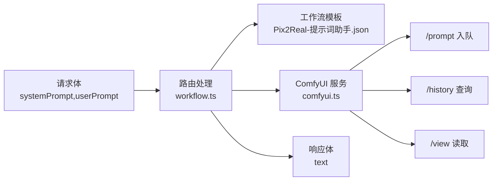

# 提示词助手 API

<cite>
**本文引用的文件**
- [server/src/routes/workflow.ts](file://server/src/routes/workflow.ts)
- [server/src/services/comfyui.ts](file://server/src/services/comfyui.ts)
- [server/src/adapters/Workflow7Adapter.ts](file://server/src/adapters/Workflow7Adapter.ts)
- [ComfyUI_API/Pix2Real-提示词助手.json](file://ComfyUI_API/Pix2Real-提示词助手.json)
- [client/src/components/PromptAssistantPanel.tsx](file://client/src/components/PromptAssistantPanel.tsx)
- [client/src/components/prompt-assistant/systemPrompts.ts](file://client/src/components/prompt-assistant/systemPrompts.ts)
- [server/src/types/index.ts](file://server/src/types/index.ts)
</cite>

## 目录
1. [简介](#简介)
2. [项目结构](#项目结构)
3. [核心组件](#核心组件)
4. [架构总览](#架构总览)
5. [详细组件分析](#详细组件分析)
6. [依赖关系分析](#依赖关系分析)
7. [性能考量](#性能考量)
8. [故障排查指南](#故障排查指南)
9. [结论](#结论)
10. [附录](#附录)

## 简介
本文件为“提示词助手 API”的权威技术文档，面向需要集成或使用提示词生成能力的开发者与产品团队。文档覆盖以下要点：
- 明确接口规范：POST /api/workflow/prompt-assistant 的请求与响应格式
- 功能说明：基于 ComfyUI 工作流的智能提示词生成，支持多种模式（标签转换、变体生成、按需扩写、后续场景、分镜生成等）
- 输入参数类型与约束
- 与 ComfyUI 工作流的集成方式与数据流转
- 错误处理机制与超时策略
- 性能优化建议与最佳实践
- 使用限制与注意事项

## 项目结构
提示词助手功能由服务端路由、ComfyUI 服务适配层与前端交互面板三部分组成：
- 服务端路由负责接收请求、拼装工作流模板、调用 ComfyUI 并轮询结果
- ComfyUI 服务封装上传、入队、历史查询、系统状态等底层操作
- 前端面板提供多模式 UI，配合系统提示词模板驱动后端生成

图表来源
- [server/src/routes/workflow.ts:746-810](file://server/src/routes/workflow.ts#L746-L810)
- [server/src/services/comfyui.ts:47-71](file://server/src/services/comfyui.ts#L47-L71)
- [server/src/adapters/Workflow7Adapter.ts:1-14](file://server/src/adapters/Workflow7Adapter.ts#L1-L14)
- [ComfyUI_API/Pix2Real-提示词助手.json:1-106](file://ComfyUI_API/Pix2Real-提示词助手.json#L1-L106)
- [client/src/components/PromptAssistantPanel.tsx:1-139](file://client/src/components/PromptAssistantPanel.tsx#L1-L139)
- [client/src/components/prompt-assistant/systemPrompts.ts:1-145](file://client/src/components/prompt-assistant/systemPrompts.ts#L1-L145)

章节来源
- [server/src/routes/workflow.ts:746-810](file://server/src/routes/workflow.ts#L746-L810)
- [server/src/services/comfyui.ts:1-285](file://server/src/services/comfyui.ts#L1-L285)
- [ComfyUI_API/Pix2Real-提示词助手.json:1-106](file://ComfyUI_API/Pix2Real-提示词助手.json#L1-L106)
- [client/src/components/PromptAssistantPanel.tsx:1-139](file://client/src/components/PromptAssistantPanel.tsx#L1-L139)
- [client/src/components/prompt-assistant/systemPrompts.ts:1-145](file://client/src/components/prompt-assistant/systemPrompts.ts#L1-L145)

## 核心组件
- 接口端点：POST /api/workflow/prompt-assistant
- 请求体字段：
  - systemPrompt: 字符串，必填。用于限定角色、规则与输出格式的系统提示词
  - userPrompt: 字符串，必填。用户输入的自然语言或标签内容
- 响应体字段：
  - text: 字符串，生成的提示词文本
- 内部流程：
  - 读取提示词助手工作流模板
  - 注入 systemPrompt 与 userPrompt，并设置随机种子
  - 配置临时文件输出路径，入队到 ComfyUI
  - 轮询任务完成状态，超时则返回 504
  - 成功后读取临时文件中的文本并返回

章节来源
- [server/src/routes/workflow.ts:746-810](file://server/src/routes/workflow.ts#L746-L810)
- [ComfyUI_API/Pix2Real-提示词助手.json:36-105](file://ComfyUI_API/Pix2Real-提示词助手.json#L36-L105)

## 架构总览
提示词助手通过服务端路由将请求映射到 ComfyUI 工作流，工作流内部使用 LLM 模型进行推理，最终将结果以文本形式保存到临时目录，服务端再读取返回。

图表来源
- [server/src/routes/workflow.ts:746-810](file://server/src/routes/workflow.ts#L746-L810)
- [server/src/services/comfyui.ts:47-71](file://server/src/services/comfyui.ts#L47-L71)
- [ComfyUI_API/Pix2Real-提示词助手.json:36-105](file://ComfyUI_API/Pix2Real-提示词助手.json#L36-L105)

## 详细组件分析

### 接口规范：POST /api/workflow/prompt-assistant
- 方法与路径：POST /api/workflow/prompt-assistant
- 请求头：Content-Type: application/json
- 请求体字段
  - systemPrompt: 字符串，必填。决定模型角色、规则与输出格式
  - userPrompt: 字符串，必填。用户输入的原始内容
- 响应体字段
  - text: 字符串，生成的提示词文本
- 状态码
  - 200：成功
  - 400：缺少必要参数
  - 500：内部错误或 ComfyUI 未返回文本
  - 504：任务超时（默认超时 180 秒）

章节来源
- [server/src/routes/workflow.ts:746-810](file://server/src/routes/workflow.ts#L746-L810)

### 工作流模板与节点映射
提示词助手工作流包含以下关键节点：
- llama_cpp_model_loader：加载 LLM 模型与投影模块
- llama_cpp_parameters：推理参数（温度、采样策略等）
- llama_cpp_instruct_adv：指令调用节点，接收 systemPrompt 与 userPrompt
- easy saveText：将生成文本保存到指定路径（临时目录）

图表来源
- [ComfyUI_API/Pix2Real-提示词助手.json:11-105](file://ComfyUI_API/Pix2Real-提示词助手.json#L11-L105)

章节来源
- [ComfyUI_API/Pix2Real-提示词助手.json:11-105](file://ComfyUI_API/Pix2Real-提示词助手.json#L11-L105)

### 与 ComfyUI 的集成方式
- 文件上传：通过 /upload/image 接口上传输入资源（本接口直接使用工作流模板，不涉及文件上传）
- 入队执行：向 /prompt 发送 JSON，携带 prompt 与 client_id
- 历史查询：通过 /history/{promptId} 查询执行状态
- 资源读取：通过 /view 接口读取生成的图片或媒体（本接口仅读取文本文件）

章节来源
- [server/src/services/comfyui.ts:9-83](file://server/src/services/comfyui.ts#L9-L83)

### 错误处理与超时策略
- 参数校验：缺失 systemPrompt 或 userPrompt 返回 400
- 超时控制：最长等待 180 秒；超时返回 504
- 文件读取：若临时文件不存在或为空，返回 500
- 通用异常：捕获并返回 500

章节来源
- [server/src/routes/workflow.ts:746-810](file://server/src/routes/workflow.ts#L746-L810)

### 前端交互与系统提示词模板
- 前端面板提供多模式切换（标签转换、变体、扩写、后续场景、分镜、标签合成器）
- 系统提示词模板集中于 systemPrompts.ts，用于驱动后端生成符合预期格式的提示词
- 前端可将用户输入与模板组合后提交给后端

章节来源
- [client/src/components/PromptAssistantPanel.tsx:1-139](file://client/src/components/PromptAssistantPanel.tsx#L1-L139)
- [client/src/components/prompt-assistant/systemPrompts.ts:1-145](file://client/src/components/prompt-assistant/systemPrompts.ts#L1-L145)

## 依赖关系分析
提示词助手 API 的关键依赖链如下：

图表来源
- [server/src/routes/workflow.ts:746-810](file://server/src/routes/workflow.ts#L746-L810)
- [server/src/services/comfyui.ts:47-83](file://server/src/services/comfyui.ts#L47-L83)
- [ComfyUI_API/Pix2Real-提示词助手.json:36-105](file://ComfyUI_API/Pix2Real-提示词助手.json#L36-L105)

章节来源
- [server/src/routes/workflow.ts:746-810](file://server/src/routes/workflow.ts#L746-L810)
- [server/src/services/comfyui.ts:47-83](file://server/src/services/comfyui.ts#L47-L83)

## 性能考量
- 超时与并发
  - 单次提示词生成默认超时 180 秒，建议在前端实现重试与进度反馈
  - 多任务并发时注意 ComfyUI 队列与资源占用，避免同时触发大量长耗时任务
- 临时文件管理
  - 生成完成后会删除临时文件，建议确保 pa_temp 目录存在且可写
- 模型与参数
  - LLM 参数（如 temperature、top_p）会影响生成质量与稳定性，建议根据场景调整
- 网络与带宽
  - 若未来扩展为上传图片等资源，需关注上传带宽与 ComfyUI 上传接口的吞吐能力

## 故障排查指南
- 400 错误：检查请求体是否包含 systemPrompt 与 userPrompt
- 500 错误：确认 pa_temp 目录存在且可写；检查工作流模板节点连接是否正确
- 504 错误：任务超时，建议降低复杂度或提升硬件资源；前端可增加重试与提示
- 无文本返回：确认 easy saveText 输出路径已正确配置，且文件已生成

章节来源
- [server/src/routes/workflow.ts:746-810](file://server/src/routes/workflow.ts#L746-L810)

## 结论
提示词助手 API 通过标准化的请求体与 ComfyUI 工作流模板，实现了稳定、可扩展的智能提示词生成能力。结合前端系统提示词模板与多模式 UI，能够满足从标签到自然语言、从扩写到分镜的多样化创作需求。建议在生产环境中重视超时控制、资源管理与错误处理，以获得更佳的用户体验。

## 附录

### API 定义与示例
- 端点：POST /api/workflow/prompt-assistant
- 请求头：Content-Type: application/json
- 请求体
  - systemPrompt: 字符串，必填
  - userPrompt: 字符串，必填
- 响应体
  - text: 字符串，生成的提示词文本
- 示例（请求）
  - {
    "systemPrompt": "<系统提示词>",
    "userPrompt": "<用户输入>"
  }
- 示例（响应）
  - {
    "text": "生成的提示词文本"
  }

章节来源
- [server/src/routes/workflow.ts:746-810](file://server/src/routes/workflow.ts#L746-L810)

### 数据模型与类型
- 历史记录结构（用于轮询判断完成）
  - outputs: 对象，包含生成的媒体文件列表
  - status.completed: 布尔值，表示任务是否完成

章节来源
- [server/src/types/index.ts:42-51](file://server/src/types/index.ts#L42-L51)