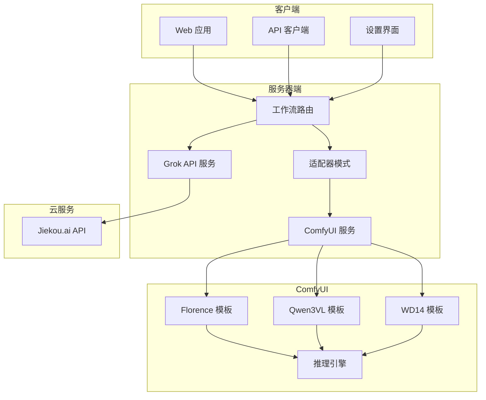
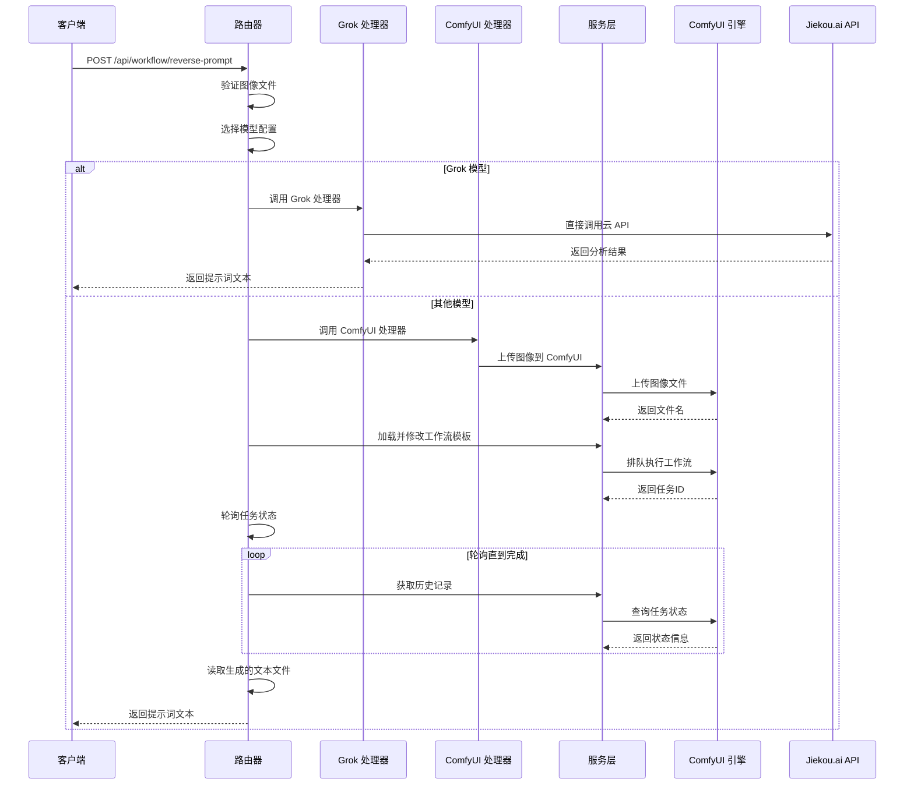
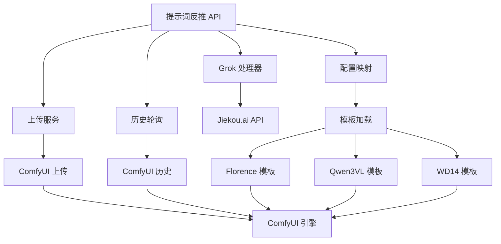
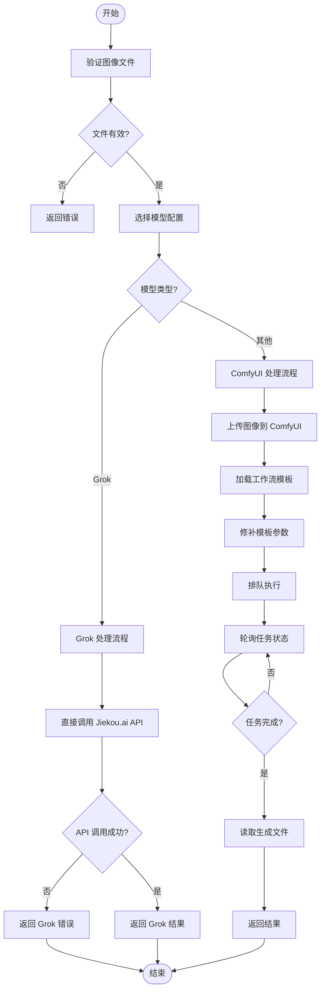

# 提示词反推 API

<cite>
**本文档引用的文件**
- [workflow.ts](file://server/src/routes/workflow.ts)
- [comfyui.ts](file://server/src/services/comfyui.ts)
- [Pix2Real-提示词反推Flo.json](file://ComfyUI_API/Pix2Real-提示词反推Flo.json)
- [Pix2Real-提示词反推Q3.json](file://ComfyUI_API/Pix2Real-提示词反推Q3.json)
- [Pix2Real-提示词反推WD14.json](file://ComfyUI_API/Pix2Real-提示词反推WD14.json)
- [systemPrompts.ts](file://client/src/components/prompt-assistant/systemPrompts.ts)
- [README.md](file://README.md)
- [useSettingsStore.ts](file://client/src/hooks/useSettingsStore.ts)
- [SettingsModal.tsx](file://client/src/components/SettingsModal.tsx)
</cite>

## 更新摘要
**变更内容**
- 新增 Grok 模型支持，通过直接调用 Jiekou.ai API 提供快速图像分析
- 扩展模型配置映射，支持四种不同的反向提示词模型
- 更新客户端设置界面，添加 Grok 模型选项
- 增强错误处理机制，支持云 API 调用失败的情况

## 目录
1. [简介](#简介)
2. [项目结构](#项目结构)
3. [核心组件](#核心组件)
4. [架构概览](#架构概览)
5. [详细组件分析](#详细组件分析)
6. [依赖关系分析](#依赖关系分析)
7. [性能考虑](#性能考虑)
8. [故障排除指南](#故障排除指南)
9. [结论](#结论)
10. [附录](#附录)

## 简介
本文件详细说明了提示词反推 API 的完整接口规范，该功能能够从图像内容反推出可能的提示词。系统现在支持四种不同的反推模型：
- **Qwen3VL 模型**：基于 Qwen3-VL 多模态大语言模型的中文详细描述
- **Florence 模型**：基于 Florence-2 大语言模型的详细图像描述生成
- **WD-14 模型**：基于 WD-14 标签器的视觉标签提取
- **Grok 模型**：基于 Jiekou.ai API 的快速图像分析和提示词生成

该 API 支持多种输入格式，包括 JPG、PNG、WEBP 等常见图像格式，并提供统一的接口来调用不同的反推模型。Grok 模型通过直接调用云 API 提供快速的图像分析能力，特别适合需要快速响应的应用场景。

## 项目结构
提示词反推功能位于服务器端的 workflow 路由模块中，通过 ComfyUI 工作流模板实现具体的功能逻辑。新增的 Grok 模型通过直接调用 Jiekou.ai API 实现，不依赖本地 ComfyUI 工作流。



**图表来源**
- [workflow.ts:679-745](file://server/src/routes/workflow.ts#L679-L745)
- [comfyui.ts:47-71](file://server/src/services/comfyui.ts#L47-L71)

**章节来源**
- [README.md:41-62](file://README.md#L41-L62)
- [workflow.ts:674-744](file://server/src/routes/workflow.ts#L674-L744)

## 核心组件
提示词反推 API 的核心组件包括：

### 主要接口
- **POST /api/workflow/reverse-prompt** - 主要的提示词反推接口
- **查询参数** - model: Qwen3VL | Florence | WD-14 | Grok
- **请求体** - 单个图像文件上传
- **响应** - 返回生成的提示词文本

### 模型配置映射
系统维护了一个模型配置映射表，定义了每个模型对应的 ComfyUI 模板和保存节点：

| 模型名称 | 模板路径 | 保存节点 | 特点 | 处理方式 |
|---------|---------|---------|------|----------|
| Qwen3VL | Pix2Real-提示词反推Q3.json | 节点 66 | 中文详细描述，多模态理解 | 本地 ComfyUI 工作流 |
| Florence | Pix2Real-提示词反推Flo.json | 节点 67 | 英文详细描述，多任务支持 | 本地 ComfyUI 工作流 |
| WD-14 | Pix2Real-提示词反推WD14.json | 节点 67 | 视觉标签提取，标签过滤 | 本地 ComfyUI 工作流 |
| Grok | 直接调用 API | 无 | 快速图像分析，云端处理 | 直接 HTTP 请求 |

**章节来源**
- [workflow.ts:654-667](file://server/src/routes/workflow.ts#L654-L667)
- [workflow.ts:674-744](file://server/src/routes/workflow.ts#L674-L744)

## 架构概览
提示词反推功能采用分层架构设计，实现了清晰的关注点分离。新增的 Grok 模型通过独立的处理流程直接调用云 API：



**图表来源**
- [workflow.ts:674-744](file://server/src/routes/workflow.ts#L674-L744)
- [comfyui.ts:47-71](file://server/src/services/comfyui.ts#L47-L71)

## 详细组件分析

### Grok 模型反推
Grok 模型是新增的云服务模型，通过直接调用 Jiekou.ai API 提供快速的图像分析能力：

#### 模型参数配置
- **API 端点**: https://api.jiekou.ai/openai/v1/chat/completions
- **模型名称**: grok-4-fast-non-reasoning
- **认证方式**: Bearer token 认证
- **系统提示词**: 根据图片反推提示词。如果图片是二次元卡通图片，则返回tag风格英文标签提示词。如果是真实图片或照片则返回中文自然语言提示词。
- **生成参数**:
  - max_tokens: 4096
  - temperature: 1

#### 处理流程
Grok 模型采用直接 HTTP 请求的方式，不需要经过 ComfyUI 工作流：
1. 将图像转换为 base64 编码
2. 构造 data URL 格式的图像数据
3. 直接调用 Jiekou.ai API
4. 解析 API 响应并返回提示词

#### 输出特点
Grok 模型根据输入图片类型智能调整输出格式：
- **二次元图片**: 返回英文标签格式的提示词
- **真实图片**: 返回中文自然语言格式的提示词

**章节来源**
- [workflow.ts:680-745](file://server/src/routes/workflow.ts#L680-L745)

### Florence 模型反推
Florence 模型专注于生成详细的英文图像描述，具有以下特点：

#### 模型参数配置
- **模型名称**: MiaoshouAI/Florence-2-large-PromptGen-v2.0
- **精度设置**: fp16
- **注意力机制**: sdpa
- **任务类型**: more_detailed_caption
- **生成参数**: 
  - max_new_tokens: 1024
  - num_beams: 3
  - do_sample: false

#### 输出格式
Florence 模型生成的是完整的英文描述文本，适合需要详细场景描述的应用场景。

**章节来源**
- [Pix2Real-提示词反推Flo.json:13-31](file://ComfyUI_API/Pix2Real-提示词反推Flo.json#L13-L31)
- [Pix2Real-提示词反推Flo.json:25-31](file://ComfyUI_API/Pix2Real-提示词反推Flo.json#L25-L31)

### Qwen3VL 模型反推
Qwen3VL 模型专门针对中文用户，能够生成详细的中文图像描述：

#### 模型参数配置
- **模型名称**: Qwen3-VL-8B-Instruct-abliterated-v2.0.Q6_K.gguf
- **多模态投影**: Qwen3-VL-8B-Instruct-abliterated-v2.0.mmproj-f16.gguf
- **推理模式**: one by one
- **生成参数**:
  - temperature: 0.8
  - top_k: 30
  - top_p: 0.9
  - min_p: 0.05

#### 系统提示词
Qwen3VL 使用预设的系统提示词，要求生成详细的中文描述，特别关注性器官和面部表情的精确描述。

**章节来源**
- [Pix2Real-提示词反推Q3.json:63-69](file://ComfyUI_API/Pix2Real-提示词反推Q3.json#L63-L69)
- [Pix2Real-提示词反推Q3.json:34-35](file://ComfyUI_API/Pix2Real-提示词反推Q3.json#L34-L35)

### WD-14 模型反推
WD-14 模型专注于视觉标签提取，生成逗号分隔的标签列表：

#### 模型参数配置
- **模型名称**: wd-eva02-large-tagger-v3
- **阈值设置**:
  - threshold: 0.35
  - character_threshold: 0.85
- **输出格式**:
  - replace_underscore: true
  - trailing_comma: false

#### 输出特点
WD-14 生成的是标准化的英文标签列表，适合需要精确视觉元素标注的应用场景。

**章节来源**
- [Pix2Real-提示词反推WD14.json:13-18](file://ComfyUI_API/Pix2Real-提示词反推WD14.json#L13-L18)
- [Pix2Real-提示词反推WD14.json:31-35](file://ComfyUI_API/Pix2Real-提示词反推WD14.json#L31-L35)

### API 接口规范

#### 基本请求格式
```
POST /api/workflow/reverse-prompt?model={模型类型}
Content-Type: multipart/form-data

参数:
- image: 图像文件 (必需)
- model: 模型类型 (可选，默认: Qwen3VL)
```

#### 请求参数说明

| 参数名 | 类型 | 必需 | 默认值 | 描述 |
|--------|------|------|--------|------|
| image | 文件 | 是 | - | 输入的图像文件 |
| model | 字符串 | 否 | Qwen3VL | 反推模型类型 |

#### 模型类型选项

| 模型名称 | 用途 | 输出格式 | 适用场景 | 处理时间 | 资源消耗 |
|----------|------|----------|----------|----------|----------|
| Qwen3VL | 中文详细描述 | 中文段落 | 中文图像理解，本地化应用 | 30-60秒 | 高 |
| Florence | 英文详细描述 | 英文段落 | 国际化应用，学术研究 | 10-30秒 | 中等 |
| WD-14 | 视觉标签提取 | 英文标签列表 | 标签管理，检索系统 | 几秒 | 低 |
| Grok | 快速图像分析 | 智能格式 | 实时应用，云端处理 | 几秒 | 无 |

#### 响应格式
```json
{
  "text": "生成的提示词文本"
}
```

#### 错误响应
```json
{
  "error": "错误消息"
}
```

**章节来源**
- [workflow.ts:674-744](file://server/src/routes/workflow.ts#L674-L744)

## 依赖关系分析

### 组件依赖图


**图表来源**
- [workflow.ts:654-667](file://server/src/routes/workflow.ts#L654-L667)
- [workflow.ts:694-704](file://server/src/routes/workflow.ts#L694-L704)

### 数据流分析
提示词反推的数据流遵循以下模式，新增了 Grok 模型的处理分支：



**图表来源**
- [workflow.ts:674-744](file://server/src/routes/workflow.ts#L674-L744)

**章节来源**
- [comfyui.ts:9-25](file://server/src/services/comfyui.ts#L9-L25)
- [comfyui.ts:47-71](file://server/src/services/comfyui.ts#L47-L71)

## 性能考虑

### 处理时间对比
根据系统实现，不同模型的处理时间存在显著差异：

| 模型类型 | 预估处理时间 | 资源消耗 | 适用场景 |
|----------|-------------|----------|----------|
| Grok | 几秒 | 无 | 实时应用，云端处理 |
| WD-14 | 几秒 | 低 | 标签提取，批量处理 |
| Florence | 10-30秒 | 中等 | 详细描述，多任务 |
| Qwen3VL | 30-60秒 | 高 | 中文详细描述，复杂场景 |

### 资源优化策略
1. **内存管理**: 系统自动清理临时文件和 VRAM
2. **并发控制**: 通过队列系统管理任务执行顺序
3. **缓存机制**: 模型加载后保持在内存中以提高性能
4. **云服务优化**: Grok 模型避免了本地资源消耗

### 性能监控
系统提供 VRAM 和 RAM 使用情况监控：
- **VRAM 使用率**: 显示 GPU 内存占用百分比
- **RAM 使用率**: 显示系统内存占用百分比

**章节来源**
- [workflow.ts:532-540](file://server/src/routes/workflow.ts#L532-L540)
- [comfyui.ts:106-125](file://server/src/services/comfyui.ts#L106-L125)

## 故障排除指南

### 常见错误及解决方案

#### 1. 图像文件上传失败
**错误信息**: "No image file provided"
**解决方案**: 
- 确保使用 multipart/form-data 格式
- 检查文件大小限制 (默认 50MB)
- 验证文件扩展名是否受支持

#### 2. 模型配置错误
**错误信息**: "Unknown model: {model}"
**解决方案**:
- 使用允许的模型名称: Qwen3VL, Florence, WD-14, Grok
- 检查模型名称大小写

#### 3. Grok API 调用失败
**错误信息**: "Grok API 错误: {status}" 或 "Grok API 调用失败"
**解决方案**:
- 检查网络连接和 API 可用性
- 验证认证令牌的有效性
- 确认 Jiekou.ai 服务状态
- 检查 API 限额和配额

#### 4. 反推超时
**错误信息**: "反推提示词超时，请重试"
**解决方案**:
- 检查 ComfyUI 服务状态
- 增加等待时间或重试
- 确认模型已正确加载

#### 5. 文本文件缺失
**错误信息**: "ComfyUI 未返回提示词文本"
**解决方案**:
- 检查 rp_temp 目录权限
- 确认文件写入成功
- 验证 ComfyUI 工作流配置

### 调试建议
1. **检查 ComfyUI 连接**: 确保 ComfyUI 在 `http://localhost:8188` 正常运行
2. **验证模型可用性**: 确认所需模型已下载并加载
3. **监控系统资源**: 关注 VRAM 和 RAM 使用情况
4. **查看日志输出**: 检查服务器端错误日志
5. **测试 Grok API**: 独立测试 Jiekou.ai API 的可用性

**章节来源**
- [workflow.ts:676-744](file://server/src/routes/workflow.ts#L676-L744)
- [comfyui.ts:1-25](file://server/src/services/comfyui.ts#L1-L25)

## 结论
提示词反推 API 提供了灵活且强大的图像内容理解能力，现在支持四种不同类型的反推模型以满足各种应用场景的需求。系统采用模块化设计，具有良好的可扩展性和维护性。

### 主要优势
1. **多模型支持**: 提供四种不同风格的反推模型
2. **统一接口**: 通过单一 API 支持多种模型切换
3. **实时反馈**: 支持任务状态轮询和进度监控
4. **资源管理**: 自动化的内存和文件管理
5. **云端集成**: Grok 模型提供快速的云端处理能力

### 使用建议
- **实时应用**: 优先选择 Grok 或 WD-14 模型
- **中文应用场景**: 选择 Qwen3VL 模型
- **学术研究应用**: 选择 Florence 模型
- **批量处理**: 考虑模型的处理时间和资源消耗
- **云端处理**: 选择 Grok 模型以避免本地资源消耗

## 附录

### 支持的输入格式
- **图像格式**: JPG, PNG, WEBP, BMP
- **文件大小**: 最大 50MB
- **分辨率**: 无硬性限制，建议不超过 4096x4096

### API 使用示例

#### curl 示例
```bash
# 使用 Qwen3VL 模型
curl -X POST "http://localhost:3000/api/workflow/reverse-prompt?model=Qwen3VL" \
  -F "image=@photo.jpg" \
  -H "Content-Type: multipart/form-data"

# 使用 Florence 模型
curl -X POST "http://localhost:3000/api/workflow/reverse-prompt?model=Florence" \
  -F "image=@photo.jpg" \
  -H "Content-Type: multipart/form-data"

# 使用 WD-14 模型
curl -X POST "http://localhost:3000/api/workflow/reverse-prompt?model=WD-14" \
  -F "image=@photo.jpg" \
  -H "Content-Type: multipart/form-data"

# 使用 Grok 模型
curl -X POST "http://localhost:3000/api/workflow/reverse-prompt?model=Grok" \
  -F "image=@photo.jpg" \
  -H "Content-Type: multipart/form-data"
```

### 模型选择建议
1. **准确性优先**: Florence 模型提供最详细的描述
2. **中文本地化**: Qwen3VL 模型更适合中文应用场景
3. **标签管理**: WD-14 模型最适合需要结构化标签的场景
4. **实时响应**: Grok 模型提供最快的处理速度
5. **性能考虑**: Grok 和 WD-14 处理速度最快，Qwen3VL 最慢

### 系统要求
- **ComfyUI**: 版本 1.0 或更高（仅限非 Grok 模型）
- **Node.js**: 18 或更高版本
- **GPU**: 推荐 NVIDIA RTX 3060 或更高（仅限非 Grok 模型）
- **内存**: 至少 16GB RAM
- **网络连接**: Grok 模型需要稳定的互联网连接

### 客户端设置
新增的 Grok 模型已在客户端设置界面中集成：
- **设置界面**: 在"反推模型"选项中可以看到 Grok 选项
- **默认值**: 保持 Qwen3VL 为默认模型
- **持久化存储**: 用户选择的模型会保存在本地存储中

**章节来源**
- [README.md:16-25](file://README.md#L16-L25)
- [workflow.ts:674-744](file://server/src/routes/workflow.ts#L674-L744)
- [useSettingsStore.ts:3](file://client/src/hooks/useSettingsStore.ts#L3)
- [SettingsModal.tsx:6-11](file://client/src/components/SettingsModal.tsx#L6-L11)