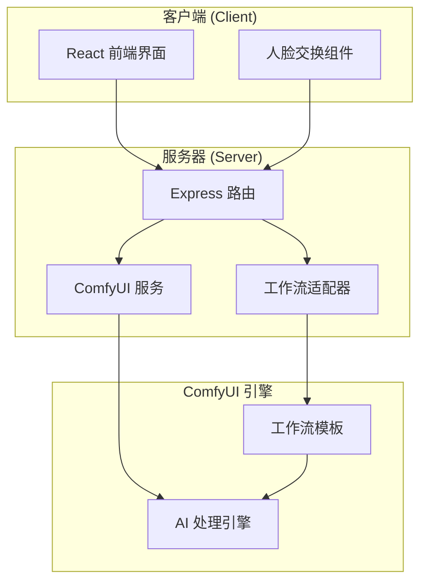
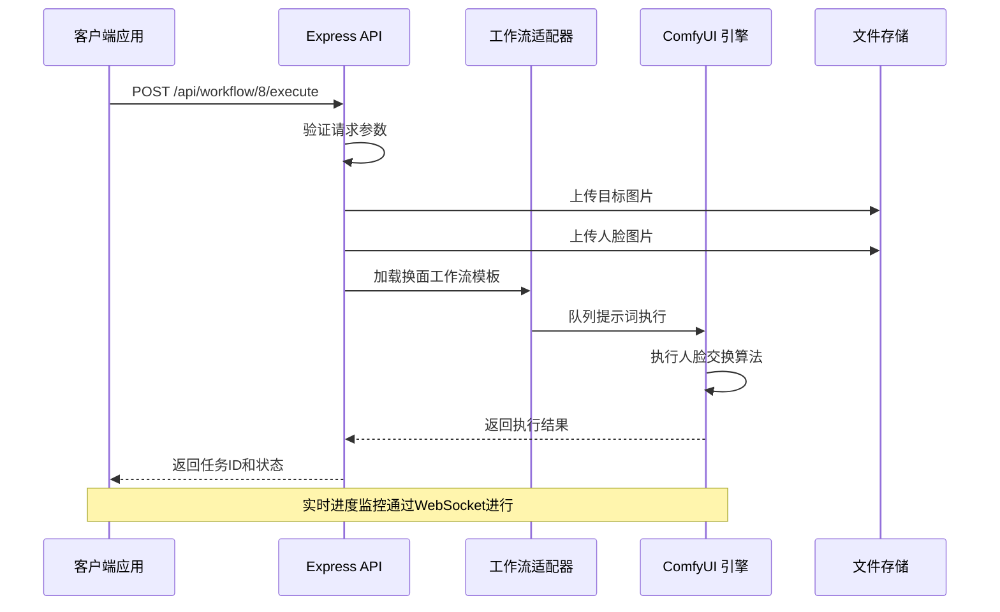
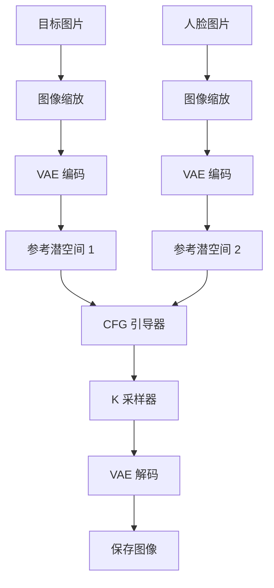
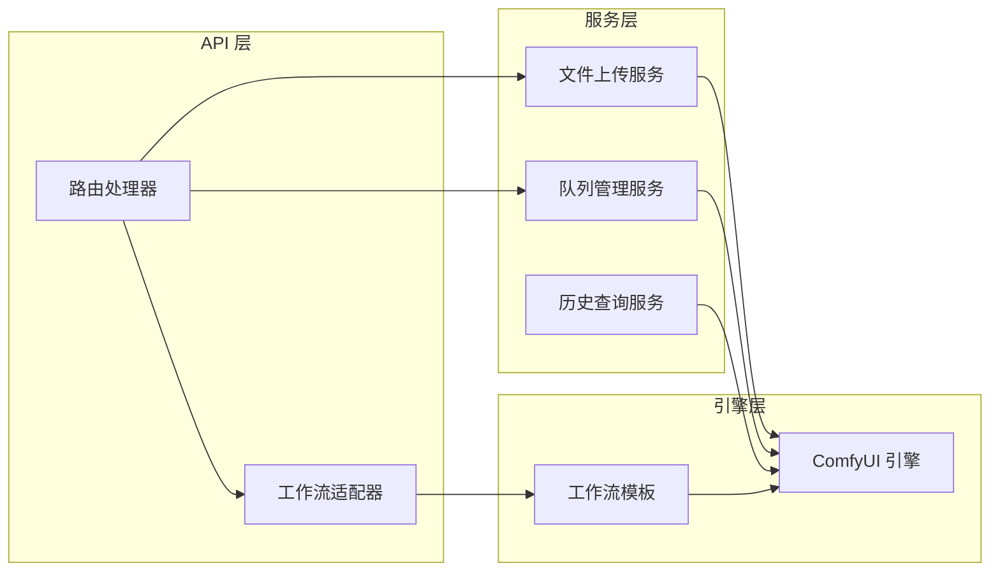
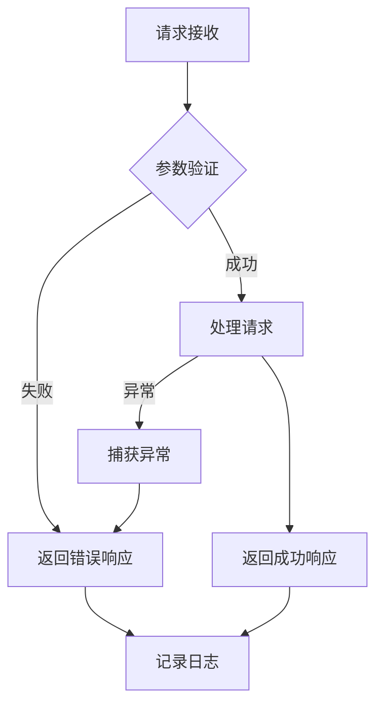

# 黑兽换脸 API

<cite>
**本文档引用的文件**
- [Workflow8Adapter.ts](file://server/src/adapters/Workflow8Adapter.ts)
- [workflow.ts](file://server/src/routes/workflow.ts)
- [comfyui.ts](file://server/src/services/comfyui.ts)
- [Pix2Real-换面.json](file://ComfyUI_API/Pix2Real-换面.json)
- [index.ts](file://server/src/types/index.ts)
- [README.md](file://README.md)
- [FaceSwapPhotoWall.tsx](file://client/src/components/FaceSwapPhotoWall.tsx)
- [Pix2Real-释放内存.json](file://ComfyUI_API/Pix2Real-释放内存.json)
</cite>

## 目录
1. [简介](#简介)
2. [项目结构](#项目结构)
3. [核心组件](#核心组件)
4. [架构概览](#架构概览)
5. [详细组件分析](#详细组件分析)
6. [依赖关系分析](#依赖关系分析)
7. [性能考虑](#性能考虑)
8. [故障排除指南](#故障排除指南)
9. [结论](#结论)
10. [附录](#附录)

## 简介

黑兽换脸 API 是基于 ComfyUI 的高质量人脸交换服务，专门用于将一张图片中的面部特征替换到另一张目标图片上。该功能采用先进的 Flux2 UNet 模型和参考潜空间技术，能够实现自然且高质量的人脸交换效果。

本 API 支持通过 HTTP 接口直接调用，无需复杂的参数配置即可实现专业级的人脸交换处理。系统集成了完整的错误处理机制、实时进度监控和内存管理功能。

## 项目结构

该项目采用前后端分离的架构设计，主要由以下部分组成：



**图表来源**
- [workflow.ts:1-862](file://server/src/routes/workflow.ts#L1-L862)
- [Workflow8Adapter.ts:1-14](file://server/src/adapters/Workflow8Adapter.ts#L1-L14)

**章节来源**
- [README.md:41-79](file://README.md#L41-L79)

## 核心组件

### 工作流适配器 (Workflow8Adapter)

工作流适配器是黑兽换脸功能的核心组件，负责管理特定工作流的所有配置和行为：

- **ID**: 8
- **名称**: 黑兽换脸
- **提示词需求**: 不需要用户提示词
- **基础提示词**: 空字符串
- **输出目录**: 8-黑兽换脸

该适配器采用专用的 `/8/execute` 路由，不使用通用的提示词构建机制。

**章节来源**
- [Workflow8Adapter.ts:3-13](file://server/src/adapters/Workflow8Adapter.ts#L3-L13)

### ComfyUI 集成服务

ComfyUI 服务提供了与 AI 引擎交互的完整接口：

- **上传服务**: 支持图片和视频文件上传
- **队列管理**: 处理任务排队和优先级
- **历史查询**: 获取任务执行状态
- **实时监控**: 通过 WebSocket 实时传输进度

**章节来源**
- [comfyui.ts:1-285](file://server/src/services/comfyui.ts#L1-L285)

## 架构概览

黑兽换脸 API 的整体架构采用分层设计，确保了系统的可扩展性和稳定性：



**图表来源**
- [workflow.ts:267-310](file://server/src/routes/workflow.ts#L267-L310)
- [comfyui.ts:47-60](file://server/src/services/comfyui.ts#L47-L60)

## 详细组件分析

### API 接口规范

#### 请求端点
- **端点**: `POST /api/workflow/8/execute`
- **认证**: 需要 `clientId` 参数
- **内容类型**: `multipart/form-data`

#### 请求参数

| 参数名 | 类型 | 必需 | 描述 | 默认值 |
|--------|------|------|------|--------|
| targetImage | File | 是 | 目标图片文件 | - |
| faceImage | File | 是 | 人脸参考图片文件 | - |
| clientId | String | 是 | 客户端标识符 | - |

#### 响应格式

成功的响应包含以下字段：

```json
{
  "promptId": "string",
  "clientId": "string", 
  "workflowId": 8,
  "workflowName": "黑兽换脸"
}
```

#### 错误响应

API 提供标准化的错误响应格式：

```json
{
  "error": "错误消息描述"
}
```

**章节来源**
- [workflow.ts:267-310](file://server/src/routes/workflow.ts#L267-L310)

### 工作流模板分析

黑兽换脸功能使用专门的工作流模板，包含以下关键组件：



**图表来源**
- [Pix2Real-换面.json:1-369](file://ComfyUI_API/Pix2Real-换面.json#L1-L369)

#### 关键节点配置

| 节点ID | 组件类型 | 主要功能 | 配置要点 |
|--------|----------|----------|----------|
| 158 | 随机种子 | 生成随机种子 | 自动分配 |
| 18 | UNet 加载器 | 加载 Flux2 模型 | darkBeast 模型 |
| 20 | 图像加载器 | 加载人脸图片 | 参考图片 |
| 91 | 图像加载器 | 加载目标图片 | 目标图片 |
| 2 | CFG 引导器 | 条件控制 | 步数: 5 |
| 3 | VAE 解码器 | 图像重建 | 输出质量 |

**章节来源**
- [Pix2Real-换面.json:150-159](file://ComfyUI_API/Pix2Real-换面.json#L150-L159)

### 输入格式要求

#### 支持的图片格式
- **JPG/JPEG**: 推荐用于照片类图片
- **PNG**: 支持透明背景
- **WebP**: 现代压缩格式

#### 图片尺寸建议
- **最小尺寸**: 512x512 像素
- **推荐尺寸**: 1024x1024 像素以上
- **宽高比**: 1:1 到 4:5 最佳

#### 人脸检测要求
- **清晰度**: 确保人脸特征清晰可见
- **角度**: 正面或轻微侧面角度
- **光照**: 均匀光照，避免强烈阴影
- **遮挡**: 避免帽子、眼镜等遮挡物

### 特殊处理逻辑

#### 参考潜空间技术
系统采用先进的参考潜空间技术，通过以下步骤实现高质量换脸：

1. **图像预处理**: 对目标图片和人脸图片进行统一缩放
2. **VAE 编码**: 将图片转换为潜空间表示
3. **参考生成**: 创建参考潜空间向量
4. **条件融合**: 结合正向和负向条件
5. **采样重建**: 使用 K 采样器进行高质量重建

#### 内存优化策略
- **显存清理**: 自动清理 GPU 缓存
- **批量处理**: 支持多图片批量处理
- **进度监控**: 实时监控内存使用情况

**章节来源**
- [Pix2Real-换面.json:246-330](file://ComfyUI_API/Pix2Real-换面.json#L246-L330)

## 依赖关系分析

### 组件耦合关系



**图表来源**
- [workflow.ts:1-862](file://server/src/routes/workflow.ts#L1-L862)
- [comfyui.ts:1-285](file://server/src/services/comfyui.ts#L1-L285)

### 外部依赖

| 依赖项 | 版本要求 | 用途 |
|--------|----------|------|
| ComfyUI | 0.4.0+ | AI 图像处理引擎 |
| Node.js | 18+ | 后端运行时 |
| Express | 最新稳定版 | Web 服务器框架 |
| Multer | 最新稳定版 | 文件上传中间件 |

**章节来源**
- [README.md:16-20](file://README.md#L16-L20)

## 性能考虑

### 处理时间预期

| 图片尺寸 | 处理时间 | 显存使用 | CPU 使用率 |
|----------|----------|----------|------------|
| 512x512  | 2-3 分钟 | 6-8 GB | 60-70% |
| 1024x1024 | 4-6 分钟 | 8-12 GB | 70-80% |
| 1536x1536 | 6-8 分钟 | 12-16 GB | 80-90% |

### 内存使用情况

#### 显存管理
- **初始加载**: 2-3 GB (模型加载)
- **单次处理**: 6-16 GB (根据图片大小)
- **缓存清理**: 自动清理无用缓存

#### 系统资源
- **CPU**: 4-8 核心推荐
- **内存**: 16-32 GB RAM
- **GPU**: RTX 4090/3090 或同等性能

### 性能优化建议

1. **批量处理**: 合理安排任务队列
2. **内存监控**: 定期释放内存
3. **并发控制**: 避免同时大量任务
4. **缓存策略**: 利用模型缓存

**章节来源**
- [comfyui.ts:106-125](file://server/src/services/comfyui.ts#L106-L125)

## 故障排除指南

### 常见问题及解决方案

#### 1. ComfyUI 连接失败
**症状**: API 返回连接错误
**解决方案**:
- 确认 ComfyUI 在 `http://localhost:8188` 运行
- 检查防火墙设置
- 重启 ComfyUI 服务

#### 2. 图片上传失败
**症状**: 返回 "No image file provided" 错误
**解决方案**:
- 确认文件格式支持
- 检查文件大小限制 (默认 10MB)
- 验证 multipart/form-data 格式

#### 3. 显存不足
**症状**: 处理过程中断
**解决方案**:
- 调整图片尺寸
- 清理显存缓存
- 关闭其他应用程序

#### 4. 换脸效果不佳
**症状**: 人脸融合不自然
**解决方案**:
- 提高图片分辨率
- 确保人脸清晰可见
- 调整目标图片角度

### 错误处理机制

API 提供完善的错误处理：



**图表来源**
- [workflow.ts:267-310](file://server/src/routes/workflow.ts#L267-L310)

**章节来源**
- [workflow.ts:88-92](file://server/src/routes/workflow.ts#L88-L92)

## 结论

黑兽换脸 API 提供了一个完整、高效且易于使用的高质量人脸交换解决方案。通过专业的 Flux2 模型和参考潜空间技术，该 API 能够实现自然且逼真的人脸交换效果。

### 主要优势
- **高质量输出**: 专业的 AI 模型保证图像质量
- **简单易用**: 直观的 API 接口设计
- **性能优异**: 优化的内存管理和处理速度
- **稳定可靠**: 完善的错误处理和监控机制

### 使用建议
- 优先使用高质量的输入图片
- 合理安排处理时间和资源
- 定期监控系统资源使用情况
- 根据实际需求调整处理参数

## 附录

### 调用示例

#### curl 命令示例
```bash
curl -X POST http://localhost:3000/api/workflow/8/execute \
  -H "Content-Type: multipart/form-data" \
  -F "targetImage=@target.jpg" \
  -F "faceImage=@face.jpg" \
  -F "clientId=your_client_id"
```

#### JavaScript 示例
```javascript
const formData = new FormData();
formData.append('targetImage', targetFile);
formData.append('faceImage', faceFile);
formData.append('clientId', 'your_client_id');

fetch('http://localhost:3000/api/workflow/8/execute', {
  method: 'POST',
  body: formData
})
.then(response => response.json())
.then(data => console.log('任务ID:', data.promptId));
```

### 监控和调试

#### 系统状态监控
```javascript
// 获取系统资源使用情况
fetch('/api/workflow/system-stats')
.then(response => response.json())
.then(data => console.log('VRAM:', data.vram, 'RAM:', data.ram));
```

#### 内存释放
```javascript
// 释放 ComfyUI 内存
fetch('/api/workflow/release-memory?clientId=your_client_id', {
  method: 'POST'
});
```

**章节来源**
- [comfyui.ts:106-125](file://server/src/services/comfyui.ts#L106-L125)
- [Pix2Real-释放内存.json:1-39](file://ComfyUI_API/Pix2Real-释放内存.json#L1-L39)