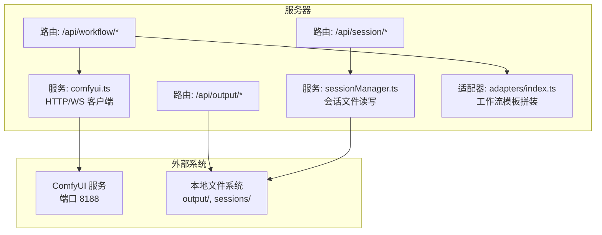
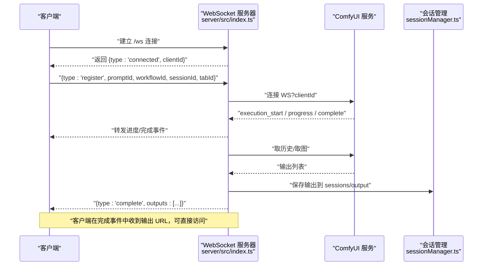
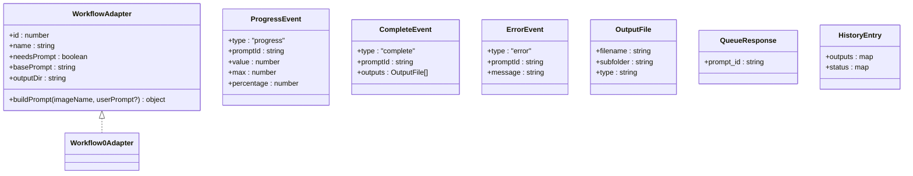
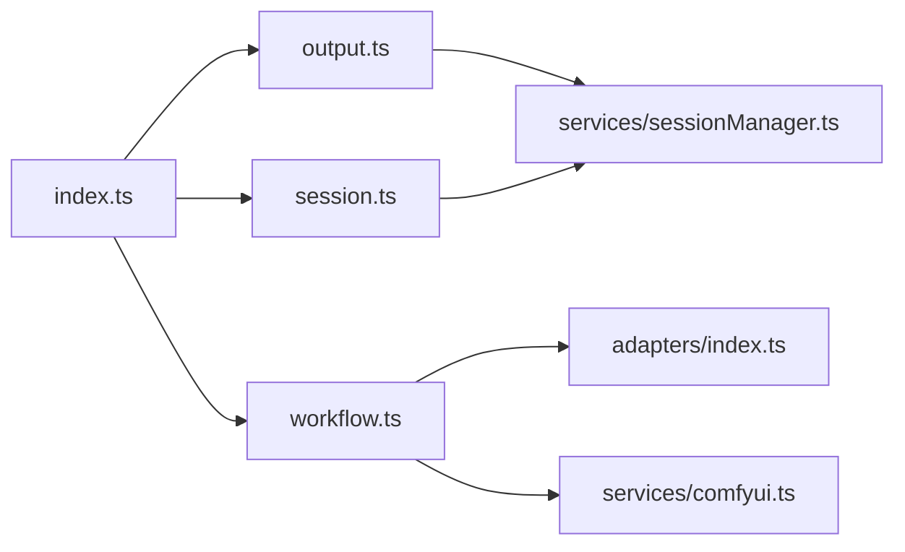

# 工作流 API

<cite>
**本文引用的文件**
- [server/src/index.ts](file://server/src/index.ts)
- [server/src/route/workflow.ts](file://server/src/routes/workflow.ts)
- [server/src/route/output.ts](file://server/src/routes/output.ts)
- [server/src/route/session.ts](file://server/src/routes/session.ts)
- [server/src/services/comfyui.ts](file://server/src/services/comfyui.ts)
- [server/src/services/sessionManager.ts](file://server/src/services/sessionManager.ts)
- [server/src/adapters/index.ts](file://server/src/adapters/index.ts)
- [server/src/types/index.ts](file://server/src/types/index.ts)
- [server/package.json](file://server/package.json)
- [README.md](file://README.md)
- [ComfyUI_API/0-Pix2Real-二次元转真人.json](file://ComfyUI_API/0-Pix2Real-二次元转真人.json)
</cite>

## 目录
1. [简介](#简介)
2. [项目结构](#项目结构)
3. [核心组件](#核心组件)
4. [架构总览](#架构总览)
5. [详细组件分析](#详细组件分析)
6. [依赖关系分析](#依赖关系分析)
7. [性能考量](#性能考量)
8. [故障排查指南](#故障排查指南)
9. [结论](#结论)
10. [附录](#附录)

## 简介
本文件为“工作流 API”的权威技术文档，覆盖以下内容：
- 所有工作流执行接口：单张图片与批量处理
- 接口方法、URL 模式、请求参数、响应格式
- 工作流 ID 映射、文件上传处理、提示词参数传递、客户端 ID 管理
- 具体调用示例（curl 与 JavaScript fetch）
- 错误处理机制、状态码含义、超时策略
- 工作流队列管理、内存释放、系统统计等辅助接口
- 与 ComfyUI 的交互流程、WebSocket 进度推送与输出下载

## 项目结构
后端采用 Express + TypeScript，路由按功能拆分：
- 路由层：工作流执行、输出文件服务、会话管理
- 服务层：与 ComfyUI 的 HTTP/WebSocket 通信、会话文件持久化
- 适配器层：每条工作流对应一个 JSON 模板适配器，负责构建 prompt



图表来源
- [server/src/index.ts:54-60](file://server/src/index.ts#L54-L60)
- [server/src/routes/workflow.ts:1-28](file://server/src/routes/workflow.ts#L1-L28)
- [server/src/routes/output.ts:1-134](file://server/src/routes/output.ts#L1-L134)
- [server/src/routes/session.ts:1-95](file://server/src/routes/session.ts#L1-L95)
- [server/src/services/comfyui.ts:1-285](file://server/src/services/comfyui.ts#L1-L285)
- [server/src/services/sessionManager.ts:1-164](file://server/src/services/sessionManager.ts#L1-L164)
- [server/src/adapters/index.ts:1-31](file://server/src/adapters/index.ts#L1-L31)

章节来源
- [README.md: 项目结构与特性:41-79](file://README.md#L41-L79)
- [server/src/index.ts: 路由注册与静态资源:54-60](file://server/src/index.ts#L54-L60)

## 核心组件
- 工作流路由：提供工作流执行、批量执行、队列管理、系统统计、内存释放等接口
- 输出路由：列出与下载输出文件，支持打开文件
- 会话路由：保存输入图、蒙版、界面状态，列出/删除会话
- 适配器：根据工作流 ID 加载模板并注入参数（如图像名、提示词、种子）
- 服务层：封装与 ComfyUI 的 HTTP/WebSocket 交互，包括上传、入队、取历史、取图、系统统计、队列操作等

章节来源
- [server/src/routes/workflow.ts: 工作流路由:1-862](file://server/src/routes/workflow.ts#L1-L862)
- [server/src/routes/output.ts: 输出路由:1-134](file://server/src/routes/output.ts#L1-L134)
- [server/src/routes/session.ts: 会话路由:1-95](file://server/src/routes/session.ts#L1-L95)
- [server/src/adapters/index.ts: 适配器映射:1-31](file://server/src/adapters/index.ts#L1-L31)
- [server/src/services/comfyui.ts: 服务层:1-285](file://server/src/services/comfyui.ts#L1-L285)
- [server/src/services/sessionManager.ts: 会话管理:1-164](file://server/src/services/sessionManager.ts#L1-L164)

## 架构总览
后端通过 WebSocket 与 ComfyUI 保持连接，实时转发进度事件；完成后从 ComfyUI 下载输出到本地 sessions 或 output 目录，并通过 WebSocket 返回完成事件。



图表来源
- [server/src/index.ts: WebSocket 连接与事件转发:73-219](file://server/src/index.ts#L73-L219)
- [server/src/services/comfyui.ts: connectWebSocket/getHistory/getImageBuffer:127-188](file://server/src/services/comfyui.ts#L127-L188)
- [server/src/services/sessionManager.ts: saveOutputFile:34-44](file://server/src/services/sessionManager.ts#L34-L44)

## 详细组件分析

### 工作流执行接口

- 列表接口
  - 方法：GET
  - URL：/api/workflow
  - 请求参数：无
  - 响应：工作流列表数组，包含 id、name、needsPrompt、basePrompt
  - 示例：curl -s http://localhost:3000/api/workflow

- 单张图片执行
  - 方法：POST
  - URL：/api/workflow/:id/execute
  - 路径参数：id（工作流 ID）
  - 表单字段：
    - image（必填，单文件）
    - clientId（必填，查询或请求体均可）
    - prompt（可选，字符串）
  - 响应：{ promptId, clientId, workflowId, workflowName }
  - 特殊说明：
    - 当工作流 ID 为 4 时，上传的是视频文件
    - 适配器负责将上传的文件名注入模板节点，并随机种子
  - 示例：curl -F image=@test.png -F clientId=abc123 http://localhost:3000/api/workflow/0/execute

- 批量执行
  - 方法：POST
  - URL：/api/workflow/:id/batch
  - 路径参数：id（工作流 ID）
  - 表单字段：
    - images（必填，多文件，最多 50）
    - clientId（必填）
    - prompt（可选，统一提示词）
    - prompts（可选，JSON 数组，逐个文件的提示词）
  - 响应：{ clientId, workflowId, workflowName, tasks: [{ promptId, originalName }] }
  - 示例：curl -F images=@a.png -F images=@b.png -F clientId=abc123 http://localhost:3000/api/workflow/0/batch

- 工作流专用接口（部分工作流有独立路径）

  - 工作流 0：二次元转真人
    - URL：/api/workflow/0/execute
    - 字段：image（必填）、clientId（必填）、prompt（可选）、model（可选，默认 qwen）
    - 响应：{ promptId, clientId, workflowId, workflowName }

  - 工作流 2：精修放大
    - URL：/api/workflow/2/execute
    - 字段：image（必填）、clientId（必填）、model（可选，默认 seedvr2）
    - 响应：{ promptId, clientId, workflowId, workflowName }

  - 工作流 5：解除装备
    - URL：/api/workflow/5/execute
    - 字段：image（必填）、mask（必填）、clientId（必填）、prompt（可选）、backPose（可选，布尔字符串）
    - 响应：{ promptId, clientId, workflowId, workflowName }

  - 工作流 7：快速出图（文生图）
    - URL：/api/workflow/7/execute
    - JSON 请求体：clientId（必填）、model（必填）、prompt（必填）、width、height、steps、cfg、sampler、scheduler、name（可选）
    - 响应：{ promptId, clientId, workflowId, workflowName }

  - 工作流 8：黑兽换脸
    - URL：/api/workflow/8/execute
    - 字段：targetImage（必填）、faceImage（必填）、clientId（必填）
    - 响应：{ promptId, clientId, workflowId, workflowName }

  - 工作流 9：ZIT快出（UNet+LoRA）
    - URL：/api/workflow/9/execute
    - JSON 请求体：clientId（必填）、unetModel（必填）、loraModel（必填）、loraEnabled（布尔）、shiftEnabled（布尔）、shift（数字）、prompt（必填）、width、height、steps、cfg、sampler、scheduler、name（可选）
    - 响应：{ promptId, clientId, workflowId, workflowName }

- 提示词反推
  - URL：/api/workflow/reverse-prompt?model=Qwen3VL|Florence|WD-14
  - 方法：POST
  - 字段：image（必填）
  - 响应：{ text }
  - 超时：180 秒

- 提示词助理
  - URL：/api/workflow/prompt-assistant
  - 方法：POST
  - JSON 请求体：systemPrompt（必填）、userPrompt（必填）
  - 响应：{ text }
  - 超时：180 秒

- 导出混合结果（前端直传 Base64）
  - URL：/api/workflow/export-blend
  - 方法：POST
  - JSON 请求体：sessionId（必填）、tabId（必填）、filename（必填）、imageDataBase64（必填）
  - 响应：{ ok, savedPath }

章节来源
- [server/src/routes/workflow.ts: 单图/批量/专用工作流接口:40-862](file://server/src/routes/workflow.ts#L40-L862)
- [server/src/adapters/index.ts: 适配器映射:13-24](file://server/src/adapters/index.ts#L13-L24)
- [server/src/services/comfyui.ts: uploadImage/uploadVideo/queuePrompt:9-60](file://server/src/services/comfyui.ts#L9-L60)

### 队列与系统统计接口

- 获取队列
  - URL：/api/workflow/queue
  - 方法：GET
  - 响应：{ running: [...], pending: [...] }

- 优先执行某任务
  - URL：/api/workflow/queue/prioritize/:promptId
  - 方法：POST
  - 响应：{ ok, mapping: [{ oldPromptId, newPromptId }] }

- 取消队列项
  - URL：/api/workflow/cancel-queue/:promptId
  - 方法：POST
  - 响应：{ ok }

- 释放内存
  - URL：/api/workflow/release-memory
  - 方法：POST
  - 字段：clientId（必填）
  - 响应：{ promptId, clientId }

- 系统统计（VRAM/RAM）
  - URL：/api/workflow/system-stats
  - 方法：GET
  - 响应：{ vram, ram }（vram 可能为 null 表示无 GPU）

- 打开工作流输出目录
  - URL：/api/workflow/:id/open-folder
  - 方法：POST
  - JSON 请求体：{ sessionId, tabId }（可选，若缺失则回退到工作流默认输出目录）
  - 响应：{ ok, path }

章节来源
- [server/src/routes/workflow.ts: 队列/统计/内存/打开目录:522-623](file://server/src/routes/workflow.ts#L522-L623)
- [server/src/services/comfyui.ts: getQueue/deleteQueueItem/prioritizeQueueItem/getSystemStats:202-284](file://server/src/services/comfyui.ts#L202-L284)

### 输出文件接口

- 列出输出文件
  - URL：/api/output/:workflowId
  - 方法：GET
  - 响应：文件信息数组（包含 filename、size、createdAt、url）

- 下载单个文件
  - URL：/api/output/:workflowId/:filename
  - 方法：GET
  - 响应：文件二进制

- 打开文件（OS 默认应用）
  - URL：/api/output/open-file
  - 方法：POST
  - JSON 请求体：{ url }（支持 /api/output/...、/output/...、/api/session-files/...）
  - 响应：{ ok }

章节来源
- [server/src/routes/output.ts: 输出路由:1-134](file://server/src/routes/output.ts#L1-L134)

### 会话接口

- 保存输入图
  - URL：/api/session/:sessionId/images
  - 方法：POST
  - 字段：image（必填）、tabId（必填）、imageId（必填）
  - 响应：{ url }

- 保存蒙版
  - URL：/api/session/:sessionId/masks
  - 方法：POST
  - 字段：mask（必填）、tabId（必填）、maskKey（必填）
  - 响应：{ ok }

- 保存/发送状态
  - PUT 或 POST /api/session/:sessionId/state
  - JSON 请求体：{ activeTab, tabData }
  - 响应：{ ok }

- 读取会话
  - URL：/api/session/:sessionId
  - 方法：GET
  - 响应：会话数据或 { error: 'Session not found' }

- 列出会话
  - URL：/api/sessions
  - 方法：GET
  - 响应：会话元数据数组

- 删除会话
  - URL：/api/session/:sessionId
  - 方法：DELETE
  - 响应：{ ok }

章节来源
- [server/src/routes/session.ts: 会话路由:1-95](file://server/src/routes/session.ts#L1-L95)
- [server/src/services/sessionManager.ts: 会话文件读写:20-110](file://server/src/services/sessionManager.ts#L20-L110)

### WebSocket 事件与客户端 ID 管理

- 连接
  - 客户端连接 ws://localhost:3000/ws
  - 服务器返回 { type: 'connected', clientId }

- 注册
  - 客户端发送 { type: 'register', promptId, workflowId, sessionId, tabId }
  - 服务器缓冲早期事件并在注册后重放

- 事件
  - execution_start、progress（含百分比）、complete（含 outputs）、error

- 输出下载
  - 服务器在 complete 时从 ComfyUI 下载输出并保存至 sessions/output，同时返回输出 URL

章节来源
- [server/src/index.ts: WebSocket 服务器与事件转发:73-219](file://server/src/index.ts#L73-L219)
- [server/src/services/comfyui.ts: connectWebSocket:127-188](file://server/src/services/comfyui.ts#L127-L188)

### 数据模型与类型



图表来源
- [server/src/types/index.ts: 类型定义:1-52](file://server/src/types/index.ts#L1-L52)
- [server/src/adapters/Workflow0Adapter.ts: 适配器示例:1-35](file://server/src/adapters/Workflow0Adapter.ts#L1-L35)

## 依赖关系分析



图表来源
- [server/src/routes/workflow.ts:1-28](file://server/src/routes/workflow.ts#L1-L28)
- [server/src/routes/output.ts:1-10](file://server/src/routes/output.ts#L1-L10)
- [server/src/routes/session.ts:1-16](file://server/src/routes/session.ts#L1-L16)
- [server/src/index.ts:8-12](file://server/src/index.ts#L8-L12)

章节来源
- [server/src/adapters/index.ts:1-31](file://server/src/adapters/index.ts#L1-L31)
- [server/src/services/comfyui.ts:1-285](file://server/src/services/comfyui.ts#L1-L285)
- [server/src/services/sessionManager.ts:1-164](file://server/src/services/sessionManager.ts#L1-L164)

## 性能考量
- 文件上传大小限制：Express JSON 限制为 50MB，适合大体积图像/视频
- 批量执行：支持最多 50 张图片，建议控制并发以避免内存峰值
- 队列优先级：通过重新入队将目标任务置顶，减少等待时间
- 内存释放：提供释放 GPU/RAM 的专用工作流，便于长时间运行后的资源回收
- 系统统计：定期查询 VRAM/RAM 使用率，辅助容量规划

## 故障排查指南
- 常见状态码
  - 400：缺少必要字段（如 clientId、image、mask、prompt）
  - 404：会话不存在
  - 500：服务器内部错误
  - 502：ComfyUI 不可用
  - 504：提示词反推/提示词助理超时（默认 180 秒）

- 常见问题
  - 无法连接 ComfyUI：确认其监听地址与端口配置一致
  - 输出为空：检查 completion 事件是否触发以及输出保存逻辑
  - 队列不更新：确认 WebSocket 是否正常，以及执行完成事件是否到达
  - 超时：适当提高超时阈值或减少批量数量

章节来源
- [server/src/routes/workflow.ts: 错误处理与超时:88-91](file://server/src/routes/workflow.ts#L88-L91)
- [server/src/routes/workflow.ts: 反推/助理超时:720-723](file://server/src/routes/workflow.ts#L720-L723)
- [server/src/services/comfyui.ts: getSystemStats/队列/删除:106-125](file://server/src/services/comfyui.ts#L106-L125)

## 结论
该工作流 API 以适配器模式组织多条工作流，统一通过 ComfyUI 执行，结合 WebSocket 实现实时进度与输出下载。接口设计覆盖了从单图到批量、从队列管理到系统监控的完整链路，适合本地部署与批处理场景。

## 附录

### API 调用示例（curl 与 JavaScript fetch）

- curl
  - 列出工作流
    - curl -s http://localhost:3000/api/workflow
  - 单图执行（工作流 0）
    - curl -F image=@test.png -F clientId=abc123 http://localhost:3000/api/workflow/0/execute
  - 批量执行（工作流 0）
    - curl -F images=@a.png -F images=@b.png -F clientId=abc123 http://localhost:3000/api/workflow/0/batch
  - 释放内存
    - curl -X POST -H "Content-Type: application/json" -d '{"clientId":"abc123"}' http://localhost:3000/api/workflow/release-memory
  - 获取系统统计
    - curl -s http://localhost:3000/api/workflow/system-stats
  - 反推提示词（Qwen3VL）
    - curl -F image=@test.png "http://localhost:3000/api/workflow/reverse-prompt?model=Qwen3VL"
  - 打开输出文件（OS 默认应用）
    - curl -X POST -H "Content-Type: application/json" -d '{"url":"/api/output/0/test.png"}' http://localhost:3000/api/output/open-file

- JavaScript fetch
  - 单图执行
    ```js
    const formData = new FormData();
    formData.append("image", fileInput.files[0]);
    formData.append("clientId", "abc123");
    const resp = await fetch("http://localhost:3000/api/workflow/0/execute", {
      method: "POST",
      body: formData,
    });
    const data = await resp.json();
    console.log("promptId:", data.promptId);
    ```
  - 文生图（工作流 7）
    ```js
    const resp = await fetch("http://localhost:3000/api/workflow/7/execute", {
      method: "POST",
      headers: { "Content-Type": "application/json" },
      body: JSON.stringify({
        clientId: "abc123",
        model: "model.ckpt",
        prompt: "beautiful girl",
        width: 512,
        height: 512,
        steps: 20,
        cfg: 7,
        sampler: "euler",
        scheduler: "normal",
      }),
    });
    const data = await resp.json();
    console.log("promptId:", data.promptId);
    ```

章节来源
- [server/src/routes/workflow.ts: 接口定义与示例:40-862](file://server/src/routes/workflow.ts#L40-L862)
- [server/src/routes/output.ts: 输出文件接口:22-73](file://server/src/routes/output.ts#L22-L73)
- [server/src/routes/session.ts: 会话接口:18-33](file://server/src/routes/session.ts#L18-L33)