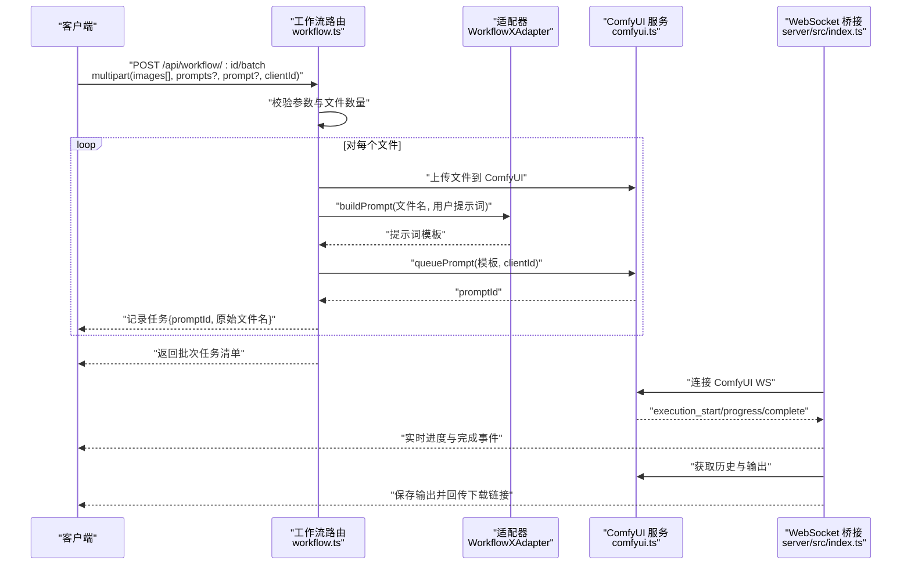
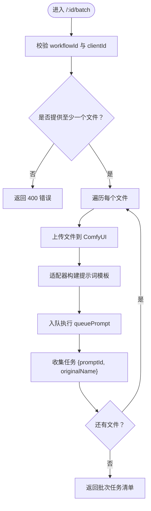
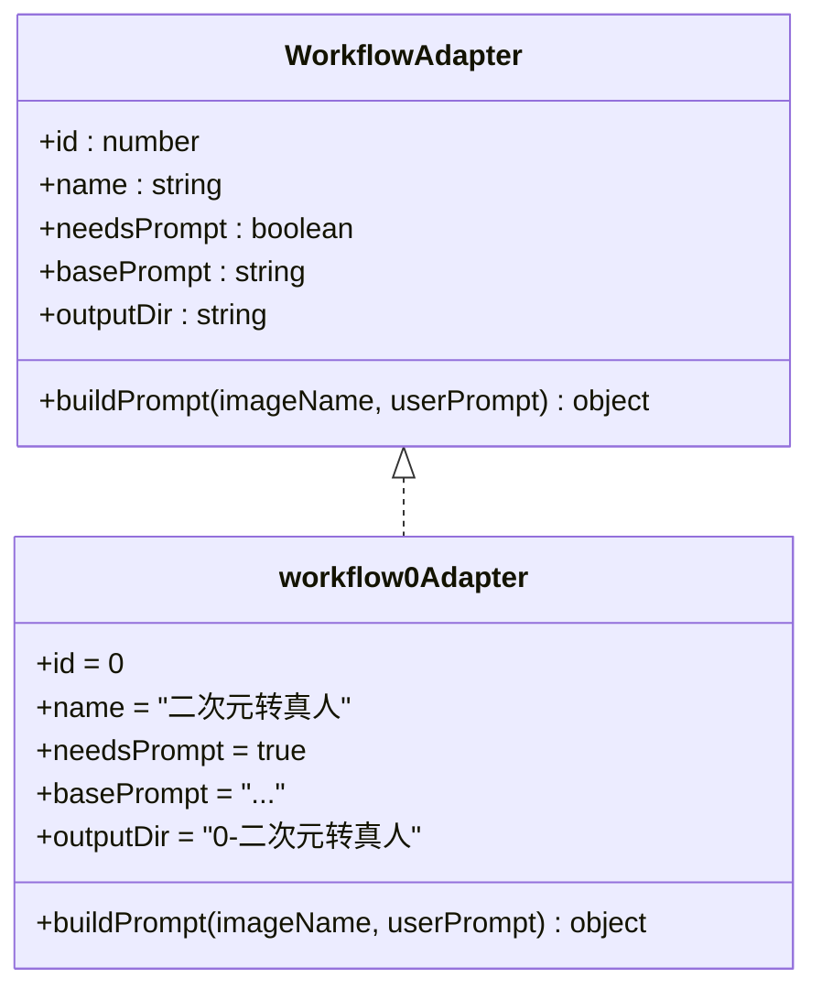
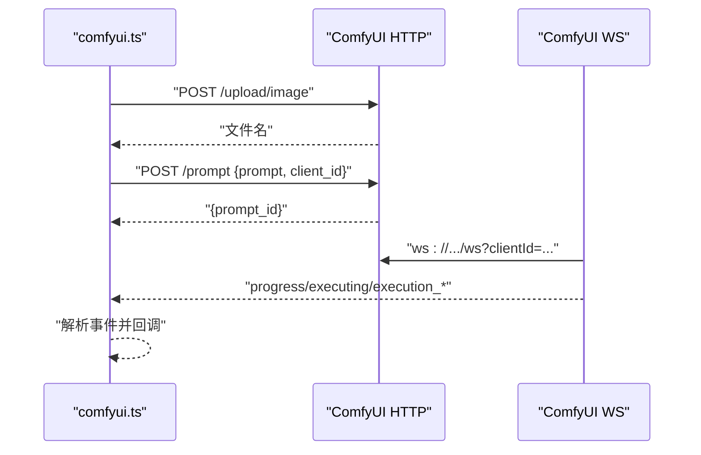
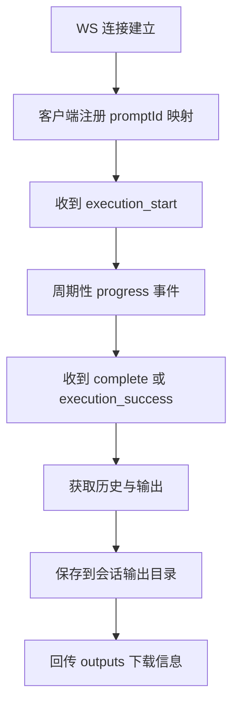
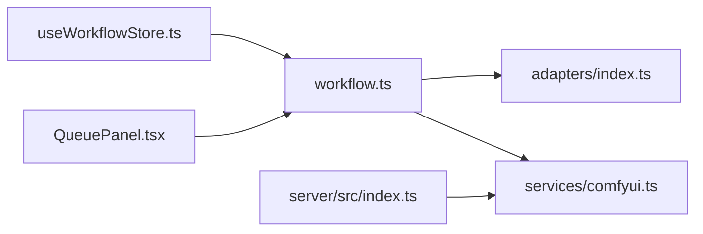

# 批量处理 API

<cite>
**本文引用的文件**
- [server/src/index.ts](file://server/src/index.ts)
- [server/src/routes/workflow.ts](file://server/src/routes/workflow.ts)
- [server/src/services/comfyui.ts](file://server/src/services/comfyui.ts)
- [server/src/adapters/index.ts](file://server/src/adapters/index.ts)
- [server/src/adapters/Workflow0Adapter.ts](file://server/src/adapters/Workflow0Adapter.ts)
- [client/src/components/DropZone.tsx](file://client/src/components/DropZone.tsx)
- [client/src/hooks/useImageImporter.ts](file://client/src/hooks/useImageImporter.ts)
- [client/src/components/QueuePanel.tsx](file://client/src/components/QueuePanel.tsx)
- [client/src/hooks/useWorkflowStore.ts](file://client/src/hooks/useWorkflowStore.ts)
- [client/src/components/ImageCard.tsx](file://client/src/components/ImageCard.tsx)
- [README.md](file://README.md)
</cite>

## 目录
1. [简介](#简介)
2. [项目结构](#项目结构)
3. [核心组件](#核心组件)
4. [架构总览](#架构总览)
5. [详细组件分析](#详细组件分析)
6. [依赖关系分析](#依赖关系分析)
7. [性能考量](#性能考量)
8. [故障排查指南](#故障排查指南)
9. [结论](#结论)
10. [附录：API 使用示例与最佳实践](#附录api-使用示例与最佳实践)

## 简介
本文件聚焦于批量处理 API 的设计与实现，围绕后端路由 /api/workflow/:id/batch 展开，系统性说明其工作原理、请求参数、响应结构、与单文件处理的差异与优势，并提供并发策略、提示词配置、文件数量限制、内存管理与错误恢复等最佳实践。同时给出前后端协同流程与可视化图示，帮助开发者与使用者正确组织批量请求与处理批量响应。

## 项目结构
- 后端采用 Express + TypeScript，通过路由模块化承载各类工作流执行与资源管理。
- 前端基于 React + Zustand 状态管理，提供拖拽导入、批量卡片操作与实时队列面板。
- 批量处理由后端适配器模式统一构建模板，结合 ComfyUI 的队列与 WebSocket 实时进度回传。

```mermaid
graph TB
subgraph "客户端"
UI_Drop["拖拽组件<br/>DropZone.tsx"]
UI_Card["图像卡片<br/>ImageCard.tsx"]
UI_Store["状态管理<br/>useWorkflowStore.ts"]
UI_Queue["队列面板<br/>QueuePanel.tsx"]
end
subgraph "服务端"
S_Index["入口与WS桥接<br/>server/src/index.ts"]
S_Route["工作流路由<br/>server/src/routes/workflow.ts"]
S_Adapters["适配器索引与实现<br/>server/src/adapters/index.ts<br/>Workflow0Adapter.ts"]
S_Comfy["ComfyUI 交互服务<br/>server/src/services/comfyui.ts"]
end
UI_Drop --> UI_Store
UI_Card --> UI_Store
UI_Store --> S_Route
UI_Queue --> S_Route
S_Index <- --> S_Comfy
S_Route --> S_Adapters
S_Route --> S_Comfy
```

**图表来源**
- [server/src/index.ts:1-228](file://server/src/index.ts#L1-L228)
- [server/src/routes/workflow.ts:1-862](file://server/src/routes/workflow.ts#L1-L862)
- [server/src/services/comfyui.ts:1-285](file://server/src/services/comfyui.ts#L1-L285)
- [server/src/adapters/index.ts:1-31](file://server/src/adapters/index.ts#L1-L31)
- [server/src/adapters/Workflow0Adapter.ts:1-35](file://server/src/adapters/Workflow0Adapter.ts#L1-L35)
- [client/src/components/DropZone.tsx:1-171](file://client/src/components/DropZone.tsx#L1-L171)
- [client/src/components/ImageCard.tsx:1-200](file://client/src/components/ImageCard.tsx#L1-L200)
- [client/src/components/QueuePanel.tsx:1-306](file://client/src/components/QueuePanel.tsx#L1-L306)
- [client/src/hooks/useWorkflowStore.ts:450-645](file://client/src/hooks/useWorkflowStore.ts#L450-L645)

**章节来源**
- [README.md:1-79](file://README.md#L1-L79)
- [server/src/index.ts:1-228](file://server/src/index.ts#L1-L228)
- [server/src/routes/workflow.ts:1-862](file://server/src/routes/workflow.ts#L1-L862)

## 核心组件
- 批量路由处理器：负责解析多文件、逐个构建提示词、调用队列接口并返回批量任务清单。
- 适配器体系：按工作流 ID 加载模板并注入输入与提示词，保证不同工作流的可扩展性。
- ComfyUI 服务：封装上传、入队、历史查询、输出下载与 WebSocket 连接，作为批处理的底层执行引擎。
- 客户端状态与 UI：负责文件导入、批量卡片渲染、队列面板与进度回显。

**章节来源**
- [server/src/routes/workflow.ts:457-520](file://server/src/routes/workflow.ts#L457-L520)
- [server/src/adapters/index.ts:1-31](file://server/src/adapters/index.ts#L1-L31)
- [server/src/services/comfyui.ts:1-285](file://server/src/services/comfyui.ts#L1-L285)
- [client/src/hooks/useWorkflowStore.ts:450-645](file://client/src/hooks/useWorkflowStore.ts#L450-L645)

## 架构总览
批量处理的端到端流程如下：
- 客户端将多文件通过 multipart/form-data 提交至 /api/workflow/:id/batch。
- 服务端解析文件数组与可选的 per-image 提示词数组，逐个上传文件、构建提示词模板、入队执行。
- 服务端返回批次任务清单；客户端通过 WebSocket 获取每个任务的进度与完成事件，并在完成后拉取输出文件保存到会话目录。



**图表来源**
- [server/src/routes/workflow.ts:457-520](file://server/src/routes/workflow.ts#L457-L520)
- [server/src/services/comfyui.ts:47-83](file://server/src/services/comfyui.ts#L47-L83)
- [server/src/index.ts:73-219](file://server/src/index.ts#L73-L219)

## 详细组件分析

### 批量路由：/api/workflow/:id/batch
- 功能：接收多文件并行提交，逐个入队执行，返回批次任务清单。
- 关键点：
  - 文件上传：使用数组字段 images，最大数量限制为 50。
  - 提示词配置：支持两种方式
    - 单提示词：body.prompt 作用于所有文件
    - 每图提示词：body.prompts 为 JSON 数组，与文件一一对应
  - 入队策略：逐个上传、构建提示词、调用 queuePrompt，收集每个任务的 promptId。
  - 响应结构：包含 clientId、workflowId、workflowName 以及 tasks 列表（每项含 promptId 与 originalName）。



**图表来源**
- [server/src/routes/workflow.ts:457-520](file://server/src/routes/workflow.ts#L457-L520)

**章节来源**
- [server/src/routes/workflow.ts:457-520](file://server/src/routes/workflow.ts#L457-L520)

### 适配器与提示词构建
- 适配器模式：每个工作流拥有独立适配器，加载模板并仅修改必要节点（如输入图像名、提示词、随机种子等）。
- 提示词拼接规则：对于需要提示词的工作流，基础提示词与用户自定义提示词进行拼接；对于不需要提示词的工作流，直接使用模板默认值。
- 模板来源：适配器读取对应 JSON 模板文件，确保与 ComfyUI 工作流一致。



**图表来源**
- [server/src/adapters/Workflow0Adapter.ts:1-35](file://server/src/adapters/Workflow0Adapter.ts#L1-L35)
- [server/src/adapters/index.ts:1-31](file://server/src/adapters/index.ts#L1-L31)

**章节来源**
- [server/src/adapters/Workflow0Adapter.ts:1-35](file://server/src/adapters/Workflow0Adapter.ts#L1-L35)
- [server/src/adapters/index.ts:1-31](file://server/src/adapters/index.ts#L1-L31)

### ComfyUI 服务层
- 上传与入队：封装 /upload/image 与 /prompt 接口，返回文件名与 promptId。
- 历史与输出：通过 /history/:promptId 获取执行历史，再通过 /view 下载输出。
- WebSocket：连接 ComfyUI WS，监听 progress、execution_start、execution_success/execution_error 等事件，向客户端转发。



**图表来源**
- [server/src/services/comfyui.ts:9-83](file://server/src/services/comfyui.ts#L9-L83)
- [server/src/services/comfyui.ts:127-188](file://server/src/services/comfyui.ts#L127-L188)

**章节来源**
- [server/src/services/comfyui.ts:1-285](file://server/src/services/comfyui.ts#L1-L285)

### WebSocket 与输出下载
- 服务端维护 promptId -> workflow/session/tab 映射，用于完成事件后定位输出保存路径。
- 完成事件触发后，从 ComfyUI 拉取输出（图像/视频），写入会话输出目录，并回传下载链接。
- 事件缓冲：若客户端注册较晚，服务端会重放最近的 execution_start/progress 事件，避免首张卡进度丢失。



**图表来源**
- [server/src/index.ts:73-219](file://server/src/index.ts#L73-L219)

**章节来源**
- [server/src/index.ts:73-219](file://server/src/index.ts#L73-L219)

### 客户端集成与 UI 协同
- 拖拽导入：支持文件与文件夹拖拽，过滤图片/视频类型，批量加入工作区。
- 图像卡片：显示每张图的任务状态、进度与输出列表；支持一键定位到队列面板。
- 队列面板：轮询 /api/workflow/queue 获取运行/排队中的任务，支持置顶与取消。
- 状态存储：useWorkflowStore 维护每张图的任务映射、进度与输出索引，批量完成后自动更新选中输出。

```mermaid
sequenceDiagram
participant UI as "DropZone.tsx"
participant Store as "useWorkflowStore.ts"
participant Card as "ImageCard.tsx"
participant Queue as "QueuePanel.tsx"
UI->>Store : "导入文件集合"
Store-->>Card : "渲染图像卡片与任务状态"
Card->>Queue : "打开队列面板查看进度"
Queue->>/api/workflow/queue : "GET /queue"
Queue-->>Card : "更新运行/排队状态"
```

**图表来源**
- [client/src/components/DropZone.tsx:1-171](file://client/src/components/DropZone.tsx#L1-L171)
- [client/src/hooks/useWorkflowStore.ts:450-645](file://client/src/hooks/useWorkflowStore.ts#L450-L645)
- [client/src/components/ImageCard.tsx:1-200](file://client/src/components/ImageCard.tsx#L1-L200)
- [client/src/components/QueuePanel.tsx:1-306](file://client/src/components/QueuePanel.tsx#L1-L306)

**章节来源**
- [client/src/components/DropZone.tsx:1-171](file://client/src/components/DropZone.tsx#L1-L171)
- [client/src/hooks/useImageImporter.ts:1-48](file://client/src/hooks/useImageImporter.ts#L1-L48)
- [client/src/components/QueuePanel.tsx:1-306](file://client/src/components/QueuePanel.tsx#L1-L306)
- [client/src/hooks/useWorkflowStore.ts:450-645](file://client/src/hooks/useWorkflowStore.ts#L450-L645)

## 依赖关系分析
- 路由层依赖适配器与 ComfyUI 服务，负责参数校验、文件上传与入队。
- 适配器依赖 JSON 模板与工作流节点配置，确保提示词与输入正确注入。
- WebSocket 服务依赖 ComfyUI WS，负责事件转发与输出下载。
- 客户端通过状态管理与 UI 组件协调批量任务的提交、监控与结果查看。



**图表来源**
- [server/src/routes/workflow.ts:1-862](file://server/src/routes/workflow.ts#L1-L862)
- [server/src/adapters/index.ts:1-31](file://server/src/adapters/index.ts#L1-L31)
- [server/src/services/comfyui.ts:1-285](file://server/src/services/comfyui.ts#L1-L285)
- [server/src/index.ts:1-228](file://server/src/index.ts#L1-L228)
- [client/src/hooks/useWorkflowStore.ts:450-645](file://client/src/hooks/useWorkflowStore.ts#L450-L645)
- [client/src/components/QueuePanel.tsx:1-306](file://client/src/components/QueuePanel.tsx#L1-L306)

**章节来源**
- [server/src/routes/workflow.ts:1-862](file://server/src/routes/workflow.ts#L1-L862)
- [server/src/services/comfyui.ts:1-285](file://server/src/services/comfyui.ts#L1-L285)
- [server/src/index.ts:1-228](file://server/src/index.ts#L1-L228)

## 性能考量
- 并发策略
  - 当前实现为串行逐个入队，简单可靠且便于错误隔离。
  - 若需提升吞吐，可在服务端引入限流与并发队列（例如基于工作流 ID 的分组并发控制），并为每个任务单独设置超时与重试。
- 文件数量限制
  - 默认最多 50 张图片/视频，避免一次性占用过多内存与带宽。
- 内存管理
  - 使用内存存储的 multer（memoryStorage）适合小文件批量；大文件建议改用磁盘存储或分块上传。
  - 可在批处理完成后主动调用释放内存接口，降低 GPU/RAM 压力。
- 输出下载
  - 完成事件触发后异步下载输出，避免阻塞主流程；失败项单独记录，不影响其他任务。

[本节为通用指导，不直接分析具体文件]

## 故障排查指南
- 常见错误与定位
  - 400 缺少文件或 clientId：检查 multipart 字段与查询参数。
  - 400 未知工作流：确认 workflowId 在适配器注册范围内。
  - 500 服务器内部错误：查看服务端日志与 ComfyUI 可用性。
- WebSocket 事件缺失
  - 若客户端注册过晚，服务端会重放最近事件；仍缺事件时，检查客户端是否正确发送注册消息。
- 输出未落盘
  - 确认完成事件已到达且历史可用；检查会话输出目录权限与路径。
- 队列异常
  - 使用 /api/workflow/queue 查看运行/排队项；必要时取消或置顶。

**章节来源**
- [server/src/routes/workflow.ts:457-520](file://server/src/routes/workflow.ts#L457-L520)
- [server/src/index.ts:73-219](file://server/src/index.ts#L73-L219)

## 结论
批量处理 API 以“适配器 + 模板 + 队列”的组合实现了对多文件的统一调度与可观测性。当前实现强调稳定与易用，后续可通过并发控制、限流与重试策略进一步提升吞吐与鲁棒性。配合前端的拖拽导入、卡片状态与队列面板，用户可以高效地组织与追踪大批量任务。

[本节为总结性内容，不直接分析具体文件]

## 附录：API 使用示例与最佳实践

### API 定义概览
- 端点：POST /api/workflow/:id/batch
- 参数（multipart/form-data）
  - images[]：必填，文件数组（最多 50）
  - prompts：可选，JSON 数组，与 images 一一对应
  - prompt：可选，字符串，当 prompts 不存在时作用于所有文件
  - clientId：可选，字符串，用于 WebSocket 注册与输出落盘
- 响应
  - 包含 clientId、workflowId、workflowName 与 tasks 列表（每项含 promptId、originalName）

**章节来源**
- [server/src/routes/workflow.ts:457-520](file://server/src/routes/workflow.ts#L457-L520)

### 请求与响应示例（路径引用）
- 示例请求（curl）
  - 上传 3 张图并指定每图提示词：[server/src/routes/workflow.ts:457-520](file://server/src/routes/workflow.ts#L457-L520)
- 示例响应
  - 批次任务清单（包含 3 个任务）：[server/src/routes/workflow.ts:510-515](file://server/src/routes/workflow.ts#L510-L515)

### 与单文件处理的区别与优势
- 区别
  - 单文件：一次请求处理一张图，适合交互式场景。
  - 批量：一次请求处理多张图，适合离线/后台处理。
- 优势
  - 减少网络往返与客户端等待时间
  - 统一提示词配置与输出目录管理
  - 通过队列与 WebSocket 实现实时进度与结果回传

**章节来源**
- [server/src/routes/workflow.ts:407-455](file://server/src/routes/workflow.ts#L407-L455)
- [server/src/routes/workflow.ts:457-520](file://server/src/routes/workflow.ts#L457-L520)

### 最佳实践
- 文件数量与大小
  - 控制单次批量不超过 50 张；大文件建议拆批或使用更高带宽网络。
- 提示词策略
  - 优先使用 prompts 数组为每张图定制提示词；仅在统一风格时使用全局 prompt。
- 并发与稳定性
  - 如需更高吞吐，建议在服务端引入并发队列与重试；为每个任务设置超时与失败回调。
- 内存与资源
  - 批处理完成后调用释放内存接口；监控 VRAM/内存使用，必要时暂停新任务。
- 错误恢复
  - 对失败任务单独记录与重试；利用队列面板取消或置顶，优化整体效率。

[本节为通用指导，不直接分析具体文件]