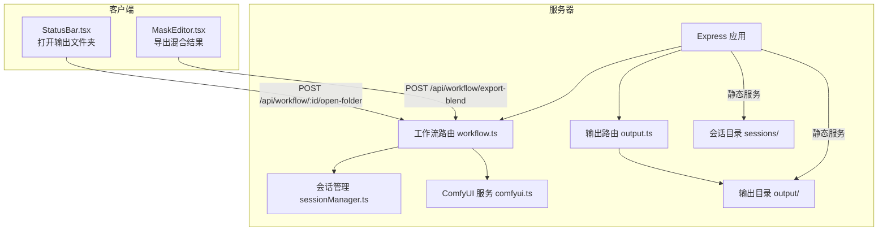
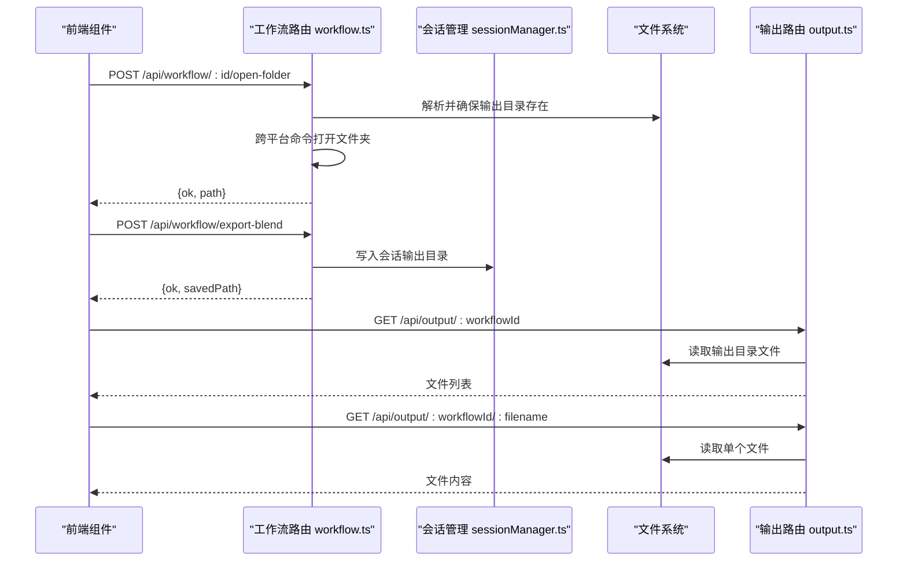
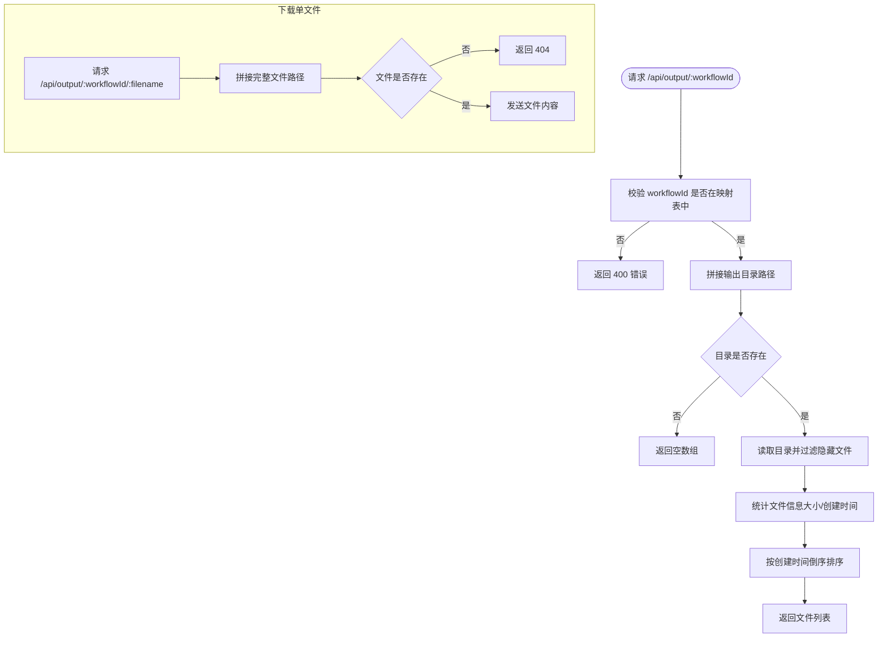
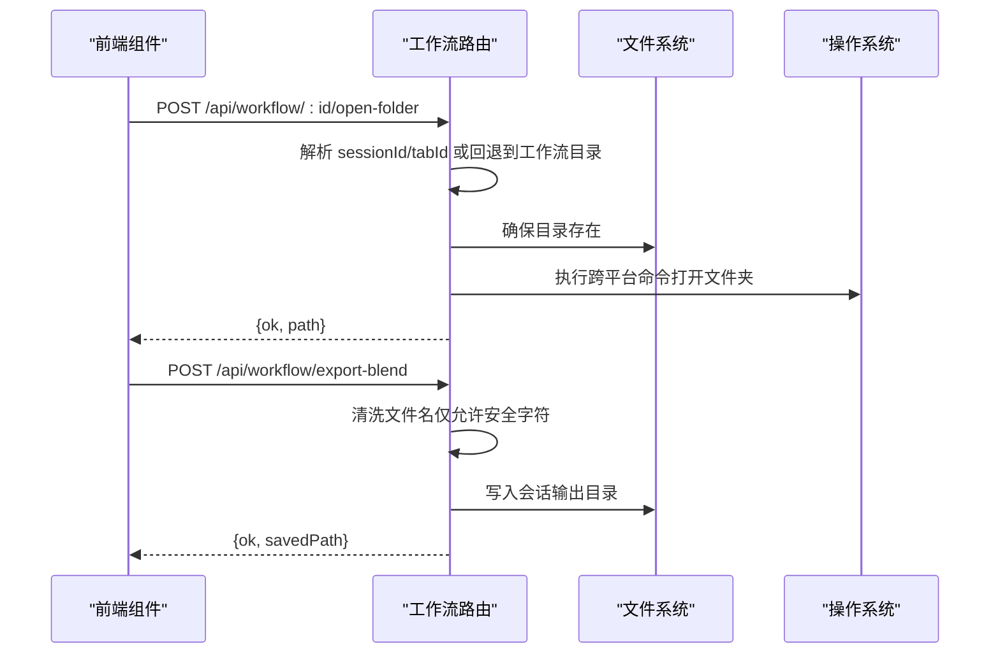
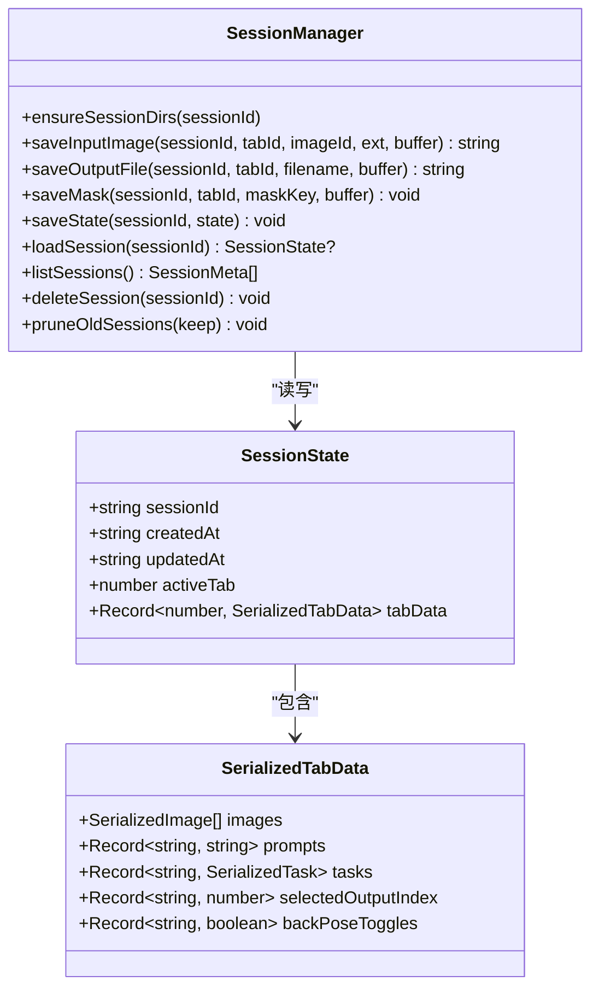
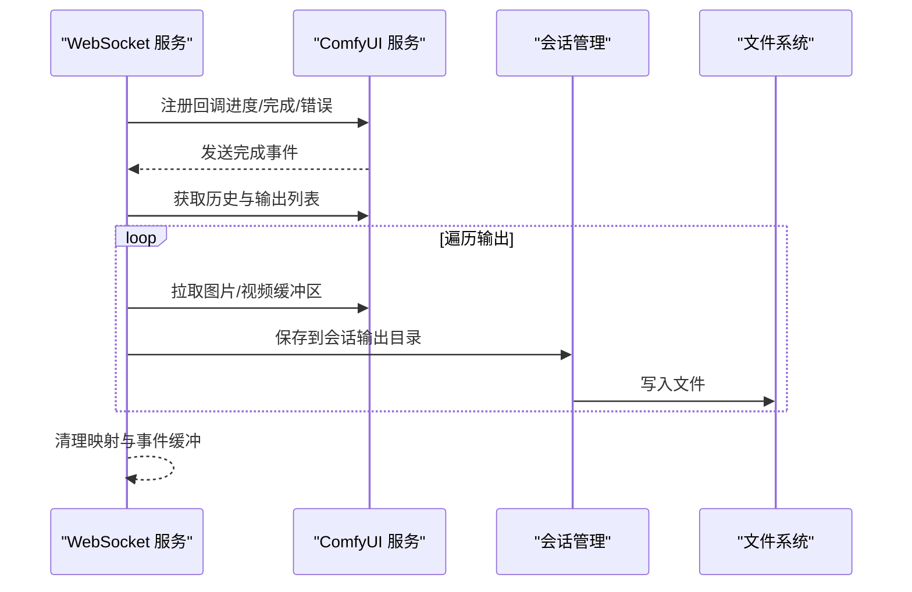
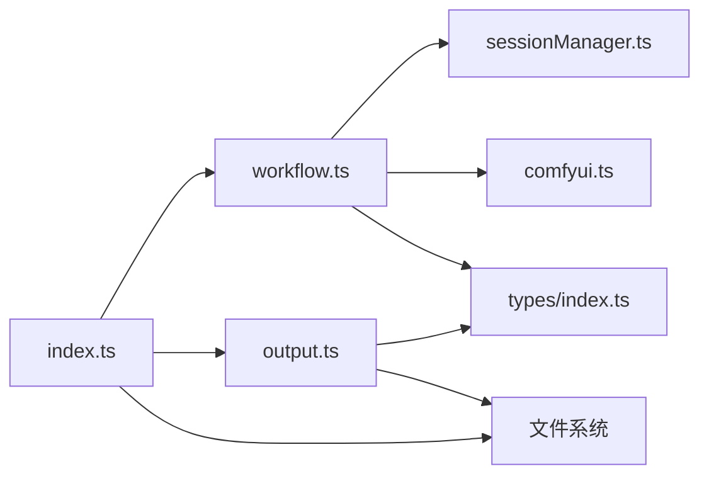

# 文件管理 API

<cite>
**本文档引用的文件**
- [server/src/routes/output.ts](file://server/src/routes/output.ts)
- [server/src/services/sessionManager.ts](file://server/src/services/sessionManager.ts)
- [server/src/index.ts](file://server/src/index.ts)
- [server/src/routers/workflow.ts](file://server/src/routes/workflow.ts)
- [server/src/services/comfyui.ts](file://server/src/services/comfyui.ts)
- [client/src/components/StatusBar.tsx](file://client/src/components/StatusBar.tsx)
- [client/src/components/MaskEditor.tsx](file://client/src/components/MaskEditor.tsx)
- [README.md](file://README.md)
- [server/src/types/index.ts](file://server/src/types/index.ts)
- [server/package.json](file://server/package.json)
- [package.json](file://package.json)
</cite>

## 目录
1. [简介](#简介)
2. [项目结构](#项目结构)
3. [核心组件](#核心组件)
4. [架构总览](#架构总览)
5. [详细组件分析](#详细组件分析)
6. [依赖关系分析](#依赖关系分析)
7. [性能考量](#性能考量)
8. [故障排查指南](#故障排查指南)
9. [结论](#结论)
10. [附录](#附录)

## 简介
本文件管理 API 文档聚焦于与文件系统交互的相关接口，涵盖以下能力：
- 列出工作流输出文件（按工作流 ID）
- 下载单个输出文件
- 打开会话输出文件夹（跨平台）
- 导出混合结果到会话输出目录
- 会话输入/输出文件与蒙版的持久化
- 输出目录与会话目录的初始化与静态服务

该文档同时提供文件系统组织结构、路径管理策略、权限控制建议、临时文件处理与清理机制，以及跨平台文件夹打开的安全注意事项与最佳实践。

## 项目结构
后端采用 Express + TypeScript 架构，文件管理相关的核心位置如下：
- 路由层：负责对外暴露 HTTP 接口
- 服务层：封装文件系统操作与会话状态管理
- 类型定义：统一事件与数据结构
- 前端组件：通过 HTTP 调用后端接口，触发文件夹打开与导出

图表来源
- [server/src/index.ts:58-60](file://server/src/index.ts#L58-L60)
- [server/src/routes/output.ts:11](file://server/src/routes/output.ts#L11)
- [server/src/routes/workflow.ts:22](file://server/src/routes/workflow.ts#L22)
- [server/src/services/sessionManager.ts:6](file://server/src/services/sessionManager.ts#L6)

章节来源
- [README.md:41-62](file://README.md#L41-L62)
- [server/src/index.ts:58-60](file://server/src/index.ts#L58-L60)

## 核心组件
- 输出路由（/api/output）：列出指定工作流的输出文件列表，下载单个文件，并支持跨平台打开文件。
- 工作流路由（/api/workflow）：提供打开会话输出文件夹、导出混合结果等接口；与会话管理与 ComfyUI 服务协作。
- 会话管理服务：确保会话目录结构存在，保存输入图像、输出文件与蒙版，维护会话状态 JSON。
- ComfyUI 服务：从 ComfyUI 下载输出缓冲区并写入会话输出目录。
- 静态文件服务：对外暴露 output 与 session-files 的静态访问。

章节来源
- [server/src/routes/output.ts:22-73](file://server/src/routes/output.ts#L22-L73)
- [server/src/routes/workflow.ts:581-655](file://server/src/routes/workflow.ts#L581-L655)
- [server/src/services/sessionManager.ts:10-57](file://server/src/services/sessionManager.ts#L10-L57)
- [server/src/index.ts:58-60](file://server/src/index.ts#L58-L60)

## 架构总览
文件管理 API 的调用链路与数据流向如下：

图表来源
- [server/src/routes/workflow.ts:581-655](file://server/src/routes/workflow.ts#L581-L655)
- [server/src/routes/output.ts:22-73](file://server/src/routes/output.ts#L22-L73)
- [server/src/services/sessionManager.ts:34-44](file://server/src/services/sessionManager.ts#L34-L44)

## 详细组件分析

### 输出路由（/api/output）
- 功能
  - 列出指定工作流 ID 的输出文件，返回文件名、大小、创建时间与可访问 URL。
  - 下载单个文件，支持直接返回文件内容。
  - 支持跨平台打开文件（通过 /api/output/open-file）。
- 关键行为
  - 使用映射表将工作流 ID 映射到输出目录名称。
  - 对文件进行过滤（隐藏文件不展示），按创建时间倒序排序。
  - 通过静态服务提供文件下载。
- 安全与健壮性
  - 对未知工作流 ID 返回错误。
  - 对不存在的文件返回 404。
  - 对 URL 进行解码与路径解析，避免越权访问。

图表来源
- [server/src/routes/output.ts:22-73](file://server/src/routes/output.ts#L22-L73)

章节来源
- [server/src/routes/output.ts:22-73](file://server/src/routes/output.ts#L22-L73)

### 工作流路由（/api/workflow）
- 打开输出文件夹（POST /api/workflow/:id/open-folder）
  - 支持两种模式：
    - 新版：传入 sessionId 与 tabId，打开对应会话的输出目录。
    - 旧版回退：根据工作流适配器映射到全局输出目录。
  - 跨平台命令：
    - Windows: explorer
    - macOS: open
    - Linux: xdg-open
  - 若目录不存在则创建。
- 导出混合结果（POST /api/workflow/export-blend）
  - 参数：sessionId、tabId、filename（允许清洗）、imageDataBase64。
  - 将 Base64 数据写入会话输出目录，返回保存路径。
  - 限制：请求体大小上限为 50MB（由中间件设置）。

图表来源
- [server/src/routes/workflow.ts:581-655](file://server/src/routes/workflow.ts#L581-L655)

章节来源
- [server/src/routes/workflow.ts:581-655](file://server/src/routes/workflow.ts#L581-L655)

### 会话管理服务（sessionManager.ts）
- 目录结构
  - sessions/{sessionId}/tab-{tabId}/input：输入图像
  - sessions/{sessionId}/tab-{tabId}/masks：蒙版（Windows 不支持冒号，会替换为下划线）
  - sessions/{sessionId}/tab-{tabId}/output：输出文件
  - sessions/{sessionId}/session.json：会话状态 JSON
- 关键函数
  - ensureSessionDirs：确保上述目录存在
  - saveInputImage：保存输入图像并返回 API 路径
  - saveOutputFile：保存输出文件并返回 API 路径
  - saveMask：保存蒙版（清洗 key 后缀）
  - saveState/loadSession/listSessions/deleteSession/pruneOldSessions：会话生命周期管理

图表来源
- [server/src/services/sessionManager.ts:10-164](file://server/src/services/sessionManager.ts#L10-L164)

章节来源
- [server/src/services/sessionManager.ts:10-164](file://server/src/services/sessionManager.ts#L10-L164)

### ComfyUI 集成与输出下载
- WebSocket 事件监听：在完成事件中，从 ComfyUI 获取输出缓冲区并写入会话输出目录。
- 输出类型：图像（type=output）与 GIF（VHS 节点）。
- 路径映射：根据 promptId 映射到 workflowId/sessionId/tabId，确保输出落盘到正确的会话目录。

图表来源
- [server/src/index.ts:109-175](file://server/src/index.ts#L109-L175)
- [server/src/services/comfyui.ts:73-83](file://server/src/services/comfyui.ts#L73-L83)

章节来源
- [server/src/index.ts:109-175](file://server/src/index.ts#L109-L175)
- [server/src/services/comfyui.ts:73-83](file://server/src/services/comfyui.ts#L73-L83)

### 前端集成点
- 打开输出文件夹：StatusBar 组件向 /api/workflow/{activeTab}/open-folder 发起 POST 请求。
- 导出混合结果：MaskEditor 组件向 /api/workflow/export-blend 发起 POST 请求，携带 Base64 图像数据与目标文件名。

章节来源
- [client/src/components/StatusBar.tsx:123-133](file://client/src/components/StatusBar.tsx#L123-L133)
- [client/src/components/MaskEditor.tsx:94-101](file://client/src/components/MaskEditor.tsx#L94-L101)

## 依赖关系分析
- 路由依赖
  - 输出路由依赖文件系统读写与静态服务。
  - 工作流路由依赖会话管理与 ComfyUI 服务。
- 服务依赖
  - 会话管理依赖文件系统与路径模块。
  - ComfyUI 服务依赖 HTTP 客户端与 WebSocket 客户端。
- 类型依赖
  - WebSocket 事件与历史条目结构在类型文件中定义，供路由与服务共享。

图表来源
- [server/src/routes/workflow.ts:22](file://server/src/routes/workflow.ts#L22)
- [server/src/routes/output.ts:11](file://server/src/routes/output.ts#L11)
- [server/src/index.ts:58-60](file://server/src/index.ts#L58-L60)
- [server/src/types/index.ts:1-52](file://server/src/types/index.ts#L1-L52)

章节来源
- [server/src/types/index.ts:1-52](file://server/src/types/index.ts#L1-L52)
- [server/src/index.ts:58-60](file://server/src/index.ts#L58-L60)

## 性能考量
- 大文件传输
  - 导出混合结果接口设置了 50MB 的请求体限制，避免内存峰值过高。
- 目录扫描
  - 输出文件列表读取与统计可能随文件数量增长而增加 I/O 时间，建议定期清理或分页展示。
- 并发写入
  - 多个任务同时写入同一会话输出目录时，建议在业务层加锁或使用原子写入策略，避免竞态。
- 静态服务
  - 输出与会话目录通过静态服务暴露，注意仅在本地开发环境启用，生产环境应结合反向代理与访问控制。

## 故障排查指南
- 打开文件夹失败
  - 检查工作流 ID 是否在映射表中，确认目录是否已创建。
  - 跨平台命令返回非零退出码在某些系统上属正常，接口仍会返回成功。
- 导出混合结果失败
  - 确认 sessionId 与 tabId 存在且有效。
  - 检查清洗后的文件名是否为空或非法。
- 输出文件列表为空
  - 确认输出目录是否存在且包含非隐藏文件。
- 权限问题
  - 确保运行用户对 output 与 sessions 目录具有读写权限。
- WebSocket 下载失败
  - 检查 ComfyUI 可达性与历史记录可用性，确认输出节点类型为 output 或 GIF。

章节来源
- [server/src/routes/workflow.ts:581-655](file://server/src/routes/workflow.ts#L581-L655)
- [server/src/routes/output.ts:22-73](file://server/src/routes/output.ts#L22-L73)
- [server/src/index.ts:109-175](file://server/src/index.ts#L109-L175)

## 结论
本文件管理 API 通过明确的路由职责与会话管理服务，实现了从工作流执行到文件落盘、从文件浏览到跨平台打开的完整闭环。配合前端组件的直观操作，用户可以高效地管理批量生成的图像与视频文件。建议在生产环境中强化访问控制与日志审计，并制定定期清理策略以维持系统健康运行。

## 附录

### 文件系统组织结构与路径管理
- 全局输出目录：output/{工作流目录}
  - 由启动脚本确保目录存在，工作流 ID 与目录名映射见路由常量。
- 会话目录：sessions/{sessionId}/tab-{tabId}/{input|masks|output}
  - 输入图像、蒙版与输出文件分别存放于不同子目录，便于隔离与清理。
- 静态服务
  - /output 指向全局输出目录
  - /api/session-files 指向会话目录

章节来源
- [server/src/index.ts:17-40](file://server/src/index.ts#L17-L40)
- [server/src/routes/output.ts:13-20](file://server/src/routes/output.ts#L13-L20)
- [server/src/services/sessionManager.ts:6](file://server/src/services/sessionManager.ts#L6)

### 文件权限控制建议
- 最小权限原则：运行用户仅授予 output 与 sessions 目录的读写权限。
- 访问控制：生产环境禁用静态文件直接暴露，改用受控的 API 下载。
- 日志审计：记录文件写入与删除操作，便于追踪异常。

### 临时文件处理与清理机制
- 临时目录
  - rp_temp：反推提示词临时文本输出
  - pa_temp：提示词助理临时文本输出
- 清理策略
  - 临时文件在读取后立即删除，避免磁盘累积。
  - 会话清理：提供 pruneOldSessions 与 deleteSession 接口，按需清理过期会话。

章节来源
- [server/src/routes/workflow.ts:698-733](file://server/src/routes/workflow.ts#L698-L733)
- [server/src/routes/workflow.ts:764-799](file://server/src/routes/workflow.ts#L764-L799)
- [server/src/services/sessionManager.ts:157-163](file://server/src/services/sessionManager.ts#L157-L163)

### 跨平台文件夹打开实现细节与安全考虑
- 实现细节
  - Windows: explorer
  - macOS: open
  - Linux: xdg-open
- 安全考虑
  - 严格解析传入路径，避免路径遍历攻击。
  - 对外部 URL 进行解码与白名单校验，仅接受受支持的前缀。
  - 打开命令返回非零退出码不视为失败，接口仍返回成功。

章节来源
- [server/src/routes/output.ts:116-128](file://server/src/routes/output.ts#L116-L128)
- [server/src/routes/workflow.ts:604-622](file://server/src/routes/workflow.ts#L604-L622)

### 文件命名规范与存储策略
- 文件命名
  - 导出混合结果时对文件名进行清洗，仅保留字母、数字、下划线、连字符、点号、空格与中文字符。
  - 蒙版文件名中的冒号在 Windows 上替换为下划线，避免非法字符。
- 存储策略
  - 会话内按 tab 隔离，避免输出混淆。
  - 输出目录按工作流分类，便于归档与检索。
- 清理机制
  - 提供会话级清理与按时间窗口保留策略，减少磁盘占用。

章节来源
- [server/src/routes/workflow.ts:641-648](file://server/src/routes/workflow.ts#L641-L648)
- [server/src/services/sessionManager.ts:54-56](file://server/src/services/sessionManager.ts#L54-L56)
- [server/src/services/sessionManager.ts:157-163](file://server/src/services/sessionManager.ts#L157-L163)