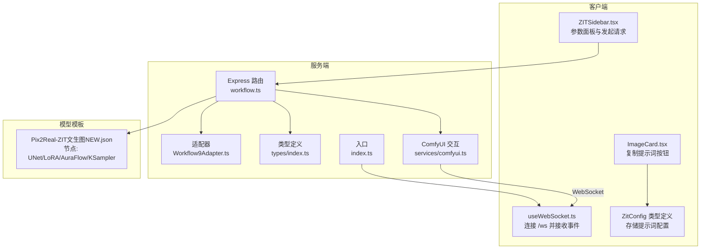
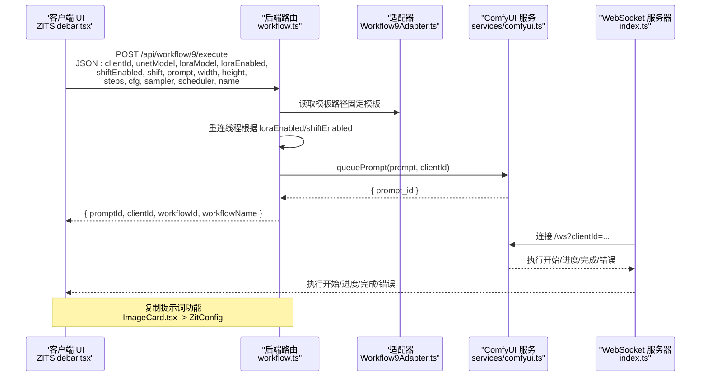
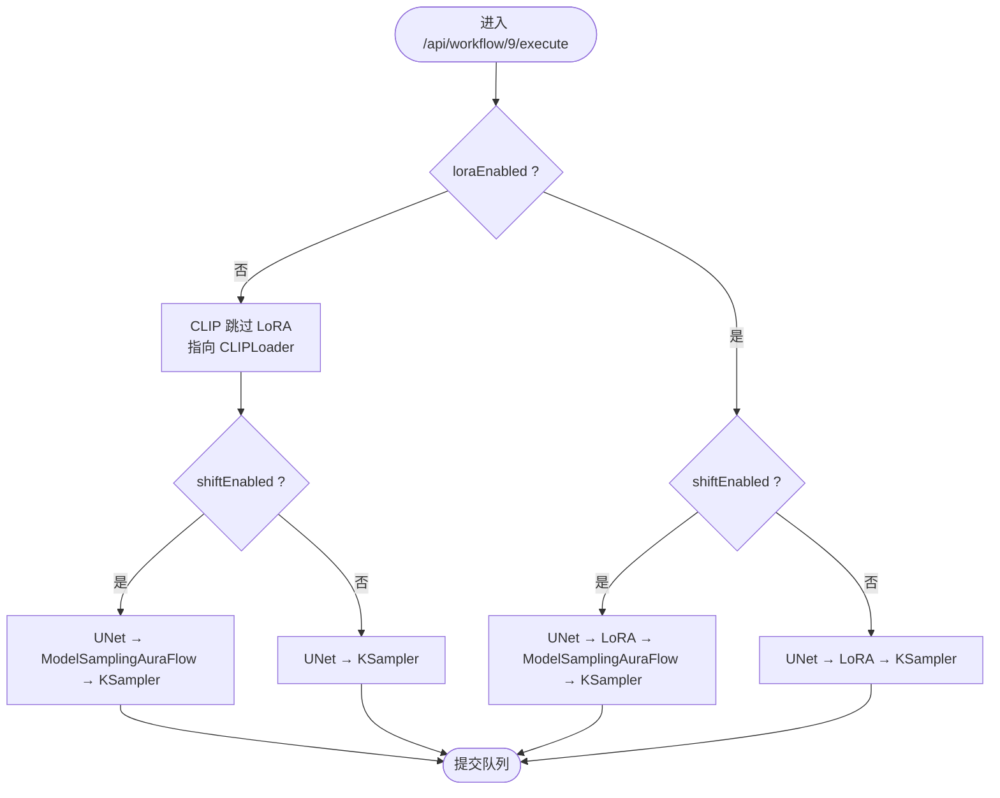
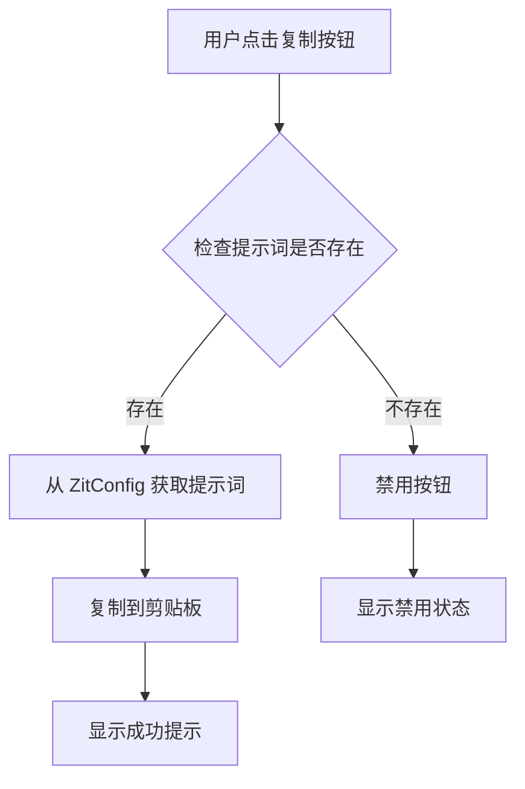
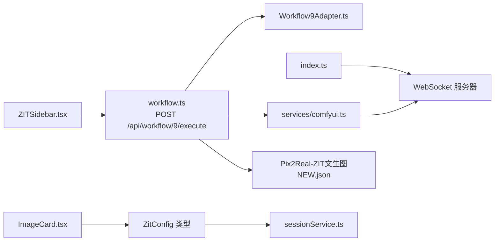

# ZIT快出工作流 API

<cite>
**本文档引用的文件**
- [server/src/routes/workflow.ts](file://server/src/routes/workflow.ts)
- [server/src/services/comfyui.ts](file://server/src/services/comfyui.ts)
- [server/src/types/index.ts](file://server/src/types/index.ts)
- [server/src/adapters/Workflow9Adapter.ts](file://server/src/adapters/Workflow9Adapter.ts)
- [server/src/adapters/index.ts](file://server/src/adapters/index.ts)
- [server/src/index.ts](file://server/src/index.ts)
- [ComfyUI_API/Pix2Real-ZIT文生图NEW.json](file://ComfyUI_API/Pix2Real-ZIT文生图NEW.json)
- [client/src/components/ZITSidebar.tsx](file://client/src/components/ZITSidebar.tsx)
- [client/src/components/ImageCard.tsx](file://client/src/components/ImageCard.tsx)
- [client/src/hooks/useWebSocket.ts](file://client/src/hooks/useWebSocket.ts)
- [client/src/hooks/useWorkflowStore.ts](file://client/src/hooks/useWorkflowStore.ts)
- [client/src/services/sessionService.ts](file://client/src/services/sessionService.ts)
</cite>

## 目录
1. [简介](#简介)
2. [项目结构](#项目结构)
3. [核心组件](#核心组件)
4. [架构总览](#架构总览)
5. [详细组件分析](#详细组件分析)
6. [依赖关系分析](#依赖关系分析)
7. [性能考虑](#性能考虑)
8. [故障排除指南](#故障排除指南)
9. [结论](#结论)
10. [附录](#附录)

## 简介
本文件面向 ZIT快出工作流（Workflow 9）的 API 文档，聚焦于通过 HTTP 接口执行"ZIT快出"文本生图任务。该工作流支持 UNet 模型与 LoRA 模型的组合使用，并引入 AuraFlow 采样算法的 shift 参数以调节采样行为。**更新** 本版本新增了与 Tab7 相同的复制提示词功能，扩展了提示词处理能力，用户可以通过界面按钮直接复制当前配置的提示词内容。文档详细说明：
- HTTP 方法、URL 模式、请求参数与响应格式
- UNet 与 LoRA 组合使用策略及模型链路重连机制
- AuraFlow shift 参数的作用与调优建议
- 复制提示词功能的使用方法与应用场景
- 完整的 API 调用示例与参数配置策略
- 模型可用性检查与错误处理方案
- 性能优化建议与常见问题排查

## 项目结构
后端采用 Express + WebSocket 架构，路由集中于 workflow 路由模块；前端通过 ZITSidebar 配置参数并通过 /api/workflow/9/execute 触发生成；WebSocket 用于进度与完成事件推送。**更新** 新增了复制提示词功能，用户可以在界面中直接复制 ZIT 快出工作流的提示词配置。

**图表来源**
- [server/src/routes/workflow.ts:181-261](file://server/src/routes/workflow.ts#L181-L261)
- [server/src/adapters/Workflow9Adapter.ts:1-14](file://server/src/adapters/Workflow9Adapter.ts#L1-L14)
- [server/src/services/comfyui.ts:47-60](file://server/src/services/comfyui.ts#L47-L60)
- [server/src/index.ts:62-219](file://server/src/index.ts#L62-L219)
- [ComfyUI_API/Pix2Real-ZIT文生图NEW.json:1-172](file://ComfyUI_API/Pix2Real-ZIT文生图NEW.json#L1-L172)
- [client/src/components/ImageCard.tsx:1047-1078](file://client/src/components/ImageCard.tsx#L1047-L1078)
- [client/src/services/sessionService.ts:23-35](file://client/src/services/sessionService.ts#L23-L35)

**章节来源**
- [server/src/routes/workflow.ts:181-261](file://server/src/routes/workflow.ts#L181-L261)
- [server/src/index.ts:42-228](file://server/src/index.ts#L42-L228)

## 核心组件
- 工作流路由：提供 /api/workflow/9/execute 接口，负责解析请求参数、加载模板、重连线程、提交到 ComfyUI 队列并返回 promptId。
- 适配器：Workflow9Adapter 定义工作流元数据（如 needsPrompt=false），并声明 ZIT快出专用路由。
- ComfyUI 服务：封装上传、入队、历史查询、系统统计、WebSocket 连接等能力。
- 类型定义：统一请求/响应结构、进度事件、输出文件信息等。
- 前端组件：ZITSidebar 提供 UNet/LoRA 列表、开关与参数面板，发起 /api/workflow/9/execute 请求并注册 WebSocket 事件。
- **更新** 复制提示词功能：ImageCard 组件新增复制按钮，允许用户直接复制当前 ZIT 快出配置中的提示词内容。

**章节来源**
- [server/src/adapters/Workflow9Adapter.ts:3-12](file://server/src/adapters/Workflow9Adapter.ts#L3-L12)
- [server/src/routes/workflow.ts:181-261](file://server/src/routes/workflow.ts#L181-L261)
- [server/src/services/comfyui.ts:228-253](file://server/src/services/comfyui.ts#L228-L253)
- [server/src/types/index.ts:38-51](file://server/src/types/index.ts#L38-L51)
- [client/src/components/ZITSidebar.tsx:137-156](file://client/src/components/ZITSidebar.tsx#L137-L156)
- [client/src/components/ImageCard.tsx:1047-1078](file://client/src/components/ImageCard.tsx#L1047-L1078)

## 架构总览
下图展示从客户端到 ComfyUI 的完整调用链，以及 WebSocket 事件回传流程。**更新** 新增了复制提示词的前端交互流程。

**图表来源**
- [server/src/routes/workflow.ts:181-261](file://server/src/routes/workflow.ts#L181-L261)
- [server/src/services/comfyui.ts:47-60](file://server/src/services/comfyui.ts#L47-L60)
- [server/src/index.ts:92-189](file://server/src/index.ts#L92-L189)
- [client/src/components/ZITSidebar.tsx:137-156](file://client/src/components/ZITSidebar.tsx#L137-L156)
- [client/src/components/ImageCard.tsx:1047-1078](file://client/src/components/ImageCard.tsx#L1047-L1078)

## 详细组件分析

### API 接口定义：POST /api/workflow/9/execute
- 方法：POST
- 路径：/api/workflow/9/execute
- 内容类型：application/json
- 请求体字段（均为必填或可选，视业务逻辑而定）：
  - clientId: 字符串，必需
  - unetModel: 字符串，必需（UNet 模型名称）
  - loraModel: 字符串，必需（LoRA 模型名称）
  - loraEnabled: 布尔值，控制是否启用 LoRA
  - shiftEnabled: 布尔值，控制是否启用 AuraFlow shift
  - shift: 数值，默认 3（AuraFlow shift 参数）
  - prompt: 字符串，可选（覆盖默认提示词）
  - width/height: 数值，图像尺寸
  - steps: 数值，采样步数
  - cfg: 数值，CFG 强度
  - sampler: 字符串，采样器名称
  - scheduler: 字符串，调度器名称
  - name: 字符串，可选（输出文件前缀）

- 响应体字段：
  - promptId: 字符串（ComfyUI 生成的任务标识）
  - clientId: 字符串
  - workflowId: 数字（9）
  - workflowName: 字符串（ZIT快出）

- 错误处理：
  - 缺少 clientId：返回 400
  - 其他异常：返回 500 及错误消息

**章节来源**
- [server/src/routes/workflow.ts:181-261](file://server/src/routes/workflow.ts#L181-L261)
- [server/src/types/index.ts:38-40](file://server/src/types/index.ts#L38-L40)

### 模型链路重连机制（LoRA 与 AuraFlow Shift）
工作流根据 loraEnabled 与 shiftEnabled 的组合动态重连线程：
- 默认链路：UNet → LoRA → ModelSamplingAuraFlow → KSampler；CLIP 路径：LoRA → CLIPTextEncode
- 关闭 LoRA：CLIP 直接从 CLIPLoader 输出；若开启 shift，则 UNet → ModelSamplingAuraFlow → KSampler；否则 UNet → KSampler
- 开启 LoRA 但关闭 shift：UNet → LoRA → KSampler
- 两者均开启：保持默认链路

**图表来源**
- [server/src/routers/workflow.ts:227-243](file://server/src/routers/workflow.ts#L227-L243)

**章节来源**
- [server/src/routers/workflow.ts:208-247](file://server/src/routers/workflow.ts#L208-L247)

### AuraFlow Shift 参数的作用
- 位置：ModelSamplingAuraFlow 节点的 shift 输入
- 作用：调整采样算法的偏移量，影响生成图像的风格与细节表现
- 默认值：3（可在请求体中覆盖）
- 调优建议：
  - 较小 shift（如 1~2）：更贴近原始 UNet 行为，适合稳定生成
  - 中等 shift（如 3~4）：平衡细节与稳定性
  - 较大 shift（如 5）：可能增强细节但易导致不稳定，需配合 CFG 与 steps 调整

**章节来源**
- [server/src/routers/workflow.ts:212-213](file://server/src/routers/workflow.ts#L212-L213)
- [ComfyUI_API/Pix2Real-ZIT文生图NEW.json:159-171](file://ComfyUI_API/Pix2Real-ZIT文生图NEW.json#L159-L171)

### 复制提示词功能
**更新** 新增的复制提示词功能允许用户直接复制 ZIT 快出工作流的提示词配置：

- 功能位置：ImageCard 组件中的复制按钮
- 触发方式：点击复制按钮（Copy 图标）
- 数据来源：从 ZitConfig 中获取当前配置的提示词内容
- 使用场景：
  - 快速分享生成参数给其他用户
  - 在不同工作流间复用提示词配置
  - 导出参数设置用于后续批量生成
- 状态控制：当没有可用提示词时按钮禁用，显示半透明状态

**图表来源**
- [client/src/components/ImageCard.tsx:1047-1078](file://client/src/components/ImageCard.tsx#L1047-L1078)

**章节来源**
- [client/src/components/ImageCard.tsx:1047-1078](file://client/src/components/ImageCard.tsx#L1047-L1078)
- [client/src/services/sessionService.ts:23-35](file://client/src/services/sessionService.ts#L23-L35)

### 模型可用性检查与错误处理
- 模型列表查询：
  - GET /api/workflow/models/unets：返回可用 UNet 列表
  - GET /api/workflow/models/loras：返回可用 LoRA 列表
- 错误处理：
  - ComfyUI 不可用：返回 502 空数组或错误信息
  - 上传失败/入队失败：抛出错误并返回 500
  - WebSocket 连接断开：自动重连（客户端侧）

**章节来源**
- [server/src/routers/workflow.ts:151-179](file://server/src/routers/workflow.ts#L151-L179)
- [server/src/services/comfyui.ts:228-253](file://server/src/services/comfyui.ts#L228-L253)
- [client/src/hooks/useWebSocket.ts:53-73](file://client/src/hooks/useWebSocket.ts#L53-L73)

### 完整 API 调用示例
- 基本请求（启用 LoRA 与 Shift）
  - 方法：POST
  - URL：/api/workflow/9/execute
  - Body：
    {
      "clientId": "your_client_id",
      "unetModel": "Z-image\\z_image_turbo_bf16.safetensors",
      "loraModel": "YJY\\Lora_YJY_000002750.safetensors",
      "loraEnabled": true,
      "shiftEnabled": true,
      "shift": 3,
      "prompt": "提示词内容",
      "width": 768,
      "height": 1344,
      "steps": 9,
      "cfg": 1,
      "sampler": "euler",
      "scheduler": "simple",
      "name": "zit_output"
    }
- 关闭 LoRA（仅 UNet + Shift）
  - 将 loraEnabled 设为 false，同时保持 shiftEnabled 为 true
- 关闭 Shift（仅 UNet + LoRA）
  - 将 shiftEnabled 设为 false，保持 loraEnabled 为 true
- 仅 UNet（不启用 LoRA 且不启用 Shift）
  - 将 loraEnabled 与 shiftEnabled 均设为 false

**章节来源**
- [server/src/routers/workflow.ts:181-261](file://server/src/routers/workflow.ts#L181-L261)
- [client/src/components/ZITSidebar.tsx:107-156](file://client/src/components/ZITSidebar.tsx#L107-L156)

### 参数配置策略与效果差异
- UNet + LoRA + Shift：风格增强与细节提升，适合高质量人像；需注意 CFG 与 steps 的平衡
- UNet + LoRA（无 Shift）：更接近传统扩散管线，稳定性较好
- UNet（无 LoRA，可选 Shift）：基础生成，适合快速迭代与对比
- Prompt 为空：保留模板默认提示词；非空则覆盖

**章节来源**
- [server/src/routers/workflow.ts:224-226](file://server/src/routers/workflow.ts#L224-L226)
- [ComfyUI_API/Pix2Real-ZIT文生图NEW.json:32-43](file://ComfyUI_API/Pix2Real-ZIT文生图NEW.json#L32-L43)

## 依赖关系分析
- 路由层依赖适配器与 ComfyUI 服务，负责参数校验、模板填充与链路重连
- 适配器提供工作流元数据，声明 ZIT快出使用专用路由
- WebSocket 层负责事件转发与输出下载
- 前端组件负责参数收集与请求发起
- **更新** 复制提示词功能依赖 ZitConfig 类型定义来存储和访问提示词配置

**图表来源**
- [server/src/routers/workflow.ts:181-261](file://server/src/routers/workflow.ts#L181-L261)
- [server/src/adapters/Workflow9Adapter.ts:1-14](file://server/src/adapters/Workflow9Adapter.ts#L1-L14)
- [server/src/services/comfyui.ts:47-60](file://server/src/services/comfyui.ts#L47-L60)
- [server/src/index.ts:62-219](file://server/src/index.ts#L62-L219)
- [ComfyUI_API/Pix2Real-ZIT文生图NEW.json:1-172](file://ComfyUI_API/Pix2Real-ZIT文生图NEW.json#L1-L172)
- [client/src/components/ImageCard.tsx:1047-1078](file://client/src/components/ImageCard.tsx#L1047-L1078)
- [client/src/services/sessionService.ts:23-35](file://client/src/services/sessionService.ts#L23-L35)

**章节来源**
- [server/src/adapters/index.ts:1-31](file://server/src/adapters/index.ts#L1-L31)
- [server/src/routers/workflow.ts:1-28](file://server/src/routers/workflow.ts#L1-L28)

## 性能考虑
- 采样参数权衡：较高的 steps 与合适的 cfg 可提升质量，但会增加耗时；建议从较低 steps（如 9）起步，逐步提升
- Shift 参数：较大的 shift 可能带来更丰富的细节，但也可能增加失败率；建议结合 LoRA 使用以获得更稳定的提升
- 并发与队列：合理利用批量生成与队列优先级功能，避免长时间等待
- 内存管理：在需要时调用释放内存接口，避免显存碎片化导致的性能下降
- **更新** 复制提示词功能：该功能仅涉及前端操作，不会对生成性能产生影响

## 故障排除指南
- 无法连接 ComfyUI
  - 检查服务端日志与网络连通性
  - 使用 GET /api/workflow/system-stats 查看 VRAM/内存占用
- 生成失败或卡住
  - 查看 WebSocket 事件中的 error 类型消息
  - 检查模型名称是否正确（通过 GET /api/workflow/models/unets 与 /api/workflow/models/loras 获取）
- 输出缺失
  - 确认 SaveImage 节点输出类型为 output
  - 检查会话输出目录权限与磁盘空间
- **更新** 复制提示词失败
  - 检查当前是否有有效的提示词配置
  - 确认浏览器支持 Clipboard API
  - 尝试手动选择并复制提示词内容

**章节来源**
- [server/src/routers/workflow.ts:532-540](file://server/src/routers/workflow.ts#L532-L540)
- [server/src/services/comfyui.ts:106-125](file://server/src/services/comfyui.ts#L106-L125)
- [server/src/index.ts:177-188](file://server/src/index.ts#L177-L188)
- [client/src/components/ImageCard.tsx:1054-1058](file://client/src/components/ImageCard.tsx#L1054-L1058)

## 结论
ZIT快出工作流通过灵活的 UNet/LoRA/Shift 组合，为高质量文本生图提供了可控的参数空间。**更新** 新增的复制提示词功能进一步提升了用户体验，使用户能够便捷地分享和复用生成参数。借助模板重连机制与 WebSocket 实时反馈，用户可以高效地进行参数调试与批量生成。建议从默认配置入手，逐步微调以达到最佳效果，并结合内存管理与队列策略提升整体效率。

## 附录

### API 定义汇总
- POST /api/workflow/9/execute
  - 请求体：clientId, unetModel, loraModel, loraEnabled, shiftEnabled, shift, prompt, width, height, steps, cfg, sampler, scheduler, name
  - 响应体：promptId, clientId, workflowId, workflowName
  - 错误：400（缺少 clientId）、500（内部错误）

**章节来源**
- [server/src/routes/workflow.ts:181-261](file://server/src/routes/workflow.ts#L181-L261)

### 模型可用性检查
- GET /api/workflow/models/unets
- GET /api/workflow/models/loras
- 返回：字符串数组（模型名称列表）

**章节来源**
- [server/src/routers/workflow.ts:151-179](file://server/src/routers/workflow.ts#L151-L179)
- [server/src/services/comfyui.ts:228-253](file://server/src/services/comfyui.ts#L228-L253)

### WebSocket 事件
- 客户端注册：发送 { type: "register", promptId, workflowId, sessionId, tabId }
- 事件类型：execution_start、progress、complete、error
- 事件内容：包含 promptId、进度百分比、输出文件列表或错误消息

**章节来源**
- [server/src/index.ts:92-189](file://server/src/index.ts#L92-L189)
- [client/src/hooks/useWebSocket.ts:26-73](file://client/src/hooks/useWebSocket.ts#L26-L73)
- [server/src/types/index.ts:10-28](file://server/src/types/index.ts#L10-L28)

### ZIT 快出配置类型定义
**更新** 新增 ZitConfig 类型定义，用于存储 ZIT 快出工作流的完整配置：

- unetModel: UNet 模型名称
- loras: LoRA 模型列表及权重配置
- shiftEnabled: 是否启用 AuraFlow shift
- shift: shift 参数值
- prompt: 提示词内容
- width/height: 图像尺寸
- steps: 采样步数
- cfg: CFG 强度
- sampler: 采样器名称
- scheduler: 调度器名称

**章节来源**
- [client/src/services/sessionService.ts:23-35](file://client/src/services/sessionService.ts#L23-L35)